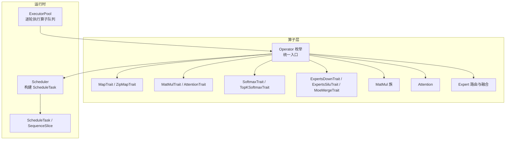
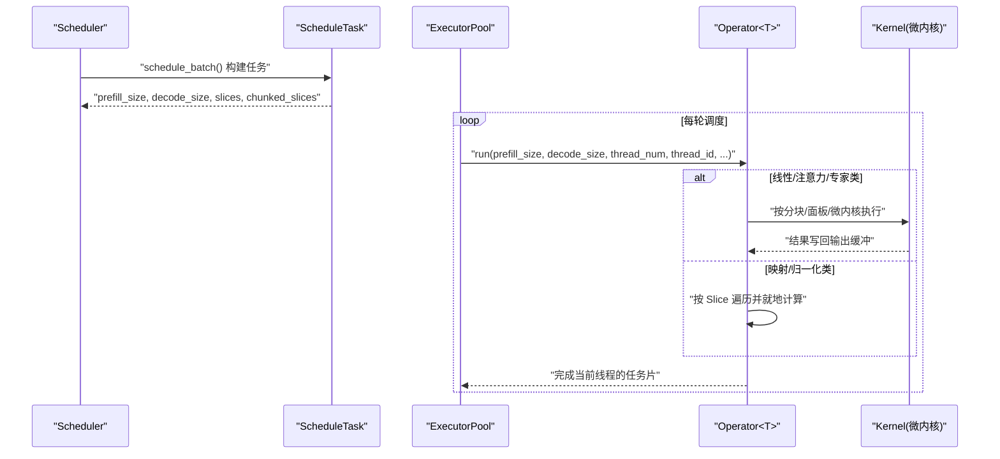
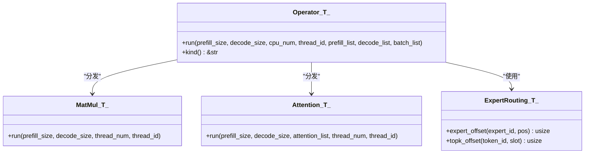
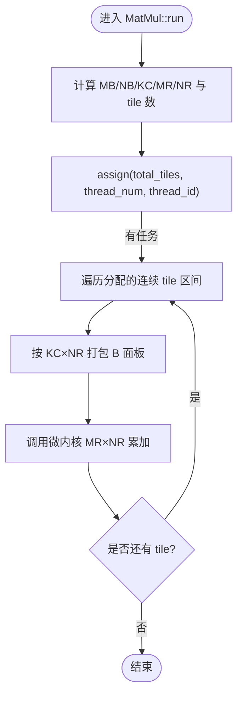
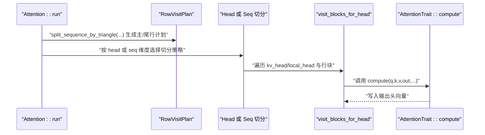
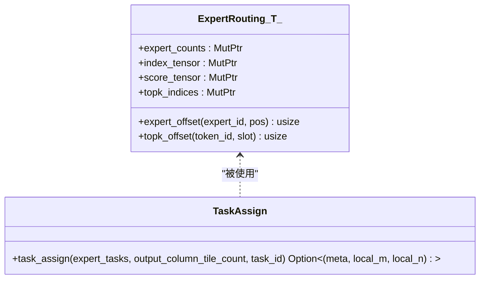
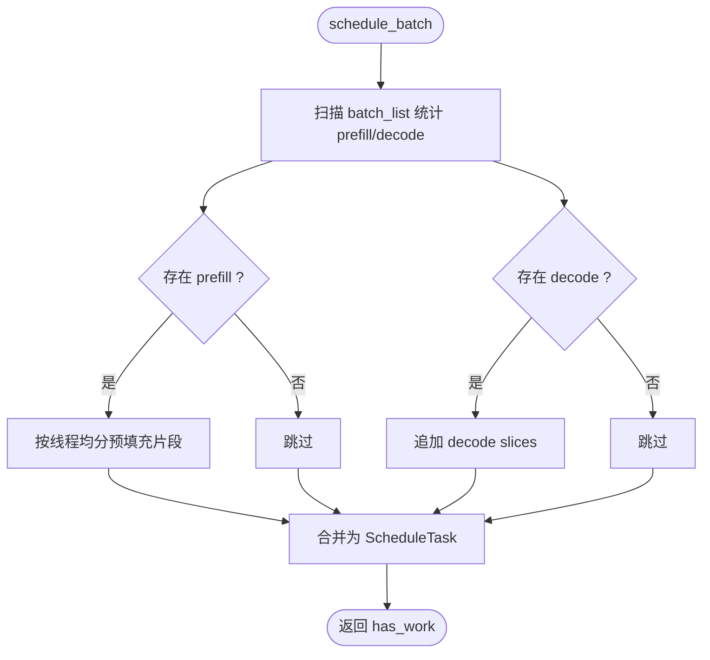
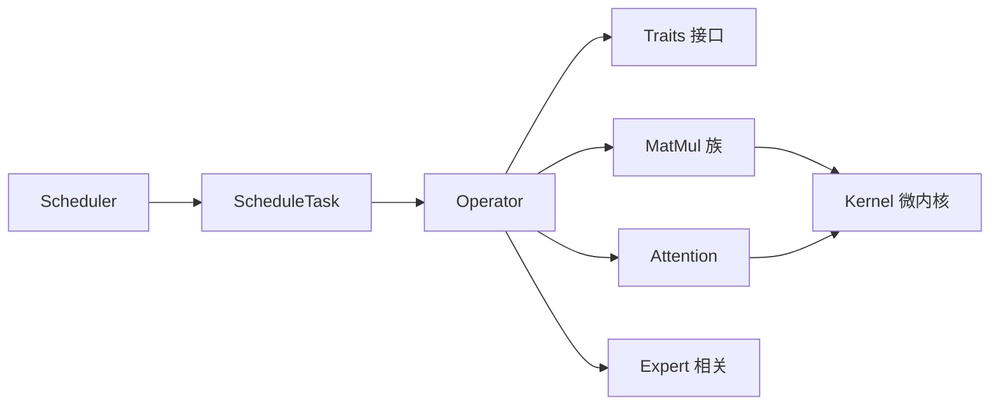

# 算子架构设计

<cite>
**本文引用的文件**   
- [src/operators/mod.rs](file://src/operators/mod.rs)
- [src/operators/operator.rs](file://src/operators/operator.rs)
- [src/operators/traits/map.rs](file://src/operators/traits/map.rs)
- [src/operators/traits/linear.rs](file://src/operators/traits/linear.rs)
- [src/operators/traits/expert.rs](file://src/operators/traits/expert.rs)
- [src/operators/traits/softmax.rs](file://src/operators/traits/softmax.rs)
- [src/operators/matmul/matmul.rs](file://src/operators/matmul/matmul.rs)
- [src/operators/attention/attention.rs](file://src/operators/attention/attention.rs)
- [src/operators/expert/expert_routing.rs](file://src/operators/expert/expert_routing.rs)
- [src/runtime/scheduler/scheduler.rs](file://src/runtime/scheduler/scheduler.rs)
- [src/runtime/scheduler/task.rs](file://src/runtime/scheduler/task.rs)
- [docs/design/operators/matmul.md](file://docs/design/operators/matmul.md)
- [docs/contributing/new_operator.md](file://docs/contributing/new_operator.md)
</cite>

## 目录
1. [简介](#简介)
2. [项目结构](#项目结构)
3. [核心组件](#核心组件)
4. [架构总览](#架构总览)
5. [详细组件分析](#详细组件分析)
6. [依赖关系分析](#依赖关系分析)
7. [性能与内存布局](#性能与内存布局)
8. [自定义算子开发指南](#自定义算子开发指南)
9. [故障排查](#故障排查)
10. [结论](#结论)

## 简介
本技术文档围绕 eLLM 的算子（Operator）架构进行系统化阐述，覆盖统一接口与类型系统、生命周期管理、执行流程与线程安全、注册与动态调度机制、参数传递与内存布局优化策略，以及自定义算子的开发与测试方法。同时提供算子组合与流水线执行的参考示例路径，帮助读者快速理解并扩展系统能力。

## 项目结构
eLLM 的算子系统位于 src/operators 下，采用“枚举统一入口 + 多模块分类实现”的组织方式：
- 统一入口：Operator<T> 枚举集中分发所有算子变体，并提供 run/kind 等统一接口。
- 分类模块：按功能域划分，如 matmul、attention、expert、transform、softmax、elementwise、normalization 等。
- 抽象接口：traits 目录下定义 MapTrait、ZipMapTrait、MatMulTrait、AttentionTrait、SoftmaxTrait 等，用于约束不同算子的计算语义。
- 运行时集成：Scheduler 负责将批任务切分为 SequenceSlice，供各算子在 run 中消费；ExecutorPool 在每轮调度中依次执行 Operator 队列。

图表来源
- [src/operators/operator.rs:32-224](file://src/operators/operator.rs#L32-L224)
- [src/operators/mod.rs:1-109](file://src/operators/mod.rs#L1-L109)
- [src/runtime/scheduler/scheduler.rs:15-82](file://src/runtime/scheduler/scheduler.rs#L15-L82)
- [src/runtime/scheduler/task.rs:1-49](file://src/runtime/scheduler/task.rs#L1-L49)

章节来源
- [src/operators/mod.rs:1-109](file://src/operators/mod.rs#L1-L109)
- [src/operators/operator.rs:32-224](file://src/operators/operator.rs#L32-L224)
- [src/runtime/scheduler/scheduler.rs:15-82](file://src/runtime/scheduler/scheduler.rs#L15-L82)
- [src/runtime/scheduler/task.rs:1-49](file://src/runtime/scheduler/task.rs#L1-L49)

## 核心组件
- Operator<T> 枚举：集中承载所有算子变体，提供统一的 run 和 kind 接口，屏蔽具体实现差异。
- 算子 trait 体系：
  - MapTrait/ZipMapTrait：标量/元素级映射与双输入合并。
  - MatMulTrait/MatMulAddTrait/MatMulSigmoidTrait/MatMulkqvTrait：矩阵乘法及其融合变体。
  - AttentionTrait：注意力计算的行/列分块访问与归约接口。
  - SoftmaxTrait/TopKSoftmaxTrait/ExpertsTopkNormTrait：概率归一化与 Top-K 选择。
  - ExpertsDownTrait/ExpertsSiluTrait/MoeMergeTrait：MoE 专家层的下采样、门控激活与合并。
- Scheduler 与 ScheduleTask：将批内序列切片为 SequenceSlice，组织 prefill 与 decode 阶段的 token 范围，并按线程维度拆分预填充片段。
- ExecutorPool：每轮调度依次调用各 Operator::run，形成流水线式执行。

章节来源
- [src/operators/operator.rs:32-224](file://src/operators/operator.rs#L32-L224)
- [src/operators/traits/map.rs:1-8](file://src/operators/traits/map.rs#L1-L8)
- [src/operators/traits/linear.rs:1-96](file://src/operators/traits/linear.rs#L1-L96)
- [src/operators/traits/softmax.rs:1-49](file://src/operators/traits/softmax.rs#L1-L49)
- [src/operators/traits/expert.rs:1-56](file://src/operators/traits/expert.rs#L1-L56)
- [src/runtime/scheduler/scheduler.rs:15-82](file://src/runtime/scheduler/scheduler.rs#L15-L82)
- [src/runtime/scheduler/task.rs:1-49](file://src/runtime/scheduler/task.rs#L1-L49)

## 架构总览
下图展示了从调度到算子执行的关键数据流与控制流：

图表来源
- [src/runtime/scheduler/scheduler.rs:66-131](file://src/runtime/scheduler/scheduler.rs#L66-L131)
- [src/operators/operator.rs:79-198](file://src/operators/operator.rs#L79-L198)
- [src/operators/matmul/matmul.rs:165-288](file://src/operators/matmul/matmul.rs#L165-L288)
- [src/operators/attention/attention.rs:439-505](file://src/operators/attention/attention.rs#L439-L505)

## 详细组件分析

### Operator 枚举与统一接口
- 统一入口：Operator<T> 通过 match 分支将 run 请求转发至具体算子实例。
- 线程安全：对包含裸指针的变体，显式实现 Send/Sync，前提是 T 为 POD-like 且内部缓冲区按线程分区使用。
- 类型约束：run 的参数包括 prefill_size、decode_size、thread_num、thread_id 及 slice 列表，便于按阶段与线程粒度并行。

图表来源
- [src/operators/operator.rs:32-224](file://src/operators/operator.rs#L32-L224)
- [src/operators/matmul/matmul.rs:27-51](file://src/operators/matmul/matmul.rs#L27-L51)
- [src/operators/attention/attention.rs:14-37](file://src/operators/attention/attention.rs#L14-L37)
- [src/operators/expert/expert_routing.rs:44-65](file://src/operators/expert/expert_routing.rs#L44-L65)

章节来源
- [src/operators/operator.rs:32-224](file://src/operators/operator.rs#L32-L224)

### 矩阵乘法 MatMul 族
- 设计要点：
  - 宏块/微块分层：MB/NB/KC/MR/NR 控制外层分块与微内核尺寸。
  - B 面板打包：在 new 阶段将权重按 KC×NR 面板预打包，避免运行期重复转置/重排。
  - 线程私有 scratch：b_panel_pool 与 acc_pool 按线程分配，避免竞争与伪共享。
  - 静态任务分割：assign(total_tiles, thread_num, thread_id) 返回连续区间，保证缓存友好。
- 执行流程：
  - 计算 tile 总数，按线程切分连续 tile 区间。
  - 每个 tile 内部沿 K 方向循环，加载 B 面板，调用微内核累加。
  - 支持 f16 的 AVX-512FP16 加速路径与标量回退路径。

图表来源
- [src/operators/matmul/matmul.rs:165-288](file://src/operators/matmul/matmul.rs#L165-L288)
- [docs/design/operators/matmul.md:108-210](file://docs/design/operators/matmul.md#L108-L210)

章节来源
- [src/operators/matmul/matmul.rs:27-51](file://src/operators/matmul/matmul.rs#L27-L51)
- [src/operators/matmul/matmul.rs:165-288](file://src/operators/matmul/matmul.rs#L165-L288)
- [docs/design/operators/matmul.md:108-210](file://docs/design/operators/matmul.md#L108-L210)

### 注意力 Attention
- 访问计划：根据 row_step 与 col_step 将行划分为对齐主段与尾部非对齐段，分别走 visit_aligned_row_range 与 visit_tail_row_range。
- 并行策略：当单条序列长度较小但线程较多时，优先按 head 维度切分；否则按 sequence 维度切分。
- 线程局部 scratch：running_max/denom/scores 按线程与行块大小分配，避免跨线程竞争。

图表来源
- [src/operators/attention/attention.rs:439-505](file://src/operators/attention/attention.rs#L439-L505)
- [src/operators/attention/attention.rs:157-270](file://src/operators/attention/attention.rs#L157-L270)
- [src/operators/traits/linear.rs:1-22](file://src/operators/traits/linear.rs#L1-L22)

章节来源
- [src/operators/attention/attention.rs:14-37](file://src/operators/attention/attention.rs#L14-L37)
- [src/operators/attention/attention.rs:439-505](file://src/operators/attention/attention.rs#L439-L505)

### MoE 专家路由与融合
- ExpertRouting：维护 expert_counts、index_tensor、score_tensor、topk_indices 等紧凑结构，支持从稠密路由结果构造或空初始化。
- 任务映射：task_assign 将全局 task id 映射到对应 expert 与其内部的局部 tile，便于后续专家层并行计算。

图表来源
- [src/operators/expert/expert_routing.rs:44-65](file://src/operators/expert/expert_routing.rs#L44-L65)
- [src/operators/expert/expert_routing.rs:26-41](file://src/operators/expert/expert_routing.rs#L26-L41)

章节来源
- [src/operators/expert/expert_routing.rs:44-65](file://src/operators/expert/expert_routing.rs#L44-L65)
- [src/operators/expert/expert_routing.rs:26-41](file://src/operators/expert/expert_routing.rs#L26-L41)

### 调度器与任务模型
- Scheduler：扫描 SlotState，统计 prefill 与 decode 数量，构建 ScheduleTask，并将长 prefill 切分为 per-thread 的 prefilling_chunked_slices。
- ScheduleTask：携带 prefill_size、decode_size、slices 与 per-thread 的 chunked_slices，供算子按 Slice 遍历处理。

图表来源
- [src/runtime/scheduler/scheduler.rs:66-131](file://src/runtime/scheduler/scheduler.rs#L66-L131)
- [src/runtime/scheduler/scheduler.rs:133-222](file://src/runtime/scheduler/scheduler.rs#L133-L222)
- [src/runtime/scheduler/task.rs:10-49](file://src/runtime/scheduler/task.rs#L10-L49)

章节来源
- [src/runtime/scheduler/scheduler.rs:66-131](file://src/runtime/scheduler/scheduler.rs#L66-L131)
- [src/runtime/scheduler/task.rs:10-49](file://src/runtime/scheduler/task.rs#L10-L49)

## 依赖关系分析
- Operator 枚举依赖 traits 定义的接口，并在 run 中匹配到具体实现。
- MatMul/Attention 等复杂算子依赖 kernel 层的微内核实现（例如 x86_64/f16_512 路径）。
- Scheduler 产出 ScheduleTask，算子据此读取 Slice 信息，按线程与 token 范围执行。
- ExpertRouting 作为中间数据结构，被专家层算子消费以进行紧凑计算。

图表来源
- [src/operators/mod.rs:1-109](file://src/operators/mod.rs#L1-L109)
- [src/operators/operator.rs:32-224](file://src/operators/operator.rs#L32-L224)
- [src/operators/matmul/matmul.rs:27-51](file://src/operators/matmul/matmul.rs#L27-L51)
- [src/operators/attention/attention.rs:14-37](file://src/operators/attention/attention.rs#L14-L37)
- [src/runtime/scheduler/scheduler.rs:15-82](file://src/runtime/scheduler/scheduler.rs#L15-L82)

章节来源
- [src/operators/mod.rs:1-109](file://src/operators/mod.rs#L1-L109)
- [src/operators/operator.rs:32-224](file://src/operators/operator.rs#L32-L224)

## 性能与内存布局
- 矩阵乘法
  - 宏块/微块分层与 B 面板打包显著提升访存局部性与 SIMD/FMA 利用率。
  - 线程私有 scratch 避免竞争与伪共享，保持高吞吐。
  - 静态 tile 分割保证连续写入与良好缓存预测。
- 注意力
  - 行步长 row_step 与列步长 col_step 控制分块粒度，兼顾对齐与尾部处理。
  - 按 head 或 seq 维度的自适应切分提升小批量场景的并行度。
- 专家路由
  - 紧凑 index/score 布局减少冗余存储，原子计数保障并发安全。
- 调度
  - 预填充分片按线程均衡分配，确保多核利用率与内存连续性。

章节来源
- [docs/design/operators/matmul.md:108-210](file://docs/design/operators/matmul.md#L108-L210)
- [src/operators/matmul/matmul.rs:165-288](file://src/operators/matmul/matmul.rs#L165-L288)
- [src/operators/attention/attention.rs:439-505](file://src/operators/attention/attention.rs#L439-L505)
- [src/operators/expert/expert_routing.rs:44-65](file://src/operators/expert/expert_routing.rs#L44-L65)
- [src/runtime/scheduler/scheduler.rs:133-222](file://src/runtime/scheduler/scheduler.rs#L133-L222)

## 自定义算子开发指南
- 理解算子模型
  - 算子是计算单元，由服务初始化时加入队列，每轮调度由 ExecutorPool 执行。
  - 关键类型：Operator<T>、run(thread_id, thread_num, task)、ScheduleTask。
  - 算子应保持无状态，可变请求状态保存在 BatchSequence 与槽位状态中。
- 创建算子文件
  - 在 src/operators/<category>/ 下新增文件，定义 struct 与 new/run。
  - 在父 mod.rs 中暴露模块与别名。
- 加入 Operator 枚举
  - 在 operator.rs 中添加变体，并在 run 的 match 分支中转发。
- 入队与执行
  - 在服务资源初始化处将新算子推入队列，ExecutorPool 会按序执行。
- 对齐测试
  - 编写 Python 参考脚本生成 .npy 输入/期望输出。
  - 编写 Rust 对齐二进制，加载相同输入并比较输出。
  - 在 Cargo.toml 中注册新的 bin 目标以便运行。
- 命名约定
  - 结构体 PascalCase，文件 snake_case，对齐目录 alignment/<op_name>/，测试数据 python_<op_name>_<role>.npy。

章节来源
- [docs/contributing/new_operator.md:1-143](file://docs/contributing/new_operator.md#L1-L143)

## 故障排查
- 线程安全
  - 若算子包含裸指针，需确保 Send/Sync 的实现条件满足（T 为 POD-like，且缓冲区按线程分区）。
  - 检查 AtomicUsize 的使用顺序与可见性，避免竞态。
- 调度异常
  - 确认 schedule_batch 正确更新 Phase 与 next_sequence_index。
  - 验证 prefilling_chunked_slices 的 token_start_index 与 length 累计一致。
- 数值对齐
  - 使用对齐测试框架对比 NumPy/PyTorch 参考实现，定位精度问题。
  - 关注 micro-kernel 的 MR/NR 与 KC 配置是否与硬件特性匹配。

章节来源
- [src/operators/operator.rs:226-232](file://src/operators/operator.rs#L226-L232)
- [src/runtime/scheduler/scheduler.rs:225-735](file://src/runtime/scheduler/scheduler.rs#L225-L735)
- [docs/contributing/new_operator.md:98-125](file://docs/contributing/new_operator.md#L98-L125)

## 结论
eLLM 的算子架构以 Operator<T> 枚举为核心，结合清晰的 trait 抽象与 Scheduler 的任务模型，实现了高性能、可扩展且线程安全的执行环境。通过宏块/微块分层、B 面板打包、线程私有 scratch 与静态 tile 分割，系统在 CPU 上获得良好的缓存与 SIMD/FMA 利用效率。配合完善的自定义算子开发指南与对齐测试流程，开发者可高效扩展新的计算单元，并通过流水线式调度将其无缝集成到推理链路中。