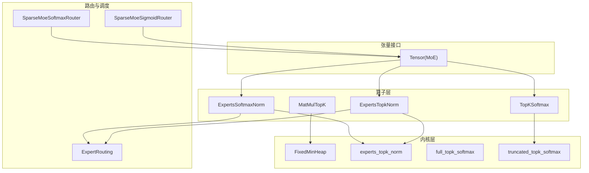
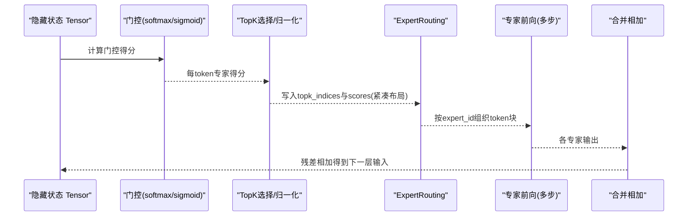
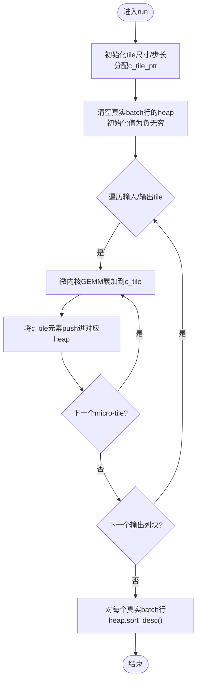
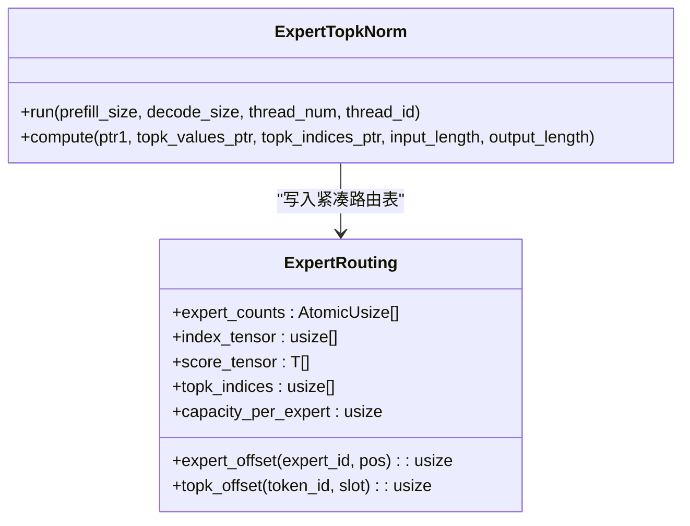
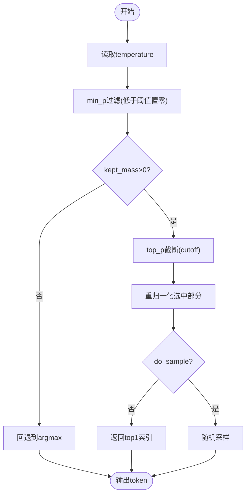
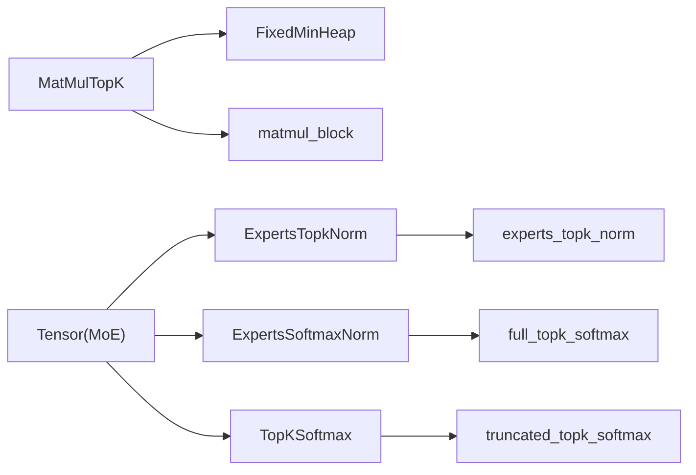

# TopK选择算子

<cite>
**本文引用的文件**   
- [src/operators/matmul/matmul_topk.rs](file://src/operators/matmul/matmul_topk.rs)
- [src/kernel/common/heap.rs](file://src/kernel/common/heap.rs)
- [src/kernel/scalar/experts_topk_norm.rs](file://src/kernel/scalar/experts_topk_norm.rs)
- [src/kernel/scalar/full_topk_softmax.rs](file://src/kernel/scalar/full_topk_softmax.rs)
- [src/kernel/scalar/truncated_topk_softmax.rs](file://src/kernel/scalar/truncated_topk_softmax.rs)
- [src/operators/expert/expert_routing.rs](file://src/operators/expert/expert_routing.rs)
- [src/operators/expert/expert_topk_norm.rs](file://src/operators/expert/expert_topk_norm.rs)
- [src/operators/softmax/topk_softmax.rs](file://src/operators/softmax/topk_softmax.rs)
- [src/tensor/moe.rs](file://src/tensor/moe.rs)
- [src/transformer/sparse_moe/router_softmax.rs](file://src/transformer/sparse_moe/router_softmax.rs)
- [src/transformer/sparse_moe/router_sigmoid.rs](file://src/transformer/sparse_moe/router_sigmoid.rs)
- [src/transformer/config/router_scoring.rs](file://src/transformer/config/router_scoring.rs)
</cite>

## 目录
1. [简介](#简介)
2. [项目结构](#项目结构)
3. [核心组件](#核心组件)
4. [架构总览](#架构总览)
5. [详细组件分析](#详细组件分析)
6. [依赖关系分析](#依赖关系分析)
7. [性能考量](#性能考量)
8. [故障排查指南](#故障排查指南)
9. [结论](#结论)
10. [附录](#附录)

## 简介
本技术文档聚焦于 TopK 选择算子在专家混合网络（MoE）中的实现与应用，重点解析 MatMulTopK 的设计与数据流、TopK 排序与堆优化策略、与矩阵乘法的集成方式、稀疏路由的计算效率与负载均衡机制，以及 TopK 参数配置与性能影响。同时提供在 MoE 架构中高效选择和组合专家网络的示例流程、性能优化技巧与调试方法。

## 项目结构
围绕 TopK 与 MoE 的关键代码分布在以下模块：
- 算子层：MatMulTopK、ExpertsSoftmaxNorm、ExpertsTopkNorm、TopKSoftmax
- 内核层：FixedMinHeap、experts_topk_norm、full_topk_softmax、truncated_topk_softmax
- 路由与调度：ExpertRouting、router_softmax、router_sigmoid
- 张量接口：Tensor::softmax_norm / topk_norm / sigmoid_gate / experts_matmul_* / experts_merge_add

图表来源
- [src/operators/matmul/matmul_topk.rs](file://src/operators/matmul/matmul_topk.rs)
- [src/kernel/common/heap.rs](file://src/kernel/common/heap.rs)
- [src/kernel/scalar/experts_topk_norm.rs](file://src/kernel/scalar/experts_topk_norm.rs)
- [src/kernel/scalar/full_topk_softmax.rs](file://src/kernel/scalar/full_topk_softmax.rs)
- [src/kernel/scalar/truncated_topk_softmax.rs](file://src/kernel/scalar/truncated_topk_softmax.rs)
- [src/operators/expert/expert_routing.rs](file://src/operators/expert/expert_routing.rs)
- [src/operators/expert/expert_topk_norm.rs](file://src/operators/expert/expert_topk_norm.rs)
- [src/operators/softmax/topk_softmax.rs](file://src/operators/softmax/topk_softmax.rs)
- [src/tensor/moe.rs](file://src/tensor/moe.rs)
- [src/transformer/sparse_moe/router_softmax.rs](file://src/transformer/sparse_moe/router_softmax.rs)
- [src/transformer/sparse_moe/router_sigmoid.rs](file://src/transformer/sparse_moe/router_sigmoid.rs)

章节来源
- [src/operators/matmul/matmul_topk.rs](file://src/operators/matmul/matmul_topk.rs)
- [src/kernel/common/heap.rs](file://src/kernel/common/heap.rs)
- [src/operators/expert/expert_routing.rs](file://src/operators/expert/expert_routing.rs)
- [src/operators/expert/expert_topk_norm.rs](file://src/operators/expert/expert_topk_norm.rs)
- [src/operators/softmax/topk_softmax.rs](file://src/operators/softmax/topk_softmax.rs)
- [src/tensor/moe.rs](file://src/tensor/moe.rs)
- [src/transformer/sparse_moe/router_softmax.rs](file://src/transformer/sparse_moe/router_softmax.rs)
- [src/transformer/sparse_moe/router_sigmoid.rs](file://src/transformer/sparse_moe/router_sigmoid.rs)

## 核心组件
- MatMulTopK：将“打分”（输入与权重面板的点积）与“TopK选择”融合，按线程为每个 batch 行维护固定大小的最小堆，增量更新候选专家并最后降序输出。
- FixedMinHeap：容量固定的最小堆，支持 push、sort_desc，比较时值相等则按索引稳定排序。
- ExpertsTopkNorm：对每 token 的专家得分做 TopK 选择与归一化，并将结果写入 ExpertRouting 的紧凑布局。
- ExpertsSoftmaxNorm：对每 token 的专家得分做 TopK Softmax 归一化，再写入 ExpertRouting。
- TopKSoftmax：生成阶段的 TopK+温度+Top-P/Min-P 过滤采样，内部使用 truncated_topk_softmax。
- ExpertRouting：保存每个专家的 token 列表与分数，用于后续专家计算与合并。
- SparseMoeSoftmaxRouter/SparseMoeSigmoidRouter：门控网络的前向路径，分别调用 softmax_norm 或 sigmoid_gate + topk_norm。

章节来源
- [src/operators/matmul/matmul_topk.rs](file://src/operators/matmul/matmul_topk.rs)
- [src/kernel/common/heap.rs](file://src/kernel/common/heap.rs)
- [src/kernel/scalar/experts_topk_norm.rs](file://src/kernel/scalar/experts_topk_norm.rs)
- [src/operators/expert/expert_topk_norm.rs](file://src/operators/expert/expert_topk_norm.rs)
- [src/operators/softmax/topk_softmax.rs](file://src/operators/softmax/topk_softmax.rs)
- [src/operators/expert/expert_routing.rs](file://src/operators/expert/expert_routing.rs)
- [src/transformer/sparse_moe/router_softmax.rs](file://src/transformer/sparse_moe/router_softmax.rs)
- [src/transformer/sparse_moe/router_sigmoid.rs](file://src/transformer/sparse_moe/router_sigmoid.rs)

## 架构总览
下图展示了从隐藏状态到专家计算的完整数据流，包括评分、TopK 选择、路由压缩、专家前向与合并。

图表来源
- [src/transformer/sparse_moe/router_softmax.rs](file://src/transformer/sparse_moe/router_softmax.rs)
- [src/transformer/sparse_moe/router_sigmoid.rs](file://src/transformer/sparse_moe/router_sigmoid.rs)
- [src/tensor/moe.rs](file://src/tensor/moe.rs)
- [src/operators/expert/expert_routing.rs](file://src/operators/expert/expert_routing.rs)

## 详细组件分析

### MatMulTopK：打分与TopK融合
- 设计要点
  - 预打包权重面板 packed_b，按 reduction_block_cols × micro_tile_cols 切分，提升缓存局部性。
  - 多线程并行：每个线程维护 per-(batch, thread) 的 FixedMinHeap，避免锁竞争。
  - 微内核 matmul_block 负责 tile 内点积累加；compute_rows 处理非对齐行数。
  - 仅对真实 batch 行清理 heap 并写入候选，padding 行跳过。
  - 最终 sort_desc 输出降序 TopK。
- 复杂度
  - 打分阶段 O(M×N×K)，TopK 阶段近似 O(M×N×log K)。
- 关键数据结构
  - 每线程 c_tile_pool 作为临时输出 tile。
  - heaps 绑定外部 indices/values buffer，stride 由 topk_simd 决定。

图表来源
- [src/operators/matmul/matmul_topk.rs](file://src/operators/matmul/matmul_topk.rs)
- [src/kernel/common/heap.rs](file://src/kernel/common/heap.rs)

章节来源
- [src/operators/matmul/matmul_topk.rs](file://src/operators/matmul/matmul_topk.rs)
- [src/kernel/common/heap.rs](file://src/kernel/common/heap.rs)

### FixedMinHeap：TopK的核心数据结构
- 特性
  - 固定容量 limit，push 时若未满直接上滤；已满则与根比较，必要时下滤替换。
  - sort_desc 通过反复弹出根并重建堆完成降序排列。
  - 比较函数在值相等时按 index 稳定排序，保证可重现性。
- 复杂度
  - push: O(log K)；sort_desc: O(K log K)。

章节来源
- [src/kernel/common/heap.rs](file://src/kernel/common/heap.rs)

### ExpertsTopkNorm：TopK选择与归一化
- 功能
  - 对每 token 的 num_experts 个得分进行 TopK 选择与归一化（可选）。
  - 将 topk_indices 与 topk_values 写入 ExpertRouting 的紧凑布局，原子计数 expert_counts 控制写入位置。
- 数据布局
  - index_tensor: [num_experts, capacity_per_expert]
  - score_tensor: [num_experts, capacity_per_expert]
  - topk_indices: [num_tokens, num_topk]

图表来源
- [src/operators/expert/expert_topk_norm.rs](file://src/operators/expert/expert_topk_norm.rs)
- [src/operators/expert/expert_routing.rs](file://src/operators/expert/expert_routing.rs)

章节来源
- [src/operators/expert/expert_topk_norm.rs](file://src/operators/expert/expert_topk_norm.rs)
- [src/operators/expert/expert_routing.rs](file://src/operators/expert/expert_routing.rs)
- [src/kernel/scalar/experts_topk_norm.rs](file://src/kernel/scalar/experts_topk_norm.rs)

### ExpertsSoftmaxNorm：TopK Softmax 归一化
- 功能
  - 对每 token 的 TopK 候选执行 softmax 归一化，再将结果写入 ExpertRouting。
- 数值稳定性
  - 使用最大值平移与 exp 计算，避免溢出。

章节来源
- [src/operators/softmax/softmax_norm.rs](file://src/operators/softmax/softmax_norm.rs)
- [src/kernel/scalar/full_topk_softmax.rs](file://src/kernel/scalar/full_topk_softmax.rs)

### TopKSoftmax：生成阶段采样
- 功能
  - 基于 temperature 缩放概率，支持 min_p 过滤与 top_p 截断，然后采样或取 argmax。
- 流程
  - 计算 kept_mass → 应用 min_p → 计算 top_p cutoff → 重新归一化 → 采样/贪心。

图表来源
- [src/operators/softmax/topk_softmax.rs](file://src/operators/softmax/topk_softmax.rs)
- [src/kernel/scalar/truncated_topk_softmax.rs](file://src/kernel/scalar/truncated_topk_softmax.rs)

章节来源
- [src/operators/softmax/topk_softmax.rs](file://src/operators/softmax/topk_softmax.rs)
- [src/kernel/scalar/truncated_topk_softmax.rs](file://src/kernel/scalar/truncated_topk_softmax.rs)

### 路由与门控：Softmax vs Sigmoid
- SparseMoeSoftmaxRouter：hidden_states × gate_weight → softmax_norm(num_experts, num_topk)
- SparseMoeSigmoidRouter：hidden_states × gate_weight (+bias) → sigmoid → topk_norm(num_experts, num_topk)
- 路由类型由配置 RouterScoringKind 决定（默认模型族映射）。

章节来源
- [src/transformer/sparse_moe/router_softmax.rs](file://src/transformer/sparse_moe/router_softmax.rs)
- [src/transformer/sparse_moe/router_sigmoid.rs](file://src/transformer/sparse_moe/router_sigmoid.rs)
- [src/transformer/config/router_scoring.rs](file://src/transformer/config/router_scoring.rs)

## 依赖关系分析
- MatMulTopK 依赖 FixedMinHeap 与 matmul_block 微内核。
- ExpertsTopkNorm/ExpertsSoftmaxNorm 依赖 kernel 层的 topk/softmax 内核。
- TopKSoftmax 依赖 truncated_topk_softmax 内核。
- Tensor(MoE) 暴露高层 API，串联路由、TopK、专家前向与合并。

图表来源
- [src/operators/matmul/matmul_topk.rs](file://src/operators/matmul/matmul_topk.rs)
- [src/kernel/common/heap.rs](file://src/kernel/common/heap.rs)
- [src/kernel/scalar/experts_topk_norm.rs](file://src/kernel/scalar/experts_topk_norm.rs)
- [src/kernel/scalar/full_topk_softmax.rs](file://src/kernel/scalar/full_topk_softmax.rs)
- [src/kernel/scalar/truncated_topk_softmax.rs](file://src/kernel/scalar/truncated_topk_softmax.rs)
- [src/operators/expert/expert_topk_norm.rs](file://src/operators/expert/expert_topk_norm.rs)
- [src/operators/softmax/topk_softmax.rs](file://src/operators/softmax/topk_softmax.rs)
- [src/tensor/moe.rs](file://src/tensor/moe.rs)

章节来源
- [src/operators/matmul/matmul_topk.rs](file://src/operators/matmul/matmul_topk.rs)
- [src/operators/expert/expert_topk_norm.rs](file://src/operators/expert/expert_topk_norm.rs)
- [src/operators/softmax/topk_softmax.rs](file://src/operators/softmax/topk_softmax.rs)
- [src/tensor/moe.rs](file://src/tensor/moe.rs)

## 性能考量
- 内存与缓存
  - 预打包权重面板 packed_b 提升访存局部性，减少跨行跳转。
  - 每线程 c_tile_pool 避免共享缓存污染。
- 并行与同步
  - 每个 (batch, thread) 独立 heap，无锁竞争；ExpertRouting 使用原子计数写紧凑布局。
- 数值稳定
  - softmax 采用最大值平移；TopKSoftmax 支持 min_p 与 top_p 裁剪，降低无效候选。
- 参数调优建议
  - TOPK 越大，TopK 阶段开销越高；需权衡专家利用率与计算量。
  - micro/macro tile 大小应与硬件缓存层级匹配，f16 AVX512FP16 路径优先启用。
  - 合理设置 decode_only_flag 以复用不同路径的批处理逻辑。

[本节为通用指导，不直接分析具体文件]

## 故障排查指南
- 常见问题
  - 越界与断言失败：检查 batch_max/thread_max/topk_simd 与输入维度是否一致。
  - 路由容量不足：capacity_per_expert = num_tokens × num_topk，确保足够容纳所有 token 的 topk 分配。
  - 数值异常：检查温度是否为正、min_p/top_p 范围是否正确；关注 NaN/Inf 过滤分支。
- 定位手段
  - 单线程验证：thread_num=1 逐步缩小问题范围。
  - 对比参考实现：使用测试用例中的 verify_topk_result_from_bnt 思路比对全量 topk。
  - 打印中间态：查看 ExpertRouting 的 expert_counts 分布，评估负载均衡。

章节来源
- [src/operators/matmul/matmul_topk.rs](file://src/operators/matmul/matmul_topk.rs)
- [src/operators/expert/expert_routing.rs](file://src/operators/expert/expert_routing.rs)
- [src/operators/softmax/topk_softmax.rs](file://src/operators/softmax/topk_softmax.rs)

## 结论
MatMulTopK 将打分与 TopK 选择深度融合，结合固定容量堆与线程本地缓存，显著提升了 MoE 路由阶段的吞吐与可扩展性。配合 ExpertsTopkNorm/ExpertsSoftmaxNorm 与 TopKSoftmax，系统实现了从评分、选择、归一化到采样的完整链路。通过合理的 tile 划分、SIMD 加速与路由紧凑布局，系统在保持数值稳定的同时获得了良好的性能表现。

[本节为总结性内容，不直接分析具体文件]

## 附录

### TopK 参数配置与影响
- num_topk（每 token 选择的专家数）
  - 增大：提高专家覆盖度，但增加路由与专家计算成本。
- temperature（生成阶段）
  - 大于 1：更平滑的概率分布；小于 1：更尖锐。
- top_p / min_p（生成阶段）
  - top_p：累积概率阈值，控制候选集规模。
  - min_p：相对最大概率阈值，过滤低质量候选。
- tile 与线程参数
  - a_row_step_micro/b_row_step_micro/column_step_macro 等影响缓存命中与并行粒度。

章节来源
- [src/operators/matmul/matmul_topk.rs](file://src/operators/matmul/matmul_topk.rs)
- [src/operators/softmax/topk_softmax.rs](file://src/operators/softmax/topk_softmax.rs)

### 在 MoE 中的使用示例（步骤说明）
- 评分与路由
  - 使用 SparseMoeSoftmaxRouter 或 SparseMoeSigmoidRouter 计算门控得分。
  - 调用 Tensor::softmax_norm 或 Tensor::sigmoid_gate + topk_norm 得到 ExpertRouting。
- 专家前向与合并
  - 根据 ExpertRouting 的紧凑布局，依次调用 experts_matmul_silu_mul_matmul、experts_matmul_mul。
  - 最后调用 experts_merge_add 与残差相加。
- 生成阶段采样
  - 使用 Tensor::topk_softmax 进行 TopK+温度+Top-P/Min-P 采样，得到下一个 token。

章节来源
- [src/tensor/moe.rs](file://src/tensor/moe.rs)
- [src/transformer/sparse_moe/router_softmax.rs](file://src/transformer/sparse_moe/router_softmax.rs)
- [src/transformer/sparse_moe/router_sigmoid.rs](file://src/transformer/sparse_moe/router_sigmoid.rs)