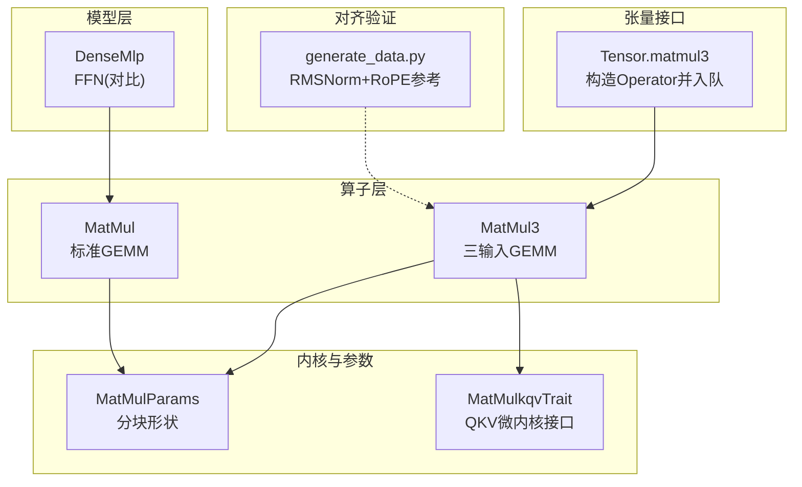
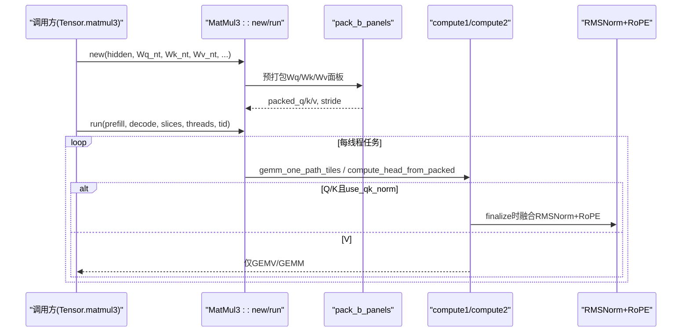
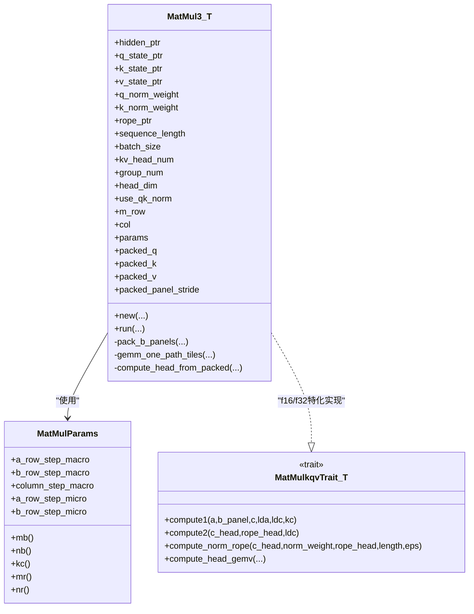
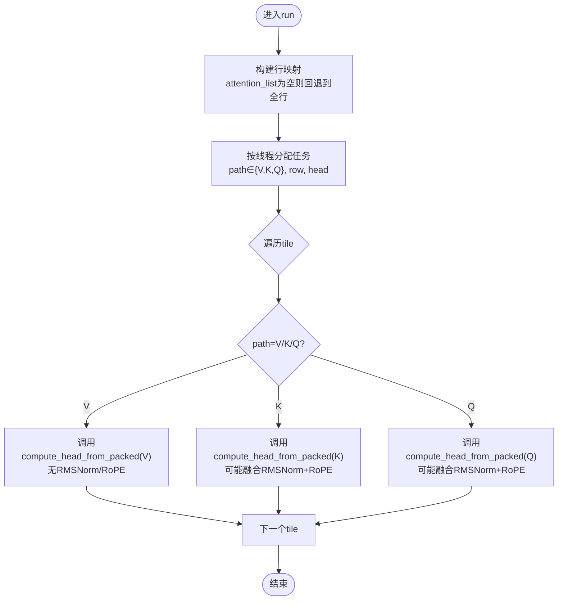
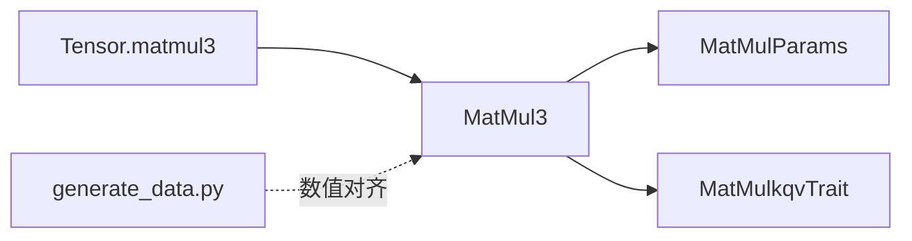

# 三输入矩阵乘法

<cite>
**本文引用的文件列表**
- [src/operators/matmul/matmul3.rs](file://src/operators/matmul/matmul3.rs)
- [src/operators/matmul/matmul.rs](file://src/operators/matmul/matmul.rs)
- [src/kernel/common/matmul_params.rs](file://src/kernel/common/matmul_params.rs)
- [src/tensor/matmul.rs](file://src/tensor/matmul.rs)
- [src/transformer/dense_mlp.rs](file://src/transformer/dense_mlp.rs)
- [src/operators/traits/linear.rs](file://src/operators/traits/linear.rs)
- [alignment/matmul3/generate_data.py](file://alignment/matmul3/generate_data.py)
</cite>

## 目录
1. [简介](#简介)
2. [项目结构](#项目结构)
3. [核心组件](#核心组件)
4. [架构总览](#架构总览)
5. [详细组件分析](#详细组件分析)
6. [依赖关系分析](#依赖关系分析)
7. [性能与内存访问优化](#性能与内存访问优化)
8. [参数配置与最佳实践](#参数配置与最佳实践)
9. [使用示例](#使用示例)
10. [故障排查指南](#故障排查指南)
11. [结论](#结论)

## 简介
本技术文档聚焦于“三输入矩阵乘法”算子 MatMul3，其设计动机是面向 Transformer 自注意力模块中的 Q/K/V 三路投影融合计算。MatMul3 将一次输入的隐藏状态同时乘以三个权重（Wq、Wk、Wv），并可选择对 Q/K 头进行 RMSNorm + RoPE 的融合后处理，从而减少中间结果写回、降低访存开销、提升缓存局部性。相比分别调用三次标准 GEMM，MatMul3 在任务调度、权重面板打包、微内核选择以及可选的归一化/旋转位置编码融合方面具备显著优势。

## 项目结构
围绕 MatMul3 的关键代码分布在以下位置：
- 算子实现与测试：src/operators/matmul/matmul3.rs
- 标准单输出 GEMM 参考实现：src/operators/matmul/matmul.rs
- 分块参数定义：src/kernel/common/matmul_params.rs
- Tensor 层接口（构建 Operator 并入队）：src/tensor/matmul.rs
- MLP 前馈网络（对比参考）：src/transformer/dense_mlp.rs
- 线性算子 trait 定义（含 MatMulkqvTrait）：src/operators/traits/linear.rs
- 对齐数据生成脚本（用于验证 Q/K 的 RMSNorm+RoPE）：alignment/matmul3/generate_data.py

图表来源
- [src/operators/matmul/matmul3.rs:1-120](file://src/operators/matmul/matmul3.rs#L1-L120)
- [src/operators/matmul/matmul.rs:1-100](file://src/operators/matmul/matmul.rs#L1-L100)
- [src/kernel/common/matmul_params.rs:1-36](file://src/kernel/common/matmul_params.rs#L1-L36)
- [src/operators/traits/linear.rs:61-95](file://src/operators/traits/linear.rs#L61-L95)
- [src/tensor/matmul.rs:150-203](file://src/tensor/matmul.rs#L150-L203)
- [src/transformer/dense_mlp.rs:46-100](file://src/transformer/dense_mlp.rs#L46-L100)
- [alignment/matmul3/generate_data.py:1-39](file://alignment/matmul3/generate_data.py#L1-L39)

章节来源
- [src/operators/matmul/matmul3.rs:1-120](file://src/operators/matmul/matmul3.rs#L1-L120)
- [src/operators/matmul/matmul.rs:1-100](file://src/operators/matmul/matmul.rs#L1-L100)
- [src/kernel/common/matmul_params.rs:1-36](file://src/kernel/common/matmul_params.rs#L1-L36)
- [src/operators/traits/linear.rs:61-95](file://src/operators/traits/linear.rs#L61-L95)
- [src/tensor/matmul.rs:150-203](file://src/tensor/matmul.rs#L150-L203)
- [src/transformer/dense_mlp.rs:46-100](file://src/transformer/dense_mlp.rs#L46-L100)
- [alignment/matmul3/generate_data.py:1-39](file://alignment/matmul3/generate_data.py#L1-L39)

## 核心组件
- MatMul3<T>：三输入 GEMM 算子，负责 A[M×K] × Wq[Nq×K]^T、A × Wk[Nkv×K]^T、A × Wv[Nkv×K]^T 的融合计算；支持可选的 Q/K 头 RMSNorm + RoPE 融合后处理；内部预打包权重面板以提升缓存命中。
- MatMulParams：描述宏块（MB/NB/KC）与微内核（MR/NR）的分块形状，贯穿所有 GEMM 路径。
- MatMulkqvTrait：为 f16/f32 等类型提供 compute1/compute2/compute_norm_rope/compute_head_gemv 的微内核接口，便于按目标平台特化（如 AVX-512FP16）。
- Tensor.matmul3：高层 API，分配 Q/K/V 输出缓冲，构造 MatMul3 算子并入队执行。

章节来源
- [src/operators/matmul/matmul3.rs:64-115](file://src/operators/matmul/matmul3.rs#L64-L115)
- [src/kernel/common/matmul_params.rs:1-36](file://src/kernel/common/matmul_params.rs#L1-L36)
- [src/operators/traits/linear.rs:61-95](file://src/operators/traits/linear.rs#L61-L95)
- [src/tensor/matmul.rs:150-203](file://src/tensor/matmul.rs#L150-L203)

## 架构总览
MatMul3 的整体流程如下：
- 构造阶段：根据传入的 Wq/Wk/Wv（NT 布局）预打包权重面板，建立 panel 索引与 stride。
- 运行阶段：基于 attention_list 或默认行映射，将任务分配到线程；每个线程遍历 tile，按 reduction 块迭代，调用微内核完成累加；若为 Q/K 且启用 use_qk_norm，则在最后一个 reduction 块完成后融合 RMSNorm+RoPE。
- 输出布局：Q 写入 [M×Nq]，K/V 写入 KV 缓存 [sequence_length×batch_size×Nkv]，并按 head 维度组织。

图表来源
- [src/operators/matmul/matmul3.rs:120-210](file://src/operators/matmul/matmul3.rs#L120-L210)
- [src/operators/matmul/matmul3.rs:278-391](file://src/operators/matmul/matmul3.rs#L278-L391)
- [src/operators/matmul/matmul3.rs:446-494](file://src/operators/matmul/matmul3.rs#L446-L494)
- [src/operators/matmul/matmul3.rs:524-621](file://src/operators/matmul/matmul3.rs#L524-L621)

## 详细组件分析

### MatMul3 类与数据结构
- 字段说明
  - hidden_ptr：输入 A 指针 [M×K]
  - q_state_ptr/k_state_ptr/v_state_ptr：Q/K/V 输出指针
  - q_norm_weight/k_norm_weight：Q/K 的 RMSNorm 权重
  - rope_ptr：RoPE 表
  - kv_head_num/group_num/head_dim：多头注意力维度信息
  - params：分块形状（MB/NB/KC/MR/NR）
  - packed_q/k/v：预打包的权重面板
- 关键方法
  - new：接收 NT 布局的 Wq/Wk/Wv，预打包面板，初始化分块参数
  - pack_b_panels：将 B_nt[output_cols×reduction_cols] 重排为 panel 连续存储，提高微内核访存效率
  - run：构建行映射，分配任务，遍历 path(Q/K/V)、head、tile，调用微内核
  - compute_head_from_packed：针对单 token 的单 head 向量乘路径（GEMV-like），并在最后一步融合 RMSNorm+RoPE

图表来源
- [src/operators/matmul/matmul3.rs:64-115](file://src/operators/matmul/matmul3.rs#L64-L115)
- [src/kernel/common/matmul_params.rs:1-36](file://src/kernel/common/matmul_params.rs#L1-L36)
- [src/operators/traits/linear.rs:61-95](file://src/operators/traits/linear.rs#L61-L95)

章节来源
- [src/operators/matmul/matmul3.rs:64-115](file://src/operators/matmul/matmul3.rs#L64-L115)
- [src/operators/matmul/matmul3.rs:217-256](file://src/operators/matmul/matmul3.rs#L217-L256)
- [src/operators/matmul/matmul3.rs:278-391](file://src/operators/matmul/matmul3.rs#L278-L391)
- [src/operators/matmul/matmul3.rs:446-494](file://src/operators/matmul/matmul3.rs#L446-L494)
- [src/operators/matmul/matmul3.rs:524-621](file://src/operators/matmul/matmul3.rs#L524-L621)
- [src/kernel/common/matmul_params.rs:1-36](file://src/kernel/common/matmul_params.rs#L1-L36)
- [src/operators/traits/linear.rs:61-95](file://src/operators/traits/linear.rs#L61-L95)

### 与标准矩阵乘法的差异与优势
- 输入数量：MatMul 为单次 A×B^T→C；MatMul3 为一次 A 同时乘 Wq/Wk/Wv，得到 Q/K/V。
- 权重布局：两者均要求 B_nt 为 [N×K] 行优先；MatMul3 额外预打包三个权重面板。
- 融合后处理：MatMul3 可在 Q/K 路径上融合 RMSNorm+RoPE，避免中间结果落盘。
- 任务划分：MatMul3 以 (path, row, head) 为单位分配任务，更贴合注意力场景的稀疏访问模式。
- 性能优势：减少中间写回、提升缓存局部性、利用 AVX-512FP16 微内核，整体吞吐更高。

章节来源
- [src/operators/matmul/matmul.rs:165-288](file://src/operators/matmul/matmul.rs#L165-L288)
- [src/operators/matmul/matmul3.rs:524-621](file://src/operators/matmul/matmul3.rs#L524-L621)

### 融合计算的内存访问模式与缓存局部性
- 权重面板打包：pack_b_panels 将 B_nt 按 reduction_block×micro_tile 重排，使 micro-kernel 能顺序读取权重，减少跨行跳转。
- 行映射与序列切片：build_row_map 根据 attention_list 生成 token→(batch_index, next_sequence_index) 映射，避免无效行访问。
- 微内核循环顺序：外层按 reduction 块迭代，内层按 output 列 tile 和 input 行 tile 推进，保证 A 行与 B 面板的连续访问。
- 最终步融合：仅在最后一个 reduction 块完成后对 Q/K 头执行 RMSNorm+RoPE，减少重复读写。

图表来源
- [src/operators/matmul/matmul3.rs:414-444](file://src/operators/matmul/matmul3.rs#L414-L444)
- [src/operators/matmul/matmul3.rs:496-522](file://src/operators/matmul/matmul3.rs#L496-L522)
- [src/operators/matmul/matmul3.rs:524-621](file://src/operators/matmul/matmul3.rs#L524-L621)

章节来源
- [src/operators/matmul/matmul3.rs:217-256](file://src/operators/matmul/matmul3.rs#L217-L256)
- [src/operators/matmul/matmul3.rs:414-444](file://src/operators/matmul/matmul3.rs#L414-L444)
- [src/operators/matmul/matmul3.rs:496-522](file://src/operators/matmul/matmul3.rs#L496-L522)
- [src/operators/matmul/matmul3.rs:524-621](file://src/operators/matmul/matmul3.rs#L524-L621)

### 与 Transformer 前馈网络的关联
- 注意：MatMul3 主要用于注意力模块的 Q/K/V 投影，而非 FFN。FFN 通常采用 gate/up/down 三段线性变换（Gate/Up 并行，再经 SiLU 融合，最后 Down 投影）。
- 作为对比参考，DenseMlp 展示了两次 matmul 与一次 matmul_add 的组合，体现不同融合策略。

章节来源
- [src/transformer/dense_mlp.rs:46-100](file://src/transformer/dense_mlp.rs#L46-L100)

## 依赖关系分析
- MatMul3 依赖 MatMulParams 指定分块形状，依赖 MatMulkqvTrait 提供微内核接口。
- Tensor.matmul3 负责从高层 API 构造 MatMul3 并加入全局操作队列。
- 对齐脚本 generate_data.py 提供了 Python 侧的 RMSNorm+RoPE 参考实现，用于数值一致性校验。

图表来源
- [src/tensor/matmul.rs:150-203](file://src/tensor/matmul.rs#L150-L203)
- [src/operators/matmul/matmul3.rs:120-210](file://src/operators/matmul/matmul3.rs#L120-L210)
- [src/kernel/common/matmul_params.rs:1-36](file://src/kernel/common/matmul_params.rs#L1-L36)
- [src/operators/traits/linear.rs:61-95](file://src/operators/traits/linear.rs#L61-L95)
- [alignment/matmul3/generate_data.py:1-39](file://alignment/matmul3/generate_data.py#L1-L39)

章节来源
- [src/tensor/matmul.rs:150-203](file://src/tensor/matmul.rs#L150-L203)
- [src/operators/matmul/matmul3.rs:120-210](file://src/operators/matmul/matmul3.rs#L120-L210)
- [src/kernel/common/matmul_params.rs:1-36](file://src/kernel/common/matmul_params.rs#L1-L36)
- [src/operators/traits/linear.rs:61-95](file://src/operators/traits/linear.rs#L61-L95)
- [alignment/matmul3/generate_data.py:1-39](file://alignment/matmul3/generate_data.py#L1-L39)

## 性能与内存访问优化
- 权重面板打包：pack_b_panels 将 B_nt 按 reduction_panel×output_panel 重排，使 micro-kernel 可顺序加载权重，显著提升 L1/L2 命中率。
- 固定微内核尺寸：MR=3、NR=32 的设计有利于向量化与寄存器复用；在 x86_64 上通过 AVX-512FP16 加速。
- 任务粒度：以 tile 为单位分配任务，避免细粒度同步开销，同时保持负载均衡。
- 融合后处理：Q/K 路径在最后一个 reduction 块后直接融合 RMSNorm+RoPE，减少中间结果写回与二次读。
- 行映射优化：当 attention_list 非空时，仅访问有效 token 行，避免冗余计算。

章节来源
- [src/operators/matmul/matmul3.rs:217-256](file://src/operators/matmul/matmul3.rs#L217-L256)
- [src/operators/matmul/matmul3.rs:278-391](file://src/operators/matmul/matmul3.rs#L278-L391)
- [src/operators/matmul/matmul3.rs:414-444](file://src/operators/matmul/matmul3.rs#L414-L444)
- [src/operators/matmul/matmul3.rs:446-494](file://src/operators/matmul/matmul3.rs#L446-L494)

## 参数配置与最佳实践
- MatMulParams 关键字段
  - a_row_step_macro(MB)：输入行宏块大小，需为 MR 的倍数
  - b_row_step_macro(NB)：输出列宏块大小，建议与 NR 对齐
  - column_step_macro(KC)：规约块大小，影响 panel 数量与缓存压力
  - a_row_step_micro(MR)：微内核行数，当前固定为 3
  - b_row_step_micro(NR)：微内核列数，当前固定为 32
- 推荐设置
  - MB≥MR 且为 MR 倍数；NB≥NR 且为 NR 倍数；KC 尽量大以降低 panel 切换次数
  - 对于小 batch/短序列，适当减小 MB/NB 以减少尾块处理开销
  - 确保 head_dim 为 NR 的倍数，以满足断言与微内核假设
- use_qk_norm
  - 开启后，Q/K 路径会在最后一步融合 RMSNorm+RoPE；关闭则仅做纯 GEMM/GEMV
- 线程与任务
  - thread_num 应接近可用核数；thread_id 由上层调度器分配
- 权重布局
  - Wq/Wk/Wv 必须为 NT 布局 [N×K] 行优先；否则需要外部转置或适配 pack 逻辑

章节来源
- [src/kernel/common/matmul_params.rs:1-36](file://src/kernel/common/matmul_params.rs#L1-L36)
- [src/operators/matmul/matmul3.rs:120-210](file://src/operators/matmul/matmul3.rs#L120-L210)
- [src/operators/matmul/matmul3.rs:278-391](file://src/operators/matmul/matmul3.rs#L278-L391)
- [src/operators/matmul/matmul3.rs:446-494](file://src/operators/matmul/matmul3.rs#L446-L494)

## 使用示例
- 高层 API（Tensor.matmul3）
  - 输入：hidden_states[T×H]，权重 Wq[Wq×H]、Wk[Wkv×H]、Wv[Wkv×H]（均为 NT 布局）
  - 输出：q_state[T×Wq]、k_state[S×B×Wkv]、v_state[S×B×Wkv]
  - 调用方式参见 Tensor.matmul3 的实现，内部会分配输出缓冲并构造 MatMul3 算子入队执行
- 低层 API（MatMul3::new/run）
  - new：传入 hidden_ptr、Wq_nt、Wk_nt、Wv_nt、norm 权重、rope 表、维度信息与分块参数
  - run：传入 prefill_size、decode_size、attention_list、thread_num、thread_id
- 对齐验证
  - alignment/matmul3/generate_data.py 提供 Python 参考实现，用于验证 Q/K 的 RMSNorm+RoPE 数值一致性

章节来源
- [src/tensor/matmul.rs:150-203](file://src/tensor/matmul.rs#L150-L203)
- [src/operators/matmul/matmul3.rs:120-210](file://src/operators/matmul/matmul3.rs#L120-L210)
- [src/operators/matmul/matmul3.rs:524-621](file://src/operators/matmul/matmul3.rs#L524-L621)
- [alignment/matmul3/generate_data.py:1-39](file://alignment/matmul3/generate_data.py#L1-L39)

## 故障排查指南
- 断言失败
  - 常见原因：head_dim 不是 NR 的倍数、MB 不是 MR 的倍数、KC 未整除 K 等
  - 检查点：matmul3.rs 中多处 debug_assert 对 MR/NR/KC 的对齐要求
- 数值不一致
  - 确认权重为 NT 布局 [N×K]；参考 generate_data.py 的 RMSNorm+RoPE 实现进行比对
  - 检查 use_qk_norm 开关是否与期望一致
- 性能异常
  - 调整 MB/NB/KC 以匹配硬件缓存层级；增大 KC 可减少 panel 切换
  - 确保 thread_num 合理，避免过细粒度导致调度开销过大

章节来源
- [src/operators/matmul/matmul3.rs:278-391](file://src/operators/matmul/matmul3.rs#L278-L391)
- [src/operators/matmul/matmul3.rs:446-494](file://src/operators/matmul/matmul3.rs#L446-L494)
- [alignment/matmul3/generate_data.py:1-39](file://alignment/matmul3/generate_data.py#L1-L39)

## 结论
MatMul3 通过将 Q/K/V 三路投影融合为一个算子，并结合权重面板打包、微内核优化与可选的 RMSNorm+RoPE 融合，显著降低了访存开销并提升了缓存局部性。在 Transformer 注意力模块中，该算子能有效替代三次独立 GEMM，带来更高的吞吐与更低的延迟。配合合理的分块参数与线程调度，MatMul3 能在多种规模与硬件平台上取得稳定优异的性能表现。