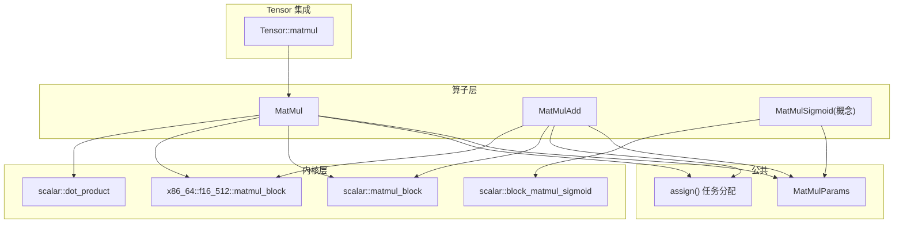
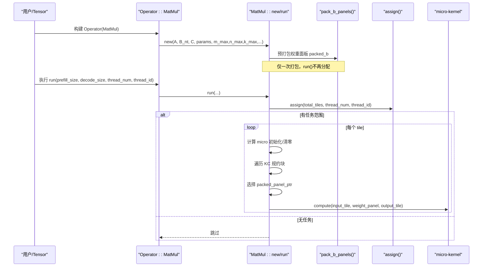
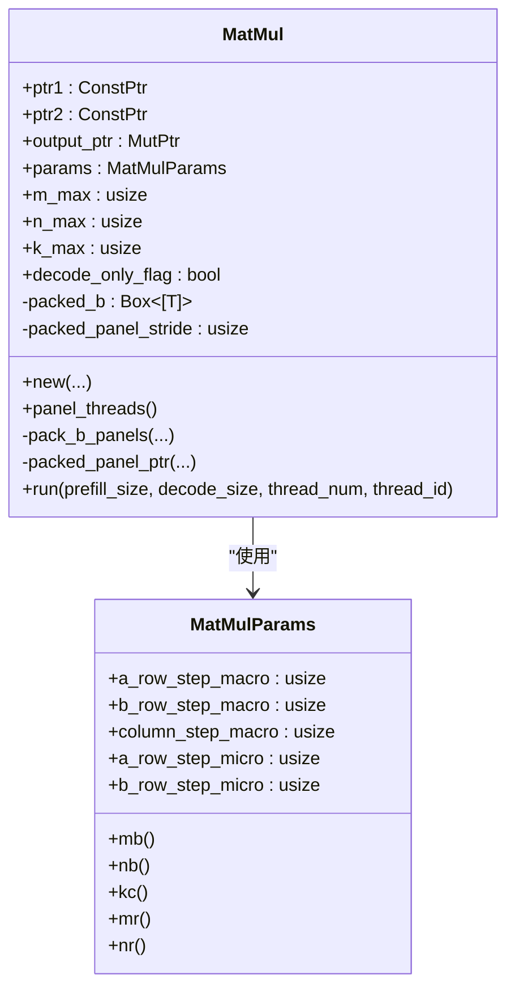
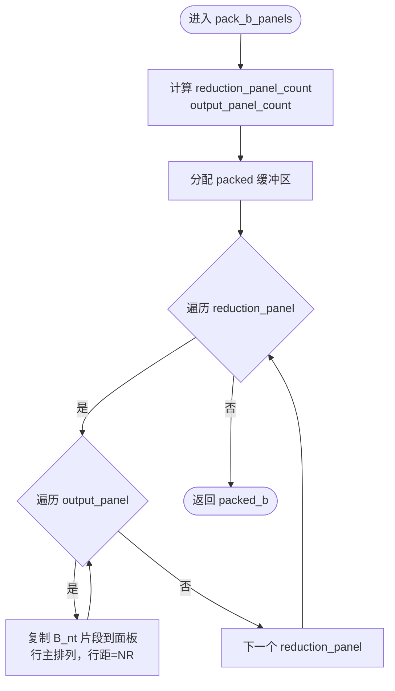
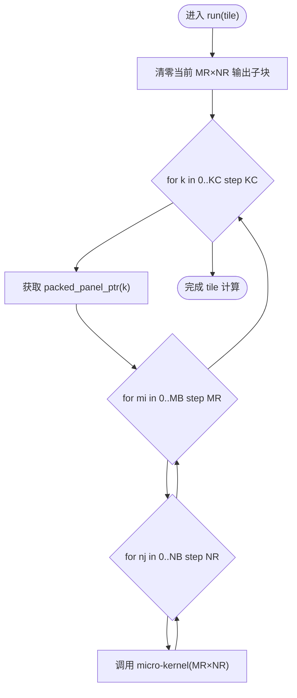
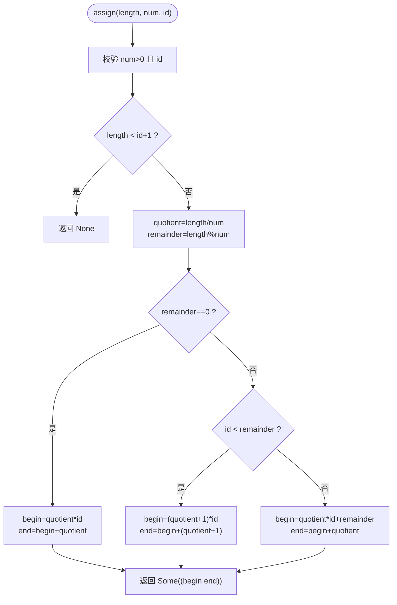
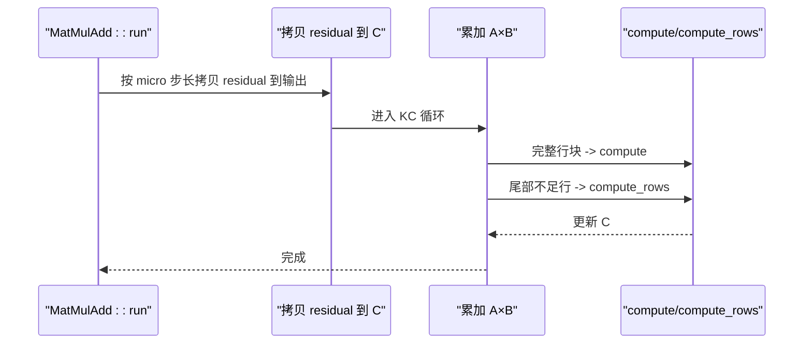
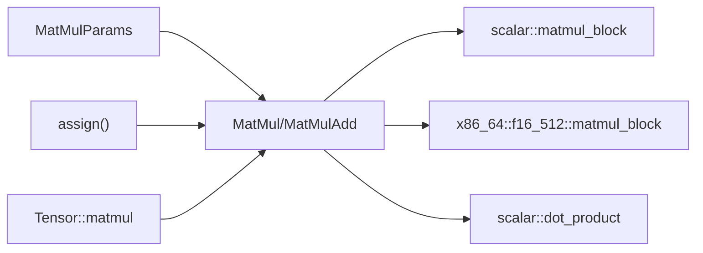

# 基础矩阵乘法

<cite>
**本文引用的文件列表**
- [matmul_params.rs](file://src/kernel/common/matmul_params.rs)
- [matmul.rs](file://src/operators/matmul/matmul.rs)
- [matmul_add.rs](file://src/operators/matmul/matmul_add.rs)
- [block_matmul_sigmoid.rs](file://src/kernel/scalar/block_matmul_sigmoid.rs)
- [matmul_block.rs（标量）](file://src/kernel/scalar/matmul_block.rs)
- [matmul_block.rs（x86_64/f16_512）](file://src/kernel/x86_64/f16_512/matmul_block.rs)
- [dot_product.rs](file://src/kernel/scalar/dot_product.rs)
- [linear.rs（算子接口）](file://src/operators/traits/linear.rs)
- [assign.rs](file://src/operators/assign.rs)
- [tensor/matmul.rs](file://src/tensor/matmul.rs)
- [matmul.md（设计文档）](file://docs/design/operators/matmul.md)
</cite>

## 目录
1. [简介](#简介)
2. [项目结构](#项目结构)
3. [核心组件](#核心组件)
4. [架构总览](#架构总览)
5. [详细组件分析](#详细组件分析)
6. [依赖关系分析](#依赖关系分析)
7. [性能与调优](#性能与调优)
8. [故障排查指南](#故障排查指南)
9. [结论](#结论)
10. [附录：使用示例与基准要点](#附录使用示例与基准要点)

## 简介
本技术文档聚焦于仓库中的基础矩阵乘法算子，围绕 MatMul 结构体的设计原理、内存布局、分块策略、并行机制、权重预打包优化、宏块与微内核分层计算、多线程任务分配与负载均衡、MatMulParams 参数调优、以及 f16/f32 平台特定实现进行系统化说明。文档同时提供可视化图示、代码级引用路径和可复现的使用示例与基准要点，帮助读者快速理解并高效使用该算子。

## 项目结构
该矩阵乘法相关代码主要分布在以下层次：
- 算子层：定义高层算子结构与执行流程（如 MatMul、MatMulAdd），负责任务划分、权重预打包、线程调度等。
- 内核层：提供不同数据类型的微内核实现（标量通用版与 x86_64 AVX-512 FP16 特化）。
- 公共参数：统一的分块参数结构 MatMulParams。
- Tensor 集成：在张量 API 中暴露 matmul 调用入口，封装 Operator 创建与入队。
- 设计文档：阐述高性能 GEMM 的阻塞、打包、寄存器分块、线程私有缓冲、静态拆分等原则。

图表来源
- [matmul.rs:1-120](file://src/operators/matmul/matmul.rs#L1-L120)
- [matmul_add.rs:1-120](file://src/operators/matmul/matmul_add.rs#L1-L120)
- [matmul_block.rs（标量）:1-43](file://src/kernel/scalar/matmul_block.rs#L1-L43)
- [matmul_block.rs（x86_64/f16_512）:1-85](file://src/kernel/x86_64/f16_512/matmul_block.rs#L1-L85)
- [dot_product.rs:1-34](file://src/kernel/scalar/dot_product.rs#L1-L34)
- [block_matmul_sigmoid.rs:1-110](file://src/kernel/scalar/block_matmul_sigmoid.rs#L1-L110)
- [matmul_params.rs:1-36](file://src/kernel/common/matmul_params.rs#L1-L36)
- [assign.rs:1-38](file://src/operators/assign.rs#L1-L38)
- [tensor/matmul.rs:69-100](file://src/tensor/matmul.rs#L69-L100)

章节来源
- [matmul.md:1-120](file://docs/design/operators/matmul.md#L1-L120)
- [matmul.rs:1-120](file://src/operators/matmul/matmul.rs#L1-L120)
- [matmul_add.rs:1-120](file://src/operators/matmul/matmul_add.rs#L1-L120)
- [matmul_params.rs:1-36](file://src/kernel/common/matmul_params.rs#L1-L36)
- [assign.rs:1-38](file://src/operators/assign.rs#L1-L38)
- [tensor/matmul.rs:69-100](file://src/tensor/matmul.rs#L69-L100)

## 核心组件
- MatMulParams：统一承载宏块与微内核尺寸，包括 MB/MR/NB/NR/KC 语义映射。
- MatMul：算子主体，负责输入输出指针管理、权重面板预打包、宏块/微内核循环组织、多线程任务分配与调用底层微内核。
- MatMulAdd：在 MatMul 基础上融合残差相加，先拷贝 residual 到输出，再累加 A×B。
- 微内核：标量通用实现与 x86_64 AVX-512 FP16 广播式 3×32 微核；另含 dot_product 向量点积工具。
- 任务分配：assign() 将一维任务序列连续切分给各线程，保证空间局部性与低开销。
- Tensor 集成：Tensor::matmul 暴露易用接口，内部构造 Operator 并加入队列。

章节来源
- [matmul_params.rs:1-36](file://src/kernel/common/matmul_params.rs#L1-L36)
- [matmul.rs:27-120](file://src/operators/matmul/matmul.rs#L27-L120)
- [matmul_add.rs:28-120](file://src/operators/matmul/matmul_add.rs#L28-L120)
- [matmul_block.rs（标量）:1-43](file://src/kernel/scalar/matmul_block.rs#L1-L43)
- [matmul_block.rs（x86_64/f16_512）:1-85](file://src/kernel/x86_64/f16_512/matmul_block.rs#L1-L85)
- [dot_product.rs:1-34](file://src/kernel/scalar/dot_product.rs#L1-L34)
- [assign.rs:1-38](file://src/operators/assign.rs#L1-L38)
- [tensor/matmul.rs:69-100](file://src/tensor/matmul.rs#L69-L100)

## 架构总览
下图展示从 Tensor API 到算子与内核的调用链，以及关键的数据流与控制流。

图表来源
- [tensor/matmul.rs:69-100](file://src/tensor/matmul.rs#L69-L100)
- [matmul.rs:62-120](file://src/operators/matmul/matmul.rs#L62-L120)
- [matmul.rs:165-288](file://src/operators/matmul/matmul.rs#L165-L288)
- [matmul.rs:294-319](file://src/operators/matmul/matmul.rs#L294-L319)
- [matmul_block.rs（标量）:14-43](file://src/kernel/scalar/matmul_block.rs#L14-L43)
- [matmul_block.rs（x86_64/f16_512）:22-85](file://src/kernel/x86_64/f16_512/matmul_block.rs#L22-L85)
- [assign.rs:11-38](file://src/operators/assign.rs#L11-L38)

## 详细组件分析

### MatMul 结构体与内存布局
- 输入 A：行主 [input_rows × reduction_cols]，行距为 reduction_cols。
- 权重 B_nt：行主 [output_cols × reduction_cols]，即“按输出通道展开”的转置形式，便于后续打包成 Kc×NR 的面板。
- 输出 C：行主 [input_rows × output_cols]，行距为 output_cols。
- 运行时最大维度 m_max/n_max/k_max：用于对齐 padded_input_rows 与面板索引计算。
- 预打包面板 packed_b：形状为 [reduction_panels][output_panels][reduction_block_cols × micro_tile_cols]，其中 reduction_panels = ceil(K / KC)，output_panels = ceil(N / NR)。packed_panel_stride = KC × NR。
- 访问模式：通过 packed_panel_ptr(output_col_start, reduction_col_start) 直接定位当前 KC×NR 面板，避免重复访存重排。

图表来源
- [matmul.rs:27-120](file://src/operators/matmul/matmul.rs#L27-L120)
- [matmul_params.rs:1-36](file://src/kernel/common/matmul_params.rs#L1-L36)

章节来源
- [matmul.rs:27-120](file://src/operators/matmul/matmul.rs#L27-L120)
- [matmul.rs:110-163](file://src/operators/matmul/matmul.rs#L110-L163)
- [matmul_params.rs:1-36](file://src/kernel/common/matmul_params.rs#L1-L36)

### 权重预打包（packed_b_panels）与内存访问模式
- pack_b_panels 将 B_nt[N×K] 重排为多个 KC×NR 的面板，按 reduction_panel_index 与 output_panel_index 双重索引组织，面板内行主存储，行距为 NR。
- 优势：
  - 将列跳跃访问转换为连续顺序读取，利于缓存预取与 SIMD 向量化。
  - 减少运行期重复打包成本，提升吞吐。
- 访问函数 packed_panel_ptr 根据 (output_col_start, reduction_col_start) 直接计算面板基址，O(1) 定位。

图表来源
- [matmul.rs:110-149](file://src/operators/matmul/matmul.rs#L110-L149)

章节来源
- [matmul.rs:110-163](file://src/operators/matmul/matmul.rs#L110-L163)

### 宏块与微内核的分层计算架构
- 宏块（MB/NB/KC）：外层将大矩阵划分为若干块，控制缓存复用与面板打包粒度。
- 微内核（MR×NR）：内层固定大小的子块计算，最大化寄存器复用与 SIMD/FMA 利用率。
- 默认实现：
  - compute：调用 scalar::matmul_block，通用标量微内核。
  - compute2：调用 scalar::dot_product，用于向量点积场景。
- f16 特化：
  - 当目标支持 avx512fp16 时，调用 x86_64::f16_512::matmul_block，采用广播式 3×32 微核，显著加速。

图表来源
- [matmul.rs:165-288](file://src/operators/matmul/matmul.rs#L165-L288)
- [matmul.rs:294-319](file://src/operators/matmul/matmul.rs#L294-L319)
- [matmul_block.rs（标量）:14-43](file://src/kernel/scalar/matmul_block.rs#L14-L43)
- [matmul_block.rs（x86_64/f16_512）:22-85](file://src/kernel/x86_64/f16_512/matmul_block.rs#L22-L85)

章节来源
- [matmul.rs:165-288](file://src/operators/matmul/matmul.rs#L165-L288)
- [matmul.rs:294-319](file://src/operators/matmul/matmul.rs#L294-L319)
- [matmul_block.rs（标量）:14-43](file://src/kernel/scalar/matmul_block.rs#L14-L43)
- [matmul_block.rs（x86_64/f16_512）:22-85](file://src/kernel/x86_64/f16_512/matmul_block.rs#L22-L85)

### 多线程任务分配与负载均衡
- 任务模型：将输出矩阵按 MB×NB 切分为 tiles_m × tiles_n 个宏观任务，展平为一维任务序列。
- 分配策略：assign(total_tiles, thread_num, thread_id) 返回连续区间 [begin, end)，优先保证空间局部性，避免跨线程写冲突与缓存抖动。
- 负载特性：当 total_tiles 不足时，部分线程可能无任务；可通过更小的宏块或上层批并行提高并发度。

图表来源
- [assign.rs:11-38](file://src/operators/assign.rs#L11-L38)

章节来源
- [assign.rs:11-38](file://src/operators/assign.rs#L11-L38)
- [matmul.rs:218-228](file://src/operators/matmul/matmul.rs#L218-L228)

### MatMulAdd 与融合残差相加
- 语义：C = residual + A × B。
- 执行流程：
  - 先将对应 tile 的 residual 拷贝到输出 C。
  - 再对每个 KC 面板执行累加 A×B。
- 微内核：
  - 完整行块走 compute（标量或 AVX-512 特化）。
  - 尾部不足行走 compute_rows（逐行累加，保持正确性）。

图表来源
- [matmul_add.rs:167-319](file://src/operators/matmul/matmul_add.rs#L167-L319)
- [matmul_add.rs:325-468](file://src/operators/matmul/matmul_add.rs#L325-L468)

章节来源
- [matmul_add.rs:167-319](file://src/operators/matmul/matmul_add.rs#L167-L319)
- [matmul_add.rs:325-468](file://src/operators/matmul/matmul_add.rs#L325-L468)

### 数据类型与平台特定优化
- f16 路径：
  - 若目标支持 avx512fp16，则启用 x86_64::f16_512::matmul_block，采用广播式 3×32 微核，充分利用 FMA 指令。
  - 否则回退至标量实现。
- f32 路径：
  - 使用标量通用微内核，确保跨平台一致性。
- dot_product：
  - 提供向量点积工具，供 compute2 等场景使用。

章节来源
- [matmul.rs:321-362](file://src/operators/matmul/matmul.rs#L321-L362)
- [matmul_block.rs（x86_64/f16_512）:1-85](file://src/kernel/x86_64/f16_512/matmul_block.rs#L1-L85)
- [matmul_block.rs（标量）:14-43](file://src/kernel/scalar/matmul_block.rs#L14-L43)
- [dot_product.rs:1-34](file://src/kernel/scalar/dot_product.rs#L1-L34)

### 算子接口与扩展点
- MatMulTrait：定义 compute 与可选 compute2，便于在不同类型上特化。
- MatMulAddTrait：除 compute 外，提供 compute_rows 以处理非整行块情况。
- 这些接口使上层可替换具体内核实现，增强可扩展性。

章节来源
- [linear.rs:24-55](file://src/operators/traits/linear.rs#L24-L55)
- [matmul.rs:294-319](file://src/operators/matmul/matmul.rs#L294-L319)
- [matmul_add.rs:325-468](file://src/operators/matmul/matmul_add.rs#L325-L468)

## 依赖关系分析
- 算子层依赖：
  - MatMul/MatMulAdd 依赖 MatMulParams 描述分块形状。
  - 依赖 assign 进行任务分配。
  - 依赖底层 kernel 微内核实现。
- 内核层依赖：
  - 标量微内核不依赖硬件特性。
  - AVX-512 FP16 微内核仅在具备相应 target_feature 时启用。
- Tensor 集成：
  - Tensor::matmul 构造 Operator 并加入全局队列，屏蔽底层细节。

图表来源
- [matmul_params.rs:1-36](file://src/kernel/common/matmul_params.rs#L1-L36)
- [assign.rs:11-38](file://src/operators/assign.rs#L11-L38)
- [matmul.rs:294-319](file://src/operators/matmul/matmul.rs#L294-L319)
- [matmul_block.rs（标量）:14-43](file://src/kernel/scalar/matmul_block.rs#L14-L43)
- [matmul_block.rs（x86_64/f16_512）:22-85](file://src/kernel/x86_64/f16_512/matmul_block.rs#L22-L85)
- [dot_product.rs:1-34](file://src/kernel/scalar/dot_product.rs#L1-L34)
- [tensor/matmul.rs:69-100](file://src/tensor/matmul.rs#L69-L100)

章节来源
- [matmul.rs:294-319](file://src/operators/matmul/matmul.rs#L294-L319)
- [matmul_add.rs:325-468](file://src/operators/matmul/matmul_add.rs#L325-L468)
- [tensor/matmul.rs:69-100](file://src/tensor/matmul.rs#L69-L100)

## 性能与调优
- 分块参数 MatMulParams 调优建议：
  - MB/MR：影响 A/C 的行块大小与微内核行数，需与缓存层级匹配，避免过大导致 L1/L2 溢出。
  - NB/NR：影响 B/C 的列块大小与微内核列数，NR 越大越利于 SIMD 向量化，但需考虑面板大小与寄存器压力。
  - KC：决定每次打包的面板长度，过大会增加面板内存占用与搬运开销，过小会增加循环与打包次数。
- 权重预打包：
  - 静态权重建议在模型加载阶段一次性打包，推理时直接消费，避免重复打包。
- 线程并行：
  - 使用 assign 的连续区间分配策略，尽量让同一线程处理相邻区域，提升缓存命中。
  - 当 tiles 数量较少时，应结合上层批并行或减小宏块以提升并发度。
- 平台优化：
  - f16 路径在支持 avx512fp16 的 CPU 上启用广播式 3×32 微核，显著提升吞吐。
  - 在不支持的平台上自动回退标量实现，保证可用性。

章节来源
- [matmul.md:108-210](file://docs/design/operators/matmul.md#L108-L210)
- [matmul.md:451-494](file://docs/design/operators/matmul.md#L451-L494)
- [matmul.rs:321-362](file://src/operators/matmul/matmul.rs#L321-L362)

## 故障排查指南
- 断言失败：
  - 检查 input_block_rows % micro_tile_rows == 0、output_cols % micro_tile_cols == 0、reduction_cols % reduction_block_cols == 0 等对齐约束是否满足。
  - 确认 m_max 足够覆盖 padded_input_rows。
- 结果精度问题：
  - f16 路径存在累积误差，适当放宽断言阈值或使用更高精度验证。
- 线程安全：
  - 确保 thread_num >= 1 且 thread_id < thread_num。
  - 避免共享未线程私有的 scratch 缓冲区。
- 性能异常：
  - 检查是否启用了正确的 target_feature（avx512fp16）。
  - 评估 KC 与面板大小是否合理，必要时调整 MatMulParams。

章节来源
- [matmul.rs:191-208](file://src/operators/matmul/matmul.rs#L191-L208)
- [matmul_add.rs:189-198](file://src/operators/matmul/matmul_add.rs#L189-L198)
- [matmul_block.rs（x86_64/f16_512）:92-155](file://src/kernel/x86_64/f16_512/matmul_block.rs#L92-L155)

## 结论
该基础矩阵乘法算子通过“宏块/微内核”分层、权重面板预打包、静态连续任务分配与平台特化微内核，实现了高吞吐与良好缓存局部性的 GEMM 实现。MatMulParams 提供了灵活的调优入口，配合 f16/f32 双路径与 AVX-512 特化，可在多种硬件环境下获得稳定性能。实际部署中建议结合模型权重静态打包与合适的分块参数，以获得最佳效果。

## 附录：使用示例与基准要点
- 基本用法（Tensor API）：
  - 通过 Tensor::matmul 传入 A、B_nt、MatMulParams、序列长度与解码标志，即可得到输出张量。
  - 参考路径：[tensor/matmul.rs:69-100](file://src/tensor/matmul.rs#L69-L100)
- 单元测试示例：
  - f16 小矩阵与批处理补齐测试，验证 padding 与多核行为。
  - f32 对齐与数值稳定性测试。
  - 参考路径：
    - [matmul.rs:375-441](file://src/operators/matmul/matmul.rs#L375-L441)
    - [matmul.rs:443-506](file://src/operators/matmul/matmul.rs#L443-L506)
    - [matmul.rs:507-587](file://src/operators/matmul/matmul.rs#L507-L587)
    - [matmul.rs:589-660](file://src/operators/matmul/matmul.rs#L589-L660)
- 基准要点：
  - 关注 KC、NR、MR 对吞吐的影响。
  - 对比 avx512fp16 开启与关闭时的性能差异。
  - 评估静态打包 vs 动态打包的开销。
  - 观察不同线程数下的缩放效率与尾块处理成本。

章节来源
- [tensor/matmul.rs:69-100](file://src/tensor/matmul.rs#L69-L100)
- [matmul.rs:375-660](file://src/operators/matmul/matmul.rs#L375-L660)