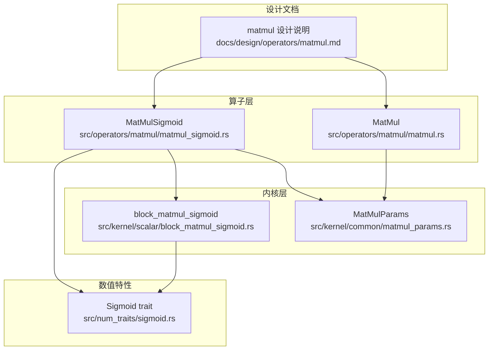
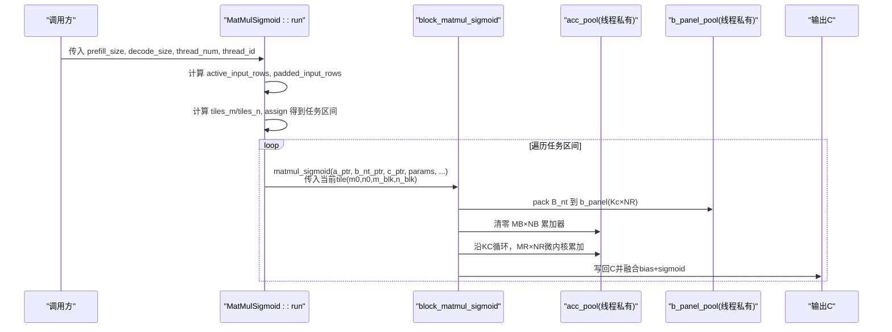
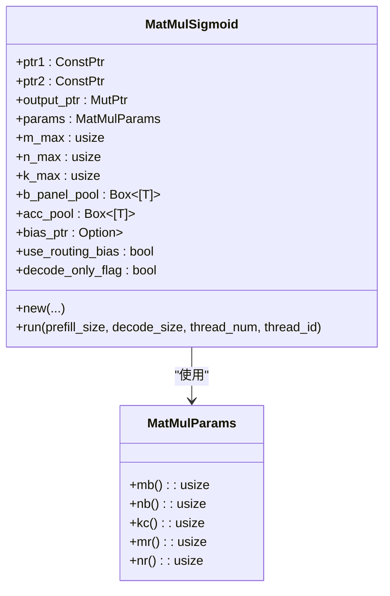
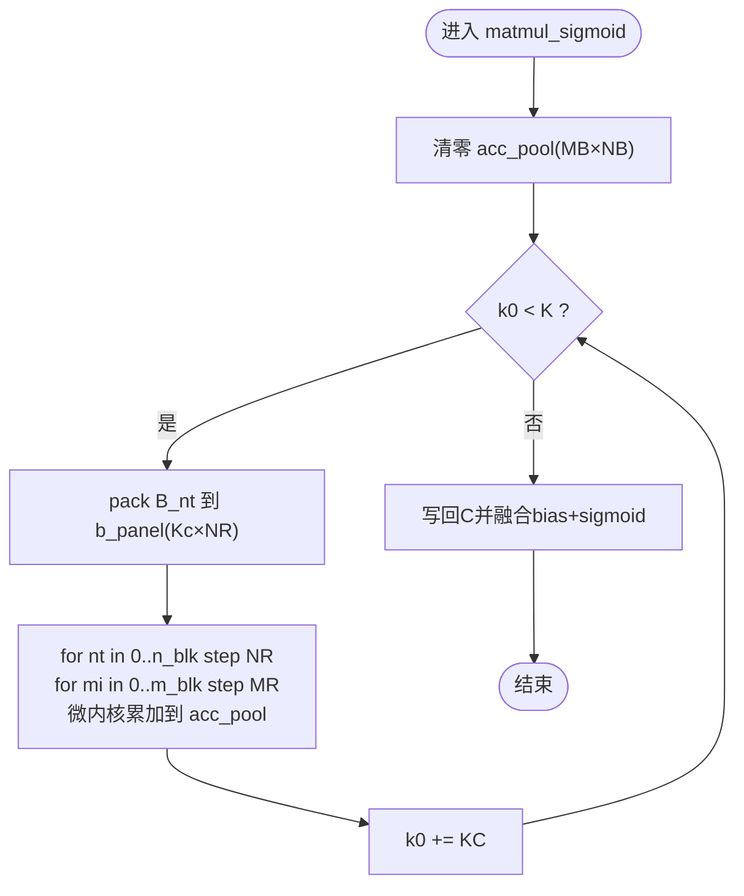
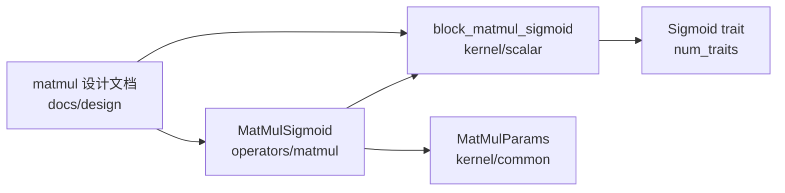

# 激活函数融合矩阵乘法

<cite>
**本文引用的文件列表**
- [src/operators/matmul/matmul_sigmoid.rs](file://src/operators/matmul/matmul_sigmoid.rs)
- [src/kernel/scalar/block_matmul_sigmoid.rs](file://src/kernel/scalar/block_matmul_sigmoid.rs)
- [src/num_traits/sigmoid.rs](file://src/num_traits/sigmoid.rs)
- [src/operators/matmul/matmul.rs](file://src/operators/matmul/matmul.rs)
- [src/kernel/common/matmul_params.rs](file://src/kernel/common/matmul_params.rs)
- [docs/design/operators/matmul.md](file://docs/design/operators/matmul.md)
- [src/tensor/tests/performance.rs](file://src/tensor/tests/performance.rs)
</cite>

## 目录
1. [引言](#引言)
2. [项目结构](#项目结构)
3. [核心组件](#核心组件)
4. [架构总览](#架构总览)
5. [详细组件分析](#详细组件分析)
6. [依赖关系分析](#依赖关系分析)
7. [性能与精度考量](#性能与精度考量)
8. [配置与调优指南](#配置与调优指南)
9. [使用示例与基准测试](#使用示例与基准测试)
10. [故障排查](#故障排查)
11. [结论](#结论)

## 引言
本技术文档聚焦于“激活函数融合矩阵乘法”算子，重点解析 MatMulSigmoid 的设计与实现。该算子在 GEMM（通用矩阵乘）基础上，将偏置加法与 Sigmoid 激活融合到一次计算路径中，避免中间结果落盘带来的额外内存读写，从而降低延迟、提升吞吐。文档同时给出数值精度与溢出处理建议、不同激活函数的适用场景、参数配置与调优方法，并提供可复用的使用示例与基准测试思路。

## 项目结构
围绕 MatMulSigmoid 的关键代码分布在以下位置：
- 算子层：负责任务划分、线程调度、scratch buffer 管理
- 内核层：负责分块/微内核计算、数据打包、SIMD/FMA 加速
- 数值特性：提供类型无关的激活函数接口
- 设计文档：阐述分块、打包、寄存器阻塞等高性能原则

图表来源
- [src/operators/matmul/matmul_sigmoid.rs:1-255](file://src/operators/matmul/matmul_sigmoid.rs#L1-L255)
- [src/operators/matmul/matmul.rs:1-662](file://src/operators/matmul/matmul.rs#L1-L662)
- [src/kernel/scalar/block_matmul_sigmoid.rs:1-110](file://src/kernel/scalar/block_matmul_sigmoid.rs#L1-L110)
- [src/kernel/common/matmul_params.rs:1-36](file://src/kernel/common/matmul_params.rs#L1-L36)
- [src/num_traits/sigmoid.rs:1-41](file://src/num_traits/sigmoid.rs#L1-L41)
- [docs/design/operators/matmul.md:1-519](file://docs/design/operators/matmul.md#L1-L519)

章节来源
- [src/operators/matmul/matmul_sigmoid.rs:1-255](file://src/operators/matmul/matmul_sigmoid.rs#L1-L255)
- [src/operators/matmul/matmul.rs:1-662](file://src/operators/matmul/matmul.rs#L1-L662)
- [src/kernel/scalar/block_matmul_sigmoid.rs:1-110](file://src/kernel/scalar/block_matmul_sigmoid.rs#L1-L110)
- [src/kernel/common/matmul_params.rs:1-36](file://src/kernel/common/matmul_params.rs#L1-L36)
- [src/num_traits/sigmoid.rs:1-41](file://src/num_traits/sigmoid.rs#L1-L41)
- [docs/design/operators/matmul.md:1-519](file://docs/design/operators/matmul.md#L1-L519)

## 核心组件
- MatMulSigmoid 算子
  - 职责：按宏块/微块对输出进行静态切分；为每个线程分配私有 scratch（B 面板缓存与累加器）；调用 block_matmul_sigmoid 完成 A×B + bias → sigmoid 的融合计算。
  - 关键成员：输入指针、权重指针、输出指针、分块参数、最大维度、每线程 scratch、可选偏置指针、路由偏置开关、decode-only 标志。
- block_matmul_sigmoid 内核
  - 职责：在给定 tile 内，沿 K 方向分块，将 B_nt 打包成连续 panel，执行 MR×NR 微内核累加，最后一次性写入 C 并应用 bias 与 sigmoid。
- MatMulParams 参数
  - 职责：封装 MB/NB/KC/MR/NR 等分块尺寸，供上层与内核统一读取。
- Sigmoid trait
  - 职责：为 f16/f32/f64 提供统一的 sigmoid 接口，便于泛型内核复用。

章节来源
- [src/operators/matmul/matmul_sigmoid.rs:23-95](file://src/operators/matmul/matmul_sigmoid.rs#L23-L95)
- [src/kernel/scalar/block_matmul_sigmoid.rs:6-109](file://src/kernel/scalar/block_matmul_sigmoid.rs#L6-L109)
- [src/kernel/common/matmul_params.rs:1-36](file://src/kernel/common/matmul_params.rs#L1-L36)
- [src/num_traits/sigmoid.rs:1-41](file://src/num_traits/sigmoid.rs#L1-L41)

## 架构总览
MatMulSigmoid 的计算流程遵循“上层组织任务—中层准备数据—下层执行微内核”的分层范式：
- 上层：根据 prefill/decode 选择活跃行数，补齐至 MR 倍数，计算 tiles_m × tiles_n，用 assign() 做连续范围分配。
- 中层：每个线程维护 b_panel_pool（Kc×NR 的 B 面板）和 acc_pool（MB×NB 的累加器）。
- 下层：对每个 tile 沿 KC 循环，pack B 面板，MR×NR 微内核累加，最终写回 C 并融合 bias 与 sigmoid。

图表来源
- [src/operators/matmul/matmul_sigmoid.rs:101-186](file://src/operators/matmul/matmul_sigmoid.rs#L101-L186)
- [src/kernel/scalar/block_matmul_sigmoid.rs:24-109](file://src/kernel/scalar/block_matmul_sigmoid.rs#L24-L109)

## 详细组件分析

### MatMulSigmoid 算子
- 构造阶段
  - 依据 MatMulParams 推导 mb/nb/kc/mr/nr，计算每线程 scratch 大小并预分配。
  - 支持可选 bias 指针与 use_routing_bias 开关。
- 运行阶段
  - 根据 prefill/decode 决定活跃行数，补齐到 mr 倍数，保证微内核对齐。
  - 将 tiles_m × tiles_n 展平为一维任务序列，assign() 返回连续区间，减少跨线程写冲突与缓存抖动。
  - 每个任务映射到 (m0, n0)，调用 block_matmul_sigmoid 完成 tile 级融合计算。

图表来源
- [src/operators/matmul/matmul_sigmoid.rs:23-95](file://src/operators/matmul/matmul_sigmoid.rs#L23-L95)
- [src/kernel/common/matmul_params.rs:10-35](file://src/kernel/common/matmul_params.rs#L10-L35)

章节来源
- [src/operators/matmul/matmul_sigmoid.rs:44-186](file://src/operators/matmul/matmul_sigmoid.rs#L44-L186)

### block_matmul_sigmoid 内核
- 输入布局
  - A: [M×K]，B_nt: [N×K]（行优先），C: [M×N]（行优先）。
- 分块策略
  - 外层沿 K 以 KC 步长推进；内层按 NR 列、MR 行微内核累加。
- 数据打包
  - 将 B_nt 对应列块拷贝到线程私有的 b_panel_pool，形成 Kc×NR 连续面板，提高访存局部性与 SIMD 效率。
- 融合逻辑
  - 先清零 acc_pool，再沿 KC 累加；完成后一次性写回 C，并在写回时融合 bias 与 sigmoid。

图表来源
- [src/kernel/scalar/block_matmul_sigmoid.rs:24-109](file://src/kernel/scalar/block_matmul_sigmoid.rs#L24-L109)

章节来源
- [src/kernel/scalar/block_matmul_sigmoid.rs:6-109](file://src/kernel/scalar/block_matmul_sigmoid.rs#L6-L109)

### Sigmoid 数值特性
- 通过 trait 抽象，为 f16/f32/f64 提供统一 sigmoid 接口，便于内核泛型化。
- 典型实现采用标准公式 1/(1+exp(-x))，在极端值下需注意 exp 溢出风险（见后文“数值精度与溢出处理”）。

章节来源
- [src/num_traits/sigmoid.rs:1-41](file://src/num_traits/sigmoid.rs#L1-L41)

### 对比：基础 MatMul
- MatMul 在 new() 阶段预打包 B 为固定 layout，run() 仅做任务划分与微内核调用，无运行时分配。
- MatMulSigmoid 在此基础上增加 per-thread acc_pool，用于暂存中间累加结果，确保在融合激活前不污染输出。

章节来源
- [src/operators/matmul/matmul.rs:53-163](file://src/operators/matmul/matmul.rs#L53-L163)
- [docs/design/operators/matmul.md:385-417](file://docs/design/operators/matmul.md#L385-L417)

## 依赖关系分析
- 算子层依赖内核层提供的 block_matmul_sigmoid 与 MatMulParams。
- 内核层依赖 num_traits::Sigmoid 提供激活函数实现。
- 设计文档贯穿解释分块、打包、并行策略等原理，指导算子与内核的实现取舍。

图表来源
- [src/operators/matmul/matmul_sigmoid.rs:1-255](file://src/operators/matmul/matmul_sigmoid.rs#L1-L255)
- [src/kernel/scalar/block_matmul_sigmoid.rs:1-110](file://src/kernel/scalar/block_matmul_sigmoid.rs#L1-L110)
- [src/kernel/common/matmul_params.rs:1-36](file://src/kernel/common/matmul_params.rs#L1-L36)
- [src/num_traits/sigmoid.rs:1-41](file://src/num_traits/sigmoid.rs#L1-L41)
- [docs/design/operators/matmul.md:1-519](file://docs/design/operators/matmul.md#L1-L519)

## 性能与精度考量

### 性能特性
- 分块与打包
  - 将 B_nt 打包为 Kc×NR 连续面板，显著改善 L1/L2 命中与 SIMD 向量化。
- 线程私有 scratch
  - 每个线程拥有独立的 b_panel_pool 与 acc_pool，避免 false sharing 与同步开销。
- 静态任务划分
  - 基于 tiles_m × tiles_n 的连续区间分配，保持写回区域连续，利于预取与缓存友好。
- 微内核粒度
  - MR×NR 微内核充分利用寄存器与 FMA，提高算术强度。

章节来源
- [docs/design/operators/matmul.md:108-210](file://docs/design/operators/matmul.md#L108-L210)
- [docs/design/operators/matmul.md:212-343](file://docs/design/operators/matmul.md#L212-L343)

### 数值精度与溢出处理
- 累加精度
  - 建议在 micro-kernel 内部使用更高精度的累加器（如 f32/f64）以减少舍入误差，尤其在 f16 路径上。
- Sigmoid 溢出保护
  - 当 x 很大或很小时，exp(-x) 可能溢出。可在融合阶段加入分段近似或 clamp 策略，例如：
    - x > threshold: 直接返回 1.0
    - x < -threshold: 直接返回 0.0
    - 否则使用稳定公式
- 偏置融合顺序
  - 先加 bias 再 sigmoid，可减少一次中间存储；但需确保 bias 量级与输入一致，避免放大数值范围导致不稳定。

[本节为通用指导，不直接分析具体文件]

## 配置与调优指南

### 分块参数 MatMulParams
- a_row_step_macro (MB): 控制 A/C 的行宏块大小，影响缓存复用与并行度。
- b_row_step_macro (NB): 控制 B_nt/C 的列宏块大小，影响写回连续性。
- column_step_macro (KC): 控制 K 方向打包长度，平衡 pack 开销与面板占用。
- a_row_step_micro (MR), b_row_step_micro (NR): 微内核尺寸，决定寄存器阻塞与 SIMD 宽度。

调优建议
- 针对目标 CPU 的 L1/L2 容量与向量宽度，调整 MR/NR 以获得最佳吞吐。
- 若 B 为静态权重，考虑在初始化阶段预打包 B_nt，避免每次 tile 重复 pack。
- 当 tiles_m × tiles_n 不足时，引入更高层并行（batch/slice/sample）以提升线程利用率。

章节来源
- [src/kernel/common/matmul_params.rs:1-36](file://src/kernel/common/matmul_params.rs#L1-L36)
- [docs/design/operators/matmul.md:451-493](file://docs/design/operators/matmul.md#L451-L493)

## 使用示例与基准测试

### 使用示例（概念性步骤）
- 准备张量
  - A: [M×K]，B_nt: [N×K]，可选 bias: [N]，输出 C: [M×N]。
- 构建算子
  - 设置 MatMulParams（MB/NB/KC/MR/NR），创建 MatMulSigmoid，传入指针与最大维度。
- 执行计算
  - 调用 run(prefill_size, decode_size, thread_num, thread_id)。
  - 多线程环境下，由上层协调 thread_num 与 thread_id。

章节来源
- [src/operators/matmul/matmul_sigmoid.rs:48-95](file://src/operators/matmul/matmul_sigmoid.rs#L48-L95)
- [src/operators/matmul/matmul_sigmoid.rs:101-186](file://src/operators/matmul/matmul_sigmoid.rs#L101-L186)

### 基准测试思路
- 单算子并行
  - 参考 performance 测试中的模式：获取可用线程数，按 panel_threads 限制并发，计时单次运行并统计 GFLOPS。
- 多批次/多序列
  - 增大 BATCH_SIZE 与 SEQUENCE_CHUNK_SIZE，评估吞吐随规模增长的趋势。
- 对比基线
  - 对比“先 matmul 再加 bias 再 sigmoid”的三段式路径与融合路径的延迟差异。

章节来源
- [src/tensor/tests/performance.rs:307-387](file://src/tensor/tests/performance.rs#L307-L387)

## 故障排查
- 维度未对齐
  - 若 M 不是 MR 的倍数，需在 run 前补齐；NB 与 KC 也需满足对齐断言。
- 线程数越界
  - thread_num 必须大于等于 1 且小于等于 max_threads（由 scratch 大小决定）。
- 偏置融合异常
  - 检查 use_routing_bias 与 bias_ptr 是否匹配；确认 bias 形状为 [N] 且与 NB 对齐。
- 数值不稳定
  - 检查输入量级，必要时在融合前对输入做缩放或截断；在 Sigmoid 实现中加入溢出保护。

章节来源
- [src/operators/matmul/matmul_sigmoid.rs:122-136](file://src/operators/matmul/matmul_sigmoid.rs#L122-L136)
- [src/kernel/scalar/block_matmul_sigmoid.rs:33-37](file://src/kernel/scalar/block_matmul_sigmoid.rs#L33-L37)

## 结论
MatMulSigmoid 通过将 GEMM、偏置与 Sigmoid 融合到单一 tile 计算路径，有效减少了中间结果的内存访问，提升了推理阶段的延迟与吞吐表现。其分层设计（任务划分—数据打包—微内核）与线程私有 scratch 机制，保证了高并发下的稳定性与可扩展性。结合合理的分块参数与数值稳定性策略，可在多种硬件平台上获得良好的性能收益。