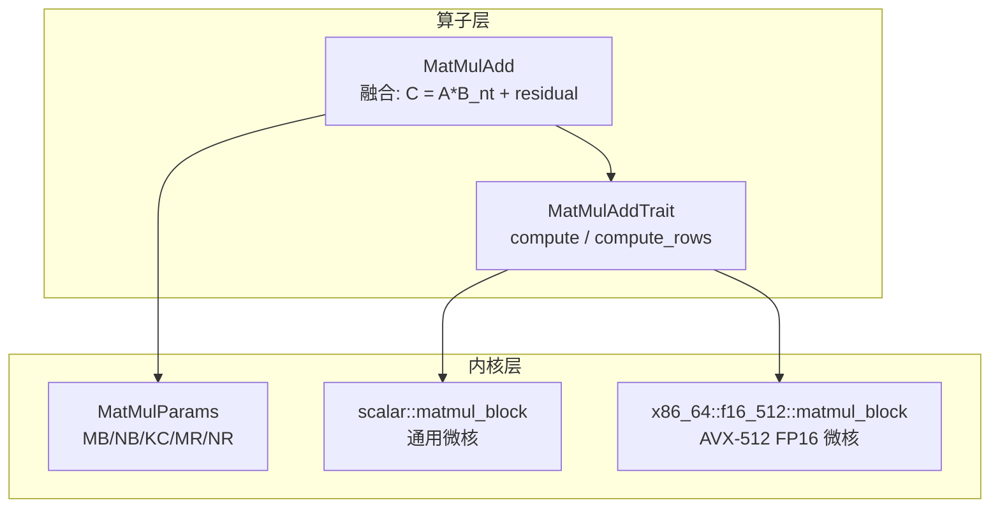
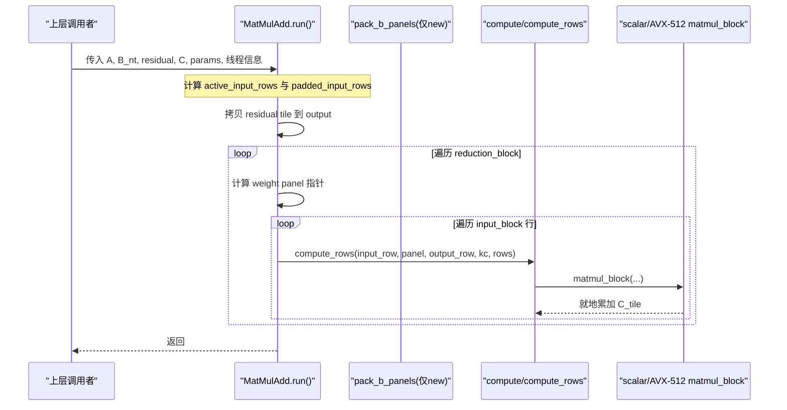
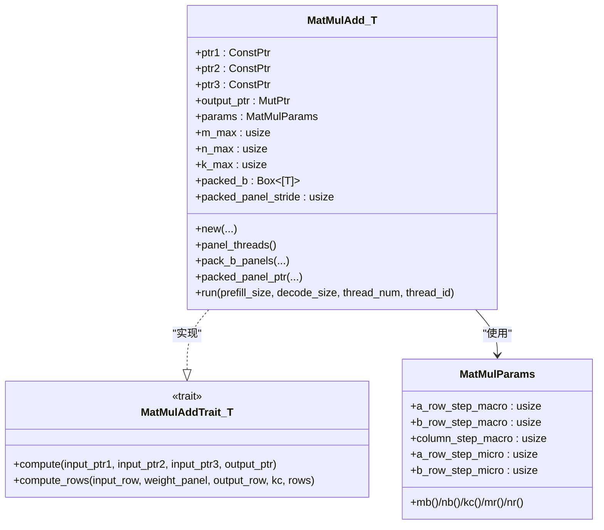
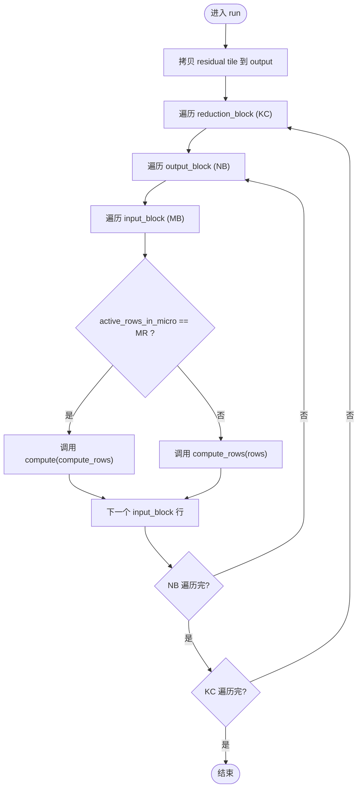
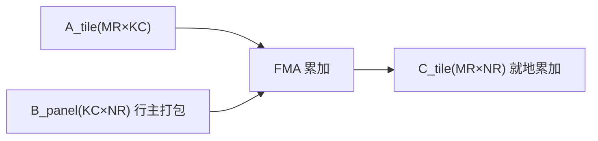
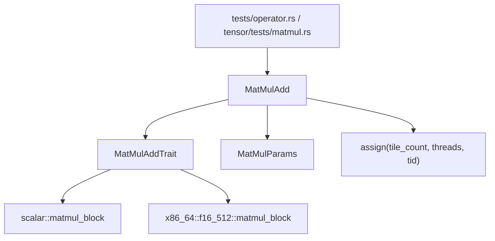

# 矩阵加法融合

<cite>
**本文引用的文件列表**
- [src/operators/matmul/matmul_add.rs](file://src/operators/matmul/matmul_add.rs)
- [src/kernel/common/matmul_params.rs](file://src/kernel/common/matmul_params.rs)
- [src/kernel/scalar/matmul_block.rs](file://src/kernel/scalar/matmul_block.rs)
- [src/kernel/x86_64/f16_512/matmul_block.rs](file://src/kernel/x86_64/f16_512/matmul_block.rs)
- [src/operators/traits/linear.rs](file://src/operators/traits/linear.rs)
- [src/tensor/tests/matmul.rs](file://src/tensor/tests/matmul.rs)
- [src/operators/operator.rs](file://src/operators/operator.rs)
- [README.md](file://README.md)
</cite>

## 目录
1. [简介](#简介)
2. [项目结构](#项目结构)
3. [核心组件](#核心组件)
4. [架构总览](#架构总览)
5. [详细组件分析](#详细组件分析)
6. [依赖关系分析](#依赖关系分析)
7. [性能与内存优化](#性能与内存优化)
8. [故障排查指南](#故障排查指南)
9. [结论](#结论)
10. [附录：配置参数与调优建议](#附录配置参数与调优建议)

## 简介
本技术文档聚焦于“矩阵乘法+残差加法”的融合算子 MatMulAdd，系统阐述其融合计算原理、内存布局与访问模式优化、执行流程与并行策略，以及在不同硬件平台（标量路径与 AVX-512 FP16）上的实现差异与调优要点。文档还包含配置参数说明、使用示例与对比思路，帮助读者理解融合相比分离操作在中间结果存储与内存带宽方面的优势。

## 项目结构
MatMulAdd 位于 operators 层，负责将 A×B_nt + residual 的计算融合为一次内核调用；底层通过 MatMulParams 描述分块形状，并调度到标量或 AVX-512 微内核完成 MR×NR 的微块累加。权重 B 在构造阶段被预打包为 panel 形式，以匹配微内核的行主连续访问需求。

图表来源
- [src/operators/matmul/matmul_add.rs:28-97](file://src/operators/matmul/matmul_add.rs#L28-L97)
- [src/operators/traits/linear.rs:38-55](file://src/operators/traits/linear.rs#L38-L55)
- [src/kernel/common/matmul_params.rs:1-36](file://src/kernel/common/matmul_params.rs#L1-L36)
- [src/kernel/scalar/matmul_block.rs:14-43](file://src/kernel/scalar/matmul_block.rs#L14-L43)
- [src/kernel/x86_64/f16_512/matmul_block.rs:22-85](file://src/kernel/x86_64/f16_512/matmul_block.rs#L22-L85)

章节来源
- [src/operators/matmul/matmul_add.rs:1-120](file://src/operators/matmul/matmul_add.rs#L1-L120)
- [src/kernel/common/matmul_params.rs:1-36](file://src/kernel/common/matmul_params.rs#L1-L36)

## 核心组件
- MatMulAdd<T>：封装输入 A、转置权重 B_nt、残差 residual 与输出 C 的指针，维护分块参数 params 与最大维度 m_max/n_max/k_max，并在 new() 中预打包 B 的 panels，避免运行时重复分配与重排。
- MatMulAddTrait<T>：定义 compute 与 compute_rows 接口，分别用于整块更新与按行增量更新，便于在 run() 中对边界行进行特化处理。
- MatMulParams：统一描述 MB/NB/KC/MR/NR 五维分块参数，供上层 tile 划分与下层微内核共享。
- 微内核 matmul_block：提供标量与 AVX-512 FP16 两种实现，均遵循“行主 A_tile × 行主打包 B_panel → 行主 C_tile”的约定，支持就地累加。

章节来源
- [src/operators/matmul/matmul_add.rs:28-97](file://src/operators/matmul/matmul_add.rs#L28-L97)
- [src/operators/traits/linear.rs:38-55](file://src/operators/traits/linear.rs#L38-L55)
- [src/kernel/common/matmul_params.rs:1-36](file://src/kernel/common/matmul_params.rs#L1-L36)
- [src/kernel/scalar/matmul_block.rs:14-43](file://src/kernel/scalar/matmul_block.rs#L14-L43)
- [src/kernel/x86_64/f16_512/matmul_block.rs:22-85](file://src/kernel/x86_64/f16_512/matmul_block.rs#L22-L85)

## 架构总览
MatMulAdd 的执行分为三个阶段：
- 准备阶段：new() 中将 B_nt 按 reduction_block_cols × micro_tile_cols 切分为面板并打包为连续行主数组 packed_b，记录 packed_panel_stride。
- 拷贝阶段：run() 先将对应 tile 的 residual 拷贝至 output，作为后续 += 的初始值。
- 融合累加阶段：对每个 input_block × output_block 任务，沿 K 方向遍历 reduction_block，定位对应的 weight panel，调用 compute/compute_rows 完成 A_tile × B_panel 的累加写入 C_tile。

图表来源
- [src/operators/matmul/matmul_add.rs:167-319](file://src/operators/matmul/matmul_add.rs#L167-L319)
- [src/operators/matmul/matmul_add.rs:107-146](file://src/operators/matmul/matmul_add.rs#L107-L146)
- [src/operators/matmul/matmul_add.rs:325-371](file://src/operators/matmul/matmul_add.rs#L325-L371)
- [src/kernel/scalar/matmul_block.rs:14-43](file://src/kernel/scalar/matmul_block.rs#L14-L43)
- [src/kernel/x86_64/f16_512/matmul_block.rs:22-85](file://src/kernel/x86_64/f16_512/matmul_block.rs#L22-L85)

## 详细组件分析

### MatMulAdd 结构与数据流
- 数据结构
  - ptr1/ptr2/ptr3/output_ptr：A、B_nt、residual、C 的原始指针。
  - params：MB/NB/KC/MR/NR 分块形状。
  - m_max/n_max/k_max：运行时最大维度，用于对齐与断言。
  - packed_b/packed_panel_stride：B 的面板打包缓存，避免运行时重排。
- 关键方法
  - new()：根据 params 计算面板尺寸，预打包 B_nt 为 packed_b。
  - pack_b_panels()：按 reduction_panel × output_panel 顺序填充 packed_b，每 panel 为 reduction_block_cols × micro_tile_cols 的行主连续块。
  - packed_panel_ptr()：根据输出列起始与规约起始快速定位 panel 指针。
  - run()：先拷贝 residual 到 output，再按 tile 与 panel 循环，调用 compute/compute_rows 完成融合累加。
  - compute/compute_rows：默认实现走标量微内核；f16 特化在 AVX-512 可用时走 SIMD 路径，否则回退标量。

图表来源
- [src/operators/matmul/matmul_add.rs:28-97](file://src/operators/matmul/matmul_add.rs#L28-L97)
- [src/operators/traits/linear.rs:38-55](file://src/operators/traits/linear.rs#L38-L55)
- [src/kernel/common/matmul_params.rs:1-36](file://src/kernel/common/matmul_params.rs#L1-L36)

章节来源
- [src/operators/matmul/matmul_add.rs:28-97](file://src/operators/matmul/matmul_add.rs#L28-L97)
- [src/operators/matmul/matmul_add.rs:107-160](file://src/operators/matmul/matmul_add.rs#L107-L160)
- [src/operators/matmul/matmul_add.rs:167-319](file://src/operators/matmul/matmul_add.rs#L167-L319)
- [src/operators/traits/linear.rs:38-55](file://src/operators/traits/linear.rs#L38-L55)
- [src/kernel/common/matmul_params.rs:1-36](file://src/kernel/common/matmul_params.rs#L1-L36)

### 融合计算流程与内存访问模式
- 融合点
  - 在 run() 中，先拷贝 residual 到 output，随后直接对 output 做 += A×B_nt，无需额外中间张量保存 A×B_nt 的结果，减少一次大张量的写回与读回。
- 内存访问模式
  - A_tile：行主，按行距 lda=K 访问，逐列广播参与 FMA。
  - B_panel：行主打包，每行 NR 个元素连续，利于向量化加载。
  - C_tile：行主，就地累加，减少跨行跳转。
- 边界处理
  - 当 active_rows_in_micro < micro_tile_rows 时，调用 compute_rows 按实际行数更新，避免越界。
  - 所有宏/微维度均做倍数对齐与断言，保证向量化路径安全。

图表来源
- [src/operators/matmul/matmul_add.rs:167-319](file://src/operators/matmul/matmul_add.rs#L167-L319)
- [src/operators/matmul/matmul_add.rs:325-371](file://src/operators/matmul/matmul_add.rs#L325-L371)

章节来源
- [src/operators/matmul/matmul_add.rs:167-319](file://src/operators/matmul/matmul_add.rs#L167-L319)

### 微内核实现与硬件特性
- 标量路径
  - scalar::matmul_block：通用 MR×NR 微核，按行主 A_tile 与行主打包 B_panel 进行累加，适用于任意 T。
- AVX-512 FP16 路径
  - x86_64::f16_512::matmul_block：针对 NR=32、MR≤3 的广播式路径，使用 _mm512_fmadd_ph/_mm512_loadu_ph/_mm512_set1_ph/_mm512_storeu_ph 实现高吞吐 FMA。
  - f16 特化的 compute_rows 同样利用 AVX-512 指令，对少量行进行高效累加。

图表来源
- [src/kernel/scalar/matmul_block.rs:14-43](file://src/kernel/scalar/matmul_block.rs#L14-L43)
- [src/kernel/x86_64/f16_512/matmul_block.rs:22-85](file://src/kernel/x86_64/f16_512/matmul_block.rs#L22-L85)

章节来源
- [src/kernel/scalar/matmul_block.rs:14-43](file://src/kernel/scalar/matmul_block.rs#L14-L43)
- [src/kernel/x86_64/f16_512/matmul_block.rs:22-85](file://src/kernel/x86_64/f16_512/matmul_block.rs#L22-L85)

## 依赖关系分析
- 模块耦合
  - MatMulAdd 依赖 MatMulAddTrait 提供的 compute/compute_rows 抽象，解耦了不同数据类型与硬件后端。
  - MatMulParams 贯穿上层 tile 划分与下层微内核，形成统一的“分块形状契约”。
- 外部依赖
  - 线程调度：run() 内部使用 assign(total_tiles, thread_num, thread_id) 进行任务切分，结合 panel_threads() 获取可用并行度。
  - 测试与集成：tensor/tests/matmul.rs 与 operators/operator.rs 中的测试验证了多核一致性与 dispatch 正确性。

图表来源
- [src/operators/matmul/matmul_add.rs:167-319](file://src/operators/matmul/matmul_add.rs#L167-L319)
- [src/operators/traits/linear.rs:38-55](file://src/operators/traits/linear.rs#L38-L55)
- [src/operators/operator.rs:2745-2775](file://src/operators/operator.rs#L2745-L2775)
- [src/tensor/tests/matmul.rs:616-664](file://src/tensor/tests/matmul.rs#L616-L664)

章节来源
- [src/operators/operator.rs:2745-2775](file://src/operators/operator.rs#L2745-L2775)
- [src/tensor/tests/matmul.rs:616-664](file://src/tensor/tests/matmul.rs#L616-L664)

## 性能与内存优化
- 融合带来的收益
  - 减少中间结果：A×B_nt 不再单独写出，直接在 output 上累加，降低一次大张量的写回与后续读取。
  - 降低内存带宽：融合后只需一次 residual 拷贝与一次 C 的写回，显著减少访存次数。
- 内存布局优化
  - B 预打包为 panel：使 B_panel 在 K 维上连续，NR 维内连续，最大化向量化加载效率。
  - 行主访问：A_tile 与 C_tile 均为行主，配合 AVX-512 的广播与 FMA，提高吞吐。
- 并行与调度
  - 任务切分：按 input_block × output_block 的 tile 数进行均匀分配，充分利用多核。
  - 面板线程：panel_threads() 基于系统可用并行度，指导外层并行规模。
- 硬件适配
  - AVX-512 FP16：在支持 avx512fp16 的目标上启用专用微内核，显著提升小 tile 的 FLOPS 利用率。
  - 标量回退：在不支持目标特性的平台上自动回退到标量路径，保证可移植性。
- 参考背景
  - README 指出 CPU 在小 batch、低维与不规则矩阵场景下的优势，包括 L3 缓存复用、稳定的访存模式与更低的调度开销，这与融合算子的设计动机一致。

章节来源
- [src/operators/matmul/matmul_add.rs:107-160](file://src/operators/matmul/matmul_add.rs#L107-L160)
- [src/operators/matmul/matmul_add.rs:167-319](file://src/operators/matmul/matmul_add.rs#L167-L319)
- [src/kernel/x86_64/f16_512/matmul_block.rs:22-85](file://src/kernel/x86_64/f16_512/matmul_block.rs#L22-L85)
- [README.md:157-182](file://README.md#L157-L182)

## 故障排查指南
- 常见断言失败
  - 维度未对齐：如 input_block_rows % micro_tile_rows != 0 或 output_cols % micro_tile_cols != 0，需检查 params 设置与 M/N/K 的对齐。
  - 线程索引越界：thread_num 与 thread_id 不合法会导致任务分配异常。
- 数值精度问题
  - f16 累加误差：在长 K 累加下可能产生累积误差，测试中采用宽松容差；若需更高精度，可在上层考虑 f32 累加或分段归约。
- 功能回归检测
  - 使用 operator.rs 与 tensor/tests/matmul.rs 中的多核一致性测试用例，验证 dispatch 与并行结果的正确性。

章节来源
- [src/operators/matmul/matmul_add.rs:190-199](file://src/operators/matmul/matmul_add.rs#L190-L199)
- [src/operators/operator.rs:2745-2775](file://src/operators/operator.rs#L2745-L2775)
- [src/tensor/tests/matmul.rs:616-664](file://src/tensor/tests/matmul.rs#L616-L664)

## 结论
MatMulAdd 通过将矩阵乘法与残差加法融合，消除了中间结果的显式存储与读写，结合 B 的 panel 预打包与行主访问模式，有效提升了内存带宽利用率与计算吞吐。在 AVX-512 FP16 平台上，广播式 FMA 微内核进一步放大了小 tile 的性能优势。合理的分块参数与线程调度是发挥性能的关键。

## 附录：配置参数与调优建议
- 参数含义
  - a_row_step_macro (MB)：输入行宏块大小。
  - b_row_step_macro (NB)：输出列宏块大小。
  - column_step_macro (KC)：规约块大小（K 维）。
  - a_row_step_micro (MR)：微内核行数。
  - b_row_step_micro (NR)：微内核列数。
- 典型取值
  - MR=3、NR=32、KC=64 在 AVX-512 FP16 路径上表现良好，能充分利用寄存器与向量宽度。
  - MB/NB 可根据工作负载与缓存容量调整，确保 tile 能驻留于 L3 以提升复用率。
- 调优建议
  - 优先保证 MR/NR 与 KC 满足硬件向量宽度与缓存行对齐。
  - 对于小 batch 场景，适当增大 KC 以降低循环开销，同时保持 NB 与缓存友好。
  - 在支持 avx512fp16 的机器上启用该路径；否则确保标量路径的参数合理，避免过多分支。
- 使用示例（概念性步骤）
  - 准备 A[M×K]、B_nt[N×K]、residual[M×N]、C[M×N]。
  - 构造 MatMulParams，选择 MR/NR/KC 等分块参数。
  - 调用 MatMulAdd::new 创建算子（内部会预打包 B）。
  - 调用 run(prefill_size, decode_size, thread_num, thread_id) 执行融合计算。
  - 验证 C 是否等于 residual + A×B_nt。

章节来源
- [src/kernel/common/matmul_params.rs:1-36](file://src/kernel/common/matmul_params.rs#L1-L36)
- [src/operators/matmul/matmul_add.rs:107-160](file://src/operators/matmul/matmul_add.rs#L107-L160)
- [src/operators/matmul/matmul_add.rs:167-319](file://src/operators/matmul/matmul_add.rs#L167-L319)