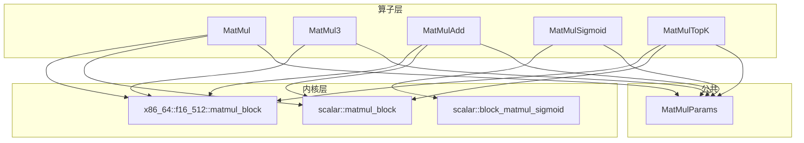
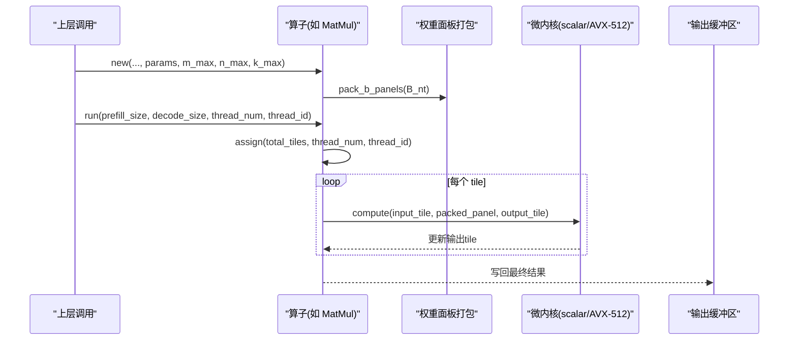
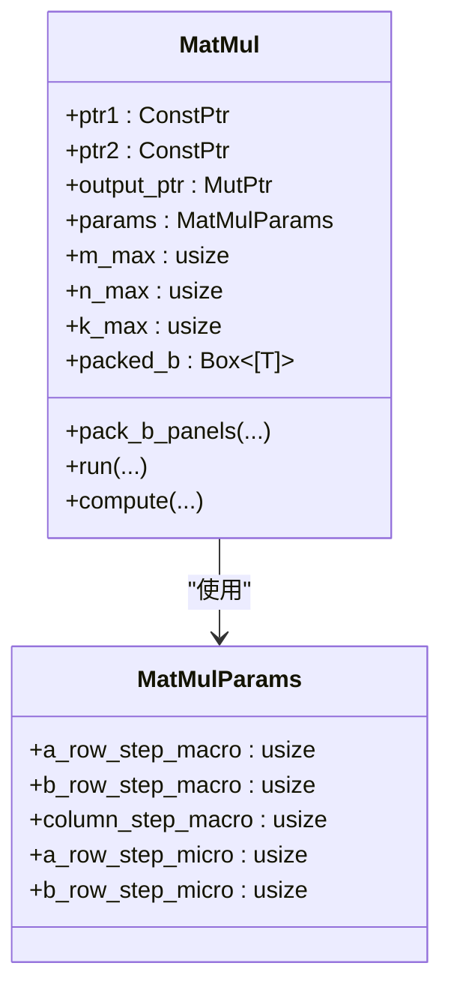
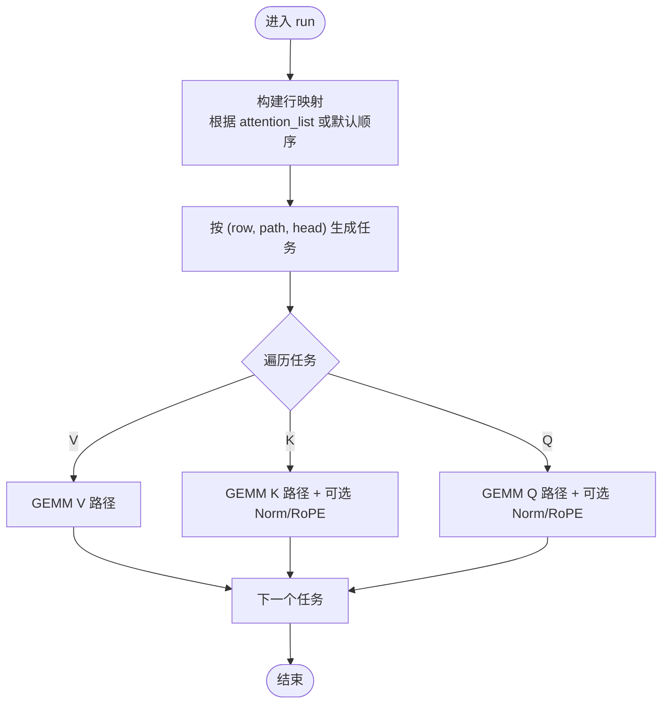
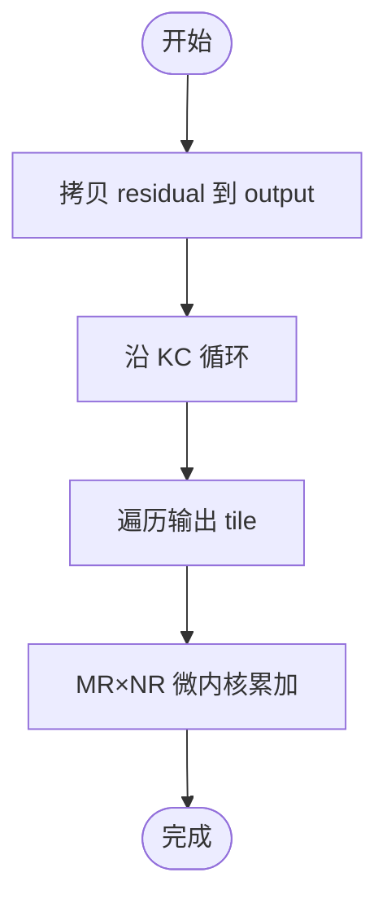
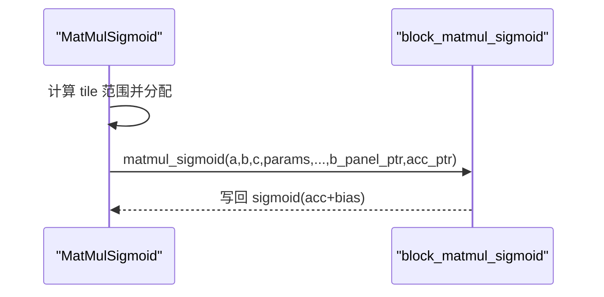
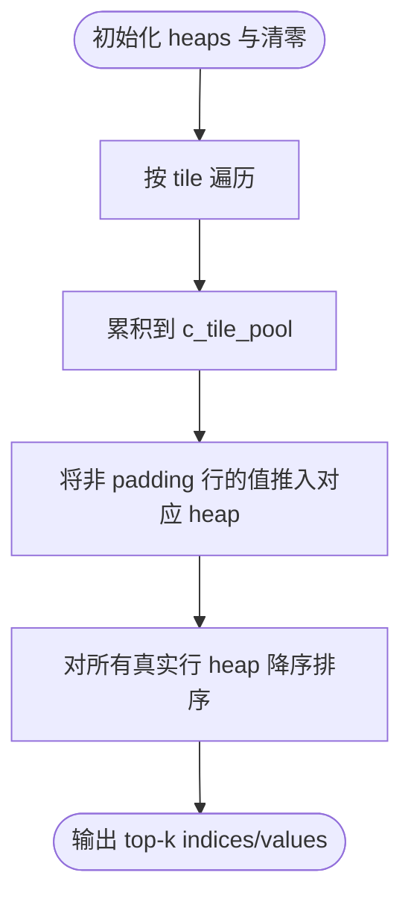
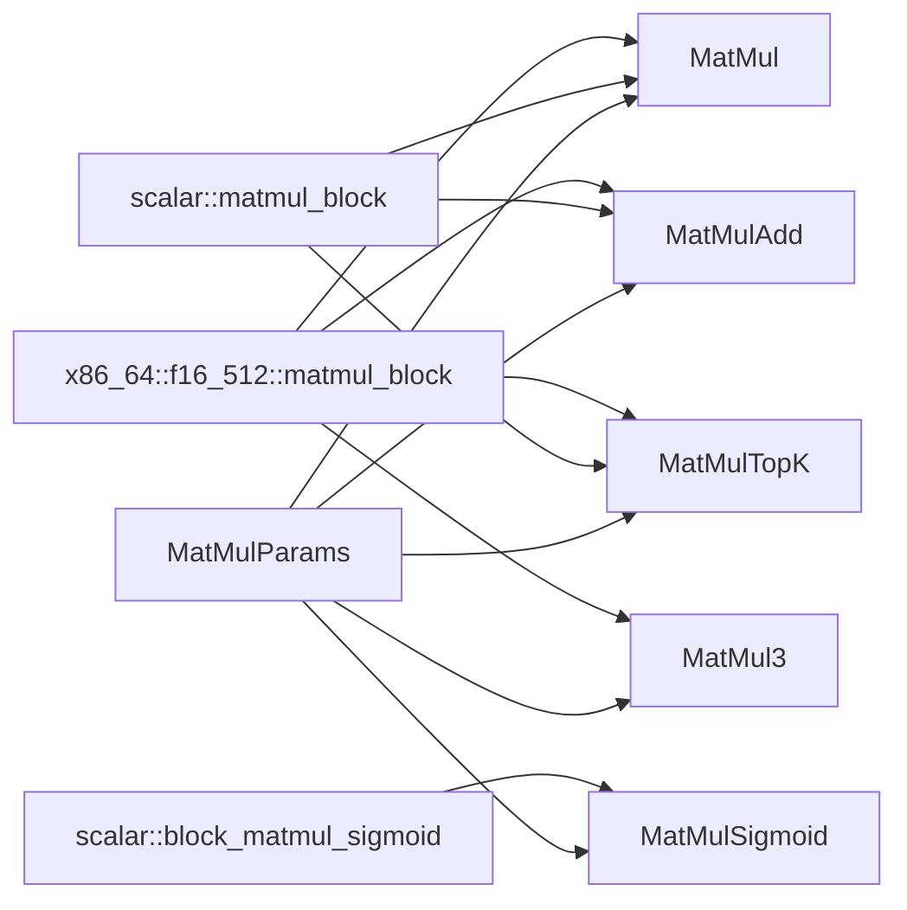

# 线性算子

<cite>
**本文引用的文件列表**
- [matmul.rs](file://src/operators/matmul/matmul.rs)
- [matmul3.rs](file://src/operators/matmul/matmul3.rs)
- [matmul_add.rs](file://src/operators/matmul/matmul_add.rs)
- [matmul_sigmoid.rs](file://src/operators/matmul/matmul_sigmoid.rs)
- [matmul_topk.rs](file://src/operators/matmul/matmul_topk.rs)
- [matmul_params.rs](file://src/kernel/common/matmul_params.rs)
- [linear.rs](file://src/operators/traits/linear.rs)
- [block_matmul_sigmoid.rs](file://src/kernel/scalar/block_matmul_sigmoid.rs)
- [matmul_block.rs](file://src/kernel/x86_64/f16_512/matmul_block.rs)
- [matmul_block_scalar.rs](file://src/kernel/scalar/matmul_block.rs)
- [matmul.md](file://docs/design/operators/matmul.md)
</cite>

## 目录
1. [简介](#简介)
2. [项目结构](#项目结构)
3. [核心组件](#核心组件)
4. [架构总览](#架构总览)
5. [详细组件分析](#详细组件分析)
6. [依赖关系分析](#依赖关系分析)
7. [性能考量与调优](#性能考量与调优)
8. [故障排查指南](#故障排查指南)
9. [结论](#结论)
10. [附录：使用示例与最佳实践](#附录使用示例与最佳实践)

## 简介
本技术文档聚焦于线性算子的实现原理、优化策略与应用场景，覆盖以下关键算子：
- 矩阵乘法 MatMul：通用 GEMM 的块化与微内核设计、权重面板打包、多线程并行。
- 三输入矩阵乘法 MatMul3：Q/K/V 三路投影融合，支持可选 RMSNorm+RoPE 融合路径。
- 矩阵加法融合 MatMulAdd：残差融合，减少中间缓冲与访存。
- 激活函数融合 MatMulSigmoid：GEMM + Bias + Sigmoid 融合，降低内存带宽压力。
- TopK 选择算子 MatMulTopK：在 MoE 路由中用于为每个 token 选出 top-k 专家。

文档将系统阐述参数配置、性能调优要点、线程与缓存友好的任务划分策略，并给出可复用的使用示例与对比思路。

## 项目结构
该仓库采用“算子层 + 内核层”的分层组织方式：
- 算子层（operators）：负责任务划分、线程分配、数据布局约定、预处理（如权重面板打包）、以及调用底层内核。
- 内核层（kernel）：提供标量与 SIMD/FMA 优化的微内核，例如 3x32 广播式 FMA 微核。
- 公共参数（common）：统一的分块参数结构 MatMulParams，贯穿所有 GEMM 变体。

图表来源
- [matmul.rs:1-120](file://src/operators/matmul/matmul.rs#L1-L120)
- [matmul_add.rs:1-120](file://src/operators/matmul/matmul_add.rs#L1-L120)
- [matmul_sigmoid.rs:1-120](file://src/operators/matmul/matmul_sigmoid.rs#L1-L120)
- [matmul3.rs:1-120](file://src/operators/matmul/matmul3.rs#L1-L120)
- [matmul_topk.rs:1-120](file://src/operators/matmul/matmul_topk.rs#L1-L120)
- [matmul_params.rs:1-36](file://src/kernel/common/matmul_params.rs#L1-L36)
- [matmul_block_scalar.rs:1-43](file://src/kernel/scalar/matmul_block.rs#L1-L43)
- [matmul_block.rs:1-85](file://src/kernel/x86_64/f16_512/matmul_block.rs#L1-L85)
- [block_matmul_sigmoid.rs:1-110](file://src/kernel/scalar/block_matmul_sigmoid.rs#L1-L110)

章节来源
- [matmul.md:1-120](file://docs/design/operators/matmul.md#L1-L120)

## 核心组件
本节概述各算子的职责与接口约定，强调其差异点与适用场景。

- MatMul：标准 GEMM，输入 A[M×K]，权重 B_nt[N×K]，输出 C[M×N]；内部对 B 进行 panel 打包，按 MB×NB×KC 分层循环，MR×NR 微内核计算。
- MatMulAdd：C = residual + A×B，先拷贝 residual 到输出，再累加 A×B，避免额外中间缓冲。
- MatMulSigmoid：C = sigmoid(A×B + bias)，引入每线程 acc_pool 暂存中间结果，最后一次性写回并应用激活。
- MatMul3：同时完成 Q/K/V 三路投影，支持可选 RMSNorm+RoPE 融合，面向注意力前向。
- MatMulTopK：在路由阶段为每个 token 计算得分并维护 top-k 堆，输出 indices 与 values。

章节来源
- [matmul.rs:27-100](file://src/operators/matmul/matmul.rs#L27-L100)
- [matmul_add.rs:28-97](file://src/operators/matmul/matmul_add.rs#L28-L97)
- [matmul_sigmoid.rs:23-94](file://src/operators/matmul/matmul_sigmoid.rs#L23-L94)
- [matmul3.rs:79-207](file://src/operators/matmul/matmul3.rs#L79-L207)
- [matmul_topk.rs:32-175](file://src/operators/matmul/matmul_topk.rs#L32-L175)

## 架构总览
下图展示从算子层到内核层的调用链与数据流。

图表来源
- [matmul.rs:165-288](file://src/operators/matmul/matmul.rs#L165-L288)
- [matmul_block_scalar.rs:14-43](file://src/kernel/scalar/matmul_block.rs#L14-L43)
- [matmul_block.rs:22-85](file://src/kernel/x86_64/f16_512/matmul_block.rs#L22-L85)

## 详细组件分析

### MatMul：通用矩阵乘法
- 数据布局：A[M×K]，B_nt[N×K]，C[M×N]。B 以 NT 布局传入，便于后续 panel 打包。
- 分块策略：MB×NB×KC 三层分块，MR×NR 微内核；run() 内通过 assign() 静态切分 tile 范围，保证线程间连续访问与写回。
- 权重打包：new() 中将 B_nt 预打包为 Kc×NR 的面板数组，运行期直接复用，避免重复转置或重排。
- 特化路径：当目标支持 AVX-512 FP16 时，调用 x86_64::f16_512::matmul_block 微核；否则回退到 scalar 版本。

图表来源
- [matmul.rs:27-100](file://src/operators/matmul/matmul.rs#L27-L100)
- [matmul_params.rs:1-36](file://src/kernel/common/matmul_params.rs#L1-L36)

章节来源
- [matmul.rs:109-163](file://src/operators/matmul/matmul.rs#L109-L163)
- [matmul.rs:165-288](file://src/operators/matmul/matmul.rs#L165-L288)
- [matmul.rs:294-362](file://src/operators/matmul/matmul.rs#L294-L362)
- [matmul_block_scalar.rs:14-43](file://src/kernel/scalar/matmul_block.rs#L14-L43)
- [matmul_block.rs:22-85](file://src/kernel/x86_64/f16_512/matmul_block.rs#L22-L85)

### MatMul3：三输入矩阵乘法（Q/K/V 投影）
- 功能：一次调用完成 Q、K、V 三路 GEMM，并可选择性执行 RMSNorm+RoPE 融合。
- 布局约定：hidden[A][M×K]，Wq_nt[Nq×K]，Wk_nt[Nkv×K]，Wv_nt[Nkv×K]；输出分别写入 q_state、k_state、v_state。
- 线程任务：按行映射与 head 维度组合生成任务，支持 attention_list 指定 token 序列切片。
- 融合路径：在最后一组 reduction 完成后，针对完整 head_dim 窗口触发 RMSNorm+RoPE 融合，减少中间读写。

图表来源
- [matmul3.rs:525-621](file://src/operators/matmul/matmul3.rs#L525-L621)
- [matmul3.rs:281-391](file://src/operators/matmul/matmul3.rs#L281-L391)
- [matmul3.rs:447-494](file://src/operators/matmul/matmul3.rs#L447-L494)

章节来源
- [matmul3.rs:79-207](file://src/operators/matmul/matmul3.rs#L79-L207)
- [matmul3.rs:281-391](file://src/operators/matmul/matmul3.rs#L281-L391)
- [matmul3.rs:525-621](file://src/operators/matmul/matmul3.rs#L525-L621)

### MatMulAdd：矩阵加法融合（残差融合）
- 语义：C = residual + A×B。先拷贝 residual 到输出，再原地累加 A×B，避免额外中间缓冲。
- 对齐与边界：对 active_input_rows 做 MR 对齐，处理尾部 micro-tile 时使用 compute_rows 分支。
- 性能优势：减少一次独立写回，提升缓存局部性与吞吐。

图表来源
- [matmul_add.rs:167-319](file://src/operators/matmul/matmul_add.rs#L167-L319)
- [matmul_add.rs:325-371](file://src/operators/matmul/matmul_add.rs#L325-L371)

章节来源
- [matmul_add.rs:53-97](file://src/operators/matmul/matmul_add.rs#L53-L97)
- [matmul_add.rs:167-319](file://src/operators/matmul/matmul_add.rs#L167-L319)
- [matmul_add.rs:375-468](file://src/operators/matmul/matmul_add.rs#L375-L468)

### MatMulSigmoid：激活融合（GEMM + Bias + Sigmoid）
- 语义：acc = A×B + bias；output = sigmoid(acc)。
- 线程私有 scratch：b_panel_pool 用于 B 的连续面板读取；acc_pool 用于 tile 级中间累加，避免频繁写回。
- 性能优势：将激活与偏置融合到写回阶段，减少访存与状态切换。

图表来源
- [matmul_sigmoid.rs:101-186](file://src/operators/matmul/matmul_sigmoid.rs#L101-L186)
- [block_matmul_sigmoid.rs:6-110](file://src/kernel/scalar/block_matmul_sigmoid.rs#L6-L110)

章节来源
- [matmul_sigmoid.rs:44-94](file://src/operators/matmul/matmul_sigmoid.rs#L44-L94)
- [matmul_sigmoid.rs:101-186](file://src/operators/matmul/matmul_sigmoid.rs#L101-L186)
- [block_matmul_sigmoid.rs:1-110](file://src/kernel/scalar/block_matmul_sigmoid.rs#L1-L110)

### MatMulTopK：TopK 选择算子（路由应用）
- 功能：对每个 token 计算得分，维护固定容量最小堆，输出 top-k 的 indices 与 values。
- 线程与批处理：为每个 (batch, thread) 绑定一个 heap，避免竞争；仅对真实 batch 行清理与排序，忽略 padding 行。
- 应用场景：MoE 路由中为每个 token 选择 top-k 专家，配合 expert routing 与 merge-add 完成稀疏前向。

图表来源
- [matmul_topk.rs:254-401](file://src/operators/matmul/matmul_topk.rs#L254-L401)
- [matmul_topk.rs:412-455](file://src/operators/matmul/matmul_topk.rs#L412-L455)

章节来源
- [matmul_topk.rs:73-175](file://src/operators/matmul/matmul_topk.rs#L73-L175)
- [matmul_topk.rs:254-401](file://src/operators/matmul/matmul_topk.rs#L254-L401)
- [matmul_topk.rs:412-455](file://src/operators/matmul/matmul_topk.rs#L412-L455)

## 依赖关系分析
- 参数统一：所有算子共享 MatMulParams，确保宏块与微内核尺寸一致。
- 内核选择：根据目标平台特性选择 scalar 或 AVX-512 FP16 微内核。
- 线程分配：统一通过 assign() 进行连续 tile 范围分配，保证空间局部性。

图表来源
- [matmul_params.rs:1-36](file://src/kernel/common/matmul_params.rs#L1-L36)
- [matmul_block_scalar.rs:14-43](file://src/kernel/scalar/matmul_block.rs#L14-L43)
- [matmul_block.rs:22-85](file://src/kernel/x86_64/f16_512/matmul_block.rs#L22-L85)
- [block_matmul_sigmoid.rs:6-110](file://src/kernel/scalar/block_matmul_sigmoid.rs#L6-L110)

章节来源
- [matmul.rs:294-362](file://src/operators/matmul/matmul.rs#L294-L362)
- [matmul_add.rs:325-468](file://src/operators/matmul/matmul_add.rs#L325-L468)
- [matmul_sigmoid.rs:101-186](file://src/operators/matmul/matmul_sigmoid.rs#L101-L186)
- [matmul3.rs:704-776](file://src/operators/matmul/matmul3.rs#L704-L776)
- [matmul_topk.rs:457-550](file://src/operators/matmul/matmul_topk.rs#L457-L550)

## 性能考量与调优
- 分块参数选择：MB/NB/KC/MR/NR 需结合硬件 L1/L2 大小与向量宽度调整。过大的 KC 会增加 B_panel 压力，过小则增加打包与循环开销。
- 权重预打包：静态权重应在层初始化时完成 B_nt 到 panel 的打包，推理阶段直接复用，避免运行时重排。
- 线程私有 scratch：b_panel_pool 与 acc_pool 避免 false sharing 与同步开销，稳定吞吐。
- 连续任务分配：assign() 返回连续 tile 范围，有利于 CPU 预取与写回局部性。
- 融合收益：MatMulAdd 与 MatMulSigmoid 通过减少中间缓冲与激活写回，显著降低内存带宽压力。
- 平台特化：在支持 AVX-512 FP16 的平台上，3×32 广播式微核能显著提升吞吐。

章节来源
- [matmul.md:108-210](file://docs/design/operators/matmul.md#L108-L210)
- [matmul.md:345-448](file://docs/design/operators/matmul.md#L345-L448)
- [matmul.md:451-519](file://docs/design/operators/matmul.md#L451-L519)

## 故障排查指南
- 维度对齐错误：确保 m_max/n_max/k_max 与 MR/NR/KC 约束一致，active_input_rows 需能被 MR 整除（内部会 pad）。
- 线程越界：thread_num 与 thread_id 需在构造时检测范围内，避免越界访问。
- 权重布局：B_nt 必须为 N×K 行主布局，panel 打包索引需与 micro_tile_cols 对齐。
- 融合路径条件：MatMul3 的 RMSNorm+RoPE 仅在最后一个 reduction 且 head_dim 对齐时触发。
- TopK 堆管理：仅对真实 batch 行清理与排序，padding 行应跳过以避免无效操作。

章节来源
- [matmul.rs:165-288](file://src/operators/matmul/matmul.rs#L165-L288)
- [matmul_add.rs:167-319](file://src/operators/matmul/matmul_add.rs#L167-L319)
- [matmul_sigmoid.rs:101-186](file://src/operators/matmul/matmul_sigmoid.rs#L101-L186)
- [matmul3.rs:281-391](file://src/operators/matmul/matmul3.rs#L281-L391)
- [matmul_topk.rs:254-401](file://src/operators/matmul/matmul_topk.rs#L254-L401)

## 结论
本代码库通过“算子层 + 内核层”的分层设计与严格的分块/打包策略，实现了高效、可扩展的线性算子族。MatMul 提供基础 GEMM 能力，MatMulAdd 与 MatMulSigmoid 通过融合减少内存压力，MatMul3 面向注意力前向的三路投影与可选融合，MatMulTopK 支撑 MoE 路由的高效选择。合理的参数调优与平台特化是获得高性能的关键。

## 附录：使用示例与最佳实践
- 基本用法（MatMul）：
  - 准备 A[M×K]、B_nt[N×K]、C[M×N] 缓冲区。
  - 设置 MatMulParams（MB/NB/KC/MR/NR），调用 new() 预打包 B。
  - 调用 run(prefill_size, decode_size, thread_num, thread_id) 执行。
  - 参考测试用例验证正确性与精度。

- 残差融合（MatMulAdd）：
  - 准备 residual[M×N]，先拷贝到 output，再累加 A×B。
  - 适用于 MLP 层后接残差连接的场景。

- 激活融合（MatMulSigmoid）：
  - 可选 bias 输入，启用 use_routing_bias 控制是否逐列加偏置。
  - 适合门控或路由打分阶段。

- 三路投影（MatMul3）：
  - 传入 Wq_nt/Wk_nt/Wv_nt，设置 kv_head_num/group_num/head_dim。
  - 若 use_qk_norm=true，则在 K/Q 路径上执行 RMSNorm+RoPE 融合。

- TopK 路由（MatMulTopK）：
  - 为每个 token 维护 top-k 堆，输出 indices 与 values。
  - 与 expert routing 和 merge-add 配合完成 MoE 前向。

- 性能对比建议：
  - 对比纯 GEMM 与融合路径（MatMulAdd/MatMulSigmoid）的吞吐与时延。
  - 在不同 MB/NB/KC/MR/NR 组合下评估缓存命中与 FMA 利用率。
  - 在支持 AVX-512 FP16 的平台比较 scalar 与 AVX 路径的性能差异。

章节来源
- [matmul.rs:365-661](file://src/operators/matmul/matmul.rs#L365-L661)
- [matmul_add.rs:470-716](file://src/operators/matmul/matmul_add.rs#L470-L716)
- [matmul_sigmoid.rs:189-254](file://src/operators/matmul/matmul_sigmoid.rs#L189-L254)
- [matmul_topk.rs:593-800](file://src/operators/matmul/matmul_topk.rs#L593-L800)