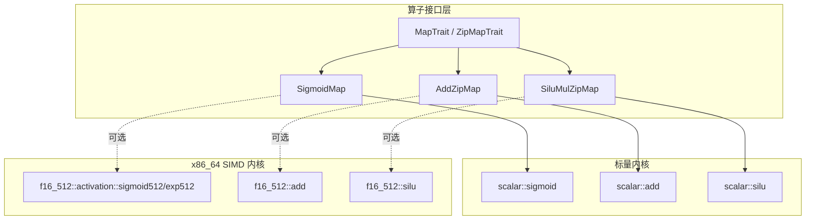
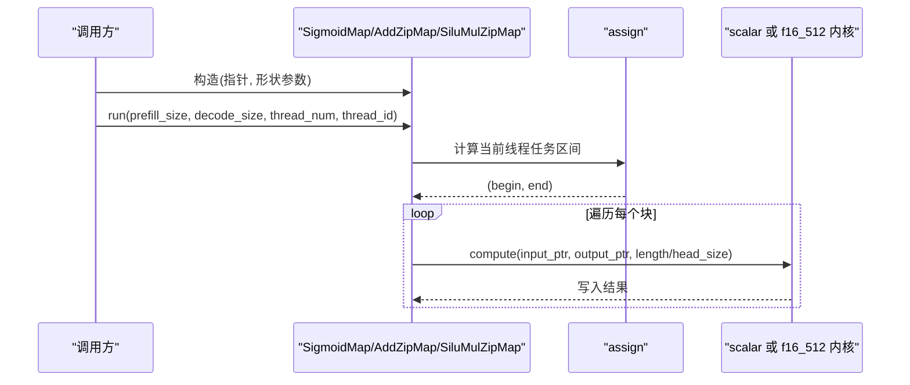
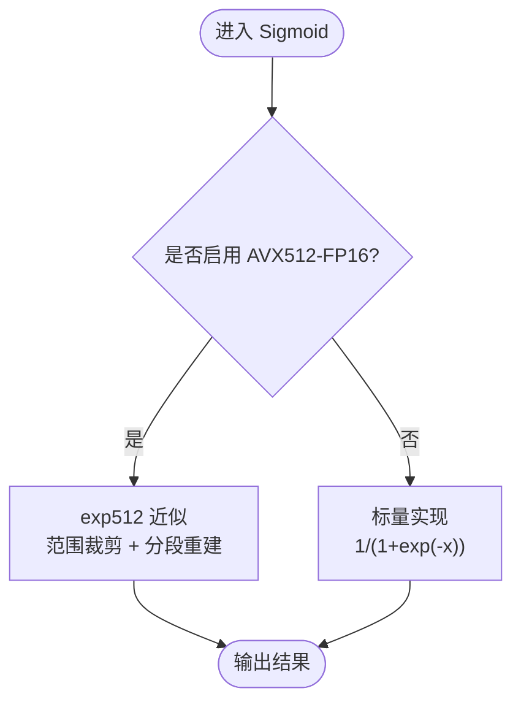
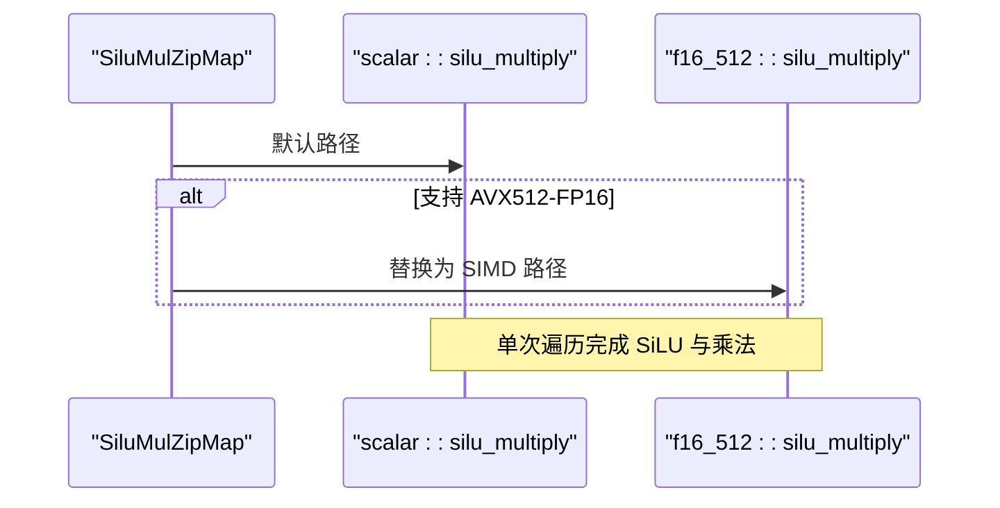
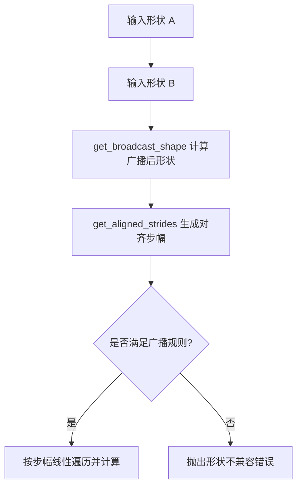
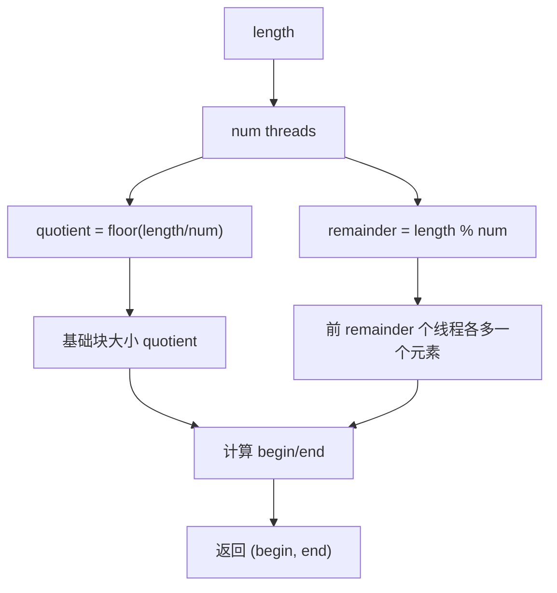
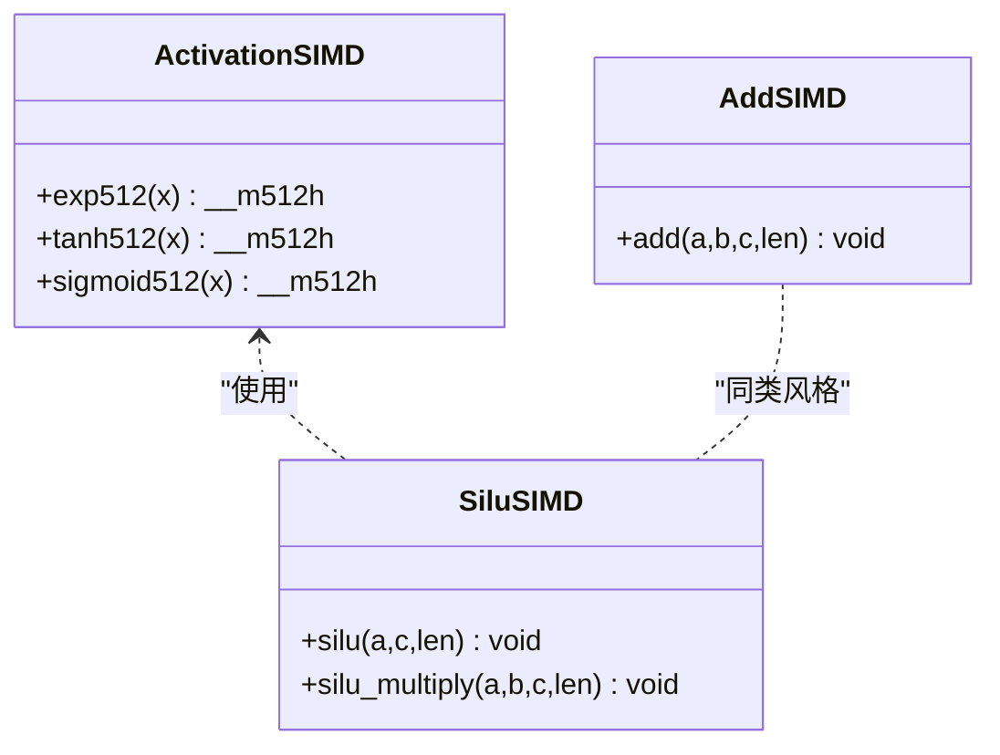
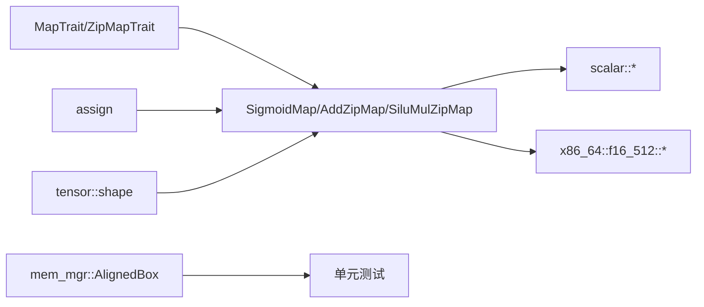

# 逐元素算子

<cite>
**本文引用的文件**   
- [src/operators/elementwise/sigmoid_map.rs](file://src/operators/elementwise/sigmoid_map.rs)
- [src/operators/elementwise/add_zip.rs](file://src/operators/elementwise/add_zip.rs)
- [src/operators/elementwise/silu_mul_zip.rs](file://src/operators/elementwise/silu_mul_zip.rs)
- [src/kernel/scalar/sigmoid.rs](file://src/kernel/scalar/sigmoid.rs)
- [src/kernel/scalar/silu.rs](file://src/kernel/scalar/silu.rs)
- [src/kernel/scalar/add.rs](file://src/kernel/scalar/add.rs)
- [src/kernel/x86_64/f16_512/activation.rs](file://src/kernel/x86_64/f16_512/activation.rs)
- [src/kernel/x86_64/f16_512/silu.rs](file://src/kernel/x86_64/f16_512/silu.rs)
- [src/kernel/x86_64/f16_512/add.rs](file://src/kernel/x86_64/f16_512/add.rs)
- [src/operators/traits/map.rs](file://src/operators/traits/map.rs)
- [src/operators/assign.rs](file://src/operators/assign.rs)
- [src/tensor/shape.rs](file://src/tensor/shape.rs)
- [src/mem_mgr/allocator.rs](file://src/mem_mgr/allocator.rs)
</cite>

## 目录
1. [简介](#简介)
2. [项目结构](#项目结构)
3. [核心组件](#核心组件)
4. [架构总览](#架构总览)
5. [详细组件分析](#详细组件分析)
6. [依赖关系分析](#依赖关系分析)
7. [性能考量](#性能考量)
8. [故障排查指南](#故障排查指南)
9. [结论](#结论)
10. [附录](#附录)

## 简介
本技术文档聚焦于“逐元素算子”的实现与优化，涵盖并行计算模式、SIMD 向量化策略、数值稳定性与近似计算、融合计算与内存访问优化、广播机制与形状对齐、内存布局与缓存友好性设计、数据类型精度处理与性能对比，以及调试与验证方法。读者无需深入底层即可理解整体设计与关键实现要点。

## 项目结构
本项目将逐元素算子按“算子接口层 + 标量内核 + 平台 SIMD 内核”分层组织：
- 算子接口层：定义 Map/ZipMap 统一接口，封装线程分片调度与头块遍历逻辑
- 标量内核：通用类型泛型实现，保证正确性与可移植性
- 平台 SIMD 内核：针对 x86_64 AVX512-FP16 的专用路径，提供高性能实现

图示来源
- [src/operators/elementwise/sigmoid_map.rs:1-83](file://src/operators/elementwise/sigmoid_map.rs#L1-L83)
- [src/operators/elementwise/add_zip.rs:1-211](file://src/operators/elementwise/add_zip.rs#L1-L211)
- [src/operators/elementwise/silu_mul_zip.rs:1-281](file://src/operators/elementwise/silu_mul_zip.rs#L1-L281)
- [src/operators/traits/map.rs:1-8](file://src/operators/traits/map.rs#L1-L8)
- [src/kernel/scalar/sigmoid.rs:1-38](file://src/kernel/scalar/sigmoid.rs#L1-L38)
- [src/kernel/scalar/add.rs:1-34](file://src/kernel/scalar/add.rs#L1-L34)
- [src/kernel/scalar/silu.rs:1-97](file://src/kernel/scalar/silu.rs#L1-L97)
- [src/kernel/x86_64/f16_512/activation.rs:1-238](file://src/kernel/x86_64/f16_512/activation.rs#L1-L238)
- [src/kernel/x86_64/f16_512/add.rs:1-69](file://src/kernel/x86_64/f16_512/add.rs#L1-L69)
- [src/kernel/x86_64/f16_512/silu.rs:1-148](file://src/kernel/x86_64/f16_512/silu.rs#L1-L148)

章节来源
- [src/operators/elementwise/sigmoid_map.rs:1-83](file://src/operators/elementwise/sigmoid_map.rs#L1-L83)
- [src/operators/elementwise/add_zip.rs:1-211](file://src/operators/elementwise/add_zip.rs#L1-L211)
- [src/operators/elementwise/silu_mul_zip.rs:1-281](file://src/operators/elementwise/silu_mul_zip.rs#L1-L281)
- [src/operators/traits/map.rs:1-8](file://src/operators/traits/map.rs#L1-L8)

## 核心组件
- 统一接口
  - MapTrait：单输入映射（如 Sigmoid）
  - ZipMapTrait：双输入映射（如 Add、SiLU×Gate）
- 并行调度
  - assign：将长度均匀切分为多段，分配给不同线程
  - run/run_scheduled：根据 prefill/decode 阶段选择活跃行数，按 head_num × head_size 进行块级遍历
- 内核分发
  - 默认走 scalar 路径；在具备 AVX512-FP16 时自动切换至 f16_512 路径

章节来源
- [src/operators/traits/map.rs:1-8](file://src/operators/traits/map.rs#L1-L8)
- [src/operators/assign.rs:1-258](file://src/operators/assign.rs#L1-L258)
- [src/operators/elementwise/sigmoid_map.rs:1-83](file://src/operators/elementwise/sigmoid_map.rs#L1-L83)
- [src/operators/elementwise/add_zip.rs:1-211](file://src/operators/elementwise/add_zip.rs#L1-L211)
- [src/operators/elementwise/silu_mul_zip.rs:1-281](file://src/operators/elementwise/silu_mul_zip.rs#L1-L281)

## 架构总览
下图展示从算子调用到内核执行的完整流程，包括并行分片、头块遍历与内核选择。

图示来源
- [src/operators/elementwise/sigmoid_map.rs:37-53](file://src/operators/elementwise/sigmoid_map.rs#L37-L53)
- [src/operators/elementwise/add_zip.rs:64-92](file://src/operators/elementwise/add_zip.rs#L64-L92)
- [src/operators/elementwise/silu_mul_zip.rs:73-103](file://src/operators/elementwise/silu_mul_zip.rs#L73-L103)
- [src/operators/assign.rs:11-38](file://src/operators/assign.rs#L11-L38)
- [src/kernel/scalar/sigmoid.rs:5-19](file://src/kernel/scalar/sigmoid.rs#L5-L19)
- [src/kernel/scalar/add.rs:4-17](file://src/kernel/scalar/add.rs#L4-L17)
- [src/kernel/scalar/silu.rs:20-40](file://src/kernel/scalar/silu.rs#L20-L40)
- [src/kernel/x86_64/f16_512/add.rs:4-17](file://src/kernel/x86_64/f16_512/add.rs#L4-L17)
- [src/kernel/x86_64/f16_512/silu.rs:18-36](file://src/kernel/x86_64/f16_512/silu.rs#L18-L36)

## 详细组件分析

### Sigmoid 激活函数
- 并行模式
  - 使用 assign 将总长度切分，每线程处理连续区间，避免锁竞争
- 数值稳定性与近似计算
  - 标量路径直接调用类型特化的 sigmoid 实现
  - f16_512 路径采用 exp512 的 Cephes 多项式近似，配合范围裁剪与分段重建，确保在 f16 下稳定且高效
- 数据路径
  - 默认 scalar::sigmoid；若目标支持 AVX512-FP16，则通过 activation::sigmoid512 加速

图示来源
- [src/operators/elementwise/sigmoid_map.rs:67-82](file://src/operators/elementwise/sigmoid_map.rs#L67-L82)
- [src/kernel/scalar/sigmoid.rs:5-19](file://src/kernel/scalar/sigmoid.rs#L5-L19)
- [src/kernel/x86_64/f16_512/activation.rs:13-68](file://src/kernel/x86_64/f16_512/activation.rs#L13-L68)
- [src/kernel/x86_64/f16_512/activation.rs:103-116](file://src/kernel/x86_64/f16_512/activation.rs#L103-L116)

章节来源
- [src/operators/elementwise/sigmoid_map.rs:1-83](file://src/operators/elementwise/sigmoid_map.rs#L1-L83)
- [src/kernel/scalar/sigmoid.rs:1-38](file://src/kernel/scalar/sigmoid.rs#L1-L38)
- [src/kernel/x86_64/f16_512/activation.rs:1-238](file://src/kernel/x86_64/f16_512/activation.rs#L1-L238)

### SiLU 激活函数与融合计算
- 融合计算
  - SiluMulZipMap 将 SiLU 与门控乘法融合为一次遍历，减少中间存储与访存次数
- 内存访问优化
  - 以 head_size 为粒度顺序访问，提升空间局部性；在 AVX512-FP16 路径上按 32 个 f16 向量加载/存储
- 数值路径
  - 标量路径：先计算 v*sigmoid(v)，再乘以第二个输入
  - f16_512 路径：利用 _mm512_mul_ph 与 sigmoid512 完成融合

图示来源
- [src/operators/elementwise/silu_mul_zip.rs:108-154](file://src/operators/elementwise/silu_mul_zip.rs#L108-L154)
- [src/kernel/scalar/silu.rs:20-40](file://src/kernel/scalar/silu.rs#L20-L40)
- [src/kernel/x86_64/f16_512/silu.rs:18-36](file://src/kernel/x86_64/f16_512/silu.rs#L18-L36)

章节来源
- [src/operators/elementwise/silu_mul_zip.rs:1-281](file://src/operators/elementwise/silu_mul_zip.rs#L1-L281)
- [src/kernel/scalar/silu.rs:1-97](file://src/kernel/scalar/silu.rs#L1-L97)
- [src/kernel/x86_64/f16_512/silu.rs:1-148](file://src/kernel/x86_64/f16_512/silu.rs#L1-L148)

### 向量加法与广播机制
- 基本加法
  - AddZipMap 对两个等长张量逐元素相加，按 head_size 分块顺序访问
- 广播机制与形状对齐
  - get_broadcast_shape：从右向左对齐维度，要求非 1 维度必须相等
  - get_aligned_strides：为广播维度设置步幅为 0，实现“原地复用”同一位置的值
  - 注意：当前逐元素算子主要面向同形或已对齐的输入；通用广播迭代器代码被注释，可按需启用

图示来源
- [src/tensor/shape.rs:44-72](file://src/tensor/shape.rs#L44-L72)
- [src/tensor/shape.rs:18-42](file://src/tensor/shape.rs#L18-L42)
- [src/operators/elementwise/add_zip.rs:98-139](file://src/operators/elementwise/add_zip.rs#L98-L139)

章节来源
- [src/operators/elementwise/add_zip.rs:1-211](file://src/operators/elementwise/add_zip.rs#L1-L211)
- [src/tensor/shape.rs:1-182](file://src/tensor/shape.rs#L1-L182)

### 并行计算模式与线程分片
- 分片策略
  - assign 将 [0, length) 均匀切分，余数优先分配给前若干线程，保证负载均衡
- 执行模型
  - 外层按 head_num 遍历，内层按 head_size 顺序处理，利于缓存命中
- 适用场景
  - prefill/decode 阶段均可用，依据 active_rows 动态决定实际工作负载

图示来源
- [src/operators/assign.rs:11-38](file://src/operators/assign.rs#L11-L38)

章节来源
- [src/operators/assign.rs:1-258](file://src/operators/assign.rs#L1-L258)
- [src/operators/elementwise/add_zip.rs:64-92](file://src/operators/elementwise/add_zip.rs#L64-L92)
- [src/operators/elementwise/silu_mul_zip.rs:73-103](file://src/operators/elementwise/silu_mul_zip.rs#L73-L103)

### SIMD 优化策略（x86_64 AVX512-FP16）
- 向量化宽度
  - 每次处理 32 个 f16 元素，充分利用 512bit 寄存器
- 关键指令
  - 加载/存储：_mm512_load_ph / _mm512_store_ph
  - 算术：_mm512_add_ph / _mm512_mul_ph
  - 激活：exp512 基于 Cephes 多项式近似，结合范围裁剪与分段重建
- 条件编译
  - 仅在目标架构与特性满足时启用，否则回退到标量路径

图示来源
- [src/kernel/x86_64/f16_512/activation.rs:13-68](file://src/kernel/x86_64/f16_512/activation.rs#L13-L68)
- [src/kernel/x86_64/f16_512/activation.rs:103-116](file://src/kernel/x86_64/f16_512/activation.rs#L103-L116)
- [src/kernel/x86_64/f16_512/add.rs:4-17](file://src/kernel/x86_64/f16_512/add.rs#L4-L17)
- [src/kernel/x86_64/f16_512/silu.rs:6-16](file://src/kernel/x86_64/f16_512/silu.rs#L6-L16)
- [src/kernel/x86_64/f16_512/silu.rs:18-36](file://src/kernel/x86_64/f16_512/silu.rs#L18-L36)

章节来源
- [src/kernel/x86_64/f16_512/activation.rs:1-238](file://src/kernel/x86_64/f16_512/activation.rs#L1-L238)
- [src/kernel/x86_64/f16_512/add.rs:1-69](file://src/kernel/x86_64/f16_512/add.rs#L1-L69)
- [src/kernel/x86_64/f16_512/silu.rs:1-148](file://src/kernel/x86_64/f16_512/silu.rs#L1-L148)

## 依赖关系分析
- 耦合与内聚
  - 算子层仅依赖 traits 与 assign 调度，内聚良好
  - 内核层按 scalar 与 x86_64 分离，便于扩展新平台
- 外部依赖
  - 内存对齐分配器用于测试与对齐需求
  - 形状工具用于广播与步幅计算

图示来源
- [src/operators/traits/map.rs:1-8](file://src/operators/traits/map.rs#L1-L8)
- [src/operators/assign.rs:11-38](file://src/operators/assign.rs#L11-L38)
- [src/operators/elementwise/sigmoid_map.rs:67-82](file://src/operators/elementwise/sigmoid_map.rs#L67-L82)
- [src/operators/elementwise/add_zip.rs:98-139](file://src/operators/elementwise/add_zip.rs#L98-L139)
- [src/operators/elementwise/silu_mul_zip.rs:108-154](file://src/operators/elementwise/silu_mul_zip.rs#L108-L154)
- [src/tensor/shape.rs:44-72](file://src/tensor/shape.rs#L44-L72)
- [src/mem_mgr/allocator.rs:1-56](file://src/mem_mgr/allocator.rs#L1-L56)

章节来源
- [src/operators/traits/map.rs:1-8](file://src/operators/traits/map.rs#L1-L8)
- [src/operators/assign.rs:1-258](file://src/operators/assign.rs#L1-L258)
- [src/tensor/shape.rs:1-182](file://src/tensor/shape.rs#L1-L182)
- [src/mem_mgr/allocator.rs:1-56](file://src/mem_mgr/allocator.rs#L1-L56)

## 性能考量
- 并行与局部性
  - 按 head_num × head_size 顺序访问，最大化 L1/L2 命中率
  - 线程分片避免共享状态，降低同步开销
- SIMD 收益
  - f16_512 路径将吞吐提升约 32 倍（理论），但受限于内存带宽与分支
  - exp512 的多项式近似在 f16 下兼顾速度与精度
- 内存布局
  - 建议保持行主序连续布局，必要时使用 view/permute 调整视图而不复制数据
  - 对齐分配（64B）有助于 SIMD 加载/存储效率
- 数据类型
  - f16 适合大吞吐场景，注意溢出与下溢；f32 更稳健但带宽占用更高
  - 在需要高精度时使用 f32 路径，或在关键路径做混合精度

[本节为通用指导，不直接分析具体文件]

## 故障排查指南
- 常见错误
  - 形状不兼容：广播规则检查失败会触发 panic，请核对 get_broadcast_shape 与 get_aligned_strides 的使用
  - 未对齐内存：SIMD 路径期望对齐地址，建议使用 AlignedBox 或确保分配对齐
  - 线程越界：assign 返回 None 表示该线程无任务，应安全跳过
- 定位方法
  - 使用单元测试断言（UPLS 误差容忍）快速验证数值正确性
  - 在关键路径打印 begin/end 区间与 head_size，确认分片与块遍历正确
  - 切换 scalar/f16_512 路径对比结果，隔离平台相关差异

章节来源
- [src/tensor/shape.rs:44-72](file://src/tensor/shape.rs#L44-L72)
- [src/mem_mgr/allocator.rs:1-56](file://src/mem_mgr/allocator.rs#L1-L56)
- [src/operators/assign.rs:11-38](file://src/operators/assign.rs#L11-L38)
- [src/kernel/scalar/sigmoid.rs:21-37](file://src/kernel/scalar/sigmoid.rs#L21-L37)
- [src/kernel/scalar/silu.rs:42-96](file://src/kernel/scalar/silu.rs#L42-L96)
- [src/kernel/x86_64/f16_512/activation.rs:117-237](file://src/kernel/x86_64/f16_512/activation.rs#L117-L237)

## 结论
本实现以清晰的层次化设计实现了高效的逐元素算子：统一的 Map/ZipMap 接口、稳定的标量内核与高性能的 AVX512-FP16 路径并存；通过合理的并行分片与顺序访问模式，显著提升缓存友好性与吞吐。Sigmoid 的近似实现与 SiLU 的融合计算在保证数值稳定的同时获得可观的性能增益。未来可在通用广播迭代器、更多数据类型与平台后端方面继续扩展。

[本节为总结性内容，不直接分析具体文件]

## 附录
- 最佳实践
  - 优先使用 head_size 对齐的连续内存布局
  - 在 f16 路径中关注溢出边界，必要时引入裁剪
  - 使用 UPLS 断言进行回归测试，覆盖极端值与边界情况
- 参考实现路径
  - Sigmoid：[src/kernel/scalar/sigmoid.rs:5-19](file://src/kernel/scalar/sigmoid.rs#L5-L19)、[src/kernel/x86_64/f16_512/activation.rs:103-116](file://src/kernel/x86_64/f16_512/activation.rs#L103-L116)
  - SiLU 融合：[src/kernel/scalar/silu.rs:20-40](file://src/kernel/scalar/silu.rs#L20-L40)、[src/kernel/x86_64/f16_512/silu.rs:18-36](file://src/kernel/x86_64/f16_512/silu.rs#L18-L36)
  - 向量加法：[src/kernel/scalar/add.rs:4-17](file://src/kernel/scalar/add.rs#L4-L17)、[src/kernel/x86_64/f16_512/add.rs:4-17](file://src/kernel/x86_64/f16_512/add.rs#L4-L17)
  - 并行分片：[src/operators/assign.rs:11-38](file://src/operators/assign.rs#L11-L38)
  - 广播与步幅：[src/tensor/shape.rs:44-72](file://src/tensor/shape.rs#L44-L72)、[src/tensor/shape.rs:18-42](file://src/tensor/shape.rs#L18-L42)