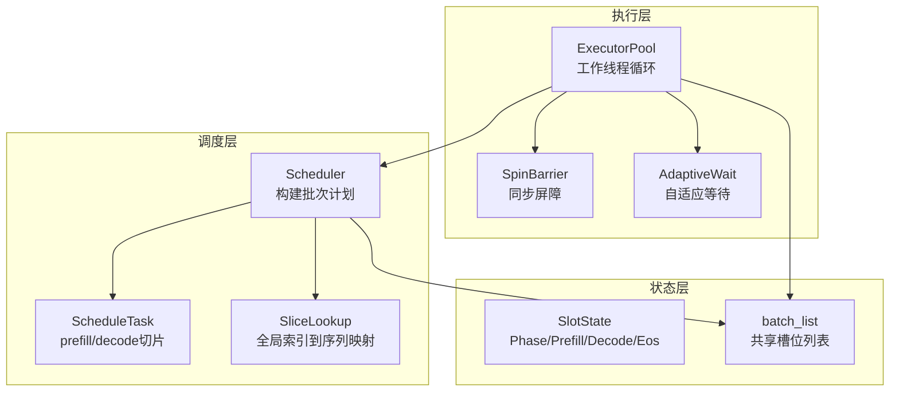
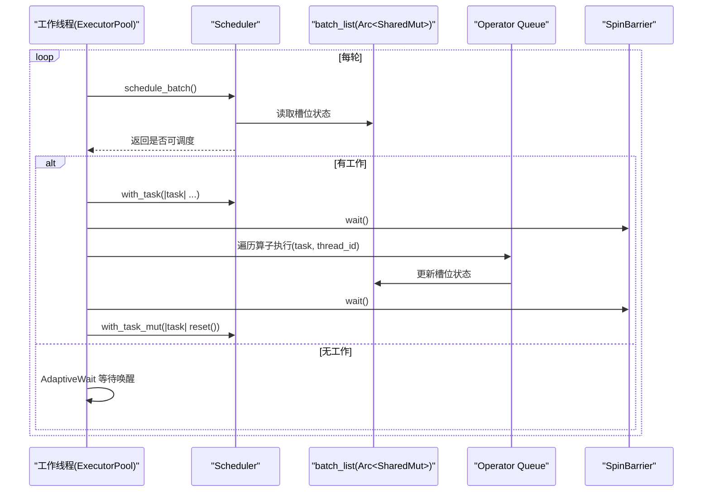
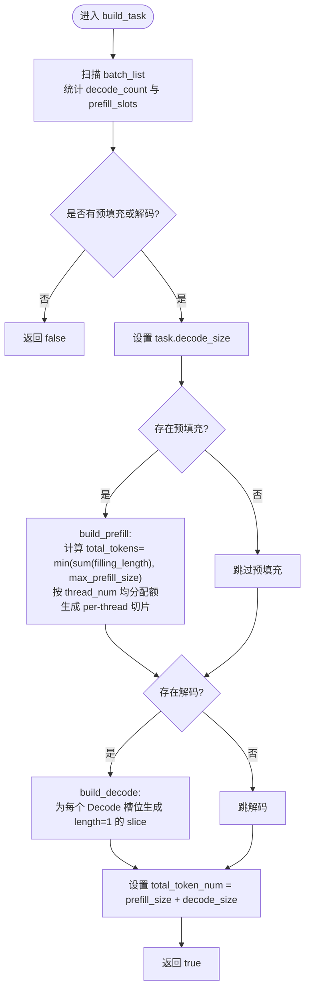
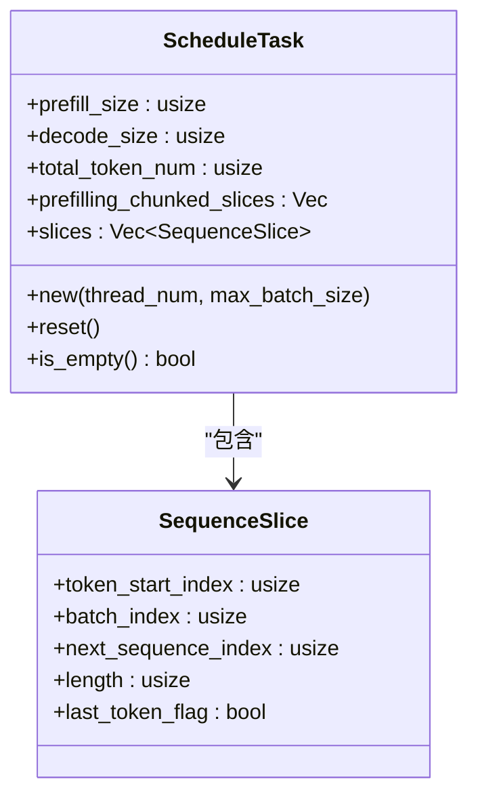
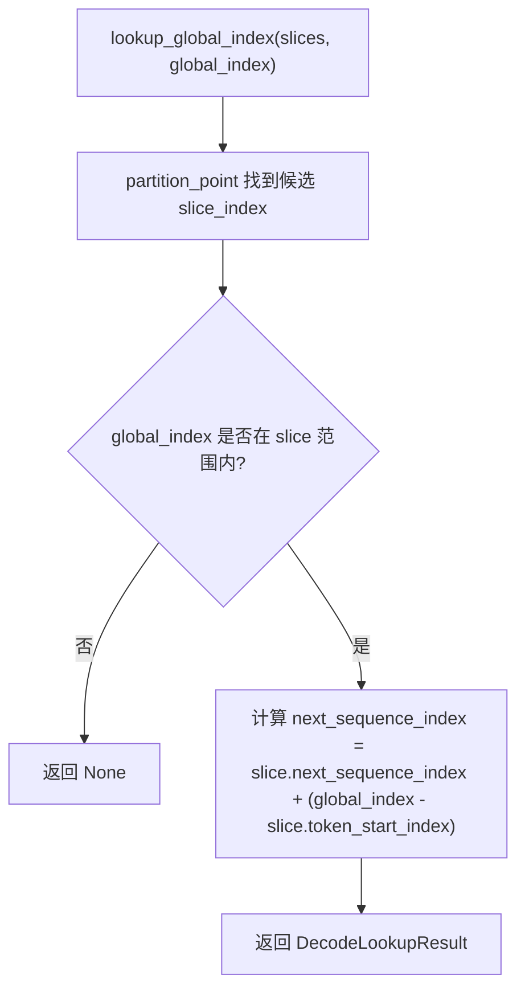
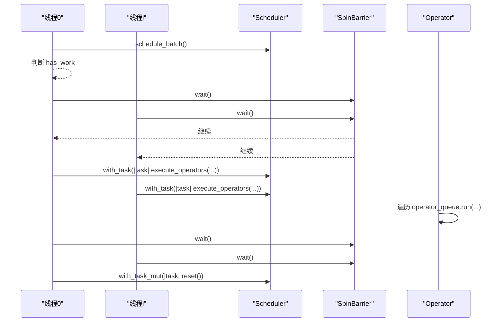
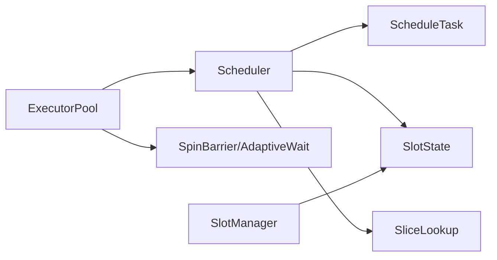

# 任务调度

<cite>
**本文引用的文件**
- [src/runtime/scheduler/mod.rs](file://src/runtime/scheduler/mod.rs)
- [src/runtime/scheduler/scheduler.rs](file://src/runtime/scheduler/scheduler.rs)
- [src/runtime/scheduler/task.rs](file://src/runtime/scheduler/task.rs)
- [src/runtime/scheduler/slice_lookup.rs](file://src/runtime/scheduler/slice_lookup.rs)
- [src/runtime/executor/executor_pool.rs](file://src/runtime/executor/executor_pool.rs)
- [src/runtime/executor/sync.rs](file://src/runtime/executor/sync.rs)
- [src/runtime/session/mod.rs](file://src/runtime/session/mod.rs)
- [src/runtime/session/slot.rs](file://src/runtime/session/slot.rs)
- [src/runtime/config.rs](file://src/runtime/config.rs)
- [docs/design/runtime/schedule.md](file://docs/design/runtime/schedule.md)
- [docs/configuration/optimization.md](file://docs/configuration/optimization.md)
- [src/runtime/tests/test_utils.rs](file://src/runtime/tests/test_utils.rs)
- [src/runtime/tests/scheduler_integration_tests.rs](file://src/runtime/tests/scheduler_integration_tests.rs)
</cite>

## 目录
1. [简介](#简介)
2. [项目结构](#项目结构)
3. [核心组件](#核心组件)
4. [架构总览](#架构总览)
5. [详细组件分析](#详细组件分析)
6. [依赖关系分析](#依赖关系分析)
7. [性能与调优](#性能与调优)
8. [故障排查指南](#故障排查指南)
9. [结论](#结论)
10. [附录](#附录)

## 简介
本技术文档聚焦 eLLM 推理引擎中的任务调度子系统，围绕以下目标展开：
- 深入解释调度器的核心算法：批处理策略、任务优先级排序、资源分配决策
- 详细说明 Task 结构体设计与执行流程：任务状态管理、依赖关系处理
- 解释 SliceLookup 的索引优化机制如何提升查找效率
- 说明调度器如何处理动态负载变化与背压控制
- 提供调度策略的配置选项与调优指南
- 包含调度延迟监控、吞吐量优化与公平性保证机制
- 解释与执行器池的协作模式与错误恢复策略

## 项目结构
调度相关代码位于 runtime 子模块中，主要包含：
- 调度器与任务定义：scheduler 模块
- 执行器池与工作线程：executor 模块
- 会话槽位与生命周期：session 模块
- 配置与线程数推导：config 模块
- 设计文档与优化配置参考：docs 目录

图表来源
- [src/runtime/scheduler/scheduler.rs:15-82](file://src/runtime/scheduler/scheduler.rs#L15-L82)
- [src/runtime/executor/executor_pool.rs:10-149](file://src/runtime/executor/executor_pool.rs#L10-L149)
- [src/runtime/session/slot.rs:18-64](file://src/runtime/session/slot.rs#L18-L64)

章节来源
- [src/runtime/scheduler/mod.rs:1-8](file://src/runtime/scheduler/mod.rs#L1-L8)
- [src/runtime/scheduler/scheduler.rs:15-82](file://src/runtime/scheduler/scheduler.rs#L15-L82)
- [src/runtime/executor/executor_pool.rs:10-149](file://src/runtime/executor/executor_pool.rs#L10-L149)
- [src/runtime/session/slot.rs:18-64](file://src/runtime/session/slot.rs#L18-L64)

## 核心组件
- Scheduler：扫描 batch_list，决定当前轮次是 Prefill、Decode 或混合，生成 ScheduleTask。
- ScheduleTask：承载每轮的预填充与解码切片集合，以及按线程分片的预填充切片。
- SequenceSlice：描述一个连续 token 区间在 batch 中的位置与长度，支持 last_token_flag 标记。
- SliceLookup：基于有序 slices 的二分查找，将“全局 token 索引”映射回具体 batch_index 与 next_sequence_index。
- ExecutorPool：启动若干工作线程，循环从 Scheduler 获取任务并执行算子队列。
- SlotState：表示每个槽位的阶段（Start/Prefill/Decode/Eos）与进度信息。

章节来源
- [src/runtime/scheduler/task.rs:1-49](file://src/runtime/scheduler/task.rs#L1-L49)
- [src/runtime/scheduler/slice_lookup.rs:1-71](file://src/runtime/scheduler/slice_lookup.rs#L1-L71)
- [src/runtime/executor/executor_pool.rs:10-149](file://src/runtime/executor/executor_pool.rs#L10-L149)
- [src/runtime/session/slot.rs:18-64](file://src/runtime/session/slot.rs#L18-L64)

## 架构总览
调度与执行的交互时序如下：

图表来源
- [src/runtime/executor/executor_pool.rs:72-149](file://src/runtime/executor/executor_pool.rs#L72-L149)
- [src/runtime/scheduler/scheduler.rs:66-131](file://src/runtime/scheduler/scheduler.rs#L66-L131)
- [src/runtime/executor/sync.rs:33-55](file://src/runtime/executor/sync.rs#L33-L55)

## 详细组件分析

### 调度器核心算法与批处理策略
- 输入：batch_list（槽位状态列表），max_decode_size，max_prefill_size，thread_num
- 输出：ScheduleTask（含 prefill_size、decode_size、slices、prefilling_chunked_slices）
- 关键流程：
  - 统计待处理的 Decode 数量（不超过 max_decode_size）
  - 收集所有处于 Prefill 阶段的槽位，计算总待填充 token 数，并按 thread_num 做配额切分
  - 生成统一的 slices 列表（Prefill 在前，Decode 紧随其后），token_start_index 严格递增
  - 为每个线程维护独立的 prefilling_chunked_slices，用于并行执行预填充

图表来源
- [src/runtime/scheduler/scheduler.rs:84-131](file://src/runtime/scheduler/scheduler.rs#L84-L131)
- [src/runtime/scheduler/scheduler.rs:133-222](file://src/runtime/scheduler/scheduler.rs#L133-L222)

章节来源
- [src/runtime/scheduler/scheduler.rs:66-131](file://src/runtime/scheduler/scheduler.rs#L66-L131)
- [src/runtime/scheduler/scheduler.rs:133-222](file://src/runtime/scheduler/scheduler.rs#L133-L222)

#### 任务优先级与公平性
- 实际实现中，Prefill 优先于 Decode：若存在任何 Prefill 槽位，则优先安排预填充；否则安排解码。
- 公平性体现在预填充 token 按 thread_num 平均配额分配，确保各线程负载均衡。

章节来源
- [src/runtime/scheduler/scheduler.rs:97-131](file://src/runtime/scheduler/scheduler.rs#L97-L131)
- [src/runtime/scheduler/scheduler.rs:133-202](file://src/runtime/scheduler/scheduler.rs#L133-L202)

#### 资源分配决策
- 预填充：total_tokens = min(sum(filling_length), max_prefill_size)，base_quota = total_tokens / thread_num，extra = total_tokens % thread_num，前 extra 个线程多分配 1 个 token 配额。
- 解码：最多选择 max_decode_size 个 Decode 槽位，每个生成长度为 1 的 slice。

章节来源
- [src/runtime/scheduler/scheduler.rs:133-202](file://src/runtime/scheduler/scheduler.rs#L133-L202)
- [src/runtime/scheduler/scheduler.rs:204-222](file://src/runtime/scheduler/scheduler.rs#L204-L222)

### Task 结构体设计与执行流程
- SequenceSlice：记录 token_start_index、batch_index、next_sequence_index、length、last_token_flag。
- ScheduleTask：包含 prefill_size、decode_size、total_token_num、per-thread 预填充切片、统一 slices。
- 生命周期：new -> reset -> is_empty -> 被 ExecutorPool 消费后 reset。

图表来源
- [src/runtime/scheduler/task.rs:1-49](file://src/runtime/scheduler/task.rs#L1-L49)

章节来源
- [src/runtime/scheduler/task.rs:1-49](file://src/runtime/scheduler/task.rs#L1-L49)

#### 任务状态管理与依赖关系
- 槽位状态由 Phase 驱动：Start -> Prefill -> Decode -> Eos。
- 当 Prefill 剩余长度为 0 时自动过渡到 Decode。
- 测试工具提供了 advance_slot 辅助推进状态，便于验证调度行为。

章节来源
- [src/runtime/session/slot.rs:18-64](file://src/runtime/session/slot.rs#L18-L64)
- [src/runtime/tests/test_utils.rs:12-26](file://src/runtime/tests/test_utils.rs#L12-L26)

### SliceLookup 索引优化机制
- 目标：给定全局 token 索引，快速定位其所属 slice，并计算对应的 batch_index 与 next_sequence_index。
- 方法：
  - total_sequence_length：对 slices 求和得到总长度。
  - lookup_global_index：使用 partition_point 二分查找，时间复杂度 O(log N)。
  - walk_global_range：按范围迭代，内部复用 lookup 结果，避免重复计算。

图表来源
- [src/runtime/scheduler/slice_lookup.rs:14-30](file://src/runtime/scheduler/slice_lookup.rs#L14-L30)

章节来源
- [src/runtime/scheduler/slice_lookup.rs:10-71](file://src/runtime/scheduler/slice_lookup.rs#L10-L71)

### 与执行器池的协作模式
- ExecutorPool 启动若干工作线程，每个线程循环：
  - 线程 0 负责调用 scheduler.schedule_batch() 并判断 has_work
  - 其他线程通过 AdaptiveWait 等待唤醒
  - 所有线程在 SpinBarrier 处同步，然后读取 task 并执行算子队列
  - 再次在 SpinBarrier 处同步，线程 0 重置 task

图表来源
- [src/runtime/executor/executor_pool.rs:72-149](file://src/runtime/executor/executor_pool.rs#L72-L149)
- [src/runtime/executor/sync.rs:33-55](file://src/runtime/executor/sync.rs#L33-L55)

章节来源
- [src/runtime/executor/executor_pool.rs:72-149](file://src/runtime/executor/executor_pool.rs#L72-L149)
- [src/runtime/executor/sync.rs:33-55](file://src/runtime/executor/sync.rs#L33-L55)

### 动态负载变化与背压控制
- 动态负载：schedule_batch 每次根据当前 batch_list 的状态重新规划，天然适应新增/完成请求。
- 背压控制：
  - max_decode_size 限制每轮解码数量，防止解码过载
  - max_prefill_size 限制每轮预填充 token 总量，避免长上下文阻塞
  - 工作线程在无工作时通过 AdaptiveWait 休眠，降低 CPU 占用
  - 线程 0 的 has_work 检查作为轻量级背压信号，避免空转

章节来源
- [src/runtime/scheduler/scheduler.rs:66-131](file://src/runtime/scheduler/scheduler.rs#L66-L131)
- [src/runtime/executor/executor_pool.rs:82-114](file://src/runtime/executor/executor_pool.rs#L82-L114)

### 调度策略配置与调优指南
- 可调参数（环境变量）：
  - ELLM_BATCH_SIZE：最大并发请求数（槽位数）
  - ELLM_SEQUENCE_LENGTH：单槽最大 token 序列长度
  - ELLM_CHUNK_SIZE：每轮预填充最大 token 数，也用作触发阈值
  - ELLM_SCHEDULE_TIMEOUT_MS：调度超时窗口（毫秒）
- 调优建议：
  - 低延迟场景：减小 chunk_size，提高响应速度
  - 高吞吐场景：增大 chunk_size 与 batch_size，提升批处理效率
  - 长上下文：增大 sequence_length，注意内存线性增长
  - 流量波动：减小 schedule_timeout_ms，保障低负载下的调度延迟
  - 计算密集：runner_count 由 determine_thread_config 自动设置为物理核数减异步线程数

章节来源
- [docs/configuration/optimization.md:1-38](file://docs/configuration/optimization.md#L1-L38)
- [src/runtime/config.rs:62-104](file://src/runtime/config.rs#L62-L104)

### 调度延迟监控、吞吐量优化与公平性保证
- 延迟监控：
  - 可通过日志打印 total_token_num、prefill_size、decode_size 等指标
  - 结合测试用例中的断言路径进行回归验证
- 吞吐量优化：
  - 合理设置 max_prefill_size 与 max_decode_size，平衡预填充与解码比例
  - 利用 per-thread 预填充切片并行化，减少串行瓶颈
- 公平性保证：
  - 预填充 token 按线程配额均匀分配，避免个别线程过载
  - 解码按顺序选取活跃槽位，保证公平访问

章节来源
- [src/runtime/scheduler/scheduler.rs:133-202](file://src/runtime/scheduler/scheduler.rs#L133-L202)
- [src/runtime/tests/scheduler_integration_tests.rs:117-172](file://src/runtime/tests/scheduler_integration_tests.rs#L117-L172)

### 错误恢复策略
- 工作线程在 shutdown 标志置位时退出循环，避免僵尸线程
- 任务完成后立即 reset，确保下一轮可重用
- 若 schedule_batch 返回 false，工作线程进入 AdaptiveWait 等待新任务或关闭信号

章节来源
- [src/runtime/executor/executor_pool.rs:82-114](file://src/runtime/executor/executor_pool.rs#L82-L114)

## 依赖关系分析

图表来源
- [src/runtime/scheduler/scheduler.rs:15-82](file://src/runtime/scheduler/scheduler.rs#L15-L82)
- [src/runtime/executor/executor_pool.rs:10-149](file://src/runtime/executor/executor_pool.rs#L10-L149)
- [src/runtime/session/mod.rs:1-8](file://src/runtime/session/mod.rs#L1-L8)

章节来源
- [src/runtime/scheduler/mod.rs:1-8](file://src/runtime/scheduler/mod.rs#L1-L8)
- [src/runtime/session/mod.rs:1-8](file://src/runtime/session/mod.rs#L1-L8)

## 性能与调优
- 时间复杂度：
  - lookup_global_index：O(log N)
  - walk_global_range：O(K + log N)，K 为访问的 token 数
- 空间复杂度：
  - ScheduleTask.slices：O(M)，M 为选中的槽位数
  - prefilling_chunked_slices：按线程维度存储，总体 O(total_tokens)
- 优化建议：
  - 调整 max_prefill_size 以匹配硬件缓存大小，减少跨核数据搬运
  - 合理设置 thread_num，使 per-thread 切片粒度适中
  - 在高并发下，适当增大 batch_size 以提升批处理效率

[本节为通用性能讨论，不直接分析具体文件]

## 故障排查指南
- 常见问题：
  - 无工作：检查 batch_list 是否为空或所有槽位处于 Eos
  - 预填充未结束：确认 filling_length 是否正确递减，phase 是否切换到 Decode
  - 解码数量超限：核对 max_decode_size 与实际选中槽位数
- 调试手段：
  - 使用测试工具 advance_slot 模拟推进状态
  - 通过 with_task 断言 prefill_size、decode_size、slices 布局是否符合预期

章节来源
- [src/runtime/tests/test_utils.rs:12-26](file://src/runtime/tests/test_utils.rs#L12-L26)
- [src/runtime/tests/scheduler_integration_tests.rs:11-45](file://src/runtime/tests/scheduler_integration_tests.rs#L11-L45)

## 结论
eLLM 的任务调度系统以 Scheduler 为核心，采用“预填充优先、解码跟随”的策略，结合线程配额分配与切片索引优化，实现了高效、可扩展的批处理执行模型。ExecutorPool 通过自适应等待与自旋屏障，保证了低开销与强同步。配合合理的配置与调优，可在不同负载场景下取得良好的延迟与吞吐表现。

[本节为总结，不直接分析具体文件]

## 附录
- 设计文档参考：
  - 调度器设计细节与事件驱动机制
  - 调度优化配置指南

章节来源
- [docs/design/runtime/schedule.md:1-678](file://docs/design/runtime/schedule.md#L1-L678)
- [docs/configuration/optimization.md:1-38](file://docs/configuration/optimization.md#L1-L38)