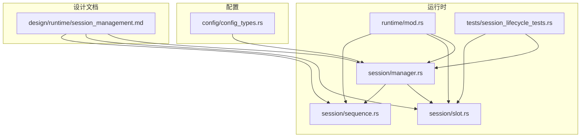
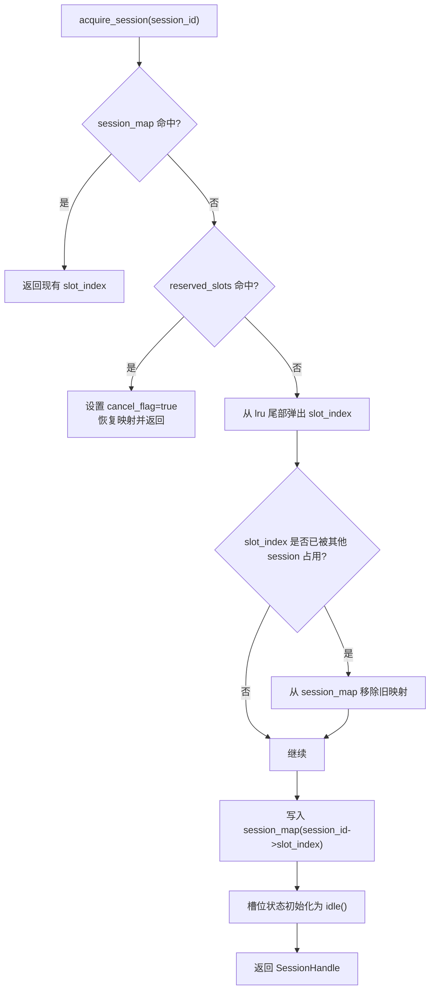
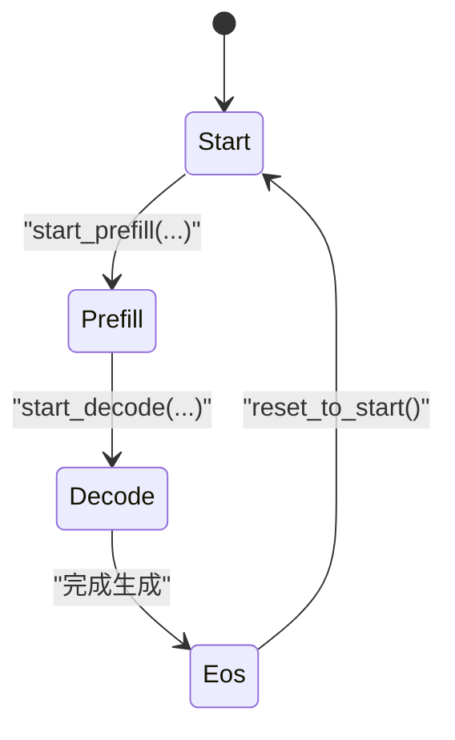
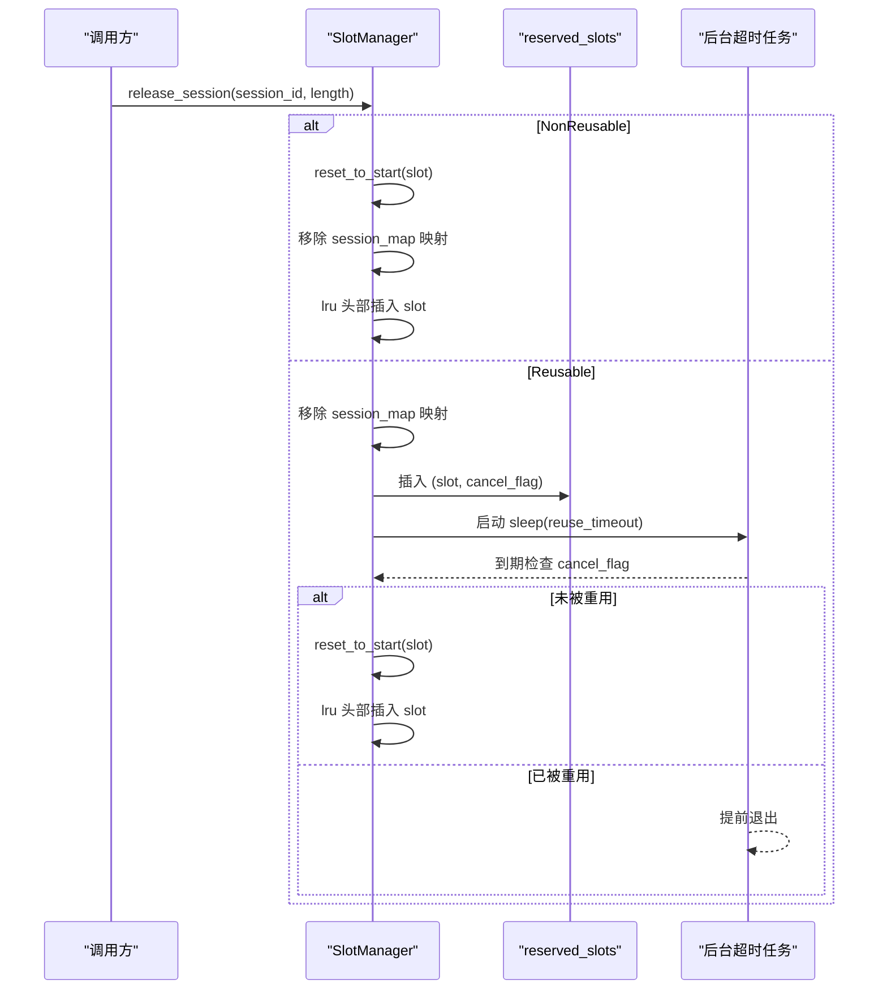
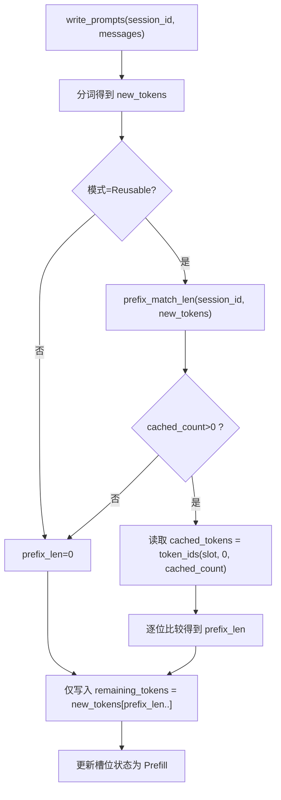
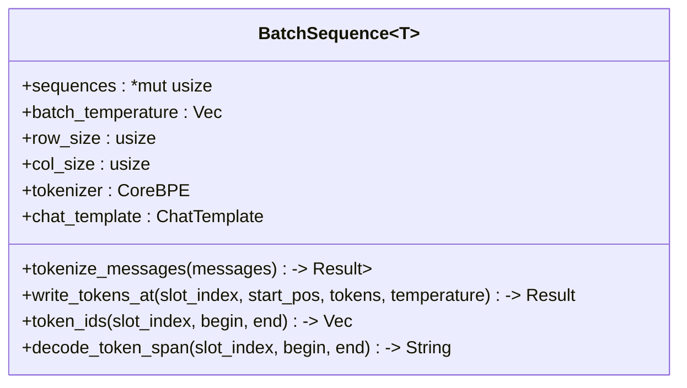
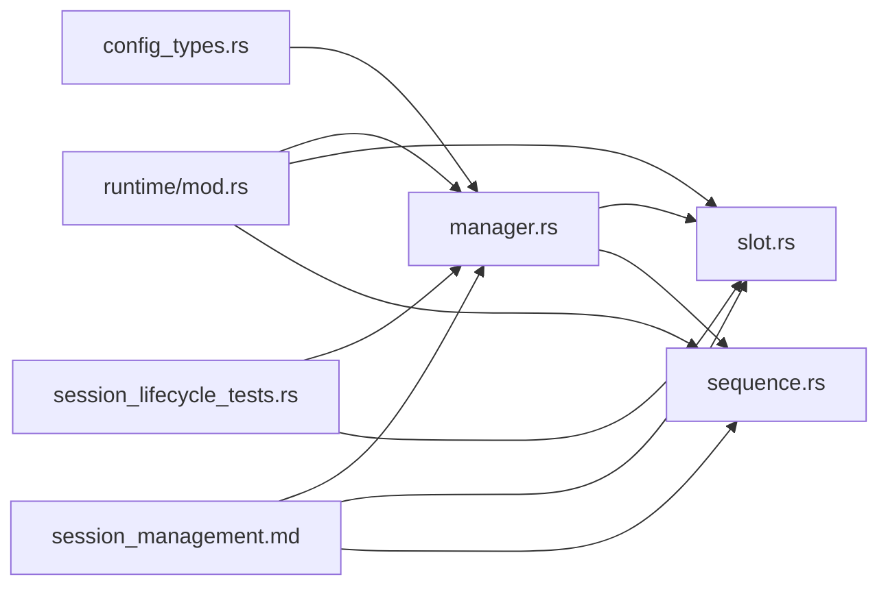

# 会话管理

<cite>
**本文引用的文件**   
- [manager.rs](file://src/runtime/session/manager.rs)
- [slot.rs](file://src/runtime/session/slot.rs)
- [sequence.rs](file://src/runtime/session/sequence.rs)
- [session_management.md](file://docs/design/runtime/session_management.md)
- [session_lifecycle_tests.rs](file://src/runtime/tests/session_lifecycle_tests.rs)
- [mod.rs](file://src/runtime/mod.rs)
- [config_types.rs](file://src/config/config_types.rs)
</cite>

## 目录
1. [简介](#简介)
2. [项目结构](#项目结构)
3. [核心组件](#核心组件)
4. [架构总览](#架构总览)
5. [详细组件分析](#详细组件分析)
6. [依赖关系分析](#依赖关系分析)
7. [性能考量](#性能考量)
8. [故障排查指南](#故障排查指南)
9. [结论](#结论)
10. [附录](#附录)

## 简介
本技术文档聚焦 eLLM 的会话管理系统，围绕 SlotManager 的设计与实现展开，涵盖：
- 会话生命周期管理与槽位分配策略
- LRU 淘汰算法与延迟回收机制
- 会话模式（Reusable vs NonReusable）的差异与资源回收
- 前缀匹配优化以减少重复计算
- BatchSequence 的 token 管理与 KV 缓存存储机制
- 槽位状态机（SlotState）的状态转换与并发安全保证
- 会话超时处理、内存泄漏防护与性能监控指标
- 扩展自定义会话策略的指导

## 项目结构
会话管理相关代码位于 runtime/session 模块，包含管理器、槽位状态、批序列等关键类型；设计文档位于 docs/design/runtime。测试覆盖主要生命周期场景。



图表来源
- [mod.rs:1-23](file://src/runtime/mod.rs#L1-L23)
- [manager.rs:1-284](file://src/runtime/session/manager.rs#L1-L284)
- [slot.rs:1-90](file://src/runtime/session/slot.rs#L1-L90)
- [sequence.rs:1-182](file://src/runtime/session/sequence.rs#L1-L182)
- [session_lifecycle_tests.rs:1-244](file://src/runtime/tests/session_lifecycle_tests.rs#L1-L244)
- [config_types.rs:1-490](file://src/config/config_types.rs#L1-490)
- [session_management.md:1-614](file://docs/design/runtime/session_management.md#L1-L614)

章节来源
- [mod.rs:1-23](file://src/runtime/mod.rs#L1-L23)
- [session_management.md:1-614](file://docs/design/runtime/session_management.md#L1-L614)

## 核心组件
- SlotManager<T>：统一负责会话获取/释放、槽位分配与回收、LRU 管理、前缀匹配优化、写入提示词与解码辅助方法。
- SlotState：描述单个槽位的运行阶段与进度信息，提供可用性与重置能力。
- SessionMode：控制会话复用策略（Reusable / NonReusable）。
- BatchSequence<T>：集中管理批内 token 序列、温度参数、分词器与聊天模板，提供写入与解码接口。
- SessionHandle：返回给调用方的会话句柄，携带 session_id 与 slot_index。

章节来源
- [manager.rs:17-44](file://src/runtime/session/manager.rs#L17-L44)
- [slot.rs:16-72](file://src/runtime/session/slot.rs#L16-L72)
- [sequence.rs:10-51](file://src/runtime/session/sequence.rs#L10-L51)

## 架构总览
SlotManager 通过共享可变指针访问 BatchSequence 和 SlotState 数组，使用 Tokio 异步锁保护 session_map 与 reserved_slots，使用标准库互斥锁保护 lru 列表。会话获取时优先复用活跃映射或保留槽位，否则从 LRU 尾部淘汰并重新初始化槽位。会话释放时根据模式决定立即重置还是进入保留期，并在保留期内支持同一会话快速重用且取消后台超时任务。

```mermaid
classDiagram
class SlotManager~T~ {
+batch_states : SharedMut<Vec<SlotState>>
+batch_sequences : SharedMut<BatchSequence<T>>
-lru : Mutex<Vec<usize>>
-session_map : TokioMutex<HashMap<String, usize>>
-reserved_slots : TokioMutex<HashMap<String,(usize,Arc<AtomicBool>)>>
-mode : SessionMode
-reuse_timeout : Duration
+new(...)
+acquire_session(session_id) -> SessionHandle
+release_session(Arc<Self>, session_id, sequence_length)
+write_prompts(slot_index, session_id, messages, temperature) -> ApiResult<(usize, Notify)>
+decode_single_token(...)
+decode_token_span(...)
+decode_generated_text(...)
+is_eos(...)
+get_next_sequence_index(...)
+get_prompt_length(...)
-ensure_slot_available(...)
-lru_remove(idx)
-lru_remove_and_push_front(idx)
#prefix_match_len(session_id, new_tokens) -> Option<usize>
}
class SlotState {
+next_sequence_index : usize
+prompt_length : usize
+phase : Phase
+sequence_length : usize
+notify : Arc<Notify>
+idle() -> Self
+start_prefill(start_index, filling_length)
+start_decode(next_sequence_index, prompt_length)
+is_available() bool
+filling_length() usize
+reset_to_start()
}
class BatchSequence~T~ {
+sequences : *mut usize
+batch_temperature : Vec<T>
+row_size : usize
+col_size : usize
+tokenizer : CoreBPE
+chat_template : ChatTemplate
+new(...)
+write_prompts(slot_index, messages, temperature) -> Result<usize>
+token_ids(slot_index, begin, end) -> Vec<u32>
+tokenize_messages(messages) -> Result<Vec<u32>>
+write_tokens_at(slot_index, start_pos, tokens, temperature) -> Result<usize>
+decode_single_token(slot_index, token_index) -> Option<String>
+decode_token_span(slot_index, begin, end) -> String
}
class SessionMode {
<<enum>>
Reusable
NonReusable
}
class SessionHandle {
+session_id : String
+slot_index : usize
+new(session_id, slot_index)
}
SlotManager --> SlotState : "读写状态"
SlotManager --> BatchSequence : "写入/读取tokens"
SlotManager --> SessionMode : "策略选择"
SlotManager --> SessionHandle : "返回句柄"
```

图表来源
- [manager.rs:17-284](file://src/runtime/session/manager.rs#L17-L284)
- [slot.rs:16-90](file://src/runtime/session/slot.rs#L16-L90)
- [sequence.rs:10-182](file://src/runtime/session/sequence.rs#L10-L182)

## 详细组件分析

### SlotManager 设计与实现
- 数据结构
  - batch_states：共享可变槽位状态数组，用于记录每个槽位的阶段、长度、通知器等。
  - batch_sequences：共享可变批序列对象，持有底层 token 缓冲区与分词器。
  - lru：标准互斥锁保护的槽位索引列表，用于 LRU 淘汰。
  - session_map：Tokio 互斥锁保护的 session_id -> slot_index 映射。
  - reserved_slots：Tokio 互斥锁保护的保留槽位映射，附带原子取消标志。
  - mode：会话模式（Reusable / NonReusable）。
  - reuse_timeout：保留超时时长。

- 会话生命周期
  - acquire_session：优先查找活跃映射；若未命中则尝试从 reserved_slots 恢复；最后从 lru 尾部弹出槽位，清理旧映射并初始化槽位为空闲。
  - release_session：更新槽位长度；NonReusable 模式立即重置到 Start 并从 session_map 移除，将槽位插入 lru 头部；Reusable 模式将映射移除并放入 reserved_slots，启动后台超时任务，若期间被重用则通过原子标志取消任务。

- 提示词写入与前缀匹配
  - write_prompts：对消息进行分词；在 Reusable 模式下执行 prefix_match_len 计算可复用前缀长度；确保槽位可用后，从 prefix_len 开始写入新 token，并更新槽位状态为 Prefill。
  - prefix_match_len：基于当前 session 绑定的槽位中已缓存的 token 数量，与新的 token 序列逐位比较，得到可复用的前缀长度。

- 解码辅助
  - decode_single_token / decode_token_span / decode_generated_text：基于 BatchSequence 提供的 token 片段解码为字符串。
  - is_eos / get_next_sequence_index / get_prompt_length：读取槽位状态以判断结束与进度。

- 并发与锁粒度
  - session_map 与 reserved_slots 使用 Tokio 互斥锁，避免阻塞线程。
  - lru 使用标准互斥锁，操作范围小且频繁。
  - batch_states 与 batch_sequences 通过 SharedMut 包装，with_mut/with 提供细粒度访问。



图表来源
- [manager.rs:48-82](file://src/runtime/session/manager.rs#L48-L82)

章节来源
- [manager.rs:17-284](file://src/runtime/session/manager.rs#L17-L284)

### 槽位状态机（SlotState）与并发安全
- 阶段枚举 Phase：Start、Prefill、Decode、Eos。
- SlotState 字段：
  - next_sequence_index：下一个待处理的 token 位置。
  - prompt_length：提示词总长度。
  - phase：当前阶段。
  - sequence_length：已缓存的 token 数量。
  - notify：用于通知等待者。
- 关键方法：
  - idle()：构造空闲状态。
  - start_prefill/start_decode：推进阶段与长度。
  - is_available：仅 Start/Eos 可接受新写入。
  - reset_to_start：恢复到初始状态。



图表来源
- [slot.rs:7-64](file://src/runtime/session/slot.rs#L7-L64)

并发安全说明
- SlotState 由 SharedMut<Vec<SlotState>> 保护，外部通过 with_mut 访问，避免数据竞争。
- 阶段转换仅在写路径上发生，读路径只读取必要字段。

章节来源
- [slot.rs:16-64](file://src/runtime/session/slot.rs#L16-L64)

### 会话模式差异与资源回收
- Reusable 模式
  - 释放后不立即重置，而是进入 reserved_slots，保留映射一段时间。
  - 同一 session_id 再次获取时可直接复用该槽位，并取消后台超时任务。
  - 超时后自动重置槽位并加入 lru 头部，供后续分配。
- NonReusable 模式
  - 释放后立即 reset_to_start，移除映射，并将槽位插入 lru 头部。
  - 每次请求可能分配到不同槽位，无保留期。



图表来源
- [manager.rs:84-133](file://src/runtime/session/manager.rs#L84-L133)

章节来源
- [manager.rs:84-133](file://src/runtime/session/manager.rs#L84-L133)

### 前缀匹配优化
- 目的：减少重复预填充开销，仅写入新增 token。
- 流程：
  - 在 Reusable 模式下，write_prompts 调用 prefix_match_len。
  - 通过 session_map 找到绑定槽位，读取其 sequence_length。
  - 从 BatchSequence 读取已缓存的 token 片段，与新 token 序列逐位比较，得到前缀长度。
  - 仅写入 prefix_len 之后的新 token，并更新槽位状态。



图表来源
- [manager.rs:137-182](file://src/runtime/session/manager.rs#L137-L182)
- [manager.rs:256-282](file://src/runtime/session/manager.rs#L256-L282)

章节来源
- [manager.rs:137-182](file://src/runtime/session/manager.rs#L137-L182)
- [manager.rs:256-282](file://src/runtime/session/manager.rs#L256-L282)

### BatchSequence 的 token 管理与 KV 缓存存储
- 数据结构
  - sequences：指向连续分配的 usize 缓冲区，按 row_size × col_size 布局存放 token id。
  - batch_temperature：每行（槽位）的温度参数。
  - tokenizer/chat_template：分词器与聊天模板，用于渲染与编码。
- 关键方法
  - tokenize_messages：渲染聊天模板并编码为 token 序列。
  - write_tokens_at：在指定起始位置写入 token，并更新温度。
  - token_ids：按区间读取 token id 切片。
  - decode_*：将 token id 片段解码为字符串。
- KV 缓存存储机制
  - 当前 BatchSequence 仅管理 token 序列与温度，KV 缓存不在该结构中维护。
  - KV 缓存由算子层（如注意力算子）在推理过程中读写，具体布局与访问模式参考算子实现与设计文档中的 KV 组织说明。



图表来源
- [sequence.rs:10-152](file://src/runtime/session/sequence.rs#L10-L152)

章节来源
- [sequence.rs:10-182](file://src/runtime/session/sequence.rs#L10-L182)

### 会话超时处理与内存泄漏防护
- 超时处理
  - Reusable 模式下，release_session 启动后台任务，sleep(reuse_timeout) 后检查 cancel_flag。
  - 若未被重用，则移除 reserved_slots 条目，重置槽位并加入 lru 头部。
- 取消机制
  - 当同一 session_id 在保留期内再次获取时，设置 cancel_flag=true，后台任务检测到后提前退出，避免重复清理。
- 内存泄漏防护
  - 所有后台任务均会在超时或被取消时清理自身状态，不会残留引用。
  - reserved_slots 与 session_map 的键值对严格成对增删，避免悬挂映射。

章节来源
- [manager.rs:84-133](file://src/runtime/session/manager.rs#L84-L133)

### 并发安全保证
- 锁策略
  - session_map 与 reserved_slots：Tokio 互斥锁，跨异步任务安全访问。
  - lru：标准互斥锁，短临界区。
  - batch_states 与 batch_sequences：SharedMut 封装，with_mut/with 提供受控访问。
- 原子信号
  - cancel_flag：Arc<AtomicBool>，无锁地传递取消信号。
- 不变式
  - 槽位处于唯一状态：活跃、保留或可用。
  - 保留槽位仅对原始 session_id 可见。
  - 后台任务具备幂等性，避免重复清理。

章节来源
- [manager.rs:17-44](file://src/runtime/session/manager.rs#L17-L44)
- [manager.rs:84-133](file://src/runtime/session/manager.rs#L84-L133)

### 性能监控指标建议
- 命中率
  - 会话复用率：acquire_session 命中 session_map 或 reserved_slots 的比例。
  - 前缀匹配命中率：prefix_match_len 返回非零的比例。
- 吞吐与延迟
  - 平均/分位数 TTFT（首 token 时间），区分 Prefill 与 Decode。
  - 每秒会话数、每秒 token 生成数。
- 资源利用
  - 槽位利用率：活跃槽位占比。
  - 保留槽位平均保留时长与超时比例。
- 错误与异常
  - 槽位不可用错误次数。
  - 分词失败次数。

[本节为通用指导，无需源码引用]

## 依赖关系分析



图表来源
- [mod.rs:1-23](file://src/runtime/mod.rs#L1-L23)
- [manager.rs:1-284](file://src/runtime/session/manager.rs#L1-L284)
- [slot.rs:1-90](file://src/runtime/session/slot.rs#L1-L90)
- [sequence.rs:1-182](file://src/runtime/session/sequence.rs#L1-L182)
- [config_types.rs:1-490](file://src/config/config_types.rs#L1-490)
- [session_lifecycle_tests.rs:1-244](file://src/runtime/tests/session_lifecycle_tests.rs#L1-L244)
- [session_management.md:1-614](file://docs/design/runtime/session_management.md#L1-L614)

章节来源
- [mod.rs:1-23](file://src/runtime/mod.rs#L1-L23)
- [config_types.rs:1-490](file://src/config/config_types.rs#L1-490)

## 性能考量
- 前缀匹配显著降低重复预填充成本，尤其在长上下文与多轮对话中收益明显。
- LRU 淘汰保证在高并发下稳定分配槽位，避免热点冲突。
- 保留期策略平衡了复用收益与资源占用，需结合业务负载调整超时。
- BatchSequence 的连续内存布局有利于分词与解码的局部性。
- KV 缓存的组织与访问模式影响整体吞吐，应关注 head-by-head 顺序计算的 CPU 缓存友好特性。

[本节为通用指导，无需源码引用]

## 故障排查指南
- 常见问题
  - 槽位不可用：检查 ensure_slot_available 的错误分支，确认槽位是否处于 Start/Eos。
  - 会话无法复用：确认 Reusable 模式与保留期设置，查看 reserved_slots 与 cancel_flag 行为。
  - 分词失败：检查 tokenize_messages 与 chat_template 加载是否正确。
- 定位手段
  - 打印会话复用率与前缀匹配命中率。
  - 观察槽位状态分布与保留槽位数量。
  - 验证后台任务是否因 cancel_flag 提前退出。

章节来源
- [manager.rs:229-239](file://src/runtime/session/manager.rs#L229-L239)
- [sequence.rs:121-128](file://src/runtime/session/sequence.rs#L121-L128)

## 结论
eLLM 的会话管理系统通过 SlotManager 实现了统一的槽位与会话管理，结合 LRU 淘汰、延迟回收与前缀匹配优化，有效提升了复用效率与系统吞吐。SessionMode 提供了灵活的资源回收策略，配合严格的并发安全与超时取消机制，保障了系统的稳定性与可扩展性。

[本节为总结，无需源码引用]

## 附录

### 配置项与默认值
- SchedulerConfig.dialogue_cache_enabled：控制会话缓存开关，影响 SessionMode 的选择。
- ServeConfig.slot_reuse_timeout_ms：保留槽位的超时时长（毫秒）。

章节来源
- [config_types.rs:140-164](file://src/config/config_types.rs#L140-L164)
- [config_types.rs:284-287](file://src/config/config_types.rs#L284-L287)
- [config_types.rs:449-451](file://src/config/config_types.rs#L449-L451)
- [config_types.rs:477-479](file://src/config/config_types.rs#L477-L479)

### 测试用例概览
- 会话获取与释放的复用与非复用行为。
- 保留期内的重用与超时后的回收。
- 并发获取多个用户会话的正确性。
- 完整生命周期与调度器集成。

章节来源
- [session_lifecycle_tests.rs:1-244](file://src/runtime/tests/session_lifecycle_tests.rs#L1-L244)

### 扩展自定义会话策略
- 目标：在不破坏现有 API 的前提下，替换或增强会话分配与回收策略。
- 步骤建议
  - 定义新的策略接口（例如 Strategy::allocate / Strategy::release），保持与 SlotManager 的交互契约一致。
  - 在 SlotManager 中注入策略实例，替换默认的 LRU 与保留期逻辑。
  - 针对新策略补充单元测试，覆盖边界条件与并发场景。
  - 通过配置项暴露策略选择与参数调优。
- 注意事项
  - 保持并发安全：所有共享状态必须受锁或原子变量保护。
  - 避免内存泄漏：确保后台任务与映射的成对增删。
  - 性能回归测试：对比复用率、TTFT、槽位利用率等指标。

[本节为通用指导，无需源码引用]