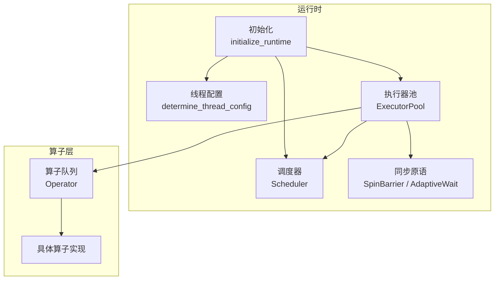
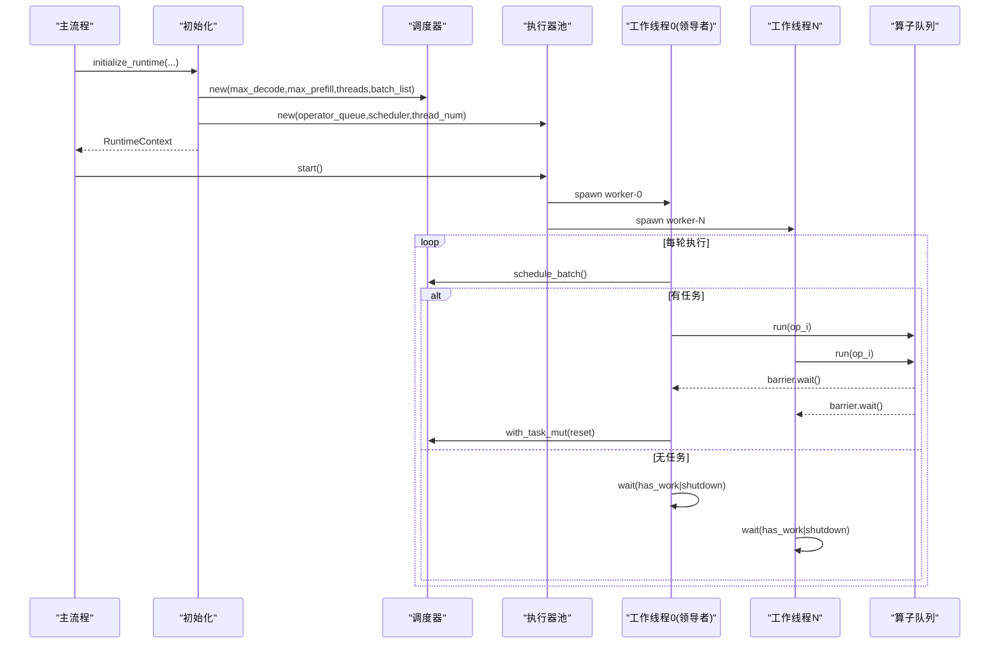
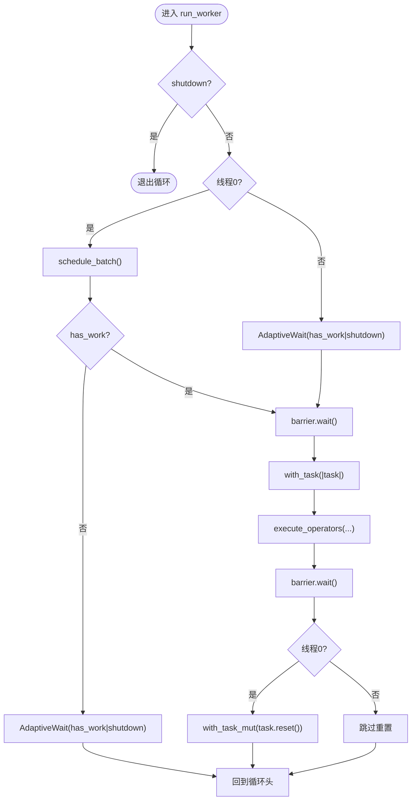
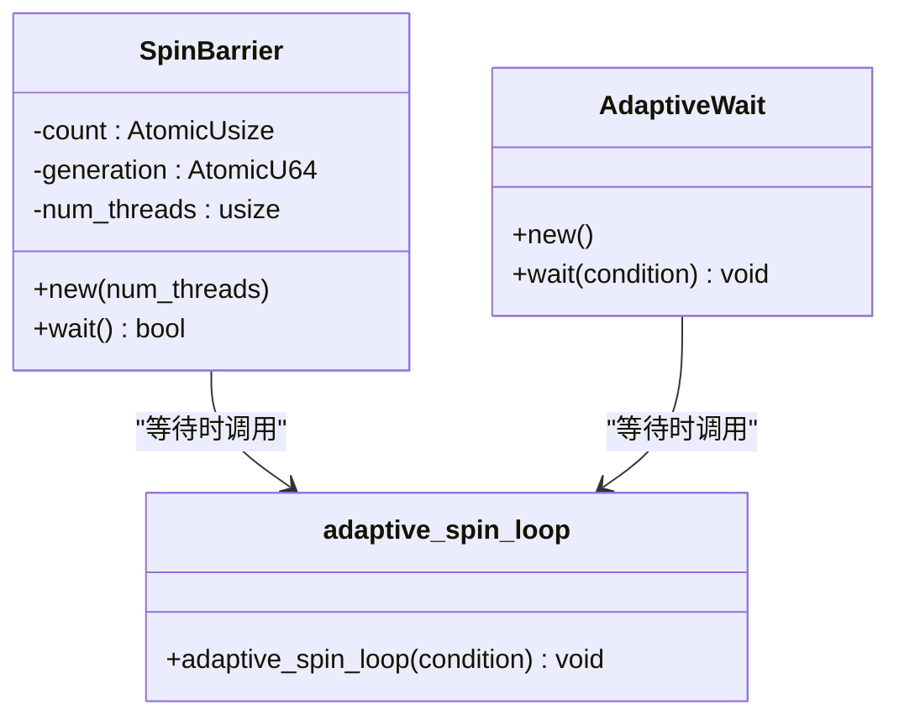
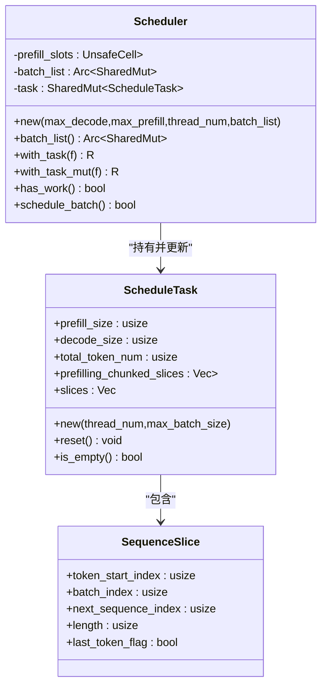
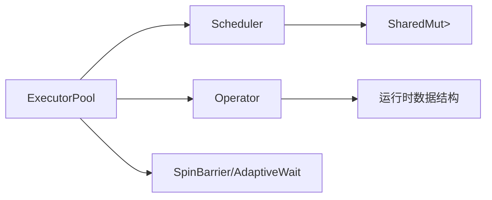

# 执行器池

<cite>
**本文引用的文件列表**
- [executor_pool.rs](file://src/runtime/executor/executor_pool.rs)
- [sync.rs](file://src/runtime/executor/sync.rs)
- [mod.rs（executor）](file://src/runtime/executor/mod.rs)
- [scheduler.rs](file://src/runtime/scheduler/scheduler.rs)
- [task.rs](file://src/runtime/scheduler/task.rs)
- [operator.rs](file://src/operators/operator.rs)
- [init.rs](file://src/runtime/init.rs)
- [config.rs](file://src/runtime/config.rs)
- [send_sync_ptr.rs](file://src/operators/send_sync_ptr.rs)
- [optimization.md](file://docs/configuration/optimization.md)
</cite>

## 目录
1. [简介](#简介)
2. [项目结构](#项目结构)
3. [核心组件](#核心组件)
4. [架构总览](#架构总览)
5. [详细组件分析](#详细组件分析)
6. [依赖关系分析](#依赖关系分析)
7. [性能与调优](#性能与调优)
8. [故障排查指南](#故障排查指南)
9. [结论](#结论)
10. [附录：扩展接口与自定义策略](#附录：扩展接口与自定义策略)

## 简介
本文件聚焦 eLLM 运行时中的“执行器池”子系统，系统性阐述其线程池设计、工作线程管理、任务队列与负载均衡策略；详细说明执行器的生命周期管理（初始化、启动、停止与清理）；解释同步机制（自旋屏障、自适应等待、原子操作与锁的使用）；说明执行器如何与调度器协作处理并发任务；并提供配置参数与性能调优建议。同时涵盖线程安全保证、死锁预防与资源泄漏检测要点，以及扩展接口和自定义执行策略的实现方法。

## 项目结构
执行器池位于运行时层，负责驱动算子队列在多核 CPU 上并行执行。关键目录与文件如下：
- 执行器与同步原语：src/runtime/executor
- 调度器与任务模型：src/runtime/scheduler
- 算子抽象与分发：src/operators/operator.rs
- 运行时初始化与线程配置：src/runtime/init.rs, src/runtime/config.rs
- 共享可变内存包装：src/operators/send_sync_ptr.rs

图表来源
- [init.rs:118-124](file://src/runtime/init.rs#L118-L124)
- [config.rs:62-104](file://src/runtime/config.rs#L62-L104)
- [scheduler.rs:15-82](file://src/runtime/scheduler/scheduler.rs#L15-L82)
- [executor_pool.rs:10-70](file://src/runtime/executor/executor_pool.rs#L10-L70)
- [sync.rs:33-83](file://src/runtime/executor/sync.rs#L33-L83)
- [operator.rs:31-60](file://src/operators/operator.rs#L31-L60)

章节来源
- [init.rs:34-135](file://src/runtime/init.rs#L34-L135)
- [config.rs:62-104](file://src/runtime/config.rs#L62-L104)
- [executor_pool.rs:10-70](file://src/runtime/executor/executor_pool.rs#L10-L70)
- [scheduler.rs:15-82](file://src/runtime/scheduler/scheduler.rs#L15-L82)
- [operator.rs:31-60](file://src/operators/operator.rs#L31-L60)

## 核心组件
- ExecutorPool<T>：执行器池，持有调度器、算子队列、线程数与关闭标志，负责启动工作线程并协调执行。
- Scheduler：批调度器，从批次槽位状态构建当前轮次的 ScheduleTask，提供 has_work/schedule_batch/with_task 等接口。
- ScheduleTask：每轮任务描述，包含预填充与解码的切片信息，以及按线程分片的预填充块列表。
- Operator<T>：统一算子枚举，封装各类算子运行入口，供执行器池顺序调用。
- SpinBarrier / AdaptiveWait：轻量同步原语，用于多工作线程在算子边界对齐与忙等优化。
- SharedMut：基于 SyncUnsafeCell 的无锁共享可变包装，配合 with/with_mut 提供受控访问。

章节来源
- [executor_pool.rs:10-44](file://src/runtime/executor/executor_pool.rs#L10-L44)
- [scheduler.rs:15-82](file://src/runtime/scheduler/scheduler.rs#L15-L82)
- [task.rs:1-49](file://src/runtime/scheduler/task.rs#L1-L49)
- [operator.rs:31-60](file://src/operators/operator.rs#L31-L60)
- [sync.rs:33-83](file://src/runtime/executor/sync.rs#L33-L83)
- [send_sync_ptr.rs:30-59](file://src/operators/send_sync_ptr.rs#L30-L59)

## 架构总览
执行器池采用“领导者-跟随者”模式：
- 单条“领导者”线程负责调度决策（schedule_batch），其余工作线程专注于执行算子。
- 所有工作线程通过自旋屏障在每个算子前后对齐，确保数据一致性。
- 调度器维护全局任务与批次槽位状态，执行器通过共享指针访问批次数据。

图表来源
- [init.rs:118-124](file://src/runtime/init.rs#L118-L124)
- [executor_pool.rs:46-115](file://src/runtime/executor/executor_pool.rs#L46-L115)
- [scheduler.rs:66-82](file://src/runtime/scheduler/scheduler.rs#L66-L82)
- [operator.rs:79-198](file://src/operators/operator.rs#L79-L198)

## 详细组件分析

### 执行器池（ExecutorPool）
- 职责
  - 创建工作线程，分配唯一名称便于调试。
  - 使用 SpinBarrier 在所有工作线程间进行算子级同步。
  - 由线程0承担领导者角色，负责调度与任务重置。
  - 遍历算子队列，依次调用每个算子的 run 接口，传入预填充/解码尺寸、线程号、线程ID、切片列表与批次列表。
- 关键流程
  - start：创建屏障，循环 spawn 工作线程。
  - run_worker：主循环检查 shutdown 与 has_work；若无任务则自适应等待；若有任务则 barrier.wait -> with_task -> execute_operators -> barrier.wait -> 线程0 reset。
  - execute_operators：对每个 operator.run 后 barrier.wait，保证所有线程在同一算子阶段完成后再进入下一个算子。
- 线程安全
  - 通过 SpinBarrier 保证跨线程的严格顺序。
  - 通过 AtomicBool 控制 shutdown，Acquire/Release 语义保障可见性。
  - 通过 SharedMut 提供的 with/with_mut 访问批次数据，避免外部竞争。

图表来源
- [executor_pool.rs:72-148](file://src/runtime/executor/executor_pool.rs#L72-L148)

章节来源
- [executor_pool.rs:10-148](file://src/runtime/executor/executor_pool.rs#L10-L148)

### 同步原语（SpinBarrier / AdaptiveWait）
- SpinBarrier
  - 基于 AtomicUsize 计数与 AtomicU64 代际号，实现固定线程数的自旋屏障。
  - 最后一个到达的线程复位计数并递增代际号，其他线程自旋等待代际变化。
- AdaptiveWait
  - 内部使用自适应忙等策略：先 spin_loop，再 yield_now，最后指数退避 sleep，减少空转与上下文切换开销。
- 适用场景
  - 短临界区、高频同步点（如算子边界）。
  - 低延迟优先的工作负载。

图表来源
- [sync.rs:33-83](file://src/runtime/executor/sync.rs#L33-L83)
- [sync.rs:7-31](file://src/runtime/executor/sync.rs#L7-L31)

章节来源
- [sync.rs:1-83](file://src/runtime/executor/sync.rs#L1-L83)

### 调度器（Scheduler）与任务（ScheduleTask）
- 调度目标
  - 扫描批次槽位，统计可执行的 Decode 数量与待预填充 Token 总量。
  - 将预填充 Token 切分为多个 SequenceSlice，并按线程平均分配至 prefilling_chunked_slices。
  - 生成统一的 slices 序列，预填充在前，解码在后，token_start_index 严格递增。
- 关键接口
  - schedule_batch：返回是否有任务。
  - with_task / with_task_mut：读写当前任务。
  - has_work：判断任务是否为空。
- 任务结构
  - prefill_size / decode_size / total_token_num：规模统计。
  - prefilling_chunked_slices：按线程分片，便于多线程并行预填充。
  - slices：线性化的切片列表，供算子统一索引访问。

图表来源
- [scheduler.rs:15-82](file://src/runtime/scheduler/scheduler.rs#L15-L82)
- [task.rs:1-49](file://src/runtime/scheduler/task.rs#L1-L49)

章节来源
- [scheduler.rs:15-223](file://src/runtime/scheduler/scheduler.rs#L15-L223)
- [task.rs:1-49](file://src/runtime/scheduler/task.rs#L1-L49)

### 算子队列与执行（Operator）
- Operator<T> 作为统一枚举，封装多种算子类型，对外暴露 run 接口。
- 执行器池按序遍历算子队列，为每个算子传入预填充/解码尺寸、线程号、线程ID、预填充切片、解码切片与批次列表。
- 部分算子需要读取/写入批次状态（例如采样后推进 next_sequence_index 或改变 phase）。

章节来源
- [operator.rs:31-60](file://src/operators/operator.rs#L31-L60)
- [operator.rs:79-198](file://src/operators/operator.rs#L79-L198)

### 生命周期管理（初始化、启动、停止、清理）
- 初始化
  - initialize_runtime 加载模型权重、构建 BatchSequence、创建 SlotManager、Scheduler，并取走全局算子队列。
  - determine_thread_config 计算物理核心数与线程分配，设置 api_threads 作为执行器池大小。
- 启动
  - ExecutorPool::start 创建 SpinBarrier 并 spawn 工作线程。
- 停止与清理
  - 当前实现通过 AtomicBool shutdown 标志控制工作线程退出。
  - 注意：当前代码未显式保存 JoinHandle 或在析构中 join 线程，存在潜在资源泄漏风险（见“故障排查指南”）。

章节来源
- [init.rs:34-135](file://src/runtime/init.rs#L34-L135)
- [config.rs:62-104](file://src/runtime/config.rs#L62-L104)
- [executor_pool.rs:46-70](file://src/runtime/executor/executor_pool.rs#L46-L70)

## 依赖关系分析
- ExecutorPool 依赖 Scheduler 获取任务，依赖 Operator 队列执行具体计算。
- Scheduler 依赖 SharedMut<Vec<SlotState>> 访问批次槽位状态。
- Operator 依赖运行时数据结构（SequenceSlice、SlotState）与数值类型约束。
- 同步原语被 ExecutorPool 与 Scheduler 间接使用（通过 barrier 与 wait）。

图表来源
- [executor_pool.rs:10-44](file://src/runtime/executor/executor_pool.rs#L10-L44)
- [scheduler.rs:15-48](file://src/runtime/scheduler/scheduler.rs#L15-L48)
- [operator.rs:31-60](file://src/operators/operator.rs#L31-L60)
- [send_sync_ptr.rs:30-59](file://src/operators/send_sync_ptr.rs#L30-L59)

章节来源
- [executor_pool.rs:10-44](file://src/runtime/executor/executor_pool.rs#L10-L44)
- [scheduler.rs:15-48](file://src/runtime/scheduler/scheduler.rs#L15-L48)
- [operator.rs:31-60](file://src/operators/operator.rs#L31-L60)
- [send_sync_ptr.rs:30-59](file://src/operators/send_sync_ptr.rs#L30-L59)

## 性能与调优
- 线程数与亲和性
  - determine_thread_config 根据可用并行度与物理核心数估算线程数，并将 api_threads 用作执行器池大小。
  - 建议：在高吞吐场景下，适当增大 batch_size 与 chunk_size；在低延迟场景下，减小 chunk_size 以提升响应速度。
- 调度阈值与时延
  - 文档建议通过环境变量调整 ELLM_CHUNK_SIZE、ELLM_BATCH_SIZE、ELLM_SCHEDULE_TIMEOUT_MS 以平衡吞吐与时延。
- 算子并行与缓存局部性
  - 预填充按线程分片，尽量保持连续范围与顺序遍历，提升 L1/L2 命中率。
- 自旋与等待
  - SpinBarrier 与 AdaptiveWait 在短临界区表现良好；若算子执行时间较长，应评估是否引入条件变量以降低忙等成本。

章节来源
- [config.rs:62-104](file://src/runtime/config.rs#L62-L104)
- [optimization.md:1-61](file://docs/configuration/optimization.md#L1-L61)

## 故障排查指南
- 线程未正确回收
  - 现象：进程退出后仍有工作线程残留。
  - 原因：ExecutorPool 未保存 JoinHandle 并在析构中 join。
  - 建议：在 ExecutorPool 中添加 handles 字段，drop 时 join 所有线程；或提供 stop/join API。
- 死锁风险
  - 现象：长时间阻塞在 barrier.wait 或 with_task_mut。
  - 原因：某线程未能及时到达 barrier；或任务未正确 reset。
  - 建议：确保每个算子后都 barrier.wait；线程0在完成后 reset task；避免在 barrier 内做长耗时操作。
- 数据竞争
  - 现象：批次状态不一致或输出异常。
  - 原因：绕过 with/with_mut 直接访问 SharedMut 内部指针。
  - 建议：仅通过 with/with_mut 访问；必要时增加断言与日志。
- 资源泄漏检测
  - 建议：使用工具（如 Valgrind、AddressSanitizer）检测未释放句柄与内存；在测试中验证 start 后 stop/join 的完整生命周期。

章节来源
- [executor_pool.rs:46-70](file://src/runtime/executor/executor_pool.rs#L46-L70)
- [executor_pool.rs:72-115](file://src/runtime/executor/executor_pool.rs#L72-L115)
- [send_sync_ptr.rs:30-59](file://src/operators/send_sync_ptr.rs#L30-L59)

## 结论
eLLM 的执行器池以“领导者-跟随者”模式组织，结合自旋屏障与自适应等待，实现了高效的算子流水线并行。调度器负责将批次槽位转化为可并行的任务切片，并通过线程分片提升预填充吞吐。整体设计简洁且高性能，但在生命周期管理与资源回收方面仍需完善，以确保在生产环境下的健壮性与可观测性。

## 附录：扩展接口与自定义策略
- 扩展点
  - 自定义算子：实现 Operator<T> 的新变体，并在 run 中遵循线程划分与数据布局约定。
  - 自定义调度策略：可在 Scheduler 中扩展 build_task 逻辑，支持更复杂的优先级或抢占策略。
  - 自定义同步原语：替换 SpinBarrier/AdaptiveWait 为条件变量或通道，以适应不同负载特征。
- 注意事项
  - 保持线程安全：任何共享状态必须通过 SharedMut.with/with_mut 访问。
  - 维持算子边界同步：每个算子后需 barrier.wait，确保所有线程一致。
  - 合理设置线程数与分片大小：依据硬件特性与任务特征调优。

章节来源
- [operator.rs:31-60](file://src/operators/operator.rs#L31-L60)
- [scheduler.rs:84-223](file://src/runtime/scheduler/scheduler.rs#L84-L223)
- [sync.rs:33-83](file://src/runtime/executor/sync.rs#L33-L83)