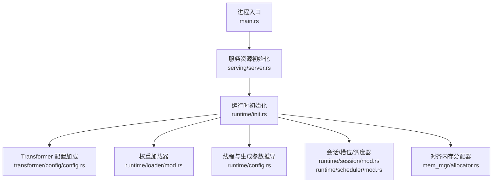
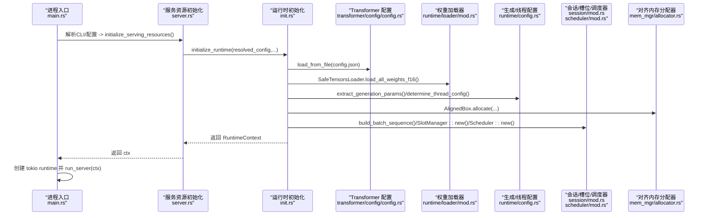
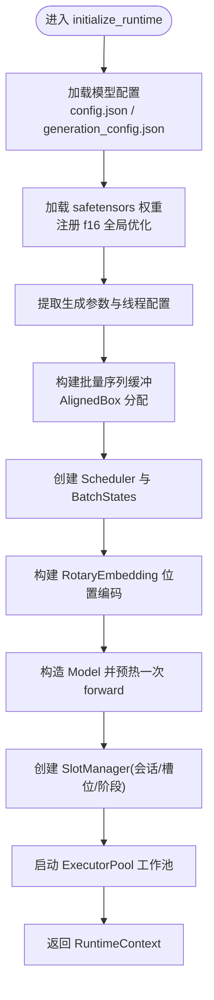
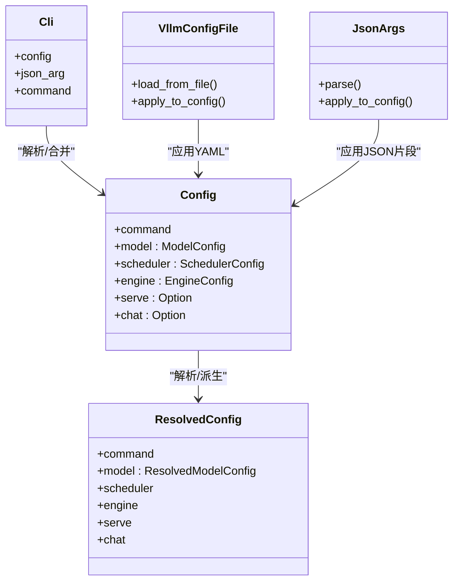
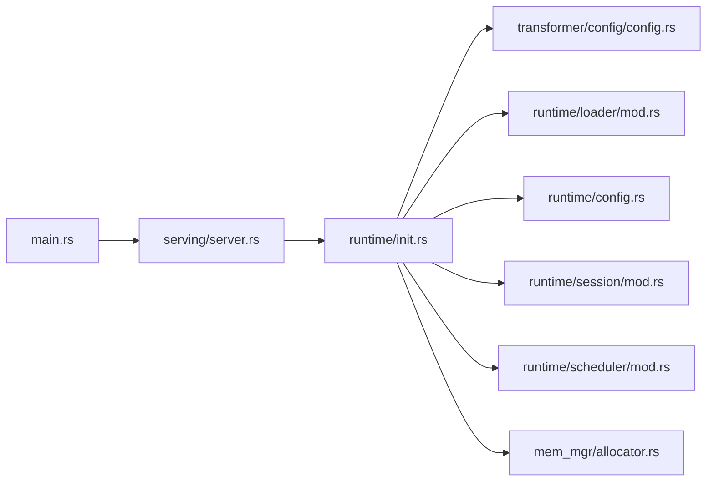

# 运行时初始化

<cite>
**本文引用的文件**   
- [src/bin/main.rs](file://src/bin/main.rs)
- [src/serving/server.rs](file://src/serving/server.rs)
- [src/runtime/init.rs](file://src/runtime/init.rs)
- [src/runtime/config.rs](file://src/runtime/config.rs)
- [src/config/mod.rs](file://src/config/mod.rs)
- [src/config/config_types.rs](file://src/config/config_types.rs)
- [src/config/command_line_interface.rs](file://src/config/command_line_interface.rs)
- [src/config/generation_config.rs](file://src/config/generation_config.rs)
- [src/transformer/config/config.rs](file://src/transformer/config/config.rs)
- [src/mem_mgr/allocator.rs](file://src/mem_mgr/allocator.rs)
- [src/runtime/session/mod.rs](file://src/runtime/session/mod.rs)
- [src/runtime/scheduler/mod.rs](file://src/runtime/scheduler/mod.rs)
- [src/runtime/loader/mod.rs](file://src/runtime/loader/mod.rs)
</cite>

## 目录
1. [简介](#简介)
2. [项目结构](#项目结构)
3. [核心组件](#核心组件)
4. [架构总览](#架构总览)
5. [详细组件分析](#详细组件分析)
6. [依赖关系分析](#依赖关系分析)
7. [性能考量](#性能考量)
8. [故障排查指南](#故障排查指南)
9. [结论](#结论)
10. [附录](#附录)

## 简介
本文件面向 eLLM 运行时的“启动与初始化”主题，系统性阐述从进程入口到服务就绪的完整流程，覆盖配置加载、参数解析与校验、模型权重载入、线程与调度器构建、会话与槽位管理、算子队列与工作池启动等关键环节。文档同时给出配置项说明、最佳实践、失败处理策略与健康检查接口，并提供扩展自定义初始化逻辑的建议。

## 项目结构
eLLM 的运行时初始化主要分布在以下模块：
- 进程入口与异步运行时创建：src/bin/main.rs
- 服务资源初始化与 HTTP 路由：src/serving/server.rs
- 运行时上下文与核心初始化流程：src/runtime/init.rs
- 生成参数与线程配置推导：src/runtime/config.rs
- 配置类型定义与默认值：src/config/config_types.rs
- CLI 解析与 JSON/YAML 配置合并：src/config/command_line_interface.rs
- 生成配置（采样、线程数等）：src/config/generation_config.rs
- Transformer 模型配置解析：src/transformer/config/config.rs
- 对齐内存分配器（SIMD友好）：src/mem_mgr/allocator.rs
- 会话与槽位管理、调度器、权重加载器等：src/runtime/session/mod.rs, src/runtime/scheduler/mod.rs, src/runtime/loader/mod.rs

图表来源
- [src/bin/main.rs:26-40](file://src/bin/main.rs#L26-L40)
- [src/serving/server.rs:45-82](file://src/serving/server.rs#L45-L82)
- [src/runtime/init.rs:34-135](file://src/runtime/init.rs#L34-L135)
- [src/transformer/config/config.rs:113-116](file://src/transformer/config/config.rs#L113-L116)
- [src/runtime/loader/mod.rs:1-8](file://src/runtime/loader/mod.rs#L1-L8)
- [src/runtime/config.rs:62-104](file://src/runtime/config.rs#L62-L104)
- [src/mem_mgr/allocator.rs:1-156](file://src/mem_mgr/allocator.rs#L1-L156)

章节来源
- [src/bin/main.rs:26-40](file://src/bin/main.rs#L26-L40)
- [src/serving/server.rs:45-82](file://src/serving/server.rs#L45-L82)
- [src/runtime/init.rs:34-135](file://src/runtime/init.rs#L34-L135)

## 核心组件
- 进程入口与异步运行时
  - 负责解析 CLI、加载并解析配置、调用服务资源初始化、创建 Tokio 多核运行时并阻塞等待服务结束。
- 服务资源初始化
  - 将高层配置转换为运行时所需的具体参数（批大小、序列长度、分块大小、会话模式、槽复用超时），并调用运行时初始化函数。
- 运行时初始化
  - 加载模型配置与可选生成配置；加载 safetensors 权重并注册全局 f16 优化；计算生成参数与线程配置；构建批量序列、调度器、位置编码、模型实例、槽管理器；启动算子工作池。
- 配置系统
  - 支持命令行、JSON 片段、YAML 配置文件三种输入源，提供默认值、别名映射与类型转换；最终产出 ResolvedConfig。
- 生成参数与线程配置
  - 根据生成配置与环境能力推导 top_k/top_p/min_p/do_sample/eos_token_id_list 等；基于物理核心数与 API 线程数划分 blocking/api 线程。
- 会话与调度
  - 维护会话生命周期、槽位状态与阶段推进；调度器协调任务执行与并发度。
- 内存与算子
  - 使用 64 字节对齐分配器以适配 SIMD；算子队列由工作池消费。

章节来源
- [src/bin/main.rs:26-40](file://src/bin/main.rs#L26-L40)
- [src/serving/server.rs:45-82](file://src/serving/server.rs#L45-L82)
- [src/runtime/init.rs:34-135](file://src/runtime/init.rs#L34-L135)
- [src/config/config_types.rs:188-222](file://src/config/config_types.rs#L188-L222)
- [src/config/command_line_interface.rs:14-53](file://src/config/command_line_interface.rs#L14-L53)
- [src/config/generation_config.rs:6-79](file://src/config/generation_config.rs#L6-L79)
- [src/runtime/config.rs:21-60](file://src/runtime/config.rs#L21-L60)
- [src/runtime/config.rs:62-104](file://src/runtime/config.rs#L62-L104)
- [src/mem_mgr/allocator.rs:1-156](file://src/mem_mgr/allocator.rs#L1-L156)

## 架构总览
下图展示了从进程启动到服务就绪的关键调用链与数据流向。

图表来源
- [src/bin/main.rs:26-40](file://src/bin/main.rs#L26-L40)
- [src/serving/server.rs:45-82](file://src/serving/server.rs#L45-L82)
- [src/runtime/init.rs:34-135](file://src/runtime/init.rs#L34-L135)
- [src/transformer/config/config.rs:113-116](file://src/transformer/config/config.rs#L113-L116)
- [src/runtime/loader/mod.rs:1-8](file://src/runtime/loader/mod.rs#L1-L8)
- [src/runtime/config.rs:21-60](file://src/runtime/config.rs#L21-L60)
- [src/runtime/config.rs:62-104](file://src/runtime/config.rs#L62-L104)
- [src/mem_mgr/allocator.rs:1-156](file://src/mem_mgr/allocator.rs#L1-L156)

## 详细组件分析

### 进程入口与异步运行时
- 职责
  - 解析 CLI 命令与参数；加载配置并解析为 ResolvedConfig；调用服务资源初始化；创建 Tokio 多核运行时；阻塞运行服务。
- 关键点
  - 线程池规模由 RuntimeContext.thread_config 决定（API 线程与阻塞线程）。
  - 服务启动后通过事件循环监听请求。

章节来源
- [src/bin/main.rs:26-40](file://src/bin/main.rs#L26-L40)

### 服务资源初始化
- 职责
  - 将 ResolvedConfig 转换为运行时参数：api_server_count、batch_size、sequence_length、chunk_size、session_mode、slot_reuse_timeout_ms。
  - 调用 initialize_runtime 完成底层资源准备，返回 RuntimeContext。
- 健康检查
  - 提供 /status 端点，返回运行状态与服务模式信息。

章节来源
- [src/serving/server.rs:45-82](file://src/serving/server.rs#L45-L82)
- [src/serving/server.rs:84-98](file://src/serving/server.rs#L84-L98)

### 运行时初始化（核心）
- 步骤概览
  1) 读取模型目录并加载 config.json；可选加载 generation_config.json。
  2) 使用 SafeTensorsLoader 加载全部权重（f16），注册全局 f16 优化。
  3) 提取生成参数（top_k/top_p/min_p/do_sample/eos_token_id_list）与线程配置（total/api/blocking）。
  4) 构建批量序列缓冲区（使用对齐分配器）、调度器、位置编码向量。
  5) 构造 Model 实例并进行一次前向预热，确保路径正确。
  6) 初始化 SlotManager（会话/槽位/阶段管理）。
  7) 获取全局算子队列，创建并启动 ExecutorPool 工作池。
  8) 组装并返回 RuntimeContext。
- 关键数据结构
  - RuntimeContext：持有 batch_sequences、scheduler、slot_manager、thread_config、session_mode、slot_reuse_timeout_ms 等。
- 错误处理
  - 配置加载失败、权重加载失败均会返回错误，上层可据此进行回滚或告警。

图表来源
- [src/runtime/init.rs:34-135](file://src/runtime/init.rs#L34-L135)
- [src/mem_mgr/allocator.rs:1-156](file://src/mem_mgr/allocator.rs#L1-L156)

章节来源
- [src/runtime/init.rs:34-135](file://src/runtime/init.rs#L34-L135)

### 配置管理系统
- 输入来源
  - CLI 参数（clap 解析）
  - JSON 片段（--json-arg）
  - YAML 配置文件（兼容 vLLM serve_args 风格）
- 合并与默认值
  - Config 结构体包含 model/scheduler/engine/chat/serve 等子配置，各子配置均有 Default 实现与字段别名。
  - VllmConfigFile 与 JsonArgs 分别负责 YAML 与 JSON 片段的解析与合并。
- 输出
  - ResolvedConfig：包含命令、模型（含原始配置与派生名）、调度器、引擎、服务与聊天配置。
- 验证与约束
  - 枚举类型通过 ValueEnum/from_str 进行校验；缺失字段采用默认值；部分字段存在语义约束（如端口范围、线程数下限等）。

图表来源
- [src/config/config_types.rs:188-222](file://src/config/config_types.rs#L188-L222)
- [src/config/command_line_interface.rs:14-53](file://src/config/command_line_interface.rs#L14-L53)
- [src/config/command_line_interface.rs:368-390](file://src/config/command_line_interface.rs#L368-L390)
- [src/config/command_line_interface.rs:571-723](file://src/config/command_line_interface.rs#L571-L723)

章节来源
- [src/config/mod.rs:1-15](file://src/config/mod.rs#L1-L15)
- [src/config/config_types.rs:188-222](file://src/config/config_types.rs#L188-L222)
- [src/config/command_line_interface.rs:14-53](file://src/config/command_line_interface.rs#L14-L53)
- [src/config/command_line_interface.rs:368-390](file://src/config/command_line_interface.rs#L368-L390)
- [src/config/command_line_interface.rs:571-723](file://src/config/command_line_interface.rs#L571-L723)

### 生成参数与线程配置
- 生成参数
  - 从 GenerationConfig 与 Transformer Config 中推导 top_k/top_p/min_p/do_sample/eos_token_id_list，并对 top_k 做 SIMD 对齐。
- 线程配置
  - 优先使用 GenerationConfig.thread_num，否则探测可用并行度；结合 core_affinity 估算物理核心数；按 api_server_count 拆分 API 与阻塞线程。

章节来源
- [src/config/generation_config.rs:6-79](file://src/config/generation_config.rs#L6-L79)
- [src/config/generation_config.rs:102-121](file://src/config/generation_config.rs#L102-L121)
- [src/runtime/config.rs:21-60](file://src/runtime/config.rs#L21-L60)
- [src/runtime/config.rs:62-104](file://src/runtime/config.rs#L62-L104)

### 会话、槽位与调度器
- 会话与槽位
  - SessionMode 控制是否复用会话；SlotState 表示槽位空闲/占用/结束等状态；Phase 表示解码阶段（包括 EOS）。
- 调度器
  - 负责批内任务编排、并发度控制与切片查找；与 SlotManager 协作推进 token 生成。

章节来源
- [src/runtime/session/mod.rs:1-8](file://src/runtime/session/mod.rs#L1-8)
- [src/runtime/scheduler/mod.rs:1-8](file://src/runtime/scheduler/mod.rs#L1-8)

### 权重加载与模型配置
- 模型配置
  - 从 config.json 解析为 HfConfig，再转换为内部 Config，填充层计划、RoPE 缩放、滑动窗口等。
- 权重加载
  - SafeTensorsLoader 统一加载 safetensors 格式权重，返回 f16 张量集合供模型构建使用。

章节来源
- [src/transformer/config/config.rs:113-116](file://src/transformer/config/config.rs#L113-L116)
- [src/runtime/loader/mod.rs:1-8](file://src/runtime/loader/mod.rs#L1-L8)

### 内存与算子工作池
- 对齐内存
  - AlignedBox 提供 64 字节对齐分配，便于 SIMD 操作；支持 clone/deref 等常用操作。
- 算子工作池
  - ExecutorPool 基于全局算子队列与 Scheduler 驱动 worker 线程执行算子任务。

章节来源
- [src/mem_mgr/allocator.rs:1-156](file://src/mem_mgr/allocator.rs#L1-L156)
- [src/runtime/init.rs:118-124](file://src/runtime/init.rs#L118-L124)

## 依赖关系分析
- 模块耦合
  - main.rs 仅依赖 serving 与 runtime 的对外接口，保持低耦合。
  - serving 依赖 runtime 的初始化与运行时上下文，不直接访问配置细节。
  - runtime/init 聚合 transformer/config、loader、session、scheduler、mem_mgr 等子系统。
- 外部依赖
  - clap（CLI）、axum（HTTP）、tokio（异步运行时）、serde/serde_json/serde_yaml（序列化）、core_affinity（CPU 亲和性）。

图表来源
- [src/bin/main.rs:26-40](file://src/bin/main.rs#L26-L40)
- [src/serving/server.rs:45-82](file://src/serving/server.rs#L45-L82)
- [src/runtime/init.rs:34-135](file://src/runtime/init.rs#L34-L135)

章节来源
- [src/bin/main.rs:26-40](file://src/bin/main.rs#L26-L40)
- [src/serving/server.rs:45-82](file://src/serving/server.rs#L45-L82)
- [src/runtime/init.rs:34-135](file://src/runtime/init.rs#L34-L135)

## 性能考量
- 线程规划
  - 建议将 api_threads 设置为接近物理核心数，blocking_threads 用于 IO 密集任务；避免过度超分导致上下文切换开销。
- 批大小与序列长度
  - batch_size 与 sequence_length 直接影响显存/内存占用与吞吐；需结合硬件容量与延迟目标调优。
- SIMD 对齐
  - 使用 64 字节对齐分配器与 top_k SIMD 对齐，有助于发挥 AVX512 等指令集优势。
- 预热
  - 首次 forward 作为路径验证与缓存预热，可减少首请求延迟。

[本节为通用指导，无需源码引用]

## 故障排查指南
- 常见错误
  - 配置加载失败：检查 config.json/generation_config.json 路径与内容。
  - 权重加载失败：确认 safetensors 文件完整性与权限。
  - 端口冲突：修改 host/port 或释放占用端口。
- 健康检查
  - GET /status 返回运行状态与服务模式，可用于探针与监控。
- 日志与诊断
  - 启动时会打印线程配置、已加载参数数量等信息，便于定位问题。

章节来源
- [src/serving/server.rs:84-98](file://src/serving/server.rs#L84-L98)
- [src/runtime/init.rs:44-61](file://src/runtime/init.rs#L44-L61)

## 结论
eLLM 的运行时初始化遵循“配置先行、资源后置、按需预热”的原则：先解析与合并配置，再加载模型与权重，随后构建调度与会话基础设施，最后启动算子工作池并暴露 HTTP 接口。该设计使启动流程清晰、可扩展且易于监控与排障。

[本节为总结，无需源码引用]

## 附录

### 初始化参数与最佳实践
- 模型相关
  - model-path：必填，指向包含 config.json 与 safetensors 的目录。
  - tokenizer-mode/tokenizer：自动选择或指定分词器。
  - dtype：Auto/Fp16/Bf16/Fp32，推荐 Auto 或 Fp16。
  - max-model-len：最大上下文长度，影响内存占用。
- 调度相关
  - max-num-seqs：批大小上限，需结合显存/内存评估。
  - max-num-batched-tokens：每步最大 token 数，影响吞吐与延迟。
  - scheduling-policy：Fair/Fifo/Priority，按场景选择。
- 服务相关
  - host/port：监听地址与端口。
  - api-server-count：API 线程数，建议接近物理核心数。
  - slot-reuse-timeout-ms：槽位复用超时，合理设置以提升复用率。
- 生成相关
  - top_k/top_p/min_p/do_sample：控制采样行为；top_k 建议开启 SIMD 对齐。
  - thread_num：线程数，未设置时自动探测。

章节来源
- [src/config/config_types.rs:58-137](file://src/config/config_types.rs#L58-L137)
- [src/config/config_types.rs:140-164](file://src/config/config_types.rs#L140-L164)
- [src/config/config_types.rs:225-287](file://src/config/config_types.rs#L225-L287)
- [src/config/generation_config.rs:6-79](file://src/config/generation_config.rs#L6-L79)

### 自定义初始化扩展点
- 在 initialize_serving_resources 前后注入钩子
  - 可在调用 initialize_runtime 之前添加自定义资源准备（如指标收集、插件加载）。
  - 在返回 RuntimeContext 之后、启动 HTTP 之前，可注册额外中间件或健康检查。
- 扩展生成参数
  - 通过 generation_config.json 新增字段并在 extract_generation_params 中解析，以支持新采样策略。
- 扩展线程策略
  - 在 determine_thread_config 中引入更精细的 CPU 拓扑感知策略。

[本节为概念性指导，无需源码引用]