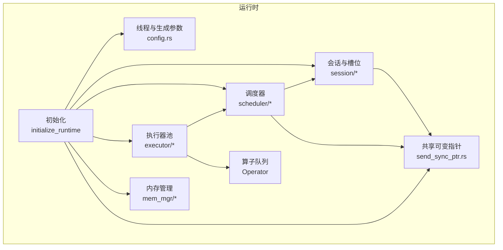
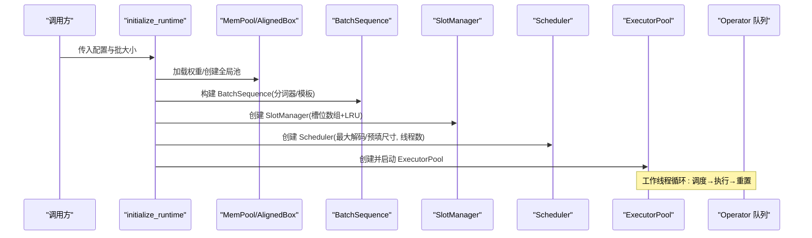
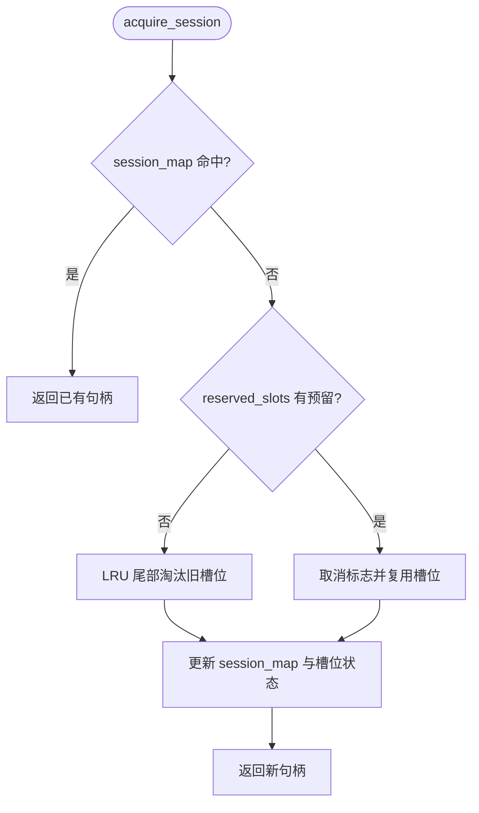
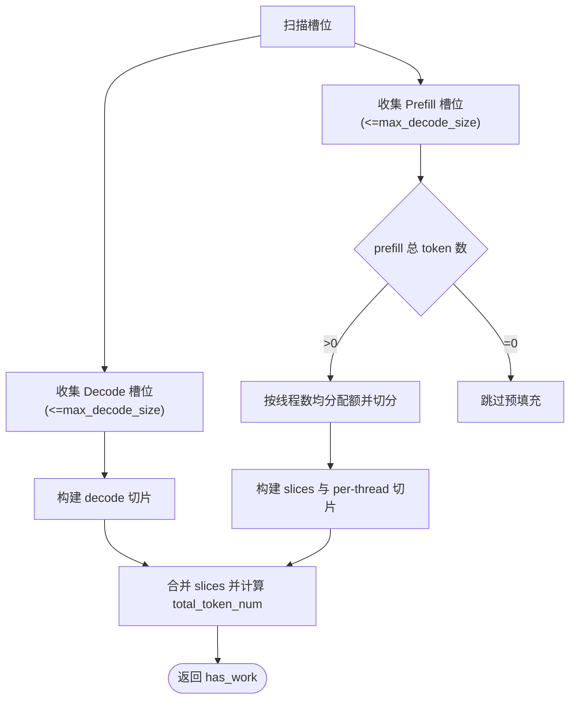
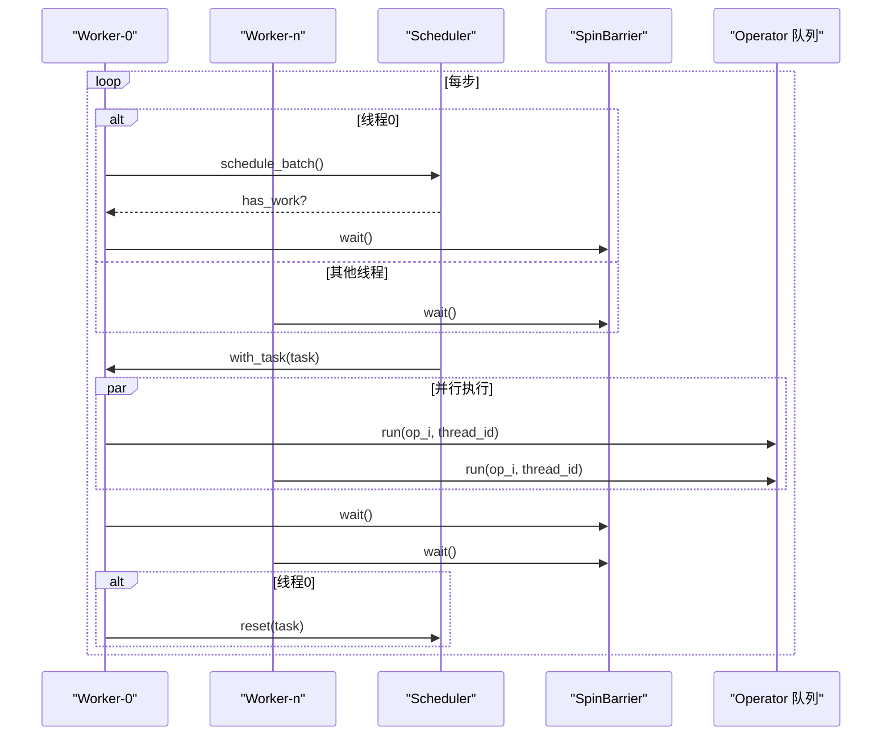
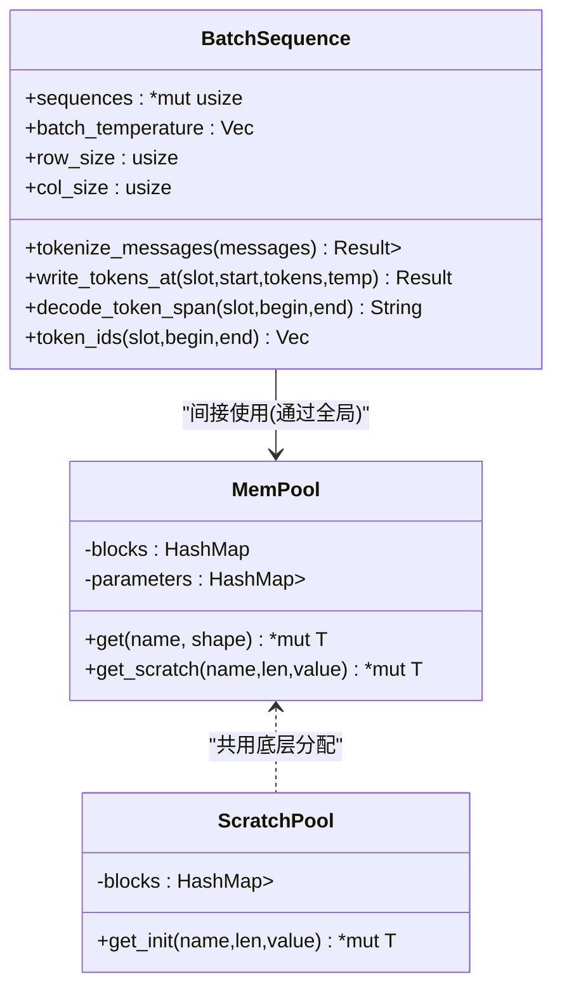
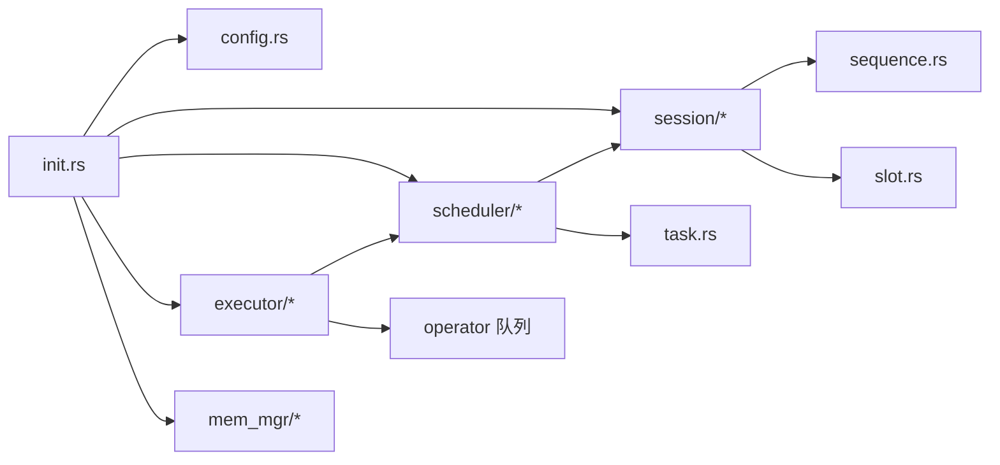

# 运行时系统

<cite>
**本文引用的文件**   
- [src/runtime/mod.rs](file://src/runtime/mod.rs)
- [src/runtime/init.rs](file://src/runtime/init.rs)
- [src/runtime/config.rs](file://src/runtime/config.rs)
- [src/runtime/session/manager.rs](file://src/runtime/session/manager.rs)
- [src/runtime/session/slot.rs](file://src/runtime/session/slot.rs)
- [src/runtime/session/sequence.rs](file://src/runtime/session/sequence.rs)
- [src/runtime/scheduler/scheduler.rs](file://src/runtime/scheduler/scheduler.rs)
- [src/runtime/scheduler/task.rs](file://src/runtime/scheduler/task.rs)
- [src/runtime/executor/executor_pool.rs](file://src/runtime/executor/executor_pool.rs)
- [src/runtime/executor/sync.rs](file://src/runtime/executor/sync.rs)
- [src/mem_mgr/allocator.rs](file://src/mem_mgr/allocator.rs)
- [src/mem_mgr/mem_pool.rs](file://src/mem_mgr/mem_pool.rs)
- [src/operators/send_sync_ptr.rs](file://src/operators/send_sync_ptr.rs)
</cite>

## 目录
1. [简介](#简介)
2. [项目结构](#项目结构)
3. [核心组件](#核心组件)
4. [架构总览](#架构总览)
5. [详细组件分析](#详细组件分析)
6. [依赖关系分析](#依赖关系分析)
7. [性能考量](#性能考量)
8. [故障排查指南](#故障排查指南)
9. [结论](#结论)
10. [附录](#附录)

## 简介
本技术文档聚焦 eLLM 运行时系统的实现与工作机制，围绕以下主题展开：会话管理与生命周期、任务调度算法（批处理策略、优先级与资源分配）、执行器池（线程管理、任务分发与同步）、序列管理与槽位分配（KV 缓存存储与访问模式）、并发控制与锁机制、性能监控与调试工具、内存管理与垃圾回收策略，以及扩展与自定义运行时行为的指导。文档以源码为依据，提供面向工程实践的系统化说明与可视化图示，帮助读者快速理解并高效使用或扩展该运行时。

## 项目结构
运行时子系统位于 src/runtime 下，按职责划分为配置、初始化、会话、调度、执行器等模块；内存管理位于 src/mem_mgr；共享指针封装位于 src/operators/send_sync_ptr.rs。整体采用“集中式调度 + 多工作线程并行执行”的架构，通过 SessionManager 管理会话与槽位，Scheduler 将活跃槽位转化为可执行的 ScheduleTask，ExecutorPool 驱动 Operator 队列完成计算。

图表来源
- [src/runtime/init.rs:34-136](file://src/runtime/init.rs#L34-L136)
- [src/runtime/config.rs:62-105](file://src/runtime/config.rs#L62-L105)
- [src/runtime/session/manager.rs:17-133](file://src/runtime/session/manager.rs#L17-L133)
- [src/runtime/scheduler/scheduler.rs:15-131](file://src/runtime/scheduler/scheduler.rs#L15-L131)
- [src/runtime/executor/executor_pool.rs:10-149](file://src/runtime/executor/executor_pool.rs#L10-L149)
- [src/mem_mgr/mem_pool.rs:237-428](file://src/mem_mgr/mem_pool.rs#L237-L428)
- [src/operators/send_sync_ptr.rs:30-60](file://src/operators/send_sync_ptr.rs#L30-L60)

章节来源
- [src/runtime/mod.rs:1-23](file://src/runtime/mod.rs#L1-L23)
- [src/runtime/init.rs:34-136](file://src/runtime/init.rs#L34-L136)

## 核心组件
- 会话与槽位管理：SlotManager 负责会话到物理槽位的映射、LRU 回收、预留槽位与超时释放、提示词写入与解码辅助方法；SessionHandle 暴露会话句柄；Phase 与 SlotState 描述槽位状态机。
- 序列与 KV 缓存：BatchSequence 维护 token 序列与温度等元数据，提供消息分词、片段写入与解码接口；KV 缓存由全局内存池按需分配并按层/键值命名规则复用。
- 调度器：Scheduler 扫描槽位状态，构建预填充与解码切片，支持预填充分片与多线程均衡分配，输出 ScheduleTask。
- 执行器池：ExecutorPool 启动固定数量工作线程，使用自旋屏障进行阶段同步，轮询调度器并顺序执行算子队列。
- 内存管理：AlignedBox 提供 64B 对齐分配；MemPool/ScratchPool 提供全局参数与临时缓冲复用，支持严格与非严格权重加载模式。
- 并发原语：SharedMut 基于 SyncUnsafeCell 提供无锁读写的便捷 API；SpinBarrier 与 AdaptiveWait 提供轻量同步与自适应等待。

章节来源
- [src/runtime/session/manager.rs:17-133](file://src/runtime/session/manager.rs#L17-L133)
- [src/runtime/session/slot.rs:1-90](file://src/runtime/session/slot.rs#L1-L90)
- [src/runtime/session/sequence.rs:10-152](file://src/runtime/session/sequence.rs#L10-L152)
- [src/runtime/scheduler/scheduler.rs:15-131](file://src/runtime/scheduler/scheduler.rs#L15-L131)
- [src/runtime/executor/executor_pool.rs:10-149](file://src/runtime/executor/executor_pool.rs#L10-L149)
- [src/mem_mgr/allocator.rs:1-156](file://src/mem_mgr/allocator.rs#L1-L156)
- [src/mem_mgr/mem_pool.rs:237-428](file://src/mem_mgr/mem_pool.rs#L237-L428)
- [src/operators/send_sync_ptr.rs:30-60](file://src/operators/send_sync_ptr.rs#L30-L60)

## 架构总览
运行时初始化流程串联模型权重加载、线程配置、序列与槽位准备、调度器与工作线程启动，形成“请求进入 → 会话分配 → 调度批处理 → 执行算子 → 结果回写”的闭环。

图表来源
- [src/runtime/init.rs:34-136](file://src/runtime/init.rs#L34-L136)
- [src/runtime/session/sequence.rs:157-182](file://src/runtime/session/sequence.rs#L157-L182)
- [src/runtime/session/manager.rs:27-44](file://src/runtime/session/manager.rs#L27-L44)
- [src/runtime/scheduler/scheduler.rs:27-43](file://src/runtime/scheduler/scheduler.rs#L27-L43)
- [src/runtime/executor/executor_pool.rs:46-70](file://src/runtime/executor/executor_pool.rs#L46-L70)

## 详细组件分析

### 会话管理与生命周期
- 会话获取与释放：acquire_session 优先复用已存在映射，其次从 reserved_slots 取回预留槽位，否则从 LRU 尾部淘汰旧会话；release_session 在非可重用模式下立即复位并放回 LRU 前端，在可重用模式下放入 reserved_slots 并在超时后自动回收。
- 提示词写入：write_prompts 对消息应用聊天模板并分词，若为可重用模式则尝试前缀匹配以减少重复预填充；随后确保槽位可用、更新 LRU、写入 token 并设置 Phase=Prefill。
- 解码辅助：提供单 token/区间解码、EOS 判断、索引与阶段查询等方法，便于上层服务组装响应。
- 前缀匹配：prefix_match_len 对比历史 token 与新 token 的最长公共前缀，用于跳过重复预填充。

图表来源
- [src/runtime/session/manager.rs:48-82](file://src/runtime/session/manager.rs#L48-L82)

章节来源
- [src/runtime/session/manager.rs:48-133](file://src/runtime/session/manager.rs#L48-L133)
- [src/runtime/session/manager.rs:137-182](file://src/runtime/session/manager.rs#L137-L182)
- [src/runtime/session/manager.rs:256-282](file://src/runtime/session/manager.rs#L256-L282)
- [src/runtime/session/slot.rs:18-64](file://src/runtime/session/slot.rs#L18-L64)

### 任务调度算法
- 批构建：schedule_batch 遍历槽位，统计可调度 Decode 数量与待预填充 Prefill 列表；根据 max_decode_size 与 max_prefill_size 限制总量。
- 预填充分片与线程均衡：build_prefill 将总 token 数按 thread_num 均分配额，跨槽位切分 SequenceSlice，并将每线程切片存入 prefilling_chunked_slices，保证 last_token_flag 标记正确。
- 解码切片：build_decode 为每个处于 Decode 阶段的槽位生成长度为 1 的切片，token_start_index 连续递增。
- 混合批处理：同一批次可同时包含预填充与解码，slices 中预填充在前、解码在后，保持严格的 token_start_index 单调递增。

图表来源
- [src/runtime/scheduler/scheduler.rs:66-131](file://src/runtime/scheduler/scheduler.rs#L66-L131)
- [src/runtime/scheduler/scheduler.rs:133-222](file://src/runtime/scheduler/scheduler.rs#L133-L222)

章节来源
- [src/runtime/scheduler/scheduler.rs:66-131](file://src/runtime/scheduler/scheduler.rs#L66-L131)
- [src/runtime/scheduler/scheduler.rs:133-222](file://src/runtime/scheduler/scheduler.rs#L133-L222)
- [src/runtime/scheduler/task.rs:1-49](file://src/runtime/scheduler/task.rs#L1-L49)

### 执行器池与同步机制
- 线程启动：start 为每个 worker 线程克隆 scheduler/operator_queue/barrier/shutdown，并以固定名称启动。
- 工作循环：run_worker 使用 AdaptiveWait 等待任务；仅线程 0 负责 schedule_batch，其余线程自旋等待 has_work；所有线程在 SpinBarrier 处同步，然后读取 task 并执行 operator 队列；完成后再次 barrier 同步，最后由线程 0 重置 task。
- 算子执行：execute_operators 遍历 operator_queue，每次调用 operator.run 时传递 batch_list 指针、thread_num/thread_id、prefill/decode 切片等上下文。

图表来源
- [src/runtime/executor/executor_pool.rs:46-149](file://src/runtime/executor/executor_pool.rs#L46-L149)
- [src/runtime/executor/sync.rs:33-83](file://src/runtime/executor/sync.rs#L33-L83)

章节来源
- [src/runtime/executor/executor_pool.rs:46-149](file://src/runtime/executor/executor_pool.rs#L46-L149)
- [src/runtime/executor/sync.rs:33-83](file://src/runtime/executor/sync.rs#L33-L83)

### 序列管理与槽位分配（含 KV 缓存）
- 序列存储：BatchSequence 内部维护一维数组 sequences（row_size × col_size），按 slot_index 行偏移写入 token；同时维护 batch_temperature 向量。
- 写入与解码：write_tokens_at 支持从指定位置写入；decode_token_span/token_ids 提供区间解码与 ID 提取；tokenize_messages 结合 ChatTemplate 与 tiktoken 完成分词。
- KV 缓存：通过 MemPool 的全局参数与 ScratchPool 管理；K/V 投影输出按层名持久化，非 K/V 的层内中间结果可按后缀共享；专家权重按 experts.* 聚合为父块并建立子块视图。

图表来源
- [src/runtime/session/sequence.rs:10-152](file://src/runtime/session/sequence.rs#L10-L152)
- [src/mem_mgr/mem_pool.rs:237-428](file://src/mem_mgr/mem_pool.rs#L237-L428)

章节来源
- [src/runtime/session/sequence.rs:10-152](file://src/runtime/session/sequence.rs#L10-L152)
- [src/mem_mgr/mem_pool.rs:237-428](file://src/mem_mgr/mem_pool.rs#L237-L428)

### 并发控制与锁机制
- SharedMut：基于 SyncUnsafeCell 提供 with/with_mut 两种访问方式，避免外部互斥开销，适用于已知调用者约束的场景。
- SpinBarrier：原子计数与代际号实现轻量屏障，最后一位到达线程重置计数并推进代际号，其余线程自旋等待。
- AdaptiveWait：自适应自旋/让步/短睡眠组合，减少忙等成本。
- 异步锁：SlotManager 使用 tokio::sync::Mutex 保护 session_map/reserved_slots，配合 AtomicBool 取消标志实现安全回收。

章节来源
- [src/operators/send_sync_ptr.rs:30-60](file://src/operators/send_sync_ptr.rs#L30-L60)
- [src/runtime/executor/sync.rs:33-83](file://src/runtime/executor/sync.rs#L33-L83)
- [src/runtime/session/manager.rs:1-25](file://src/runtime/session/manager.rs#L1-L25)

### 性能监控与调试工具
- 日志打印：BatchSequence.write_prompts 会打印提示写入信息，便于定位分词与写入长度；initialize_runtime 打印线程配置与权重加载情况。
- 测试覆盖：调度器与执行器包含大量单元测试，验证切片布局、混合批处理、分片均衡与空批处理边界条件，可作为行为参考。
- 建议增强：可在关键路径插入时间戳与计数器（如调度耗时、各算子耗时、KV 命中率），并通过环境变量开关，以便在生产环境选择性开启。

章节来源
- [src/runtime/session/sequence.rs:76-80](file://src/runtime/session/sequence.rs#L76-L80)
- [src/runtime/init.rs:44-64](file://src/runtime/init.rs#L44-L64)
- [src/runtime/scheduler/scheduler.rs:225-735](file://src/runtime/scheduler/scheduler.rs#L225-L735)

### 内存管理与垃圾回收策略
- 对齐分配：AlignedBox 使用 64B 对齐布局，适合 SIMD 向量化；Drop 中显式析构元素并释放内存。
- 全局池：MemPool 支持严格/非严格权重加载，缺失权重在非严格模式下动态分配零初始化缓冲；K/V 输出按层持久化，其他层内中间结果按后缀共享；专家权重聚合成父块并提供子块视图。
- 临时缓冲：ScratchPool 按名称缓存 AlignedBox，按需扩容与复用，降低频繁分配开销。
- GC 策略：Rust RAII 语义下，AlignedBox/MemPool 生命周期结束时自动释放；全局池通过 once_cell::Lazy 与 Mutex 管理单例，进程退出时统一回收。

章节来源
- [src/mem_mgr/allocator.rs:1-156](file://src/mem_mgr/allocator.rs#L1-L156)
- [src/mem_mgr/mem_pool.rs:237-428](file://src/mem_mgr/mem_pool.rs#L237-L428)

### 扩展与自定义运行时行为
- 自定义算子：实现 Operator<T> trait 并通过 f16::take_operator_queue() 注册到全局队列，执行器将按序调用。
- 调整调度参数：通过 initialize_runtime 的 chunk_size 与 batch_size 控制预填充上限与解码批大小；ThreadingConfig 决定工作线程数。
- 会话策略：SessionMode 选择是否可重用；slot_reuse_timeout_ms 控制预留槽位超时回收时长。
- 内存策略：切换严格/非严格权重加载模式，影响缺失权重的处理与断言行为。

章节来源
- [src/runtime/init.rs:34-136](file://src/runtime/init.rs#L34-L136)
- [src/runtime/config.rs:62-105](file://src/runtime/config.rs#L62-L105)
- [src/runtime/session/manager.rs:17-44](file://src/runtime/session/manager.rs#L17-L44)
- [src/mem_mgr/mem_pool.rs:237-247](file://src/mem_mgr/mem_pool.rs#L237-L247)

## 依赖关系分析
- 模块耦合：init 依赖 config、session、scheduler、executor、mem_mgr、operators；scheduler 依赖 session 的槽位状态；executor 依赖 scheduler 与 operator 队列；session 依赖 sequence 与 mem_mgr（间接）。
- 共享数据：batch_states 与 batch_sequences 通过 SharedMut 暴露裸指针供执行期直接访问，减少拷贝与锁竞争。
- 潜在环依赖：当前未见循环导入；注意 SharedMut 的 Send/Sync 不安全实现需确保调用者遵守独占/共享访问约定。

图表来源
- [src/runtime/init.rs:34-136](file://src/runtime/init.rs#L34-L136)
- [src/runtime/scheduler/scheduler.rs:15-43](file://src/runtime/scheduler/scheduler.rs#L15-L43)
- [src/runtime/executor/executor_pool.rs:10-44](file://src/runtime/executor/executor_pool.rs#L10-L44)
- [src/runtime/session/manager.rs:17-44](file://src/runtime/session/manager.rs#L17-L44)

章节来源
- [src/runtime/mod.rs:1-23](file://src/runtime/mod.rs#L1-L23)

## 性能考量
- 批大小与分片：合理设置 max_decode_size 与 max_prefill_size，平衡吞吐与延迟；预填充按线程均衡分片可减少热点。
- 同步开销：SpinBarrier 与 AdaptiveWait 在无任务时自旋/让步/短睡眠，避免频繁系统调用；仅在必要时使用异步锁。
- 内存复用：利用 MemPool 的层间共享与专家权重聚合，减少重复分配与碎片；ScratchPool 复用临时缓冲。
- 访存局部性：BatchSequence 使用行主布局，按槽位行访问，利于批量操作；KV 缓存按层持久化，提升复用率。

[本节为通用性能建议，不直接分析具体文件]

## 故障排查指南
- 槽位不可用：ensure_slot_available 检查槽位是否处于 Start/Eos 阶段，若非则返回错误；确认 release_session 是否正确复位与放回 LRU。
- 预填充未结束：advance_slot 逻辑要求 filling_length 归零才转入 Decode；检查调度器的 prefill 切片长度与 last_token_flag 设置。
- 权重缺失：严格模式下缺失权重会 panic；非严格模式会动态分配零缓冲，可能导致数值异常；检查模型目录与加载路径。
- 线程饥饿：若 has_work 长期为 false，检查 schedule_batch 是否被正确调用、barrier 是否阻塞、shutdown 标志是否提前置位。

章节来源
- [src/runtime/session/manager.rs:229-239](file://src/runtime/session/manager.rs#L229-L239)
- [src/runtime/scheduler/scheduler.rs:133-222](file://src/runtime/scheduler/scheduler.rs#L133-L222)
- [src/mem_mgr/mem_pool.rs:370-427](file://src/mem_mgr/mem_pool.rs#L370-L427)
- [src/runtime/executor/executor_pool.rs:72-115](file://src/runtime/executor/executor_pool.rs#L72-L115)

## 结论
eLLM 运行时通过清晰的模块划分与高效的并发设计，实现了高吞吐、低延迟的推理流水线。会话管理提供灵活的槽位复用策略，调度器支持混合批处理与预填充分片，执行器池借助轻量同步原语实现稳定并行，内存管理兼顾对齐与复用。建议在部署时依据硬件特性调优批大小与线程数，并结合日志与测试用例持续优化。

[本节为总结性内容，不直接分析具体文件]

## 附录
- 术语
  - Prefill：提示词预填充阶段，批量编码输入 token。
  - Decode：逐 token 解码阶段，逐步生成下一个 token。
  - KV 缓存：注意力层的键/值中间结果，跨步复用以提升效率。
  - 槽位：表示一个会话的物理执行单元，承载序列与状态。

[本节为概念性内容，不直接分析具体文件]