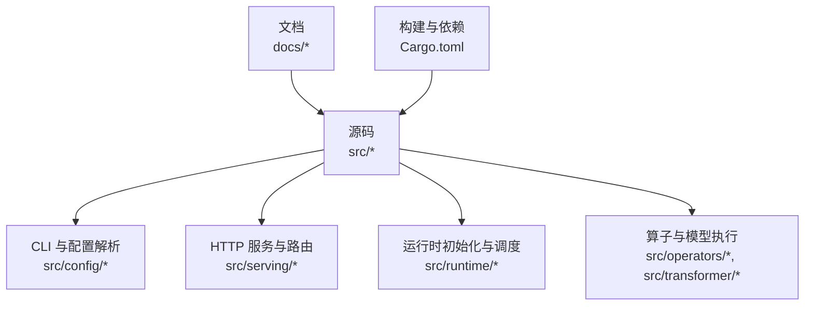
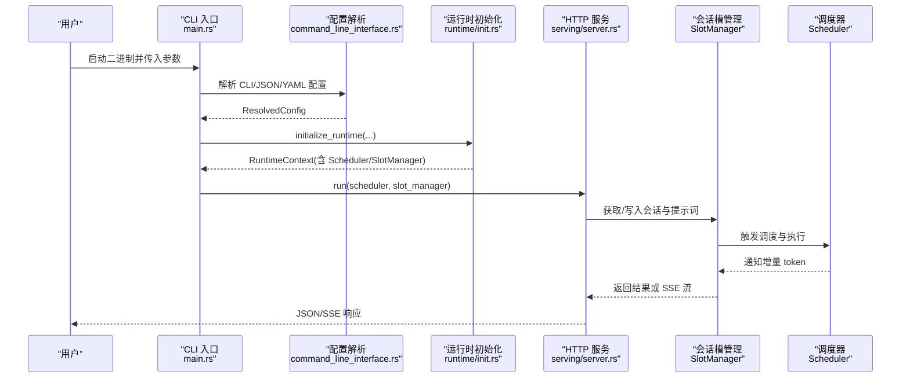
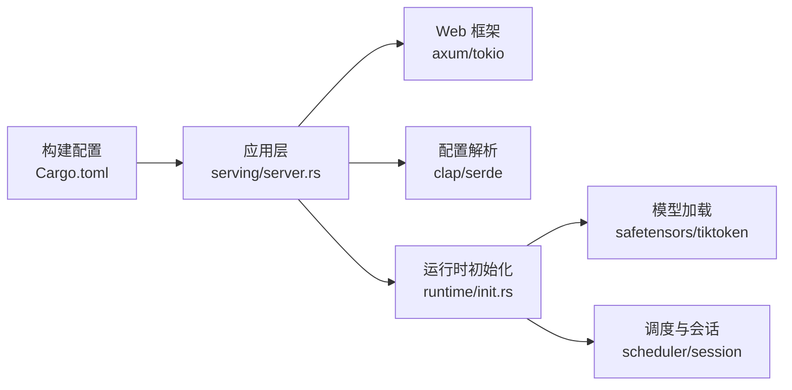

# 单机部署

<cite>
**本文引用的文件**
- [README.md](file://README.md)
- [安装指南](file://docs/getting_started/installation.md)
- [快速开始](file://docs/getting_started/quickstart.md)
- [环境变量说明](file://docs/configuration/env_vars.md)
- [配置总览](file://docs/configuration/index.md)
- [调度优化配置](file://docs/configuration/optimization.md)
- [主程序入口](file://src/bin/main.rs)
- [服务启动与路由](file://src/serving/server.rs)
- [命令行接口定义](file://src/config/command_line_interface.rs)
- [配置类型与默认值](file://src/config/config_types.rs)
- [运行时初始化](file://src/runtime/init.rs)
- [线程与生成参数计算](file://src/runtime/config.rs)
- [项目依赖与构建配置](file://Cargo.toml)
</cite>

## 目录
1. [简介](#简介)
2. [项目结构](#项目结构)
3. [核心组件](#核心组件)
4. [架构总览](#架构总览)
5. [详细组件分析](#详细组件分析)
6. [依赖分析](#依赖分析)
7. [性能考虑](#性能考虑)
8. [故障排查指南](#故障排查指南)
9. [结论](#结论)
10. [附录](#附录)

## 简介
本指南面向在单机环境部署 eLLM 的读者，覆盖系统要求、硬件建议、二进制安装、依赖项配置、命令行与服务配置、环境变量及优先级、端口与网络绑定、常见部署场景示例、进程管理与日志轮转、健康检查与监控集成等。eLLM 为纯 CPU 推理框架，无需 GPU/NPU，适合长上下文、低延迟优先的场景。

## 项目结构
- 文档位于 docs 目录，包含安装、快速开始、配置与优化等页面。
- 源码位于 src 目录，包含 CLI、配置解析、HTTP 服务、运行时初始化、调度与会话管理等模块。
- 构建与依赖由 Cargo.toml 管理，提供 release 优化配置。

图表来源
- [安装指南:1-90](file://docs/getting_started/installation.md#L1-L90)
- [配置总览:1-19](file://docs/configuration/index.md#L1-L19)
- [项目依赖与构建配置:1-102](file://Cargo.toml#L1-L102)

章节来源
- [安装指南:1-90](file://docs/getting_started/installation.md#L1-L90)
- [配置总览:1-19](file://docs/configuration/index.md#L1-L19)

## 核心组件
- 命令行与配置：支持从 CLI 参数、JSON 参数、YAML 配置文件加载并合并到统一配置对象；提供 serve/chat 子命令与共享参数。
- HTTP 服务：基于 axum 暴露 OpenAI 兼容接口 /v1/chat/completions 与健康检查 /status。
- 运行时初始化：加载模型权重、构建 KV 缓存、创建调度器与会话槽管理器、启动工作线程池。
- 线程与生成参数：根据物理核心数与 API 线程数自动分配阻塞线程与 API 线程，提取采样参数。

章节来源
- [命令行接口定义:1-200](file://src/config/command_line_interface.rs#L1-L200)
- [配置类型与默认值:188-310](file://src/config/config_types.rs#L188-L310)
- [服务启动与路由:25-98](file://src/serving/server.rs#L25-L98)
- [运行时初始化:34-136](file://src/runtime/init.rs#L34-L136)
- [线程与生成参数计算:62-105](file://src/runtime/config.rs#L62-L105)

## 架构总览
下图展示单机部署的关键组件交互：CLI 解析配置 → 初始化运行时（加载模型、KV 缓存、调度器）→ 启动 Tokio 多核运行时 → 启动 axum HTTP 服务 → 处理请求并通过 SlotManager 与 Scheduler 完成推理。

图表来源
- [主程序入口:26-41](file://src/bin/main.rs#L26-L41)
- [命令行接口定义:14-60](file://src/config/command_line_interface.rs#L14-L60)
- [运行时初始化:34-136](file://src/runtime/init.rs#L34-L136)
- [服务启动与路由:25-98](file://src/serving/server.rs#L25-L98)

## 详细组件分析

### 系统要求与硬件建议
- 操作系统：Linux 或 Windows（已在 Ubuntu 22.04 与 Windows 11 测试）。
- CPU：x86-64，支持 AVX-512（AVX2 标量回退可用）；推荐 Intel Xeon 4th Gen 及以上且具备 AMX 支持以获得更好性能。
- 内存：至少 8 GB，具体取决于模型大小与上下文长度；CPU 服务器通常具备更大内存，有利于长上下文推理。
- Rust 工具链：1.78+（通过 rustup 安装）。

章节来源
- [安装指南:1-20](file://docs/getting_started/installation.md#L1-L20)
- [README.md:20-23](file://README.md#L20-L23)

### 二进制安装与依赖项配置
- 从源码构建：
  - Debug 构建：cargo build
  - Release 构建（推荐用于服务）：cargo build --release
- 依赖项：
  - 运行期依赖包括 axum、tokio、safetensors、tiktoken-rs、serde 系列等。
  - 构建期依赖 raw-cpuid 用于 CPU 特性检测。
- 发布构建优化：启用 opt-level=3、fat LTO、单 codegen-unit、strip symbols 等以提升吞吐与减小体积。

章节来源
- [安装指南:16-31](file://docs/getting_started/installation.md#L16-L31)
- [项目依赖与构建配置:42-80](file://Cargo.toml#L42-L80)

### 模型准备与路径
- 将 HuggingFace 兼容模型目录放置于 models/<model-name>，至少包含 config.json、generation_config.json、model.safetensors；推理路径需要 tokenizer.json。
- 支持的已测模型包括 Qwen3-0.6B、MiniMax-M2.5 等。

章节来源
- [安装指南:34-56](file://docs/getting_started/installation.md#L34-L56)

### 命令行启动参数与服务配置
- 主入口使用 clap 解析参数，支持 --config、--json-arg、serve/chat 子命令以及大量共享参数（如 --model、--tokenizer、--dtype、--max-model-len、--seed 等）。
- serve 子命令关键参数：
  - --host/-H：监听地址
  - --port/-P：监听端口
  - --log-requests：是否记录请求
  - --api-key：API Key
  - --reasoning-parser-enabled/--tool-call-parser-enabled：开启推理/工具调用解析
  - --api-server-count：API 服务线程数
  - --uds：Unix Domain Socket 路径
  - --ssl-keyfile/--ssl-certfile/--ssl-ca-certs：SSL 证书相关
  - --allow-credentials/--allowed-origins/--allowed-methods/--allowed-headers：CORS 相关
  - --slot-reuse-timeout-ms：会话槽复用超时（毫秒）
- 默认行为：
  - 默认 host 为 127.0.0.1，默认 port 为 8000。
  - 若未显式指定 host/port，服务会绑定到 0.0.0.0:8000（见服务启动代码）。

章节来源
- [命令行接口定义:162-233](file://src/config/command_line_interface.rs#L162-L233)
- [配置类型与默认值:225-310](file://src/config/config_types.rs#L225-L310)
- [服务启动与路由:25-43](file://src/serving/server.rs#L25-L43)

### 环境变量配置与优先级规则
- 所有运行时参数通过环境变量读取，零值回退至内置默认值。
- 常用环境变量：
  - ELLM_BATCH_SIZE：最大并发请求（批槽位），默认 3
  - ELLM_SEQUENCE_LENGTH：每槽最大序列长度，默认 128
  - ELLM_CHUNK_SIZE：预填充每轮最大 token 数，也作为调度阈值，默认 64
  - ELLM_SCHEDULE_TIMEOUT_MS：调度超时窗口（毫秒），默认 10
- 优先级规则（从高到低）：
  1) CLI 参数
  2) JSON 参数（--json-arg）
  3) YAML 配置文件（--config）
  4) 环境变量
  5) 内置默认值
- 注意：线程数由 determine_thread_config() 自动计算，不直接通过环境变量设置。

章节来源
- [环境变量说明:1-45](file://docs/configuration/env_vars.md#L1-L45)
- [调度优化配置:1-35](file://docs/configuration/optimization.md#L1-L35)
- [线程与生成参数计算:62-105](file://src/runtime/config.rs#L62-L105)

### 服务端口配置与网络绑定
- 默认监听地址与端口：
  - 配置默认 host=127.0.0.1、port=8000。
  - 服务启动时实际绑定到 0.0.0.0:8000（便于容器/宿主机访问）。
- 可通过 CLI 的 --host/-H 与 --port/-P 修改监听地址与端口。
- 支持 Unix Domain Socket（--uds）与 SSL（--ssl-keyfile/--ssl-certfile/--ssl-ca-certs）。

章节来源
- [配置类型与默认值:429-435](file://src/config/config_types.rs#L429-L435)
- [服务启动与路由:33-43](file://src/serving/server.rs#L33-L43)
- [命令行接口定义:170-201](file://src/config/command_line_interface.rs#L170-L201)

### 常见部署场景配置示例
- 开发环境（本地调试）：
  - 使用默认 host 127.0.0.1 与 port 8000，关闭 CORS 限制或允许本地来源。
  - 降低 ELLM_BATCH_SIZE 与 ELLM_SEQUENCE_LENGTH 以节省内存。
  - 开启 --log-requests 便于调试。
- 生产环境（对外服务）：
  - 将 host 设置为 0.0.0.0 或通过反向代理（Nginx/Caddy）暴露。
  - 调整 ELLM_BATCH_SIZE 与 ELLM_CHUNK_SIZE 提升吞吐。
  - 配置 --api-key 进行鉴权，启用 CORS 白名单。
  - 结合 systemd 或容器编排进行进程管理。

章节来源
- [快速开始:1-40](file://docs/getting_started/quickstart.md#L1-L40)
- [环境变量说明:10-26](file://docs/configuration/env_vars.md#L10-L26)
- [命令行接口定义:170-233](file://src/config/command_line_interface.rs#L170-L233)

### 服务启动脚本与进程管理
- 直接运行：
  - cargo run --release --bin main -- --model models/Qwen3-0.6B
  - 或使用 backend 二进制：cargo run --release --bin backend
- 进程管理建议：
  - Linux：使用 systemd 单元文件管理，设置 Restart=always、RestartSec、LimitNOFILE、MemoryMax 等。
  - 容器化：使用 Docker 镜像，映射端口 8000，挂载模型目录，设置环境变量。
  - 资源隔离：结合 cgroup 限制 CPU 与内存，避免影响宿主。

章节来源
- [安装指南:75-90](file://docs/getting_started/installation.md#L75-L90)
- [快速开始:8-18](file://docs/getting_started/quickstart.md#L8-L18)

### 日志输出配置与日志轮转
- 请求日志：通过 --log-requests 控制是否记录请求。
- 标准输出：服务启动时会打印监听地址与端点信息。
- 日志轮转：
  - 建议使用 journald（systemd）或外部日志收集器（如 Fluent Bit、Filebeat）对 stdout/stderr 进行采集与轮转。
  - 容器环境下可配合 sidecar 或平台日志驱动实现集中化管理。

章节来源
- [服务启动与路由:29-43](file://src/serving/server.rs#L29-L43)
- [命令行接口定义:176-177](file://src/config/command_line_interface.rs#L176-L177)

### 健康检查端点与监控集成
- 健康检查：GET /status 返回运行状态与模式信息。
- 监控集成：
  - 指标采集：可在 HTTP 层增加 Prometheus 指标中间件，暴露 /metrics。
  - 链路追踪：接入 OpenTelemetry，为请求添加 trace_id/span。
  - 告警：基于 /status 与自定义指标（QPS、延迟、错误率）设置告警规则。

章节来源
- [服务启动与路由:84-98](file://src/serving/server.rs#L84-L98)
- [快速开始:14-28](file://docs/getting_started/quickstart.md#L14-L28)

## 依赖分析
- 运行期依赖：
  - Web 框架：axum、tokio（net、rt-multi-thread、macros）
  - 序列化：serde、serde_json、serde_yaml
  - 模型加载：safetensors、tiktoken-rs
  - 其他：anyhow、itertools、memmap2、minijinja、npy、num、regex、uuid 等
- 构建期依赖：raw-cpuid（CPU 特性检测）
- 构建配置：release profile 启用 fat LTO、单 codegen-unit、strip symbols 等优化

图表来源
- [服务启动与路由:1-24](file://src/serving/server.rs#L1-L24)
- [运行时初始化:1-20](file://src/runtime/init.rs#L1-L20)
- [项目依赖与构建配置:42-80](file://Cargo.toml#L42-L80)

章节来源
- [项目依赖与构建配置:42-102](file://Cargo.toml#L42-L102)

## 性能考虑
- 批处理与上下文长度：
  - 增大 ELLM_BATCH_SIZE 与 ELLM_CHUNK_SIZE 提升吞吐，但会增加内存占用。
  - 增大 ELLM_SEQUENCE_LENGTH 支持更长上下文，内存线性增长。
- 调度超时：
  - 降低 ELLM_SCHEDULE_TIMEOUT_MS 可降低低负载下的调度延迟。
- 线程配置：
  - 线程数由 determine_thread_config() 自动计算，遵循“物理核心数”与“API 线程数”分配策略。
- 构建优化：
  - 使用 release 构建，启用 fat LTO 与单 codegen-unit，减少动态调度开销，提高单线程吞吐。

章节来源
- [调度优化配置:14-35](file://docs/configuration/optimization.md#L14-L35)
- [线程与生成参数计算:62-105](file://src/runtime/config.rs#L62-L105)
- [项目依赖与构建配置:69-80](file://Cargo.toml#L69-L80)

## 故障排查指南
- 无法启动服务：
  - 检查端口占用与防火墙策略；确认 --host/--port 设置正确。
  - 查看标准输出中的监听地址与端点信息。
- 模型加载失败：
  - 确认 models/<model-name> 下存在必需文件（config.json、generation_config.json、model.safetensors、tokenizer.json）。
  - 检查磁盘空间与权限。
- 性能不达预期：
  - 调整 ELLM_BATCH_SIZE、ELLM_CHUNK_SIZE、ELLM_SEQUENCE_LENGTH。
  - 验证线程数与 CPU 核心数匹配，避免过度竞争。
- 健康检查异常：
  - 调用 GET /status 确认服务状态；检查内部模式与日志。

章节来源
- [服务启动与路由:29-43](file://src/serving/server.rs#L29-L43)
- [安装指南:34-56](file://docs/getting_started/installation.md#L34-L56)

## 结论
eLLM 在单机 CPU 服务器上可实现高效、稳定的长上下文推理服务。通过合理的硬件选择、构建优化与参数调优，可在低延迟与高吞吐之间取得平衡。结合健康检查与监控集成，可形成可靠的部署方案。

## 附录
- 参考文档：
  - 安装与快速开始：docs/getting_started/installation.md、docs/getting_started/quickstart.md
  - 配置与环境变量：docs/configuration/env_vars.md、docs/configuration/index.md、docs/configuration/optimization.md
- 源码入口：
  - 主程序：src/bin/main.rs
  - 服务与路由：src/serving/server.rs
  - 配置与 CLI：src/config/command_line_interface.rs、src/config/config_types.rs
  - 运行时初始化：src/runtime/init.rs、src/runtime/config.rs