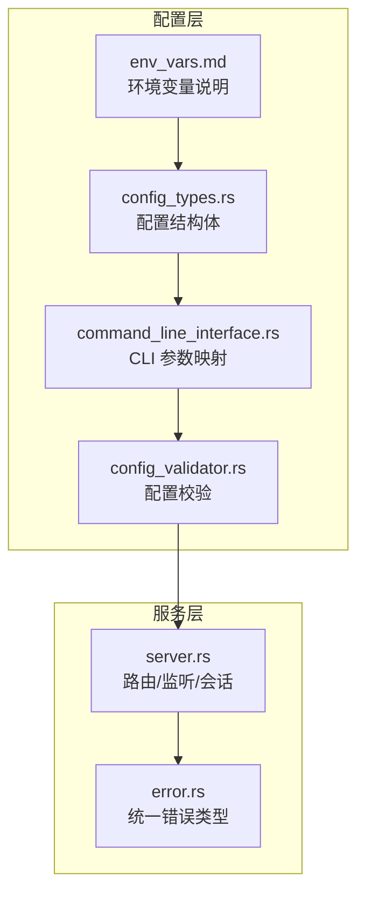
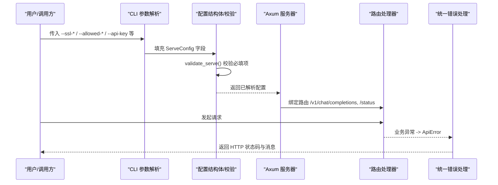
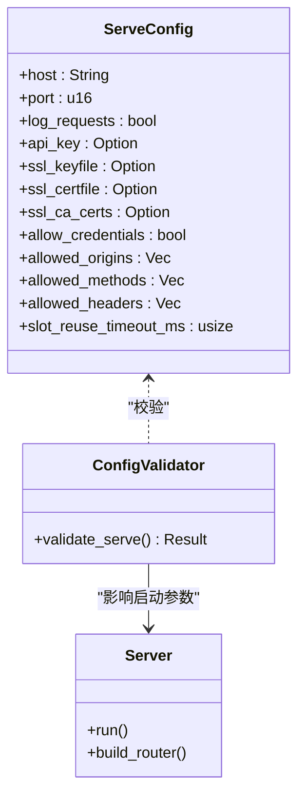

# 安全配置

<cite>
**本文引用的文件**   
- [src/config/config_types.rs](file://src/config/config_types.rs)
- [src/config/command_line_interface.rs](file://src/config/command_line_interface.rs)
- [src/config/config_validator.rs](file://src/config/config_validator.rs)
- [src/serving/server.rs](file://src/serving/server.rs)
- [src/serving/error.rs](file://src/serving/error.rs)
- [docs/configuration/env_vars.md](file://docs/configuration/env_vars.md)
</cite>

## 目录
1. [简介](#简介)
2. [项目结构](#项目结构)
3. [核心组件](#核心组件)
4. [架构总览](#架构总览)
5. [详细组件分析](#详细组件分析)
6. [依赖分析](#依赖分析)
7. [性能考虑](#性能考虑)
8. [故障排查指南](#故障排查指南)
9. [结论](#结论)
10. [附录](#附录)

## 简介
本指南聚焦于 eLLM 服务的安全配置与加固实践，覆盖以下主题：API 认证与授权、HTTPS/TLS 证书与安全传输、访问控制与权限管理、输入验证与请求过滤、资源限制与防滥用、敏感信息与密钥管理、网络安全与防火墙、审计日志与安全事件监控、漏洞防护与代码扫描、合规与风险评估、事件响应与应急流程。文档基于仓库现有实现进行解读，并给出可操作的配置建议与最佳实践。

## 项目结构
本项目采用分层组织方式：配置定义、命令行与环境变量解析、运行时与服务层、内核与算子等。与安全相关的配置主要位于配置模块与服务启动逻辑中。

图表来源
- [src/config/config_types.rs:224-287](file://src/config/config_types.rs#L224-L287)
- [src/config/command_line_interface.rs:162-231](file://src/config/command_line_interface.rs#L162-L231)
- [src/config/config_validator.rs:147-166](file://src/config/config_validator.rs#L147-L166)
- [src/serving/server.rs:25-43](file://src/serving/server.rs#L25-L43)
- [src/serving/error.rs:1-58](file://src/serving/error.rs#L1-L58)
- [docs/configuration/env_vars.md:1-45](file://docs/configuration/env_vars.md#L1-L45)

章节来源
- [src/config/config_types.rs:224-287](file://src/config/config_types.rs#L224-L287)
- [src/config/command_line_interface.rs:162-231](file://src/config/command_line_interface.rs#L162-L231)
- [src/config/config_validator.rs:147-166](file://src/config/config_validator.rs#L147-L166)
- [src/serving/server.rs:25-43](file://src/serving/server.rs#L25-L43)
- [src/serving/error.rs:1-58](file://src/serving/error.rs#L1-L58)
- [docs/configuration/env_vars.md:1-45](file://docs/configuration/env_vars.md#L1-L45)

## 核心组件
- 配置结构体 ServeConfig：包含主机、端口、CORS、凭据、SSL 证书路径、API Key、日志开关、会话复用超时等关键安全相关字段。
- CLI 参数映射：提供 --ssl-keyfile、--ssl-certfile、--ssl-ca-certs、--allow-credentials、--allowed-origins、--allowed-methods、--allowed-headers、--api-key、--uds、--log-requests 等开关。
- 配置校验器：对 host、port、allowed_origins/methods/headers 等进行非空与有效性检查。
- 服务启动：默认监听 TCP 8000，构建路由，暴露 /v1/chat/completions 与 /status。
- 统一错误：将内部错误转换为 HTTP 状态码与消息，便于客户端处理与审计。

章节来源
- [src/config/config_types.rs:224-287](file://src/config/config_types.rs#L224-L287)
- [src/config/command_line_interface.rs:162-231](file://src/config/command_line_interface.rs#L162-L231)
- [src/config/config_validator.rs:147-166](file://src/config/config_validator.rs#L147-L166)
- [src/serving/server.rs:25-43](file://src/serving/server.rs#L25-L43)
- [src/serving/error.rs:1-58](file://src/serving/error.rs#L1-L58)

## 架构总览
下图展示了从配置到服务运行的整体链路，以及安全相关配置在其中的作用点。

图表来源
- [src/config/command_line_interface.rs:162-231](file://src/config/command_line_interface.rs#L162-L231)
- [src/config/config_validator.rs:147-166](file://src/config/config_validator.rs#L147-L166)
- [src/serving/server.rs:84-98](file://src/serving/server.rs#L84-L98)
- [src/serving/error.rs:28-56](file://src/serving/error.rs#L28-L56)

## 详细组件分析

### API 认证与授权机制
- 当前实现要点
  - 支持通过配置项 api_key 指定静态 API Key（ServeConfig）。
  - CLI 提供 --api-key 参数用于注入该值。
  - 服务端目前未内置鉴权中间件；建议在网关或反向代理层完成 API Key 校验与转发。
- 推荐做法
  - 生产环境务必启用外部鉴权（如 Nginx/Apache/Kong），校验 Authorization 头或自定义 Header。
  - 若使用内嵌 Key，请配合最小权限原则与轮换策略，避免硬编码。
  - 结合 CORS 与凭据策略，确保跨域场景下的安全性。

章节来源
- [src/config/config_types.rs:236-238](file://src/config/config_types.rs#L236-L238)
- [src/config/command_line_interface.rs:179-180](file://src/config/command_line_interface.rs#L179-L180)

### HTTPS/TLS 证书与安全传输
- 当前实现要点
  - ServeConfig 提供 ssl_keyfile、ssl_certfile、ssl_ca_certs 三个可选字段。
  - CLI 提供对应参数 --ssl-keyfile、--ssl-certfile、--ssl-ca-certs。
  - 当前 server.rs 默认以明文 TCP 监听 8000，未直接加载 TLS 上下文。
- 推荐做法
  - 在生产部署中使用反向代理（Nginx/Caddy/Traefik）终止 TLS，并将后端设为本地回环或 Unix Domain Socket。
  - 如需进程内 TLS，应在启动阶段根据配置加载证书与私钥，并使用受支持的 TLS 库创建加密监听器。
  - 严格限定 CA 证书集合，禁用过时协议与弱密码套件。

章节来源
- [src/config/config_types.rs:256-266](file://src/config/config_types.rs#L256-L266)
- [src/config/command_line_interface.rs:194-201](file://src/config/command_line_interface.rs#L194-L201)
- [src/serving/server.rs:33-42](file://src/serving/server.rs#L33-L42)

### 访问控制与权限管理（CORS 与凭据）
- 当前实现要点
  - ServeConfig 包含 allow_credentials、allowed_origins、allowed_methods、allowed_headers。
  - CLI 提供对应参数，支持逗号分隔的多值列表。
  - 配置校验器要求 allowed_* 列表非空。
- 推荐做法
  - 明确列出允许的源与方法，避免使用通配符 "*"。
  - 仅在必要时允许凭据（Cookie/Authorization），并配合严格的源白名单。
  - 在反向代理层实施更细粒度的 IP 白名单与路径级访问控制。

章节来源
- [src/config/config_types.rs:268-282](file://src/config/config_types.rs#L268-L282)
- [src/config/command_line_interface.rs:203-225](file://src/config/command_line_interface.rs#L203-L225)
- [src/config/config_validator.rs:155-163](file://src/config/config_validator.rs#L155-L163)

### 输入验证与请求过滤
- 当前实现要点
  - 路由处理器接收 JSON 请求体，缺失必要字段时返回 UNPROCESSABLE_ENTITY。
  - 非法 JSON 返回 BAD_REQUEST。
  - 统一错误类型将内部异常映射为 500 状态码与消息。
- 推荐做法
  - 在服务层增加请求体大小限制、字段白名单与长度上限。
  - 对 messages、temperature 等关键字段做范围与格式校验。
  - 引入速率限制与配额控制，防止恶意构造的长上下文导致资源耗尽。

章节来源
- [src/serving/tests/mod.rs:33-67](file://src/serving/tests/mod.rs#L33-L67)
- [src/serving/error.rs:28-56](file://src/serving/error.rs#L28-L56)

### 资源限制与防滥用保护
- 当前实现要点
  - 调度器参数 max_num_seqs、max_num_batched_tokens 由配置提供，并在校验器中约束其合理关系。
  - 会话复用超时 slot_reuse_timeout_ms 可通过配置调整。
  - 环境变量文档提供了批量大小、序列长度、分块大小与调度超时的调优建议。
- 推荐做法
  - 设置合理的最大并发请求数与每批 token 上限，避免内存与计算资源被占满。
  - 针对长上下文与高并发场景，降低 chunk_size 以降低延迟峰值。
  - 结合令牌桶/漏桶算法在网关层实施限流与熔断。

章节来源
- [src/config/config_types.rs:140-164](file://src/config/config_types.rs#L140-L164)
- [src/config/config_validator.rs:128-145](file://src/config/config_validator.rs#L128-L145)
- [src/config/config_types.rs:284-286](file://src/config/config_types.rs#L284-L286)
- [docs/configuration/env_vars.md:10-26](file://docs/configuration/env_vars.md#L10-L26)

### 敏感信息管理与密钥安全
- 当前实现要点
  - api_key 作为可选字符串字段存在，CLI 支持直接传入。
  - SSL 证书与私钥路径通过配置项与 CLI 参数提供。
- 推荐做法
  - 禁止在源码或配置文件硬编码密钥；使用环境变量或密钥管理服务注入。
  - 对证书与私钥文件设置最小权限（仅运行用户可读）。
  - 定期轮换 API Key 与证书，记录变更审计日志。

章节来源
- [src/config/config_types.rs:236-238](file://src/config/config_types.rs#L236-L238)
- [src/config/command_line_interface.rs:179-180](file://src/config/command_line_interface.rs#L179-L180)
- [src/config/config_types.rs:256-266](file://src/config/config_types.rs#L256-L266)

### 网络安全配置与防火墙规则
- 当前实现要点
  - 默认监听 0.0.0.0:8000，暴露所有网络接口。
  - 支持 Unix Domain Socket 路径 uds 选项。
- 推荐做法
  - 生产环境优先绑定 127.0.0.1 或通过反向代理对外暴露。
  - 使用防火墙仅放行必要的入站端口（如 443），并限制来源 IP。
  - 在容器环境中使用只读文件系统与最小化镜像，减少攻击面。

章节来源
- [src/serving/server.rs:33-42](file://src/serving/server.rs#L33-L42)
- [src/config/config_types.rs:252-254](file://src/config/config_types.rs#L252-L254)

### 审计日志与安全事件监控
- 当前实现要点
  - 提供 log_requests 开关，便于开启请求日志。
  - 统一错误类型在错误路径输出错误信息，便于采集。
- 推荐做法
  - 开启结构化日志（JSON），包含时间戳、请求 ID、来源 IP、端点、耗时与结果。
  - 将日志集中收集至 SIEM 系统，建立告警规则（如高频 4xx/5xx、异常大请求体）。
  - 对敏感字段脱敏，避免泄露用户数据或密钥。

章节来源
- [src/config/config_types.rs:232-234](file://src/config/config_types.rs#L232-L234)
- [src/serving/error.rs:30-55](file://src/serving/error.rs#L30-L55)

### 安全漏洞防护与代码安全扫描
- 当前实现要点
  - 仓库包含 CI 文档，强调格式化、Lint 与测试矩阵。
- 推荐做法
  - 集成静态分析（如 Clippy、cargo-audit）、依赖漏洞扫描与二进制安全检测。
  - 在 PR 流水线中加入安全门禁，阻断高风险变更。
  - 定期进行渗透测试与红蓝对抗演练。

章节来源
- [docs/contributing/ci/index.md:1-16](file://docs/contributing/ci/index.md#L1-L16)

### 安全合规性与风险评估
- 建议流程
  - 识别资产与威胁模型，评估数据敏感性（提示词、生成内容、会话状态）。
  - 制定最小权限与数据保留策略，满足隐私与合规要求。
  - 建立变更审批与发布前安全检查清单。

[本节为通用指导，不直接分析具体文件]

### 安全事件响应与应急处理
- 建议流程
  - 定义事件分级与响应时限，明确责任人。
  - 准备应急预案：快速下线、回滚、密钥轮换、证书更新、流量切换。
  - 事后复盘与改进措施落地。

[本节为通用指导，不直接分析具体文件]

## 依赖分析
配置与服务之间的依赖关系如下：

图表来源
- [src/config/config_types.rs:224-287](file://src/config/config_types.rs#L224-L287)
- [src/config/config_validator.rs:147-166](file://src/config/config_validator.rs#L147-L166)
- [src/serving/server.rs:84-98](file://src/serving/server.rs#L84-L98)

章节来源
- [src/config/config_types.rs:224-287](file://src/config/config_types.rs#L224-L287)
- [src/config/config_validator.rs:147-166](file://src/config/config_validator.rs#L147-L166)
- [src/serving/server.rs:84-98](file://src/serving/server.rs#L84-L98)

## 性能考虑
- 通过环境变量与配置项调节批量大小、序列长度与分块大小，平衡吞吐与延迟。
- 在高并发场景下，适当降低 chunk_size 以减少单次处理的峰值开销。
- 结合会话复用超时与可用槽位池，避免长时间占用导致的资源泄漏。

章节来源
- [docs/configuration/env_vars.md:10-26](file://docs/configuration/env_vars.md#L10-L26)
- [src/config/config_types.rs:284-286](file://src/config/config_types.rs#L284-L286)

## 故障排查指南
- 常见错误与状态码
  - 非法 JSON 请求：BAD_REQUEST
  - 缺少必要字段：UNPROCESSABLE_ENTITY
  - 内部异常：INTERNAL_SERVER_ERROR（500）
- 排查步骤
  - 确认请求体结构与字段完整性。
  - 检查服务日志是否开启，定位错误堆栈。
  - 核对 CORS 与凭据配置是否与客户端一致。
  - 审查资源限制是否过小导致频繁失败。

章节来源
- [src/serving/tests/mod.rs:33-67](file://src/serving/tests/mod.rs#L33-L67)
- [src/serving/error.rs:28-56](file://src/serving/error.rs#L28-L56)

## 结论
eLLM 在配置层面提供了丰富的安全相关选项（CORS、凭据、SSL 路径、API Key、日志等），并通过配置校验器保障基本正确性。当前服务默认以明文监听，建议在生产环境中通过反向代理终止 TLS、实施强认证与细粒度访问控制，并结合限流、审计与漏洞扫描形成完整的安全闭环。

[本节为总结性内容，不直接分析具体文件]

## 附录
- 关键配置项速查
  - 主机与端口：host、port
  - 认证与凭据：api_key、allow_credentials
  - CORS：allowed_origins、allowed_methods、allowed_headers
  - TLS：ssl_keyfile、ssl_certfile、ssl_ca_certs
  - 日志：log_requests
  - 会话复用：slot_reuse_timeout_ms
  - 资源限制：max_num_seqs、max_num_batched_tokens、ELLM_BATCH_SIZE、ELLM_SEQUENCE_LENGTH、ELLM_CHUNK_SIZE、ELLM_SCHEDULE_TIMEOUT_MS

章节来源
- [src/config/config_types.rs:224-287](file://src/config/config_types.rs#L224-L287)
- [src/config/command_line_interface.rs:162-231](file://src/config/command_line_interface.rs#L162-L231)
- [docs/configuration/env_vars.md:10-26](file://docs/configuration/env_vars.md#L10-L26)