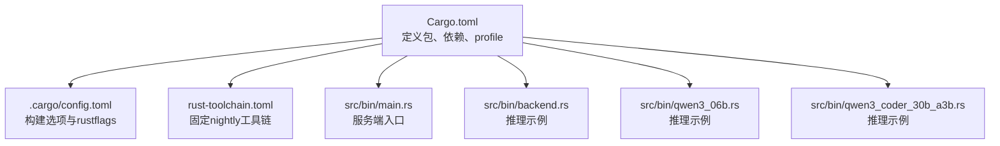
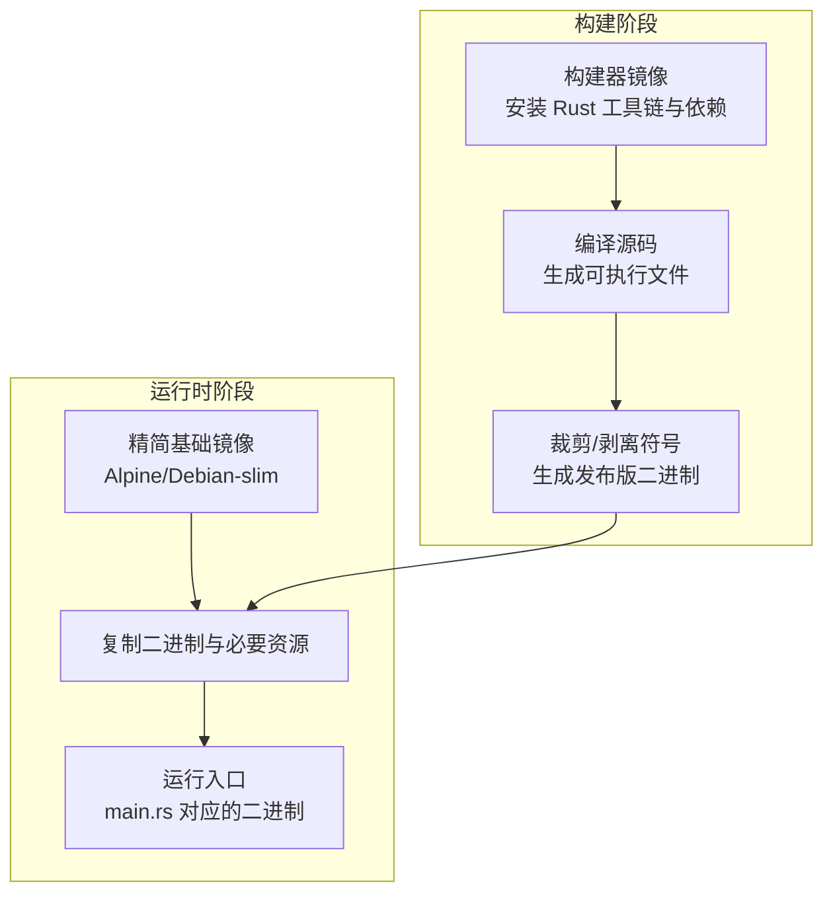
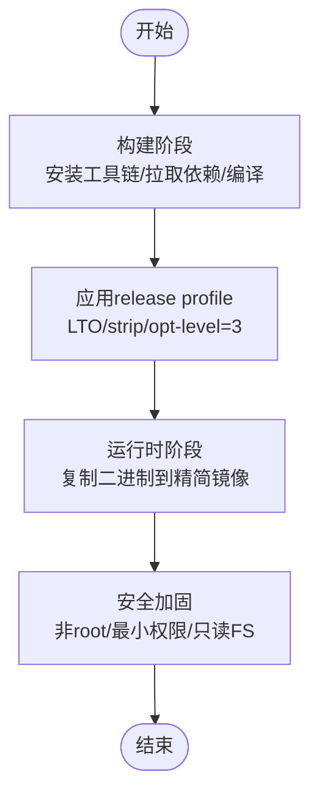
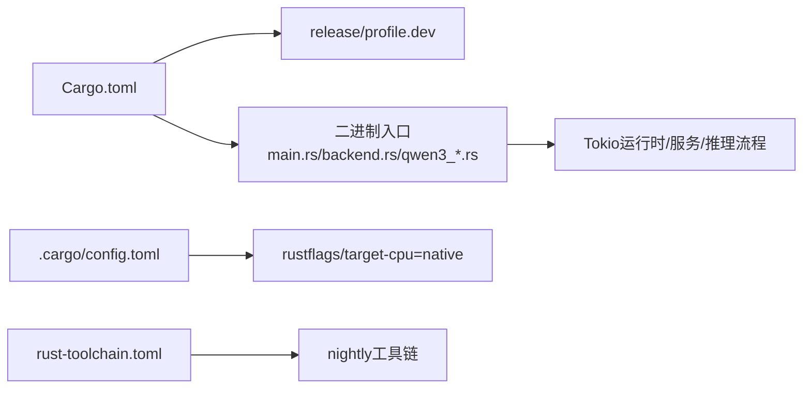

# Docker 镜像构建

<cite>
**本文引用的文件**   
- [Cargo.toml](file://Cargo.toml)
- [.cargo/config.toml](file://.cargo/config.toml)
- [rust-toolchain.toml](file://rust-toolchain.toml)
- [src/bin/main.rs](file://src/bin/main.rs)
- [src/bin/backend.rs](file://src/bin/backend.rs)
- [src/bin/qwen3_06b.rs](file://src/bin/qwen3_06b.rs)
- [src/bin/qwen3_coder_30b_a3b.rs](file://src/bin/qwen3_coder_30b_a3b.rs)
</cite>

## 目录
1. [简介](#简介)
2. [项目结构](#项目结构)
3. [核心组件](#核心组件)
4. [架构总览](#架构总览)
5. [详细组件分析](#详细组件分析)
6. [依赖分析](#依赖分析)
7. [性能考虑](#性能考虑)
8. [故障排查指南](#故障排查指南)
9. [结论](#结论)
10. [附录](#附录)

## 简介
本指南面向使用 Rust 编写的 eLLM 项目的 Docker 镜像构建，重点说明：
- 多阶段构建策略：将“Rust 编译阶段”与“运行时阶段”分离，以最小化最终镜像体积。
- 依赖缓存优化：利用 Cargo 依赖缓存与构建缓存，提升重复构建速度。
- 构建目标差异：release 与 debug 的镜像配置差异与适用场景。
- 基础镜像选择：基于 Alpine Linux 与 Debian 的对比分析与取舍。
- 链接模型选择：静态链接与动态链接在容器中的策略。
- 安全与合规：镜像签名与安全扫描最佳实践。
- 构建性能优化：并行构建、增量构建与缓存命中策略。

## 项目结构
仓库为 Rust 工程，包含多个二进制入口（如后端服务、推理示例等），并通过 Cargo profile 控制 release/debug 行为。关键构建相关位置：
- 包与依赖定义：[Cargo.toml](file://Cargo.toml)
- 全局构建选项与 rustflags：[.cargo/config.toml](file://.cargo/config.toml)
- 工具链版本锁定：[rust-toolchain.toml](file://rust-toolchain.toml)
- 主要二进制入口：
  - 服务端主程序：[src/bin/main.rs](file://src/bin/main.rs)
  - 推理示例/演示程序：[src/bin/backend.rs](file://src/bin/backend.rs)、[src/bin/qwen3_06b.rs](file://src/bin/qwen3_06b.rs)、[src/bin/qwen3_coder_30b_a3b.rs](file://src/bin/qwen3_coder_30b_a3b.rs)

**图表来源** 
- [Cargo.toml:1-102](file://Cargo.toml#L1-L102)
- [.cargo/config.toml:1-4](file://.cargo/config.toml#L1-L4)
- [rust-toolchain.toml:1-3](file://rust-toolchain.toml#L1-L3)
- [src/bin/main.rs:1-41](file://src/bin/main.rs#L1-L41)
- [src/bin/backend.rs:1-236](file://src/bin/backend.rs#L1-L236)
- [src/bin/qwen3_06b.rs:1-272](file://src/bin/qwen3_06b.rs#L1-L272)
- [src/bin/qwen3_coder_30b_a3b.rs:1-349](file://src/bin/qwen3_coder_30b_a3b.rs#L1-L349)

**章节来源**
- [Cargo.toml:1-102](file://Cargo.toml#L1-L102)
- [.cargo/config.toml:1-4](file://.cargo/config.toml#L1-L4)
- [rust-toolchain.toml:1-3](file://rust-toolchain.toml#L1-L3)
- [src/bin/main.rs:1-41](file://src/bin/main.rs#L1-L41)
- [src/bin/backend.rs:1-236](file://src/bin/backend.rs#L1-L236)
- [src/bin/qwen3_06b.rs:1-272](file://src/bin/qwen3_06b.rs#L1-L272)
- [src/bin/qwen3_coder_30b_a3b.rs:1-349](file://src/bin/qwen3_coder_30b_a3b.rs#L1-L349)

## 核心组件
- 构建配置与优化
  - release profile 启用 LTO、strip、禁用调试信息、关闭增量构建等，适合生产镜像；dev profile 开启增量构建与更多 codegen-units，适合本地开发。
  - 全局构建选项关闭增量构建并设置 target-cpu=native，利于获得本机最优指令集优化。
  - 工具链锁定 nightly，确保编译器特性稳定可用。
- 二进制入口
  - main.rs 作为服务启动入口，负责解析 CLI、初始化运行上下文、创建 Tokio 运行时并启动服务。
  - backend.rs、qwen3_06b.rs、qwen3_coder_30b_a3b.rs 提供推理流程示例，展示权重加载、批处理序列、调度器与执行池的使用方式。

**章节来源**
- [Cargo.toml:69-102](file://Cargo.toml#L69-L102)
- [.cargo/config.toml:1-4](file://.cargo/config.toml#L1-L4)
- [rust-toolchain.toml:1-3](file://rust-toolchain.toml#L1-L3)
- [src/bin/main.rs:1-41](file://src/bin/main.rs#L1-L41)
- [src/bin/backend.rs:1-236](file://src/bin/backend.rs#L1-L236)
- [src/bin/qwen3_06b.rs:1-272](file://src/bin/qwen3_06b.rs#L1-L272)
- [src/bin/qwen3_coder_30b_a3b.rs:1-349](file://src/bin/qwen3_coder_30b_a3b.rs#L1-L349)

## 架构总览
下图展示了多阶段构建的总体思路：第一阶段使用完整工具链进行编译与优化，第二阶段仅拷贝产物到精简运行时镜像中，从而显著减小镜像体积。

[此图为概念性架构图，无需列出图表来源]

## 详细组件分析

### 多阶段构建策略与最小化镜像
- 构建阶段
  - 使用官方 Rust 镜像或带 cargo-cache 的自定义构建镜像，安装 nightly 工具链。
  - 通过 Cargo 的 profile.release 完成 LTO、strip、opt-level=3 等优化。
  - 使用 .cargo/config.toml 的 rustflags 指定 target-cpu=native，以获得本机 CPU 指令集优化。
- 运行时阶段
  - 选择 Alpine Linux 或 Debian slim 作为基础镜像。
  - 仅复制已构建的二进制与必要的运行时库（若采用动态链接）或完全静态链接的可执行文件。
  - 设置非 root 用户、只读根文件系统、最小暴露端口等安全基线。

[此图为概念性流程图，无需列出图表来源]

### 依赖缓存优化技巧
- Cargo 依赖缓存
  - 在构建阶段挂载 cargo registry 与 git 索引缓存卷，避免重复下载。
  - 先复制 Cargo.lock/Cargo.toml 并执行一次空构建，使依赖层被缓存，后续变更源码时仍命中依赖缓存。
- 构建缓存
  - 使用 buildx cache 或 CI 缓存机制保存 target 目录，加速增量构建。
  - 注意：由于 .cargo/config.toml 中 incremental=false，建议仅在本地开发开启增量构建，CI 构建保持关闭以获得更稳定的结果。

**章节来源**
- [Cargo.toml:69-102](file://Cargo.toml#L69-L102)
- [.cargo/config.toml:1-4](file://.cargo/config.toml#L1-L4)

### 不同构建目标（release/debug）的镜像配置差异
- release
  - 启用 LTO、strip、opt-level=3、panic=abort、rpath=false、incremental=false，适合生产镜像，体积更小、性能更高。
- debug
  - opt-level=1、lto=off、codegen-units=16、incremental=true，适合本地开发与快速迭代，不建议用于生产镜像。

**章节来源**
- [Cargo.toml:69-102](file://Cargo.toml#L69-L102)

### 基础镜像对比：Alpine Linux vs Debian
- Alpine Linux
  - 优点：镜像体积极小，适合追求极致体积的场景。
  - 缺点：默认使用 musl libc，若需动态链接第三方库可能遇到兼容性问题；推荐优先使用静态链接。
- Debian (slim)
  - 优点：glibc 生态完善，动态链接兼容性更好；社区支持广泛。
  - 缺点：镜像体积相对较大。
- 选择建议
  - 若二进制为静态链接且无额外系统依赖，优先 Alpine。
  - 若需要 glibc 生态或动态链接特定库，选择 Debian slim。

[本节为通用指导，不直接分析具体文件，故不列出章节来源]

### 静态链接与动态链接的选择策略
- 静态链接
  - 优点：运行时零依赖，跨环境一致性好，镜像体积小且可移植性强。
  - 缺点：无法复用宿主系统更新的安全补丁；二进制体积略大。
- 动态链接
  - 优点：可与宿主系统共享库，便于利用系统级安全更新。
  - 缺点：对基础镜像的库版本有要求，迁移成本较高。
- 建议
  - 生产镜像优先静态链接，结合安全扫描与签名保障供应链安全。
  - 若必须动态链接，选择 Debian slim 并确保基础镜像受控与定期更新。

[本节为通用指导，不直接分析具体文件，故不列出章节来源]

### 镜像签名与安全扫描最佳实践
- 镜像签名
  - 使用 cosign 对镜像进行签名，并在运行时校验签名，防止篡改。
  - 在 CI 流水线中集成签名步骤，确保只有受信任的工件被发布。
- 安全扫描
  - 使用 Trivy、Grype 等工具扫描基础镜像与应用依赖漏洞。
  - 将扫描结果纳入质量门禁，阻断高危漏洞的镜像发布。
- 供应链安全
  - 锁定基础镜像与工具链版本（例如 rust-toolchain.toml）。
  - 使用白名单镜像源与私有仓库，减少外部不可信依赖风险。

[本节为通用指导，不直接分析具体文件，故不列出章节来源]

### 构建性能优化与并行构建配置
- 并行构建
  - 使用 --jobs=N 或环境变量 CARGO_BUILD_JOBS 控制并发任务数，结合 CI 节点 CPU 核数调优。
- 增量构建
  - 本地开发可开启增量构建以提升速度；CI 构建建议关闭以避免不稳定因素。
- 缓存策略
  - 缓存 cargo registry、git 索引与 target 目录，最大化缓存命中率。
  - 分层构建：先构建依赖层，再构建源码层，提高缓存复用率。

**章节来源**
- [Cargo.toml:69-102](file://Cargo.toml#L69-L102)
- [.cargo/config.toml:1-4](file://.cargo/config.toml#L1-L4)

## 依赖分析
下图展示了构建相关文件的依赖关系与职责划分。

**图表来源**
- [Cargo.toml:1-102](file://Cargo.toml#L1-L102)
- [.cargo/config.toml:1-4](file://.cargo/config.toml#L1-L4)
- [rust-toolchain.toml:1-3](file://rust-toolchain.toml#L1-L3)
- [src/bin/main.rs:1-41](file://src/bin/main.rs#L1-L41)
- [src/bin/backend.rs:1-236](file://src/bin/backend.rs#L1-L236)
- [src/bin/qwen3_06b.rs:1-272](file://src/bin/qwen3_06b.rs#L1-L272)
- [src/bin/qwen3_coder_30b_a3b.rs:1-349](file://src/bin/qwen3_coder_30b_a3b.rs#L1-L349)

**章节来源**
- [Cargo.toml:1-102](file://Cargo.toml#L1-L102)
- [.cargo/config.toml:1-4](file://.cargo/config.toml#L1-L4)
- [rust-toolchain.toml:1-3](file://rust-toolchain.toml#L1-L3)
- [src/bin/main.rs:1-41](file://src/bin/main.rs#L1-L41)
- [src/bin/backend.rs:1-236](file://src/bin/backend.rs#L1-L236)
- [src/bin/qwen3_06b.rs:1-272](file://src/bin/qwen3_06b.rs#L1-L272)
- [src/bin/qwen3_coder_30b_a3b.rs:1-349](file://src/bin/qwen3_coder_30b_a3b.rs#L1-L349)

## 性能考虑
- 编译期优化
  - release profile 的 LTO、strip、opt-level=3 显著提升运行性能并减小体积。
  - target-cpu=native 针对本机 CPU 指令集优化，但需注意跨平台可移植性。
- 运行时优化
  - 合理设置线程数与批大小，避免过度竞争与上下文切换开销。
  - 使用只读文件系统与非 root 用户，降低运行时攻击面。
- 构建期优化
  - 并行构建与缓存命中是缩短构建时间的关键。
  - 在 CI 中固化缓存键，避免缓存污染。

[本节为通用指导，不直接分析具体文件，故不列出章节来源]

## 故障排查指南
- 构建失败
  - 检查工具链版本是否匹配 rust-toolchain.toml。
  - 确认 .cargo/config.toml 的 rustflags 与目标平台兼容性。
  - 若出现链接错误，评估是否需要调整静态/动态链接策略。
- 运行时异常
  - 若使用动态链接，确认基础镜像包含所需库版本。
  - 若使用静态链接，验证 musl/glibc 兼容性。
- 性能问题
  - 核对 release profile 是否启用 LTO 与 strip。
  - 检查线程数与批大小是否与硬件资源匹配。

**章节来源**
- [rust-toolchain.toml:1-3](file://rust-toolchain.toml#L1-L3)
- [.cargo/config.toml:1-4](file://.cargo/config.toml#L1-L4)
- [Cargo.toml:69-102](file://Cargo.toml#L69-L102)

## 结论
通过多阶段构建、严格的 release profile 优化、合理的缓存策略与基础镜像选择，可以显著降低 eLLM 的 Docker 镜像体积并提升构建与运行性能。在生产环境中，建议优先采用静态链接与 Alpine 基础镜像，并结合镜像签名与安全扫描，形成完整的供应链安全保障体系。

[本节为总结性内容，不直接分析具体文件，故不列出章节来源]

## 附录
- 参考入口文件路径
  - 服务端入口：[src/bin/main.rs](file://src/bin/main.rs)
  - 推理示例：[src/bin/backend.rs](file://src/bin/backend.rs)、[src/bin/qwen3_06b.rs](file://src/bin/qwen3_06b.rs)、[src/bin/qwen3_coder_30b_a3b.rs](file://src/bin/qwen3_coder_30b_a3b.rs)
- 构建配置文件路径
  - 包与依赖：[Cargo.toml](file://Cargo.toml)
  - 构建选项：[.cargo/config.toml](file://.cargo/config.toml)
  - 工具链锁定：[rust-toolchain.toml](file://rust-toolchain.toml)

[本节为导航性内容，不直接分析具体文件，故不列出章节来源]