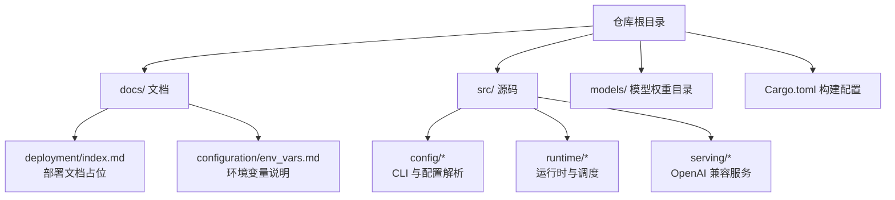
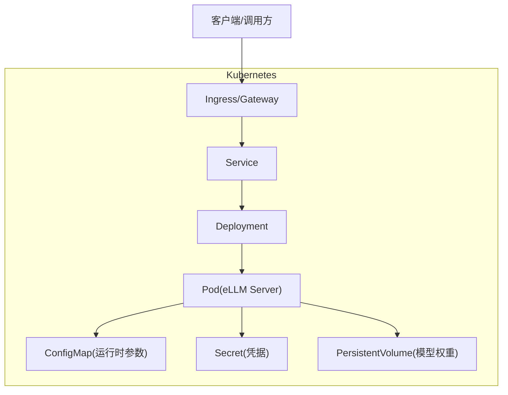

# Helm Chart 管理

<cite>
**本文引用的文件**   
- [README.md](file://README.md)
- [安装文档（installation.md）](file://docs/getting_started/installation.md)
- [环境变量配置（env_vars.md）](file://docs/configuration/env_vars.md)
- [部署总览（deployment/index.md）](file://docs/deployment/index.md)
- [命令行接口定义（command_line_interface.rs）](file://src/config/command_line_interface.rs)
- [HuggingFace 配置结构（huggingface_config.rs）](file://src/config/huggingface_config.rs)
</cite>

## 目录
1. [简介](#简介)
2. [项目结构与定位](#项目结构与定位)
3. [核心组件与配置入口](#核心组件与配置入口)
4. [架构总览](#架构总览)
5. [详细组件分析](#详细组件分析)
6. [依赖分析与集成点](#依赖分析与集成点)
7. [性能与资源规划建议](#性能与资源规划建议)
8. [故障排查指南](#故障排查指南)
9. [结论](#结论)
10. [附录：Helm Chart 落地方案与最佳实践](#附录helm-chart-落地方案与最佳实践)

## 简介
本指南面向需要在 Kubernetes 上以 Helm Chart 形式交付 eLLM 推理服务的团队，提供从 Chart 目录结构、必需文件（Chart.yaml、values.yaml）、模板语法与环境覆盖、版本管理与发布流程，到安全与权限控制、仓库搭建与测试验证的完整实践。eLLM 是一个纯 CPU 推理框架，通过静态计算图、固定形状 KV 缓存与逐头注意力执行策略，在长上下文场景下具备显著优势。

## 项目结构与定位
当前仓库未包含现成的 Helm Chart 或 Kubernetes 清单。部署相关文档位于 docs/deployment/index.md，且该页面为占位说明，表明“环境特定指南将从更广泛的 serving 和 configuration 页面拆分出来”。因此，本指南将基于现有源码与文档，给出可直接落地的 Helm Chart 设计与实现建议。

图表来源
- [部署总览（deployment/index.md）:1-10](file://docs/deployment/index.md#L1-L10)
- [环境变量配置（env_vars.md）](file://docs/configuration/env_vars.md)
- [命令行接口定义（command_line_interface.rs）](file://src/config/command_line_interface.rs)
- [HuggingFace 配置结构（huggingface_config.rs）](file://src/config/huggingface_config.rs)

章节来源
- [部署总览（deployment/index.md）:1-10](file://docs/deployment/index.md#L1-L10)

## 核心组件与配置入口
- 二进制入口与 CLI 参数
  - main.rs 与 backend.rs 等二进制目标由 Cargo.toml 声明，启动时通过 CLI 参数加载模型、端口、批大小、序列长度等运行参数。
- 配置文件与 vLLM 兼容结构
  - 支持通过外部配置文件（如 VllmConfigFile）注入 model/scheduler/engine/server 等分组参数，便于与现有生态对接。
- HuggingFace 模型配置
  - huggingface_config.rs 定义了模型侧的结构化字段（如 attention heads、layers、rope、sliding window 等），用于加载与校验模型元数据。
- 环境变量
  - 安装文档指出所有运行时参数可通过环境变量控制，详见 env_vars.md。

章节来源
- [命令行接口定义（command_line_interface.rs）:228-275](file://src/config/command_line_interface.rs#L228-L275)
- [HuggingFace 配置结构（huggingface_config.rs）:38-77](file://src/config/huggingface_config.rs#L38-L77)
- [安装文档（installation.md）:59-83](file://docs/getting_started/installation.md#L59-L83)

## 架构总览
下图展示了 eLLM 在 Kubernetes 上的典型部署形态：Ingress/Gateway 暴露 OpenAI 兼容 API，Service 转发至 Deployment 中的 Pod，Pod 内运行 eLLM 服务进程，挂载持久卷承载模型权重，并通过 ConfigMap/Secret 注入配置与密钥。

[此图为概念性架构图，不直接映射具体源码文件]

## 详细组件分析

### 组件一：CLI 与配置解析（Helm values 映射的关键）
- 作用
  - 解析命令行参数与配置文件，决定模型路径、分词器模式、调度器与引擎参数、服务端监听端口等。
- 关键要点
  - 支持通过 --config 指定配置文件路径；配置文件采用 vLLM 兼容结构，便于复用既有配置。
  - 部分参数存在默认值（例如 slot reuse timeout），可在 Helm values 中统一覆盖。
- 设计建议
  - 将 CLI 参数与配置文件项一一映射到 values.yaml 的键空间，确保每个可配置项都有明确的环境变量或 CLI 对应关系。

章节来源
- [命令行接口定义（command_line_interface.rs）:228-275](file://src/config/command_line_interface.rs#L228-L275)

### 组件二：HuggingFace 配置结构（模型元数据）
- 作用
  - 描述模型的注意力头数、层数、RoPE 缩放、滑动窗口、是否使用缓存等元信息，供运行时初始化与校验。
- 关键要点
  - 大量字段带有默认值或可选类型，利于在不同模型间平滑适配。
- 设计建议
  - 在 values.yaml 中暴露必要的模型元数据开关（如 use_cache、use_sliding_window、num_attention_heads 等），以便按需裁剪能力。

章节来源
- [HuggingFace 配置结构（huggingface_config.rs）:38-77](file://src/config/huggingface_config.rs#L38-L77)

### 组件三：环境变量驱动的配置体系
- 作用
  - 安装文档明确指出“所有运行时参数均通过环境变量控制”，这是 Helm Chart 中 values 渲染为容器 env 的核心依据。
- 关键要点
  - 常见参数包括批大小、序列长度、chunk 大小、调度超时等。
- 设计建议
  - 在 values.yaml 中按模块组织环境变量（如 runtime.batch_size、runtime.sequence_length），并在模板中生成对应的 env 列表。

章节来源
- [安装文档（installation.md）:59-83](file://docs/getting_started/installation.md#L59-L83)

## 依赖分析与集成点
- 外部依赖
  - 模型权重：需放置于 models/<model-name>/ 目录下，至少包含 config.json、generation_config.json、model.safetensors，以及 tokenizer.json（服务路径需要）。
- 内部依赖
  - 二进制入口由 Cargo.toml 声明，main.rs/backend.rs 作为服务进程入口。
  - 配置解析依赖 CLI 与配置文件结构。
- 集成点
  - OpenAI 兼容 API：serving 模块提供兼容接口，便于与现有生态（如 LangChain、vLLM 客户端）无缝对接。

章节来源
- [安装文档（installation.md）:34-56](file://docs/getting_started/installation.md#L34-L56)
- [命令行接口定义（command_line_interface.rs）:228-275](file://src/config/command_line_interface.rs#L228-L275)

## 性能与资源规划建议
- 内存与存储
  - 服务器级 CPU 通常具备更大主存，适合超长上下文一次性 Prefill；建议使用持久卷存放模型权重，避免每次重建镜像拉取带来的延迟。
- 计算与并发
  - 通过调整批大小、序列长度、chunk 大小与调度超时等参数，平衡首 token 延迟与吞吐。
- 缓存与局部性
  - 固定形状 KV 缓存与逐头注意力执行策略有助于提升缓存命中率与访问连续性，建议在 values 中显式开启 use_cache 并合理设置 sequence_length。

[本节为通用指导，不直接分析具体文件]

## 故障排查指南
- 常见问题
  - 模型路径错误：确认持久卷挂载路径与容器内模型目录一致。
  - 环境变量缺失：对照 env_vars.md 检查必要变量是否注入。
  - 端口冲突：确认 Service/ContainerPort 与 Ingress 路由一致。
- 日志与诊断
  - 通过 kubectl logs 查看 Pod 输出；结合 CLI 参数增加调试级别（若支持）。
- 回滚与升级
  - 使用 Helm 历史版本进行回滚；变更 values 后执行升级并观察滚动更新状态。

[本节为通用指导，不直接分析具体文件]

## 结论
尽管当前仓库尚未提供现成的 Helm Chart，但 eLLM 的配置入口清晰（CLI + 配置文件 + 环境变量），非常适合以 Helm Chart 的形式进行标准化交付。通过将 values.yaml 与模板严格映射到 CLI 与 env，可实现多环境覆盖、版本化管理与安全加固的一体化部署。

[本节为总结性内容，不直接分析具体文件]

## 附录：Helm Chart 落地方案与最佳实践

### 1. Chart 目录结构与必需文件
- 推荐目录
  - Chart.yaml：Chart 元信息（名称、版本、应用版本、描述、维护者等）。
  - values.yaml：默认值集合，按模块组织（如 runtime、server、model、resources、security）。
  - templates/：Kubernetes 资源模板（Deployment、Service、ConfigMap、Secret、PVC、Ingress 等）。
  - charts/：子 Chart 目录（可选，用于依赖第三方组件）。
  - tests/：Helm test 用例（可选）。
- 必需文件
  - Chart.yaml、values.yaml 为最小可用集。

[本节为通用指导，不直接分析具体文件]

### 2. 自定义 values 与环境覆盖
- 分层策略
  - base/values.yaml：基础默认值。
  - values-dev.yaml、values-staging.yaml、values-prod.yaml：环境覆盖。
  - 使用 helm install/upgrade 的 --values 或 --set 进行叠加。
- 示例键空间（示意）
  - runtime.batch_size、runtime.sequence_length、runtime.chunk_size、runtime.schedule_timeout_ms
  - server.port、server.host
  - model.path、model.tokenizer_path
  - resources.requests/limits、affinity、tolerations、nodeSelector
  - security.runAsUser、fsGroup、readOnlyRootFilesystem、seccompProfile

[本节为通用指导，不直接分析具体文件]

### 3. 模板语法与条件渲染
- 常用语法
  - if/else、range、with、include、define、tpl、required、default。
- 条件渲染示例思路
  - 根据 environment 选择不同 values 文件。
  - 根据 feature flags 启用/禁用某些资源（如 Ingress、HPA、PDB）。
  - 根据平台特性（如 ARM/x86_64）切换镜像或参数。
- 安全与敏感信息
  - 使用 Secret 管理敏感配置，模板中通过 .Values.secrets 引用。

[本节为通用指导，不直接分析具体文件]

### 4. 版本管理与发布流程
- 版本规范
  - Chart 版本遵循语义化版本；应用版本与镜像 tag 保持一致。
- 分支与标签
  - 主干开发，发布打 tag；CI 自动构建镜像并推送至镜像仓库。
- 发布步骤
  - 更新 Chart.yaml 版本与 appVersion。
  - 更新 values 与模板变更。
  - 本地 lint/test 通过后提交 PR，合并后触发 CI 打包并发布至 Chart 仓库。

[本节为通用指导，不直接分析具体文件]

### 5. 预置值与环境特定配置示例（示意）
- 开发环境
  - 较小 batch_size、较短 sequence_length、关闭只读根文件系统以便调试。
- 生产环境
  - 较大资源限制、启用 PDB/HPA、只读根文件系统、非 root 用户运行、网络策略与 RBAC 收紧。

[本节为通用指导，不直接分析具体文件]

### 6. 依赖管理与子 Chart
- 何时使用子 Chart
  - 引入数据库、消息队列、监控栈等公共组件。
- 依赖声明
  - 在 Chart.yaml 的 dependencies 中声明子 Chart 及版本约束。
- 隔离与复用
  - 通过 values 命名空间隔离不同环境的子 Chart 配置。

[本节为通用指导，不直接分析具体文件]

### 7. Chart 测试与验证最佳实践
- 单元测试
  - 使用 helm template 与 helm diff 进行变更对比。
- 集成测试
  - 使用 helm test 编写端到端用例（如发送请求并校验响应）。
- 静态检查
  - kubeval/kubeconform 校验 YAML 合法性；kube-score 评估资源质量。

[本节为通用指导，不直接分析具体文件]

### 8. 安全配置与权限控制
- 容器安全
  - runAsNonRoot、readOnlyRootFilesystem、allowPrivilegeEscalation=false、seccompProfile。
- 资源配额
  - requests/limits 合理设置，避免资源争用。
- 网络与存储
  - NetworkPolicy 限制入出流量；PVC 使用合适的 StorageClass 与快照策略。
- 身份与密钥
  - 使用 Secret 管理密钥；必要时集成外部密钥管理服务。

[本节为通用指导，不直接分析具体文件]

### 9. Chart 仓库搭建与管理方案
- 仓库类型
  - OCI 仓库（推荐）或 HTTP 仓库（Nginx/Harbor）。
- 工具链
  - helm package、helm push、helm repo add/update/search。
- 访问控制
  - 仓库鉴权、RBAC 与审计；制品签名与校验。
- 自动化
  - CI 流水线完成打包、签名、推送与索引更新。

[本节为通用指导，不直接分析具体文件]

### 10. 与 eLLM 配置的映射建议（实操指引）
- 将 values.yaml 的键映射到：
  - CLI 参数（--model、--port、--batch-size 等）
  - 配置文件字段（VllmConfigFile 下的 model/scheduler/engine/server）
  - 环境变量（参考 env_vars.md）
- 模板渲染顺序
  - values -> 模板 -> 生成的 YAML -> kubectl apply/helm upgrade
- 回滚策略
  - 保留历史 values 与镜像 tag，确保一键回滚。

章节来源
- [命令行接口定义（command_line_interface.rs）:228-275](file://src/config/command_line_interface.rs#L228-L275)
- [环境变量配置（env_vars.md）](file://docs/configuration/env_vars.md)