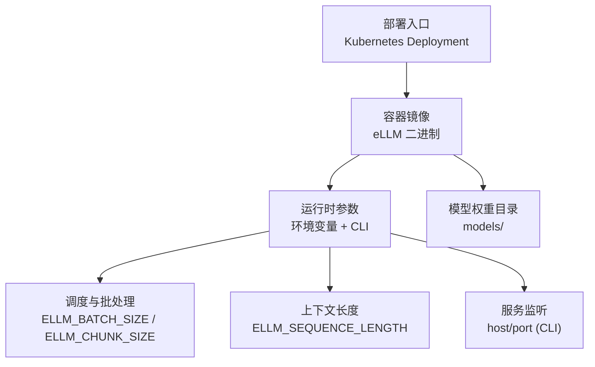
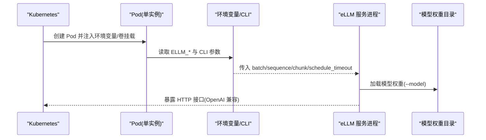
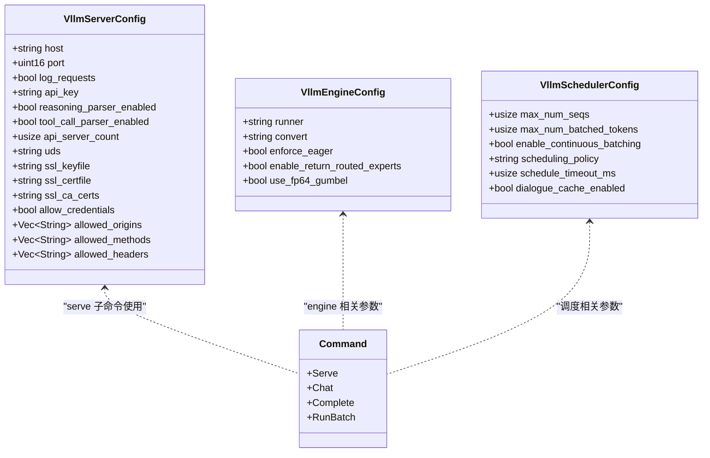
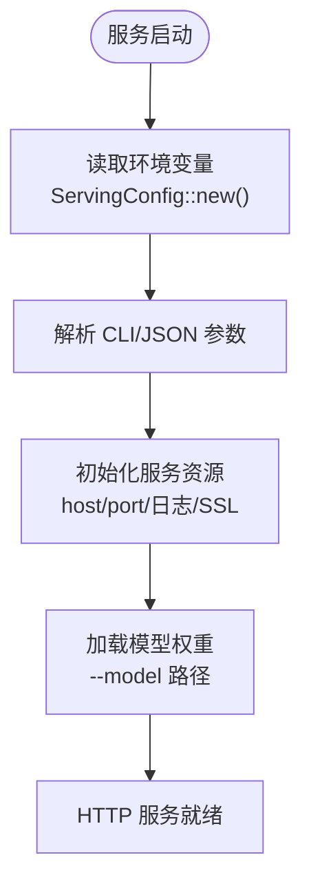

# Deployment 资源配置

<cite>
**本文引用的文件**   
- [README.md](file://README.md)
- [README.zh-CN.md](file://README.zh-CN.md)
- [docs/configuration/env_vars.md](file://docs/configuration/env_vars.md)
- [docs/configuration/optimization.md](file://docs/configuration/optimization.md)
- [docs/getting_started/installation.md](file://docs/getting_started/installation.md)
- [docs/cli/index.md](file://docs/cli/index.md)
- [src/config/command_line_interface.rs](file://src/config/command_line_interface.rs)
- [src/config/config_types.rs](file://src/config/config_types.rs)
</cite>

## 目录
1. [简介](#简介)
2. [项目结构](#项目结构)
3. [核心组件](#核心组件)
4. [架构总览](#架构总览)
5. [详细组件分析](#详细组件分析)
6. [依赖分析](#依赖分析)
7. [性能考虑](#性能考虑)
8. [故障排查指南](#故障排查指南)
9. [结论](#结论)
10. [附录](#附录)

## 简介
本文件面向在 Kubernetes 中部署 eLLM 推理服务的工程师，聚焦于 Deployment 资源配置与 LLM 推理工作负载的优化实践。eLLM 是纯 CPU 推理引擎，强调“以存换算”的设计：通过静态形状 KV Cache、整段 Prefill、逐 head 计算等策略，降低调度与内存访问开销，提升长上下文场景下的端到端延迟表现。

由于仓库未提供现成的 Kubernetes YAML 模板，本文基于仓库中的环境变量、CLI 参数与运行说明，给出可直接落地的 Deployment 配置要点、字段说明、不同环境的推荐值以及排障与调优建议。

## 项目结构
与部署相关的信息主要分布在以下位置：
- 环境变量与调度优化文档：docs/configuration/env_vars.md、docs/configuration/optimization.md
- 安装与环境变量快速示例：docs/getting_started/installation.md
- CLI 参考（兼容 vLLM 风格）：docs/cli/index.md
- 源码中的命令行与配置类型定义：src/config/command_line_interface.rs、src/config/config_types.rs

[此图为概念性结构图，不直接映射具体源码文件]

**章节来源**
- [docs/configuration/env_vars.md:1-45](file://docs/configuration/env_vars.md#L1-L45)
- [docs/configuration/optimization.md:1-100](file://docs/configuration/optimization.md#L1-L100)
- [docs/getting_started/installation.md:59-83](file://docs/getting_started/installation.md#L59-L83)
- [docs/cli/index.md:1-68](file://docs/cli/index.md#L1-L68)

## 核心组件
- 运行时参数读取：所有运行时参数通过环境变量注入，由 ServingConfig::new() 读取；当值为 0 时回退到内置默认值。
- 关键可调参数：
  - ELLM_BATCH_SIZE：最大并发请求数（batch slots）
  - ELLM_SEQUENCE_LENGTH：每个 slot 的最大 token 序列长度，内存线性增长
  - ELLM_CHUNK_SIZE：每轮 prefill 最大处理的 token 数，也作为调度阈值
  - ELLM_SCHEDULE_TIMEOUT_MS：触发调度的超时窗口（毫秒）
- 线程池：worker 线程数自动根据 CPU 核数计算，async 线程固定为 2。
- 模型路径：通常通过 CLI 参数 --model 指定。

这些参数直接影响 Deployment 的资源需求（CPU/内存）、副本数与滚动更新策略的选择。

**章节来源**
- [docs/configuration/env_vars.md:1-45](file://docs/configuration/env_vars.md#L1-L45)
- [docs/configuration/optimization.md:14-36](file://docs/configuration/optimization.md#L14-L36)
- [docs/getting_started/installation.md:59-83](file://docs/getting_started/installation.md#L59-L83)
- [src/config/config_types.rs:367-422](file://src/config/config_types.rs#L367-L422)

## 架构总览
下图展示从 Kubernetes 到 eLLM 服务的关键调用链与数据流，帮助理解 Deployment 各字段如何影响运行时行为。

[此图为概念性流程图，不直接映射具体源码文件]

## 详细组件分析

### Deployment 关键字段与配置原则
- replicas（副本数）
  - 依据 ELLM_BATCH_SIZE 与单机吞吐能力决定。eLLM 单实例并发度较低但端到端延迟更稳定，适合先按单机容量评估再水平扩展。
- strategy（滚动更新策略）
  - 推荐使用 RollingUpdate，设置 maxUnavailable=0、maxSurge=1，保证零停机升级。
- resources（资源限制）
  - CPU requests/limits：结合 worker 线程自动计算逻辑与 CPU 核数设定。建议将 requests 设置为实际可用核数，limits 略高于 requests 以容纳突发。
  - memory requests/limits：受 ELLM_SEQUENCE_LENGTH 线性影响，需按最大上下文长度估算 KV Cache 与中间张量占用，预留安全余量。
- env（环境变量注入）
  - 通过 ConfigMap/Secret 注入 ELLM_BATCH_SIZE、ELLM_SEQUENCE_LENGTH、ELLM_CHUNK_SIZE、ELLM_SCHEDULE_TIMEOUT_MS 等。
- volumeMounts（卷挂载）
  - 将模型权重目录挂载至容器内约定路径，并通过 --model 指向该路径。
- selector.matchLabels（标签选择器）
  - 用于 Service/HPA 关联与灰度发布，建议包含 app、version、env 等维度。

上述字段的具体取值与调优建议见下节“不同规模环境配置模板”。

**章节来源**
- [docs/configuration/env_vars.md:1-45](file://docs/configuration/env_vars.md#L1-L45)
- [docs/configuration/optimization.md:14-36](file://docs/configuration/optimization.md#L14-L36)
- [docs/getting_started/installation.md:59-83](file://docs/getting_started/installation.md#L59-L83)
- [docs/cli/index.md:1-68](file://docs/cli/index.md#L1-L68)

### CPU 与内存请求/限制的设置原则（针对 LLM 推理）
- CPU
  - worker 线程数 = max(total_cpus - async_threads, 1)，async_threads=2。建议 CPU requests 至少等于 worker 线程数，limits 可略高以应对短时峰值。
- 内存
  - 内存随 ELLM_SEQUENCE_LENGTH 线性增长，需按最大上下文长度预估 KV Cache 与中间张量占用，并保留一定冗余。
- 长上下文优化
  - 增大 ELLM_SEQUENCE_LENGTH 支持更长上下文，但需同步提高 memory limits。
- 低延迟 vs 高吞吐
  - 低延迟：减小 ELLM_CHUNK_SIZE，缩短每轮 prefill 的 token 数量，提升响应速度。
  - 高吞吐：增大 ELLM_CHUNK_SIZE 与 ELLM_BATCH_SIZE，提升批处理效率。

**章节来源**
- [docs/configuration/env_vars.md:1-45](file://docs/configuration/env_vars.md#L1-L45)
- [docs/configuration/optimization.md:14-36](file://docs/configuration/optimization.md#L14-L36)

### 环境变量注入方法
- 通过 ConfigMap 集中管理 ELLM_* 环境变量，便于多环境复用与版本化。
- 敏感信息（如 API Key）通过 Secret 注入。
- 启动命令中使用 --model 指定模型路径，或通过 JSON 参数传递（兼容 vLLM 风格）。

**章节来源**
- [docs/getting_started/installation.md:59-83](file://docs/getting_started/installation.md#L59-L83)
- [docs/cli/index.md:1-68](file://docs/cli/index.md#L1-L68)

### 卷挂载与模型路径
- 将模型权重目录以只读方式挂载到容器内，例如 /models/<model-name>。
- 通过 CLI 参数 --model 指向该目录，确保服务启动即可加载权重。

**章节来源**
- [docs/getting_started/installation.md:34-56](file://docs/getting_started/installation.md#L34-L56)
- [docs/getting_started/installation.md:75-83](file://docs/getting_started/installation.md#L75-L83)

### 标签选择器与服务发现
- 在 Deployment.metadata.labels 与 spec.selector.matchLabels 中统一标签，便于 Service 与 HPA 精准定位。
- 建议标签维度：app、version、env、component。

[本节为通用 Kubernetes 实践，不直接分析具体源码文件]

### 不同规模环境配置模板（Deployment 要点）
以下为各环境的典型配置思路与推荐范围，具体数值需结合实际模型大小与硬件规格调整。

- 开发环境
  - replicas: 1
  - CPU requests/limits: 2/4
  - memory requests/limits: 4Gi/8Gi
  - ELLM_BATCH_SIZE: 1–3
  - ELLM_SEQUENCE_LENGTH: 128–512
  - ELLM_CHUNK_SIZE: 32–128
  - ELLM_SCHEDULE_TIMEOUT_MS: 10–20
  - strategy: RollingUpdate(maxSurge=1, maxUnavailable=0)
- 测试环境
  - replicas: 2–3
  - CPU requests/limits: 4/8
  - memory requests/limits: 8Gi/16Gi
  - ELLM_BATCH_SIZE: 3–8
  - ELLM_SEQUENCE_LENGTH: 256–1024
  - ELLM_CHUNK_SIZE: 64–256
  - ELLM_SCHEDULE_TIMEOUT_MS: 10–15
  - strategy: RollingUpdate(maxSurge=1, maxUnavailable=0)
- 生产环境
  - replicas: 按需 HPA 扩缩容（基于 QPS/CPU 利用率）
  - CPU requests/limits: 8+/16+
  - memory requests/limits: 16Gi+/32Gi+
  - ELLM_BATCH_SIZE: 8–32（结合单机吞吐与延迟目标）
  - ELLM_SEQUENCE_LENGTH: 1024–4096（按业务最大上下文）
  - ELLM_CHUNK_SIZE: 128–1024（吞吐优先）或 32–128（延迟优先）
  - ELLM_SCHEDULE_TIMEOUT_MS: 5–10（低流量波动保障）
  - strategy: RollingUpdate(maxSurge=1, maxUnavailable=0)

以上参数范围与调优策略来源于仓库的环境变量与优化文档。

**章节来源**
- [docs/configuration/env_vars.md:1-45](file://docs/configuration/env_vars.md#L1-L45)
- [docs/configuration/optimization.md:14-36](file://docs/configuration/optimization.md#L14-L36)

### 源码级配置项与兼容性
- CLI 与配置文件均支持 vLLM 风格的键名与别名，便于迁移与兼容。
- 服务端配置包含 host/port、日志开关、API Key、SSL 证书等选项，可通过 CLI 或 JSON 参数注入。

**图表来源**
- [src/config/command_line_interface.rs:336-366](file://src/config/command_line_interface.rs#L336-L366)
- [src/config/command_line_interface.rs:323-335](file://src/config/command_line_interface.rs#L323-L335)
- [src/config/command_line_interface.rs:306-322](file://src/config/command_line_interface.rs#L306-L322)
- [src/config/config_types.rs:389-391](file://src/config/config_types.rs#L389-L391)

**章节来源**
- [src/config/command_line_interface.rs:93-127](file://src/config/command_line_interface.rs#L93-L127)
- [src/config/command_line_interface.rs:273-304](file://src/config/command_line_interface.rs#L273-L304)
- [src/config/command_line_interface.rs:336-366](file://src/config/command_line_interface.rs#L336-L366)
- [src/config/config_types.rs:367-422](file://src/config/config_types.rs#L367-L422)

## 依赖分析
- 外部依赖
  - 模型权重目录：HuggingFace 兼容格式，至少包含 config.json、generation_config.json、model.safetensors，tokenizer.json 用于 serving 路径。
- 内部依赖
  - 环境变量 -> ServingConfig -> 调度与执行器初始化
  - CLI 参数 -> 兼容 vLLM 的配置解析 -> 覆盖默认值

**图表来源**
- [docs/configuration/env_vars.md:1-6](file://docs/configuration/env_vars.md#L1-L6)
- [docs/getting_started/installation.md:34-56](file://docs/getting_started/installation.md#L34-L56)
- [docs/getting_started/installation.md:75-83](file://docs/getting_started/installation.md#L75-L83)

**章节来源**
- [docs/configuration/env_vars.md:1-45](file://docs/configuration/env_vars.md#L1-L45)
- [docs/getting_started/installation.md:34-56](file://docs/getting_started/installation.md#L34-L56)
- [docs/getting_started/installation.md:75-83](file://docs/getting_started/installation.md#L75-L83)

## 性能考虑
- 长上下文优化
  - 增大 ELLM_SEQUENCE_LENGTH 以支持超长 Prompt，注意内存线性增长。
  - 整段 Prefill 可减少重复载入与调度点，显著降低首 token 延迟。
- 吞吐与延迟权衡
  - 低延迟：减小 ELLM_CHUNK_SIZE，提升响应速度。
  - 高吞吐：增大 ELLM_CHUNK_SIZE 与 ELLM_BATCH_SIZE，提升批处理效率。
- 线程与 CPU 利用
  - worker 线程自动计算，避免手动配置导致过载或欠载。
- 访存与缓存
  - 静态连续 KV tensor 与逐 head 计算有助于提升 CPU cache 命中率与局部性。

**章节来源**
- [docs/configuration/env_vars.md:1-45](file://docs/configuration/env_vars.md#L1-L45)
- [docs/configuration/optimization.md:14-36](file://docs/configuration/optimization.md#L14-L36)
- [README.md:47-57](file://README.md#L47-L57)
- [README.zh-CN.md:47-57](file://README.zh-CN.md#L47-L57)

## 故障排查指南
- 启动失败
  - 检查 --model 路径是否正确，模型目录是否包含必需文件。
  - 确认环境变量 ELLM_* 的值是否符合预期，避免 0 值导致的默认回退不符合预期。
- 延迟偏高
  - 降低 ELLM_CHUNK_SIZE，减少每轮 prefill 的 token 数量。
  - 适当减小 ELLM_BATCH_SIZE，降低批处理竞争。
- 吞吐不足
  - 增大 ELLM_CHUNK_SIZE 与 ELLM_BATCH_SIZE，提升批处理效率。
  - 增加 replicas 或使用 HPA 进行水平扩展。
- 内存溢出
  - 增大 memory limits，同时评估 ELLM_SEQUENCE_LENGTH 是否过大。
  - 监控 KV Cache 与中间张量占用，必要时拆分请求或降低上下文长度。
- 服务不可用
  - 检查 host/port 绑定与防火墙规则。
  - 查看日志开关 log_requests 是否开启以便追踪请求链路。

**章节来源**
- [docs/getting_started/installation.md:34-56](file://docs/getting_started/installation.md#L34-L56)
- [docs/configuration/env_vars.md:1-45](file://docs/configuration/env_vars.md#L1-L45)
- [src/config/command_line_interface.rs:336-366](file://src/config/command_line_interface.rs#L336-L366)

## 结论
在 Kubernetes 中部署 eLLM 时，应围绕环境变量与 CLI 参数进行精细化配置，结合 CPU/内存资源限制与滚动更新策略，实现稳定可靠的 LLM 推理服务。对于长上下文场景，优先通过整段 Prefill 与逐 head 计算降低延迟；对于高吞吐场景，则通过增大 batch 与 chunk 提升效率。配合合理的副本数与 HPA，可在不同规模环境中取得良好的成本与性能平衡。

## 附录
- 术语
  - Prefill：一次性处理完整输入上下文，生成初始状态。
  - Decode：自回归逐步生成输出 token。
  - KV Cache：保存历史 token 的键值状态，避免重复计算。
- 参考
  - 环境变量与优化文档：docs/configuration/env_vars.md、docs/configuration/optimization.md
  - 安装与环境变量示例：docs/getting_started/installation.md
  - CLI 参考与兼容性：docs/cli/index.md
  - 源码配置类型与命令行定义：src/config/command_line_interface.rs、src/config/config_types.rs