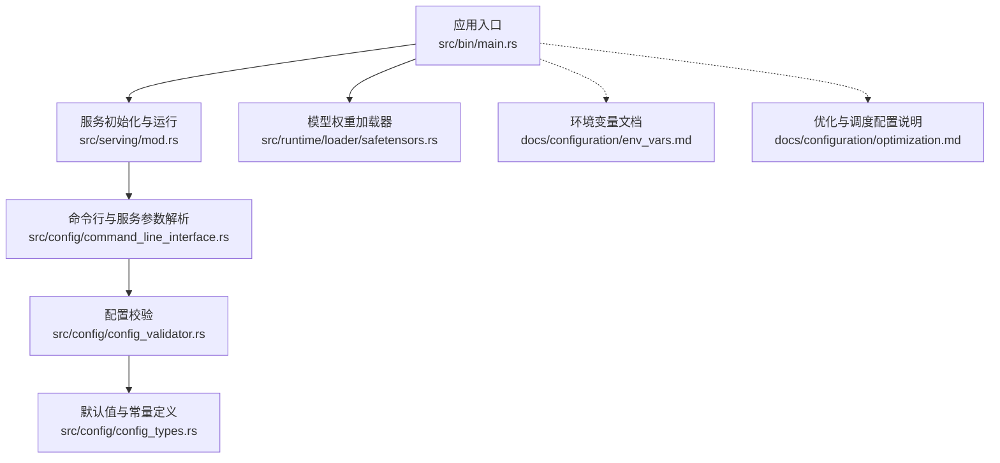
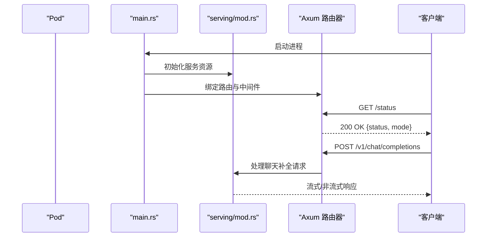
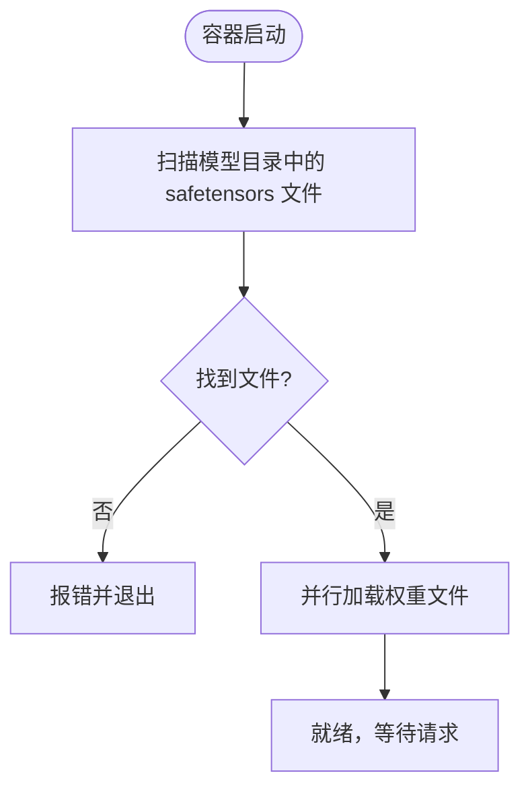
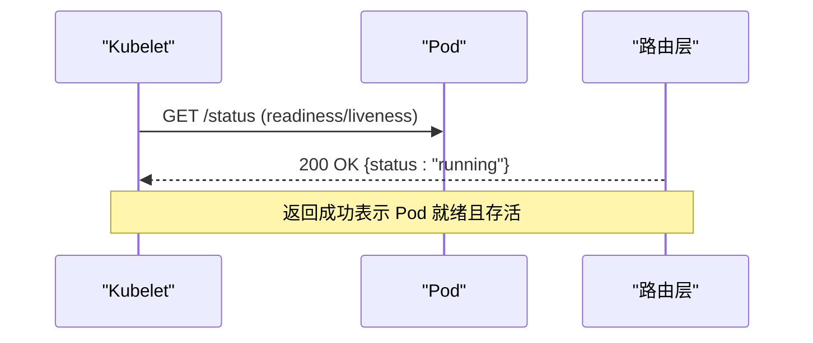
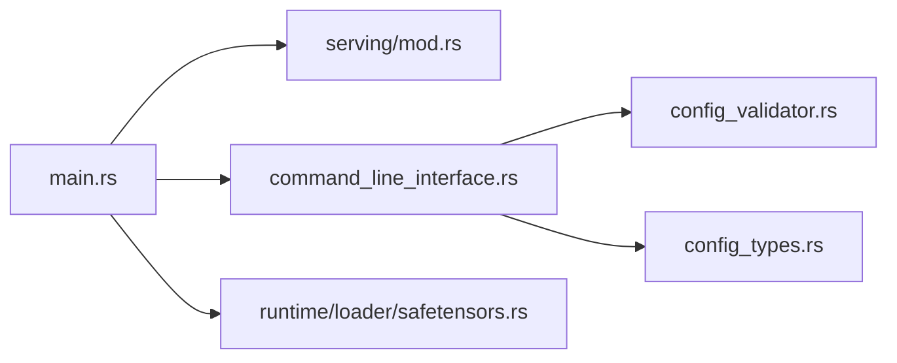

# Kubernetes 部署

<cite>
**本文引用的文件**   
- [README.md](file://README.md)
- [src/bin/main.rs](file://src/bin/main.rs)
- [src/serving/mod.rs](file://src/serving/mod.rs)
- [src/config/command_line_interface.rs](file://src/config/command_line_interface.rs)
- [src/config/config_validator.rs](file://src/config/config_validator.rs)
- [src/config/config_types.rs](file://src/config/config_types.rs)
- [src/runtime/loader/safetensors.rs](file://src/runtime/loader/safetensors.rs)
- [docs/configuration/env_vars.md](file://docs/configuration/env_vars.md)
- [docs/configuration/optimization.md](file://docs/configuration/optimization.md)
- [docs/deployment/index.md](file://docs/deployment/index.md)
</cite>

## 目录
1. [简介](#简介)
2. [项目结构](#项目结构)
3. [核心组件](#核心组件)
4. [架构总览](#架构总览)
5. [详细组件分析](#详细组件分析)
6. [依赖分析](#依赖分析)
7. [性能考虑](#性能考虑)
8. [故障排查指南](#故障排查指南)
9. [结论](#结论)
10. [附录](#附录)

## 简介
本指南面向在 Kubernetes 上部署 eLLM（纯 CPU 大模型推理框架）的工程师与运维人员。eLLM 通过静态计算图、固定形状 KV 缓存与头级注意力执行策略，在 CPU 服务器上实现低延迟、高吞吐的长上下文推理。Kubernetes 侧需要关注的关键点包括：
- Deployment 副本数、资源限制与滚动更新策略
- Service 类型选择（ClusterIP、NodePort、LoadBalancer）
- ConfigMap 与 Secret 管理配置与敏感信息
- PersistentVolume/PersistentVolumeClaim 持久化模型权重
- HPA 水平扩缩容与触发条件
- 网络策略与安全上下文
- 健康检查探针（liveness/readiness/startup）
- 节点亲和性与反亲和性优化调度

## 项目结构
仓库包含服务启动入口、HTTP 服务模块、配置解析与环境变量读取、模型权重加载等关键路径。这些是设计 K8s 部署资源的依据。

图表来源
- [src/bin/main.rs:1-41](file://src/bin/main.rs#L1-L41)
- [src/serving/mod.rs:1-16](file://src/serving/mod.rs#L1-L16)
- [src/config/command_line_interface.rs:734-899](file://src/config/command_line_interface.rs#L734-L899)
- [src/config/config_validator.rs:151-191](file://src/config/config_validator.rs#L151-L191)
- [src/config/config_types.rs:418-489](file://src/config/config_types.rs#L418-L489)
- [src/runtime/loader/safetensors.rs:151-228](file://src/runtime/loader/safetensors.rs#L151-L228)
- [docs/configuration/env_vars.md:1-45](file://docs/configuration/env_vars.md#L1-L45)
- [docs/configuration/optimization.md:1-95](file://docs/configuration/optimization.md#L1-L95)

章节来源
- [src/bin/main.rs:1-41](file://src/bin/main.rs#L1-L41)
- [src/serving/mod.rs:1-16](file://src/serving/mod.rs#L1-L16)
- [src/config/command_line_interface.rs:734-899](file://src/config/command_line_interface.rs#L734-L899)
- [src/config/config_validator.rs:151-191](file://src/config/config_validator.rs#L151-L191)
- [src/config/config_types.rs:418-489](file://src/config/config_types.rs#L418-L489)
- [src/runtime/loader/safetensors.rs:151-228](file://src/runtime/loader/safetensors.rs#L151-L228)
- [docs/configuration/env_vars.md:1-45](file://docs/configuration/env_vars.md#L1-L45)
- [docs/configuration/optimization.md:1-95](file://docs/configuration/optimization.md#L1-L95)

## 核心组件
- 进程入口与运行时
  - 主进程负责解析 CLI、构建配置、初始化服务资源并启动 Tokio 多线程运行时，随后进入 HTTP 服务循环。
- 服务与路由
  - 提供 OpenAI 兼容接口（如 /v1/chat/completions），以及内部状态端点（如 /status）。
- 配置与校验
  - 支持大量 CLI 参数与环境变量；对端口、CORS 白名单等进行校验；提供默认值。
- 模型权重加载
  - 扫描 safetensors 文件并并行加载，支持通过环境变量控制加载线程数。

章节来源
- [src/bin/main.rs:1-41](file://src/bin/main.rs#L1-L41)
- [src/serving/mod.rs:1-16](file://src/serving/mod.rs#L1-L16)
- [src/config/command_line_interface.rs:734-899](file://src/config/command_line_interface.rs#L734-L899)
- [src/config/config_validator.rs:151-191](file://src/config/config_validator.rs#L151-L191)
- [src/config/config_types.rs:418-489](file://src/config/config_types.rs#L418-L489)
- [src/runtime/loader/safetensors.rs:151-228](file://src/runtime/loader/safetensors.rs#L151-L228)

## 架构总览
下图展示了从进程启动到 HTTP 请求处理的调用链，便于理解在 K8s 中如何放置探针、挂载卷与暴露服务。

图表来源
- [src/bin/main.rs:1-41](file://src/bin/main.rs#L1-L41)
- [src/serving/mod.rs:1-16](file://src/serving/mod.rs#L1-L16)
- [src/serving/tests/mod.rs:1-50](file://src/serving/tests/mod.rs#L1-L50)

## 详细组件分析

### Deployment 资源配置
- 副本数
  - 根据业务 QPS 与单实例吞吐确定初始副本数；结合 HPA 动态调整。
- 资源限制与请求
  - CPU：建议为物理核数或逻辑核数的合理比例，避免超分导致抖动。
  - 内存：KV 缓存与模型权重占用较大，需按序列长度与批次大小估算峰值内存，设置 requests 与 limits。
- 滚动更新策略
  - 使用 RollingUpdate，设置 maxUnavailable 与 maxSurge，确保零停机升级。
- 容器镜像与入口
  - 镜像应包含二进制与必要依赖；入口指向 main 进程。
- 工作目录与权限
  - 以只读根文件系统 + 挂载模型权重卷的方式提升安全性。

章节来源
- [src/bin/main.rs:1-41](file://src/bin/main.rs#L1-L41)

### Service 配置
- ClusterIP
  - 集群内访问，适合 Ingress 或 Sidecar 网关转发。
- NodePort
  - 快速验证或调试场景，不建议生产直接暴露。
- LoadBalancer
  - 云厂商 LB 接入，适合对外暴露 OpenAI 兼容 API。
- 端口映射
  - 默认监听端口由配置决定，参考默认值与 CLI 选项。

章节来源
- [src/config/config_types.rs:418-489](file://src/config/config_types.rs#L418-L489)
- [src/config/command_line_interface.rs:834-890](file://src/config/command_line_interface.rs#L834-L890)

### ConfigMap 与 Secret
- ConfigMap
  - 存放非敏感配置：主机、端口、批大小、序列长度、chunk 大小、调度超时等。
- Secret
  - 存放证书、鉴权令牌、外部存储凭据等敏感信息。
- 注入方式
  - 通过环境变量或挂载文件方式注入到容器。

章节来源
- [docs/configuration/env_vars.md:1-45](file://docs/configuration/env_vars.md#L1-L45)
- [docs/configuration/optimization.md:1-95](file://docs/configuration/optimization.md#L1-L95)
- [src/config/command_line_interface.rs:834-890](file://src/config/command_line_interface.rs#L834-L890)

### 持久化存储（PV/PVC）
- 用途
  - 持久化模型权重文件，避免每次 Pod 重建重复下载。
- 加载流程
  - 启动时扫描指定目录下的 safetensors 文件并加载，支持并行加载以提升速度。
- 容量规划
  - 根据模型大小与版本迭代预留空间，建议使用高性能块存储。

图表来源
- [src/runtime/loader/safetensors.rs:151-228](file://src/runtime/loader/safetensors.rs#L151-L228)

章节来源
- [src/runtime/loader/safetensors.rs:151-228](file://src/runtime/loader/safetensors.rs#L151-L228)

### 水平 Pod 自动扩缩容（HPA）
- 指标源
  - CPU 利用率、内存利用率、自定义指标（如 QPS、延迟百分位）。
- 触发条件
  - 基于目标平均利用率或自定义指标阈值触发扩容/缩容。
- 行为
  - 与 Deployment 的 minReplicas/maxReplicas 配合，平滑扩缩容。

[本节为通用指导，不直接分析具体文件]

### 网络策略与安全上下文
- 网络策略
  - 仅允许来自 Ingress/LB 的入站流量，限制出站访问。
- 安全上下文
  - 以非 root 用户运行，只读根文件系统，最小权限原则。
- 证书与 TLS
  - 通过 Secret 注入证书，Service 或 Ingress 终止 TLS。

[本节为通用指导，不直接分析具体文件]

### 健康检查与探针
- livenessProbe
  - 探测进程是否存活，失败则重启。
- readinessProbe
  - 探测服务是否可接收流量，失败则从 Service 后端移除。
- startupProbe
  - 针对模型加载耗时较长的场景，避免过早判定失败。
- 可用端点
  - 测试用例显示存在 /status 端点用于健康检查。

图表来源
- [src/serving/tests/mod.rs:1-50](file://src/serving/tests/mod.rs#L1-L50)

章节来源
- [src/serving/tests/mod.rs:1-50](file://src/serving/tests/mod.rs#L1-L50)

### 节点亲和性与反亲和性
- 亲和性
  - 将 Pod 调度到具备特定标签的节点（如 CPU 型号、NUMA 拓扑）。
- 反亲和性
  - 避免同副本 Pod 调度在同一节点，提高可用性。
- 资源隔离
  - 结合 TopologyManager 与 CPU Manager 策略，减少跨 NUMA 访问开销。

[本节为通用指导，不直接分析具体文件]

## 依赖分析
- 入口与运行
  - main.rs 负责解析 CLI、构建配置、初始化服务资源并启动异步运行时。
- 服务与路由
  - serving/mod.rs 导出服务初始化与运行函数，路由层承载 API 与状态端点。
- 配置与校验
  - command_line_interface.rs 解析 CLI 参数；config_validator.rs 进行端口与 CORS 白名单校验；config_types.rs 提供默认值。
- 权重加载
  - safetensors.rs 负责扫描与并行加载模型权重。

图表来源
- [src/bin/main.rs:1-41](file://src/bin/main.rs#L1-L41)
- [src/serving/mod.rs:1-16](file://src/serving/mod.rs#L1-L16)
- [src/config/command_line_interface.rs:734-899](file://src/config/command_line_interface.rs#L734-L899)
- [src/config/config_validator.rs:151-191](file://src/config/config_validator.rs#L151-L191)
- [src/config/config_types.rs:418-489](file://src/config/config_types.rs#L418-L489)
- [src/runtime/loader/safetensors.rs:151-228](file://src/runtime/loader/safetensors.rs#L151-L228)

章节来源
- [src/bin/main.rs:1-41](file://src/bin/main.rs#L1-L41)
- [src/serving/mod.rs:1-16](file://src/serving/mod.rs#L1-L16)
- [src/config/command_line_interface.rs:734-899](file://src/config/command_line_interface.rs#L734-L899)
- [src/config/config_validator.rs:151-191](file://src/config/config_validator.rs#L151-L191)
- [src/config/config_types.rs:418-489](file://src/config/config_types.rs#L418-L489)
- [src/runtime/loader/safetensors.rs:151-228](file://src/runtime/loader/safetensors.rs#L151-L228)

## 性能考虑
- 批大小与序列长度
  - 增大批大小与 chunk 大小可提升吞吐，但会增加内存与延迟；长上下文需增加序列长度。
- 线程与并发
  - 工作线程与异步线程数量影响吞吐与延迟；CPU 密集型任务需合理分配。
- 权重加载
  - 并行加载可缩短冷启动时间；磁盘 I/O 与内存带宽是关键瓶颈。
- 调度策略
  - 连续批处理与调度超时窗口影响低负载时的响应延迟。

章节来源
- [docs/configuration/env_vars.md:1-45](file://docs/configuration/env_vars.md#L1-L45)
- [docs/configuration/optimization.md:1-95](file://docs/configuration/optimization.md#L1-L95)
- [src/runtime/loader/safetensors.rs:151-228](file://src/runtime/loader/safetensors.rs#L151-L228)

## 故障排查指南
- 启动失败
  - 检查端口是否被占用、CORS 白名单是否为空、命令段是否缺失。
- 模型权重未找到
  - 确认挂载路径正确、safetensors 文件存在且可读。
- 服务不可用
  - 查看 /status 端点返回；检查 readiness 与 liveness 探针日志。
- 性能抖动
  - 观察 CPU/内存利用率、磁盘 I/O、KV 缓存命中率与批大小变化。

章节来源
- [src/config/config_validator.rs:151-191](file://src/config/config_validator.rs#L151-L191)
- [src/runtime/loader/safetensors.rs:151-228](file://src/runtime/loader/safetensors.rs#L151-L228)
- [src/serving/tests/mod.rs:1-50](file://src/serving/tests/mod.rs#L1-L50)

## 结论
在 Kubernetes 上部署 eLLM 的关键在于：合理的资源配额与滚动更新策略、正确的服务暴露方式、完善的配置与密钥管理、可靠的持久化存储、精细化的扩缩容策略、严格的网络与安全策略、完备的健康检查与探针，以及基于节点特征的调度优化。结合 eLLM 的环境变量与 CLI 能力，可在不同规模与场景下获得稳定、高效的推理服务。

[本节为总结性内容，不直接分析具体文件]

## 附录
- 环境变量与优化要点
  - 批大小、序列长度、chunk 大小、调度超时等均可通过环境变量配置，详见文档。
- 部署文档索引
  - 官方部署文档入口位于 docs/deployment/index.md，后续会拆分环境相关指南。

章节来源
- [docs/configuration/env_vars.md:1-45](file://docs/configuration/env_vars.md#L1-L45)
- [docs/configuration/optimization.md:1-95](file://docs/configuration/optimization.md#L1-L95)
- [docs/deployment/index.md:1-10](file://docs/deployment/index.md#L1-L10)