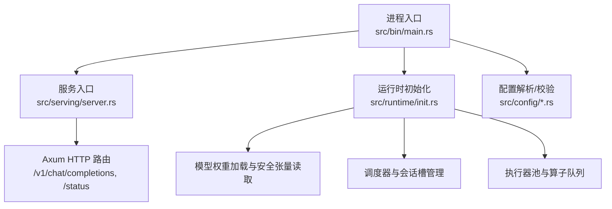
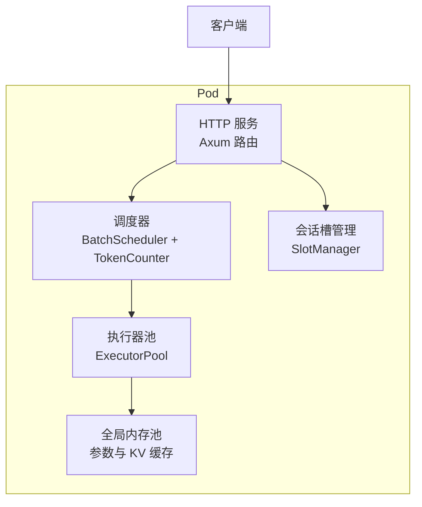
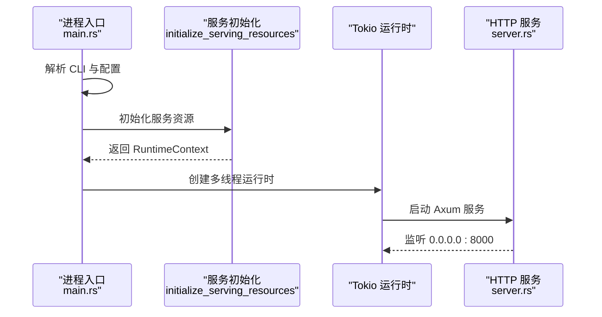
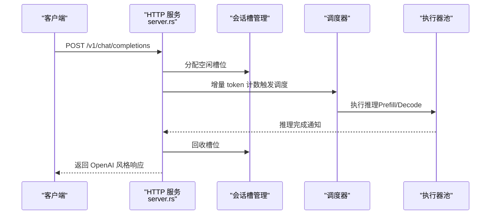
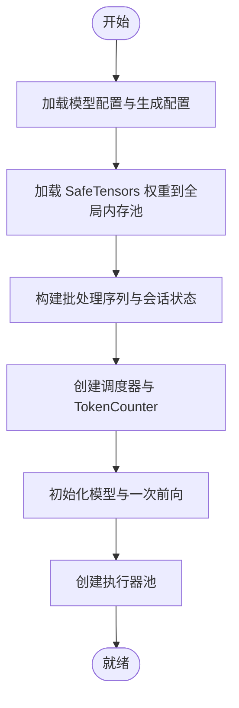
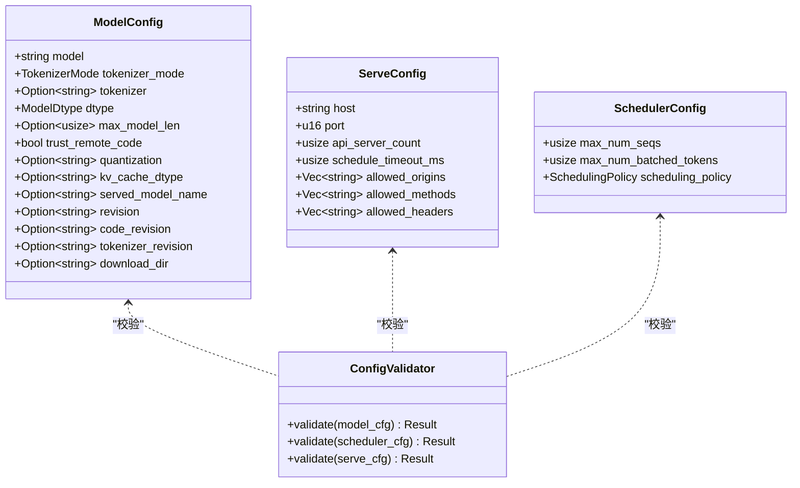
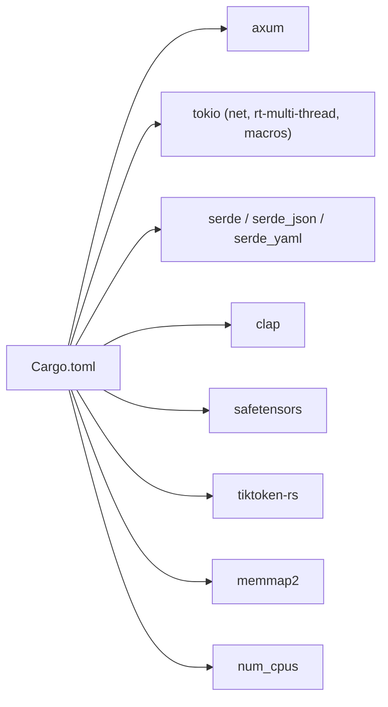
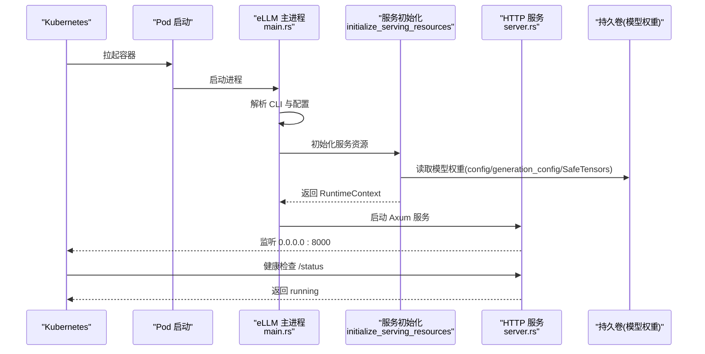

# Kubernetes 部署概览

<cite>
**本文引用的文件**
- [README.md](file://README.md)
- [Cargo.toml](file://Cargo.toml)
- [src/bin/main.rs](file://src/bin/main.rs)
- [src/serving/server.rs](file://src/serving/server.rs)
- [src/serving/mod.rs](file://src/serving/mod.rs)
- [src/runtime/init.rs](file://src/runtime/init.rs)
- [src/config/command_line_interface.rs](file://src/config/command_line_interface.rs)
- [src/config/config_types.rs](file://src/config/config_types.rs)
- [src/config/config_validator.rs](file://src/config/config_validator.rs)
- [docs/configuration/env_vars.md](file://docs/configuration/env_vars.md)
- [docs/serving/openai_compatible_server.md](file://docs/serving/openai_compatible_server.md)
- [docs/cli/serve.md](file://docs/cli/serve.md)
</cite>

## 目录
1. [简介](#简介)
2. [项目结构](#项目结构)
3. [核心组件](#核心组件)
4. [架构总览](#架构总览)
5. [详细组件分析](#详细组件分析)
6. [依赖分析](#依赖分析)
7. [性能与资源特性](#性能与资源特性)
8. [Kubernetes 部署指南](#kubernetes-部署指南)
9. [故障排查](#故障排查)
10. [结论](#结论)

## 简介
本文件面向在 Kubernetes 环境中部署 eLLM 的工程师，提供整体架构、服务拓扑、部署前准备、完整部署流程、kubectl 示例与验证步骤。eLLM 是专为 CPU 服务器优化的大模型推理框架，具备低延迟、高吞吐、长上下文等特性，适合以 Prefill 为主的长上下文工作负载（如 RAG、代码助手、深度研究等）。

## 项目结构
从运行时的角度，eLLM 的关键入口与模块如下：
- 进程入口：main.rs 解析 CLI、加载配置、初始化运行时与服务资源，并启动 Tokio 多线程运行时。
- HTTP 服务：serving/server.rs 基于 Axum 暴露 OpenAI 兼容接口，默认监听 0.0.0.0:8000。
- 运行时初始化：runtime/init.rs 负责加载模型权重、构建调度器与会话槽管理、创建执行器等。
- 配置体系：config_types.rs、command_line_interface.rs、config_validator.rs 共同完成参数解析、校验与合并。
- 环境变量：docs/configuration/env_vars.md 定义了运行时可调参数（批大小、序列长度、分块大小、调度超时等）。

图表来源
- [src/bin/main.rs:1-41](file://src/bin/main.rs#L1-L41)
- [src/serving/server.rs:1-43](file://src/serving/server.rs#L1-L43)
- [src/runtime/init.rs:36-69](file://src/runtime/init.rs#L36-L69)
- [src/config/config_types.rs:54-489](file://src/config/config_types.rs#L54-L489)
- [src/config/command_line_interface.rs:734-756](file://src/config/command_line_interface.rs#L734-L756)
- [src/config/config_validator.rs:1-43](file://src/config/config_validator.rs#L1-L43)

章节来源
- [src/bin/main.rs:1-41](file://src/bin/main.rs#L1-L41)
- [src/serving/server.rs:1-43](file://src/serving/server.rs#L1-L43)
- [src/runtime/init.rs:36-69](file://src/runtime/init.rs#L36-L69)
- [src/config/config_types.rs:54-489](file://src/config/config_types.rs#L54-L489)
- [src/config/command_line_interface.rs:734-756](file://src/config/command_line_interface.rs#L734-L756)
- [src/config/config_validator.rs:1-43](file://src/config/config_validator.rs#L1-L43)

## 核心组件
- 进程与运行时
  - main.rs 负责解析 CLI、加载配置、初始化服务资源、创建 Tokio 运行时并阻塞等待请求。
- HTTP 服务层
  - server.rs 使用 Axum 注册路由，绑定 0.0.0.0:8000，对外暴露 OpenAI 兼容接口与健康检查端点。
- 运行时初始化
  - runtime/init.rs 加载模型配置与生成配置、读取 SafeTensors 权重到全局内存池、构建批处理序列、调度器与会话槽管理、RoPE 位置编码、模型初始化与一次前向填充、创建执行器池。
- 配置系统
  - config_types.rs 定义模型、调度、服务等配置结构；command_line_interface.rs 支持 JSON/键值对等多种 CLI 传参方式；config_validator.rs 进行必填项与一致性校验。
- 环境变量
  - docs/configuration/env_vars.md 定义了批大小、序列长度、分块大小、调度超时等关键运行时参数。

章节来源
- [src/bin/main.rs:1-41](file://src/bin/main.rs#L1-L41)
- [src/serving/server.rs:1-43](file://src/serving/server.rs#L1-L43)
- [src/runtime/init.rs:36-69](file://src/runtime/init.rs#L36-L69)
- [src/config/config_types.rs:54-489](file://src/config/config_types.rs#L54-L489)
- [src/config/command_line_interface.rs:734-756](file://src/config/command_line_interface.rs#L734-L756)
- [src/config/config_validator.rs:1-43](file://src/config/config_validator.rs#L1-L43)
- [docs/configuration/env_vars.md:1-45](file://docs/configuration/env_vars.md#L1-L45)

## 架构总览
下图展示了 Pod 内主要组件的交互关系：HTTP 服务接收请求，分配批次槽位，触发调度器与执行器，最终返回结果。

图表来源
- [src/serving/server.rs:1-43](file://src/serving/server.rs#L1-L43)
- [src/runtime/init.rs:36-69](file://src/runtime/init.rs#L36-L69)

## 详细组件分析

### 进程入口与生命周期
- 解析 CLI 与配置：main.rs 调用 Cli::parse() 与 Config::from_cli()/resolve()。
- 初始化服务资源：initialize_serving_resources() 完成模型加载、调度器与会话槽管理、执行器池等。
- 启动 Tokio 运行时：根据 ctx.thread_config 设置 worker_threads 与 max_blocking_threads，并阻塞运行 run_server。

图表来源
- [src/bin/main.rs:1-41](file://src/bin/main.rs#L1-L41)
- [src/serving/server.rs:1-43](file://src/serving/server.rs#L1-L43)

章节来源
- [src/bin/main.rs:1-41](file://src/bin/main.rs#L1-L41)

### HTTP 服务与 OpenAI 兼容接口
- 路由与端口：默认监听 0.0.0.0:8000，暴露 POST /v1/chat/completions 与 GET /status。
- 请求处理：分配批次槽位、写入提示词、进入预填充阶段、等待推理完成、解码输出、回收槽位。
- 健康检查：/status 返回运行状态与模式信息。

图表来源
- [src/serving/server.rs:1-43](file://src/serving/server.rs#L1-L43)
- [docs/serving/openai_compatible_server.md:1-244](file://docs/serving/openai_compatible_server.md#L1-L244)

章节来源
- [src/serving/server.rs:1-43](file://src/serving/server.rs#L1-L43)
- [docs/serving/openai_compatible_server.md:1-244](file://docs/serving/openai_compatible_server.md#L1-L244)

### 运行时初始化与模型加载
- 模型配置与生成配置：从模型目录加载 config.json 与 generation_config.json。
- 权重加载：通过 SafeTensorsLoader 读取所有权重至全局内存池。
- 线程与调度：确定线程配置，构建 BatchSequence、batch_states、调度器与广播通道。
- 模型预热：初始化 RoPE 位置编码、模型与一次前向，建立算子队列，创建执行器池。

图表来源
- [src/runtime/init.rs:36-69](file://src/runtime/init.rs#L36-L69)

章节来源
- [src/runtime/init.rs:36-69](file://src/runtime/init.rs#L36-L69)

### 配置系统与校验
- 配置类型：ModelConfig、ServeConfig、SchedulerConfig 等结构体定义于 config_types.rs。
- CLI 解析：command_line_interface.rs 支持 JSON 对象、键值对、分类配置等多格式传入。
- 校验规则：config_validator.rs 对必填字段、取值范围与一致性进行校验。

图表来源
- [src/config/config_types.rs:54-489](file://src/config/config_types.rs#L54-L489)
- [src/config/config_validator.rs:1-43](file://src/config/config_validator.rs#L1-L43)

章节来源
- [src/config/config_types.rs:54-489](file://src/config/config_types.rs#L54-L489)
- [src/config/command_line_interface.rs:734-756](file://src/config/command_line_interface.rs#L734-L756)
- [src/config/config_validator.rs:1-43](file://src/config/config_validator.rs#L1-L43)

## 依赖分析
- 语言与工具链：Rust 2021 版本，release 优化开启 LTO、strip 符号等。
- 网络与异步：axum、tokio（net、rt-multi-thread、macros）、tokio-stream。
- 序列化与配置：serde、serde_json、serde_yaml、clap。
- 模型与 IO：safetensors、tiktoken-rs、minijinja。
- 其他：memmap2、num_cpus、core_affinity、uuid、regex、rand、itertools、thiserror、anyhow。

图表来源
- [Cargo.toml:1-102](file://Cargo.toml#L1-L102)

章节来源
- [Cargo.toml:1-102](file://Cargo.toml#L1-L102)

## 性能与资源特性
- 硬件要求：CPU 需为 Intel Xeon 4th Gen 或更新且支持 AMX；内存容量充足即可，无需 GPU/NPU。
- 设计优势：纯 CPU 推理、低延迟（Prefill 端到端）、高吞吐、长上下文、更低能耗与成本。
- 适用场景：Open Claw、代码助手、RAG、深度研究等以长上下文与频繁交互为主的工作负载。

章节来源
- [README.md:1-207](file://README.md#L1-L207)

## Kubernetes 部署指南

### 部署前准备
- 集群要求
  - 节点 CPU 满足最低要求（Intel Xeon 4th Gen 或更新，支持 AMX），内存容量足够承载模型与 KV 缓存。
  - 建议启用 CPU 亲和与 NUMA 感知（可选），以提升缓存命中率与带宽利用率。
- 镜像准备
  - 将 eLLM 二进制打包进容器镜像，确保包含必要的运行时依赖与系统库。
  - 参考 Cargo.toml 中的依赖与 release profile，构建生产优化镜像。
- 存储配置
  - 模型权重目录可通过持久卷挂载到 Pod，便于热更新与共享。
  - 若需要下载权重，可配置 download-dir 并通过持久卷持久化。
- 环境变量与参数
  - 通过环境变量调整批大小、序列长度、分块大小与调度超时等关键参数。
  - 也可通过 CLI JSON 参数或配置文件注入。

章节来源
- [README.md:1-207](file://README.md#L1-L207)
- [docs/configuration/env_vars.md:1-45](file://docs/configuration/env_vars.md#L1-L45)
- [docs/cli/serve.md:1-76](file://docs/cli/serve.md#L1-L76)
- [src/config/command_line_interface.rs:734-756](file://src/config/command_line_interface.rs#L734-L756)

### 部署流程图（Pod 启动到服务可用）

图表来源
- [src/bin/main.rs:1-41](file://src/bin/main.rs#L1-L41)
- [src/serving/server.rs:1-43](file://src/serving/server.rs#L1-L43)
- [src/runtime/init.rs:36-69](file://src/runtime/init.rs#L36-L69)

### 基本 kubectl 命令与验证
- 查看 Pod 状态
  - kubectl get pods -n <namespace>
- 查看日志
  - kubectl logs -f deployment/<deployment-name> -n <namespace>
- 访问服务
  - curl http://<service-ip>:8000/status
  - curl -X POST http://<service-ip>:8000/v1/chat/completions -H "Content-Type: application/json" -d '{"model":"<model-name>","messages":[{"role":"user","content":"你好"}]}'
- 扩缩容
  - kubectl scale deployment/<deployment-name> --replicas=<N> -n <namespace>
- 滚动更新
  - kubectl rollout restart deployment/<deployment-name> -n <namespace>

说明
- 服务默认监听 0.0.0.0:8000，可通过 Service 暴露 ClusterIP/NodePort/LoadBalancer。
- 健康检查端点 /status 可用于探针配置。

章节来源
- [src/serving/server.rs:1-43](file://src/serving/server.rs#L1-L43)

## 故障排查
- 配置错误
  - 检查必填字段与取值范围，例如 model.model 不能为空、max_model_len 必须大于 0、served_model_name 非空等。
  - 关注 batch 限制一致性：max_num_batched_tokens 应大于等于 max_num_seqs。
- 端口冲突
  - 确认 8000 端口未被占用，或在配置中修改 host/port。
- 模型权重缺失
  - 确认持久卷挂载路径正确，config.json、generation_config.json 与权重文件存在。
- 资源不足
  - 监控 Pod 的 CPU/内存使用，适当调整 requests/limits 与环境变量（ELLM_BATCH_SIZE、ELLM_SEQUENCE_LENGTH、ELLM_CHUNK_SIZE）。
- 健康检查失败
  - 检查 /status 返回值是否为 running，确认服务已完全初始化。

章节来源
- [src/config/config_validator.rs:1-43](file://src/config/config_validator.rs#L1-L43)
- [docs/configuration/env_vars.md:1-45](file://docs/configuration/env_vars.md#L1-L45)
- [src/serving/server.rs:1-43](file://src/serving/server.rs#L1-L43)

## 结论
eLLM 在 Kubernetes 上的部署以轻量 HTTP 服务为核心，结合高效的运行时初始化与调度机制，能够在 CPU 服务器上实现低延迟、高吞吐的长上下文推理。通过合理的资源配置、持久化存储与环境变量调优，可在弹性扩缩容、高可用性与资源管理方面获得良好效果。