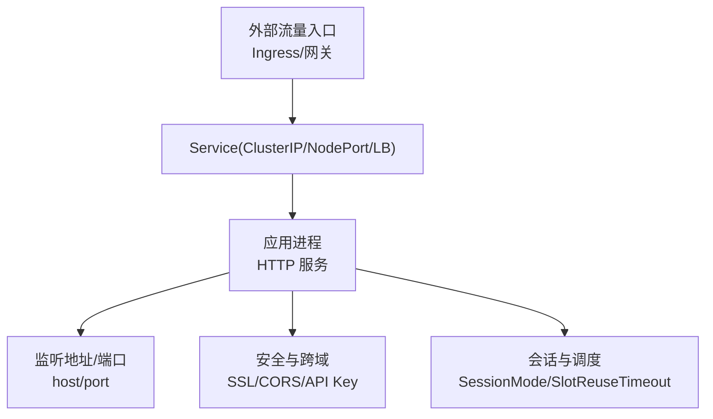
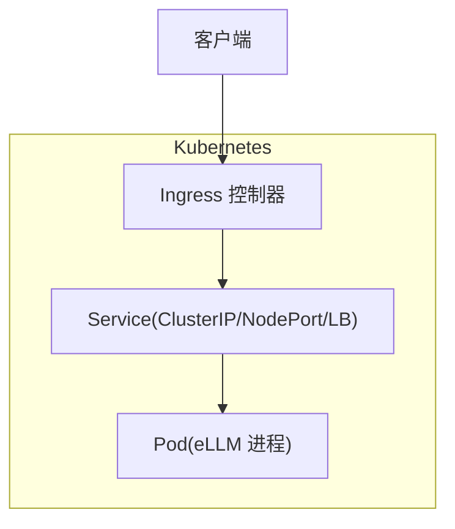
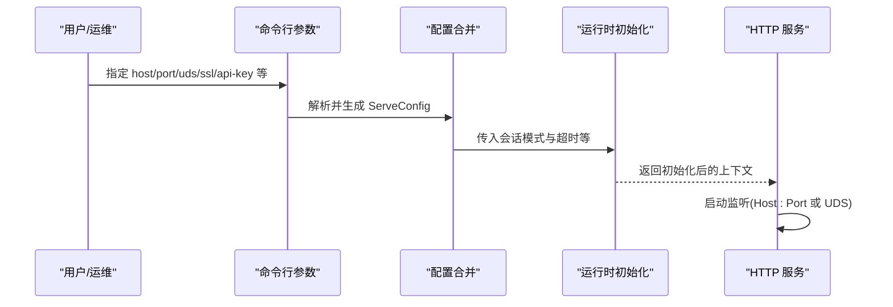

# Service 和网络配置

<cite>
**本文引用的文件**   
- [README.md](file://README.md)
- [src/config/command_line_interface.rs](file://src/config/command_line_interface.rs)
- [src/config/config_types.rs](file://src/config/config_types.rs)
- [src/serving/server.rs](file://src/serving/server.rs)
- [src/runtime/init.rs](file://src/runtime/init.rs)
- [docs/cli/serve.md](file://docs/cli/serve.md)
- [docs/configuration/optimization.md](file://docs/configuration/optimization.md)
</cite>

## 目录
1. [简介](#简介)
2. [项目结构](#项目结构)
3. [核心组件](#核心组件)
4. [架构总览](#架构总览)
5. [详细组件分析](#详细组件分析)
6. [依赖关系分析](#依赖关系分析)
7. [性能与扩展性考虑](#性能与扩展性考虑)
8. [故障排查指南](#故障排查指南)
9. [结论](#结论)
10. [附录](#附录)

## 简介
本文件聚焦于 eLLM 在 Kubernetes 或容器环境中的服务暴露与网络配置，覆盖以下主题：
- Service 类型：ClusterIP、NodePort、LoadBalancer 的适用场景与选择建议
- Ingress 资源：域名绑定、TLS 证书、路径路由与多端点策略
- NetworkPolicy：最小权限访问控制与隔离策略
- 服务发现与 DNS：Kubernetes 内部解析机制与最佳实践
- 负载均衡算法与会话保持：结合 eLLM 运行特性给出部署建议
- 连通性测试与排障：从集群内到外部的端到端验证方法

eLLM 提供 HTTP API（默认监听端口见下文），可通过任意标准反向代理或云厂商负载均衡器接入。本项目未内置 Ingress/NetworkPolicy 清单，但提供了足够的可观测性与参数以配合外部网络组件使用。

章节来源
- [README.md:1-207](file://README.md#L1-L207)

## 项目结构
与网络相关的关键位置：
- 命令行与服务配置：定义监听地址、端口、SSL、CORS、API Key 等
- 运行时初始化：根据配置决定会话模式、槽位复用超时等
- 文档：CLI 参数说明与优化配置参考

图表来源
- [src/config/command_line_interface.rs:162-231](file://src/config/command_line_interface.rs#L162-L231)
- [src/config/config_types.rs:289-310](file://src/config/config_types.rs#L289-L310)
- [src/serving/server.rs:41-82](file://src/serving/server.rs#L41-L82)
- [src/runtime/init.rs:21-32](file://src/runtime/init.rs#L21-L32)

章节来源
- [src/config/command_line_interface.rs:162-231](file://src/config/command_line_interface.rs#L162-L231)
- [src/config/config_types.rs:289-310](file://src/config/config_types.rs#L289-L310)
- [src/serving/server.rs:41-82](file://src/serving/server.rs#L41-L82)
- [src/runtime/init.rs:21-32](file://src/runtime/init.rs#L21-L32)

## 核心组件
- 监听与绑定
  - host/port：用于绑定 HTTP 服务；也可通过 Unix Domain Socket 启动
  - UDS：当设置时忽略 host/port
- 安全与认证
  - SSL/TLS：支持 key/cert/ca 文件路径
  - API Key：请求头校验
  - CORS：允许的来源、方法与头部
- 会话与槽位复用
  - SessionMode：由“对话缓存”开关决定
  - SlotReuseTimeout：槽位保留时间，影响连接亲和与状态复用

章节来源
- [src/config/command_line_interface.rs:162-231](file://src/config/command_line_interface.rs#L162-L231)
- [src/config/config_types.rs:289-310](file://src/config/config_types.rs#L289-L310)
- [src/runtime/init.rs:21-32](file://src/runtime/init.rs#L21-L32)

## 架构总览
下图展示典型部署拓扑：客户端经 Ingress 进入，Service 将流量转发至 Pod 内的 eLLM 进程。若需要外部直连，可使用 NodePort 或 LoadBalancer。

[此图为概念图，不直接映射具体源码文件]

## 详细组件分析

### Service 类型与选择
- ClusterIP（默认）
  - 仅集群内部可达，适合 Ingress 或 Sidecar 网关统一入口
  - 推荐作为默认暴露方式
- NodePort
  - 在每个节点暴露固定端口，便于快速验证或无 Ingress 环境
  - 注意端口冲突与防火墙规则
- LoadBalancer
  - 由云平台创建外部负载均衡器并分配公网 IP
  - 适合对外暴露且希望托管健康检查与高可用

选择建议
- 生产环境优先使用 Ingress + ClusterIP
- 调试/临时环境可用 NodePort
- 需要公网直连时使用 LoadBalancer

[本节为通用指导，无需代码来源]

### Ingress 资源配置要点
- 域名绑定
  - 在 Ingress 中为服务配置 hosts 与 path，将不同域名/路径路由到同一后端服务
- TLS 证书
  - 在 Ingress 中引用 Secret 以启用 HTTPS
  - 若后端已启用 SSL，可选择终止于 Ingress 或透传到后端
- 路径路由
  - 基于前缀或正则匹配将 /v1/* 路由到 eLLM 服务
- 会话保持
  - 若需会话保持，可在 Ingress 注解中开启 sticky session（取决于控制器实现）
  - 对于长上下文推理，建议结合后端会话复用与合理的超时设置

[本节为通用指导，无需代码来源]

### NetworkPolicy 示例思路
- 入站限制
  - 仅允许来自 Ingress 控制器命名空间或特定 Pod 的流量访问 eLLM 端口
- 出站限制
  - 如模型权重位于对象存储或远程仓库，按需放行对应出口
- 最小权限
  - 仅开放必要端口（例如 8000 或自定义端口）

[本节为通用指导，无需代码来源]

### 服务发现与 DNS 解析
- 集群内通过 <service>.<namespace>.svc.cluster.local 解析
- 短名 <service> 在同命名空间下可直接使用
- 若跨命名空间访问，建议使用完整 FQDN

[本节为通用指导，无需代码来源]

### 负载均衡算法与会话保持
- 算法选择
  - 多数控制器默认轮询/随机即可满足 eLLM 的无状态请求处理
  - 对长上下文或流式响应，建议结合 Ingress 的会话保持以减少重放开销
- 会话保持
  - 在 Ingress 层开启粘性会话（按源 IP 或 Cookie）
  - 同时合理设置后端 slot 复用超时，避免长时间占用导致资源紧张

[本节为通用指导，无需代码来源]

### eLLM 网络与安全参数速览
- 监听与绑定
  - host/port：默认监听地址与端口
  - uds：Unix 域套接字路径（设置后忽略 host/port）
- 安全与跨域
  - ssl-keyfile、ssl-certfile、ssl-ca-certs：HTTPS 证书与 CA
  - api-key：请求头鉴权
  - allow-credentials、allowed-origins、allowed-methods、allowed-headers：CORS 控制
- 其他
  - log-requests：是否记录请求日志
  - reasoning-parser-enabled、tool-call-parser-enabled：功能开关

章节来源
- [src/config/command_line_interface.rs:162-231](file://src/config/command_line_interface.rs#L162-L231)
- [docs/cli/serve.md:172-248](file://docs/cli/serve.md#L172-L248)
- [docs/cli/serve.md:250-318](file://docs/cli/serve.md#L250-L318)

### 运行时与会话复用对网络的影响
- SessionMode
  - 由“对话缓存”开关决定：启用则使用可复用会话模式
- SlotReuseTimeout
  - 槽位保留超时，影响连接亲和与状态复用窗口
- 与负载均衡的关系
  - 开启会话复用时，建议配合 Ingress 粘性会话，降低上下文重建成本

章节来源
- [src/serving/server.rs:45-82](file://src/serving/server.rs#L45-L82)
- [src/runtime/init.rs:21-32](file://src/runtime/init.rs#L21-L32)
- [src/config/config_types.rs:283-310](file://src/config/config_types.rs#L283-L310)

## 依赖关系分析
- 配置来源
  - CLI 参数与环境变量合并，形成最终 ServeConfig
- 运行时初始化
  - 依据配置确定会话模式与槽位复用超时
- 服务启动
  - 使用 axum 启动 HTTP 服务，监听 host:port 或 UDS

图表来源
- [src/config/command_line_interface.rs:162-231](file://src/config/command_line_interface.rs#L162-L231)
- [src/serving/server.rs:41-82](file://src/serving/server.rs#L41-L82)
- [src/runtime/init.rs:21-32](file://src/runtime/init.rs#L21-L32)

章节来源
- [src/config/command_line_interface.rs:162-231](file://src/config/command_line_interface.rs#L162-L231)
- [src/serving/server.rs:41-82](file://src/serving/server.rs#L41-L82)
- [src/runtime/init.rs:21-32](file://src/runtime/init.rs#L21-L32)

## 性能与扩展性考虑
- 并发与批大小
  - 通过环境变量调整 batch_size、chunk_size、sequence_length 等，平衡吞吐与时延
- 调度与超时
  - schedule_timeout_ms 影响低负载下的调度延迟
- 线程与执行
  - runner_count 自动按 CPU 核数估算，减少异步线程切换开销
- 网络侧
  - 使用 Ingress 聚合健康检查与限流
  - 开启会话保持以降低长上下文重建成本

章节来源
- [docs/configuration/optimization.md:1-38](file://docs/configuration/optimization.md#L1-L38)
- [docs/configuration/optimization.md:62-95](file://docs/configuration/optimization.md#L62-L95)

## 故障排查指南
- 无法访问服务
  - 确认 Service 类型与端口映射正确
  - 检查 Ingress 规则与 TLS Secret 是否生效
  - 验证防火墙/安全组放行相应端口
- 证书问题
  - 核对 ssl-keyfile、ssl-certfile、ssl-ca-certs 路径与权限
  - 若 Ingress 终止 TLS，确保后端不受客户端证书强制要求影响
- 鉴权失败
  - 检查请求头是否携带正确的 api-key
- 跨域错误
  - 调整 allowed-origins、allowed-methods、allowed-headers
- 会话不稳定
  - 开启 Ingress 粘性会话，并适当增大 slot-reuse-timeout-ms
- 连通性测试
  - 集群内 curl 服务 ClusterIP 与端口
  - 通过 Ingress 域名访问，验证 HTTPS 与路径路由
  - 使用 kubectl port-forward 进行本地调试

章节来源
- [docs/cli/serve.md:172-248](file://docs/cli/serve.md#L172-L248)
- [docs/cli/serve.md:250-318](file://docs/cli/serve.md#L250-L318)

## 结论
- 推荐使用 Ingress + ClusterIP 作为标准暴露方式
- 根据业务需求选择 NodePort 或 LoadBalancer
- 结合会话保持与后端槽位复用提升长上下文推理体验
- 通过 NetworkPolicy 实施最小权限访问控制
- 利用提供的网络与安全参数完成 TLS、鉴权与跨域配置

[本节为总结性内容，无需代码来源]

## 附录
- 常用命令与参考
  - 查看 Pod 日志与事件
  - 使用 kubectl exec 进入容器进行网络诊断
  - 参考官方文档了解各 Ingress 控制器的会话保持与 TLS 配置差异

[本节为通用指导，无需代码来源]