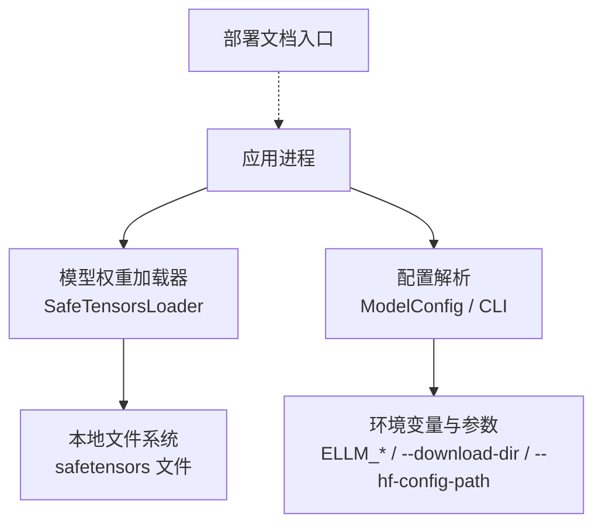
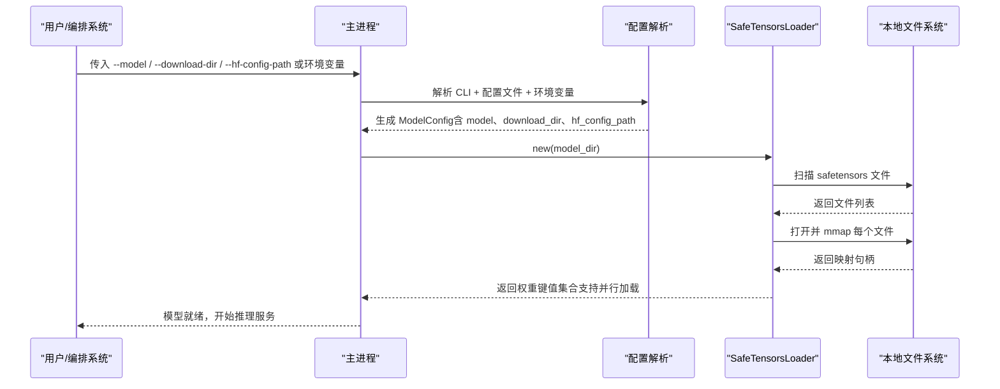
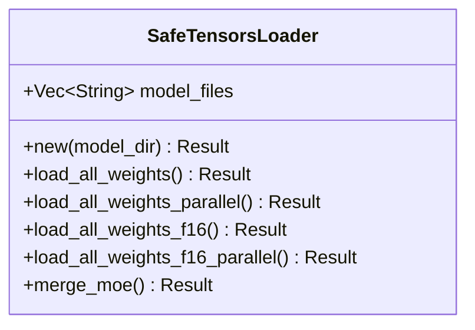
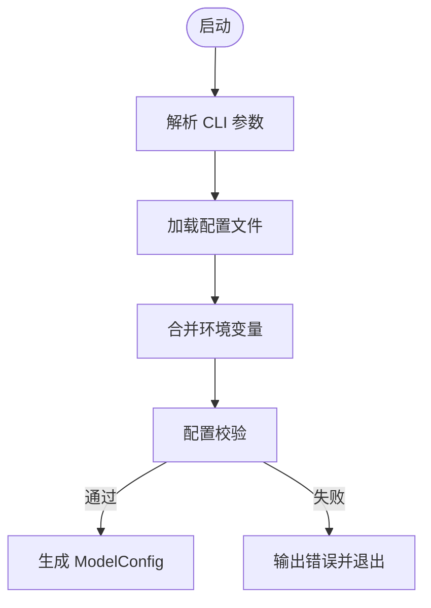
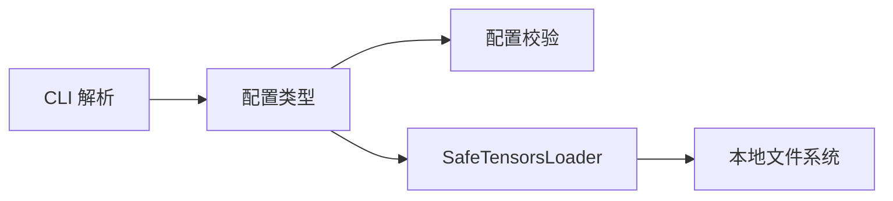

# 存储和持久化

<cite>
**本文引用的文件**
- [README.md](file://README.md)
- [配置环境变量文档](file://docs/configuration/env_vars.md)
- [调度优化配置文档](file://docs/configuration/optimization.md)
- [部署说明入口](file://docs/deployment/index.md)
- [命令行接口定义](file://src/config/command_line_interface.rs)
- [配置类型与默认值](file://src/config/config_types.rs)
- [配置校验器](file://src/config/config_validator.rs)
- [模型权重加载器（safetensors）](file://src/runtime/loader/safetensors.rs)
</cite>

## 目录
1. [简介](#简介)
2. [项目结构](#项目结构)
3. [核心组件](#核心组件)
4. [架构总览](#架构总览)
5. [详细组件分析](#详细组件分析)
6. [依赖关系分析](#依赖关系分析)
7. [性能考量](#性能考量)
8. [故障排查指南](#故障排查指南)
9. [结论](#结论)
10. [附录](#附录)

## 简介
本章节聚焦于“存储与持久化”主题，围绕模型权重文件的读取、缓存与备份恢复策略展开。eLLM 当前以本地文件系统为模型权重的唯一数据源，通过 safetensors 格式进行高效映射与并行加载；同时提供下载目录与 HuggingFace 配置路径等可配置项，便于在容器或集群环境中将外部存储挂载到固定路径，实现持久化。

## 项目结构
从代码与文档可见，与存储相关的关键位置包括：
- 运行时权重加载：基于 safetensors 的本地文件扫描与内存映射加载
- 配置层：支持指定模型路径、下载目录、HF 配置路径等
- 文档层：环境变量与优化配置说明，以及部署文档入口

图表来源
- [模型权重加载器（safetensors）:130-171](file://src/runtime/loader/safetensors.rs#L130-L171)
- [配置类型与默认值:57-137](file://src/config/config_types.rs#L57-L137)
- [命令行接口定义:70-126](file://src/config/command_line_interface.rs#L70-L126)
- [部署说明入口:1-10](file://docs/deployment/index.md#L1-L10)

章节来源
- [README.md:1-207](file://README.md#L1-L207)
- [配置环境变量文档:1-45](file://docs/configuration/env_vars.md#L1-L45)
- [调度优化配置文档:1-100](file://docs/configuration/optimization.md#L1-L100)
- [部署说明入口:1-10](file://docs/deployment/index.md#L1-L10)

## 核心组件
- 模型权重加载器（SafeTensorsLoader）
  - 负责在给定目录下查找 safetensors 文件，支持单文件或分片文件模式
  - 使用内存映射（mmap）方式打开文件，避免一次性拷贝，提升大模型加载效率
  - 支持按线程数并行加载多个分片文件，并通过环境变量控制并发度
- 配置系统
  - ModelConfig 包含 model、tokenizer、dtype、max_model_len、quantization、kv_cache_dtype、served_model_name、revision、code_revision、tokenizer_revision、download_dir、seed、hf_config_path 等字段
  - CLI 支持 --model、--download-dir、--hf-config-path 等参数，并可与配置文件合并
  - 配置校验器对必填字段与取值范围进行约束
- 环境变量与优化配置
  - 提供 ELLM_BATCH_SIZE、ELLM_SEQUENCE_LENGTH、ELLM_CHUNK_SIZE、ELLM_SCHEDULE_TIMEOUT_MS 等运行期参数
  - 另有 ELLM_LOAD_THREADS 用于控制权重加载并发度

章节来源
- [模型权重加载器（safetensors）:130-240](file://src/runtime/loader/safetensors.rs#L130-L240)
- [配置类型与默认值:57-137](file://src/config/config_types.rs#L57-L137)
- [命令行接口定义:70-126](file://src/config/command_line_interface.rs#L70-L126)
- [配置校验器:1-43](file://src/config/config_validator.rs#L1-L43)
- [配置环境变量文档:1-45](file://docs/configuration/env_vars.md#L1-L45)
- [调度优化配置文档:1-100](file://docs/configuration/optimization.md#L1-L100)

## 架构总览
下图展示了 eLLM 在启动阶段如何定位模型权重、加载 safetensors 文件，并与配置系统交互的整体流程。

图表来源
- [命令行接口定义:70-126](file://src/config/command_line_interface.rs#L70-L126)
- [配置类型与默认值:57-137](file://src/config/config_types.rs#L57-L137)
- [模型权重加载器（safetensors）:130-240](file://src/runtime/loader/safetensors.rs#L130-L240)

## 详细组件分析

### 组件A：模型权重加载器（SafeTensorsLoader）
- 功能要点
  - 自动识别单文件（model.safetensors、pytorch_model.safetensors）或多分片文件
  - 使用内存映射减少 I/O 开销，适合超大权重文件
  - 支持并行加载，线程数由 ELLM_LOAD_THREADS 控制，未设置则回退到 CPU 可用并行度
  - 提供 f16/f32/f64 三种目标类型的转换能力，兼容不同量化与精度需求
- 数据结构与复杂度
  - 内部维护 model_files 向量，时间复杂度 O(N) 扫描目录
  - 并行加载时，整体耗时受限于磁盘吞吐与线程数，通常近似 O(N/T)，其中 T 为并发线程数
- 错误处理
  - 当目录中不存在 safetensors 文件时返回错误
  - 数据类型不支持时返回错误
  - 并行任务 panic 时包装错误信息
- 优化机会
  - 针对多分片文件，合理设置 ELLM_LOAD_THREADS 以匹配磁盘与 CPU 能力
  - 结合操作系统页缓存与 SSD/NVMe 特性，优先顺序访问以提升命中

图表来源
- [模型权重加载器（safetensors）:130-312](file://src/runtime/loader/safetensors.rs#L130-L312)

章节来源
- [模型权重加载器（safetensors）:130-240](file://src/runtime/loader/safetensors.rs#L130-L240)

### 组件B：配置系统与持久化路径
- 关键配置项
  - model：模型名称或本地路径
  - download_dir：下载目录（可用于集中存放模型权重）
  - hf_config_path：HuggingFace 配置路径（可选）
  - tokenizer、tokenizer_mode、tokenizer_path：分词器相关
  - dtype、quantization、kv_cache_dtype：数值精度与 KV 缓存类型
  - served_model_name、revision、code_revision、tokenizer_revision：版本与服务名
- 参数来源
  - CLI：--model、--download-dir、--hf-config-path 等
  - 配置文件：JSON/YAML 中的同名字段
  - 环境变量：部分运行期参数通过 ELLM_* 注入
- 校验规则
  - 必填字段非空检查
  - 数值范围与一致性校验（如 max_num_seqs 与 max_num_batched_tokens）

图表来源
- [命令行接口定义:70-126](file://src/config/command_line_interface.rs#L70-L126)
- [配置类型与默认值:57-137](file://src/config/config_types.rs#L57-L137)
- [配置校验器:1-43](file://src/config/config_validator.rs#L1-L43)

章节来源
- [命令行接口定义:70-126](file://src/config/command_line_interface.rs#L70-L126)
- [配置类型与默认值:57-137](file://src/config/config_types.rs#L57-L137)
- [配置校验器:1-43](file://src/config/config_validator.rs#L1-L43)

## 依赖关系分析
- 组件耦合
  - SafeTensorsLoader 仅依赖标准库与 safetensors/memmap2 等外部 crate，与上层业务解耦良好
  - 配置系统独立于加载器，通过 ModelConfig 传递路径与参数
- 外部依赖
  - safetensors：权重文件格式与反序列化
  - memmap2：内存映射，降低大文件加载成本
- 潜在循环依赖
  - 当前未见循环导入，模块边界清晰

图表来源
- [命令行接口定义:70-126](file://src/config/command_line_interface.rs#L70-L126)
- [配置类型与默认值:57-137](file://src/config/config_types.rs#L57-L137)
- [模型权重加载器（safetensors）:130-171](file://src/runtime/loader/safetensors.rs#L130-L171)

章节来源
- [命令行接口定义:70-126](file://src/config/command_line_interface.rs#L70-L126)
- [配置类型与默认值:57-137](file://src/config/config_types.rs#L57-L137)
- [模型权重加载器（safetensors）:130-171](file://src/runtime/loader/safetensors.rs#L130-L171)

## 性能考量
- 权重加载性能
  - 使用 mmap 直接映射文件，避免额外拷贝，适合 GB 级权重
  - 并行加载可通过 ELLM_LOAD_THREADS 调整，建议根据磁盘 IOPS 与 CPU 核数调优
- 内存与缓存
  - 操作系统页缓存会缓存已访问的权重块，重复启动可显著缩短加载时间
  - 对于频繁重启的服务，建议将模型目录挂载到高性能 NVMe 盘
- 调度与批处理
  - ELLM_BATCH_SIZE、ELLM_SEQUENCE_LENGTH、ELLM_CHUNK_SIZE 影响内存占用与吞吐
  - 长上下文场景下，增大序列长度需评估内存增长线性趋势

章节来源
- [调度优化配置文档:1-100](file://docs/configuration/optimization.md#L1-L100)
- [配置环境变量文档:1-45](file://docs/configuration/env_vars.md#L1-L45)
- [模型权重加载器（safetensors）:197-240](file://src/runtime/loader/safetensors.rs#L197-L240)

## 故障排查指南
- 常见错误
  - 未找到 safetensors 文件：确认模型目录存在且包含 .safetensors 后缀的文件
  - 数据类型不支持：检查权重文件 dtype 与目标类型是否匹配
  - 并行加载 panic：查看日志中关于并行加载的错误提示
- 定位方法
  - 打印 ModelConfig 中的 model、download_dir、hf_config_path 等字段，确认路径正确
  - 使用 strace/ltrace 观察文件打开与 mmap 调用，验证权限与路径
  - 调整 ELLM_LOAD_THREADS 降低并发，排除磁盘瓶颈导致的竞争

章节来源
- [模型权重加载器（safetensors）:157-171](file://src/runtime/loader/safetensors.rs#L157-L171)
- [配置校验器:1-43](file://src/config/config_validator.rs#L1-L43)

## 结论
eLLM 当前采用本地文件系统作为模型权重的持久化载体，通过 safetensors 与内存映射实现高效加载，并提供下载目录与 HF 配置路径等配置项，便于在容器或集群环境中通过卷挂载实现持久化。配合合理的并发与环境变量调优，可在 CPU 服务器上获得稳定的权重加载与推理性能。

## 附录

### 存储后端选择与 PV/PVC 实践建议
- 本地存储（推荐起步）
  - 将模型目录挂载到宿主机的 NVMe 盘，利用 OS 页缓存加速重复启动
  - 适用于单机或少量副本的场景
- NFS
  - 适合共享模型仓库，但需注意网络延迟与并发 IOPS
  - 建议开启异步写入与合适的读写缓冲，限制客户端并发以避免拥塞
- 云存储（对象存储/块存储）
  - 对象存储适合冷备与归档，热读场景建议先预热到本地盘
  - 块存储可直接挂载为持久卷，注意 IOPS 与吞吐配额
- StorageClass 动态配置与选择策略
  - 为不同工作负载创建不同的 StorageClass（如高 IOPS、高吞吐、低成本）
  - 使用注解或标签区分模型权重卷与临时缓存卷，便于容量规划与监控
- 数据备份与恢复（含增量备份思路）
  - 全量备份：定期快照或复制整个模型目录
  - 增量备份：基于文件时间戳或变更检测，仅同步新增/修改的 safetensors 分片
  - 恢复流程：停止服务 -> 挂载最新快照/恢复目录 -> 启动服务
- 存储性能优化
  - IOPS 限制：根据模型大小与并发加载线程数预估所需 IOPS，选择合适的存储类
  - 缓存策略：启用 OS 页缓存，必要时使用本地 SSD 作为热点缓存层
- 存储监控与容量规划
  - 监控指标：IOPS、吞吐、延迟、命中率、剩余容量
  - 容量规划：模型权重体积 × 副本数 × 备份保留周期，预留 20%-30% 余量

[本节为概念性指导，不直接分析具体源码文件]