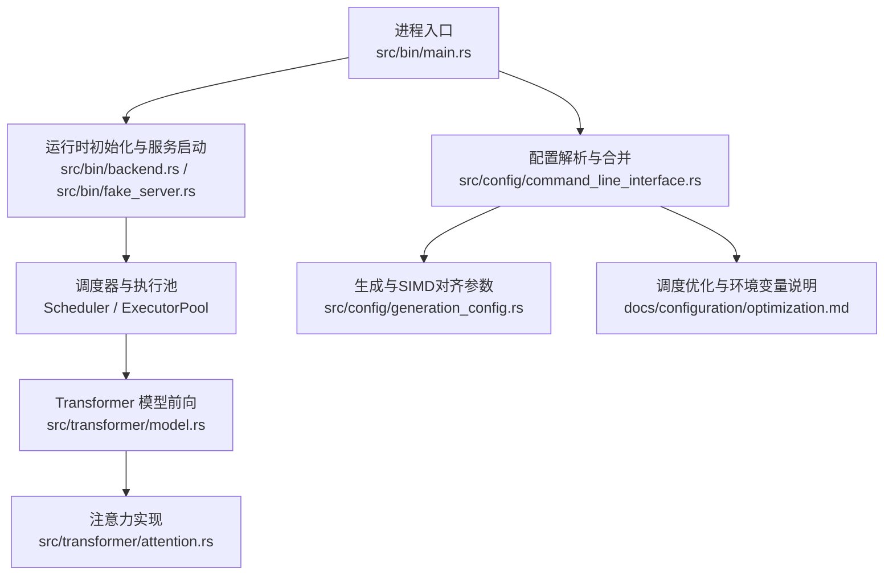
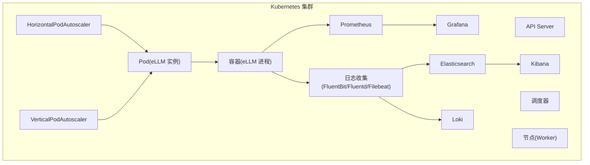
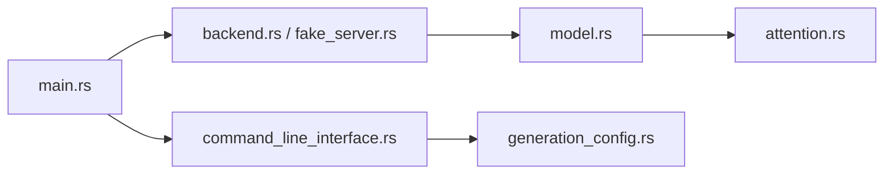

# 自动扩缩容和监控

<cite>
**本文引用的文件**   
- [README.md](file://README.md)
- [main.rs](file://src/bin/main.rs)
- [backend.rs](file://src/bin/backend.rs)
- [fake_server.rs](file://src/bin/fake_server.rs)
- [command_line_interface.rs](file://src/config/command_line_interface.rs)
- [generation_config.rs](file://src/config/generation_config.rs)
- [optimization.md](file://docs/configuration/optimization.md)
- [serve.md](file://docs/cli/serve.md)
- [model.rs](file://src/transformer/model.rs)
- [attention.rs](file://src/transformer/attention.rs)
</cite>

## 目录
1. [简介](#简介)
2. [项目结构](#项目结构)
3. [核心组件](#核心组件)
4. [架构总览](#架构总览)
5. [详细组件分析](#详细组件分析)
6. [依赖分析](#依赖分析)
7. [性能考虑](#性能考虑)
8. [故障排查指南](#故障排查指南)
9. [结论](#结论)
10. [附录](#附录)

## 简介
本文件面向在 Kubernetes 上部署 eLLM 的运维与平台工程师，提供自动扩缩容与可观测性的完整方案。内容覆盖：
- HorizontalPodAutoscaler（HPA）基于 CPU、内存或自定义指标的扩缩策略
- VerticalPodAutoscaler（VPA）用于自动调整 Pod 资源请求
- Prometheus + Grafana 指标采集与告警
- 日志收集方案（EFK 或 Loki）
- 健康检查探针（Readiness/Liveness/Startup）配置
- 性能基准测试与容量规划建议

eLLM 是一个面向 CPU 服务器的 LLM 推理框架，强调长上下文场景下的端到端延迟优化与吞吐表现。其运行时通过多线程调度、静态 KV 缓存布局与算子队列执行路径，降低控制面开销并提升缓存命中率，适合以 Prefill 为主的长上下文负载。

章节来源
- [README.md:1-207](file://README.md#L1-L207)

## 项目结构
从运行入口到服务层的关键路径如下：
- 进程入口 main.rs 解析 CLI 参数、构建配置、初始化运行时上下文，并启动异步服务
- backend.rs 展示如何加载模型配置、构造 Scheduler/ExecutorPool 等运行时组件
- fake_server.rs 演示最小化服务流程，便于验证调度与执行链路
- 配置层 command_line_interface.rs 与 generation_config.rs 暴露大量可调参数，影响批大小、序列长度、分块大小、线程数等
- 文档 docs/configuration/optimization.md 给出调度相关的环境变量与调优建议
- docs/cli/serve.md 列出 vLLM 兼容的服务端参数（如 --max-model-len），可作为外部集成参考

图表来源
- [main.rs:1-40](file://src/bin/main.rs#L1-L40)
- [backend.rs:1-41](file://src/bin/backend.rs#L1-L41)
- [fake_server.rs:1-40](file://src/bin/fake_server.rs#L1-L40)
- [command_line_interface.rs:93-309](file://src/config/command_line_interface.rs#L93-L309)
- [generation_config.rs:54-108](file://src/config/generation_config.rs#L54-L108)
- [optimization.md:1-38](file://docs/configuration/optimization.md#L1-L38)
- [model.rs:97-140](file://src/transformer/model.rs#L97-L140)
- [attention.rs:153-183](file://src/transformer/attention.rs#L153-L183)

章节来源
- [main.rs:1-40](file://src/bin/main.rs#L1-L40)
- [backend.rs:1-41](file://src/bin/backend.rs#L1-L41)
- [fake_server.rs:1-40](file://src/bin/fake_server.rs#L1-L40)
- [command_line_interface.rs:93-309](file://src/config/command_line_interface.rs#L93-L309)
- [generation_config.rs:54-108](file://src/config/generation_config.rs#L54-L108)
- [optimization.md:1-38](file://docs/configuration/optimization.md#L1-L38)
- [model.rs:97-140](file://src/transformer/model.rs#L97-L140)
- [attention.rs:153-183](file://src/transformer/attention.rs#L153-L183)

## 核心组件
- 进程入口与运行时
  - main.rs 负责解析命令行参数、构建配置、初始化服务资源，并创建 Tokio 多核运行时来承载服务
  - backend.rs 展示了加载模型配置、构建 Scheduler 与 ExecutorPool 的方式
  - fake_server.rs 提供了最小化的服务示例，便于快速验证调度与执行链路
- 配置与生成参数
  - command_line_interface.rs 定义了大量 CLI 与序列化字段，涵盖模型、量化、调度、下载目录、随机种子等
  - generation_config.rs 包含 top_k/top_k_simd 对齐、SIMD 宽度计算等生成期参数
- 调度与执行
  - 通过 Scheduler 管理批次与槽位，ExecutorPool 将 Operator 任务分发到工作线程执行
  - attention.rs 中根据线程数进行并行注意力计算，体现 CPU 侧的多核利用方式
- 文档与调优
  - optimization.md 提供环境变量驱动的调度优化建议，包括 batch_size、sequence_length、chunk_size、schedule_timeout_ms 等

章节来源
- [main.rs:1-40](file://src/bin/main.rs#L1-L40)
- [backend.rs:1-41](file://src/bin/backend.rs#L1-L41)
- [fake_server.rs:1-40](file://src/bin/fake_server.rs#L1-L40)
- [command_line_interface.rs:93-309](file://src/config/command_line_interface.rs#L93-L309)
- [generation_config.rs:54-108](file://src/config/generation_config.rs#L54-L108)
- [attention.rs:153-183](file://src/transformer/attention.rs#L153-L183)
- [optimization.md:1-38](file://docs/configuration/optimization.md#L1-L38)

## 架构总览
下图展示 eLLM 在 Kubernetes 中的整体部署与可观测性架构，包括 HPA/VPA、Prometheus/Grafana、日志栈与健康探针。

[此图为概念性架构图，不直接映射具体源码文件]

## 详细组件分析

### HPA 配置与扩缩策略
- 目标对象
  - 使用 Deployment 或 StatefulSet 托管 eLLM 进程（由 main.rs 启动）
  - 为 Pod 设置合理的 requests/limits（CPU、内存），以便 HPA 能读取资源利用率
- 扩缩指标
  - CPU 利用率：适用于 CPU 密集型推理场景
  - 内存利用率：当 KV 缓存随上下文增长导致内存占用波动时启用
  - 自定义指标：若应用暴露了 QPS、TTFT、TPOT 等指标，可通过 metrics-server 或自定义指标适配器接入
- 行为参数
  - minReplicas/maxReplicas：控制副本范围
  - targetCPUUtilizationPercentage/targetMemoryUtilizationPercentage：阈值触发扩缩
  - behavior.scaleUp/scaleDown：稳定窗口与冷却时间，避免抖动
- 与 eLLM 参数的联动
  - 通过环境变量 ELLM_BATCH_SIZE、ELLM_SEQUENCE_LENGTH、ELLM_CHUNK_SIZE、ELLM_SCHEDULE_TIMEOUT_MS 调节吞吐与延迟
  - 结合 HPA 阈值，可在低负载时缩小副本，高负载时扩大副本

章节来源
- [optimization.md:1-38](file://docs/configuration/optimization.md#L1-L38)
- [main.rs:1-40](file://src/bin/main.rs#L1-L40)

### VPA 使用与资源请求优化
- 作用
  - 自动调整 Pod 的 requests/limits，使资源分配更贴近实际消耗，减少 OOM 与资源浪费
- 模式
  - RecommendationOnly：仅推荐，不自动修改
  - Auto：自动更新 requests/limits（生产环境谨慎启用）
- 关键参数
  - minAllowed/maxAllowed：限制资源边界
  - updateMode：滚动更新策略
  - resourcePolicy：针对 CPU/内存分别设定上下限
- 与 eLLM 的关系
  - eLLM 的 KV 缓存与批大小会显著影响内存需求；VPA 可根据历史峰值动态上调内存 requests，配合 HPA 实现“横向扩容+纵向调参”的组合

章节来源
- [optimization.md:1-38](file://docs/configuration/optimization.md#L1-L38)

### Prometheus 与 Grafana 监控
- 指标采集
  - 在 eLLM 进程中暴露 HTTP 指标端点（例如 /metrics），供 Prometheus 抓取
  - 关键指标建议：
    - 系统级：CPU 使用率、内存使用量、GC 次数（如适用）、磁盘 IO
    - 应用级：QPS、P95/P99 延迟、TTFT、TPOT、KV 缓存命中/未命中、调度等待时间、算子执行耗时
- 告警规则
  - 延迟类：P99 > 阈值持续 N 分钟
  - 错误率：HTTP 5xx 比例超过阈值
  - 资源类：CPU/内存使用率长期高于阈值
  - 业务类：TTFT/TPOT 异常升高
- 可视化
  - 在 Grafana 中创建仪表盘，按模型名、租户、批次维度聚合展示

章节来源
- [serve.md:320-498](file://docs/cli/serve.md#L320-L498)

### 日志收集方案（EFK 或 Loki）
- Fluentd/FluentBit/Filebeat
  - 作为 DaemonSet 部署在每个节点，收集容器标准输出与文件日志
  - 支持结构化 JSON 输出，便于下游检索与分析
- EFK 栈
  - Elasticsearch：存储与索引
  - Kibana：查询与可视化
- Loki 栈
  - 轻量、低成本，适合大规模日志
  - 可与 Promtail 配合，标签化索引
- 最佳实践
  - 统一日志格式（JSON），包含 request_id、model_name、batch_size、latency 等字段
  - 合理设置轮转与保留策略，控制存储成本

章节来源
- [serve.md:320-498](file://docs/cli/serve.md#L320-L498)

### 健康检查探针（Readiness/Liveness/Startup）
- Readiness
  - 探测服务是否已准备好接收流量（例如 /ready 返回 200）
  - 用于 Pod 加入 Service 负载均衡
- Liveness
  - 探测进程是否存活（例如 /healthz 返回 200）
  - 失败则重启容器，恢复异常状态
- Startup
  - 针对冷启动较长的场景，避免 Liveness 误杀
  - 在模型加载完成后再开启 Liveness
- 与 eLLM 的关系
  - main.rs 启动后需确保指标端点与探针端点可用，探针应覆盖模型加载阶段

章节来源
- [main.rs:1-40](file://src/bin/main.rs#L1-L40)

### 性能基准测试与容量规划
- 基准指标
  - TTFT（首 token 延迟）、TPOT（每 token 延迟）、QPS、P95/P99 延迟
- 测试方法
  - 短上下文：关注 Decode 阶段的 TPOT
  - 长上下文：关注 Prefill 阶段的 TTFT 与端到端延迟
- 容量规划
  - 依据单 Pod 的 CPU/内存峰值与期望 QPS，估算副本数量
  - 结合 HPA 阈值与 VPA 建议，动态调整资源与副本
- 与 eLLM 特性的关联
  - 静态 KV 缓存与头内注意力执行路径有助于降低控制面开销，提高缓存命中率
  - 通过 ELLM_BATCH_SIZE、ELLM_SEQUENCE_LENGTH、ELLM_CHUNK_SIZE 等环境变量调优

章节来源
- [README.md:133-140](file://README.md#L133-L140)
- [optimization.md:1-38](file://docs/configuration/optimization.md#L1-L38)

## 依赖分析
下图展示进程入口、配置、运行时与模型层的依赖关系。

图表来源
- [main.rs:1-40](file://src/bin/main.rs#L1-L40)
- [backend.rs:1-41](file://src/bin/backend.rs#L1-L41)
- [fake_server.rs:1-40](file://src/bin/fake_server.rs#L1-L40)
- [command_line_interface.rs:93-309](file://src/config/command_line_interface.rs#L93-L309)
- [generation_config.rs:54-108](file://src/config/generation_config.rs#L54-L108)
- [model.rs:97-140](file://src/transformer/model.rs#L97-L140)
- [attention.rs:153-183](file://src/transformer/attention.rs#L153-L183)

章节来源
- [main.rs:1-40](file://src/bin/main.rs#L1-L40)
- [backend.rs:1-41](file://src/bin/backend.rs#L1-L41)
- [fake_server.rs:1-40](file://src/bin/fake_server.rs#L1-L40)
- [command_line_interface.rs:93-309](file://src/config/command_line_interface.rs#L93-L309)
- [generation_config.rs:54-108](file://src/config/generation_config.rs#L54-L108)
- [model.rs:97-140](file://src/transformer/model.rs#L97-L140)
- [attention.rs:153-183](file://src/transformer/attention.rs#L153-L183)

## 性能考虑
- 批大小与序列长度
  - 增大 ELLM_BATCH_SIZE 与 ELLM_SEQUENCE_LENGTH 可提升吞吐，但会增加内存占用
- 分块大小与调度超时
  - 较小的 ELLM_CHUNK_SIZE 可降低 TTFT，较大的值有利于吞吐
  - ELLM_SCHEDULE_TIMEOUT_MS 影响低负载时的响应速度
- 线程与并行度
  - attention.rs 中使用 num_cpus::get() 决定并行度，确保与节点 CPU 核数匹配
- 缓存与内存布局
  - 静态 KV 缓存与连续访问模式有助于提高缓存命中率，降低 TLB 缺失
- 监控与告警
  - 建立 P95/P99 延迟与错误率告警，结合 HPA 阈值形成闭环

章节来源
- [optimization.md:1-38](file://docs/configuration/optimization.md#L1-L38)
- [attention.rs:153-183](file://src/transformer/attention.rs#L153-L183)

## 故障排查指南
- 启动失败
  - 检查 main.rs 是否正确解析 CLI 参数与配置文件
  - 确认后端初始化逻辑（backend.rs）中模型路径与权限正确
- 服务不可用
  - 查看 Readiness 探针是否成功，确认 /ready 端点可达
  - 检查 Liveness 探针是否频繁失败，必要时引入 Startup 探针
- 性能退化
  - 观察 Prometheus 指标：QPS、延迟分布、CPU/内存使用率
  - 调整 ELLM_BATCH_SIZE、ELLM_SEQUENCE_LENGTH、ELLM_CHUNK_SIZE 等环境变量
- 日志问题
  - 确认日志收集器（Fluentd/FluentBit/Filebeat）正常运行
  - 校验日志格式与标签，确保在 Kibana/Loki 中可检索

章节来源
- [main.rs:1-40](file://src/bin/main.rs#L1-L40)
- [backend.rs:1-41](file://src/bin/backend.rs#L1-L41)
- [fake_server.rs:1-40](file://src/bin/fake_server.rs#L1-L40)
- [serve.md:320-498](file://docs/cli/serve.md#L320-L498)

## 结论
通过将 eLLM 与 HPA/VPA、Prometheus/Grafana、日志栈与健康探针整合，可以在 Kubernetes 上实现弹性伸缩与全面可观测性。结合 eLLM 的调度优化参数与 CPU 特性，能够在长上下文场景中取得更好的端到端延迟与吞吐表现。建议在灰度环境中逐步调整 HPA 阈值与 VPA 策略，并通过基准测试验证容量规划结果。

## 附录
- 常用环境变量与参数
  - ELLM_BATCH_SIZE、ELLM_SEQUENCE_LENGTH、ELLM_CHUNK_SIZE、ELLM_SCHEDULE_TIMEOUT_MS
  - CLI 参数如 --max-model-len、--runner、--quantization 等（参考 serve.md）
- 指标与告警清单
  - 延迟：P95/P99、TTFT、TPOT
  - 错误率：HTTP 5xx 比例
  - 资源：CPU/内存使用率
  - 业务：QPS、KV 缓存命中率

章节来源
- [optimization.md:1-38](file://docs/configuration/optimization.md#L1-L38)
- [serve.md:320-498](file://docs/cli/serve.md#L320-L498)