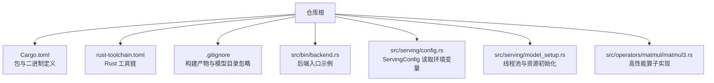
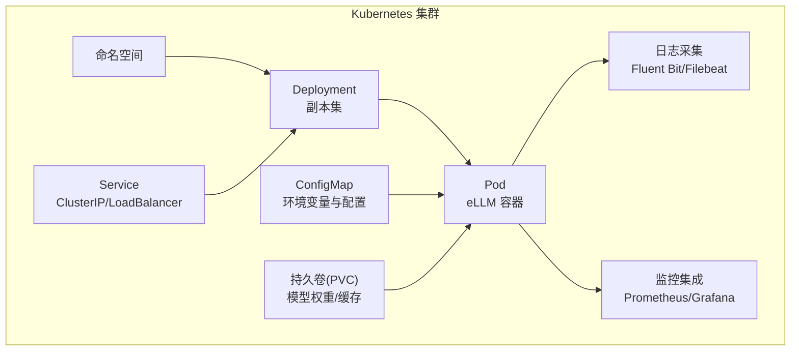
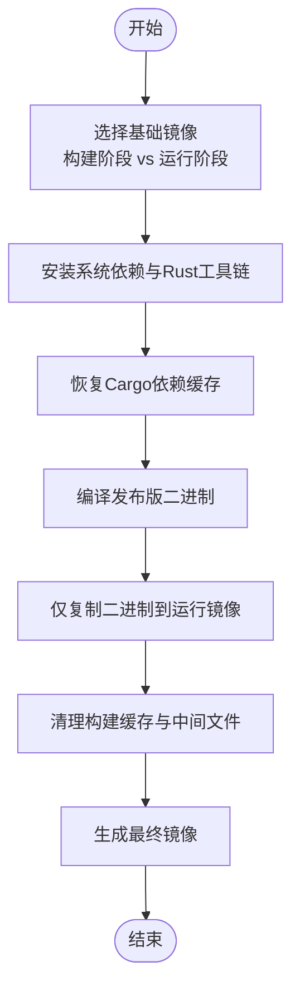
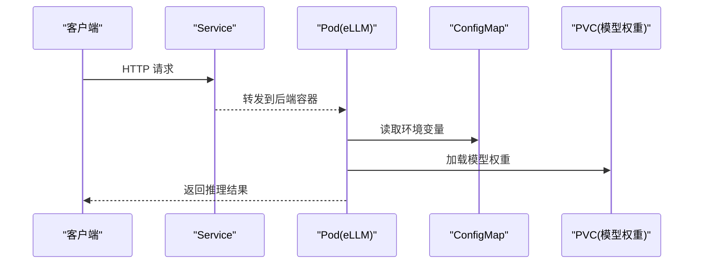
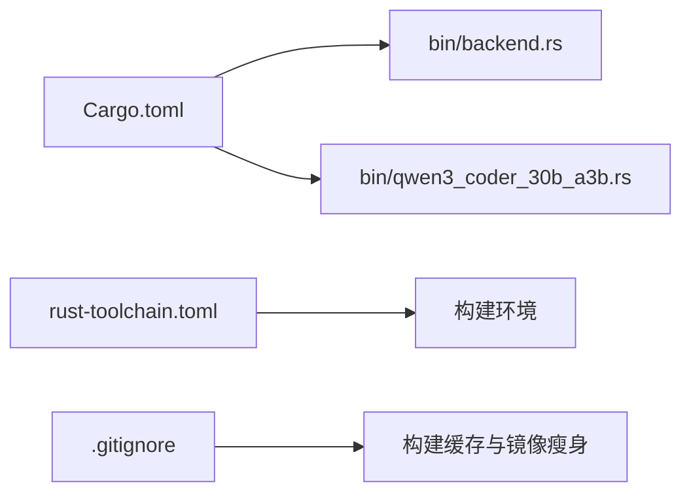

# 容器化部署

<cite>
**本文引用的文件**   
- [README.md](file://README.md)
- [Cargo.toml](file://Cargo.toml)
- [rust-toolchain.toml](file://rust-toolchain.toml)
- [.gitignore](file://.gitignore)
- [docs/configuration/env_vars.md](file://docs/configuration/env_vars.md)
- [docs/configuration/optimization.md](file://docs/configuration/optimization.md)
- [src/serving/config.rs](file://src/serving/config.rs)
- [src/serving/model_setup.rs](file://src/serving/model_setup.rs)
- [src/bin/backend.rs](file://src/bin/backend.rs)
- [src/bin/qwen3_coder_30b_a3b.rs](file://src/bin/qwen3_coder_30b_a3b.rs)
- [src/operators/matmul/matmul3.rs](file://src/operators/matmul/matmul3.rs)
</cite>

## 目录
1. [简介](#简介)
2. [项目结构](#项目结构)
3. [核心组件](#核心组件)
4. [架构总览](#架构总览)
5. [详细组件分析](#详细组件分析)
6. [依赖分析](#依赖分析)
7. [性能考虑](#性能考虑)
8. [故障排查指南](#故障排查指南)
9. [结论](#结论)
10. [附录](#附录)

## 简介
本指南面向在 CPU 服务器上以容器化方式部署 eLLM 推理服务的工程师与运维人员。eLLM 专为 CPU 服务器（Xeon/EPYC）优化，强调“以存换算”的静态计算图、固定形状 KV Cache、逐头注意力执行等设计，适合超长上下文、低延迟优先的在线服务场景。本文围绕以下目标展开：
- Docker 镜像构建流程与多阶段构建优化
- Dockerfile 最佳实践与镜像体积优化
- 容器资源配置（CPU/内存限制、存储卷挂载）
- Kubernetes 部署清单（Deployment、Service、ConfigMap）
- Helm Chart 创建与自定义
- 资源调度策略与亲和性配置
- 容器网络与服务发现
- 日志收集与监控集成
- 容器安全与合规
- 水平扩缩容与自动扩缩容策略

## 项目结构
仓库为 Rust 工程，提供二进制可执行产物与库，包含推理运行时、算子实现、HTTP 服务入口以及大量对齐测试脚本。与容器化相关的关键信息包括：
- 包名与产物：通过 Cargo 元数据定义包名、库类型与二进制入口
- 工具链：使用 rust-toolchain 指定工具链版本
- 忽略规则：排除 target、models 等生成或大体积目录，利于构建缓存与镜像瘦身
- 运行参数：通过环境变量控制批大小、序列长度、分块大小与调度超时等

图表来源
- [Cargo.toml:1-40](file://Cargo.toml#L1-L40)
- [rust-toolchain.toml](file://rust-toolchain.toml)
- [.gitignore:1-46](file://.gitignore#L1-L46)
- [src/bin/backend.rs:145-187](file://src/bin/backend.rs#L145-L187)
- [src/serving/config.rs](file://src/serving/config.rs)
- [src/serving/model_setup.rs](file://src/serving/model_setup.rs)
- [src/operators/matmul/matmul3.rs:61-100](file://src/operators/matmul/matmul3.rs#L61-L100)

章节来源
- [Cargo.toml:1-40](file://Cargo.toml#L1-L40)
- [rust-toolchain.toml](file://rust-toolchain.toml)
- [.gitignore:1-46](file://.gitignore#L1-L46)
- [docs/configuration/env_vars.md:1-45](file://docs/configuration/env_vars.md#L1-L45)
- [docs/configuration/optimization.md:1-95](file://docs/configuration/optimization.md#L1-L95)

## 核心组件
- 服务配置与环境变量
  - 所有运行时参数由 ServingConfig 从环境变量读取，未设置时回退到内置默认值
  - 关键变量：ELLM_BATCH_SIZE、ELLM_SEQUENCE_LENGTH、ELLM_CHUNK_SIZE、ELLM_SCHEDULE_TIMEOUT_MS
- 线程与资源
  - 工作线程数由 determine_thread_config() 自动计算，基于 CPU 总数减去异步线程数
  - 异步线程数固定为 2（Tokio 运行时）
- 二进制入口与调度
  - backend.rs 中展示如何根据物理核心数限制线程数、构建模型、初始化调度器与执行器池
  - qwen3_coder_30b_a3b.rs 展示了类似的初始化流程与线程设置

章节来源
- [docs/configuration/env_vars.md:1-45](file://docs/configuration/env_vars.md#L1-L45)
- [docs/configuration/optimization.md:1-95](file://docs/configuration/optimization.md#L1-L95)
- [src/serving/config.rs](file://src/serving/config.rs)
- [src/serving/model_setup.rs](file://src/serving/model_setup.rs)
- [src/bin/backend.rs:145-187](file://src/bin/backend.rs#L145-L187)
- [src/bin/qwen3_coder_30b_a3b.rs:221-270](file://src/bin/qwen3_coder_30b_a3b.rs#L221-L270)

## 架构总览
下图给出容器化部署的高层视图：Kubernetes 集群中的 Pod 运行 eLLM 二进制，通过 Service 暴露 HTTP API；模型权重通过持久卷挂载进入容器；日志与指标通过 Sidecar 或 DaemonSet 采集。

[此图为概念性架构图，不直接映射具体源码文件]

## 详细组件分析

### Docker 镜像构建与多阶段优化
- 构建环境
  - 使用官方 Rust 镜像作为构建阶段，确保工具链一致性与缓存命中
  - 利用 .cargo/config.toml 与 Cargo 缓存目录提升增量构建效率
- 多阶段构建建议
  - 构建阶段：安装系统依赖、下载依赖、编译发布版二进制
  - 运行阶段：仅拷贝最终二进制与必要运行时库，最小化镜像体积
- 镜像瘦身技巧
  - 使用 distroless 或 alpine 作为基础镜像
  - 合并 RUN 指令、清理构建缓存、避免将 models/ 与 target/ 打入镜像
  - 使用 .dockerignore 排除无关文件（如 tests、alignment、third_party）

[此图为概念性流程图，不直接映射具体源码文件]

### Dockerfile 最佳实践与镜像大小优化
- 分层策略
  - 将依赖安装与代码编译分层，最大化缓存命中率
  - 运行镜像只包含必要的运行时库与二进制
- 安全与最小权限
  - 使用非 root 用户运行进程
  - 关闭不必要的系统功能，启用只读根文件系统
- 可观测性
  - 预装轻量级日志与指标采集客户端
  - 暴露健康检查端点并返回就绪状态

[本节为通用指导，不直接分析具体文件]

### 容器资源配置（CPU/内存/存储）
- CPU 限制
  - 结合 determine_thread_config() 的计算结果，合理设置 requests/limits 的 CPU 值，避免过度超卖导致抖动
- 内存限制
  - 依据 ELLM_SEQUENCE_LENGTH 与 batch_size 估算 KV Cache 与中间张量占用，预留足够内存
- 存储卷挂载
  - 将模型权重目录挂载为持久卷，避免每次启动重复拉取
  - 可选：将 KV Cache 或临时输出写入本地盘以提升吞吐

章节来源
- [docs/configuration/env_vars.md:1-45](file://docs/configuration/env_vars.md#L1-L45)
- [src/serving/model_setup.rs](file://src/serving/model_setup.rs)

### Kubernetes 部署清单（Deployment、Service、ConfigMap）
- ConfigMap
  - 集中管理环境变量（如 ELLM_BATCH_SIZE、ELLM_SEQUENCE_LENGTH、ELLM_CHUNK_SIZE、ELLM_SCHEDULE_TIMEOUT_MS）
- Deployment
  - 设置容器镜像、资源请求/限制、探针、卷挂载
  - 使用滚动更新与回滚策略保障稳定性
- Service
  - 暴露 ClusterIP 供内部调用，或使用 LoadBalancer/Ingress 对外提供服务

[此图为概念性序列图，不直接映射具体源码文件]

### Helm Chart 创建与自定义
- Chart 结构
  - values.yaml：集中存放可调参数（副本数、资源限制、环境变量、卷路径等）
  - templates/deployment.yaml、service.yaml、configmap.yaml：模板化生成 K8s 对象
- 自定义方法
  - 通过 --set 或 -f 覆盖 values
  - 按环境拆分 values（dev/staging/prod），统一 Chart 复用

[本节为通用指导，不直接分析具体文件]

### 资源调度策略与亲和性配置
- 节点亲和性
  - 针对支持 AMX 的 CPU 节点设置标签，并通过 nodeAffinity 绑定
- 拓扑感知
  - 使用 topologySpreadConstraints 均衡跨可用区分布
- 反亲和性
  - 在同一节点上分散同一应用的多个副本，提高可用性

[本节为通用指导，不直接分析具体文件]

### 容器网络配置与服务发现
- 服务发现
  - 使用 Service 名称进行 DNS 解析，避免硬编码 IP
- 网络策略
  - 通过 NetworkPolicy 限制入站/出站流量，遵循最小权限原则
- 外部访问
  - 使用 Ingress 或 LoadBalancer 暴露 HTTP API，配合 TLS 终止

[本节为通用指导，不直接分析具体文件]

### 容器日志收集与监控集成
- 日志
  - 应用输出结构化 JSON 日志至 stdout/stderr
  - 使用 Fluent Bit/Filebeat 采集并转发至日志平台
- 指标
  - 暴露 Prometheus 指标端点，抓取后入库 Grafana 可视化
- 健康检查
  - 实现 /healthz 与 /readyz 端点，配合 Liveness/Readiness 探针

[本节为通用指导，不直接分析具体文件]

### 容器安全配置与最佳实践
- 镜像安全
  - 定期扫描镜像漏洞，签名与校验
- 运行时安全
  - 非 root 用户、只读根文件系统、禁用特权模式
- 密钥管理
  - 使用 Secret 管理敏感信息，避免明文写入镜像或配置

[本节为通用指导，不直接分析具体文件]

### 水平扩缩容与自动扩缩容策略
- 水平扩缩容（HPA）
  - 基于 CPU/内存利用率或自定义指标（如 QPS、TTFT）触发扩缩容
- 垂直扩缩容（VPA）
  - 根据历史负载调整资源请求/限制，辅助容量规划
- 弹性策略
  - 设置合理的伸缩阈值与冷却时间，避免频繁抖动

[本节为通用指导，不直接分析具体文件]

## 依赖分析
- 包与二进制
  - Cargo.toml 定义了包名、库类型与多个二进制目标，便于在不同场景下分发
- 工具链
  - rust-toolchain.toml 锁定工具链版本，保证构建一致性
- 忽略规则
  - .gitignore 排除了 target、models 等大体积目录，有助于 CI/CD 与镜像构建

图表来源
- [Cargo.toml:1-40](file://Cargo.toml#L1-L40)
- [src/bin/backend.rs:145-187](file://src/bin/backend.rs#L145-L187)
- [src/bin/qwen3_coder_30b_a3b.rs:221-270](file://src/bin/qwen3_coder_30b_a3b.rs#L221-L270)
- [rust-toolchain.toml](file://rust-toolchain.toml)
- [.gitignore:1-46](file://.gitignore#L1-L46)

章节来源
- [Cargo.toml:1-40](file://Cargo.toml#L1-L40)
- [rust-toolchain.toml](file://rust-toolchain.toml)
- [.gitignore:1-46](file://.gitignore#L1-L46)

## 性能考虑
- 长上下文与 Prefill
  - eLLM 采用静态 KV Cache 与逐头注意力执行，减少重复 I/O 与控制开销，有利于降低首 token 延迟
- 短上下文与 Decode
  - 在 CPU 上小批量、低并行度场景下，函数调用路径避免了内核启动开销，执行更稳定
- 调优要点
  - 通过 ELLM_CHUNK_SIZE 与 ELLM_BATCH_SIZE 平衡延迟与吞吐
  - 增大 ELLM_SEQUENCE_LENGTH 以支持更长上下文，注意线性增长的内存占用
  - 根据实际负载调整调度超时，保障突发低负载下的响应性

章节来源
- [README.md:123-182](file://README.md#L123-L182)
- [docs/configuration/env_vars.md:1-45](file://docs/configuration/env_vars.md#L1-L45)
- [docs/configuration/optimization.md:1-95](file://docs/configuration/optimization.md#L1-L95)

## 故障排查指南
- 常见问题定位
  - 环境变量未生效：确认 ServingConfig 读取逻辑与默认值回退
  - 线程数异常：检查 determine_thread_config() 的计算与物理核心限制
  - 模型加载失败：验证持久卷挂载路径与权限
- 诊断步骤
  - 查看容器日志与探针状态
  - 核对 K8s 事件与资源配额
  - 使用 kubectl describe 与 exec 进入容器进行内网连通性测试

章节来源
- [src/serving/config.rs](file://src/serving/config.rs)
- [src/serving/model_setup.rs](file://src/serving/model_setup.rs)
- [src/bin/backend.rs:145-187](file://src/bin/backend.rs#L145-L187)

## 结论
eLLM 在 CPU 服务器上的推理能力与长上下文优势显著，结合容器化与 Kubernetes 编排可实现高可用、可扩展的服务交付。通过合理的镜像构建、资源配置、网络与安全策略，以及完善的日志监控与自动扩缩容机制，能够在生产环境中稳定支撑低延迟、高吞吐的在线推理需求。

## 附录
- 参考文档
  - README 中对硬件要求、优势与实验分析的说明
  - 环境变量与优化配置的详细说明
- 快速上手
  - 通过环境变量与 CLI 参数完成基本部署
  - 使用持久卷挂载模型权重，开启健康检查与指标采集

章节来源
- [README.md:1-207](file://README.md#L1-L207)
- [docs/configuration/env_vars.md:1-45](file://docs/configuration/env_vars.md#L1-L45)
- [docs/configuration/optimization.md:1-95](file://docs/configuration/optimization.md#L1-L95)