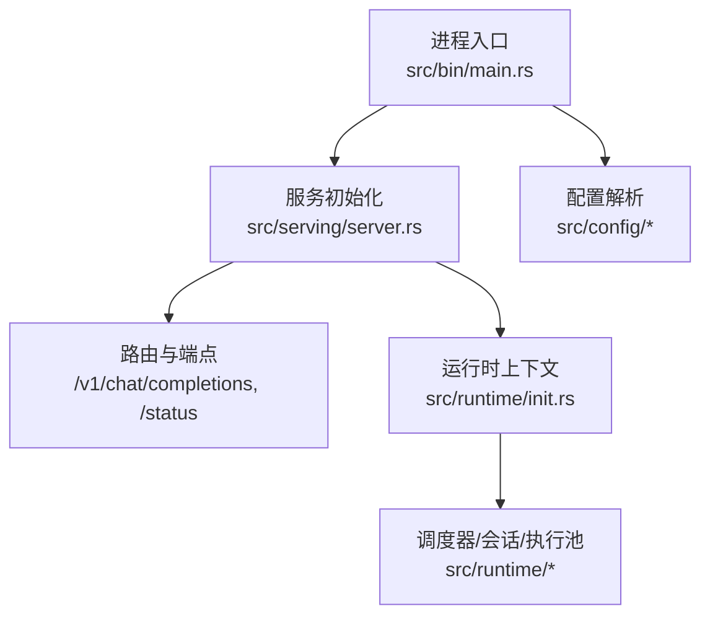
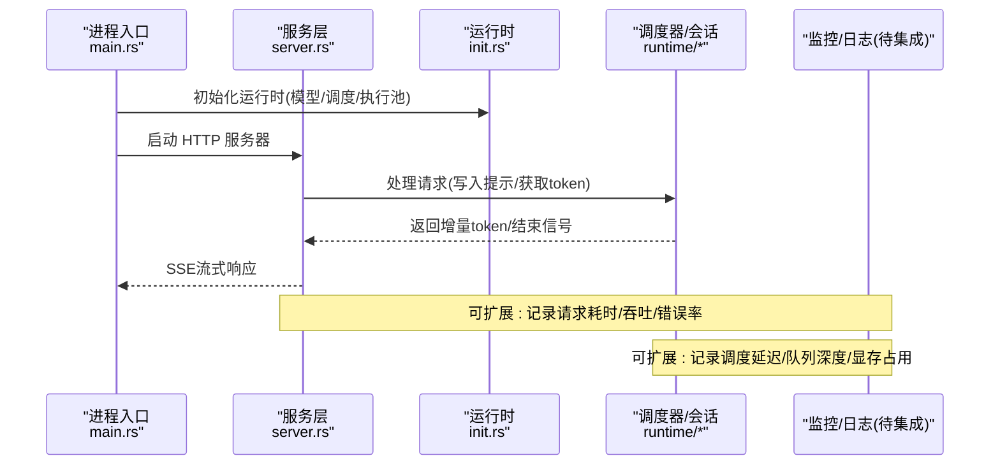
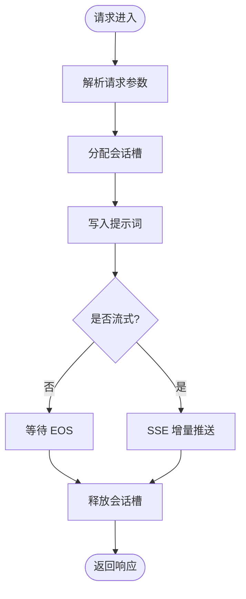
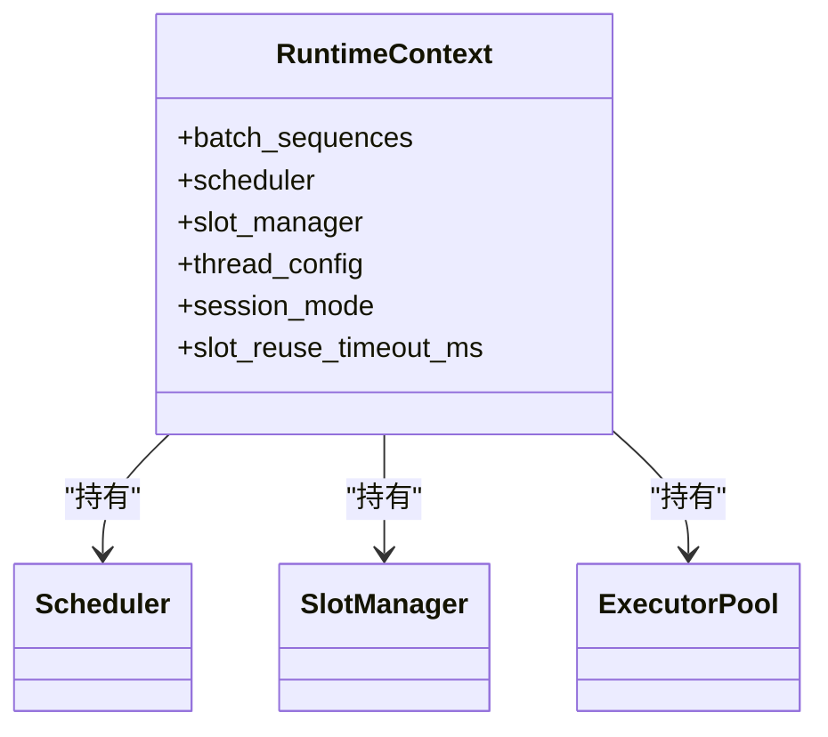
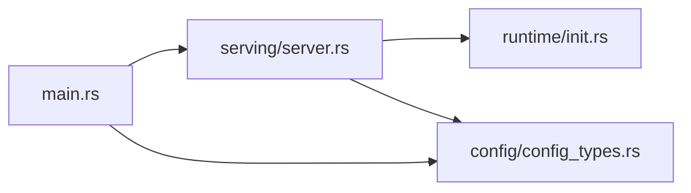

# 监控与日志

<cite>
**本文引用的文件**
- [Cargo.toml](file://Cargo.toml)
- [src/bin/main.rs](file://src/bin/main.rs)
- [src/serving/server.rs](file://src/serving/server.rs)
- [src/config/config_types.rs](file://src/config/config_types.rs)
- [src/config/mod.rs](file://src/config/mod.rs)
- [src/runtime/init.rs](file://src/runtime/init.rs)
- [src/runtime/mod.rs](file://src/runtime/mod.rs)
- [src/serving/error.rs](file://src/serving/error.rs)
- [docs/cli/serve.md](file://docs/cli/serve.md)
</cite>

## 目录
1. [简介](#简介)
2. [项目结构](#项目结构)
3. [核心组件](#核心组件)
4. [架构总览](#架构总览)
5. [详细组件分析](#详细组件分析)
6. [依赖分析](#依赖分析)
7. [性能考虑](#性能考虑)
8. [故障排查指南](#故障排查指南)
9. [结论](#结论)
10. [附录](#附录)

## 简介
本指南面向在 eLLM 项目中落地“监控与日志”的工程师，目标是：
- 说明如何暴露和采集 Prometheus 指标（含自定义业务指标）
- 设计 Grafana 仪表板并可视化关键性能指标
- 配置结构化日志（级别控制、输出格式）
- 集成 ELK Stack（Elasticsearch、Logstash、Kibana）
- 实现分布式追踪（OpenTelemetry/Jaeger）
- 配置告警规则与通知渠道
- 容器日志收集与聚合最佳实践
- 性能监控与故障诊断工具链
- 监控数据保留策略与成本优化

本项目当前为 Rust 实现的推理服务，HTTP 层基于 Axum，运行时包含调度器、会话槽管理、算子执行池等。文档将结合现有代码路径给出可落地的方案与扩展点。

## 项目结构
与监控与日志相关的关键位置：
- HTTP 服务入口与路由：src/serving/server.rs
- 进程启动与 Tokio 运行时：src/bin/main.rs
- 配置模型（含服务参数）：src/config/config_types.rs
- 运行时初始化（调度器、会话、执行池）：src/runtime/init.rs
- CLI 文档中关于日志与访问日志的参数说明：docs/cli/serve.md

图表来源
- [src/bin/main.rs:1-41](file://src/bin/main.rs#L1-L41)
- [src/serving/server.rs:1-312](file://src/serving/server.rs#L1-L312)
- [src/runtime/init.rs:1-136](file://src/runtime/init.rs#L1-L136)
- [src/config/mod.rs:1-15](file://src/config/mod.rs#L1-L15)

章节来源
- [src/bin/main.rs:1-41](file://src/bin/main.rs#L1-L41)
- [src/serving/server.rs:1-312](file://src/serving/server.rs#L1-L312)
- [src/runtime/init.rs:1-136](file://src/runtime/init.rs#L1-L136)
- [src/config/mod.rs:1-15](file://src/config/mod.rs#L1-L15)

## 核心组件
- HTTP 服务与路由
  - 提供 OpenAI 兼容聊天完成接口与健康检查端点
  - 支持流式响应（SSE），便于实时观测生成进度
- 运行时上下文
  - 负责加载模型、构建调度器、会话槽管理与执行池
  - 暴露线程数、批大小、序列长度等关键运行参数
- 配置模型
  - 定义服务监听地址/端口、请求日志开关、API Key、CORS 等
  - 提供默认值与别名映射，便于 YAML/CLI 注入

章节来源
- [src/serving/server.rs:1-312](file://src/serving/server.rs#L1-L312)
- [src/runtime/init.rs:1-136](file://src/runtime/init.rs#L1-L136)
- [src/config/config_types.rs:1-490](file://src/config/config_types.rs#L1-L490)

## 架构总览
下图展示从进程启动到请求处理的链路，以及未来接入监控与日志的扩展点。

图表来源
- [src/bin/main.rs:1-41](file://src/bin/main.rs#L1-L41)
- [src/serving/server.rs:1-312](file://src/serving/server.rs#L1-L312)
- [src/runtime/init.rs:1-136](file://src/runtime/init.rs#L1-L136)

## 详细组件分析

### 组件A：HTTP 服务与请求处理
- 职责
  - 注册路由：聊天完成与健康检查
  - 解析请求、分配会话槽、触发调度
  - 非流式等待 EOS；流式通过 SSE 推送增量 token
- 监控与日志扩展点
  - 在请求进入与退出处埋点，统计 P50/P95/P99 时延、QPS、错误码分布
  - 对 SSE 事件计数，辅助评估首字延迟与端到端延迟
  - 健康检查端点可用于外部探针与可用性告警

图表来源
- [src/serving/server.rs:100-176](file://src/serving/server.rs#L100-L176)
- [src/serving/server.rs:178-312](file://src/serving/server.rs#L178-L312)

章节来源
- [src/serving/server.rs:1-312](file://src/serving/server.rs#L1-L312)

### 组件B：运行时初始化与资源
- 职责
  - 加载模型权重与配置
  - 构建调度器、会话槽管理器、执行池
  - 预热一次前向以验证路径
- 监控与日志扩展点
  - 记录模型加载耗时、张量数量、线程配置
  - 暴露执行池任务队列长度、并发度、空闲率
  - 记录首次前向耗时作为系统就绪信号

图表来源
- [src/runtime/init.rs:21-32](file://src/runtime/init.rs#L21-L32)
- [src/runtime/init.rs:75-124](file://src/runtime/init.rs#L75-L124)

章节来源
- [src/runtime/init.rs:1-136](file://src/runtime/init.rs#L1-L136)
- [src/runtime/mod.rs:1-23](file://src/runtime/mod.rs#L1-L23)

### 组件C：配置模型与服务参数
- 关键配置项（节选）
  - 服务监听 host/port
  - 请求日志开关、API Key、CORS 白名单
  - 会话槽复用超时、并行 API 服务器数量
- 监控与日志关联
  - 通过 log_requests 控制请求级日志粒度
  - 通过 uvicorn 日志级别与访问日志过滤减少噪音（见 CLI 文档）

章节来源
- [src/config/config_types.rs:224-310](file://src/config/config_types.rs#L224-L310)
- [docs/cli/serve.md:236-252](file://docs/cli/serve.md#L236-L252)

## 依赖分析
- 当前未直接引入 Prometheus/Grafana/ELK/OpenTelemetry 等第三方库
- 可通过 Cargo 添加依赖并在服务启动阶段进行初始化
- 建议最小化侵入：以中间件/钩子的方式接入指标与日志

图表来源
- [src/bin/main.rs:1-41](file://src/bin/main.rs#L1-L41)
- [src/serving/server.rs:1-312](file://src/serving/server.rs#L1-L312)
- [src/runtime/init.rs:1-136](file://src/runtime/init.rs#L1-L136)
- [src/config/config_types.rs:1-490](file://src/config/config_types.rs#L1-L490)

章节来源
- [Cargo.toml:1-102](file://Cargo.toml#L1-L102)

## 性能考虑
- 指标采样
  - 使用指数滑动平均或直方图分位统计，避免高频打点造成开销
- 日志裁剪
  - 仅在生产环境开启 INFO 及以上级别；DEBUG 仅在问题复现时临时启用
- 流式响应
  - 对 SSE 事件进行节流与批量合并，降低网络与序列化压力
- 资源上限
  - 限制最大并发、队列长度与单次请求最大 token 数，防止雪崩

[本节为通用指导，无需源码引用]

## 故障排查指南
- 错误类型与状态码
  - 统一错误类型与 HTTP 状态码映射，便于外部监控系统抓取错误率
- 常见定位步骤
  - 查看健康检查端点确认服务存活
  - 核对请求日志中的 request_id、model、stream 标志
  - 关注调度器与执行池的队列积压与线程利用率
  - 对比首字延迟与端到端延迟，定位瓶颈在 I/O 还是计算

章节来源
- [src/serving/error.rs:39-87](file://src/serving/error.rs#L39-L87)
- [src/serving/server.rs:84-98](file://src/serving/server.rs#L84-L98)

## 结论
通过在 HTTP 层与运行时关键路径增加指标与结构化日志，并结合外部采集与可视化平台，可实现对 eLLM 服务的可观测性闭环。建议在后续迭代中优先补齐 Prometheus 指标、Grafana 看板与集中式日志管道，再逐步完善分布式追踪与告警体系。

[本节为总结，无需源码引用]

## 附录

### A. Prometheus 指标暴露与采集（建议方案）
- 指标分类
  - 请求类：请求总数、成功/失败、P50/P95/P99 时延、首字延迟、SSE 事件数
  - 资源类：CPU/内存/磁盘 IO、Tokio 线程活跃/阻塞、队列长度
  - 业务类：模型名称、会话槽占用、批大小、序列长度、KV Cache 命中率
- 暴露方式
  - 新增 /metrics 端点，导出 Prometheus 文本格式
  - 使用中间件在请求进入/退出时打点
- 采集与存储
  - 部署 Prometheus 定期拉取 /metrics
  - 设置合理 scrape_interval 与目标保留时间

[本节为概念性方案，无需源码引用]

### B. Grafana 仪表板（建议方案）
- 关键面板
  - 请求时延分布（分位线）、QPS 趋势、错误率
  - 首字延迟与时延热力图
  - 资源使用率（CPU/内存/IO）、Tokio 线程池负载
  - 业务指标：批大小、序列长度、KV Cache 命中率
- 推荐标签
  - model_name、endpoint、status_code、stream

[本节为概念性方案，无需源码引用]

### C. 结构化日志配置（建议方案）
- 日志级别
  - 生产：INFO；调试：DEBUG；严重：ERROR/WARN
- 输出格式
  - JSON 行式，包含字段：timestamp、level、service、request_id、model、latency_ms、status_code
- 输出目标
  - stdout（容器编排下由 sidecar/daemonset 收集）
  - 可选：本地文件轮转（开发/测试）

[本节为概念性方案，无需源码引用]

### D. ELK Stack 集成（建议方案）
- 采集
  - Filebeat/Fluent Bit 收集 stdout 与本地日志文件
- 处理
  - Logstash 做字段解析、脱敏、富化（如补充 IP/地区）
- 存储与检索
  - Elasticsearch 索引按天滚动，设置生命周期策略（ILM）
- 可视化
  - Kibana 创建查询与仪表盘，对接告警

[本节为概念性方案，无需源码引用]

### E. 分布式追踪（OpenTelemetry/Jaeger）
- 注入点
  - 请求进入/退出、调度开始/结束、SSE 事件发送
- 传播
  - 通过 HTTP 头传递 trace_id/span_id
- 后端
  - Jaeger 或 OTel Collector 接收并持久化

[本节为概念性方案，无需源码引用]

### F. 告警规则与通知
- 示例规则
  - 错误率 > 阈值（5 分钟窗口）
  - P95 时延 > 阈值
  - 首字延迟异常升高
  - 队列积压超过容量
- 通知渠道
  - 企业微信/钉钉/邮件/Slack

[本节为概念性方案，无需源码引用]

### G. 容器日志收集与聚合
- 最佳实践
  - 应用只写 stdout/stderr
  - 使用 DaemonSet/Sidecar 统一采集
  - 设置日志大小与轮转策略，避免节点磁盘爆满

[本节为概念性方案，无需源码引用]

### H. 性能监控与诊断工具链
- 系统层面：Prometheus Node Exporter、cAdvisor
- 应用层面：Tokio 运行时指标、Rust Profiler（perf/flamegraph）
- 网络层面：eBPF 工具（bpftrace、tetratelabs/iovis）

[本节为概念性方案，无需源码引用]

### I. 监控数据保留策略与成本优化
- 热/温/冷分层
  - 近 7 天高保真，30 天降采样，90 天归档
- 采样与降采样
  - 长周期指标采用降采样与聚合
- 索引与分片
  - 合理设置 ES 分片与副本，控制存储膨胀

[本节为概念性方案，无需源码引用]