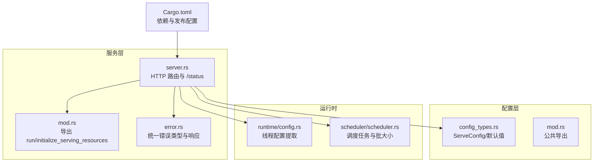
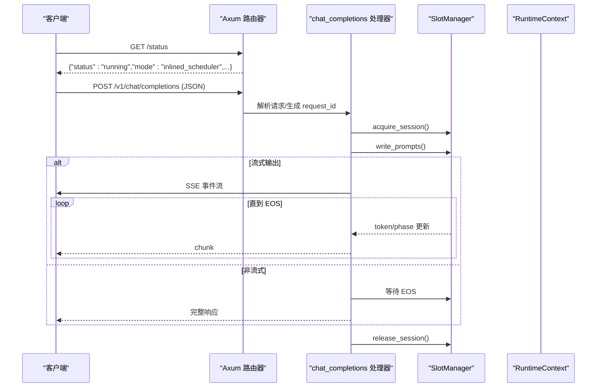
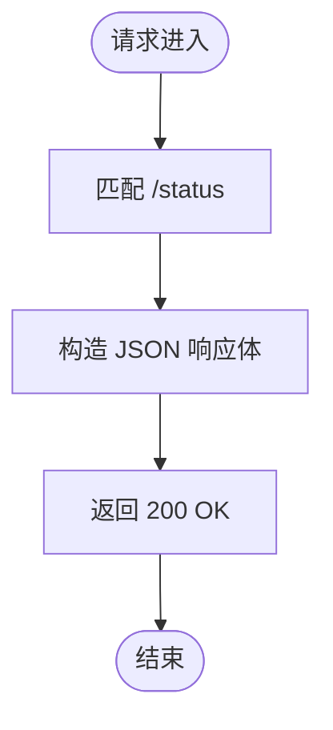
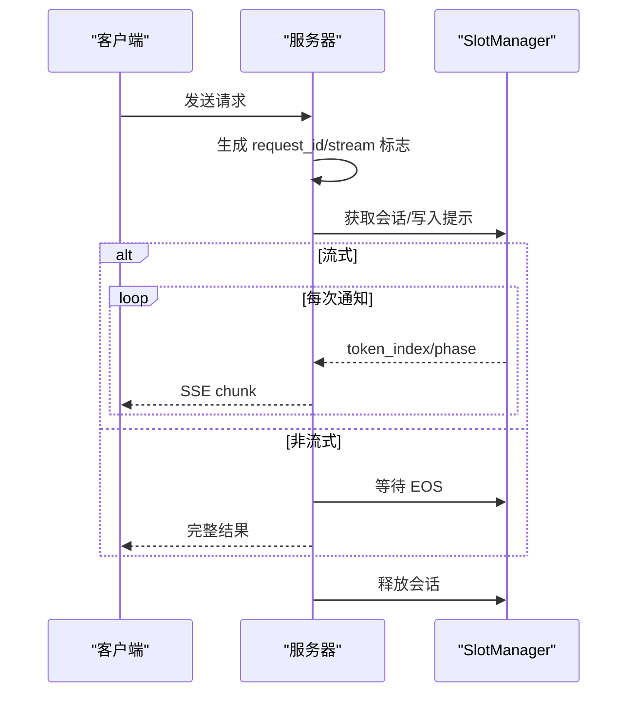
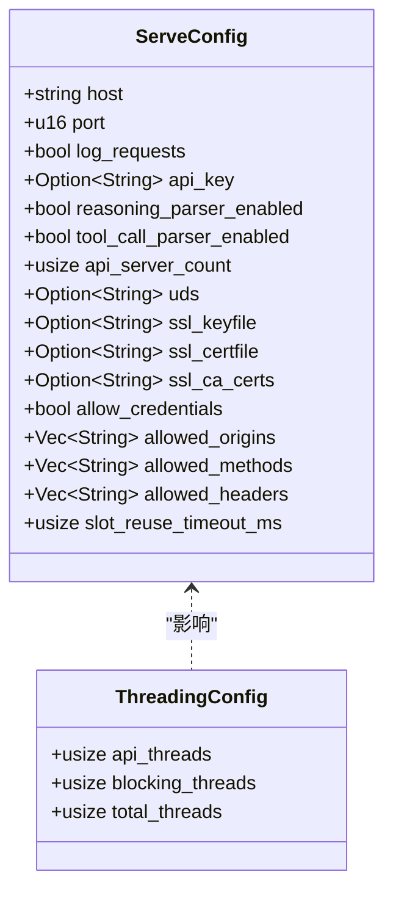
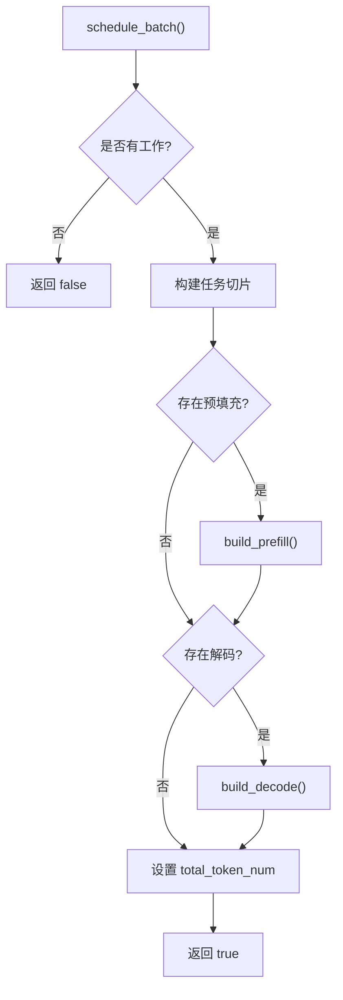
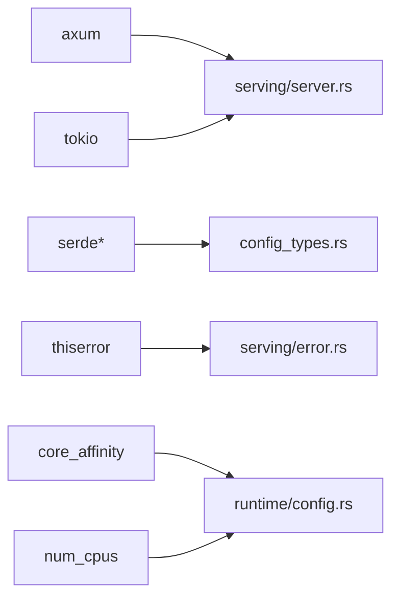

# 监控与日志

<cite>
**本文引用的文件**   
- [src/serving/server.rs](file://src/serving/server.rs)
- [src/serving/mod.rs](file://src/serving/mod.rs)
- [src/serving/error.rs](file://src/serving/error.rs)
- [src/config/config_types.rs](file://src/config/config_types.rs)
- [src/config/mod.rs](file://src/config/mod.rs)
- [src/runtime/config.rs](file://src/runtime/config.rs)
- [src/runtime/scheduler/scheduler.rs](file://src/runtime/scheduler/scheduler.rs)
- [Cargo.toml](file://Cargo.toml)
</cite>

## 目录
1. [简介](#简介)
2. [项目结构](#项目结构)
3. [核心组件](#核心组件)
4. [架构总览](#架构总览)
5. [详细组件分析](#详细组件分析)
6. [依赖关系分析](#依赖关系分析)
7. [性能考量](#性能考量)
8. [故障排查指南](#故障排查指南)
9. [结论](#结论)
10. [附录](#附录)

## 简介
本指南面向生产环境下的 eLLM 推理服务，聚焦“监控与日志”的完整落地方案。内容覆盖：
- 内置健康检查端点的使用与扩展
- 指标采集与 Prometheus/Grafana 集成路径
- 结构化日志配置与级别管理
- 分布式追踪与性能剖析工具集成
- 关键性能指标（推理延迟、吞吐、资源利用率）的监控设计
- 告警规则与通知机制
- 日志聚合与分析平台对接
- 容量规划与性能调优的指标依据
- 生产最佳实践与运维自动化建议

说明：当前仓库未内建 Prometheus 导出器或集中式日志框架，但已提供健康检查端点、请求处理流与线程/调度配置。本文基于现有代码给出最小可行方案与扩展指引，确保在不侵入核心推理路径的前提下完成可观测性建设。

## 项目结构
与监控和日志相关的代码主要分布在以下模块：
- 服务层：HTTP 路由与健康检查端点
- 配置层：服务端口、主机、请求日志开关等
- 运行时：线程模型与调度器状态（可用于指标计算）
- 构建配置：依赖库与发布优化选项

**图表来源** 
- [src/serving/server.rs:84-98](file://src/serving/server.rs#L84-L98)
- [src/serving/mod.rs:9-15](file://src/serving/mod.rs#L9-L15)
- [src/serving/error.rs:1-41](file://src/serving/error.rs#L1-L41)
- [src/config/config_types.rs:224-310](file://src/config/config_types.rs#L224-L310)
- [src/config/mod.rs:1-15](file://src/config/mod.rs#L1-L15)
- [src/runtime/config.rs:62-104](file://src/runtime/config.rs#L62-L104)
- [src/runtime/scheduler/scheduler.rs:15-82](file://src/runtime/scheduler/scheduler.rs#L15-L82)
- [Cargo.toml:42-68](file://Cargo.toml#L42-L68)

**章节来源**
- [src/serving/server.rs:25-43](file://src/serving/server.rs#L25-L43)
- [src/serving/server.rs:84-98](file://src/serving/server.rs#L84-L98)
- [src/config/config_types.rs:224-310](file://src/config/config_types.rs#L224-L310)
- [src/runtime/config.rs:62-104](file://src/runtime/config.rs#L62-L104)
- [Cargo.toml:42-68](file://Cargo.toml#L42-L68)

## 核心组件
- 健康检查端点：GET /status，返回运行状态与服务模式信息，便于探针探测与负载均衡健康判定。
- 请求处理流：POST /v1/chat/completions，支持同步与 SSE 流式输出，内部通过 SlotManager 协调会话与生成进度。
- 配置项：ServeConfig 包含 host、port、log_requests、api_key、CORS、slot 复用超时等；运行时线程数由 runtime/config 推导。
- 错误处理：ApiError 统一封装 Tokenization/SlotUnavailable/InternalError，并映射为 HTTP 状态码。

**章节来源**
- [src/serving/server.rs:84-98](file://src/serving/server.rs#L84-L98)
- [src/serving/server.rs:100-176](file://src/serving/server.rs#L100-L176)
- [src/serving/server.rs:178-311](file://src/serving/server.rs#L178-L311)
- [src/config/config_types.rs:224-310](file://src/config/config_types.rs#L224-L310)
- [src/serving/error.rs:1-41](file://src/serving/error.rs#L1-L41)

## 架构总览
下图展示从客户端到服务层的调用链，以及健康检查端点的响应流程。该链路是接入指标采集与日志记录的关键切入点。

**图表来源** 
- [src/serving/server.rs:84-98](file://src/serving/server.rs#L84-L98)
- [src/serving/server.rs:100-176](file://src/serving/server.rs#L100-L176)
- [src/serving/server.rs:178-311](file://src/serving/server.rs#L178-L311)

## 详细组件分析

### 健康检查端点与探针
- 端点：GET /status
- 用途：Kubernetes liveness/readiness、负载均衡健康探测
- 扩展建议：增加内存/CPU/队列长度等轻量指标字段，避免阻塞

**图表来源** 
- [src/serving/server.rs:84-98](file://src/serving/server.rs#L84-L98)

**章节来源**
- [src/serving/server.rs:84-98](file://src/serving/server.rs#L84-L98)

### 请求处理与流式输出
- 端点：POST /v1/chat/completions
- 功能：会话获取、提示写入、EOS 等待或 SSE 增量输出、会话释放
- 可观测性切入点：请求开始/结束时间、token 速率、阶段切换（Prefill/Decode/EOS）、错误分类

**图表来源** 
- [src/serving/server.rs:100-176](file://src/serving/server.rs#L100-L176)
- [src/serving/server.rs:178-311](file://src/serving/server.rs#L178-L311)

**章节来源**
- [src/serving/server.rs:100-176](file://src/serving/server.rs#L100-L176)
- [src/serving/server.rs:178-311](file://src/serving/server.rs#L178-L311)

### 配置与线程模型
- ServeConfig：host/port/log_requests/api_key/CORS/slot_reuse_timeout_ms 等
- 线程配置：根据 CPU 物理核数与 API 并发数推导 total_threads/api_threads/blocking_threads
- 可观测性建议：将线程分配策略与调度参数暴露为指标，便于容量规划

**图表来源** 
- [src/config/config_types.rs:224-310](file://src/config/config_types.rs#L224-L310)
- [src/runtime/config.rs:62-104](file://src/runtime/config.rs#L62-L104)

**章节来源**
- [src/config/config_types.rs:224-310](file://src/config/config_types.rs#L224-L310)
- [src/runtime/config.rs:62-104](file://src/runtime/config.rs#L62-L104)

### 调度器与批处理
- Scheduler：维护 prefill/decode 槽位、构建任务切片、控制批大小与线程分片
- 可观测性建议：统计每轮任务的 prefill_size/decode_size、total_token_num、切片数量与长度分布

**图表来源** 
- [src/runtime/scheduler/scheduler.rs:66-131](file://src/runtime/scheduler/scheduler.rs#L66-L131)
- [src/runtime/scheduler/scheduler.rs:133-222](file://src/runtime/scheduler/scheduler.rs#L133-L222)

**章节来源**
- [src/runtime/scheduler/scheduler.rs:15-82](file://src/runtime/scheduler/scheduler.rs#L15-L82)
- [src/runtime/scheduler/scheduler.rs:66-131](file://src/runtime/scheduler/scheduler.rs#L66-L131)
- [src/runtime/scheduler/scheduler.rs:133-222](file://src/runtime/scheduler/scheduler.rs#L133-L222)

## 依赖关系分析
- HTTP 框架：axum（路由、SSE、Json）
- 异步运行时：tokio（网络、同步原语）
- 配置与序列化：serde/serde_json/serde_yaml
- 其他：uuid、thiserror、core_affinity、num_cpus

**图表来源** 
- [Cargo.toml:42-68](file://Cargo.toml#L42-L68)
- [src/serving/server.rs:1-24](file://src/serving/server.rs#L1-L24)
- [src/config/config_types.rs:1-5](file://src/config/config_types.rs#L1-L5)
- [src/serving/error.rs:1-6](file://src/serving/error.rs#L1-L6)
- [src/runtime/config.rs:62-76](file://src/runtime/config.rs#L62-L76)

**章节来源**
- [Cargo.toml:42-68](file://Cargo.toml#L42-L68)

## 性能考量
- 指标采集位置建议
  - 请求级：请求开始/结束时间、状态码、错误类型、输入长度、输出 token 数
  - 生成级：prefill/decode 阶段时长、token 速率、EOS 到达时间
  - 系统级：CPU/内存/IO 使用率、线程池占用、调度器批大小与切片分布
- 低开销实现
  - 使用原子计数器与无锁环形缓冲收集高频指标
  - 在请求入口/出口埋点，避免热点路径频繁分配
  - 对 /status 等高频端点禁用访问日志以减少噪音
- 资源与线程
  - 合理设置 api_threads 与 blocking_threads，避免 I/O 阻塞影响推理
  - 结合调度器的 max_num_seqs/max_num_batched_tokens 进行容量规划

[本节为通用指导，不直接分析具体文件]

## 故障排查指南
- 快速定位
  - 查看 /status 确认服务存活与模式
  - 检查请求错误分类（Tokenization/SlotUnavailable/InternalError）
  - 关注 SSE 流是否提前终止或长时间无数据
- 常见症状与对策
  - 高延迟：检查 prefill/decode 比例、batch 大小、线程分配
  - 吞吐下降：观察调度器切片数量与长度分布，调整批上限
  - 内存压力：限制最大序列长度与 KV cache dtype，监控内存峰值
- 日志与诊断
  - 开启 log_requests 以记录请求摘要（注意脱敏）
  - 对错误堆栈按需启用，避免生产环境过度输出
  - 结合系统工具（top/htop、perf、eBPF）定位热点

**章节来源**
- [src/serving/server.rs:84-98](file://src/serving/server.rs#L84-L98)
- [src/serving/error.rs:1-41](file://src/serving/error.rs#L1-L41)
- [src/config/config_types.rs:224-310](file://src/config/config_types.rs#L224-L310)

## 结论
当前仓库提供了稳定的 HTTP 服务与健康检查能力，具备接入指标与日志的基础条件。建议在最小侵入原则下，于请求入口/出口与调度关键点采集指标，并通过侧车或中间件方式对接 Prometheus/Grafana、结构化日志与分布式追踪系统，形成完整的可观测性闭环。

[本节为总结性内容，不直接分析具体文件]

## 附录

### Prometheus 指标导出与 Grafana 仪表板集成（建议方案）
- 指标定义（示例类别）
  - 请求计数：http_requests_total{method,endpoint,status}
  - 延迟直方图：request_duration_seconds_bucket{endpoint}
  - 生成指标：tokens_generated_total{phase}, generation_latency_seconds{phase}
  - 系统指标：cpu_usage_percent,memory_bytes,thread_pool_active
  - 调度指标：scheduler_prefill_tokens,scheduler_decode_tokens,batch_size
- 集成步骤
  - 引入 prometheus-client 或类似库，暴露 /metrics 端点
  - 在 server.rs 的请求处理函数中埋点计数与时序
  - 在 scheduler.rs 的任务构建处统计 prefill/decode 规模
  - 配置 Grafana 数据源与面板模板，按 endpoint/phase/status 维度可视化
- 注意事项
  - 指标标签基数控制，避免高基数字段（如 request_id）
  - 采样与降采样策略，保障拉取性能
  - 对 /status 与 /metrics 禁用访问日志

[本节为概念性方案，不直接分析具体文件]

### 结构化日志与级别管理（建议方案）
- 日志格式：JSON 行，包含 timestamp、level、service、trace_id、span_id、message、fields
- 级别策略：开发 debug，测试 info，生产 warn+error；按需开启 trace
- 敏感信息：对请求体/响应体做脱敏或采样记录
- 输出目标：stdout 配合 sidecar（Fluent Bit/Filebeat）转发至 ELK/Loki

[本节为概念性方案，不直接分析具体文件]

### 分布式追踪与性能剖析（建议方案）
- 追踪：OpenTelemetry SDK，注入 trace_id/span_id，贯穿 HTTP 与内部调用
- 采样：基于延迟/错误率动态采样，降低开销
- 剖析：使用 perf/crates（如 criterion/bencher）对热点算子与调度路径进行基准与剖析

[本节为概念性方案，不直接分析具体文件]

### 关键性能指标的监控（建议方案）
- 推理延迟：P50/P95/P99 延迟，区分 prefill/decode
- 吞吐量：tokens/s、requests/s
- 资源利用率：CPU%、内存峰值、GPU（如有）利用率
- 队列与批：排队长度、批大小、切片长度分布

[本节为概念性方案，不直接分析具体文件]

### 告警规则与通知（建议方案）
- 可用性：/status 连续失败、HTTP 5xx 比率上升
- 性能：P99 延迟超阈值、吞吐骤降、调度器无工作
- 资源：内存/CPU 持续高位、GC/分配异常
- 通知：企业微信/钉钉/邮件/短信，分级升级

[本节为概念性方案，不直接分析具体文件]

### 日志聚合与分析平台（建议方案）
- 采集：Filebeat/Fluent Bit 收集 stdout 与文件
- 存储：Elasticsearch/Loki
- 分析：Kibana/Loki 查询与告警，关联追踪 ID 定位问题

[本节为概念性方案，不直接分析具体文件]

### 容量规划与性能调优（建议方案）
- 容量：基于历史 QPS/延迟曲线估算所需实例数与线程数
- 调优：调整 max_num_seqs、max_num_batched_tokens、线程分配、KV cache dtype
- 验证：压测回归，对比指标变化与成本

[本节为概念性方案，不直接分析具体文件]

### 生产最佳实践与运维自动化（建议方案）
- 启动自检：加载权重校验、端口绑定、依赖就绪
- 滚动更新：蓝绿/金丝雀，健康检查驱动流量切换
- 自动扩缩容：基于 QPS/延迟/资源指标触发
- 备份与回滚：模型版本与配置快照

[本节为概念性方案，不直接分析具体文件]