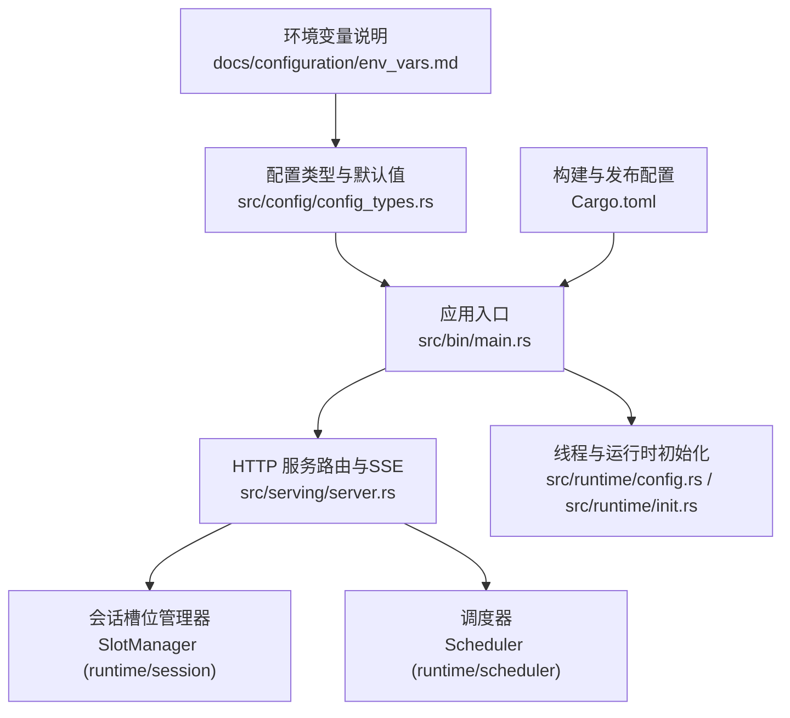
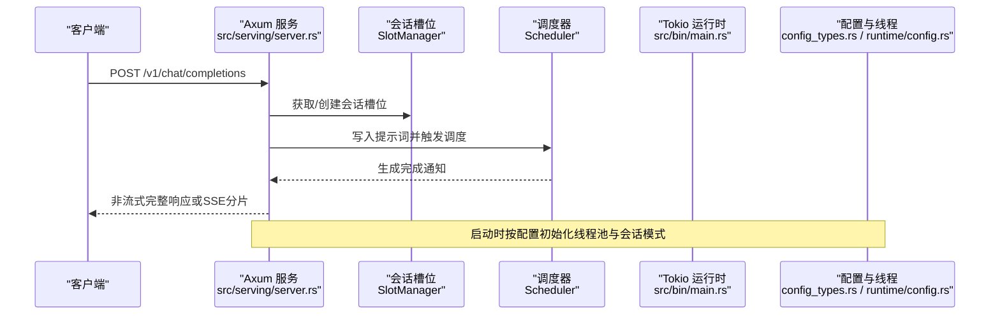
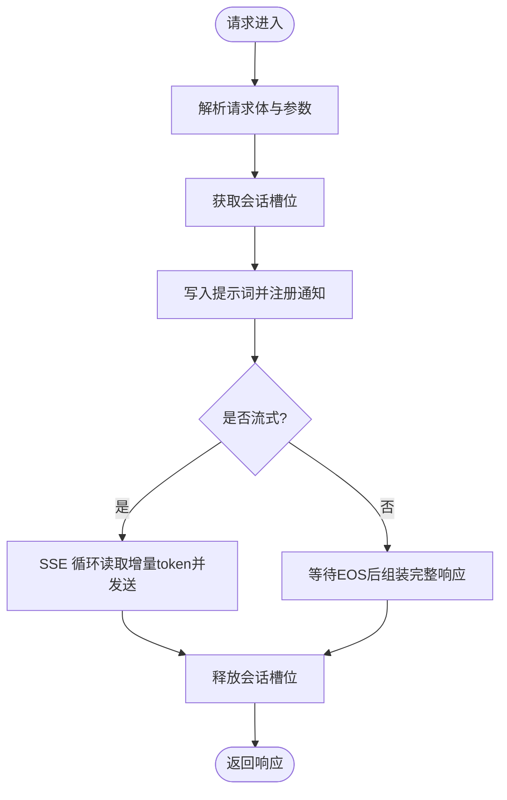
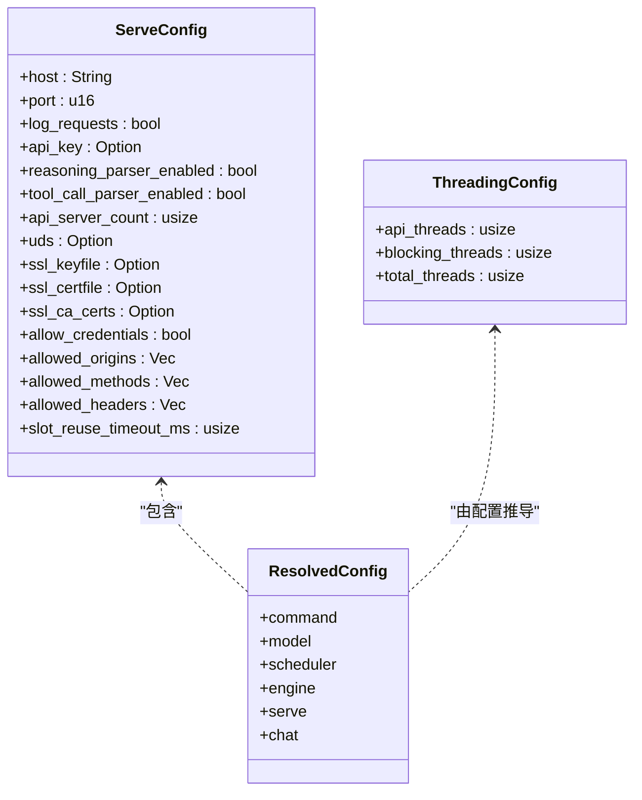
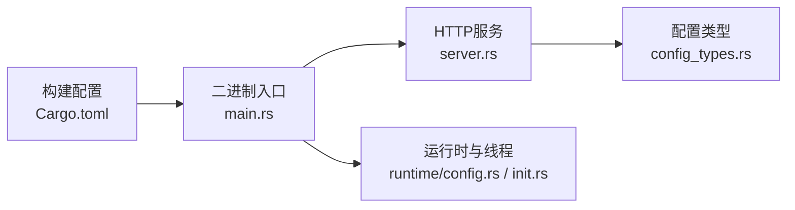

# 部署指南

<cite>
**本文引用的文件**   
- [README.md](file://README.md)
- [Cargo.toml](file://Cargo.toml)
- [src/bin/main.rs](file://src/bin/main.rs)
- [src/serving/server.rs](file://src/serving/server.rs)
- [src/config/config_types.rs](file://src/config/config_types.rs)
- [src/config/mod.rs](file://src/config/mod.rs)
- [src/runtime/config.rs](file://src/runtime/config.rs)
- [src/runtime/init.rs](file://src/runtime/init.rs)
- [docs/configuration/env_vars.md](file://docs/configuration/env_vars.md)
- [docs/deployment/index.md](file://docs/deployment/index.md)
- [docs/serving/online_serving.md](file://docs/serving/online_serving.md)
</cite>

## 目录
1. [简介](#简介)
2. [项目结构](#项目结构)
3. [核心组件](#核心组件)
4. [架构总览](#架构总览)
5. [详细组件分析](#详细组件分析)
6. [依赖分析](#依赖分析)
7. [性能考虑](#性能考虑)
8. [故障排查指南](#故障排查指南)
9. [结论](#结论)
10. [附录](#附录)

## 简介
本指南面向生产环境，提供 eLLM 在 CPU 服务器上的单机部署、容器化与编排（Docker/Kubernetes）、负载均衡与高可用、监控与日志、安全与访问控制、性能调优与容量规划、扩容缩容策略、备份恢复与数据持久化、成本优化与资源利用率提升等全链路实践建议。eLLM 为纯 CPU 推理框架，目标与 GPU 行为一致，强调低延迟、高吞吐与长上下文能力，适合以 Prefill 为主的长上下文场景。

## 项目结构
仓库采用 Rust 工程组织，二进制入口位于 src/bin，服务层位于 src/serving，运行时与调度位于 src/runtime，配置定义位于 src/config，文档位于 docs。构建产物由 Cargo 管理，发布版启用 LTO、strip 等优化。

图示来源
- [src/bin/main.rs:1-41](file://src/bin/main.rs#L1-L41)
- [src/serving/server.rs:1-120](file://src/serving/server.rs#L1-L120)
- [src/runtime/config.rs:62-105](file://src/runtime/config.rs#L62-L105)
- [src/runtime/init.rs:108-135](file://src/runtime/init.rs#L108-L135)
- [src/config/config_types.rs:187-287](file://src/config/config_types.rs#L187-L287)
- [docs/configuration/env_vars.md:1-45](file://docs/configuration/env_vars.md#L1-L45)
- [Cargo.toml:69-81](file://Cargo.toml#L69-L81)

章节来源
- [README.md:1-50](file://README.md#L1-L50)
- [Cargo.toml:1-102](file://Cargo.toml#L1-L102)
- [src/bin/main.rs:1-41](file://src/bin/main.rs#L1-L41)
- [src/serving/server.rs:1-120](file://src/serving/server.rs#L1-L120)
- [src/config/config_types.rs:187-287](file://src/config/config_types.rs#L187-L287)
- [src/runtime/config.rs:62-105](file://src/runtime/config.rs#L62-L105)
- [src/runtime/init.rs:108-135](file://src/runtime/init.rs#L108-L135)
- [docs/configuration/env_vars.md:1-45](file://docs/configuration/env_vars.md#L1-L45)

## 核心组件
- 进程入口与 Tokio 运行时：解析 CLI、加载配置、初始化服务资源、创建多线程运行时并启动 HTTP 服务。
- HTTP 服务与 OpenAI 兼容接口：基于 Axum 暴露 /v1/chat/completions 与 /status，支持流式 SSE 输出。
- 会话与调度：通过 SlotManager 管理会话槽位与 KV 状态；Scheduler 负责批调度与连续批处理。
- 配置系统：集中定义模型、调度、引擎、服务参数及默认值，支持环境变量覆盖。
- 线程模型：根据物理核数与服务实例数自动计算 API 线程与阻塞线程数量。

章节来源
- [src/bin/main.rs:26-40](file://src/bin/main.rs#L26-L40)
- [src/serving/server.rs:25-43](file://src/serving/server.rs#L25-L43)
- [src/serving/server.rs:84-98](file://src/serving/server.rs#L84-L98)
- [src/config/config_types.rs:187-287](file://src/config/config_types.rs#L187-L287)
- [src/runtime/config.rs:62-105](file://src/runtime/config.rs#L62-L105)
- [src/runtime/init.rs:108-135](file://src/runtime/init.rs#L108-L135)

## 架构总览
下图展示从请求进入、会话分配、调度执行到响应返回的端到端流程，以及关键配置与线程模型的注入点。

图示来源
- [src/serving/server.rs:25-43](file://src/serving/server.rs#L25-L43)
- [src/serving/server.rs:84-98](file://src/serving/server.rs#L84-L98)
- [src/bin/main.rs:26-40](file://src/bin/main.rs#L26-L40)
- [src/config/config_types.rs:187-287](file://src/config/config_types.rs#L187-L287)
- [src/runtime/config.rs:62-105](file://src/runtime/config.rs#L62-L105)

## 详细组件分析

### 进程入口与运行时
- 职责：解析命令行参数、加载配置、初始化服务资源、创建 Tokio 多核运行时并启动服务。
- 关键点：API 线程与阻塞线程数量由配置与物理核数决定；服务端口与路由在运行期绑定。

章节来源
- [src/bin/main.rs:9-18](file://src/bin/main.rs#L9-L18)
- [src/bin/main.rs:26-40](file://src/bin/main.rs#L26-L40)
- [src/runtime/config.rs:62-105](file://src/runtime/config.rs#L62-L105)

### HTTP 服务与 OpenAI 兼容接口
- 路由：/v1/chat/completions（POST）与 /status（GET）。
- 流式：使用 SSE 推送增量 token、工具调用与结束事件。
- 健康检查：/status 返回运行状态与调度模式信息。

图示来源
- [src/serving/server.rs:84-98](file://src/serving/server.rs#L84-L98)
- [src/serving/server.rs:100-176](file://src/serving/server.rs#L100-L176)
- [src/serving/server.rs:178-312](file://src/serving/server.rs#L178-L312)

章节来源
- [src/serving/server.rs:25-43](file://src/serving/server.rs#L25-L43)
- [src/serving/server.rs:84-98](file://src/serving/server.rs#L84-L98)
- [src/serving/server.rs:100-176](file://src/serving/server.rs#L100-L176)
- [src/serving/server.rs:178-312](file://src/serving/server.rs#L178-L312)

### 配置系统与线程模型
- 配置项：模型路径、分词器模式、最大长度、量化、KV缓存精度、对话缓存开关、调度策略、超时、服务监听地址与端口、CORS、鉴权密钥、SSL、槽位复用超时等。
- 线程模型：根据可用并行度与 api_server_count 计算 total_threads/api_threads/blocking_threads。
- 环境变量：批量大小、序列长度、预填充块大小、调度超时等可通过环境变量覆盖。

图示来源
- [src/config/config_types.rs:224-287](file://src/config/config_types.rs#L224-L287)
- [src/runtime/config.rs:14-19](file://src/runtime/config.rs#L14-L19)
- [src/config/config_types.rs:214-222](file://src/config/config_types.rs#L214-L222)

章节来源
- [src/config/config_types.rs:187-287](file://src/config/config_types.rs#L187-L287)
- [src/runtime/config.rs:62-105](file://src/runtime/config.rs#L62-L105)
- [docs/configuration/env_vars.md:1-45](file://docs/configuration/env_vars.md#L1-L45)

### 运行时初始化与会话管理
- 初始化流程：根据配置创建调度器、会话槽位管理器、操作队列与工作线程池，并启动后台任务。
- 会话模式：可配置会话是否可复用，影响 KV 缓存生命周期与槽位回收策略。

章节来源
- [src/runtime/init.rs:108-135](file://src/runtime/init.rs#L108-L135)
- [src/serving/server.rs:45-82](file://src/serving/server.rs#L45-L82)

## 依赖分析
- 构建与发布：启用 fat LTO、单 codegen unit、strip symbols、panic=abort 等，利于减小体积与提升性能。
- 网络与异步：Axum + Tokio 提供高性能 HTTP 与异步 I/O。
- 序列化与配置：serde/serde_json/serde_yaml 用于配置与消息编解码。
- 其他：tiktoken-rs 分词、safetensors 权重加载、memmap2 内存映射等。

图示来源
- [Cargo.toml:69-81](file://Cargo.toml#L69-L81)
- [src/bin/main.rs:1-41](file://src/bin/main.rs#L1-L41)
- [src/serving/server.rs:1-43](file://src/serving/server.rs#L1-L43)
- [src/config/config_types.rs:187-287](file://src/config/config_types.rs#L187-L287)
- [src/runtime/config.rs:62-105](file://src/runtime/config.rs#L62-L105)
- [src/runtime/init.rs:108-135](file://src/runtime/init.rs#L108-L135)

章节来源
- [Cargo.toml:1-102](file://Cargo.toml#L1-L102)

## 性能考虑
- 硬件要求：Intel Xeon 4代及以上且支持 AMX；大内存 DDR5，无需 GPU/NPU。
- 调度与批处理：通过环境变量调整批量大小、序列长度、预填充块大小与调度超时，平衡延迟与吞吐。
- 线程模型：合理设置 api_server_count，使 API 线程与阻塞线程比例适配工作负载特征。
- 长上下文优势：静态形状 KV 缓存与头对头注意力计算，减少重复内存访问与控制开销，降低 TTFT。

章节来源
- [README.md:20-31](file://README.md#L20-L31)
- [docs/configuration/env_vars.md:10-26](file://docs/configuration/env_vars.md#L10-L26)
- [src/runtime/config.rs:62-105](file://src/runtime/config.rs#L62-L105)

## 故障排查指南
- 服务不可用：检查 /status 端点返回状态；确认端口绑定与防火墙规则。
- 请求失败：查看服务日志与错误响应；核对请求体字段与模型名称。
- 流式异常：确认 SSE 客户端是否正确处理分片与 finish_reason。
- 资源不足：增大内存与线程数；调整批量与序列长度避免 OOM。
- 线程争用：降低 api_server_count 或增加物理核；观察阻塞线程占比。

章节来源
- [src/serving/server.rs:84-98](file://src/serving/server.rs#L84-L98)
- [src/serving/server.rs:100-176](file://src/serving/server.rs#L100-L176)
- [src/serving/server.rs:178-312](file://src/serving/server.rs#L178-L312)
- [src/runtime/config.rs:62-105](file://src/runtime/config.rs#L62-L105)

## 结论
eLLM 在 CPU 服务器上具备显著的成本与长上下文优势。通过合理的单机部署、容器化与编排、负载均衡与高可用设计、完善的监控与日志、严格的安全与访问控制、持续的性能调优与容量规划，可在生产环境中稳定交付高质量推理服务。

## 附录

### 一、单机部署步骤与配置要求
- 环境与依赖
  - 操作系统：Linux（推荐主流发行版）
  - CPU：Intel Xeon 4代及以上，支持 AMX
  - 内存：满足模型与 KV 缓存需求的大内存
  - 构建工具链：Rust toolchain（参考 rust-toolchain.toml）
- 构建与安装
  - 克隆仓库并切换到目标分支
  - 使用 cargo build --release 构建发布版（启用 LTO、strip 等优化）
  - 将二进制放置于系统 PATH 或指定目录
- 启动服务
  - 通过命令行参数或环境变量指定模型路径、端口、批量与序列长度等
  - 默认监听 0.0.0.0:8000，暴露 /v1/chat/completions 与 /status
- 验证
  - 调用 /status 检查服务状态
  - 发送聊天补全请求，验证同步与流式响应

章节来源
- [README.md:20-31](file://README.md#L20-L31)
- [Cargo.toml:69-81](file://Cargo.toml#L69-L81)
- [src/serving/server.rs:25-43](file://src/serving/server.rs#L25-L43)
- [docs/configuration/env_vars.md:10-26](file://docs/configuration/env_vars.md#L10-L26)

### 二、容器化部署（Docker）
- 镜像构建
  - 使用多阶段构建：第一阶段编译 release 版本，第二阶段仅复制二进制与必要库
  - 基础镜像选择轻量 Linux（如 alpine 或 distroless），确保 glibc 兼容
- 运行容器
  - 挂载模型目录与配置文件卷
  - 通过环境变量注入批量、序列长度、端口等参数
  - 暴露 8000 端口供外部访问
- 健康检查
  - 使用 curl 或 wget 定期访问 /status 判定存活

[本节为概念性指导，不直接分析具体源码文件]

### 三、Kubernetes 编排
- Deployment
  - 副本数根据 QPS 与延迟目标设定；结合 HorizontalPodAutoscaler 基于 CPU/内存或自定义指标扩缩容
  - 资源限制与请求：CPU requests/limits、memory requests/limits 依据压测结果设定
- Service 与 Ingress
  - ClusterIP Service 暴露 Pod 端口
  - Ingress 统一入口，开启 TLS 终止与路径转发
- 配置与密钥
  - 使用 ConfigMap 注入环境变量与配置文件
  - Secret 存储 API Key、SSL 证书与私钥
- 探针
  - livenessProbe 与 readinessProbe 指向 /status
- 存储
  - 使用 PersistentVolume 挂载模型与 KV 缓存目录，保障跨重启复用

[本节为概念性指导，不直接分析具体源码文件]

### 四、负载均衡与高可用
- 水平扩展：多副本部署配合 Ingress/Service 实现请求分发
- 会话亲和：如需会话级粘性，可在网关层基于 session_id 做一致性哈希
- 优雅停机：SIGTERM 处理后等待活跃请求完成再退出
- 故障转移：多副本与就绪探针保证流量只路由到健康实例

[本节为概念性指导，不直接分析具体源码文件]

### 五、监控与日志收集
- 指标采集
  - 暴露 Prometheus 指标端点（可在服务层扩展）
  - 采集 CPU、内存、请求量、延迟分位数、错误率等
- 日志收集
  - 结构化 JSON 日志，包含 request_id、session_id、耗时、错误码
  - 使用 sidecar 或 DaemonSet 收集至 ELK/Loki
- 告警
  - 基于阈值与趋势设置告警规则（延迟飙升、错误率升高、OOM 风险）

[本节为概念性指导，不直接分析具体源码文件]

### 六、安全配置与访问控制
- 鉴权
  - 使用 ServeConfig.api_key 进行简单令牌校验
  - 在网关层实施更严格的认证（OAuth/JWT）
- 传输安全
  - 启用 SSL/TLS（ssl_keyfile/ssl_certfile/ssl_ca_certs）
- 访问控制
  - CORS 白名单（allowed_origins/methods/headers）
  - 限制来源 IP 与速率限制（网关层）

章节来源
- [src/config/config_types.rs:224-287](file://src/config/config_types.rs#L224-L287)

### 七、性能调优与容量规划
- 批量与序列
  - 提高 max_num_seqs 与 max_num_batched_tokens 提升吞吐
  - 降低 chunk_size 以降低首字延迟
- 线程与亲和
  - 调整 api_server_count 与物理核亲和，减少上下文切换
- 内存与缓存
  - 预留足够内存以容纳 KV 缓存；避免频繁换页
- 压测与基准
  - 使用短文本与长文本场景分别评估 TPOT 与 TTFT，定位瓶颈

章节来源
- [docs/configuration/env_vars.md:10-26](file://docs/configuration/env_vars.md#L10-L26)
- [src/runtime/config.rs:62-105](file://src/runtime/config.rs#L62-L105)

### 八、扩容与缩容策略
- 垂直扩容：提升单实例 CPU 与内存，适用于长上下文与高并发混合负载
- 水平扩容：增加副本数，结合 HPA 基于指标自动扩缩
- 灰度发布：蓝绿或金丝雀发布，逐步放量新实例
- 回滚策略：保留旧版本镜像与配置，快速回滚

[本节为概念性指导，不直接分析具体源码文件]

### 九、备份恢复与数据持久化
- 模型权重
  - 使用对象存储或共享文件系统持久化，避免每次启动重新下载
- KV 缓存与会话
  - 若启用会话复用，需持久化槽位状态；否则按需重建
- 配置与密钥
  - 使用配置中心或 GitOps 管理版本化配置
- 灾难恢复
  - 定期快照与演练恢复流程

[本节为概念性指导，不直接分析具体源码文件]

### 十、成本优化与资源利用率提升
- 实例选型
  - 优先选择大内存、高缓存的 CPU 实例，发挥长上下文优势
- 弹性伸缩
  - 低谷时段缩容，高峰时段扩容，结合竞价实例降低成本
- 批处理优化
  - 动态批大小与调度策略，提升单位时间产出
- 观测驱动
  - 基于指标与日志持续优化资源配置与代码路径

[本节为概念性指导，不直接分析具体源码文件]

### 十一、在线服务接口概览
- 接口协议：OpenAI 兼容
- 端点
  - POST /v1/chat/completions：聊天补全（支持流式）
  - GET /status：健康检查
- 示例与规范详见在线服务文档

章节来源
- [docs/serving/online_serving.md:1-10](file://docs/serving/online_serving.md#L1-L10)
- [src/serving/server.rs:84-98](file://src/serving/server.rs#L84-L98)