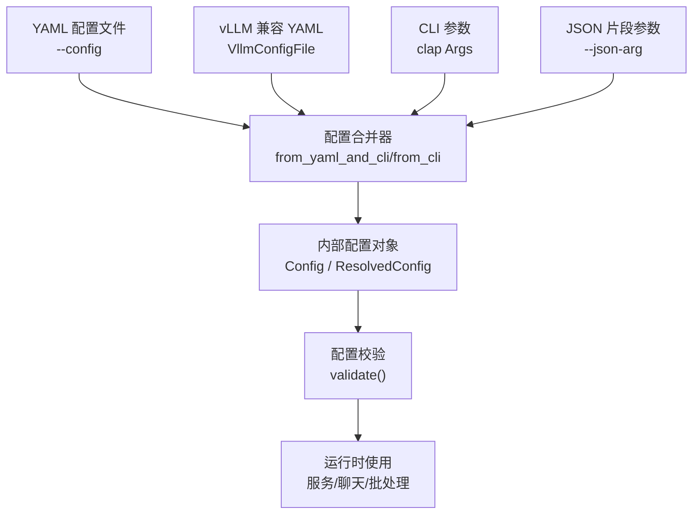
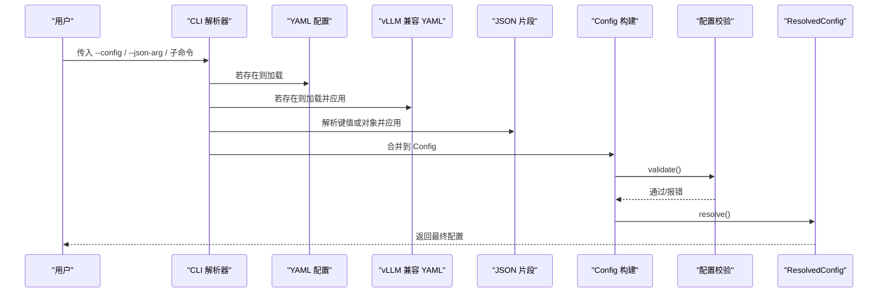
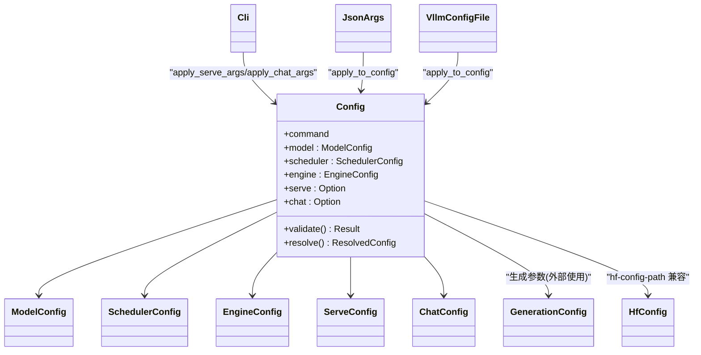

# 配置指南

<cite>
**本文引用的文件**
- [src/config/mod.rs](file://src/config/mod.rs)
- [src/config/command_line_interface.rs](file://src/config/command_line_interface.rs)
- [src/config/config_types.rs](file://src/config/config_types.rs)
- [src/config/config_validator.rs](file://src/config/config_validator.rs)
- [src/config/generation_config.rs](file://src/config/generation_config.rs)
- [src/config/huggingface_config.rs](file://src/config/huggingface_config.rs)
- [docs/configuration/env_vars.md](file://docs/configuration/env_vars.md)
- [docs/configuration/optimization.md](file://docs/configuration/optimization.md)
- [docs/cli/index.md](file://docs/cli/index.md)
- [docs/getting_started/installation.md](file://docs/getting_started/installation.md)
</cite>

## 目录
1. [简介](#简介)
2. [项目结构](#项目结构)
3. [核心组件](#核心组件)
4. [架构总览](#架构总览)
5. [详细组件分析](#详细组件分析)
6. [依赖关系分析](#依赖关系分析)
7. [性能考虑](#性能考虑)
8. [故障排查指南](#故障排查指南)
9. [结论](#结论)
10. [附录](#附录)

## 简介
本指南聚焦 eLLM 的配置管理，覆盖配置文件格式、命令行参数、环境变量与优先级规则；提供不同场景（开发、测试、生产）的配置模板与最佳实践；详解生成参数（温度、top_p、max_tokens 等）的影响；说明模型特定配置与 HuggingFace 配置兼容性；包含配置验证机制与错误处理；并给出动态配置更新方法与注意事项，以及性能调优与监控指标建议。

## 项目结构
eLLM 的配置体系由多源合并而成：YAML 配置文件、vLLM 兼容的 YAML 配置、CLI 参数、JSON 片段参数，最终统一解析为内部配置对象并进行校验与解析。

图表来源
- [src/config/command_line_interface.rs:1182-1250](file://src/config/command_line_interface.rs#L1182-L1250)
- [src/config/config_validator.rs:186-190](file://src/config/config_validator.rs#L186-L190)

章节来源
- [src/config/mod.rs:1-15](file://src/config/mod.rs#L1-L15)
- [src/config/command_line_interface.rs:1182-1250](file://src/config/command_line_interface.rs#L1182-L1250)
- [docs/cli/index.md:62-68](file://docs/cli/index.md#L62-L68)

## 核心组件
- 配置类型定义：集中描述模型、调度器、引擎、服务、聊天等配置项及其默认值。
- CLI 与 vLLM 兼容层：支持从 YAML 或 JSON 片段注入配置，并与 clap 参数合并。
- 生成参数配置：temperature、top_p、max_tokens 等采样与输出控制参数。
- HuggingFace 配置兼容：读取 config.json 中的模型结构信息。
- 配置校验与解析：对必填字段、范围约束、命令相关段进行一致性检查，并生成 ResolvedConfig。

章节来源
- [src/config/config_types.rs:57-205](file://src/config/config_types.rs#L57-L205)
- [src/config/command_line_interface.rs:253-366](file://src/config/command_line_interface.rs#L253-L366)
- [src/config/generation_config.rs:5-79](file://src/config/generation_config.rs#L5-L79)
- [src/config/huggingface_config.rs:10-76](file://src/config/huggingface_config.rs#L10-L76)
- [src/config/config_validator.rs:62-190](file://src/config/config_validator.rs#L62-L190)

## 架构总览
下图展示了配置加载与合并的关键流程，包括 YAML、vLLM 兼容 YAML、CLI 与 JSON 片段的优先级与合并顺序。

图表来源
- [src/config/command_line_interface.rs:1182-1250](file://src/config/command_line_interface.rs#L1182-L1250)
- [src/config/config_validator.rs:186-220](file://src/config/config_validator.rs#L186-L220)

## 详细组件分析

### 配置类型与默认值
- 模型配置 ModelConfig：包含模型路径、分词器模式、数据类型、最大上下文长度、量化、KV 缓存数据类型、revision、下载目录、随机种子、HF 配置路径、媒体白名单、logprobs 上限、滑动窗口与级联注意力开关、min_p 等。
- 调度器配置 SchedulerConfig：并发序列数、批量 token 上限、是否启用连续批处理、调度策略、调度超时、对话缓存开关。
- 引擎配置 EngineConfig：runner、convert、enforce_eager、专家路由返回、FP64 Gumbel 等。
- 服务配置 ServeConfig：监听地址与端口、请求日志、API Key、推理/工具调用解析器开关、API 线程数、UDS、SSL、CORS 白名单、槽位复用超时等。
- 聊天配置 ChatConfig：系统提示、流式输出、最大轮次。

章节来源
- [src/config/config_types.rs:57-205](file://src/config/config_types.rs#L57-L205)
- [src/config/config_types.rs:224-334](file://src/config/config_types.rs#L224-L334)
- [src/config/config_types.rs:336-387](file://src/config/config_types.rs#L336-L387)

### 命令行接口与 vLLM 兼容
- 通用共享参数 SharedArgs：最小概率、模型、分词器、数据类型、最大上下文、信任远程代码、量化、KV 缓存数据类型、served_model_name、revision、下载目录、随机种子、HF 配置路径、logprobs、滑动窗口与级联注意力开关、runner、convert、enforce_eager、专家路由返回、FP64 Gumbel、并发限制、调度策略与超时、对话缓存等。
- serve/chat 子命令参数：分别扩展服务与聊天特有选项。
- vLLM 兼容 YAML：支持 model/scheduler/engine/server 四个段，字段名兼容 snake_case 与 alias。
- JSON 片段参数：支持完整对象或 key=value 形式，自动按 model/scheduler/engine/serve/chat 分类合并。

章节来源
- [src/config/command_line_interface.rs:61-160](file://src/config/command_line_interface.rs#L61-L160)
- [src/config/command_line_interface.rs:162-251](file://src/config/command_line_interface.rs#L162-L251)
- [src/config/command_line_interface.rs:253-366](file://src/config/command_line_interface.rs#L253-L366)
- [src/config/command_line_interface.rs:571-723](file://src/config/command_line_interface.rs#L571-L723)

### 配置优先级与合并顺序
- 基础优先级（从低到高）：配置文件 → CLI 参数 → JSON 片段参数。
- 当同时指定 --config 与 vLLM 兼容 YAML 时，先加载 YAML，再应用 vLLM 兼容配置，最后应用 CLI 与 JSON 片段。
- 子命令会清空不相关段（例如 serve 模式下 chat 置空）。

章节来源
- [docs/cli/index.md:62-68](file://docs/cli/index.md#L62-L68)
- [src/config/command_line_interface.rs:1140-1180](file://src/config/command_line_interface.rs#L1140-L1180)
- [src/config/command_line_interface.rs:1182-1250](file://src/config/command_line_interface.rs#L1182-L1250)

### 生成参数配置（采样与输出控制）
- 主要字段：max_length、max_new_tokens、temperature、top_p、top_k、top_k_simd、repetition_penalty、do_sample、num_beams、eos_token_id_list、pad_token_id、bos_token_id、thread_num、stop、stop_token_ids、ignore_eos、max_tokens、min_tokens、logprobs、prompt_logprobs、skip_special_tokens、spaces_between_special_tokens、include_stop_str_in_output。
- 行为要点：
  - temperature/top_p 控制采样多样性；默认分别为 1.0 与 1.0。
  - top_k/top_k_simd 用于 Top-K 采样，SIMD 对齐可提升向量计算效率。
  - max_tokens/max_length/max_new_tokens 控制输出长度，注意三者语义差异与冲突时的解析逻辑需结合上层调用约定。
  - repetition_penalty 抑制重复；do_sample 决定是否开启采样。
  - stop/stop_token_ids 控制停止条件；ignore_eos 可忽略 EOS 终止。
  - logprobs/prompt_logprobs 控制返回概率信息数量。
  - thread_num 控制并行度，未设置时回退到可用 CPU 核数。

章节来源
- [src/config/generation_config.rs:5-79](file://src/config/generation_config.rs#L5-L79)
- [src/config/generation_config.rs:124-141](file://src/config/generation_config.rs#L124-L141)
- [src/config/generation_config.rs:116-121](file://src/config/generation_config.rs#L116-L121)

### 模型特定配置与 HuggingFace 兼容
- HfConfig 直接映射 config.json 的结构字段，如 architectures、hidden_size、num_attention_heads、num_hidden_layers、rope_scaling、sliding_window、use_sliding_window、tie_word_embeddings、vocab_size 等。
- 可通过 hf-config-path 指定外部 HF 配置路径，便于在不修改权重目录的情况下注入模型元数据。

章节来源
- [src/config/huggingface_config.rs:10-76](file://src/config/huggingface_config.rs#L10-L76)
- [src/config/config_types.rs:110-112](file://src/config/config_types.rs#L110-L112)
- [src/config/command_line_interface.rs:294-295](file://src/config/command_line_interface.rs#L294-L295)

### 配置验证机制与错误处理
- 校验范围：
  - 模型：model 非空、max_model_len 大于 0（若提供）、served_model_name 非空（若提供）、revision/code_revision/tokenizer_revision 非空（若提供）、download_dir 非空（若提供）、hf_config_path 非空（若提供）、max_logprobs 不超过上限。
  - 调度器：max_num_seqs 与 max_num_batched_tokens 必须大于 0，且后者不小于前者。
  - 服务：host 非空、port 大于 0、allowed_origins/methods/headers 非空。
  - 命令段：Serve 需要 serve 段，Chat 需要 chat 段。
- 解析阶段：resolve() 在 validate() 通过后填充 served_model_name 与 effective_tokenizer。

章节来源
- [src/config/config_validator.rs:74-190](file://src/config/config_validator.rs#L74-L190)
- [src/config/config_validator.rs:200-220](file://src/config/config_validator.rs#L200-L220)

### 环境变量与运行时参数
- 运行期关键变量（来自文档）：ELLM_BATCH_SIZE、ELLM_SEQUENCE_LENGTH、ELLM_CHUNK_SIZE、ELLM_SCHEDULE_TIMEOUT_MS。
- 线程池大小由内部函数根据 CPU 核数自动计算，无需手动设置。
- 模型路径通常通过 CLI 参数传递。

章节来源
- [docs/configuration/env_vars.md:1-45](file://docs/configuration/env_vars.md#L1-L45)
- [docs/getting_started/installation.md:59-71](file://docs/getting_started/installation.md#L59-L71)

### 动态配置更新方法与注意事项
- 当前实现中，配置在进程启动时一次性加载、合并与校验，未暴露热重载 API。
- 如需“动态”调整，推荐方式：
  - 通过外部编排（容器/进程管理器）重启服务实例以加载新配置。
  - 将易变参数（如端口、CORS、日志开关）放入独立配置文件，配合部署脚本切换。
  - 对于生成参数，可在请求级别通过 API 传入（若上层 API 支持），避免全局重启。
- 注意事项：
  - 涉及内存布局与 KV 缓存的参数（如 max_model_len、batch 相关）变更通常需要重启。
  - 保持配置幂等与版本化，避免频繁变更导致状态不一致。

[本节为概念性内容，无直接源码引用]

### 配置模板与最佳实践

- 开发环境
  - 目标：快速迭代、低延迟、便于调试。
  - 建议：
    - dtype=bf16 或 fp16，max_model_len 适中（如 4096）。
    - enable_continuous_batching=true，max_num_seqs 较小（如 8-16）。
    - log_requests=true，reasoning/tool-call parser 开启以便调试。
    - 环境变量：ELLM_CHUNK_SIZE 较小以降低首 Token 延迟。
  - 参考路径
    - [src/config/config_types.rs:57-205](file://src/config/config_types.rs#L57-L205)
    - [docs/configuration/env_vars.md:18-26](file://docs/configuration/env_vars.md#L18-L26)

- 测试环境
  - 目标：稳定性与回归验证。
  - 建议：
    - 固定 seed，关闭随机特性（temperature=0 或 do_sample=false）。
    - 严格校验配置（利用 validate 能力）。
    - 适度提高 batch 与 tokens 上限以覆盖边界用例。
  - 参考路径
    - [src/config/config_validator.rs:186-190](file://src/config/config_validator.rs#L186-L190)
    - [src/config/generation_config.rs:124-141](file://src/config/generation_config.rs#L124-L141)

- 生产环境
  - 目标：高吞吐、稳定、安全。
  - 建议：
    - 明确 CORS 白名单、启用 API Key、限制 allowed_methods/headers。
    - 合理设置 max_num_seqs 与 max_num_batched_tokens，确保后者不小于前者。
    - 使用 bf16/fp16，必要时开启 enforce_eager 以规避图编译开销。
    - 环境变量：根据负载调大 ELLM_BATCH_SIZE 与 ELLM_CHUNK_SIZE。
  - 参考路径
    - [src/config/config_types.rs:224-334](file://src/config/config_types.rs#L224-L334)
    - [docs/configuration/optimization.md:14-35](file://docs/configuration/optimization.md#L14-L35)

章节来源
- [src/config/config_types.rs:57-334](file://src/config/config_types.rs#L57-L334)
- [docs/configuration/env_vars.md:18-26](file://docs/configuration/env_vars.md#L18-L26)
- [docs/configuration/optimization.md:14-35](file://docs/configuration/optimization.md#L14-L35)

## 依赖关系分析
配置模块间的依赖关系如下：

图表来源
- [src/config/config_types.rs:57-205](file://src/config/config_types.rs#L57-L205)
- [src/config/command_line_interface.rs:1140-1250](file://src/config/command_line_interface.rs#L1140-L1250)
- [src/config/generation_config.rs:5-79](file://src/config/generation_config.rs#L5-L79)
- [src/config/huggingface_config.rs:10-76](file://src/config/huggingface_config.rs#L10-L76)

章节来源
- [src/config/mod.rs:1-15](file://src/config/mod.rs#L1-L15)

## 性能考虑
- 调度与批处理
  - 降低 ELLM_CHUNK_SIZE 可减少预填充每轮 token 数，改善首 Token 延迟。
  - 增大 ELLM_CHUNK_SIZE 与 ELLM_BATCH_SIZE 可提高吞吐。
  - 长上下文需增大 ELLM_SEQUENCE_LENGTH，但内存线性增长。
  - 突发/低流量场景减小 ELLM_SCHEDULE_TIMEOUT_MS 保证调度响应。
- 线程与执行
  - Worker 线程数 = max(total_cpus - async_threads, 1)，async 线程固定为 2。
- 生成参数影响
  - temperature 越高越具创造性；top_p 控制核采样质量；top_k 控制候选集规模。
  - repetition_penalty 抑制重复；do_sample=false 可确定性输出。
  - max_tokens/max_length/max_new_tokens 控制输出长度，需与 prompt 长度协调。
- 资源与安全
  - 生产环境限制 CORS、启用鉴权、限制日志量，避免 I/O 成为瓶颈。

章节来源
- [docs/configuration/env_vars.md:18-26](file://docs/configuration/env_vars.md#L18-L26)
- [docs/configuration/optimization.md:27-35](file://docs/configuration/optimization.md#L27-L35)
- [src/config/generation_config.rs:124-141](file://src/config/generation_config.rs#L124-L141)

## 故障排查指南
- 常见校验错误
  - 模型为空或未提供必要 revision 字段。
  - max_model_len 为 0 或 max_logprobs 超出上限。
  - 调度器 max_num_batched_tokens 小于 max_num_seqs。
  - 服务 host/port 非法或 CORS 白名单为空。
  - 命令与对应配置段缺失（serve 缺少 serve 段、chat 缺少 chat 段）。
- 定位步骤
  - 确认配置文件语法与字段名（snake_case 或别名）。
  - 逐步缩小范围：仅保留必要字段，逐一添加并观察 validate 报错。
  - 检查 CLI 与 JSON 片段是否覆盖了预期字段。
  - 核对环境变量是否与期望一致。
- 参考路径
  - [src/config/config_validator.rs:74-190](file://src/config/config_validator.rs#L74-L190)
  - [src/config/command_line_interface.rs:1182-1250](file://src/config/command_line_interface.rs#L1182-L1250)

章节来源
- [src/config/config_validator.rs:74-190](file://src/config/config_validator.rs#L74-L190)

## 结论
eLLM 的配置体系以“多源合并 + 强校验”为核心，兼顾 vLLM 生态兼容性与自身优化需求。通过合理的优先级控制、严格的校验与清晰的生成参数语义，用户可以在不同环境下快速获得稳定高效的推理体验。生产部署应重点关注安全、资源与吞吐平衡，并结合环境与请求级参数进行精细化调优。

## 附录

### 环境变量速查
- ELLM_BATCH_SIZE：并发请求上限（默认 3）
- ELLM_SEQUENCE_LENGTH：单槽最大序列长度（默认 128）
- ELLM_CHUNK_SIZE：预填充每轮最大 token 数（默认 64）
- ELLM_SCHEDULE_TIMEOUT_MS：调度超时窗口（毫秒，默认 10）

章节来源
- [docs/configuration/env_vars.md:11-16](file://docs/configuration/env_vars.md#L11-L16)

### 生成参数影响速览
- temperature：越高越发散，越低越保守。
- top_p：累积概率阈值，越小越聚焦。
- top_k：候选词数量，过小可能损失多样性。
- max_tokens/max_length/max_new_tokens：控制输出长度，注意与输入长度协同。
- repetition_penalty：抑制重复，过大可能导致语言不自然。
- do_sample：是否采样；false 时更确定。

章节来源
- [src/config/generation_config.rs:5-79](file://src/config/generation_config.rs#L5-L79)
- [src/config/generation_config.rs:124-141](file://src/config/generation_config.rs#L124-L141)