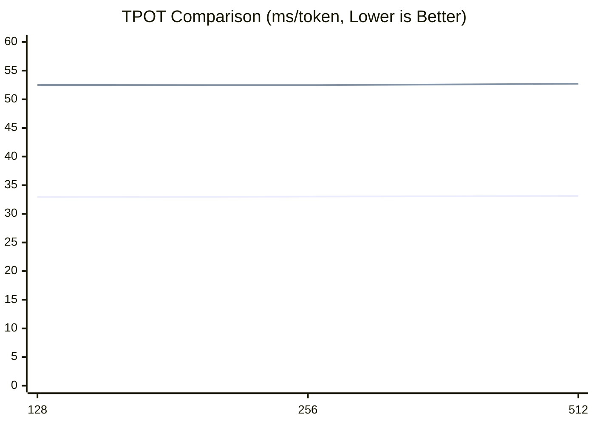

# eLLM: can Run LLM Inference on CPUs Faster Than on GPUs. 
## eLLM Makes CPUs (Xeon/EPYC) the Best AI Inference Chips.
👉 Project home: [https://github.com/lucienhuangfu/eLLM](https://github.com/lucienhuangfu/eLLM)  
🌐 Languages: [English](README.md) | [简体中文](README.zh-CN.md)  
🎓 We currently have only 1–2 trainee openings, and we welcome applications from computer science students  
💼 We are committed to open source and AI democratization, and we look forward to working with industry partners  
📧 Contact: **lucienhuangfu@outlook.com**

## 🚀 Progress and Updates
- `v0.1.0-alpha.1` (2026-04-06): Alpha release
- `v0.0.1` (2025-12-20): Open-sourced the project

## 🔑 Highlights
**eLLM** is a large-model inference framework built specifically for **CPU servers**.
- **Pure CPU inference**: Runs on **CPU servers** (Xeon / EPYC), with **no GPU/NPU required**
- **vLLM API compatible**: Integrates smoothly with the existing ecosystem
- **GPU-consistent inference**: matches GPU inference in both numerical results and runtime behavior

## Hardware Requirements (No GPU/NPU Required)
- **CPU**: Intel Xeon 4th Gen or newer, with AMX support
- **Memory**: Sufficient DDR5 capacity, no HBM required

## ✨ Advantages
eLLM fully exploits the **architectural strengths of CPUs in inference workloads**, allowing it to outperform GPU-based inference on several critical metrics:
- **Low latency**: Entire Prefill executed end-to-end, with attention computed head by head, significantly reducing time to first token
- **High throughput**: Even though single-instance concurrency is lower, the smaller end-to-end latency can translate into **higher real QPS**
- **Long context**: Large memory capacity supports nearly unlimited context windows
- **Lower energy use**: Prefill loads parameters only once, greatly reducing the energy cost of repeated memory access
- **Lower cost**: Hardware cost and per-user inference cost are significantly lower than GPU-based deployments

## Use Cases
eLLM is well suited for long-text inference tasks centered on **Prefill**, especially agents that need to ingest extremely long contexts in one go:
- **Code Copilot**
  - Handles cross-file, cross-module code contexts that are too large for ordinary workflows by completing Prefill in one shot
  - Well suited for refactoring, code review, completion, and other high-frequency incremental inference workloads
- **RAG (Retrieval-Augmented Generation)**
  - Dynamically injects large-scale external documents and knowledge bases into long context
  - Ideal for long-document understanding and enterprise knowledge-base QA
- **Deep Research**
  - Fits multi-step retrieval, reasoning, and information synthesis workflows, with large amounts of material loaded in the first pass
  - Supports continuous research sessions spanning hours or even days

## ⚙️ Approach
Based on the CPU server’s architectural profile of "large memory, large cache, modest compute," eLLM adopts an **"store more, compute less"** design philosophy. It rethinks the LLM inference stack and compresses the inference flow into a pre-allocatable, directly addressable, and stably reusable execution pipeline, trading lower runtime overhead for more predictable end-to-end latency.

- 🧩 **Elastic static computation graph**
  Build a globally unique static computation graph and use a **dimension-first** tensor layout so that elements at the same logical coordinates map to the same memory location. This lets the same execution graph handle different input lengths without rebuilding the graph.
- **Static-shape KV cache (non-paged)**
  Preallocate a fixed-shape tensor for the KV cache instead of using paged block management. Read and write KV directly by tensor coordinates, and read contiguously along the sequence dimension to reduce metadata maintenance, address mapping, and dynamic allocation overhead while minimizing TLB and cache misses.
- 📦 **Massive-dimensional tensors**
  Reserve sufficiently large token / sequence dimensions to build an effectively "unbounded" KV tensor. This supports full Prefill in one pass and helps avoid repeated Prefill and repeated parameter loading, making it suitable for ultra-long prompts and long-lived contexts.
- **⚡ Head-by-head attention computation (FlashAttention)**
  During Prefill, the basic compute unit is a single token's single KV head. The CPU finishes one head before moving to the next. This matches the hardware characteristics of CPUs, which have limited core counts but large caches: keep a single head's KV data resident in cache as long as possible to reduce repeated memory loads.

## 🤖 Supported Models
- ✅ Qwen3 series
- ✅ MiniMax M2.5

## Experiments
At this stage, eLLM's minimum viable prototype is complete. To validate its performance potential, we designed both short-text and long-text experiments, evaluating Prefill and Decode separately and comparing a single CPU server against an inference node made up of 8 GPUs under different scenarios. In short-text inference, CPU is clearly behind GPU; but for long-text inference, eLLM has a chance to overtake by leveraging CPU memory capacity.

### Experiment Setup
- CPU baseline: SGLang CPU endpoint (single CPU server)
- GPU baseline: SGLang GPU endpoint v0.5.9 (multi-GPU server, example uses an 8x H20 node)
- Current experiments run on a public-cloud CPU VM and use only a fraction of the server's resources
- Prefill metric: TTFT (Time to First Token, ms)
- Decode metric: TPOT (Time Per Output Token, ms/token)

### Hardware Comparison

| Item | CPU Server | GPU Server |
|---|---|---|
| Model | Xeon 6982P-C | H20 |
| Cores | 128 | 16,000 |
| FP16 matrix throughput (TFLOPS) | 250 | 296 |
| Cache (MB) | 504 (L3) | 60 (L2) |
| Max memory capacity (TB) | 3 | 0.141 |
| Quantity | 1 | 8 |
| Total cost ($) | 17,000 | 220,000 |

### Notes on the Experiments
- The current focus is **benchmarking and systems performance evaluation**.
- **Operator-level** tests and alignment have been completed, which indicates the underlying execution path is basically functional.
- **Model-level** outputs are not yet fully consistent with the reference implementation.
  - The current setup uses **randomly initialized parameters** and has not yet been connected to real model weights.
  - **Attention** and **tokenization** are not included in this stage.

#### Short-Text Experiment (Completed)

**Setup**
- Model: Qwen3-Coder-30B-A3B-Instruct (FP16)
- Scenario: short prompts, `batch = 1`, `prompt length = {128, 256, 512}`
- In short-text settings, CPU inference frameworks are usually far behind GPU in Decode performance, so we do not include a separate GPU comparison in this experiment.
- This experiment measures Decode only; Prefill is evaluated in the long-text experiment.

**Environment**

| Item | Configuration |
|---|---|
| Environment | CPU VM |
| Cores | 48 |
| Memory (TB) | 0.192 |

**Decode Results**
Across the three tests with `prompt_len=128/256/512`, eLLM consistently outperforms the SgLang CPU baseline and shows lower TPOT on CPU. Overall, eLLM delivers about a `1.6x` performance gain, corresponding to roughly a `38%` reduction in latency. As context length increases, TPOT for both systems rises roughly linearly, but eLLM has a lower slope, indicating a better efficiency trend even within short contexts.



**Decode Analysis**  
This result suggests that the bottleneck in short-text decoding is not mainly the operator math itself, but rather the overhead from scheduling, memory management, and the runtime control path. eLLM's static computation graph and leaner execution path reduce dynamic scheduling and state-management costs, leaving more time for actual operator execution and delivering consistent gains over the CPU baseline.

From the CPU baseline execution path, the main sources of overhead can be grouped into four categories:

- Scheduling overhead: frequent continuous batching, token-level routing, and request merge / split operations; every generated token goes through a scheduling path, and control overhead rises as active requests increase.
- KV cache management: autoregressive decode must continuously preserve historical token KV states and handle KV block allocation, reclamation, and address mapping; each operation is small, but high frequency amplifies metadata and memory-access costs.
- Intermediate tensor management: decode still creates temporary tensors such as Q/K/V projections, attention intermediates, MLP activations, and residual buffers; if these cannot be reused consistently, they cause frequent allocation and deallocation, fragmentation, and bandwidth pressure.
- Service framework / runtime overhead: API serving, request lifecycle handling, and streaming scheduling all add extra cost; GIL contention, context switching, and dynamic data-structure operations further increase end-to-end latency.

#### Long-Text Experiment (Expected by End of May)
GPU VRAM is limited, which constrains chunk size and forces long prompts to be processed in segments. That also limits batch size. In Prefill, segmented long contexts must be processed repeatedly, adding overhead. In Decode, small batch sizes reduce parallelism and can significantly hurt performance.

**Setup**
- Model: Qwen3-Coder-480B-A35B-Instruct (FP16)
- Scenario: `batch size = 10`, `prompt length = 100,000`
  - eLLM: `chunk size = 1,000,000`, `batch size = 10`, `sequence length = 100,000`, processed in one pass
  - GPU baseline: `chunk size = 10,000`, `batch size = 10`, `sequence length = 1,000`, processed in 100 chunks

**Results**  
The experimental data is still being collected and organized, so no final conclusion is available yet.

**Prefill Analysis**  
eLLM is expected to be significantly faster than the GPU baseline. In the Prefill stage for ultra-long prompts, TTFT is mainly driven by two factors: large-scale data movement (model parameters and KV loading) and the scheduling / synchronization overhead caused by chunked processing. eLLM aims to structure Prefill as a continuous, low-interference pipeline, fundamentally reducing both costs. If eLLM can reliably support full-pass Prefill, the advantages of contiguous access, fewer reloads, and lower control overhead should translate into a meaningful reduction in TTFT. The causal chain is as follows:

- **1) Parameter and KV loading:**
  - Problem: for ultra-long inputs, if VRAM cannot hold everything at once, GPUs usually split the input into multiple chunks and process them sequentially. Due to chunking strategy and memory-management constraints, each chunk may require reloading model parameters and related KV data into GPU cache, causing repeated memory I/O and accumulating noticeable latency.
  - eLLM advantage: server-class CPUs usually have much larger main memory, allowing Prefill to be completed with fewer chunks or even in one pass, greatly reducing repeated memory I/O. Although DDR5 bandwidth is lower than GPU HBM bandwidth, reducing repeated loads often improves TTFT more significantly.

- **2) KV layout and access pattern:**
  - Problem: in ultra-long context scenarios, KV cache size grows linearly with sequence length, and the access pattern, by head or by token, directly determines cache hit rate and memory movement overhead. On GPU many-core architectures, maximizing throughput often requires highly parallel batch × head computation, which means multiple KV heads must be resident at the same time. This increases cache footprint, causes more frequent cache eviction, and intensifies HBM bandwidth contention and data-movement cost, especially for very long-context inference.
  - eLLM advantage: CPUs have much larger on-chip caches, especially L3 cache, so they naturally have stronger KV residency and locality characteristics. eLLM uses a fixed-shape, dimension-first KV layout and a sequential head-by-head execution strategy. In the CPU implementation, the cores finish all token computations for one attention head first, keeping that head's KV data resident in cache for reuse, and then move on to the next head. This extends the residency window and creates a more continuous access path, improving both temporal and spatial locality. Thanks to CPU cache capacity and eLLM's access-pattern optimization, the effective cache residency of a single KV head can improve by roughly **2-3 orders of magnitude** compared with a conventional parallel execution pattern.

- **3) Control and synchronization costs from chunking:**
  - Problem: splitting a long prompt into multiple chunks introduces extra scheduling points, synchronization overhead, memory fragmentation, and cross-chunk state maintenance such as KV reassembly and merging, all of which directly increase TTFT.
  - eLLM advantage: if Prefill can be turned into one continuous pipeline, scheduling and synchronization points are dramatically reduced, minimizing control-path overhead.

**Decode Analysis**  
During decode on long contexts, eLLM is still slower overall than the GPU baseline, but the gap is much smaller than the theoretical DDR vs HBM bandwidth difference. This suggests that the GPU bandwidth advantage is not fully realized in this scenario; the bottleneck is more about insufficient parallelism and suboptimal memory-access patterns than about raw bandwidth limits.

- **1) Small batch size:**
  - Problem: long sequences directly shrink batch size. When GPU VRAM is limited and chunk size is fixed, the longer the sequence, the smaller the batch that can be resident at once. During decode, each request must carry the full historical KV cache, which further reduces effective concurrency.
  - eLLM advantage: CPUs have larger memory capacity and can support larger chunk sizes, so batch size is less constrained and higher concurrency can be maintained.

- **2) Poor efficiency for skinny matrix multiplication:**
  - Problem: once batch size gets small, linear layers degenerate into skinny matrix multiplication; in MoE settings, some expert computations may further degenerate into vector-matrix multiplication. These operators are typically small and irregular, making it hard for GPUs to exploit their large-scale parallelism. Limited L2 cache also makes it difficult to keep enough concurrent matrix multiplications resident at the same time.
  - eLLM advantage: CPUs are friendlier to small-batch, low-dimensional, and irregular matrix operations, and their execution paths are more stable. With a larger L3 cache, weights and intermediate results are easier to reuse, so multiple matrix multiplications can be processed more efficiently in parallel.

- **3) MoE load imbalance:**
  - Problem: MoE experts are distributed across different GPUs, and expert activation is random. In small-batch scenarios, load balancing is often poor: some GPUs are overloaded while others sit idle, and in the extreme case only a few GPUs do most of the work.
  - eLLM advantage: eLLM runs on a single CPU server, so experts do not need to be distributed across devices. This avoids load imbalance and cross-device communication, and allows all compute resources to be used consistently.

- **4) Ineffective memory bandwidth:**
  - Problem: GPU bandwidth depends on high warp concurrency and sustained memory-level parallelism to hide memory latency. With small batches, there are not enough warps to schedule, SMs are not fully occupied, memory requests are less continuous, HBM latency becomes visible, and SMs frequently stall waiting for data, which reduces effective bandwidth.
  - eLLM advantage: CPUs have fewer cores and lower parallelism requirements, so it is easier to fill the compute resources even with small batches. Combined with cache and prefetching, CPUs can more consistently approach their theoretical memory bandwidth.

- **5) Poor memory-access efficiency:**
  - Problem: a paged KV cache further reduces access efficiency. Once KV is split into discrete pages, what used to be contiguous access becomes scattered, breaking memory coalescing and reducing access merging efficiency. Address mapping through page tables also introduces pointer chasing, extra loads, longer dependency chains, and lower instruction-level parallelism. In addition, TLB misses and cache misses increase, and non-contiguous access requires more memory transactions to load the same data, further amplifying bandwidth consumption.
  - eLLM advantage: eLLM uses a static contiguous KV tensor and direct coordinate-based access, producing a linear memory-access pattern that takes full advantage of hardware prefetch and cache, improving overall access efficiency.

- **6) Amplified kernel launch / scheduling overhead:**
  - Problem: decode advances token by token, and each step triggers a series of GPU kernels such as attention, matmul, and layer norm. With small batches, the work per kernel is small, but launch and scheduling costs remain fixed, so their share rises sharply. Because the compute granularity is too small, GPUs struggle to maintain a continuously saturated execution pipeline; utilization fluctuates and SMs cannot stay fully occupied, reducing overall throughput.
  - eLLM advantage: eLLM runs on CPU through function calls and does not pay kernel launch overhead, so it has more stable execution efficiency in small-batch, low-parallelism scenarios.

## Conclusion

GPUs have long been viewed as the mainstream choice for large-model inference, while CPUs are often considered unable to compete in the same arena. eLLM's results suggest that this assumption is not always correct: in long-text inference, a single CPU server can compete head-on with a multi-GPU system at the end-to-end level, and may even pull ahead.

The core reason is that eLLM makes full use of two major CPU hardware advantages. First, CPUs have much larger main memory, which supports full-pass Prefill for long prompts and reduces repeated loading and scheduling overhead caused by chunked processing. Second, CPUs have much larger cache capacity, and when paired with head-by-head attention execution, they can greatly improve data residency and reuse, resulting in lower overall Prefill latency.

As a result, in inference tasks dominated by Prefill, even if Decode is slightly slower, the Prefill advantage can still dominate total latency and produce better end-to-end performance. Looking further ahead, if eLLM is extended to multi-socket NUMA CPU servers and combined with larger memory and more parallel resources, it could cover more long-context, long-lived, low-latency inference scenarios and establish a cost-effective inference path distinct from the GPU-centric one.

## 📄 Paper
If you are interested in the underlying design and technical details of eLLM, you are welcome to read and cite our [paper](ellm.pdf). Please note that the public version is an **early paper**, and some implementation details do not yet fully reflect eLLM's latest progress. We are continuing to update it, and appreciate your understanding.

```bibtex
@misc{huangfu2025ellm,
  title        = {eLLM: Achieving Lossless Million-Token LLM Inference on CPUs Faster Than GPUs},
  author       = {Huangfu, Yaguang},
  howpublished = {Preprint, ResearchGate},
  year         = {2025},
  url          = {https://www.researchgate.net/publication/393416965}
}
```

## 📜 License
This project is licensed under the [Apache 2.0 License](LICENSE).
