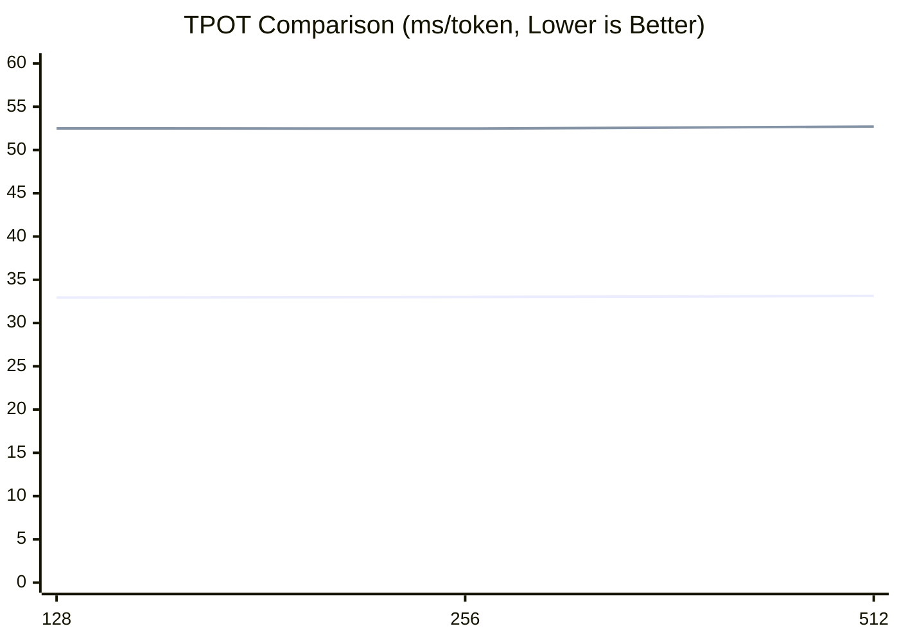

# eLLM: Make LLM Inference on CPUs Faster Than GPUs
## eLLM: Make CPUs (Xeon/EPYC) the Best AI Inference Chips
👉 Project home: [https://github.com/lucienhuangfu/eLLM](https://github.com/lucienhuangfu/eLLM)  
🌐 Languages: [English](README.md) | [简体中文](README.zh-CN.md)  
🎓 We currently have 1-2 trainee openings, and computer science students are welcome to apply  
💼 We are committed to open source and to making AI more accessible, and we welcome industry collaboration  
📧 Contact: **lucienhuangfu@outlook.com**

## 🚀 Progress and Updates
- `v0.1.0-alpha.1` (2026-04-06): Alpha release
- `v0.0.1` (2025-12-20): Project open sourced

## 🔑 Features
**eLLM** is a large-model inference framework built specifically for **CPU servers**
- **CPU-only inference**: Runs on **CPU servers** (Xeon/EPYC) with **no GPU/NPU required**
- **vLLM API compatible**: Fits neatly into the existing ecosystem
- **GPU-equivalent inference**: Aims to match GPU inference numerically and behaviorally as closely as possible

## Hardware Requirements (No GPU/NPU Required)
- **CPU**: Intel Xeon 4th Gen or newer, with AMX support
- **Memory**: Plenty of DDR5 memory, no HBM required

## ✨ Advantages
eLLM is designed to fully exploit the **architectural strengths of CPUs in inference workloads**, allowing it to outperform GPU inference on several key metrics:
- **Low latency**: Full-pass Prefill and per-head attention computation significantly reduce time to first token
- **High throughput**: Even though single-instance concurrency is lower, the shorter end-to-end latency leads to higher **effective QPS**
- **Long context**: Large memory makes it possible to support an effectively unlimited context window
- **Lower energy use**: Prefill loads parameters only once, greatly reducing the energy cost of repeated memory access
- **Lower cost**: Both hardware cost and per-user inference cost are far below GPU-based solutions

## Use Cases
eLLM is a strong fit for long-context inference tasks centered on **Prefill**, especially agents that need to ingest very long context in a single pass:
- **Code Copilot**
  - Ultra-long cross-file and cross-module code context can be prefetched and processed in a single pass
  - Well suited to frequent incremental inference tasks such as refactoring, code review, and code completion
- **RAG (Retrieval-Augmented Generation)**
  - Can dynamically inject large external document sets and knowledge bases into long context
  - Well suited to ultra-long document understanding and enterprise knowledge-base Q&A
- **Deep Research**
  - Well suited to multi-step retrieval, reasoning, and information synthesis, with a large amount of material loaded in the first pass
  - Supports continuous research workflows that can run for hours or even days

## ⚙️ Method
Built around the CPU-server profile of **large memory, large cache, and modest compute**, eLLM follows a "**trade storage for computation**" design philosophy. It rethinks the large-model inference stack and compresses inference into a preallocatable, directly addressable, and stably reusable execution path, delivering more consistent end-to-end latency with lower runtime overhead.

- 🧩 **Elastic static computation graph**
  Build a globally unique static computation graph and store tensors in a **dimension-first** layout, so elements with the same logical coordinates always map to the same memory location. This lets one execution graph handle different input lengths without being rebuilt.
- **Static-shape KV Cache (non-paged)**
  Preallocate fixed-shape tensors for the KV cache instead of relying on paged block management. Reads and writes address KV directly by tensor coordinates, and KV is accessed continuously along the sequence dimension, which reduces metadata management, address translation, and dynamic allocation overhead while keeping TLB and cache misses to a minimum.
- 📦 **Ultra-large dimension tensors**
  Reserve very large token and sequence dimensions to build an effectively "infinite-length" KV tensor. This supports full-pass Prefill while avoiding repeated Prefill and repeated parameter loading, making it suitable for ultra-long prompts and long-lived contexts.
- **⚡ Per-head attention computation (FlashAttention)**
  During Prefill, use "one token, one KV head" as the basic unit of computation. The CPU finishes one head before moving on to the next. This better matches CPU hardware characteristics: limited core counts but large cache capacity. It keeps a single head's KV data in on-chip cache for as long as possible and reduces repeated memory loads.

## 🤖 Supported Models
- ✅ Qwen3 series
- ✅ MiniMax M2.5

## Experiments
So far, the minimal eLLM prototype has been completed. To validate its performance potential, we designed both short-text and long-text experiments and evaluated Prefill and Decode separately, comparing a single CPU server with an inference node made up of 8 GPUs under different scenarios. In short-text inference, CPU is still clearly behind GPU; in long-text inference, however, eLLM has a chance to pull ahead by exploiting the CPU's large-memory advantage.

### Experimental Setup
- CPU baseline: SGLang CPU endpoint (single CPU server)
- GPU baseline: SGLang GPU endpoint v0.5.9 (multi-GPU server; the example uses an 8x H20 node)
- The current experiments run on a public-cloud CPU VM and use only a small portion of the available server resources
- Prefill metric: TTFT (Time to First Token, ms)
- Decode metric: TPOT (Time Per Output Token, ms/token)

### Hardware Comparison

| Item | CPU Server | GPU Server |
|---|---|---|
| Model | Xeon 6982P-C | H20 |
| Cores | 128 | 16,000 |
| FP16 matrix compute (TFLOPS) | 250 | 296 |
| Cache (MB) | 504 (L3) | 60 (L2) |
| Maximum memory capacity (TB) | 3 | 0.141 |
| Quantity | 1 | 8 |
| Total price ($) | 17,000 | 220,000 |


### Experiment Notes
- The current experiments focus on **benchmarking and system performance evaluation**.
- **Operator-level** tests and alignment have been completed, which shows that the underlying execution path is already basically usable.
- The **model-level** outputs are not yet fully aligned with the reference implementation.
  - The current setup uses **randomly initialized parameters** and has not yet been connected to real model weights.
  - This stage still does not include **attention** or **tokenization**.


#### Short-Text Experiment (Completed)

**Experimental Setup**
- Model: Qwen3-Coder-30B-A3B-Instruct (FP16)
- Scenario: short prompt, `batch = 1`, `prompt length = {128, 256, 512}`
- Since CPU inference frameworks are typically far behind GPUs on Decode for short prompts, this experiment does not include a separate GPU comparison.
- This experiment evaluates Decode only; Prefill is covered by the long-text experiment.

**Experimental Environment**

| Item | Configuration |
|---|---|
| Environment | CPU VM |
| Configured cores | 48 |
| Configured memory capacity (TB) | 0.192 |

**Decode Results**
Across the three tests with `prompt_len=128/256/512`, eLLM consistently outperformed the SgLang CPU baseline and delivered lower TPOT on CPU. Overall, eLLM achieved about a `1.6×` speedup, corresponding to roughly a `38%` reduction in latency. As context length increases, TPOT rises approximately linearly for both systems, but eLLM has the gentler slope, which suggests a better efficiency trend even in short-context settings.



**Decode Analysis**  
This result shows that the bottleneck in short-text Decode is not mainly operator computation itself, but rather control-path overhead such as scheduling, memory management, and runtime execution. eLLM's static computation graph and lighter execution path reduce the cost of dynamic scheduling and state maintenance, leaving more time for actual operator execution and producing stable gains over the CPU baseline.

From the CPU baseline execution path, the main costs fall into four categories:

- Scheduling overhead: continuous batching, token-level routing, and request merge/split operations all have to happen repeatedly; every generated token passes through the scheduling path, so control overhead keeps rising as the number of active requests grows.
- KV cache management: autoregressive Decode must continuously preserve historical token KV state and handle KV block allocation, reclamation, and address mapping. These operations are cheap individually, but they are so frequent that metadata and memory-access costs become amplified.
- Intermediate tensor management: Decode still produces temporary tensors such as Q, K, V projections, attention intermediates, MLP activations, and residual buffers. If they cannot be reused effectively, they lead to frequent allocation and release, memory fragmentation, and bandwidth pressure.
- Service framework/runtime overhead: API serving, request lifecycle management, and streaming scheduling all add extra cost. GIL, context switching, and dynamic data structure operations further increase end-to-end latency.

#### Long-Text Experiment (Expected to Complete by End of May)
GPU memory capacity is relatively limited, so chunk size is constrained. That means long prompts must be processed in segments, and batch size is constrained as well. In Prefill, segmented long contexts have to be processed repeatedly, which adds extra overhead. In Decode, a small batch size leaves too little parallelism and causes a noticeable performance drop.


**Experimental Setup**
- Model: Qwen3-Coder-480B-A35B-Instruct (FP16)
- Scenario: `batch size = 10`, `prompt length = 100,000`
  - eLLM: `chunk size = 1,000,000`, `batch size = 10`, `sequence length = 100,000`, completed in a single pass
  - GPU baseline: `chunk size = 10,000`, `batch size = 10`, `sequence length = 1,000`, requires 100 segments to complete

**Results**  
We are still collecting and organizing the experimental data, so there is no final conclusion yet.

**Prefill Analysis**  
eLLM is expected to be significantly faster than the GPU baseline. In the Prefill stage for ultra-long prompts, time to first token (TTFT) is driven mainly by two factors: large-scale data movement (loading model parameters and KV) and the scheduling and synchronization overhead introduced by segmentation. eLLM aims to make Prefill as continuous and low-intervention as possible, which should fundamentally reduce both costs. If eLLM can stably support full-pass Prefill, the advantages of continuous access, reduced repeated loading, and lower control overhead should translate into a substantial TTFT reduction. The causal chain is described below:

- **1) Parameter and KV reads:**
  - Problem: For ultra-long inputs, if the entire prompt cannot fit in memory at once, GPUs often have to split it into multiple chunks and process them sequentially. Because of segmentation and memory-management limits, each chunk may reload model parameters and related KV into GPU cache, causing multiple memory I/Os and adding substantial latency.
  - eLLM advantage: Server-grade CPUs usually have much larger main memory, which allows Prefill to run in fewer segments or even in a single pass, dramatically reducing repeated memory I/O. Although CPU DDR5 bandwidth is lower than GPU HBM, cutting repeated loads usually produces a more meaningful TTFT improvement.

- **2) KV organization and access pattern:**
  - Problem: In ultra-long-context scenarios, KV cache size grows linearly with sequence length, and the access pattern, whether by head or by token, directly determines cache hit rate and memory transfer overhead. On GPU many-core architectures, throughput is usually maximized with a highly parallel batch × head computation pattern, which means multiple KV head datasets have to live in memory at the same time. That increases the cache footprint, leads to more frequent cache eviction, and intensifies HBM bandwidth contention and data transfer overhead, which becomes even more pronounced in ultra-long-context inference.
  - eLLM advantage: CPUs have much larger on-chip caches (L3 cache), giving them a natural advantage in KV residency and access locality. eLLM builds on this by using a fixed-shape, dimension-first KV storage layout and a **per-head sequential execution** strategy. On the CPU, compute cores finish all token computations for one attention head first, during which that head's KV data can stay in cache and be reused for a long time, before switching to the next head. This gives each head a longer cache residency window and a more continuous access path, substantially improving temporal and spatial locality. With CPU cache capacity and eLLM's access-pattern optimization, the effective cache residency of a single KV head can improve by about **2-3 orders of magnitude** compared with a conventional parallel execution pattern.

- **3) Control and synchronization costs from segmentation:**
  - Problem: Splitting a long prompt into multiple chunks introduces extra scheduling points, synchronization overhead, memory fragmentation, and cross-segment intermediate-state maintenance, such as KV reorganization and merging, all of which directly increase TTFT.
  - eLLM advantage: If Prefill can be turned into one continuous pipeline, that is, full-pass Prefill, scheduling and synchronization points can be reduced significantly, minimizing control-path overhead.

**Decode Analysis**  
In the Decode stage for long contexts, eLLM is still slower overall than the GPU baseline, but the gap is much smaller than the theoretical DDR-versus-HBM bandwidth difference. That suggests the GPU bandwidth advantage is not being fully realized here, and the bottleneck is more about insufficient parallelism and suboptimal memory-access patterns than about the raw bandwidth ceiling.

- **1) Small batch size:**
  - Problem: Long sequences directly reduce batch size. When GPU memory is constrained and chunk size is fixed, the longer the sequence, the smaller the batch that can be kept in flight. In the Decode stage, each request must carry the full historical KV cache, which further reduces effective concurrency.
  - eLLM advantage: CPUs have larger memory capacity and can support a larger chunk size, so batch size is less constrained and higher concurrency is easier to maintain.

- **2) Uneven MoE load:**
  - Problem: MoE experts are spread across different GPUs, and expert activation is random. In small-batch scenarios, that can easily lead to load imbalance, with some GPUs overloaded while others sit idle, or even only a few GPUs doing useful work.
  - eLLM advantage: eLLM runs on a single CPU machine and does not need to distribute experts across devices. That avoids load imbalance and cross-device communication issues, and lets all compute resources stay busy more consistently.

- **3) Inefficient effective memory bandwidth:**
  - Problem: High GPU bandwidth depends on massive warp concurrency and sustained memory-level parallelism to hide memory-access latency. In small-batch scenarios, there are not enough warps to schedule, SMs cannot be fully occupied, memory requests become less continuous, HBM latency is exposed, and SMs frequently stall while waiting for data, which drives effective bandwidth down sharply.
  - eLLM advantage: CPUs have fewer cores and lower parallelism requirements, so they can saturate compute resources more easily even with small batches. Combined with cache and prefetch mechanisms, they can stay closer to theoretical memory bandwidth more consistently.

- **4) Poor memory-access efficiency:**
  - Problem: Paged KV cache further hurts memory-access efficiency. Once KV is split into discrete pages, what used to be contiguous access becomes scattered, which breaks memory coalescing and lowers transaction efficiency. It also requires page-table translation and pointer chasing, which adds extra loads and longer dependency chains and reduces instruction-level parallelism. On top of that, TLB misses and cache misses increase, and non-contiguous access means more memory transactions are needed to fetch the same data, further increasing bandwidth usage.
  - eLLM advantage: It uses a static, contiguous KV tensor with direct coordinate-based access, creating a linear memory-access pattern that makes full use of hardware prefetch and cache to improve overall memory efficiency.

- **5) Amplified kernel launch/scheduling overhead:**
  - Problem: Decode advances token by token, and each step triggers a chain of GPU kernels such as attention, matmul, and layernorm. In small-batch scenarios, the work per kernel is small, but kernel launch and scheduling overhead stay the same, so their share rises sharply. At the same time, the computation granularity is too fine for the GPU to keep a fully saturated execution pipeline, utilization fluctuates, SMs cannot remain fully loaded for long, and overall throughput drops.
  - eLLM advantage: eLLM runs on the CPU through function calls, so there is no kernel launch overhead, and execution is more stable in small-batch, low-parallelism settings.


## Conclusion

GPUs have long been seen as the default choice for large-model inference, while CPUs are often assumed to be unable to compete in the same arena. eLLM's experimental results suggest that this is not always true: in long-context inference, a single CPU can compete directly with a multi-GPU system on end-to-end performance, and may even outperform it.

The core reason is that eLLM makes full use of two key CPU advantages. First, CPUs have larger main memory, which supports full-pass Prefill for long prompts and reduces the repeated loading and scheduling overhead introduced by segmentation. Second, CPUs have larger cache capacity, and combined with per-head attention execution, they can greatly improve data residency and reuse, which lowers overall Prefill latency.

As a result, in inference workloads dominated by Prefill, even if Decode is a bit slower, the Prefill advantage can still dominate total runtime and deliver better end-to-end performance. Looking ahead, if eLLM is extended to multi-socket NUMA CPU servers and paired with more memory and more parallel resources, it could cover an even broader set of long-context, long-lived, low-latency inference scenarios and offer a cost-effective alternative to the GPU route.


## 📄 Paper
If you'd like to learn more about eLLM's design and technical details, feel free to read and cite our paper. Please note that the public version is still an **early draft**, and some implementation details do not yet fully reflect the latest progress of eLLM. We are continuing to update it, so thank you for your understanding.
```bibtex
@misc{huangfu2025ellm,
  title        = {eLLM: Achieving Lossless Million-Token LLM Inference on CPUs Faster Than GPUs},
  author       = {Huangfu, Yaguang},
  howpublished = {Preprint, ResearchGate},
  year         = {2025},
  url          = {https://www.researchgate.net/publication/393416965}
}
```

## 📜 License
This project is released under the [Apache 2.0 License](LICENSE).
