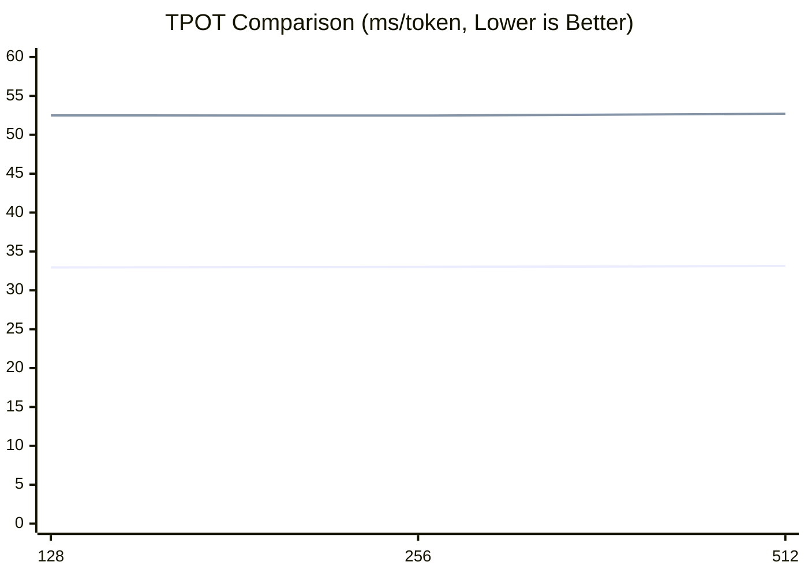

# eLLM：让 LLM 推理在 CPUs 上快过 GPUs
## eLLM： 让 Xeon / EPYC 成为最优的 AI 推理芯片
## 使命：打破 GPU 壁垒，让强大的 AI 能力触达每一个人
👉 项目地址：[https://github.com/lucienhuangfu](https://github.com/lucienhuangfu)  
🌐 语言版本：[English](README.md) | [简体中文](README.zh-CN.md)  
我们正在寻找 **志愿者** 和 **资金支持**  
📧 联系方式：**lucienhuangfu@outlook.com**

## 🚀 进展与更新
- 2026-04-06: 发布 Alpha 版本  
- 2025-12-20: Initial Release  

## 🔑 功能
**eLLM**：专为 **CPU 服务器**打造的大模型推理框架
- **纯 CPU 推理**：运行在 **CPU 服务器**（Xeon / EPYC）上，**无需 GPU / NPU**
- **兼容 vLLM API**：可无缝接入现有生态
- **结果等价 GPU 推理**：与 GPU 推理在数值与行为上保持一致

## 硬件要求（无需 GPU / NPU）
- **CPU**：Intel Xeon Gen4 及以上（支持 AMX 指令集）
- **内存**：足量的DDR5（无需 HBM） 

## ✨ 优势
eLLM 充分释放了 **CPU 在推理场景下的体系结构优势**，使其在多项关键指标上实现对 GPU 推理的全面超越：
- **低延迟**：整段 Prefill，显著降低首 token 延迟
- **高吞吐**：单实例并发度虽低，但由于端到端延迟更小，**实际 QPS 反而更高**
- **长上下文**：大内存支持近乎“无限长度”的上下文窗口
- **低能耗**：Prefill 阶段仅加载一次参数，大幅降低重复访存的能耗
- **低成本**：硬件成本与单用户推理成本显著低于 GPU 方案

## 应用
eLLM 以 **长上下文、长生命周期、低延迟** 的推理特性为核心，天然契合当前主流 Agent 形态：
- **Code Copilot**
  - 跨文件、跨模块的长上下文代码理解
  - 长时间会话与连续编辑状态的保持
  - 高频、小粒度的增量推理与即时补全
- **RAG（Retrieval-Augmented Generation）**
  - 动态注入大规模外部文档与知识库
  - 检索结果可长期保留于上下文中，避免重复 Prefill
  - 适合超长文档、企业知识库与私有数据场景
- **Deep Research**
  - 多步骤检索、推理与信息整合
  - 需要长期保存中间结论、引用与证据链
  - 支持跨数小时甚至数天的连续研究流程
- **Deep Thinking**
  - 长链路、递进式推理（Chain-of-Thought / Tree-of-Thought）
  - 大量中间状态与推理轨迹需长期保留
  - 对低延迟交互与稳定上下文一致性要求高

## ⚙️ 方法
基于 CPU 服务器“内存大、计算小”的体系结构，eLLM 采用“**内存换计算**”的设计理念，重构大模型推理框架，将推理过程压缩为一条可预分配、可直接访问、可稳定复用的执行链路，以更低的运行时开销换取更稳定的端到端延迟。

- 🧩 **弹性静态计算图**
  构建全局唯一的静态计算图，并采用**维度优先（dimension-first）**的布局存取张量，让相同逻辑坐标的元素稳定映射到相同内存位置，使同一套执行图可以在不重建计算图的前提下支持不同输入长度。
- **静态形状 KV Cache（不分页）**
  为 KV Cache 预分配固定形状的 tensor，不依赖分页式 block 管理；读写时直接按张量坐标定位 KV，并沿 sequence 维度连续读取 KV，减少元数据维护、地址映射和动态分配开销，尽量避免 TLB miss 和 cache miss。
- 📦 **超大维度张量**
  为张量预留足够大的 token / sequence 维度，构建近似“无限长度”的 KV Tensor，支持整段 Prefill，从而尽量避免重复 Prefill 和参数反复载入，适配超长 Prompt 和长生命周期上下文。

## 🤖 支持模型
- ✅ MiniMax M2.5  
- ✅ Qwen3 系列  

## 实验

截至目前，eLLM 的最小原型已经完成。为验证它的性能潜力，我们设计了短文本与长文本两类实验，并分别考察 Prefill 和 Decode 两个阶段，比较单块 CPU 服务器与由 8 块 GPU 组成的推理节点在不同场景下的表现。短文本推理场景下，CPU 明显落后于 GPU；但在长文本推理场景下，eLLM 有机会凭借 CPU 的大内存优势实现反超。

### 目标
验证 eLLM 是否在常见推理场景上：
  1) 显著优于现有 CPU baseline；
  2) 在长上下文优于 GPU baseline。

### 实验设置
- CPU baseline: SgLang CPU endpoint（单块 CPU 服务器）
- GPU baseline: SgLang GPU endpoint（多卡 GPU 服务器，示例使用 8x H20 节点）
- Prefill 指标: TTFT （Time to First Token，ms/token）
- Decode 指标: TPOT（Time Per Output Token，ms/token）

| CPU-only 服务器 | 条目 | GPU 服务器 | |
|----------|--------------|------------|------|
|CPU       |               |CPU         |GPU| 
| Xeon 6982P-C | 型号           |   Xeon 8480+     | H20   |
|0.192|内存容量(TB)|2|0.141|
| 1| 数量          |4        | 8  |
|1.7|总价(万元) |150|

### 实验说明
- 当前实验聚焦于 **benchmark 与系统性能评估**。
- **算子层面**已完成测试与对齐，说明底层执行链路已经具备基本可用性。
- **模型层面**的输出未与参考实现完全一致。
  - 当前加载的是 **随机初始化参数**，尚未接入真实模型权重。
  - 本阶段尚未纳入 **attention** 和 **切词（tokenization）** 流程


#### 短文本实验（已完成）  

**实验设置**  
- 模型：Qwen3-Coder-30B-A3B-Instruct （Float 16）  
- 场景：短 Prompt，`batch=1`，`prompt length={128,256,512}`    
- 显然所有CPU推理框架decode短文本的性能都是远远落后于GPU，所以GPU的对比实验就不做了。
- 只做Decode 实验，Prefill 不做了，可以在长文本的实验中得到验证   


**Decode 结果**
在 `prompt_len=128/256/512` 的三组测试中，eLLM 均稳定优于 vLLM CPU baseline，在 CPU 上表现出更低的 TPOT。综合来看，eLLM 约带来 `1.6×` 的性能提升，对应约 `38%` 的延迟下降。随着上下文长度增加，两者的 TPOT 都呈近似线性增长，但 eLLM 的斜率更低，说明其在短上下文范围内已经展现出更好的效率趋势。



**Decode 分析**  
这一结果表明，短文本 decode 的瓶颈并不主要落在算子计算本身，而更多来自调度、内存管理和运行时这些“控制路径”开销。eLLM 的静态计算图和更轻量的执行路径减少了动态调度与状态维护成本，把更多时间留给真正的算子执行，因此能够在 CPU baseline 上获得稳定收益。

从 CPU baseline 的执行链路看，主要损耗可以归纳为四类：

- 调度开销：需要频繁执行 continuous batching、token 级路由以及请求合并/拆分；每生成一个 token 都要经过一次调度路径，随着活跃请求增多，控制开销会持续上升。
- KV Cache 管理：自回归 decode 需要持续保存历史 token 的 K/V 状态，并处理 KV block 的分配、回收和地址映射；这些操作单次开销不大，但频率极高，容易放大元数据和访存成本。
- 中间张量管理：decode 过程中仍会产生 Q/K/V 投影、attention 中间结果、MLP 激活和 residual buffer 等临时 tensor；如果不能稳定复用，就会引入频繁分配与释放、内存碎片和带宽压力。
- 服务框架 / 运行时开销：API 服务、请求生命周期和 streaming 调度都会带来额外成本；GIL、上下文切换和动态数据结构操作也会进一步拖慢端到端延迟。

#### 长文本实验（预计5月底完成）
GPU 的内存小，限制 长文本的batch size。不会影响Prefill，但是会影响decode。


**实验设置**  
- 模型：Minimax M2.5（Float 16）
- 场景：batch size = 10, prompt length = 100,000
  - eLLM：chunk size = 1，000,000 ，batch size = 10, sequence length = 100,000 , 整段完成
  - GPU baseline：chunk size = 10,000 ，batch size = 10, sequence length = 1,000 , 需要分 100 段完成

**结果**  
目前实验数据仍在收集与整理中，尚未形成最终结论。

**Prefill 分析**  
eLLM 会显著快于 GPU baseline。在超长 Prompt 的 Prefill 阶段，首 token 延迟（TTFT）主要由两类因素驱动：其一是大规模的数据读取（模型参数与 KV 的加载），其二是分段处理带来的调度与同步开销。eLLM 的目标是将 Prefill 组织为尽可能连续且低干预的流水线，从根本上压缩这两类开销。eLLM 能稳定支持整段 Prefill，就有望将“连续访问、减少重复载入、降低控制开销”的优势转化为可观的首 token 延迟下降。下面按因果链逐项说明：

- **1) 参数与 KV 的读取：**  
  - 问题：对于超长输入，显存无法一次容纳时，GPU 往往将输入拆成多个 chunk 顺序处理。受分段策略和显存管理限制，每个 chunk 的处理需要重复将模型参数及相关 KV 加载到 GPU 缓存，导致多次重复的内存 I/O，从而累积显著延迟。  
  - eLLM 优势：服务器级 CPU 通常拥有更大的主内存，能够用更少的分段甚至一次性完成 Prefill，显著降低重复内存 I/O。尽管 CPU 的 DDR5 带宽低于 GPU 的 HBM，但通过减少重复载入，TTFT 通常能获得更明显的改善。  
- **2) KV（Key/Value）组织与访问局部性：**  
  - 问题：超长上下文会使 KV 体量显著增加，访问模式（按 head 或按 token）直接影响缓存命中率与搬运量。如果硬件或运行时要求同时驻留多个 head 的 KV（例如某些 GPU 的并行策略），会加剧缓存替换与带宽竞争。  
  - eLLM 优势：采用固定形状、维度优先的 KV 存储，并在计算策略上倾向“逐 head”顺序：在 CPU 实现中，各计算核先完成某一 head 的所有 token 计算并写回对应 KV，再处理下一个 head；这保证了对单个 head KV 的连续访问和短期缓存驻留，显著降低同时驻留多个 head KV 带来的缓存压力。相比之下，GPU 的多 head 并行策略需要同时保存多个 head 的 KV，增加了缓存替换与带宽争用，在超长上下文下会放大数据搬运成本。  
- **3) 分段带来的控制与同步成本：**  
  - 问题：将长 Prompt 切成多个 chunk 会引入额外的调度点、同步开销、内存碎片和跨段中间态维护（例如 KV 重组与合并），这些都会直接增加首 token 的延迟。  
  - eLLM 优势：若能把 Prefill 做成一次连续的流水（整段 Prefill），可显著减少调度与同步点，从而把控制路径开销降到最低。  

**Decode 分析**  
在超长上下文的 decode 阶段，eLLM 显然慢于 GPU baseline，但是没有两者的理论带宽那么大。

1) GPU 有效带宽下降  
 - 说明：GPU 在高并行度场景下能更好地隐藏内存延迟与提升带宽利用率，但当并行度（例如 batch 或 token 并发）不足时，实际带宽利用会显著下降。小批量或低并行度会限制 GPU 隐藏延迟的能力，从而削弱其带宽优势。

2) KV 访问模式与缓存层次  
 - 说明：超长序列使得 KV 成为一个超大 working set，低重用率”的 streaming 模式，无法完全驻留在片上缓存（L2）导致 cache 几乎失效

3）kv 分page 开销很大。后果：高频的 cache miss、chunk 间地址映射与重复加载，显著增加每 token 的访存延迟；同时分块（chunking）会引入额外的拷贝与索引转换开销。  
  


## 📄 论文
如果你对 eLLM 的底层设计与技术细节感兴趣，欢迎阅读并引用我们的论文。需要说明的是，当前公开版本为**早期论文**，其中部分实现细节尚未完全反映 eLLM 的最新进展，我们正在持续更新中，敬请理解。
```bibtex
@misc{huangfu2025ellm,
  title        = {eLLM: Achieving Lossless Million-Token LLM Inference on CPUs Faster Than GPUs},
  author       = {Huangfu, Yaguang},
  howpublished = {Preprint, ResearchGate},
  year         = {2025},
  url          = {https://www.researchgate.net/publication/393416965}
}
```

## 📜 开源协议
这个项目使用 [Apache 2.0 License](LICENSE).
