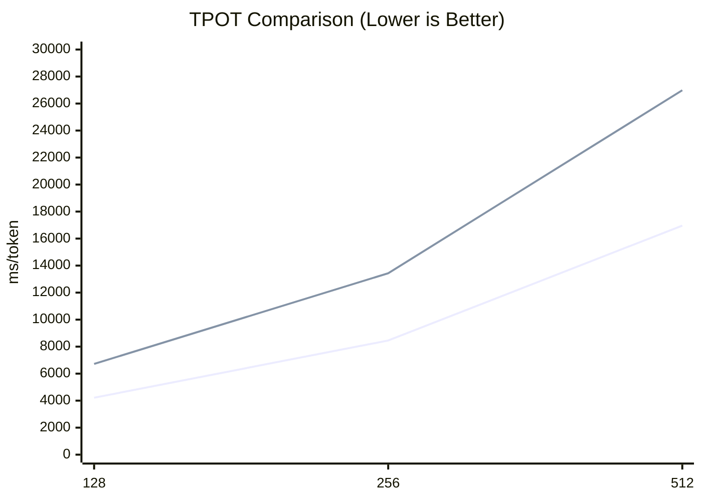

# eLLM：让 LLM 推理在 CPUs 上快过 GPUs
## eLLM： 让 Xeon / EPYC 成为最优的 AI 推理芯片
## 使命：打破 GPU 壁垒，让强大的 AI 能力触达每一个人
👉 项目地址：[https://github.com/lucienhuangfu](https://github.com/lucienhuangfu)  
🌐 语言版本：[English](README.md) | [简体中文](README.zh-CN.md)  
我们正在寻找 **志愿者** 和 **资金支持**  
📧 联系方式：**lucienhuangfu@outlook.com**

## 🚀 进展与更新
- 2026-04-06: 发布 Alpha 版本  
- 2025-12-20: Initial Release  

## 🔑 功能
**eLLM**：专为 **CPU 服务器**打造的大模型推理框架
- **纯 CPU 推理**：运行在 **CPU 服务器**（Xeon / EPYC）上，**无需 GPU / NPU**
- **兼容 vLLM API**：可无缝接入现有生态
- **结果等价 GPU 推理**：与 GPU 推理在数值与行为上保持一致

## 硬件要求（无需 GPU / NPU）
- **CPU**：Intel Xeon Gen4 及以上（支持 AMX 指令集）
- **内存**：足量的DDR5（无需 HBM） 

## ✨ 优势
eLLM 充分释放了 **CPU 在推理场景下的体系结构优势**，使其在多项关键指标上实现对 GPU 推理的全面超越：
- **低延迟**：整段 Prefill，显著降低首 token 延迟
- **高吞吐**：单实例并发度虽低，但由于端到端延迟更小，**实际 QPS 反而更高**
- **长上下文**：大内存支持近乎“无限长度”的上下文窗口
- **低能耗**：Prefill 阶段仅加载一次参数，大幅降低重复访存的能耗
- **低成本**：硬件成本与单用户推理成本显著低于 GPU 方案

## 应用
eLLM 以 **长上下文、长生命周期、低延迟** 的推理特性为核心，天然契合当前主流 Agent 形态：
- **Code Copilot**
  - 跨文件、跨模块的长上下文代码理解
  - 长时间会话与连续编辑状态的保持
  - 高频、小粒度的增量推理与即时补全
- **RAG（Retrieval-Augmented Generation）**
  - 动态注入大规模外部文档与知识库
  - 检索结果可长期保留于上下文中，避免重复 Prefill
  - 适合超长文档、企业知识库与私有数据场景
- **Deep Research**
  - 多步骤检索、推理与信息整合
  - 需要长期保存中间结论、引用与证据链
  - 支持跨数小时甚至数天的连续研究流程
- **Deep Thinking**
  - 长链路、递进式推理（Chain-of-Thought / Tree-of-Thought）
  - 大量中间状态与推理轨迹需长期保留
  - 对低延迟交互与稳定上下文一致性要求高

## ⚙️ 方法
基于 CPU 服务器“内存大、计算相对充足”的体系结构，eLLM 采用“**内存换计算**”的设计理念，重构大模型推理框架。我们的目标不是追求更复杂的调度，而是尽量把推理路径压缩成一条可预分配、可直接访问、可稳定复用的执行链路。

- 🧩 **弹性静态计算图**
  构建全局唯一的静态计算图，并采用**维度优先（dimension-first）**的布局存取张量，使同一套执行图可以在不重建计算图的前提下支持不同输入长度。
- **静态形状 KV Cache（不分页）**
  为 KV Cache 预分配固定形状的 tensor，不依赖分页式 block 管理；读写时直接按张量坐标定位 KV，并沿 sequence 维度连续读取 KV，减少元数据维护、地址映射和动态分配开销。
- 📦 **超大维度张量**
  为张量预留足够大的 token / sequence 维度，支持整段 Prefill 而不是切块加载，从而尽量避免重复 Prefill 和参数反复载入，适配超长 Prompt 和长生命周期上下文。

综合来看，eLLM 把推理过程从“动态调度 + 分页管理”转为“预分配 + 坐标访问”的模式，以更低的运行时开销换取更稳定的端到端延迟。

## 🤖 支持模型
- ✅ MiniMax M2.5  
- ✅ Qwen3 系列  

## 实验

最小原型已经完成。接下来我们按原意组织一套可复现的实验流程，用以验证 eLLM 在多类场景下相对于 CPU / GPU baseline 的性能与资源消耗差异，并保留原始结论与论据。eLLM 需要提速 2 个数量级才能超越 GPU，这几乎不可能。

### 目标
- 验证 eLLM 是否在常见推理场景（短 Prompt、长 Prompt、Prefill、Multi-turn）上：
  1) 显著优于现有 CPU baseline；
  2) 在多数长上下文或多轮场景下优于 GPU baseline（原文断言：若只在单轮短文本场景会慢于 GPU）。

### 实验设置
- CPU baseline: SgLang CPU endpoint（单块 CPU 服务器）
- GPU baseline: SgLang GPU endpoint（多卡 GPU 服务器，示例使用 8x H20 节点）

| CPU-only 服务器 | 条目 | GPU 服务器 | |
|----------|--------------|------------|------|
|CPU       |               |CPU         |GPU| 
| Xeon 6980P| 型号           |   Xeon 8480+     | H20   |
|3|内存容量(TB)|2|0.141|
| 1| 数量          |4        | 8  |
|15|总价(万元) |150|


#### 实验 1 — Decode 短文本（已完成）

**目的**  
验证 eLLM 在短文本 decode 场景下是否能够稳定降低 TPOT，并观察其相对于 CPU baseline 的收益来源。

**实验设置**  
- 沿用上文的 baseline 与硬件环境
- 场景：短 Prompt，`batch=1`，`prompt_len={128,256,512}`
- 指标：TPOT（Time Per Output Token，ms/token）
- 关注点：不同上下文长度下的延迟变化趋势

**结果**  
在 `prompt_len=128/256/512` 的三组测试中，eLLM 均稳定优于 vLLM CPU baseline，在 CPU 上表现出更低的 TPOT。综合来看，eLLM 约带来 `1.6×` 的性能提升，对应约 `38%` 的延迟下降。随着上下文长度增加，两者的 TPOT 都呈近似线性增长，但 eLLM 的斜率更低，说明其在短上下文范围内已经展现出更好的效率趋势。



**分析**  
这一结果表明，短文本 decode 的瓶颈并不主要落在算子计算本身，而更多来自调度、内存管理和运行时这些“控制路径”开销。eLLM 的静态计算图和更轻量的执行路径减少了动态调度与状态维护成本，把更多时间留给真正的算子执行，因此能够在 CPU baseline 上获得稳定收益。

从 CPU baseline 的执行链路看，主要损耗可以归纳为四类：

- 调度开销：需要频繁执行 continuous batching、token 级路由以及请求合并/拆分；每生成一个 token 都要经过一次调度路径，随着活跃请求增多，控制开销会持续上升。
- KV Cache 管理：自回归 decode 需要持续保存历史 token 的 K/V 状态，并处理 KV block 的分配、回收和地址映射；这些操作单次开销不大，但频率极高，容易放大元数据和访存成本。
- 中间张量管理：decode 过程中仍会产生 Q/K/V 投影、attention 中间结果、MLP 激活和 residual buffer 等临时 tensor；如果不能稳定复用，就会引入频繁分配与释放、内存碎片和带宽压力。
- 服务框架 / 运行时开销：API 服务、请求生命周期和 streaming 调度都会带来额外成本；GIL、上下文切换和动态数据结构操作也会进一步拖慢端到端延迟。

**小结**  
实验 1 说明，在 `batch=1` 的短文本 decode 场景下，端到端延迟更受控制路径影响，而不是受纯算子算力限制。eLLM 通过静态执行图、固定形状的 KV Cache、中间张量预分配和更少的运行时干预，显著压缩了系统层开销，因此能够在这一场景下稳定优于 CPU baseline。

#### 实验 2 — Decode 长文本 （计划）
- 场景：整段 long-context decode（一次性加载超长 prompt 并解码若干 token）
- 指标：Prefill Time、TPOT、内存峰值、带宽占用
- 预期观察：在超长上下文场景下 eLLM 的总体延迟与 TPOT 优于 GPU baseline（若 GPU 需分段加载并重复载入参数则开销更高）。
- 分析要点：长文本场景转为 memory-bound，内存布局与连续 KV Cache 带来的带宽利用率改进能超过 GPU 的并行算力优势；GPU 的分段加载与多次参数载入会产生额外成本。

#### 实验 3 — Prefill 长 Prompt（计划）
- 场景：仅测 Prefill 阶段（把长 prompt 写入 KV Cache 并测量耗时/内存），对比整段 Prefill 与分段 Prefill 的差异
- 测量步骤：对同一长 Prompt 分别使用整段 Prefill（若内存足够）与分段 Prefill，在三种实现上记录 Prefill Time、峰值内存、CPU/GPU IO 活动。
- 指标：Prefill Time、内存峰值、参数重载次数
- 预期观察：eLLM 在整段 Prefill 下耗时更低且内存使用更可控；GPU 在分段 Prefill 下因重复参数加载表现较差。
- 分析要点：Prefill 成本由内存带宽与参数加载次数驱动；CPU 大内存 + 连续 KV Cache 能降低参数重载与间接访问带来的开销。


## 📄 论文
如果你对 eLLM 的底层设计与技术细节感兴趣，欢迎阅读并引用我们的论文。需要说明的是，当前公开版本为**早期论文**，其中部分实现细节尚未完全反映 eLLM 的最新进展，我们正在持续更新中，敬请理解。
```bibtex
@misc{huangfu2025ellm,
  title        = {eLLM: Achieving Lossless Million-Token LLM Inference on CPUs Faster Than GPUs},
  author       = {Huangfu, Yaguang},
  howpublished = {Preprint, ResearchGate},
  year         = {2025},
  url          = {https://www.researchgate.net/publication/393416965}
}
```

## 📜 开源协议
这个项目使用 [Apache 2.0 License](LICENSE).


- **CPU 实验**：验证 eLLM 在 CPU 推理场景下的性能优势，显著超越当前主流 CPU 推理框架。
- **GPU 实验**：在长文本或多轮推理场景中，eLLM 即便运行于 CPU，也会快于 GPU 推理框架。


：从根本上避免重复 Prefill，显著降低端到端时延
- 采用 *维度优先* 的数据布局放置动态形状张量：即使 sequence 长度不同，相同逻辑坐标的元素仍映射到相同的内存地址
：长 Prompt 仅加载一次模型参数
- 为 KV Cache 分配分级的超大连续内存，构建近似“无限长度”的 KV Tensor：连续布局让 K/V 的访问没有 TLB miss / cache miss
