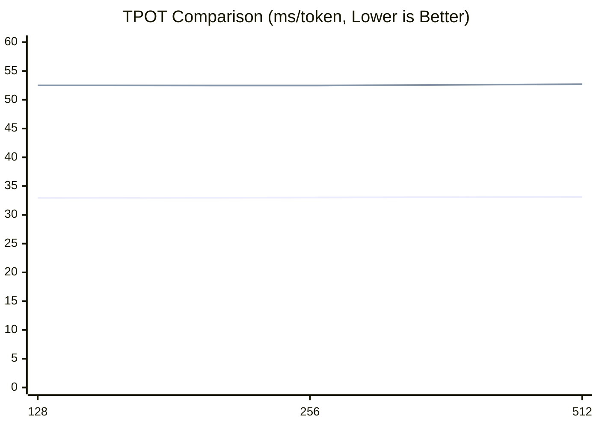

# eLLM：让 LLM 推理在 CPUs 上快过 GPUs
## eLLM： 让 Xeon / EPYC 成为最优的 AI 推理芯片
## 使命：打破 GPU 壁垒，让强大的 AI 能力触达每一个人
👉 项目地址：[https://github.com/lucienhuangfu](https://github.com/lucienhuangfu)  
🌐 语言版本：[English](README.md) | [简体中文](README.zh-CN.md)  
我们正在寻找 **志愿者** 和 **资金支持**  
📧 联系方式：**lucienhuangfu@outlook.com**

## 🚀 进展与更新
- 2026-04-06: 发布 Alpha 版本  
- 2025-12-20: Initial Release  

## 🔑 功能
**eLLM**：专为 **CPU 服务器**打造的大模型推理框架
- **纯 CPU 推理**：运行在 **CPU 服务器**（Xeon / EPYC）上，**无需 GPU / NPU**
- **兼容 vLLM API**：可无缝接入现有生态
- **结果等价 GPU 推理**：与 GPU 推理在数值与行为上保持一致

## 硬件要求（无需 GPU / NPU）
- **CPU**：Intel Xeon Gen4 及以上（支持 AMX 指令集）
- **内存**：足量的DDR5（无需 HBM） 

## ✨ 优势
eLLM 充分释放了 **CPU 在推理场景下的体系结构优势**，使其在多项关键指标上实现对 GPU 推理的全面超越：
- **低延迟**：整段 Prefill，显著降低首 token 延迟
- **高吞吐**：单实例并发度虽低，但由于端到端延迟更小，**实际 QPS 反而更高**
- **长上下文**：大内存支持近乎“无限长度”的上下文窗口
- **低能耗**：Prefill 阶段仅加载一次参数，大幅降低重复访存的能耗
- **低成本**：硬件成本与单用户推理成本显著低于 GPU 方案

## 应用
eLLM 以 **长上下文、长生命周期、低延迟** 的推理特性为核心，天然契合当前主流 Agent 形态：
- **Code Copilot**
  - 跨文件、跨模块的长上下文代码理解
  - 长时间会话与连续编辑状态的保持
  - 高频、小粒度的增量推理与即时补全
- **RAG（Retrieval-Augmented Generation）**
  - 动态注入大规模外部文档与知识库
  - 检索结果可长期保留于上下文中，避免重复 Prefill
  - 适合超长文档、企业知识库与私有数据场景
- **Deep Research**
  - 多步骤检索、推理与信息整合
  - 需要长期保存中间结论、引用与证据链
  - 支持跨数小时甚至数天的连续研究流程
- **Deep Thinking**
  - 长链路、递进式推理（Chain-of-Thought / Tree-of-Thought）
  - 大量中间状态与推理轨迹需长期保留
  - 对低延迟交互与稳定上下文一致性要求高

## ⚙️ 方法
基于 CPU 服务器“内存大、计算小”的体系结构，eLLM 采用“**内存换计算**”的设计理念，重构大模型推理框架，将推理过程压缩为一条可预分配、可直接访问、可稳定复用的执行链路，以更低的运行时开销换取更稳定的端到端延迟。

- 🧩 **弹性静态计算图**
  构建全局唯一的静态计算图，并采用**维度优先（dimension-first）**的布局存取张量，让相同逻辑坐标的元素稳定映射到相同内存位置，使同一套执行图可以在不重建计算图的前提下支持不同输入长度。
- **静态形状 KV Cache（不分页）**
  为 KV Cache 预分配固定形状的 tensor，不依赖分页式 block 管理；读写时直接按张量坐标定位 KV，并沿 sequence 维度连续读取 KV，减少元数据维护、地址映射和动态分配开销，尽量避免 TLB miss 和 cache miss。
- 📦 **超大维度张量**
  为张量预留足够大的 token / sequence 维度，构建近似“无限长度”的 KV Tensor，支持整段 Prefill，从而尽量避免重复 Prefill 和参数反复载入，适配超长 Prompt 和长生命周期上下文。

## 🤖 支持模型
- ✅ MiniMax M2.5  
- ✅ Qwen3 系列  

## 实验

截至目前，eLLM 的最小原型已经完成。为验证它的性能潜力，我们设计了短文本与长文本两类实验，并分别考察 Prefill 和 Decode 两个阶段，比较单块 CPU 服务器与由 8 块 GPU 组成的推理节点在不同场景下的表现。短文本推理场景下，CPU 明显落后于 GPU；但在长文本推理场景下，eLLM 有机会凭借 CPU 的大内存优势实现反超。

### 目标
验证 eLLM 是否在常见推理场景上：
  1) 显著优于现有 CPU baseline；
  2) 在长上下文优于 GPU baseline。

### 实验设置
- CPU baseline: SgLang CPU endpoint（单块 CPU 服务器）
- GPU baseline: SgLang GPU endpoint（多卡 GPU 服务器，示例使用 8x H20 节点）

| CPU-only 服务器 | 条目 | GPU 服务器 | |
|----------|--------------|------------|------|
|CPU       |               |CPU         |GPU| 
| Xeon 6982P-C | 型号           |   Xeon 8480+     | H20   |
|0.192|内存容量(TB)|2|0.141|
| 1| 数量          |4        | 8  |
|1.7|总价(万元) |150|

### 实验说明
- 当前实验聚焦于 **benchmark 与系统性能评估**。
- **算子层面**已完成测试与对齐，说明底层执行链路已经具备基本可用性。
- **模型层面**的输出未与参考实现完全一致。
  - 当前加载的是 **随机初始化参数**，尚未接入真实模型权重。
  - 本阶段尚未纳入 **attention** 和 **切词（tokenization）** 流程

#### 实验 1 — Decode 短文本（已完成）

**目的**  
验证 eLLM 在短文本 decode 场景下是否能够稳定降低 TPOT，并进一步分析其相对于 CPU baseline 的性能收益来自哪里。

**实验设置**  
- 模型：Qwen3-Coder-30B-A3B-Instruct （Float 16）
- 场景：短 Prompt，`batch=1`，`prompt length={128,256,512}`
- 指标：TPOT（Time Per Output Token，ms/token）
- 显然所有CPU推理框架decode短文本的性能都是远远落后于GPU，所以GPU的对比实验就不做了。

**结果**
在 `prompt_len=128/256/512` 的三组测试中，eLLM 均稳定优于 vLLM CPU baseline，在 CPU 上表现出更低的 TPOT。综合来看，eLLM 约带来 `1.6×` 的性能提升，对应约 `38%` 的延迟下降。随着上下文长度增加，两者的 TPOT 都呈近似线性增长，但 eLLM 的斜率更低，说明其在短上下文范围内已经展现出更好的效率趋势。



**分析**  
这一结果表明，短文本 decode 的瓶颈并不主要落在算子计算本身，而更多来自调度、内存管理和运行时这些“控制路径”开销。eLLM 的静态计算图和更轻量的执行路径减少了动态调度与状态维护成本，把更多时间留给真正的算子执行，因此能够在 CPU baseline 上获得稳定收益。

从 CPU baseline 的执行链路看，主要损耗可以归纳为四类：

- 调度开销：需要频繁执行 continuous batching、token 级路由以及请求合并/拆分；每生成一个 token 都要经过一次调度路径，随着活跃请求增多，控制开销会持续上升。
- KV Cache 管理：自回归 decode 需要持续保存历史 token 的 K/V 状态，并处理 KV block 的分配、回收和地址映射；这些操作单次开销不大，但频率极高，容易放大元数据和访存成本。
- 中间张量管理：decode 过程中仍会产生 Q/K/V 投影、attention 中间结果、MLP 激活和 residual buffer 等临时 tensor；如果不能稳定复用，就会引入频繁分配与释放、内存碎片和带宽压力。
- 服务框架 / 运行时开销：API 服务、请求生命周期和 streaming 调度都会带来额外成本；GIL、上下文切换和动态数据结构操作也会进一步拖慢端到端延迟。

**小结**  
实验 1 说明，在 `batch=1` 的短文本 decode 场景下，端到端延迟更受控制路径影响，而不是受纯算子算力限制。eLLM 通过静态执行图、固定形状的 KV Cache、中间张量预分配和更少的运行时干预，显著压缩了系统层开销，因此能够在这一场景下稳定优于 CPU baseline。


#### 实验 2 — Prefill 长 Prompt（预计5月底完成）

**目的**

验证 eLLM 在长文本 Prefill 场景下是否能够稳定降低 TTFT，并进一步拆解其相对于 GPU baseline 的收益来源。

**实验设置**  
- 模型：Minimax M2.5（Float 16）
- 场景：batch size = 10, prompt length = 100,000
  - eLLM：chunk size = 100 万，整段可一次完成
  - GPU baseline：chunk size = 1 万，需要分 10 段完成
- 指标：Time to First Token（TTFT）

**结果**  
目前实验数据仍在收集与整理中，尚未形成最终结论。基于当前系统设计，eLLM 在长 Prompt 场景下更有机会把 TTFT 压下来，核心原因并不只是单次算子更快，而是它更容易把 Prefill 组织成一次连续、低干预的执行流程。相对而言，GPU baseline 如果必须拆成多轮 chunk 处理，就会引入更多调度、同步和中间态维护成本，这些成本会直接反映到首 token 延迟上。

**分析**  
Prefill 阶段的主要开销不只来自算子计算本身和调度，更来自模型参数加载次数和 KV 载入次数。可以把这个过程理解为“参数加载”和“KV 访问”两条链路共同决定首 token 延迟。

- **模型参数加载次数**：eLLM 模型的载入次数比 GPU baseline 少得多。虽然 CPU 的 DDR5 内存带宽比 GPU 的 HBM 小，单次参数载入会更慢，但 GPU 的内存容量小，导致需要多次载入参数。也就是说，单次更快不一定抵得过重复加载更多带来的累计开销。
- **KV 载入次数**：eLLM 的 KV 载入次数也比 GPU baseline 少得多。KV 的组织方式会直接影响访问局部性和重复搬运成本。eLLM 采用逐 head 计算，所有核计算完一条数据的一个 head 后，再计算下一个 head，对应的 cache 只需要存储一个 head 的 KV。而 GPU 的 cache 需要支持多个 head 同时计算，对应的 cache 需要存储多个 head 的 KV。因为每次 attention 计算都要从头访问对应的 KV，长文本的KV值会占满Cache， 发生 cache 频繁替换。CPU 可以支持更长的head，更晚发生 cache 替换。


**小结**  
实验 2 主要用于验证长文本 Prefill 场景下的内存与控制路径收益。当前结果仍在补充中，但从设计目标上看，eLLM 若能稳定支持整段 Prefill，就有机会在长上下文场景里把“连续访问、少重载、低控制开销”的优势明确体现出来。


#### 实验 3 — Decode 长文本 （预计6月初完成）
**目的**  
验证 eLLM 在超长上下文 decode 场景下是否还能保持稳定的端到端延迟，并观察当工作负载从“算力受限”逐步转向“内存受限”时，静态计算图、连续 KV Cache 和大内存布局是否能够进一步放大优势。

**实验设置**  
- 沿用上文的 baseline 与硬件环境
- 场景：长 Prompt，`batch=1`，一次性输入超长上下文并连续解码若干 token
- 指标：首 token 延迟、TPOT
- 关注点：随着上下文长度增长，端到端延迟是否呈现出比 GPU baseline 更平缓的上升趋势

**预期结果**  
在超长上下文场景下，decode 的瓶颈会逐步从算子计算转向内存访问、缓存命中率和运行时控制开销。相比 GPU baseline，如果需要依赖分段加载、分页式 KV 管理或额外的请求调度，整体延迟会更容易被放大；而 eLLM 通过固定形状的 KV Cache、连续内存布局和更少的运行时干预，有机会在总延迟和 TPOT 上保持更好的扩展性。

**分析**  
长文本 decode 的关键不再只是单次算子吞吐，而是“每生成一个 token 需要搬运多少数据、是否能连续访问、是否会频繁触发控制路径”。当上下文继续拉长时，GPU 的并行算力优势会被更高的内存访问成本、KV 维护成本和调度成本部分抵消；相反，eLLM 的静态执行路径和维度优先布局更利于顺序访问与复用，能够把更多开销从系统层控制住。

从这个角度看，实验 3 的核心不只是比较快慢，而是验证：在足够长的上下文下，eLLM 是否能把“CPU 内存大、访问连续、控制开销低”的结构优势转化为可见的端到端收益。


## 📄 论文
如果你对 eLLM 的底层设计与技术细节感兴趣，欢迎阅读并引用我们的论文。需要说明的是，当前公开版本为**早期论文**，其中部分实现细节尚未完全反映 eLLM 的最新进展，我们正在持续更新中，敬请理解。
```bibtex
@misc{huangfu2025ellm,
  title        = {eLLM: Achieving Lossless Million-Token LLM Inference on CPUs Faster Than GPUs},
  author       = {Huangfu, Yaguang},
  howpublished = {Preprint, ResearchGate},
  year         = {2025},
  url          = {https://www.researchgate.net/publication/393416965}
}
```

## 📜 开源协议
这个项目使用 [Apache 2.0 License](LICENSE).
