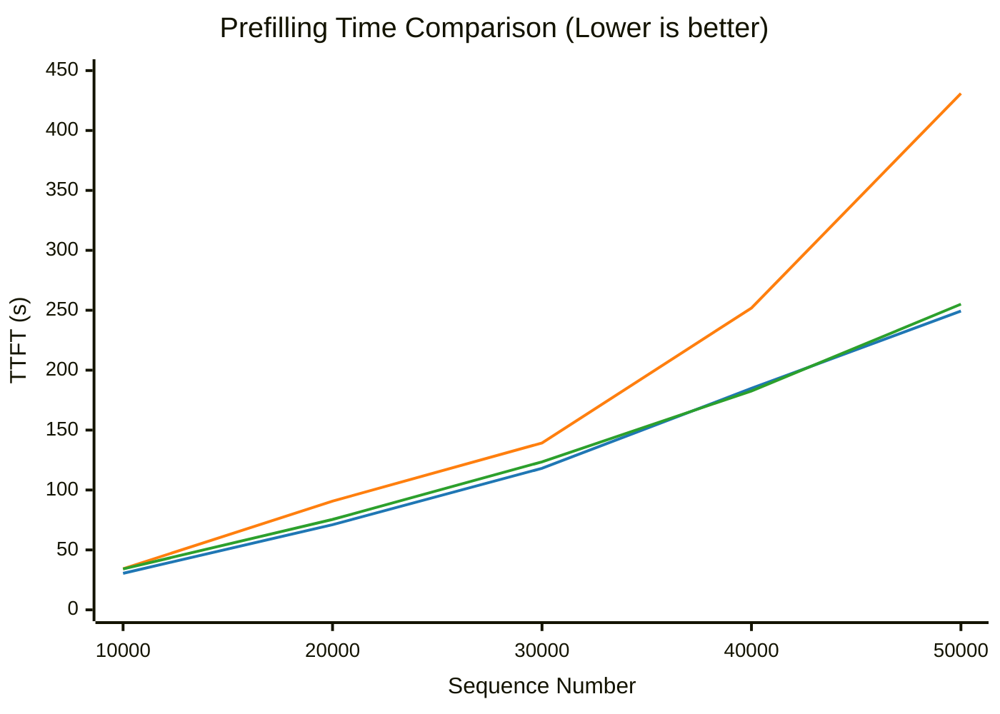
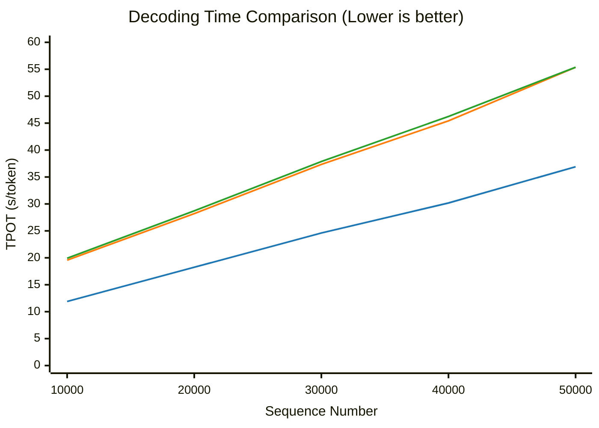

## 🧪 Experiments
eLLM has completed end-to-end output alignment with the SGLang CPU backend, validating the correctness and feasibility of the CPU-based inference approach. See the `alignment` folder and the alignment skill for the detailed implementation. The current Beta release is available for evaluation and testing; the system is still under active optimization and is not yet recommended for production deployment.

To evaluate eLLM's performance across different inference scenarios, we designed two categories of experiments: **short-horizon tasks** (single-turn interaction) and **long-horizon tasks** (multi-turn interaction). Current results show that:

* **The Prefill advantage keeps widening with length**: executed as a single continuous pass with no chunk-boundary jumps, eLLM is **12%–73%** faster than the chunked CPU baseline and also outperforms the unchunked baseline overall.
* **Decode is consistently faster**: eLLM delivers a steady **1.5×–1.6×** speedup over the CPU baseline, with the lowest growth slope across the entire range.
* **Long-horizon outlook**: as context length keeps growing, both Prefill and Decode are expected to overtake the GPU; the overall completion time (TTC) of multi-turn interactions is likewise expected to beat the GPU.

### Experimental Environment
The experiments cover three comparison targets:
* **eLLM**: running on a CPU server
* **CPU baseline**: SGLang CPU backend
* **GPU baseline**: public-cloud model API (planned)

Due to experimental constraints, the GPU baseline is not deployed on a dedicated GPU server; instead, it calls a public-cloud model API directly. Its data is used only for trend analysis and qualitative comparison, not as a strict hardware-parity test. eLLM, on the other hand, runs on a public-cloud CPU VM, whose performance is slightly lower than on bare metal.

| Item                | CPU VM | GPU Server |
| ----------------- | -----------: | -----: |
| Model                | Xeon 6982P-C |      H20 |
| Cores                |     48 / 128 | 14,592  |
| FP16 matrix throughput (TFLOPS) |          250 | 296 |
| Cache             |    504 MB L3 | 60 MB L2 |
| Max memory capacity            | 3 TB | 0.096 TB  |
| Actual memory capacity            | 0.192 TB | 0.096 TB  |

> Note: the GPU server is listed as a specification reference only, not the machine actually used in the runs.

### Short-Horizon Tasks (Single-Turn Interaction)

#### Experimental Setup

We evaluate **Prefill** and **Decode** separately, with the two experiment groups paired one-to-one: after each Prefill completes, Decode continues to generate **100 tokens**.

* **Model**: Qwen3-Coder-30B-A3B-Instruct (FP16)
* **Kernel**: AVX-512 (AMX kernel under development)
* **Input**: `batch = 1`, sequence length 10,000 → 50,000
* **Chunking**:
  * eLLM: `chunk size = 200,000`
  * CPU baseline: `chunk size = 23,000` (default)
  * CPU baseline: `chunk size = ♾️` (chunking forced off)
* **Metrics**: TTFT (Time To First Token, s) for Prefill; TPOT (Time Per Output Token, s/token) for Decode

#### Prefill

> **Legend**:
> - ■ eLLM
> - ■ Chunked CPU Baseline
> - ■ Unchunked CPU Baseline

**Results**: eLLM's runtime grows roughly linearly with length and shows no chunk-boundary jumps; it is **12%–73%** faster than the chunked baseline, with the advantage continuing to widen as length grows. It also outperforms the unchunked baseline overall, with a maximum gap of about 12%.
1. **eLLM: continuous single-pass execution, linear without steps.** From 10,000 to 50,000 tokens, TTFT rises linearly from 30 s to 249 s in one pass, with no chunk boundaries along the way.
2. **Chunked CPU baseline: staircase jumps, spiking at every chunk boundary.** Each time the length crosses into a new chunk, TTFT spikes once (e.g., 30,000 → 40,000 jumps from 139 s to 252 s). At 50,000 tokens it reaches 431 s, or 1.7× that of eLLM.
3. **Unchunked CPU baseline: linear, but still slower than eLLM overall.** With chunking disabled it also rises roughly linearly with length, and it trails throughout except for a slight ~1% win at 40,000 tokens—about 12% slower at 10,000 tokens and still about 2% slower at 50,000 tokens.

#### Decode

> **Legend**:
> - ■ eLLM
> - ■ Chunked CPU Baseline
> - ■ Unchunked CPU Baseline

**Results**: eLLM is consistently about **1.5×–1.6×** faster than both baselines and has the lowest growth slope across the entire range; all three curves rise roughly linearly as length increases.
1. **eLLM: lowest slope, linear without steps.** From 10,000 to 50,000 tokens, TPOT rises linearly from 11.9 s/token to 36.9 s/token, showing the gentlest growth throughout.
2. **Chunked CPU baseline: about 1.5×–1.6× behind throughout.** Its runtime rises from 19.6 s/token to 55.4 s/token, trailing by more than 1.5× at every length point, with the largest gap of about 1.6× at 10,000 tokens.
3. **Unchunked CPU baseline: the curve almost overlaps the chunked one.** With chunking disabled it is only slightly slower, with a gap of no more than 2%, indicating that chunk splitting has minimal impact on the Decode phase.

### Long-Horizon Tasks (Multi-Turn Interaction, Planned)

Long-horizon tasks use multi-turn interactions, with user wait time inserted between turns to simulate real-world usage. **TTC (Time To Completion)** is used as the core metric, i.e., the actual wall-clock time required to complete the entire task, evaluating end-to-end inference efficiency.

* **Model**: Qwen3-Coder-30B-A3B-Instruct (FP16)
* **Kernel**: AVX-512 (AMX kernel under development)
* **Input**: `batch = 1`, sequence from short to long
* **Chunking**:
  * eLLM: `chunk size = 1,000,000`
  * CPU baseline: `chunk size = 23,000` (default)
  * CPU baseline: `chunk size = ♾️` (chunking forced off)
* **Metric**: TTC (Time To Completion)

## Conclusion

GPUs have long been seen as the mainstream choice for large-model inference, while CPUs are often considered unable to compete on the same track. eLLM's experimental results show that this judgment does not always hold: thanks to the "trade storage for computation" strategy—using CPUs' large-capacity DDR memory to close the bandwidth gap with GPU HBM—CPUs also have a chance to compete head-to-head with GPU systems on end-to-end performance in long-horizon inference scenarios, and may even pull ahead.
- **Prefill**: delivers about **two orders of magnitude** of performance improvement over existing CPU inference frameworks, with the advantage continuing to widen as input length grows:
  - Supports Prefilling an entire long prompt in one pass, eliminating the repeated loading and scheduling overhead caused by chunked processing;
  - The context (KV Cache) is fully retained between multi-turn conversations, so subsequent turns only require incremental Prefill.
- **Decode**: runs with a smaller batch, which not only activates fewer parameters but also gives each request a larger share of memory bandwidth, so inference speed can likewise exceed that of GPUs.

As a result, in inference tasks dominated by Prefill, even if the Decode phase may be slightly slower, Prefill's advantage is enough to dominate the total runtime and ultimately deliver better end-to-end performance. Looking further ahead, scaling eLLM to NUMA-architecture multi-socket CPU servers and combining it with larger memory and more parallel resources should let it cover more long-context, long-lived, low-latency inference workloads, forming a cost-effective inference path distinct from the GPU-centric one.
