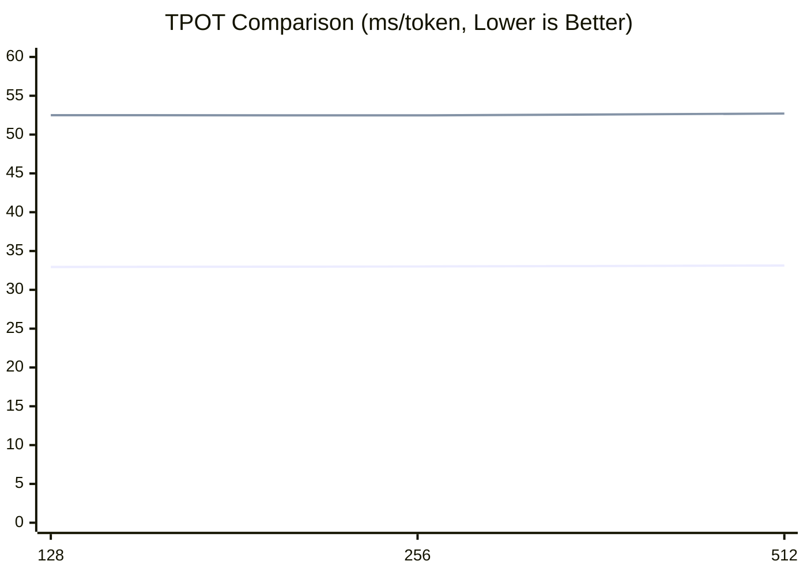

## 🧪 实验
eLLM 已完成与 SGLang CPU backend 的整体输出对齐，验证了 CPU 推理方案的正确性与可行性。详细实现过程参见 `alignment skill` 及 `align` 文件夹。当前 Beta 版本已发布，核心功能已具备可用性，欢迎体验和测试。由于系统仍在持续优化中，暂不建议部署于生产环境。

为验证 eLLM 在不同推理场景下的性能，我们设计了**短程任务**（单轮交互）和**长程任务**（多轮交互）两类实验。
目前实验结果表明：
* **长上下文优势显著**：随着上下文长度的增加，eLLM 的优势持续扩大，Prefill 和 Decode 或可快过 GPU baseline。
* **长程任务整体更快**：在多轮交互场景中，eLLM 的整体任务完成时间（TTC）预计优于 GPU baseline。

### 实验环境
实验包含三个对比对象：
* **eLLM**：运行于 CPU 服务器
* **CPU baseline**：SGLang CPU backend
* **GPU baseline**：公有云模型 API (计划中)

受实验条件限制，GPU baseline 未在独占 GPU 服务器上部署模型，而是直接调用公有云模型 API。因此 GPU 数据仅用于趋势分析和定性比较，不作为严格硬件对等测试。受条件限制，我们租用的是公有云的 CPU 虚拟机，相比裸机性能略差。

| 条目                | CPU 虚拟机 | GPU 服务器 |
| ----------------- | -----------: | -----: |
| 型号                | Xeon 6982P-C |      H20 |
| 核数                |     48 / 128 | 14,592 / 卡 |
| FP16 矩阵算力（TFLOPS） |          250 | 296 |
| Cache             |    504 MB L3 | 60 MB L2 / 卡 |
| 最大内存容量            | 0.192 / 3 TB | 0.768 TB（8 × 96 GB HBM） |

> 注：GPU 服务器仅作为示例，不是真实运行的机器

### 短程任务实验

#### 实验设置

短程任务采用单轮交互，分别评估 **Prefill** 与 **Decode** 两个阶段的性能。Prefill 与 Decode 实验一一对应，其中 Decode 在对应 Prefill 完成后继续生成 **100 Tokens**。

* **模型**：Qwen3-Coder-30B-A3B-Instruct（FP16）
* **Kernel**：当前使用 AVX-512，AMX Kernel 正在开发中
* **输入**：`batch = 1`, sequence 从短到长
* **chunking**：
  * `ellm chunk size = 1,000,000`, 
  * `CPU baseline chunk size = 23000 (默认)`
  * `CPU baseline chunk size = ♾️ (强制不chunk)`
* **Prefill 指标**：TTFT（Time To First Token, ms）
* **Decode 指标**：TPOT（Time Per Output Token，ms/token）

#### Prefill

**Prefill（TTFT, ms）**：相比 CPU baseline 提升约 20%～10000%，且优势随输入长度增加大幅扩大
  - eLLM：随着长度线性增加
  - CPU chunked basedline: 是一个阶梯函数，每个一段出长度，耗时明显抬升
  - CPU unchunked baseline: 随着长度线性增加 

#### Decode

**Decode（TPOT, ms/token）**：相比 CPU baseline 稳定提速约 **1.6×**，且增长斜率更低
三者都随着长度增加

### 长程任务实验（计划中）

长程任务采用多轮交互，并在轮次之间加入用户等待时间，以模拟真实使用场景。实验采用 **TTC（Time To Completion）** 作为核心指标，即完成整个任务所需的实际时间（wall-clock time），用于评估端到端推理效率。

* **模型**：Qwen3-Coder-30B-A3B-Instruct（FP16）
* **Kernel**：当前使用 AVX-512，AMX Kernel 正在开发中
* **输入**：`batch = 1`, sequence 从短到长
* **chunking**：
  * `ellm chunk size = 1,000,000`, 
  * `CPU baseline chunk size = 23000 (默认)`
  * `CPU baseline chunk size = ♾️ (强制不chunk)`
* **指标**：TTC（Time To Completion）

## 结论

GPU 长期以来被视为大模型推理的主流选择，而 CPU 往往被认为难以在同一赛道上竞争。eLLM 的实验结果表明，这一判断并不总是成立：在长程推理场景中，CPU 也有机会在端到端性能上与 GPU 系统正面竞争，甚至实现反超。它采用“以存换算”策略，利用 CPU 大容量 DDR 内存，弥补其与 GPU HBM 之间的带宽差距。
- **Prefill**：相较现有 CPU 推理框架可实现约**两个数量级**的性能提升
  - CPU，能够支持整段长 prompt 的 Prefill，减少分段处理带来的重复载入与调度开销。
  - 在多轮对话的间隙，完整保留上下文（KV Cache），只需要进行增量Prefill。
- **Decode**：以更小的 batch 运行，不仅激活的参数更少，单个 request 可分得的内存带宽也更高，因此推理速度同样可以超过 GPU。

因此，在 Prefill 占主导的推理任务中，即便 Decode 阶段可能略慢，Prefill 的优势仍然足以主导总体耗时，最终带来更好的端到端表现。进一步看，如果将 eLLM 扩展到 NUMA 架构的多路 CPU 服务器上，并结合更大规模的内存与并行资源，它有望覆盖更多长上下文、长生命周期、低延迟的推理场景，形成一条区别于 GPU 路线的高性价比推理方案。
