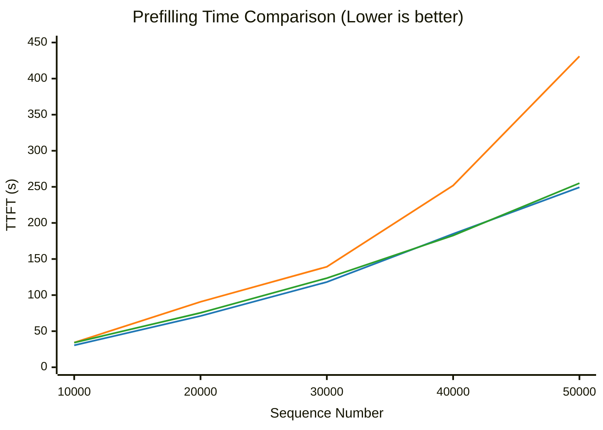
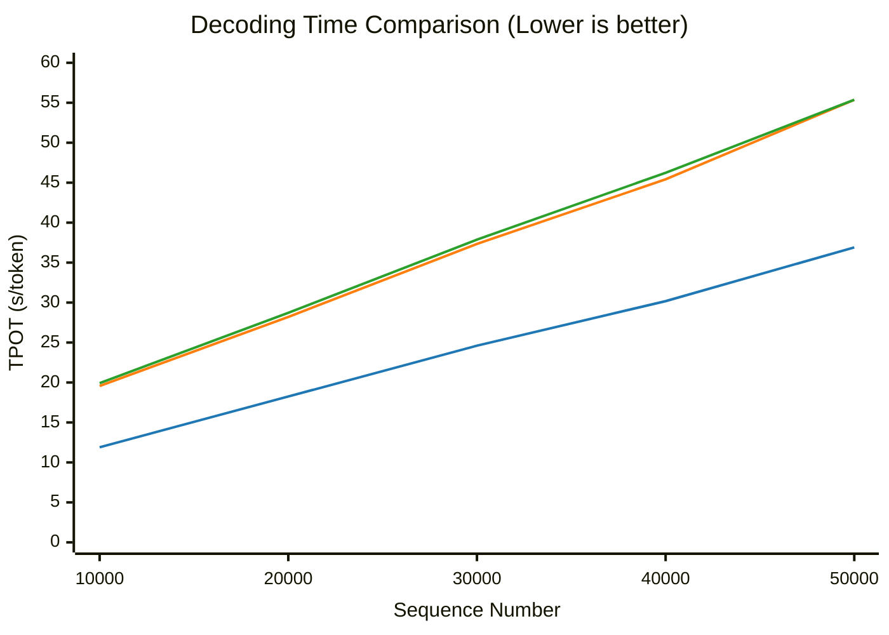

## 🧪 实验
eLLM 已完成与 SGLang CPU backend 的整体输出对齐，验证了 CPU 推理方案的正确性与可行性，详细实现过程参见 `alignment` 文件夹与 alignment skill。当前 Beta 版本已发布，欢迎体验和测试；系统仍在持续优化中，暂不建议部署于生产环境。

为验证 eLLM 在不同推理场景下的性能，我们设计了**短程任务**（单轮交互）与**长程任务**（多轮交互）两类实验。目前实验结果表明：

* **Prefill 优势随长度持续扩大**：整段连续执行、无分段跳变，相比 chunked CPU baseline 快 **12%～73%**，对 unchunked baseline 亦整体占优。
* **Decode 稳定提速**：相比 CPU baseline 稳定快 **1.5×～1.6×**，增长斜率全程最低。
* **长程展望**：随着上下文继续增长，Prefill 与 Decode 有望快过 GPU；多轮交互的整体完成时间（TTC）同样有望优于 GPU。

### 实验环境
实验包含三个对比对象：
* **eLLM**：运行于 CPU 服务器
* **CPU baseline**：SGLang CPU backend
* **GPU baseline**：公有云模型 API（计划中）

受实验条件限制，GPU baseline 未在独占 GPU 服务器上部署模型，而是直接调用公有云模型 API，其数据仅用于趋势分析和定性比较，不作为严格硬件对等测试；eLLM 则运行在公有云 CPU 虚拟机上，性能略低于裸机。

| 条目                | CPU 虚拟机 | GPU 服务器 |
| ----------------- | -----------: | -----: |
| 型号                | Xeon 6982P-C |      H20 |
| 核数                |     48 / 128 | 14,592  |
| FP16 矩阵算力（TFLOPS） |          250 | 296 |
| Cache             |    504 MB L3 | 60 MB L2 |
| 最大内存容量            | 3 TB | 0.096 TB  |
| 实际内存容量            | 0.192 TB | 0.096 TB  |

> 注：GPU 服务器仅为规格示例，并非实际运行的机器。

### 短程任务（单轮交互）

#### 实验设置

分别评估 **Prefill** 与 **Decode** 两个阶段的性能，两组实验一一对应：Decode 在对应 Prefill 完成后继续生成 **100 tokens**。

* **模型**：Qwen3-Coder-30B-A3B-Instruct（FP16）
* **Kernel**：AVX-512（AMX Kernel 开发中）
* **输入**：`batch = 1`，sequence 长度 10,000 → 50,000
* **chunking**：
  * eLLM：`chunk size = 200,000`
  * CPU baseline：`chunk size = 23,000`（默认）
  * CPU baseline：`chunk size = ♾️`（强制不分段）
* **指标**：Prefill 用 TTFT（Time To First Token，s），Decode 用 TPOT（Time Per Output Token，s/token）

#### Prefill

> **图例**：
> - ■ eLLM
> - ■ Chunked CPU Baseline
> - ■ Unchunked CPU Baseline

**结果**：eLLM 耗时随长度近似线性增长、无分段跳变；相对 chunked baseline 快 **12%～73%**，且优势随长度持续扩大；对 unchunked baseline 亦整体占优，最大差距约 12%。
1. **eLLM：整段连续执行，线性无台阶。** 10,000 → 50,000 tokens，TTFT 由 30 s 线性升至 249 s，全程一次通过，不存在分段边界。
2. **Chunked CPU baseline：阶梯跳变，逢段陡增。** 长度每跨入新的分段，TTFT 便陡增一次（如 30,000 → 40,000 由 139 s 跳至 252 s）；50,000 tokens 时达 431 s，为 eLLM 的 1.7×。
3. **Unchunked CPU baseline：线性，但整体仍慢于 eLLM。** 取消分段后同样随长度近似线性上升，除 40,000 tokens 处略胜约 1% 外全程落后——10,000 tokens 时慢约 12%，50,000 tokens 时仍慢约 2%。

#### Decode

> **图例**：
> - ■ eLLM
> - ■ Chunked CPU Baseline
> - ■ Unchunked CPU Baseline

**结果**：eLLM 相比两个 baseline 稳定提速约 **1.5×～1.6×**，增长斜率全程最低；三者耗时均随长度增加近似线性上升。
1. **eLLM：斜率最低，线性无台阶。** 10,000 → 50,000 tokens，TPOT 由 11.9 s/token 线性升至 36.9 s/token，全程增长最平缓。
2. **Chunked CPU baseline：全程落后约 1.5×～1.6×。** 耗时由 19.6 s/token 升至 55.4 s/token，各长度点均落后 1.5× 以上，10,000 tokens 处差距最大约 1.6×。
3. **Unchunked CPU baseline：曲线与 chunked 几乎重合。** 取消分段后仅略慢，差距不超过 2%，说明 chunk 切分对 Decode 阶段影响很小。

### 长程任务（多轮交互，计划中）

长程任务采用多轮交互，并在轮次之间加入用户等待时间，以模拟真实使用场景；采用 **TTC（Time To Completion）** 作为核心指标，即完成整个任务所需的实际时间（wall-clock time），用于评估端到端推理效率。

* **模型**：Qwen3-Coder-30B-A3B-Instruct（FP16）
* **Kernel**：AVX-512（AMX Kernel 开发中）
* **输入**：`batch = 1`，sequence 从短到长
* **chunking**：
  * eLLM：`chunk size = 1,000,000`
  * CPU baseline：`chunk size = 23,000`（默认）
  * CPU baseline：`chunk size = ♾️`（强制不分段）
* **指标**：TTC（Time To Completion）

## 结论

GPU 长期被视为大模型推理的主流选择，CPU 往往被认为难以在同一赛道竞争。eLLM 的实验结果表明，这一判断并不总是成立：得益于“以存换算”策略——用 CPU 大容量 DDR 内存弥补其与 GPU HBM 之间的带宽差距——在长程推理场景中，CPU 同样有机会与 GPU 系统在端到端性能上正面竞争，甚至实现反超。
- **Prefill**：相较现有 CPU 推理框架可实现约**两个数量级**的性能提升，且优势随输入长度增加持续扩大：
  - 支持整段长 prompt 一次性 Prefill，消除分段处理带来的重复载入与调度开销；
  - 多轮对话间隙完整保留上下文（KV Cache），后续轮次仅需增量 Prefill。
- **Decode**：以更小的 batch 运行，不仅激活的参数更少，单个 request 可分得的内存带宽也更高，因此推理速度同样可以超过 GPU。

因此，在 Prefill 占主导的推理任务中，即便 Decode 阶段可能略慢，Prefill 的优势也足以主导总体耗时，最终带来更好的端到端表现。进一步看，将 eLLM 扩展到 NUMA 架构的多路 CPU 服务器上，并结合更大规模的内存与并行资源，它有望覆盖更多长上下文、长生命周期、低延迟的推理场景，形成一条区别于 GPU 路线的高性价比推理方案。
