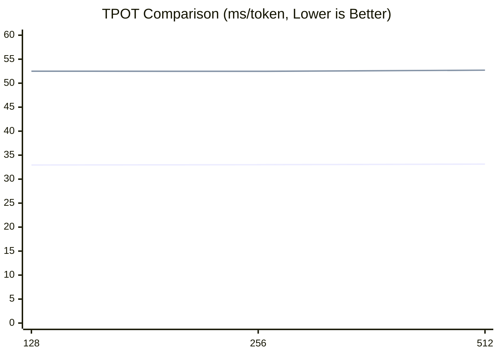

# eLLM Benchmark

## 🧪 实验

eLLM 已完成与 SGLang CPU backend 的整体输出对齐，验证了 CPU 推理方案的正确性与可行性。详细实现过程参见 `alignment skill` 及 `align` 文件夹。

当前 Beta 版本已发布，核心功能已具备可用性，欢迎体验和测试。由于系统仍在持续优化中，暂不建议部署于生产环境。

### 实验结论

为验证 eLLM 在不同推理场景下的性能，我们设计了**短程任务**（单轮交互）和**长程任务**（多轮交互）两类实验。

目前实验结果表明：
* **大幅领先 CPU baseline**：在所有测试场景中，eLLM 均显著优于 SGLang CPU backend。
* **长上下文优势显著**：随着上下文长度的增加，eLLM 的优势持续扩大，Prefill 和 Decode 或可快过 GPU baseline。
* **长程任务整体更快**：在多轮交互场景中，eLLM 的整体任务完成时间（TTC）预计优于 GPU baseline。

### 实验环境

实验包含三个对比对象：

* **eLLM**：运行于 CPU 服务器
* **CPU baseline**：SGLang CPU backend
* **GPU baseline**：公有云模型 API

受实验条件限制，GPU baseline 未在独占 GPU 服务器上部署模型，而是直接调用公有云模型 API。因此 GPU 数据仅用于趋势分析和定性比较，不作为严格硬件对等测试。受条件限制，我们租用的是公有云的 CPU 虚拟机，相比裸机性能略差。

#### 机器配置

| 条目                | CPU 虚拟机 | GPU 服务器 |
| ----------------- | -----------: | -----: |
| 型号                | Xeon 6982P-C |      H20 |
| 核数                |     48 / 128 | 14,592 / 卡 |
| FP16 矩阵算力（TFLOPS） |          250 | 296 |
| Cache             |    504 MB L3 | 60 MB L2 / 卡 |
| 最大内存容量            | 0.192 / 3 TB | 0.768 TB（8 × 96 GB HBM） |

> 注：GPU 服务器仅作为示例，不是真实运行的机器

### 短程任务实验（已完成）

#### 实验设置

短程任务采用单轮交互，分别评估 **Prefill** 与 **Decode** 两个阶段的性能。Prefill 与 Decode 实验一一对应，其中 Decode 在对应 Prefill 完成后继续生成 **100 Tokens**。

* **模型**：Qwen3-Coder-30B-A3B-Instruct（FP16）
* **Kernel**：当前使用 AVX-512，AMX Kernel 正在开发中
* **Batch Size**：1
* **输入**：`batch = 1`, sequence 从短到长
* **chunking**：`ellm chunk size = 1,000,000`, `CPU baseline 关闭 Chunking`
* **Prefill 指标**：TTFT（Time To First Token, ms）
* **Decode 指标**：TPOT（Time Per Output Token，ms/token）

对比对象说明：由于短文本场景下，所有 CPU 推理框架在 Decode 性能上通常都明显落后于 GPU，因此本组实验不再单独加入 GPU 对比。

#### Prefill

随着上下文长度增加，eLLM 的优势不断扩大：

* 相比 CPU baseline，性能提升约 **20% ～ 10000%**。
* CPU baseline 的 TTFT 随输入长度快速增长，而 eLLM 增长更加平缓。
* GPU baseline 在短文本场景仍具有优势，但随着上下文增加，其 TTFT 增长速度明显快于 eLLM；在长文本场景下，eLLM 已超过 GPU baseline。

#### Decode

Decode 阶段，eLLM 在所有测试长度下均稳定优于 CPU baseline：

* 综合性能提升约 **1.6×**
* 延迟下降约 **38%**
* 随着上下文长度增加，两者 TPOT 均近似线性增长，但 eLLM 的增长斜率更低，说明其具有更好的可扩展性。

#### Decode 归因分析（vs CPU baseline）

这一结果表明，短文本 decode 的瓶颈并不主要落在算子计算本身，而更多来自调度、内存管理和运行时这些“控制路径”开销。eLLM 的静态计算图和更轻量的执行路径减少了动态调度与状态维护成本，把更多时间留给真正的算子执行，因此能够在 CPU baseline 上获得稳定收益。

从 CPU baseline 的执行链路看，主要损耗可以归纳为四类：

- 调度开销：需要频繁执行 continuous batching、token 级路由以及请求合并/拆分；每生成一个 token 都要经过一次调度路径，随着活跃请求增多，控制开销会持续上升。
- KV Cache 管理：自回归 Decode 需要持续保存历史 token 的 KV 状态，并处理 KV block 的分配、回收和地址映射；这些操作单次开销不大，但频率极高，容易放大元数据和访存成本。
- 中间张量管理：Decode 过程中仍会产生 Q、K、V 投影、attention 中间结果、MLP 激活和 residual buffer 等临时 tensor；如果不能稳定复用，就会引入频繁分配与释放、内存碎片和带宽压力。
- 服务框架/运行时开销：API 服务、请求生命周期和 streaming 调度都会带来额外成本；GIL、上下文切换和动态数据结构操作也会进一步拖慢端到端延迟。

### 长程任务实验（预计 8 月底完成）

长程任务采用多轮交互，并在轮次之间加入用户等待时间，以模拟真实使用场景。实验采用 **TTC（Time To Completion）** 作为核心指标，即完成整个任务所需的实际时间（wall-clock time），用于评估端到端推理效率。

GPU 显存容量较小，chunk size 受限，使得长 Prompt 必须分段处理，同时也限制了 batch size 的规模。在 Prefill 阶段，需要对分段后的长上下文进行重复处理，带来额外开销。在 Decode 阶段，小 batch size 会导致并行度不足，从而引起性能明显下降。

**结果**  
目前实验数据仍在收集与整理中，尚未形成最终结论。

**Prefill 分析（vs GPU baseline）**  
eLLM 预计会显著快于 GPU baseline。在超长 Prompt 的 Prefill 阶段，首 token 延迟（TTFT）主要由两类因素驱动：其一是大规模的数据读取（模型参数与 KV 的加载），其二是分段处理带来的调度与同步开销。eLLM 的目标是将 Prefill 组织为尽可能连续、低干预的流水线，从根本上压缩这两类开销。若 eLLM 能稳定支持整段 Prefill，就有望将“连续访问、减少重复载入、降低控制开销”的优势转化为可观的首 token 延迟下降。下面按因果链逐项说明：

- **1) 参数与 KV 的读取：**
  - 问题：对于超长输入，若显存无法一次容纳，GPU 往往需要将输入拆成多个 chunk 顺序处理。受分段策略和显存管理限制，每个 chunk 的处理都可能重复将模型参数及相关 KV 加载到 GPU 缓存中，带来多次内存 I/O，从而累积出显著延迟。  
  - eLLM 优势：服务器级 CPU 通常拥有更大的主内存，能够用更少的分段甚至一次性完成 Prefill，显著降低重复内存 I/O。尽管 CPU 的 DDR5 带宽低于 GPU 的 HBM，但通过减少重复载入，TTFT 通常能获得更明显的改善。

- **2) KV 组织与访问模式：**
  - 问题：在超长上下文场景下，KV cache 规模随序列长度线性增长，其访问模式（按 head 或按 token）直接决定缓存命中率与内存搬运开销。在 GPU many-core 架构下，为最大化吞吐能力，通常采用 batch × head 维度的高度并行计算方式，并在计算过程中需要同时驻留多个 KV head 数据。这会显著增加 cache footprint，导致更频繁的 cache eviction，并加剧 HBM 带宽竞争与数据搬运开销，尤其在超长上下文推理场景中问题会被进一步放大。  
  - eLLM 优势：CPU 具备显著更大的片上缓存（L3 cache），在 KV 数据驻留能力与访问局部性方面具有天然优势。基于这一特性，eLLM 采用固定形状、维度优先的 KV 存储布局，并在执行策略上采用“逐 head 顺序计算”。在 CPU 实现中，各计算核心先完成某一 attention head 的全部 token 计算，期间该 head 的 KV 数据能够长期驻留于 cache 中并被复用，随后再切换至下一个 head。该设计使单个 head 的 KV 在 cache 中获得更长的驻留时间窗口与更连续的访问路径，从而显著增强时间局部性与空间局部性。得益于 CPU cache 的容量特性与 eLLM 的访问模式优化，单个 KV head 的有效 cache 驻留能力相较常规并行执行模式可提升约 **2–3 个数量级**。

- **3) 分段带来的控制与同步成本：**
  - 问题：将长 Prompt 切成多个 chunk 会引入额外的调度点、同步开销、内存碎片和跨段中间态维护（例如 KV 重组与合并），这些都会直接增加首 token 的延迟。  
  - eLLM 优势：若能把 Prefill 做成一次连续的流水（整段 Prefill），就可以显著减少调度与同步点，从而把控制路径开销降到最低。  

**Decode 分析（vs GPU baseline）**  
在长上下文的 decode 阶段，eLLM 虽然整体性能仍低于 GPU baseline，但两者之间的差距显著小于 DDR 与 HBM 的理论带宽差距。这表明，在该场景下，GPU 的带宽优势并未被充分发挥，其性能瓶颈更多来源于并行度不足与访存模式不理想，而非纯粹的带宽上限。

- **1) batch size 小：**
  - 问题：长序列会直接压缩 batch size。在 GPU 显存受限、chunk size 固定的情况下，sequence length 越长，可同时容纳的 batch size 越小。decode 阶段每个请求都需要携带完整历史 KV cache，使得有效并发进一步下降。
  - eLLM 优势：CPU 内存容量更大，支持更大的 chunk size，batch size 不易受限，从而能够维持更高的并发度。

- **2) 瘦矩阵乘法效率低：**
  - 问题：由于 batch size 变小，线性层的矩阵乘法会退化为瘦矩阵乘法；在 MoE 场景下，部分专家计算甚至会进一步退化为向量-矩阵乘法。这类算子通常计算规模小、形状不规则，GPU 难以充分发挥大规模并行优势；同时受限于 L2 cache 容量，也不容易同时维持足够多的并行矩阵乘法。
  - eLLM 优势：CPU 对小 batch、低维度和不规则形状的矩阵运算更友好，执行路径也更稳定。再加上更大的 L3 Cache，权重和中间结果更容易复用，因此可以更高效地并行处理多个矩阵乘法。

- **3) MoE 负载不均：**
  - 问题：MoE 专家分布在不同 GPU 上，而专家激活具有随机性。在小 batch 场景下，容易导致专家负载分布不均，部分 GPU 过载而其他 GPU 空闲，甚至退化为仅少数 GPU 在工作。
  - eLLM 优势：eLLM 在单机 CPU 上运行，无需跨设备分布专家，避免了负载不均和跨设备通信问题，能够稳定利用全部计算资源。

- **4) 有效内存带宽不理想：**
  - 问题：GPU 的高带宽依赖于大量 warp 并发执行以及持续的 memory-level parallelism 来隐藏内存访问延迟。在小 batch 场景下，可调度的 warp 数量不足，SM 无法被充分占满，内存请求流不连续，HBM 延迟暴露，SM 频繁因等待数据而停顿，从而导致有效带宽显著下降。
  - eLLM 优势：CPU 核数较少，对并行度要求更低，即使在小 batch 场景下也能较容易填满计算资源；同时配合 cache 与预取机制，可以更稳定地接近理论内存带宽。

- **5) 访存效率低：**
  - 问题：Paged KV Cache 进一步降低访存效率。KV 被拆分为离散 page 后，原本连续的访问被打散，破坏 memory coalescing，降低访存合并效率。同时需要通过 page table 进行地址映射，并伴随 pointer chasing，引入额外 load 和更长依赖链，降低指令级并行性。此外，还会带来 TLB miss 和 cache miss，非连续访问使得同样数据需要更多 memory transaction 才能完成加载，进一步放大带宽消耗。
  - eLLM 优势：采用静态连续 KV tensor，通过坐标直接访问，实现线性访存模式，能够充分利用硬件 prefetch 和 cache，提高整体访存效率。

- **6) Kernel launch/调度开销放大：**
  - 问题：decode 是逐 token 推进的过程，每一步都会触发一系列 GPU kernel（attention、matmul、layernorm 等）。在小 batch 场景下，单次 kernel 计算量较小，但 kernel launch 与调度开销不变，导致其占比显著上升。同时由于计算粒度过小，GPU 难以形成持续饱和的执行流水线，utilization 波动明显，SM 无法长期满载，整体吞吐下降。
  - eLLM 优势：eLLM 在 CPU 上以函数调用方式执行，无需 kernel 启动开销，在小 batch 和低并行度场景下具有更稳定的执行效率。

## 结论

GPU 长期以来被视为大模型推理的主流选择，而 CPU 往往被认为难以在同一赛道上竞争。eLLM 的实验结果表明，这一判断并不总是成立：在长文本推理场景中，单块 CPU 也有机会在端到端性能上与多卡 GPU 系统正面竞争，甚至实现反超。

其根本原因在于，eLLM 充分利用了 CPU 的两项核心硬件优势。第一，CPU 拥有更大的主内存，能够支持整段长 prompt 的 Prefill，减少分段处理带来的重复载入与调度开销。第二，CPU 具备更大的 Cache 空间，配合逐 head 计算 attention 的执行方式，可以显著提升数据驻留与复用效率，使 Prefill 阶段获得更低的整体延迟。

因此，在 Prefill 占主导的推理任务中，即便 Decode 阶段略慢，Prefill 的优势仍然足以主导总体耗时，最终带来更好的端到端表现。进一步看，如果将 eLLM 扩展到 NUMA 架构的多路 CPU 服务器上，并结合更大规模的内存与并行资源，它有望覆盖更多长上下文、长生命周期、低延迟的推理场景，形成一条区别于 GPU 路线的高性价比推理方案。
