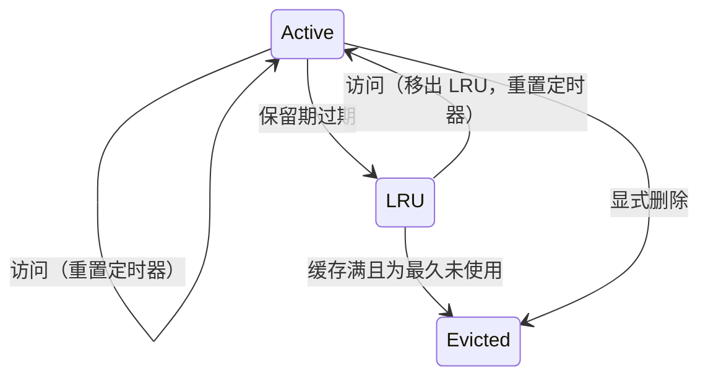
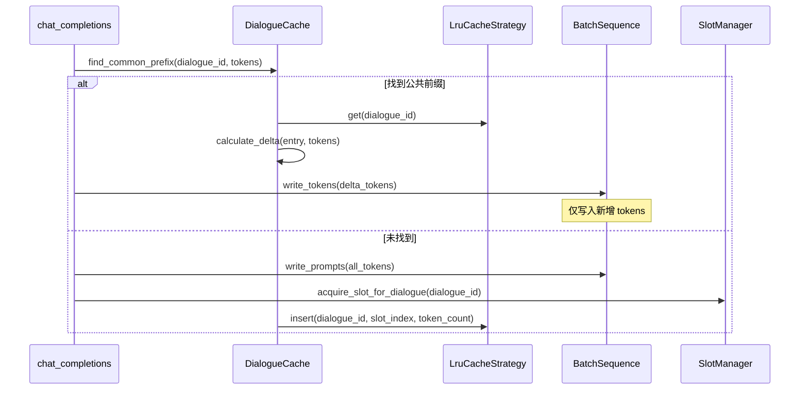

# Dialogue Cache: Timer-based LRU Data Structure

---

## Overview

**Dialogue Cache** 是一个用于存储对话级序列数据和 KV 缓存的数据结构，实现了**双层驱逐策略**：

1. **定时器保留**：新对话在固定时间（如 10s）内不可被驱逐
2. **LRU 驱逐**：超过保留时间后，进入 LRU 列表等待驱逐

**核心目标**：通过检测同一对话连续请求间的公共前缀，仅对新增 token 进行 prefill，优化推理性能。

---

## Core Data Structures

### DialogueEntry

缓存的对话条目（仅存储元数据，实际数据引用自现有结构）：

| Field | Type | Description |
|-------|------|-------------|
| `dialogue_id` | `String` | 对话唯一标识 |
| `slot_index` | `usize` | 对应的 `BatchSequence` 槽位索引 |
| `token_count` | `usize` | 已缓存的 token 数量 |
| `last_accessed_at` | `Instant` | 最后访问时间戳 |
| `in_lru` | `bool` | 是否已进入 LRU 列表 |
| `lru_index` | `Option<usize>` | 在 LRU 链表中的节点索引（用于 O(1) 删除） |

**数据引用说明**：
- **Tokens**：实际 token 序列存储在 `BatchSequence::sequences` 中，通过 `slot_index` 定位
- **KV Cache**：KV 缓存信息存储在 `BatchScheduler::batch_list`（`SequenceState`）中，通过 `slot_index` 关联

### LruList

基于索引的双向链表实现（支持 O(1) 删除操作）：

| Field | Type | Description |
|-------|------|-------------|
| `nodes` | `Vec<LruNode>` | 存储所有节点 |
| `head` | `Option<usize>` | 头节点索引 |
| `tail` | `Option<usize>` | 尾节点索引 |
| `free_indices` | `Vec<usize>` | 空闲索引池（复用已删除节点位置） |

**LruNode 结构**：
| Field | Type | Description |
|-------|------|-------------|
| `dialogue_id` | `String` | 对话 ID |
| `prev` | `Option<usize>` | 前驱节点索引 |
| `next` | `Option<usize>` | 后继节点索引 |

### LruCacheStrategy

LRU 缓存策略实现（策略模式）：

| Field | Type | Description |
|-------|------|-------------|
| `entries` | `RwLock<HashMap<String, DialogueEntry>>` | 对话条目存储 |
| `lru_list` | `Mutex<LruList>` | LRU 双向链表 |
| `retention_duration` | `Duration` | 保留时长（默认 10s） |
| `max_entries` | `usize` | 最大缓存数（等于 `BatchSequence::row_size`） |
| `slot_manager` | `Arc<SlotManager>` | 槽位管理器引用 |

### DialogueCache

缓存门面层（对外统一接口）：

| Field | Type | Description |
|-------|------|-------------|
| `strategy` | `Arc<LruCacheStrategy>` | 缓存策略实现 |
| `batch_sequences` | `Arc<SharedMut<BatchSequence>>` | 批量序列引用 |

---

## Eviction Strategy

### State Transitions



### Key Rules

- **Active 状态不可驱逐**：只有进入 LRU 列表的条目才可被驱逐
- **访问重置定时器**：任何访问都会更新 `last_accessed_at`
- **LRU 剥离**：访问 LRU 中的条目会将其移回 Active 状态
- **O(1) 删除**：通过 `lru_index` 字段直接定位并删除 LRU 节点

---

## Key Operations

### 1. Get Entry（读写分离策略）

```
get(dialogue_id):
    // 阶段1：读锁获取
    entries_read = entries.read()
    if dialogue_id not in entries_read:
        return None
    
    entry_clone = entries_read[dialogue_id].clone()
    drop(entries_read)
    
    // 阶段2：写锁更新
    entries_write = entries.write()
    entry = entries_write.get_mut(dialogue_id)
    
    if entry.in_lru:
        lru_list = lru_list.lock()
        lru_list.remove(entry.lru_index)
        entry.lru_index = None
        entry.in_lru = false
    
    entry.last_accessed_at = now()
    
    return entry_clone
```

### 2. Cleanup（先收集后释放）

```
cleanup(now):
    // 阶段1：收集待驱逐列表（持有锁）
    entries_write = entries.write()
    lru_list = lru_list.lock()
    
    // 将过期的 Active 条目移入 LRU
    for entry in entries_write.values_mut():
        if !entry.in_lru && (now - entry.last_accessed_at) >= retention_duration:
            entry.in_lru = true
            entry.lru_index = lru_list.push_back(entry.dialogue_id)
    
    // 收集待驱逐条目
    to_evict = []
    while entries_write.len() > max_entries && !lru_list.is_empty():
        dialogue_id = lru_list.pop_back()
        if let Some(entry) = entries_write.remove(&dialogue_id):
            to_evict.push(entry.dialogue_id)
    
    drop(entries_write)
    drop(lru_list)
    
    // 阶段2：批量释放槽位（不持有锁）
    for dialogue_id in to_evict:
        slot_manager.release_by_dialogue(dialogue_id)
```

### 3. Delta Prefill Calculation

```
calculate_delta(entry: DialogueEntry, new_tokens: Vec<u32>):
    // 从 BatchSequence 获取已缓存的 tokens
    cached_tokens = batch_sequences.token_ids(entry.slot_index, 0, entry.token_count)
    
    prefix_len = 0
    min_len = min(cached_tokens.len(), new_tokens.len())
    
    while prefix_len < min_len && cached_tokens[prefix_len] == new_tokens[prefix_len]:
        prefix_len += 1
    
    return (prefix_len, new_tokens[prefix_len:])
```

### 4. Batch Operations

```
insert_batch(entries: Vec<(dialogue_id, slot_index, token_count)>):
    lock = entries.write()
    for (dialogue_id, slot_index, token_count) in entries:
        lock.insert(dialogue_id, DialogueEntry {...})
    drop(lock)
    cleanup(now)

remove_batch(dialogue_ids: Vec<String>):
    to_release = []
    
    {
        entries_write = entries.write()
        lru_list = lru_list.lock()
        
        for dialogue_id in dialogue_ids:
            if let Some(entry) = entries_write.remove(dialogue_id):
                if entry.in_lru:
                    lru_list.remove(entry.lru_index)
                to_release.push(entry.dialogue_id)
    }
    
    for dialogue_id in to_release:
        slot_manager.release_by_dialogue(dialogue_id)
```

---

## Integration with BatchSequence



---

## Thread Safety

| Operation | Lock Strategy |
|-----------|---------------|
| `get`, `find_common_prefix` | 先读锁获取，再写锁更新 |
| `insert`, `remove` | 写锁 |
| `cleanup` | 写锁（短暂持有）+ 异步释放 |
| `insert_batch`, `remove_batch` | 批量写锁 |

**性能优化**：
- **读写分离**：读操作优先使用读锁，减少锁竞争
- **短锁持有**：cleanup 先收集待驱逐列表，释放锁后再执行异步操作
- **批量操作**：支持批量插入/删除，减少锁获取次数

---

## Configuration

| Parameter | Default | Description |
|-----------|---------|-------------|
| `retention_duration` | 10s | 保留期时长 |
| `max_entries` | `BatchSequence::row_size` | 最大缓存对话数 |
| `cleanup_interval` | 5s | 清理任务执行频率 |

---

## Module Structure

```
src/runtime/
├── cache_strategy.rs     # LruCacheStrategy、LruList、DialogueEntry
├── dialogue_cache.rs     # DialogueCache 门面
└── slot_manager.rs       # 槽位管理（与驱逐联动）
```

---

**Document Version**: v2.1  
**Last Updated**: 2026-06-11
