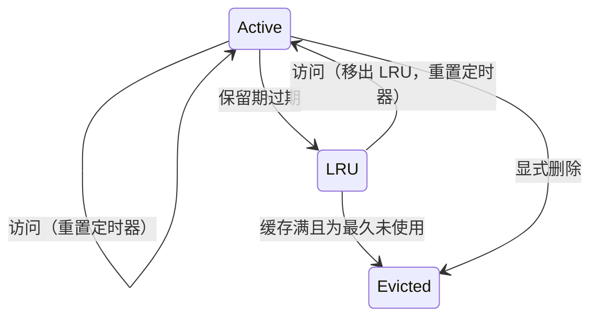
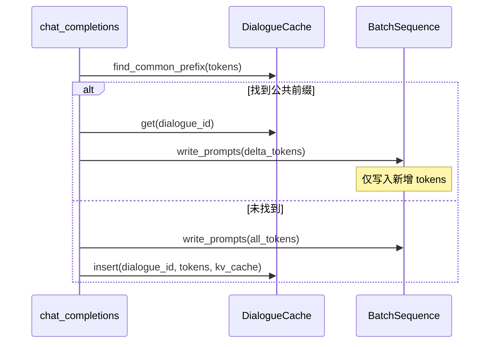

# Dialogue Cache: Timer-based LRU Data Structure

---

## Overview

**Dialogue Cache** 是一个用于存储对话级序列数据和 KV 缓存的数据结构，实现了**双层驱逐策略**：

1. **定时器保留**：新对话在固定时间（如 10s）内不可被驱逐
2. **LRU 驱逐**：超过保留时间后，进入 LRU 列表等待驱逐

**核心目标**：通过检测同一对话连续请求间的公共前缀，仅对新增 token 进行 prefill，优化推理性能。

---

## Core Data Structures

### DialogueEntry

缓存的对话条目（仅存储元数据，实际数据引用自现有结构）：

| Field | Type | Description |
|-------|------|-------------|
| `dialogue_id` | `String` | 对话唯一标识 |
| `slot_index` | `usize` | 对应的 `BatchSequence` 槽位索引 |
| `token_count` | `usize` | 已缓存的 token 数量 |
| `last_accessed_at` | `Instant` | 最后访问时间戳 |
| `in_lru` | `bool` | 是否已进入 LRU 列表 |

**数据引用说明**：
- **Tokens**：实际 token 序列存储在 `BatchSequence::sequences` 中，通过 `slot_index` 定位
- **KV Cache**：KV 缓存信息存储在 `BatchScheduler::batch_list`（`SequenceState`）中，通过 `slot_index` 关联

### DialogueCache

主缓存结构：

| Field | Type | Description |
|-------|------|-------------|
| `entries` | `HashMap<String, DialogueEntry>` | 对话条目存储 |
| `lru_list` | `LruList` | LRU 双向链表 |
| `retention_duration` | `Duration` | 保留时长（默认 10s） |
| `max_entries` | `usize` | 最大缓存数（等于 `BatchSequence::row_size`） |

---

## Eviction Strategy

### State Transitions



### Key Rules

- **Active 状态不可驱逐**：只有进入 LRU 列表的条目才可被驱逐
- **访问重置定时器**：任何访问都会更新 `last_accessed_at`
- **LRU 剥离**：访问 LRU 中的条目会将其移回 Active 状态

---

## Key Operations

### 1. Get Entry

```
get(dialogue_id):
    if dialogue_id not in entries: return None
    
    entry = entries[dialogue_id]
    
    if entry.in_lru:
        remove entry from lru_list
        entry.in_lru = false
    
    entry.last_accessed_at = now()
    return entry
```

### 2. Cleanup

```
cleanup(now):
    // 阶段1：将过期的 Active 条目移入 LRU
    for entry in entries:
        if !entry.in_lru && (now - entry.last_accessed_at) >= retention_duration:
            entry.in_lru = true
            add entry to lru_list
    
    // 阶段2：缓存满时驱逐 LRU 条目（仅 LRU 条目可被驱逐）
    while entries.size() > max_entries && !lru_list.is_empty():
        lru_entry = lru_list.pop_back()
        // 释放对应的 BatchSequence 槽位和 KV 缓存
        release_slot(lru_entry.slot_index)
        remove lru_entry from entries
```

### 3. Delta Prefill Calculation

```
calculate_delta(entry: DialogueEntry, new_tokens: Vec<u32>, batch_sequence: BatchSequence):
    // 从 BatchSequence 获取已缓存的 tokens
    cached_tokens = batch_sequence.token_ids(entry.slot_index, 0, entry.token_count)
    
    prefix_len = 0
    min_len = min(cached_tokens.len(), new_tokens.len())
    
    while prefix_len < min_len && cached_tokens[prefix_len] == new_tokens[prefix_len]:
        prefix_len += 1
    
    return (prefix_len, new_tokens[prefix_len:])
```

---

## Integration with BatchSequence



---

## Thread Safety

使用 `RwLock` 保证并发安全：

| Operation | Lock Type |
|-----------|-----------|
| `get`, `find_common_prefix` | Read lock |
| `insert`, `remove`, `cleanup` | Write lock |

---

## Configuration

| Parameter | Default | Description |
|-----------|---------|-------------|
| `retention_duration` | 10s | 保留期时长 |
| `max_entries` | `BatchSequence::row_size` | 最大缓存对话数 |
| `cleanup_interval` | 5s | 清理任务执行频率 |

---

**Document Version**: v2.0  
**Last Updated**: 2026-06-10