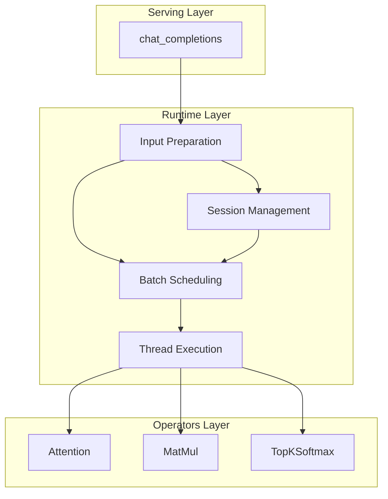
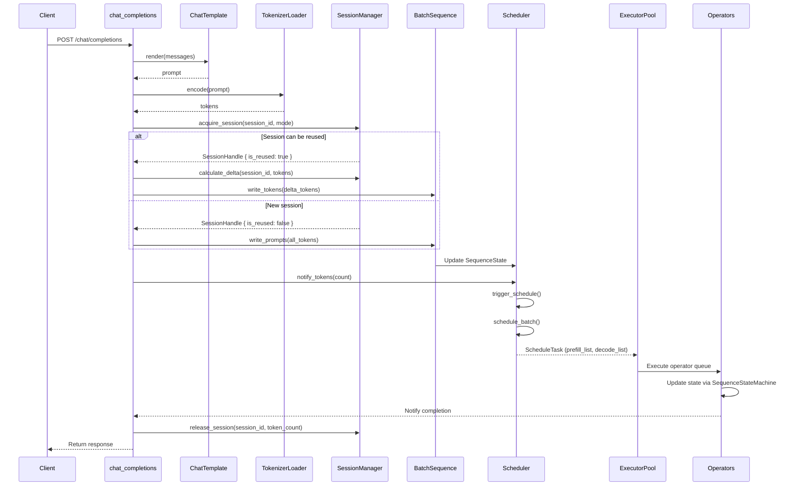
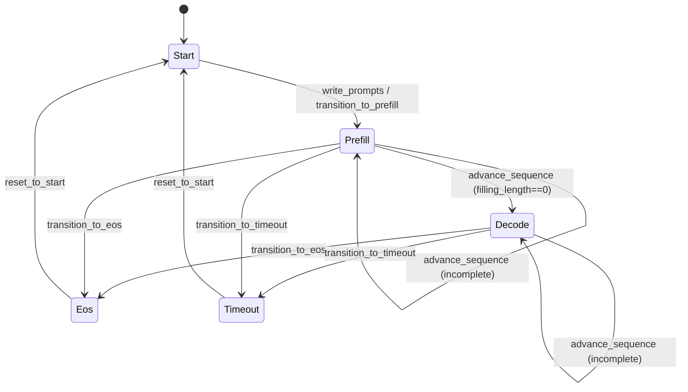

# Runtime Module Overview

---

## Table of Contents

1. [Module Overview](#1-module-overview)
2. [Architecture Layers](#2-architecture-layers)
3. [Core Components](#3-core-components)
4. [Data Flow](#4-data-flow)
5. [File Structure](#5-file-structure)

---

## 1. Module Overview

`src/runtime` is the core runtime module of the eLLM inference execution layer. It transforms user requests into executable computation tasks and coordinates multi-threaded execution.

**Core Responsibilities**:
- **Input Preparation**: Render chat messages to prompts, encode to tokens
- **Batch Scheduling**: Generate current-round computation slices by priority rules
- **Thread Execution**: Manage thread pool to execute operator queues in parallel
- **Session Management**: Unified dialogue session management with reusable/non-reusable modes and delayed slot recycling

---

## 2. Architecture Layers



| Layer | Responsibility | Key Components |
|-------|---------------|----------------|
| **Input Preparation** | Prompt rendering & token encoding | ChatTemplate, BatchSequence, TokenizerLoader |
| **Batch Scheduling** | Slice generation & task distribution | Scheduler, SchedulerStrategy, SessionManager |
| **Thread Execution** | Operator queue parallel execution | ExecutorPool, SpinBarrier |
| **Session Management** | Unified session lifecycle management | SessionManager, SlotAllocator, DialogueSession |

---

## 3. Core Components

### 3.1 Component Relationships


### 3.2 Component Overview

| Component | Responsibility | File Location |
|-----------|---------------|---------------|
| `Scheduler` | Core scheduling logic, event-driven execution | `scheduler/core.rs` |
| `SchedulerStrategy` | Scheduling strategy trait | `scheduler/strategy.rs` |
| `DefaultSchedulerStrategy` | Default scheduling implementation | `scheduler/strategy.rs` |
| `PlanBuilder` | Batch plan construction with slice distribution | `plan.rs` |
| `SliceScheduler` | Prefill token distribution across threads | `plan.rs` |
| `ExecutorPool` | Leader-follower thread pool executor | `executor/executor.rs` |
| `SlotState` | Slot state tracking (phase, sequence, KV cache) | `state/core.rs` |
| `SlotStateMachine` | State transition logic | `state/machine.rs` |
| `SequenceSlice` | Minimal computation unit | `state/sequence.rs` |
| `ScheduleTask` | Scheduling task carrier | `scheduler/task.rs` |
| `BatchSequence` | Prompt writing & result decoding | `state/batch.rs` |
| `SlotManager` | Unified slot and session management with LRU and delayed recycling | `session/slot_manager.rs` |
| `DialogueSession` | Session metadata structure | `session/types.rs` |
| `ChatTemplate` | Chat template rendering | `io/chat_template.rs` |
| `TokenizerLoader` | Tokenizer loading | `io/tokenizer_loader.rs` |

---

## 4. Data Flow

### 4.1 Request to Execution Flow



### 4.2 State Transition



---

## 5. File Structure

```
src/runtime/
├── scheduler/
│   ├── mod.rs                # Scheduler submodule entry
│   ├── core.rs               # Scheduler implementation
│   ├── strategy.rs           # SchedulerStrategy trait and DefaultSchedulerStrategy
│   └── task.rs               # ScheduleTask definition
├── session/
│   ├── mod.rs                # Session submodule entry
│   ├── slot_manager.rs       # SlotManager with LRU and session tracking
│   ├── slot_entry.rs         # SlotEntry definitions
│   └── types.rs              # SessionMode, SessionHandle, DialogueSession
├── state/
│   ├── mod.rs                # State submodule entry
│   ├── core.rs               # SlotState definition
│   ├── machine.rs            # SlotStateMachine state transitions
│   ├── types.rs              # Phase enum
│   ├── sequence.rs           # SequenceSlice, DecodeList
│   ├── batch.rs              # BatchSequence implementation
│   ├── shared.rs             # SharedState for cross-component sharing
│   └── state_init.rs         # build_batch_sequence, build_slot_state helpers
├── executor/
│   ├── mod.rs                # Executor submodule entry
│   ├── executor.rs           # ExecutorPool implementation
│   └── sync.rs               # SpinBarrier, AdaptiveWait, BatchTracker
├── io/
│   ├── mod.rs                # IO submodule entry
│   ├── chat_template.rs      # ChatTemplate implementation
│   ├── tokenizer_loader.rs   # Tokenizer loading (load_tiktoken)
│   ├── safetensors_loader.rs # Weight loading (SafeTensorsLoader)
│   └── from_safetensors.rs   # FromSafetensors trait (type conversion)
├── plan.rs                   # BatchPlan, PlanBuilder, SliceScheduler
├── error.rs                  # Runtime error definitions
└── mod.rs                    # Module exports
```

---

**Document Version**: v5.1  
**Last Updated**: 2026-06-22  
**Major Changes**: Restructured to match actual code organization - renamed SequenceState to SlotState, moved components to scheduler/session/state/executor directories, integrated PlanBuilder into plan.rs, replaced SessionManager+SlotAllocator with unified SlotManager with LRU support, added delayed slot recycling mechanism with configurable timeout