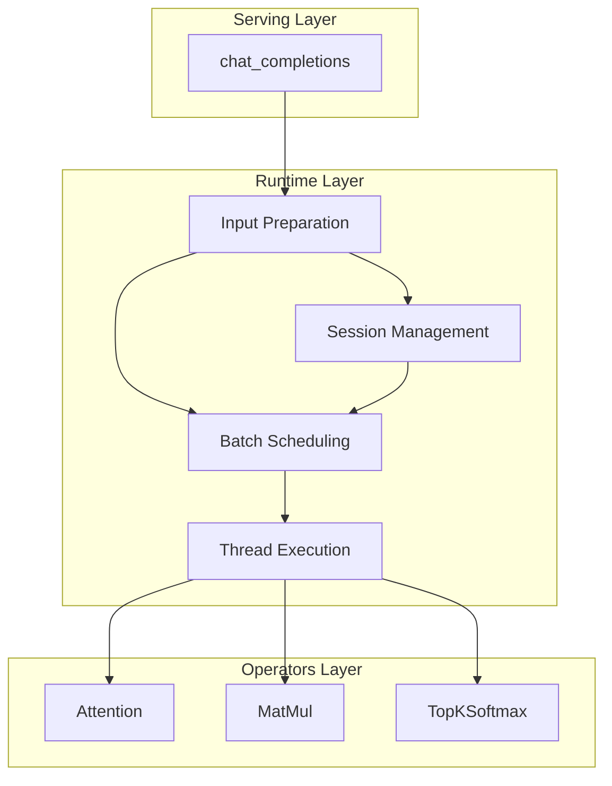
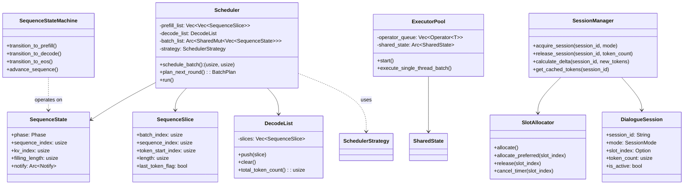
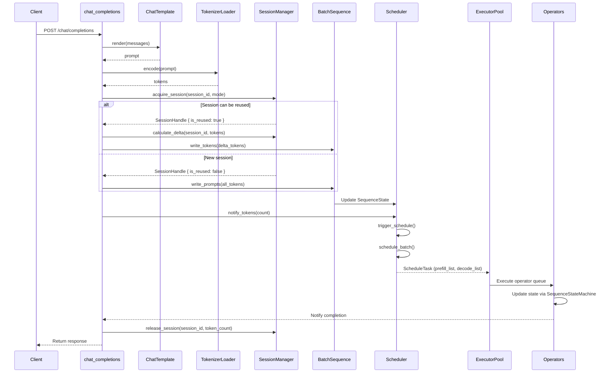
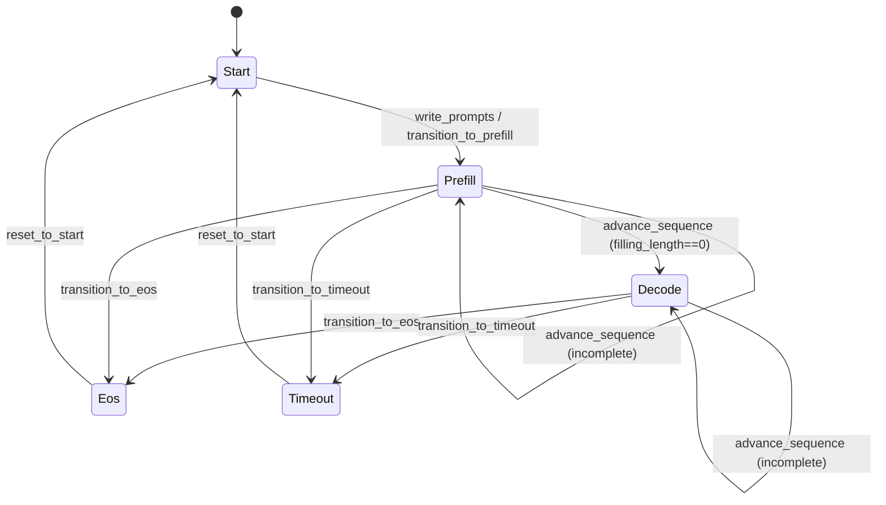

# Runtime Module Overview

---

## Table of Contents

1. [Module Overview](#1-module-overview)
2. [Architecture Layers](#2-architecture-layers)
3. [Core Components](#3-core-components)
4. [Data Flow](#4-data-flow)
5. [File Structure](#5-file-structure)

---

## 1. Module Overview

`src/runtime` is the core runtime module of the eLLM inference execution layer. It transforms user requests into executable computation tasks and coordinates multi-threaded execution.

**Core Responsibilities**:
- **Input Preparation**: Render chat messages to prompts, encode to tokens
- **Batch Scheduling**: Generate current-round computation slices by priority rules
- **Thread Execution**: Manage thread pool to execute operator queues in parallel
- **Session Management**: Unified dialogue session management with reusable/non-reusable modes

---

## 2. Architecture Layers



| Layer | Responsibility | Key Components |
|-------|---------------|----------------|
| **Input Preparation** | Prompt rendering & token encoding | ChatTemplate, BatchSequence, TokenizerLoader |
| **Batch Scheduling** | Slice generation & task distribution | Scheduler, SchedulerStrategy, SessionManager |
| **Thread Execution** | Operator queue parallel execution | ExecutorPool, SpinBarrier |
| **Session Management** | Unified session lifecycle management | SessionManager, SlotAllocator, DialogueSession |

---

## 3. Core Components

### 3.1 Component Relationships



### 3.2 Component Overview

| Component | Responsibility | File Location |
|-----------|---------------|---------------|
| `Scheduler` | Core scheduling logic, event-driven execution | `scheduling/scheduler.rs` |
| `SchedulerStrategy` | Scheduling strategy trait | `scheduling/strategy.rs` |
| `DefaultSchedulerStrategy` | Default scheduling implementation | `scheduling/strategy.rs` |
| `SliceScheduler` | Prefill token distribution across threads | `scheduling/strategy.rs` |
| `ExecutorPool` | Leader-follower thread pool executor | `executor/executor.rs` |
| `SequenceState` | Batch slot state | `scheduling/types.rs` |
| `SequenceStateMachine` | State transition logic | `scheduling/state_machine.rs` |
| `SequenceSlice` | Minimal computation unit | `scheduling/sequence_slice.rs` |
| `ScheduleTask` | Scheduling task carrier | `scheduling/types.rs` |
| `BatchSequence` | Prompt writing & result decoding | `scheduling/batch_sequence.rs` |
| `SessionManager` | Unified session lifecycle management | `scheduling/session.rs` |
| `SlotAllocator` | Simplified slot allocation | `scheduling/slot_allocator.rs` |
| `DialogueSession` | Session metadata structure | `scheduling/session.rs` |
| `ChatTemplate` | Chat template rendering | `io/chat_template.rs` |
| `TokenizerLoader` | Tokenizer loading | `io/tokenizer_loader.rs` |

---

## 4. Data Flow

### 4.1 Request to Execution Flow



### 4.2 State Transition



---

## 5. File Structure

```
src/runtime/
├── scheduling/
│   ├── mod.rs                # Scheduling submodule entry and re-exports
│   ├── scheduler.rs          # Scheduler implementation
│   ├── strategy.rs           # SchedulerStrategy, BatchPlan, DefaultSchedulerStrategy, SliceScheduler
│   ├── types.rs              # Phase, ScheduleTask, SequenceState definitions
│   ├── state_machine.rs      # SequenceStateMachine state transition logic
│   ├── sequence_slice.rs     # SequenceSlice, DecodeList definitions
│   ├── batch_sequence.rs     # BatchSequence implementation
│   ├── session.rs            # SessionManager, DialogueSession, SessionHandle, SessionMode
│   ├── slot_allocator.rs     # SlotAllocator implementation
│   └── initialization.rs     # build_batch_sequence, build_sequence_state helpers
├── executor/
│   ├── mod.rs                # Executor submodule entry
│   ├── executor.rs           # ExecutorPool implementation
│   ├── plan.rs               # BatchPlan, PlanBuilder
│   └── sync.rs               # SpinBarrier, BatchTracker synchronization primitives
├── io/
│   ├── mod.rs                # IO submodule entry
│   ├── chat_template.rs      # ChatTemplate implementation
│   ├── tokenizer_loader.rs   # Tokenizer loading (load_tiktoken)
│   ├── safetensors_loader.rs # Weight loading (SafeTensorsLoader)
│   └── from_safetensors.rs   # FromSafetensors trait (type conversion)
├── error.rs                  # Runtime error definitions
└── mod.rs                    # Module exports
```

---

**Document Version**: v4.1  
**Last Updated**: 2026-06-17  
**Major Changes**: Added slot delayed recycling mechanism and preferred slot reuse strategy