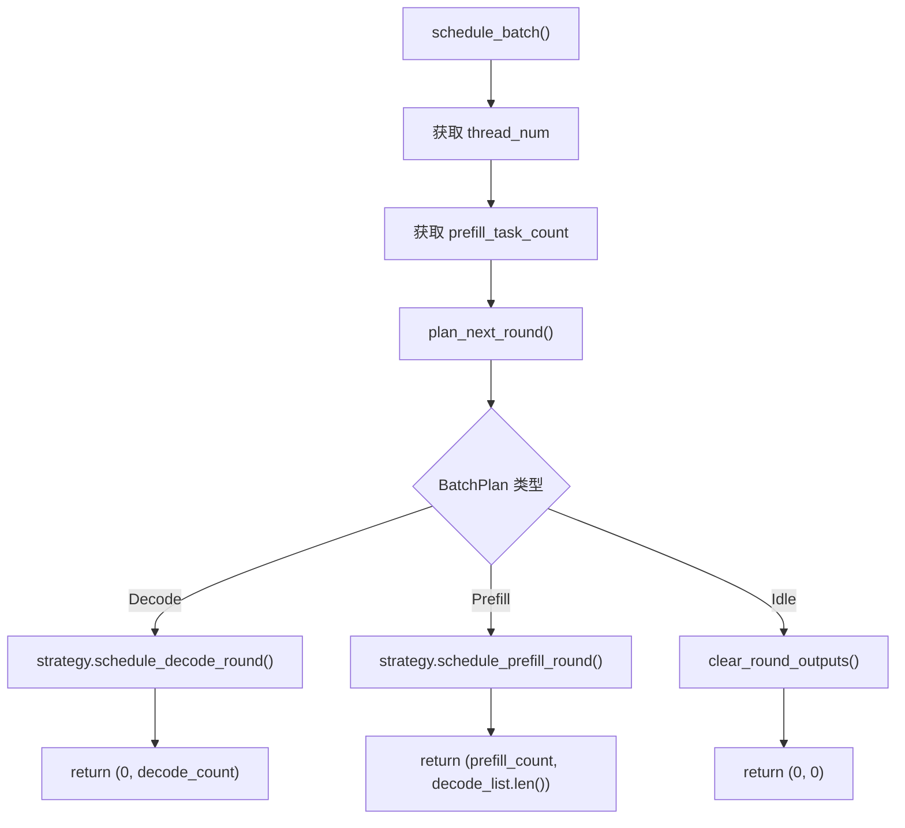
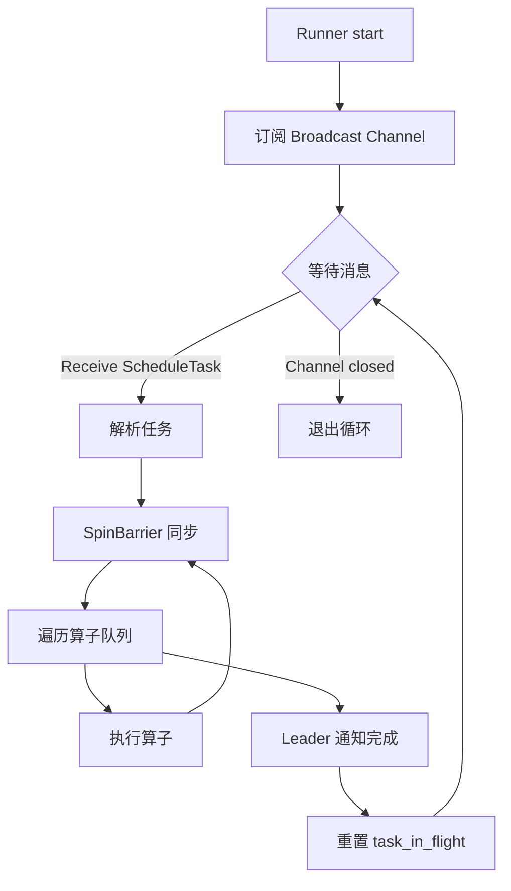
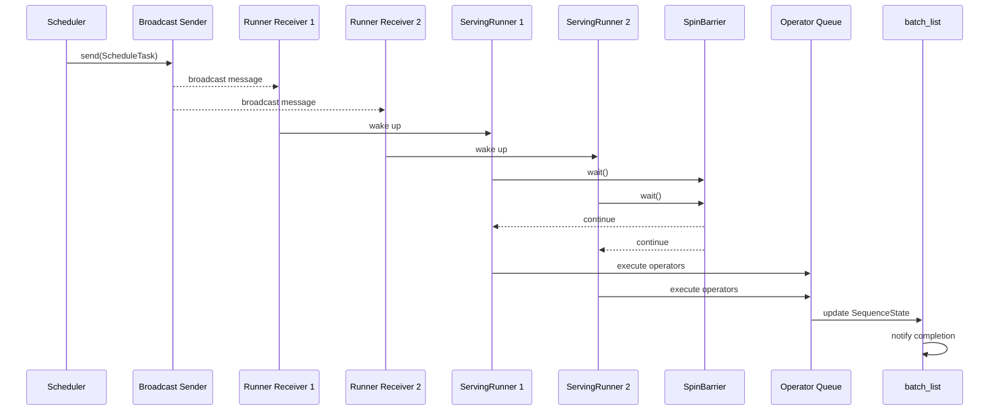
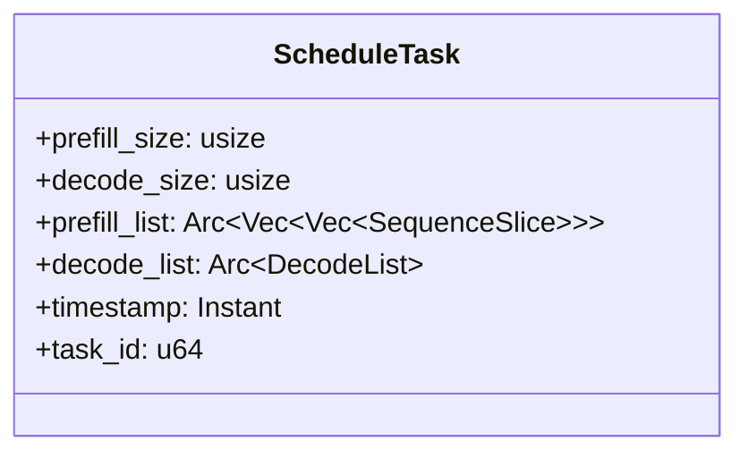

# Scheduler Design Details

---

## Table of Contents

**Basic Scheduling**

1. [Scheduler Overview](#1-scheduler-overview)
2. [Core Data Structures](#2-core-data-structures)
3. [Scheduling Flow](#3-scheduling-flow)
4. [Decode Round Scheduling](#4-decode-round-scheduling)
5. [Prefill Round Scheduling](#5-prefill-round-scheduling)
6. [State Machine](#6-state-machine)

**Optimized Scheduling**

7. [Event-Driven Triggering](#7-event-driven-triggering)
8. [Dual Trigger Mechanism](#8-dual-trigger-mechanism)
9. [Tokio Async Architecture](#9-tokio-async-architecture)
10. [Broadcast Task Distribution](#10-broadcast-task-distribution)

---

## 1. Scheduler Overview

`Scheduler` is the core scheduling component of the eLLM inference engine. It decides the execution mode and slice allocation for each round.

**Core Responsibilities**:
- Scan all sequence states in `batch_list`
- Decide whether the current round executes `Decode`, `Prefill`, or `Idle`
- Generate corresponding `SequenceSlice` lists for operator execution
- Manage event-driven scheduling with broadcast task distribution

**Scheduling Priority** (实际实现):
1. **Prefill First**: If any `Phase::Prefill` sequences exist, execute Prefill round
2. **Decode Second**: If no Prefill, execute Decode round  
3. **Idle Fallback**: If no pending sequences, enter idle state

**Strategy Pattern**: The scheduling logic is delegated to `SchedulerStrategy`, allowing custom scheduling behaviors to be injected.

> **Note**: 与文档初始设计不同，实际实现中 Prefill 优先级高于 Decode，确保新请求能及时得到处理。

---

## 2. Core Data Structures

### 2.1 Scheduler Structure

| Field | Type | Purpose |
|-------|------|---------|
| `batch_list` | `Arc<SharedMut<Vec<SlotState>>>` | Slot state shared storage |
| `slot_manager` | `Arc<SlotManager<f16>>` | Slot and session manager with LRU and delayed recycling |
| `strategy` | `Box<dyn SchedulerStrategy>` | Scheduling strategy (strategy pattern) |
| `thread_num` | `AtomicUsize` | Thread count (dynamically adjustable) |
| `needs_schedule` | `AtomicBool` | Schedule trigger flag |
| `schedule_tx` | `broadcast::Sender<()>` | Schedule trigger channel |
| `timeout` | `Duration` | Timeout window |
| `task_in_flight` | `Arc<AtomicBool>` | Atomic flag to prevent duplicate scheduling |

### 2.1.1 Scheduler Constructors

| Constructor | Parameters | Description |
|-------------|------------|-------------|
| `new()` | `_sequence_length`, `batch_size`, `thread_num`, `_threshold`, `timeout`, `batch_list`, `slot_manager` | Creates scheduler with default strategy |
| `with_mode()` | `_sequence_length`, `batch_size`, `chunk_size`, `thread_num`, `_threshold`, `timeout`, `batch_list`, `slot_manager` | Creates scheduler with configurable chunk_size |
| `with_strategy()` | `_sequence_length`, `batch_size`, `chunk_size`, `thread_num`, `timeout`, `batch_list`, `slot_manager`, `strategy` | Creates scheduler with custom strategy |

### 2.2 SlotState Fields

| Field | Type | Purpose |
|-------|------|---------|
| `phase` | `Phase` | Current phase: `Start`/`Prefill`/`Decode`/`Eos`/`Timeout` |
| `sequence_index` | `usize` | Current sequence position, prefill starting point |
| `kv_index` | `usize` | KV cache position, next write position |
| `filling_length` | `usize` | Remaining prefill tokens to process |
| `session_id` | `Option<String>` | Associated session ID |
| `token_count` | `usize` | Cached token count |
| `created_at` | `Instant` | Creation timestamp |
| `last_accessed` | `Instant` | Last access timestamp |
| `notify` | `Arc<Notify>` | Completion notification primitive |
| `lru_prev` | `usize` | LRU linked list previous pointer |
| `lru_next` | `usize` | LRU linked list next pointer |

### 2.2.1 SlotState Helper Methods

| Method | Description |
|--------|-------------|
| `new_start_state()` | Creates Start state with sentinel values |
| `new_prefill_state(sequence_index, filling_length)` | Creates Prefill state with KV index set to sequence_index |
| `new_decode_state(sequence_index, kv_index)` | Creates Decode state |
| `is_active()` | Returns true if phase is Prefill or Decode |
| `is_available()` | Returns true if phase is Start or Eos |
| `touch()` | Updates last_accessed to current time |

### 2.3 BatchPlan Structure

```rust
pub struct BatchPlan {
    pub mode: BatchMode,           // Decode, Prefill, or Mixed
    pub prefill_size: usize,       // Number of prefill sequences
    pub decode_size: usize,        // Number of decode sequences
    pub prefill_list: Vec<Vec<SequenceSlice>>,  // Per-thread prefill slices
    pub decode_list: DecodeList,   // Decode slices
    pub task_id: u64,              // Unique task identifier
}
```

### 2.4 PlanBuilder

The `PlanBuilder` in `plan.rs` is responsible for constructing batch plans from slot states:

```rust
pub struct PlanBuilder {
    max_decode_size: usize,
    max_prefill_size: usize,
    thread_num: usize,
    next_task_id: AtomicU64,
}
```

**Key Methods**:
- `build_plan(batch_list)`: Analyzes slot states and generates appropriate BatchPlan
- `build_decode()`: Constructs decode slices from candidates
- `build_prefill()`: Distributes prefill tokens across threads using SliceScheduler

### 2.4.1 PrefillCandidate Structure

```rust
pub struct PrefillCandidate {
    pub batch_index: usize,
    pub sequence_index: usize,
    pub remaining: usize,
}
```

Used internally by PlanBuilder to collect prefill candidates before distribution.

### 2.4.2 BatchPlan Helper Methods

| Method | Description |
|--------|-------------|
| `new(task_id)` | Creates empty BatchPlan |
| `sequence_count()` | Returns total sequence count (decode_size + prefill flag) |
| `is_empty()` | Returns true if both prefill_size and decode_size are zero |

---

## 3. Scheduling Flow

### 3.1 Scheduling Entry



### 3.2 Plan Generation Logic (Actual Implementation)

```text
plan_next_round() flow:
1. Delegate to strategy.plan_next_round(batch_list, thread_num, 0)
2. Strategy uses PlanBuilder to analyze batch_list
3. Collect decode candidates (Phase::Decode slots up to max_decode_size)
4. Collect prefill candidates (Phase::Prefill slots)
5. Determine batch mode:
   - has_prefill && has_decode -> Mixed
   - has_prefill only -> Prefill
   - has_decode only -> Decode
   - neither -> Empty plan
6. Build decode slices if needed
7. Build prefill slices if needed using SliceScheduler
8. Return BatchPlan with task_id

Priority: Prefill > Decode (implemented in PlanBuilder)
```

### 3.3 SchedulerStrategy Trait

```rust
pub trait SchedulerStrategy: Send + Sync + 'static {
    fn plan_next_round(
        &self,
        batch_list: &[SlotState],
        max_decode_size: usize,
        max_prefill_size: usize,
    ) -> BatchPlan;
}
```

**Note**: The current implementation simplifies the trait to a single method. The `DefaultSchedulerStrategy` delegates to `PlanBuilder` which handles all scheduling logic internally.

---

## 4. Decode Round Scheduling

### 4.1 Decode Round Characteristics

| Characteristic | Description |
|----------------|-------------|
| **Candidate Selection** | All `Phase::Decode` sequences |
| **Count Limit** | At most `max_decode_size` (equals `batch_size`) |
| **Slice Length** | Fixed at 1 |
| **prefill_list** | Cleared |

### 4.2 Slice Generation

```text
schedule_decode_round(decode_candidates, decode_list):
    decode_count = decode_candidates.len()
    
    for idx, (batch_index, sequence_index) in decode_candidates:
        decode_list.push(SequenceSlice {
            batch_index,
            sequence_index,
            token_start_index: idx,
            length: 1,
            last_token_flag: true,
        })
    
    return decode_count
```

---

## 5. Prefill Round Scheduling

### 5.1 Prefill Round Characteristics

| Characteristic | Description |
|----------------|-------------|
| **Candidate Selection** | All `Phase::Prefill` sequences |
| **Count Limit** | Total tokens not exceeding `max_prefill_size` |
| **Slice Length** | Variable, depends on quota |
| **Output** | Generate both `prefill_list` and `decode_list` |

### 5.2 Total Token Calculation

```text
max_prefill_size = chunk_size  // 由策略配置决定
total_tokens = min(sum(filling_length), max_prefill_size)
```

### 5.3 SliceScheduler 分配

```text
schedule_prefill_round(candidates, total_tokens, prefill_list, decode_list, thread_num):
    prefill_count = 0
    
    scheduler = SliceScheduler::new(thread_num, total_tokens)
    
    for candidate in candidates:
        if scheduler.is_done():
            break
        
        attention_length = min(candidate.remaining, scheduler.remaining_tokens())
        if attention_length > 0:
            decode_list.push(attention_slice)
        
        scheduler.schedule_sequence(
            batch_index,
            sequence_index,
            remaining,
            prefill_list,
            &mut prefill_count
        )
    
    return prefill_count
```

### 5.4 SliceScheduler 核心算法

```text
SliceScheduler:
    - thread_num: 线程数
    - total_tokens: 总 token 数
    - scheduled_tokens: 已分配 token 数
    - quotas: Vec<usize> - 每个线程的配额向量
    - current_thread: 当前分配的线程索引

构造函数 new(thread_num, total_tokens):
    base_quota = total_tokens / thread_num
    extra_quota = total_tokens % thread_num
    quotas[i] = base_quota + (1 if i < extra_quota else 0)

is_done():
    return scheduled_tokens >= total_tokens

remaining_tokens():
    return total_tokens - scheduled_tokens

schedule_sequence(batch_index, sequence_index, remaining, prefill_list, prefill_count):
    sequence_cursor = sequence_index
    
    while remaining > 0 && !is_done():
        // 跳过已用完配额的线程
        while current_thread < thread_num && quotas[current_thread] == 0:
            current_thread += 1
        
        if current_thread >= thread_num:
            break
        
        available = min(quotas[current_thread], remaining, remaining_tokens())
        if available == 0:
            break
        
        prefill_list[current_thread].push(SequenceSlice {
            batch_index,
            sequence_index: sequence_cursor,
            token_start_index: *prefill_count,
            length: available,
            last_token_flag: false,
        })
        
        *prefill_count += available
        quotas[current_thread] -= available
        scheduled_tokens += available
        remaining -= available
        sequence_cursor += available
```

### 5.5 线程配额分配示例

假设 `total_tokens=23`, `task_count=3`:

| Thread | 分配 Token |
|--------|-----------|
| Thread 0 | tokens 0-7 (8个) |
| Thread 1 | tokens 8-15 (8个) |
| Thread 2 | tokens 16-22 (7个) |

---

## 6. State Machine

### 6.1 SlotStateMachine Responsibilities

`SlotStateMachine` encapsulates state transition business logic, ensuring legal and atomic state transitions.

### 6.2 Supported State Transitions

| From | To | Condition | Method |
|------|-----|-----------|--------|
| `Start` | `Prefill` | None | `transition_to_prefill()` |
| `Eos` | `Prefill` | None | `transition_to_prefill()` |
| `Timeout` | `Prefill` | None | `transition_to_prefill()` |
| `Prefill` | `Decode` | `filling_length == 0` | `transition_to_decode()` / `advance_sequence()` |
| `Decode` | `Eos` | Generate eos token | `transition_to_eos()` |
| `Prefill` | `Eos` | Generate eos token | `transition_to_eos()` |
| `Decode` | `Timeout` | Timeout | `transition_to_timeout()` |
| `Prefill` | `Timeout` | Timeout | `transition_to_timeout()` |
| Any | `Start` | Reset | `reset_to_start()` |

### 6.3 advance_sequence Automatic Transition

```text
advance_sequence(state, steps):
    previous_phase = state.phase
    state.sequence_index += steps
    
    if state.phase == Phase::Prefill:
        state.filling_length -= steps
        if state.filling_length == 0:
            transition_to_decode(state)
            return Some(Phase::Decode)
    
    if previous_phase != state.phase:
        return Some(state.phase)
    else:
        return None
```

### 6.4 State Transition Validation

```rust
fn can_transition(from: Phase, to: Phase) -> bool {
    match (from, to) {
        (Start, Prefill) => true,
        (Eos, Prefill) => true,
        (Timeout, Prefill) => true,
        (Prefill, Decode) => true,
        (Decode, Eos) => true,
        (Prefill, Eos) => true,
        (Decode, Timeout) => true,
        (Prefill, Timeout) => true,
        _ => false,
    }
}
```

---

## 7. Event-Driven Triggering

### 7.1 Problems with Original Polling Mode

| Problem | Impact | Severity |
|---------|--------|----------|
| Polling mode (wake every 1ms) | CPU waste, uncertain latency | High |
| Cannot aggregate requests | Low batch efficiency | Medium |
| Blocking wait | Poor responsiveness | Medium |

### 7.2 Event-Driven Design Principles (实际实现)

| Principle | Description |
|-----------|-------------|
| **Async First** | Use Tokio async management, avoid blocking threads |
| **Event-Driven** | Trigger scheduling via `needs_schedule` flag + broadcast channel |
| **One-to-Many Push** | Use Broadcast to synchronously push tasks to multiple Runners |
| **Lock-Free Counting** | Use atomic operations for lock-free concurrent counting |
| **Task In-Flight Guard** | Prevent duplicate scheduling with atomic flag |
| **Strategy Pattern** | Decouple scheduling logic from execution |

---

## 8. Dual Trigger Mechanism

### 8.1 Trigger Methods

| Trigger Method | Condition | Applicable Scenario |
|----------------|-----------|---------------------|
| **Event Trigger** | `needs_schedule` flag set + broadcast signal | 高流量下及时调度 |
| **Timeout Trigger** | Time window expired AND `needs_schedule` set | 低流量下保证延迟 |

### 8.2 Trigger Decision Flow (实际实现)

```mermaid
flowchart TD
    A[收到新请求] --> B[notify_tokens(count)]
    B --> C["needs_schedule = true"]
    C --> D[发送 broadcast 信号]
    D --> E[scheduler.run() 收到信号]
    E --> F{"needs_schedule?"}
    F -->|是| G[trigger_schedule()]
    F -->|否| H[继续等待]
    
    I[定时 tick] --> J{"needs_schedule?"}
    J -->|是| G
    J -->|否| K{"有工作任务?"}
    K -->|是| L["needs_schedule = true"]
    L --> G
    K -->|否| M[继续等待]
```

### 8.3 trigger_schedule() 状态机

```text
trigger_schedule():
    1. needs_schedule.swap(false) -> 如果之前为 false，直接返回
    2. task_in_flight.compare_exchange(false, true) -> 如果失败，恢复 needs_schedule 并返回
    3. schedule_batch() 生成调度计划
    4. 如果 prefill_size == 0 && decode_size == 0:
        - 恢复 task_in_flight 和 needs_schedule
        - 返回
    5. 创建 ScheduleTask 并广播
    6. 发送成功则保持 task_in_flight，否则恢复状态
```

### 8.4 Tokio Async Runtime 实现

```rust
pub async fn run(self: Arc<Self>) {
    let mut interval = tokio::time::interval(self.timeout);
    let mut schedule_rx = self.schedule_tx.subscribe();

    loop {
        tokio::select! {
            // 事件驱动：收到调度请求时唤醒
            _ = schedule_rx.recv() => {
                if self.needs_schedule.load(Ordering::Acquire) {
                    self.trigger_schedule();
                }
            }
            // 降级：周期性检查以防事件丢失
            _ = interval.tick() => {
                if self.needs_schedule.load(Ordering::Acquire) {
                    self.trigger_schedule();
                    continue;
                }
                // 备用检查：直接检查 batch 状态
                let has_work = self.batch_list.with(|batch_list| {
                    batch_list.iter().any(|r| 
                        r.phase == Phase::Decode || r.phase == Phase::Prefill
                    )
                });
                if has_work {
                    self.needs_schedule.store(true, Ordering::Release);
                    self.trigger_schedule();
                }
            }
        }
    }
}
```

---

## 9. Tokio Async Architecture

### 9.1 Overall Architecture

```mermaid
flowchart TB
    subgraph Tokio Runtime
        subgraph Serving Layer
            A[chat_completions]
            A1[chat_completions]
            An[chat_completions]
        end

        subgraph Scheduling Layer
            B[Scheduler]
            B1[needs_schedule]
            B2[task_in_flight]
            B3[strategy]
            C[Broadcast Sender]
        end

        subgraph Execution Layer
            D[Broadcast Receiver]
            D1[Broadcast Receiver]
            Dn[Broadcast Receiver]
            E[ServingRunner]
            E1[ServingRunner]
            En[ServingRunner]
            F[Operator Queue]
            G[SpinBarrier]
        end

        subgraph Shared State
            H[(batch_list - Arc<SharedMut>)]
        end
    end

    A --> B: notify_tokens()
    A1 --> B: notify_tokens()
    An --> B: notify_tokens()
    B --> B3: plan_next_round()
    B --> C: send(ScheduleTask)
    C -.-> D
    C -.-> D1
    C -.-> Dn
    D --> E
    D1 --> E1
    Dn --> En
    E --> G
    E1 --> G
    En --> G
    E --> F
    E1 --> F
    En --> F
    B -.-> H
    E -.-> H
```

### 9.2 Thread Division

| Layer | Thread Type | Count | Description |
|-------|-------------|-------|-------------|
| Serving | HTTP Workers | Multiple | 并发请求处理 |
| Scheduling | Tokio Task | 1 | Scheduler async 执行 |
| Execution | Tokio Tasks | CPU cores | Runner 并行执行 |

### 9.3 ServingRunner Execution Flow



---

## 10. Broadcast Task Distribution

### 10.1 Data Flow



### 10.2 ScheduleTask Structure



### 10.3 Concurrency Safety Mechanisms

| Resource | Protection Mechanism | Description |
|----------|----------------------|-------------|
| `needs_schedule` | `AtomicBool` | 原子标志，无需锁 |
| `task_in_flight` | `AtomicBool` | 防止重复调度 |
| `batch_list` | `Arc<SharedMut>` | 共享可变状态 |
| Slot allocation | `Semaphore + Mutex<VecDeque>` | 防止重复分配 |
| Task broadcast | `tokio::sync::broadcast` | 一对多可靠推送 |
| `thread_num` | `AtomicUsize` | 动态线程数调整 |
| Strategy | Trait Object | 策略模式，运行时可替换 |

---

## 11. Dynamic Thread Management

### 11.1 set_thread_num() 实现

```text
set_thread_num(thread_num):
    1. thread_num = max(thread_num, 1)
    2. 原子存储新的 thread_num
    3. 调整 prefill_list 长度（截断或扩展）
```

### 11.2 线程数与 prefill_list 的关系

```text
prefill_list: Vec<Vec<SequenceSlice>>
             ^           ^
             |           |
          thread_num   每个线程的 slices
```

---

**Document Version**: v4.2  
**Last Updated**: 2026-06-22  
**Major Changes**: Added Scheduler constructor documentation, SlotState helper methods, PrefillCandidate structure, BatchPlan helper methods; updated SliceScheduler algorithm to match actual implementation (using quotas vector instead of current_task_remaining); removed SlotAllocator section (now integrated into SlotManager documented in session_management.md)