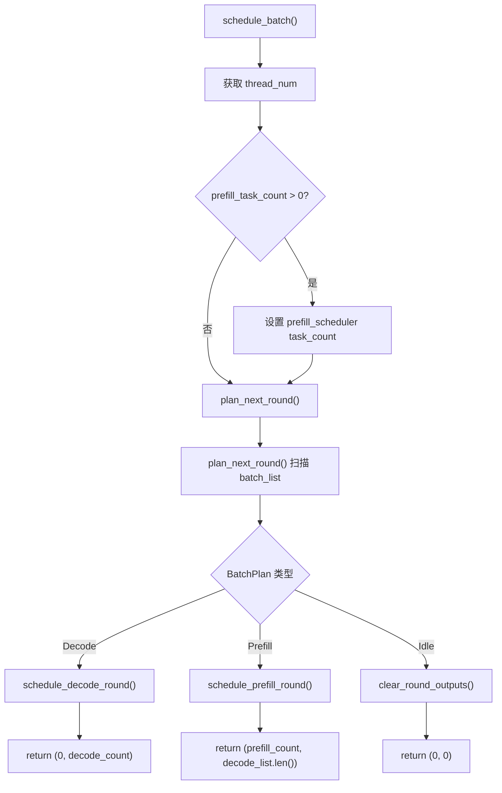
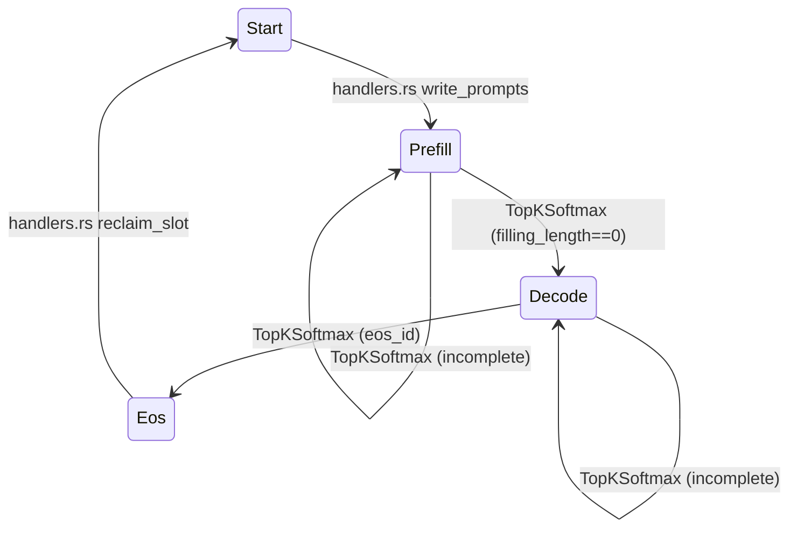
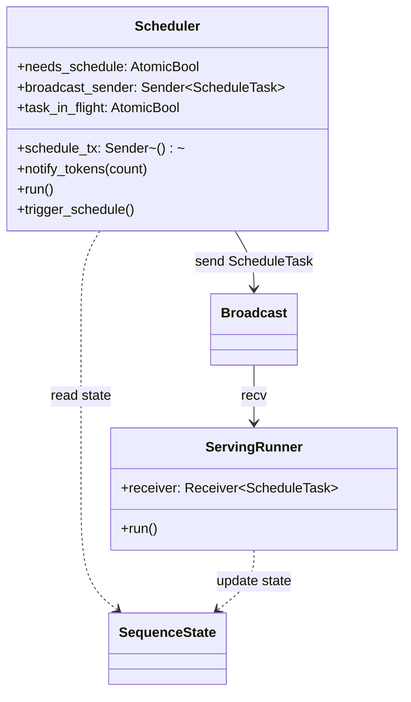
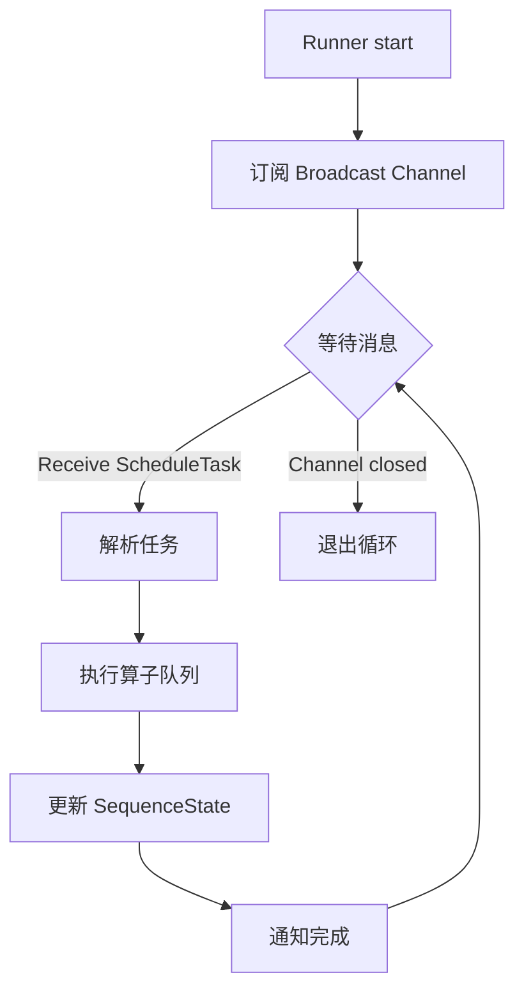
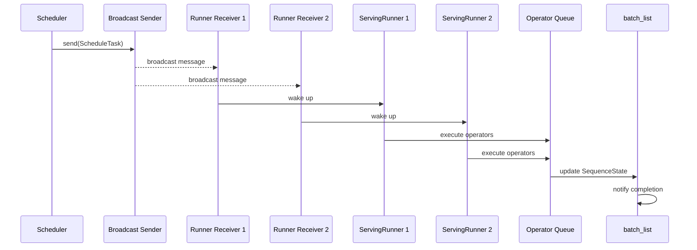
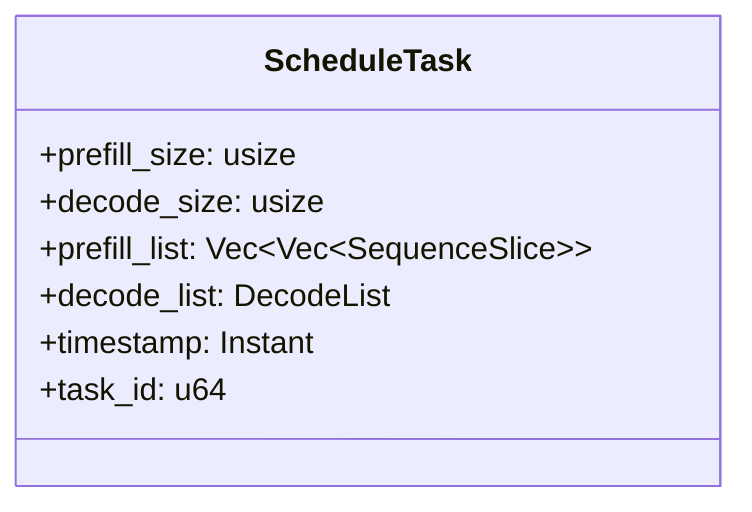

# Scheduler Design Details

---

## Table of Contents

**Basic Scheduling**

1. [Scheduler Overview](#1-scheduler-overview)
2. [Core Data Structures](#2-core-data-structures)
3. [Scheduling Flow](#3-scheduling-flow)
4. [Decode Round Scheduling](#4-decode-round-scheduling)
5. [Prefill Round Scheduling](#5-prefill-round-scheduling)
6. [State Update Boundaries](#6-state-update-boundaries)

**Optimized Scheduling**

7. [Event-Driven Triggering](#7-event-driven-triggering)
8. [Dual Trigger Mechanism](#8-dual-trigger-mechanism)
9. [Tokio Async Architecture](#9-tokio-async-architecture)
10. [Broadcast Task Distribution](#10-broadcast-task-distribution)

---

## 1. Scheduler Overview

`Scheduler` is the core scheduling component of the eLLM inference engine. It decides the execution mode and slice allocation for each round.

**Core Responsibilities**:
- Scan all sequence states in `batch_list`
- Decide whether the current round executes `Decode`, `Prefill`, or `Idle`
- Generate corresponding `SequenceSlice` lists for operator execution

**Scheduling Priority** (实际实现):
1. **Prefill First**: If any `Phase::Prefill` sequences exist, execute Prefill round
2. **Decode Second**: If no Prefill, execute Decode round  
3. **Idle Fallback**: If no pending sequences, enter idle state

> **Note**: 与文档初始设计不同，实际实现中 Prefill 优先级高于 Decode，确保新请求能及时得到处理。

---

## 2. Core Data Structures

### 2.1 Scheduler Structure

| Field | Type | Purpose |
|-------|------|---------|
| `prefill_list` | `UnsafeCell<Vec<Vec<SequenceSlice>>>` | 每个线程的 prefill slice 列表 |
| `decode_list` | `UnsafeCell<DecodeList>` | Decode/Attention slice 容器 |
| `batch_list` | `Arc<SharedMut<Vec<SequenceState>>>` | 序列状态共享存储 |
| `prefill_scheduler` | `UnsafeCell<SliceScheduler>` | Prefill 分片调度器 |
| `max_prefill_size` | `usize` | 最大 prefill token 数（由 chunk_size 决定） |
| `max_decode_size` | `usize` | 最大 decode 序列数（等于 batch_size） |
| `thread_num` | `AtomicUsize` | 线程数（动态可调整） |
| `needs_schedule` | `AtomicBool` | 是否需要调度的标志 |
| `schedule_tx` | `broadcast::Sender<()>` | 调度触发通道 |
| `timeout` | `Duration` | 超时时间窗口 |
| `broadcast_sender` | `broadcast::Sender<ScheduleTask>` | 任务广播发送器 |
| `next_task_id` | `AtomicU64` | 任务 ID 生成器 |
| `task_in_flight` | `Arc<AtomicBool>` | 防止重复调度的原子标志 |

### 2.2 SequenceState Fields

| Field | Type | Purpose |
|-------|------|---------|
| `phase` | `Phase` | 当前阶段: `Start`/`Prefill`/`Decode`/`Eos`/`Timeout` |
| `sequence_index` | `usize` | 当前序列位置，prefill 起始点 |
| `kv_index` | `usize` | KV 缓存位置，下次写入位置 |
| `filling_length` | `usize` | 剩余需要处理的 prefill token 数 |
| `notify` | `Arc<Notify>` | 完成通知同步原语 |

### 2.3 SequenceSlice Fields

| Field | Type | Purpose |
|-------|------|---------|
| `batch_index` | `usize` | Batch slot 索引 |
| `sequence_index` | `usize` | 序列内起始位置 |
| `token_start_index` | `usize` | 本轮扁平 token 视图中的起始位置 |
| `length` | `usize` | 连续 token 长度 |
| `last_token_flag` | `bool` | 是否为提示词的最后一个 token |

### 2.4 BatchPlan Enum

```rust
enum BatchPlan {
    Decode(Vec<(usize, usize)>),       // (batch_index, sequence_index) 列表
    Prefill {
        candidates: Vec<PrefillCandidate>,
        total_tokens: usize,
    },
    Idle,
}
```

---

## 3. Scheduling Flow

### 3.1 Scheduling Entry



### 3.2 Plan Generation Logic (实际实现)

```text
plan_next_round() flow:
1. 遍历 batch_list 收集候选
2. 如果有 Prefill 候选 -> 返回 BatchPlan::Prefill
3. 如果有 Decode 候选 -> 返回 BatchPlan::Decode  
4. 否则返回 BatchPlan::Idle

优先级: Prefill > Decode > Idle
```

---

## 4. Decode Round Scheduling

### 4.1 Decode Round Characteristics

| Characteristic | Description |
|----------------|-------------|
| **Candidate Selection** | All `Phase::Decode` sequences |
| **Count Limit** | At most `max_decode_size` (equals `batch_size`) |
| **Slice Length** | Fixed at 1 |
| **prefill_list** | Cleared |

### 4.2 Slice Generation

```text
schedule_decode_round(decode_candidates):
    clear_round_outputs()
    decode_count = decode_candidates.len()
    
    for idx, (batch_index, sequence_index) in decode_candidates:
        decode_list.push(SequenceSlice {
            batch_index,
            sequence_index,
            token_start_index: idx,
            length: 1,
            last_token_flag: true,
        })
    
    return decode_count
```

---

## 5. Prefill Round Scheduling

### 5.1 Prefill Round Characteristics

| Characteristic | Description |
|----------------|-------------|
| **Candidate Selection** | All `Phase::Prefill` sequences |
| **Count Limit** | Total tokens not exceeding `max_prefill_size` |
| **Slice Length** | Variable, depends on quota |
| **Output** | Generate both `prefill_list` and `decode_list` |

### 5.2 Total Token Calculation

```text
max_prefill_size = chunk_size  // 而非 sequence_length * batch_size
total_tokens = min(sum(filling_length), max_prefill_size)
```

### 5.3 SliceScheduler 分配

```text
prefill_scheduler.init(total_tokens)

for candidate in candidates:
    if prefill_scheduler.is_done():
        break
    
    attention_length = min(candidate.remaining, prefill_scheduler.remaining_tokens())
    if attention_length > 0:
        decode_list.push(attention_slice)
    
    prefill_scheduler.schedule_for_sequence(
        batch_index,
        sequence_index,
        remaining,
        start_offset,
        prefill_list,
        &mut prefill_count
    )
```

### 5.4 线程配额分配示例

假设 `total_tokens=23`, `task_count=3`:

| Thread | 分配 Token |
|--------|-----------|
| Thread 0 | tokens 0-7 (8个) |
| Thread 1 | tokens 8-15 (8个) |
| Thread 2 | tokens 16-22 (7个) |

---

## 6. State Update Boundaries

### 6.1 Scheduler Does Not Update State

`Scheduler` only generates slices, does not modify `SequenceState`. State updates occur at:

| Phase | Location | Update Content |
|-------|----------|-----------------|
| **Write Prompt** | `handlers.rs` | Set `phase=Prefill`, `filling_length` |
| **Prefill Execution** | `TopKSoftmax` | Advance `sequence_index`, `kv_index`, `filling_length` |
| **Switch to Decode** | `TopKSoftmax` | Set `phase=Decode` when `filling_length==0` |
| **Generation Complete** | `TopKSoftmax` | Set `phase=Eos` when `eos_id` encountered |

### 6.2 State Transition Diagram



---

## 7. Event-Driven Triggering

### 7.1 Problems with Original Polling Mode

| Problem | Impact | Severity |
|---------|--------|----------|
| Polling mode (wake every 1ms) | CPU waste, uncertain latency | High |
| Cannot aggregate requests | Low batch efficiency | Medium |
| Blocking wait | Poor responsiveness | Medium |

### 7.2 Event-Driven Design Principles (实际实现)

| Principle | Description |
|-----------|-------------|
| **Async First** | Use Tokio async management, avoid blocking threads |
| **Event-Driven** | Trigger scheduling via `needs_schedule` flag + broadcast channel |
| **One-to-Many Push** | Use Broadcast to synchronously push tasks to multiple Runners |
| **Lock-Free Counting** | Use atomic operations for lock-free concurrent counting |
| **Task In-Flight Guard** | Prevent duplicate scheduling with atomic flag |

### 7.3 Optimized Component Relationships



---

## 8. Dual Trigger Mechanism

### 8.1 Trigger Methods

| Trigger Method | Condition | Applicable Scenario |
|----------------|-----------|---------------------|
| **Event Trigger** | `needs_schedule` flag set + broadcast signal | 高流量下及时调度 |
| **Timeout Trigger** | Time window expired AND `needs_schedule` set | 低流量下保证延迟 |

### 8.2 Trigger Decision Flow (实际实现)

```mermaid
flowchart TD
    A[收到新请求] --> B[notify_tokens(count)]
    B --> C["needs_schedule = true"]
    C --> D[发送 broadcast 信号]
    D --> E[scheduler.run() 收到信号]
    E --> F{"needs_schedule?"}
    F -->|是| G[trigger_schedule()]
    F -->|否| H[继续等待]
    
    I[定时 tick] --> J{"needs_schedule?"}
    J -->|是| G
    J -->|否| K{"有工作任务?"}
    K -->|是| L["needs_schedule = true"]
    L --> G
    K -->|否| M[继续等待]
```

### 8.3 trigger_schedule() 状态机

```text
trigger_schedule():
    1. needs_schedule.swap(false) -> 如果之前为 false，直接返回
    2. task_in_flight.compare_exchange(false, true) -> 如果失败，恢复 needs_schedule 并返回
    3. schedule_batch() 生成调度计划
    4. 如果 prefill_size == 0 && decode_size == 0:
        - 恢复 task_in_flight 和 needs_schedule
        - 返回
    5. 创建 ScheduleTask 并广播
    6. 发送成功则保持 task_in_flight，否则恢复状态
```

### 8.4 Tokio Async Runtime 实现

```rust
pub async fn run(self: Arc<Self>) {
    let mut interval = tokio::time::interval(self.timeout);
    let mut schedule_rx = self.schedule_tx.subscribe();

    loop {
        tokio::select! {
            // 事件驱动：收到调度请求时唤醒
            _ = schedule_rx.recv() => {
                if self.needs_schedule.load(Ordering::Acquire) {
                    self.trigger_schedule();
                }
            }
            // 降级：周期性检查以防事件丢失
            _ = interval.tick() => {
                if self.needs_schedule.load(Ordering::Acquire) {
                    self.trigger_schedule();
                    continue;
                }
                // 备用检查：直接检查 batch 状态
                let has_work = self.batch_list.with(|batch_list| {
                    batch_list.iter().any(|r| 
                        r.phase == Phase::Decode || r.phase == Phase::Prefill
                    )
                });
                if has_work {
                    self.needs_schedule.store(true, Ordering::Release);
                    self.trigger_schedule();
                }
            }
        }
    }
}
```

---

## 9. Tokio Async Architecture

### 9.1 Overall Architecture

```mermaid
flowchart TB
    subgraph Tokio Runtime
        subgraph Serving Layer
            A[chat_completions]
            A1[chat_completions]
            An[chat_completions]
        end

        subgraph Scheduling Layer
            B[Scheduler]
            B1[needs_schedule]
            B2[task_in_flight]
            C[Broadcast Sender]
        end

        subgraph Execution Layer
            D[Broadcast Receiver]
            D1[Broadcast Receiver]
            Dn[Broadcast Receiver]
            E[ServingRunner]
            E1[ServingRunner]
            En[ServingRunner]
            F[Operator Queue]
        end

        subgraph Shared State
            G[(batch_list - Arc<SharedMut>)]
        end
    end

    A --> B: notify_tokens()
    A1 --> B: notify_tokens()
    An --> B: notify_tokens()
    B --> C: send(ScheduleTask)
    C -.-> D
    C -.-> D1
    C -.-> Dn
    D --> E
    D1 --> E1
    Dn --> En
    E --> F
    E1 --> F
    En --> F
    B -.-> G
    E -.-> G
```

### 9.2 Thread Division

| Layer | Thread Type | Count | Description |
|-------|-------------|-------|-------------|
| Serving | HTTP Workers | Multiple | 并发请求处理 |
| Scheduling | Tokio Task | 1 | Scheduler async 执行 |
| Execution | Tokio Tasks | CPU cores | Runner 并行执行 |

### 9.3 ServingRunner Execution Flow



---

## 10. Broadcast Task Distribution

### 10.1 Data Flow



### 10.2 ScheduleTask Structure



### 10.3 Concurrency Safety Mechanisms

| Resource | Protection Mechanism | Description |
|----------|----------------------|-------------|
| `needs_schedule` | `AtomicBool` | 原子标志，无需锁 |
| `task_in_flight` | `AtomicBool` | 防止重复调度 |
| `batch_list` | `Arc<SharedMut>` | 共享可变状态 |
| Slot allocation | `Semaphore + Mutex<VecDeque>` | 防止重复分配 |
| Task broadcast | `tokio::sync::broadcast` | 一对多可靠推送 |
| `thread_num` | `AtomicUsize` | 动态线程数调整 |

---

## 11. Dynamic Thread Management

### 11.1 set_thread_num() 实现

```text
set_thread_num(thread_num):
    1. thread_num = max(thread_num, 1)
    2. 原子存储新的 thread_num
    3. 调整 prefill_list 长度（截断或扩展）
    4. 更新 prefill_scheduler 的 task_count
```

### 11.2 线程数与 prefill_list 的关系

```text
prefill_list: Vec<Vec<SequenceSlice>>
             ^           ^
             |           |
          thread_num   每个线程的 slices
```

---

**Document Version**: v3.1  
**Last Updated**: 2026-06-11
