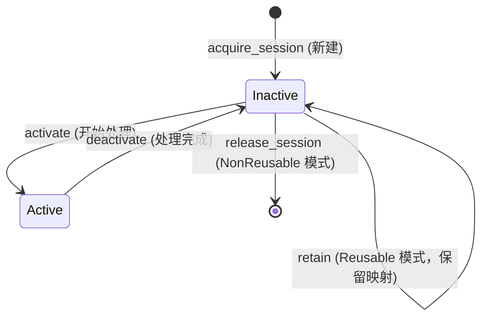
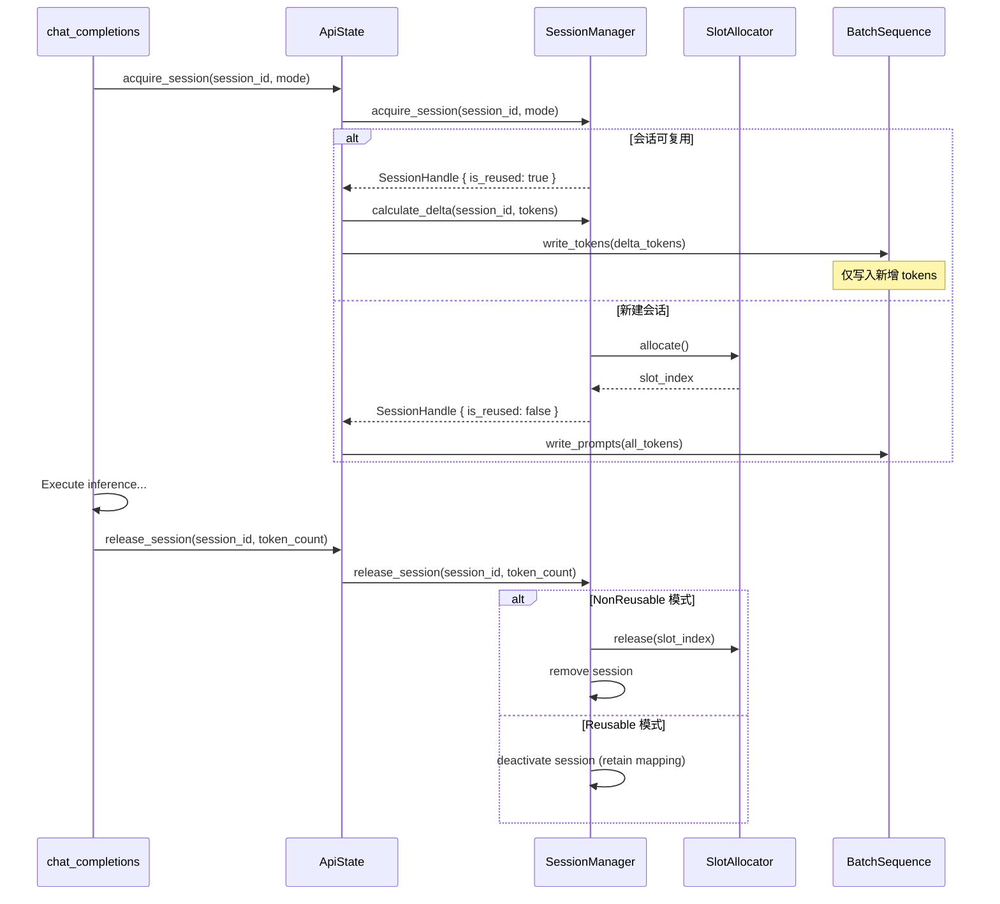

# Session Management: Unified Dialogue Session System

---

## Overview

**Session Manager** 是一个统一的对话会话管理系统，整合了槽位分配、token 缓存和会话生命周期管理。它通过 **SessionMode** 枚举支持两种运行模式：

1. **Reusable Mode（复用模式）**：相同 `session_id` 的请求复用已分配的槽位，保留映射关系
2. **NonReusable Mode（不复用模式）**：每次请求分配新槽位，清除映射关系

**核心目标**：通过检测同一会话连续请求间的公共前缀，仅对新增 token 进行 prefill，优化推理性能，同时提供灵活的槽位管理策略。

---

## Core Data Structures

### SessionMode

会话模式枚举：

```rust
pub enum SessionMode {
    /// 复用模式：相同 session_id 复用槽位，保留映射
    Reusable,
    /// 不复用模式：每次请求分配新槽位，清除映射
    NonReusable,
}
```

### DialogueSession

会话元数据结构（存储会话状态信息）：

| Field | Type | Description |
|-------|------|-------------|
| `session_id` | `String` | 会话唯一标识 |
| `mode` | `SessionMode` | 会话模式 |
| `slot_index` | `Option<usize>` | 绑定的槽位索引 |
| `token_count` | `usize` | 已缓存的 token 数量 |
| `created_at` | `Instant` | 创建时间戳 |
| `last_accessed` | `Instant` | 最后访问时间戳 |
| `is_active` | `bool` | 是否正在处理请求 |

**数据引用说明**：
- **Tokens**：实际 token 序列存储在 `BatchSequence` 中，通过 `slot_index` 定位
- **KV Cache**：KV 缓存信息存储在 `SequenceState` 中，通过 `slot_index` 关联

### SessionHandle

会话句柄（返回给调用方）：

| Field | Type | Description |
|-------|------|-------------|
| `session_id` | `String` | 会话 ID |
| `slot_index` | `usize` | 分配的槽位索引 |
| `is_reused` | `bool` | 是否为复用的会话 |

### SlotAllocator

简化的槽位分配器（只管理空闲槽位队列）：

| Field | Type | Description |
|-------|------|-------------|
| `free_slots` | `Arc<Mutex<VecDeque<usize>>>` | 空闲槽位队列 |
| `batch_states` | `Arc<SharedMut<Vec<SequenceState>>>` | 批次状态引用 |

### SessionManager<T>

会话管理器（统一管理所有会话）：

| Field | Type | Description |
|-------|------|-------------|
| `sessions` | `Arc<Mutex<HashMap<String, DialogueSession>>>` | 会话存储 |
| `slot_allocator` | `Arc<SlotAllocator>` | 槽位分配器 |
| `batch_sequences` | `Arc<SharedMut<BatchSequence<T>>>` | 批量序列引用 |
| `max_sessions` | `usize` | 最大会话数 |

---

## Session Lifecycle

### State Transitions



### Key Rules

- **Active 状态不可复用**：只有 `is_active=false` 的会话才可被复用
- **访问更新时间戳**：任何操作都会更新 `last_accessed`
- **LRU 清理**：超过 `max_sessions` 时，移除最久未访问的非活跃会话
- **模式感知释放**：
  - Reusable 模式：保留会话和槽位映射，不释放槽位
  - NonReusable 模式：删除会话，释放槽位

---

## Key Operations

### 1. Acquire Session

```rust
acquire_session(session_id: &str, mode: SessionMode) -> SessionResult<SessionHandle>:
    // 尝试查找现有会话
    if let Some(session) = sessions.get_mut(session_id):
        if session.can_reuse():  // mode == Reusable && slot_index.is_some() && !is_active
            session.activate()
            return SessionHandle::reused(session_id, session.slot_index)
    
    // 检查会话数量限制
    if sessions.len() >= max_sessions:
        evict_lru_session()  // LRU 清理
    
    // 分配新槽位
    slot_index = slot_allocator.allocate()
    
    // 创建新会话
    new_session = DialogueSession {
        session_id,
        mode,
        slot_index: Some(slot_index),
        token_count: 0,
        created_at: now(),
        last_accessed: now(),
        is_active: true,
    }
    
    sessions.insert(session_id, new_session)
    return SessionHandle::new(session_id, slot_index)
```

### 2. Release Session

```rust
release_session(session_id: &str, token_count: usize):
    if let Some(session) = sessions.get_mut(session_id):
        session.deactivate()
        session.token_count = token_count
        
        if session.mode == NonReusable:
            // 不复用模式：立即清理
            slot_index = session.slot_index.take()
            slot_allocator.release(slot_index)
            sessions.remove(session_id)
        else:
            // 复用模式：保留会话和槽位映射
```

### 3. Calculate Delta Tokens

```rust
calculate_delta(session_id: &str, new_tokens: &[u32]) -> Option<(usize, Vec<u32>)>:
    (slot_index, cached_count) = get_cached_tokens(session_id)?
    
    // 从 BatchSequence 获取已缓存的 tokens
    cached_tokens = batch_sequences.token_ids(slot_index, 0, cached_count)
    
    min_len = min(cached_tokens.len(), new_tokens.len())
    prefix_len = 0
    
    while prefix_len < min_len && cached_tokens[prefix_len] == new_tokens[prefix_len]:
        prefix_len += 1
    
    if prefix_len > 0:
        return Some((prefix_len, new_tokens[prefix_len:].to_vec()))
    else:
        return None
```

### 4. Get Cached Tokens

```rust
get_cached_tokens(session_id: &str) -> Option<(usize, usize)>:
    sessions.get(session_id)
        .filter(|s| s.token_count > 0)
        .and_then(|s| s.slot_index.map(|idx| (idx, s.token_count)))
```

### 5. LRU Eviction

```rust
evict_lru_session(sessions: &mut HashMap<String, DialogueSession>):
    // 找到最久未访问的非活跃会话
    oldest_session = None
    
    for (id, session) in sessions.iter():
        if !session.is_active:
            if oldest_session is None or session.last_accessed < oldest_session.last_accessed:
                oldest_session = Some((id, session))
    
    if let Some((oldest_id, _)) = oldest_session:
        session = sessions.remove(oldest_id)
        if let Some(idx) = session.slot_index:
            slot_allocator.release(idx)
```

---

## Integration with API Layer



---

## Thread Safety

| Operation | Lock Strategy |
|-----------|---------------|
| `acquire_session` | Mutex 保护 sessions HashMap |
| `release_session` | Mutex 保护 sessions HashMap |
| `get_cached_tokens` | Mutex 保护 sessions HashMap |
| `calculate_delta` | 先读取 sessions，再访问 batch_sequences |
| `SlotAllocator.allocate/release` | Mutex 保护 free_slots |

**性能优化**：
- **短锁持有**：仅在必要时持有锁，快速释放
- **LRU 清理**：在 acquire_session 时惰性清理，避免后台定时任务
- **索引复用**：SlotAllocator 使用 VecDeque，高效管理空闲槽位

---

## Configuration

| Parameter | Default | Description |
|-----------|---------|-------------|
| `max_sessions` | batch_size | 最大会话数（等于槽位数量） |
| `session_mode` | NonReusable | 默认会话模式 |

---

## Module Structure

```
src/runtime/scheduling/
├── mod.rs                # Scheduling submodule entry and re-exports
├── session.rs            # SessionManager, DialogueSession, SessionHandle, SessionMode
├── slot_allocator.rs     # SlotAllocator implementation
├── scheduler.rs          # Scheduler implementation
├── strategy.rs           # SchedulerStrategy, BatchPlan
├── types.rs              # Phase, ScheduleTask, SequenceState definitions
├── state_machine.rs      # SequenceStateMachine state transition logic
├── sequence_slice.rs     # SequenceSlice, DecodeList definitions
├── batch_sequence.rs     # BatchSequence implementation
└── initialization.rs     # build_batch_sequence, build_sequence_state helpers
```

**Removed Files**:
- ❌ `src/runtime/caching/dialogue_cache.rs` - 功能整合到 SessionManager
- ❌ `src/runtime/caching/strategy.rs` - LRU 策略不再需要
- ❌ `src/runtime/caching/lru_list.rs` - 简化为 HashMap + LRU 清理
- ❌ `src/runtime/scheduling/slot_manager.rs` - 替换为 SlotAllocator
- ❌ `src/runtime/caching/mod.rs` - caching 目录已删除

---

## Migration Guide

### From DialogueCache to SessionManager

**Old Code**:
```rust
// 获取槽位
let slot_index = state.acquire_slot().await?;

// 插入缓存
state.dialogue_cache.insert(dialogue_id, slot_index, token_count).await;

// 查找公共前缀
let result = state.dialogue_cache.find_common_prefix(dialogue_id, &tokens).await;

// 释放槽位
state.release_slot(slot_index, true).await;
```

**New Code**:
```rust
// 获取会话
let handle = state.acquire_session(&session_id, mode).await?;
let slot_index = handle.slot_index;

// 如果是复用会话，自动计算 delta
if handle.is_reused {
    let (prefix_len, delta_tokens) = state.get_cached_prefix(&session_id, &tokens).await?;
    // 写入 delta tokens
} else {
    // 写入全部 tokens
}

// 释放会话（自动根据模式决定行为）
state.release_session(&session_id, token_count).await;
```

### Key Differences

| Aspect | Old (DialogueCache) | New (SessionManager) |
|--------|---------------------|----------------------|
| **职责** | 分散：SlotManager + DialogueCache | 统一：SessionManager |
| **Permit 管理** | Semaphore permit 计数复杂 | 直接 allocate/release，无 permit |
| **并发控制** | 检查 SequenceState.is_available() | 使用 is_active 标志 |
| **模式切换** | 全局 enabled 标志 | 每个会话独立 mode |
| **客户端控制** | 无法动态选择 | 可通过 session_mode 参数指定 |

---

**Document Version**: v1.0  
**Last Updated**: 2026-06-16
