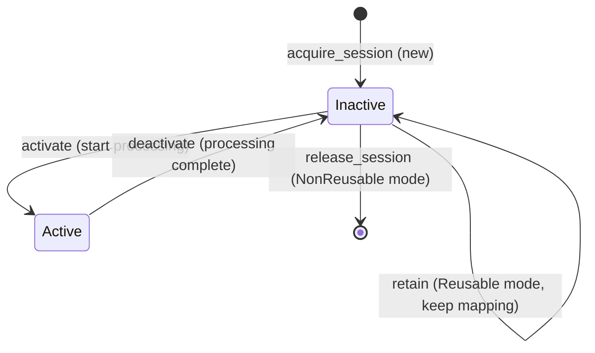
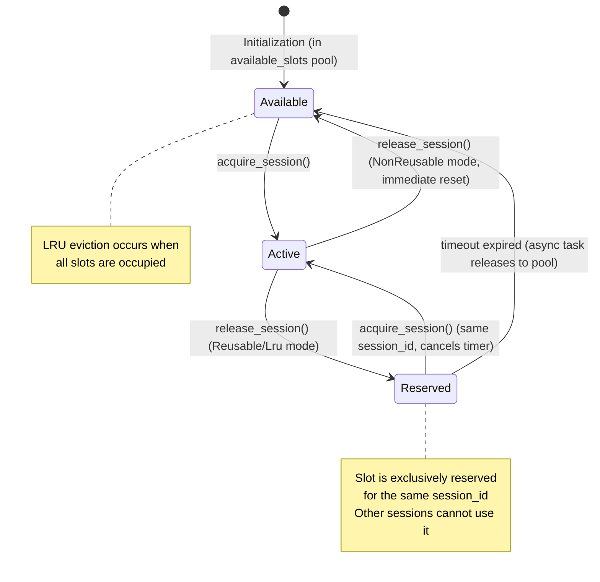
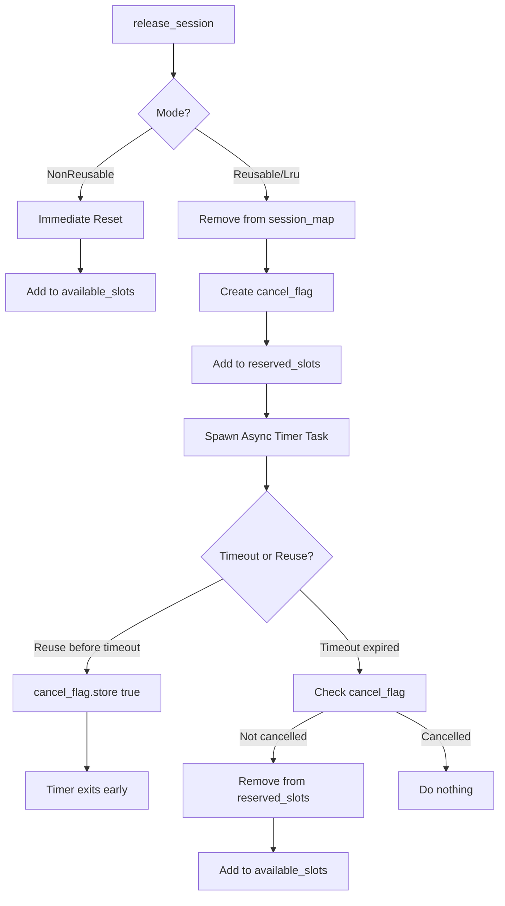
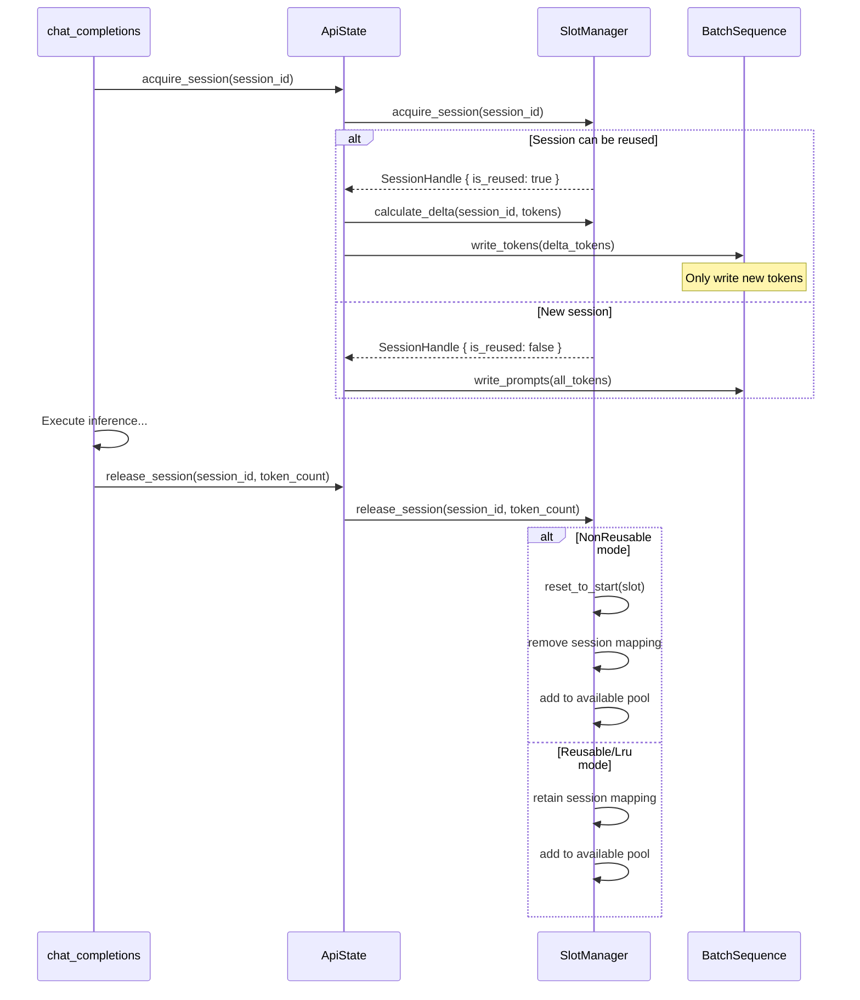

# Session Management: Unified Slot and Session System

---

## Overview

**SlotManager** is a unified slot and session management system that integrates slot allocation, token caching, session lifecycle management, LRU eviction, and **delayed slot recycling**. It supports three operation modes through **SessionMode** enum:

1. **Reusable Mode**: Same `session_id` requests reuse assigned slots with delayed recycling (configurable timeout)
2. **NonReusable Mode**: Each request allocates a new slot, immediately resets state and releases to pool
3. **Lru Mode**: Uses LRU eviction when all slots are occupied, with delayed recycling support

**Core Objectives**: 
- Optimize inference performance by detecting common prefixes between consecutive requests of the same session
- Only prefill new tokens for reused sessions
- Provide flexible slot management with configurable delayed recycling
- Ensure reserved slots are exclusive to their session during the retention period

---

## Core Data Structures

### SessionMode

Session mode enum:

```rust
pub enum SessionMode {
    /// Reusable mode: same session_id reuses slot, retains mapping
    Reusable,
    /// Non-reusable mode: each request allocates new slot, clears mapping
    NonReusable,
    /// LRU mode: uses LRU eviction when slots are full
    Lru,
}
```

### DialogueSession

Session metadata structure (stores session state information):

| Field | Type | Description |
|-------|------|-------------|
| `session_id` | `String` | Unique session identifier |
| `slot_index` | `usize` | Bound slot index |
| `token_count` | `usize` | Number of cached tokens |
| `created_at` | `Instant` | Creation timestamp |
| `last_accessed` | `Instant` | Last access timestamp |

**Data Reference Notes**:
- **Tokens**: Actual token sequences stored in `BatchSequence`, located via `slot_index`
- **KV Cache**: KV cache information stored in `SlotState`, associated via `slot_index`

### SessionHandle

Session handle (returned to caller):

| Field | Type | Description |
|-------|------|-------------|
| `session_id` | `String` | Session ID |
| `slot_index` | `usize` | Allocated slot index |
| `is_reused` | `bool` | Whether this is a reused session |

### SlotManager<T>

Slot manager (unified management of all slots and sessions):

| Field | Type | Description |
|-------|------|-------------|
| `slots` | `Arc<Mutex<Vec<SlotState>>>` | Slot state array with LRU linked list |
| `active_prefill` | `Arc<Mutex<Vec<usize>>>` | Active prefill slot indices |
| `active_decode` | `Arc<Mutex<Vec<usize>>>` | Active decode slot indices |
| `available_slots` | `Arc<Mutex<Vec<usize>>>` | Available slot indices pool |
| `session_map` | `Arc<Mutex<HashMap<String, usize>>>` | Session ID to slot index mapping |
| `reserved_slots` | `Arc<Mutex<HashMap<String, (usize, Arc<AtomicBool>)>>>` | Reserved slots with cancel flags |
| `batch_sequences` | `Arc<SharedMut<BatchSequence<T>>>` | Batch sequence reference |
| `mode` | `SessionMode` | Session management mode |
| `reuse_timeout` | `Duration` | Slot retention timeout duration |

**Key Features**:
- **LRU Linked List**: Each `SlotState` contains `lru_prev` and `lru_next` pointers for efficient LRU tracking
- **Active Tracking**: Maintains separate lists for active prefill and decode slots
- **Available Pool**: Manages available slots for quick allocation
- **Session Mapping**: Maps session IDs to slot indices for reuse detection
- **Delayed Recycling**: Released slots are reserved for a configurable timeout period, exclusively accessible by the same session
- **Async Timer Cancellation**: Uses atomic flags to cancel pending timeout tasks when slots are reused

---

## Session Lifecycle

### State Transitions



### Slot Lifecycle

Each slot has an independent lifecycle with LRU management and optional delayed recycling:



### Key Rules

- **Active tracking**: Slots are tracked in `active_prefill` or `active_decode` lists during processing
- **Access time update**: Any operation updates `last_accessed` timestamp
- **LRU eviction**: When all slots are occupied, evict least recently used slot
- **Mode-aware release**:
  - **Reusable mode**: Remove from session_map, add to reserved_slots with async timer, exclusive to same session during timeout
  - **NonReusable mode**: Immediately reset slot to Start state, remove mapping, add to available_slots
  - **Lru mode**: Same as Reusable but uses LRU eviction when allocating new slots
- **Session mapping**: `session_map` maintains bidirectional mapping between session IDs and slot indices
- **Reserved exclusivity**: During the retention period, reserved slots are ONLY accessible by the original session_id
- **Timer cancellation**: When a reserved slot is reused, the pending timeout task is cancelled via atomic flag

---

## Key Operations

### 1. Acquire Session

```rust
acquire_session(session_id: &str) -> Result<SessionHandle, SlotError>:
    // Step 1: Check active session mapping
    if let Some(&slot_index) = session_map.get(session_id):
        touch_lru(slot_index)  // Update LRU order
        return SessionHandle::reused(session_id, slot_index)
    
    // Step 2: Check reserved slots (delayed recycling)
    if let Some((slot_index, cancel_flag)) = reserved_slots.remove(session_id):
        cancel_flag.store(true)  // Cancel pending timeout task
        session_map.insert(session_id, slot_index)  // Restore mapping
        touch_lru(slot_index)
        return SessionHandle::reused(session_id, slot_index)
    
    // Step 3: Allocate new slot
    slot_index = {
        if !available_slots.is_empty():
            available_slots.pop()  // Get from available pool
        else:
            evict_oldest()  // LRU eviction when pool is empty
    }
    
    // Remove old session mapping if slot was previously used
    remove_old_session_mapping(slot_index)
    
    // Create new session mapping
    session_map.insert(session_id, slot_index)
    
    // Initialize slot state
    slots[slot_index].session_id = Some(session_id)
    slots[slot_index].token_count = 0
    slots[slot_index].created_at = now()
    slots[slot_index].last_accessed = now()
    
    touch_lru(slot_index)  // Move to front of LRU list
    
    return SessionHandle::new(session_id, slot_index)
```

**Key Points**:
- Reserved slots are checked AFTER active sessions but BEFORE new allocation
- When a reserved slot is reused, the async timeout task is cancelled via atomic flag
- Reserved slots are exclusive: other sessions cannot allocate them during retention period

### 2. Release Session

```rust
release_session(session_id: &str, token_count: usize):
    if let Some(&slot_index) = session_map.get(session_id):
        slots[slot_index].token_count = token_count
        
        if mode == NonReusable:
            // Non-reusable mode: immediate reset and release
            SlotStateMachine::reset_to_start(slots[slot_index])
            session_map.remove(session_id)
            available_slots.push(slot_index)
        else:
            // Reusable/Lru mode: delayed recycling with exclusive reservation
            session_map.remove(session_id)
            
            // Create cancellation flag for async timer
            cancel_flag = Arc::new(AtomicBool::new(false))
            
            // Add to reserved slots
            reserved_slots.insert(session_id, (slot_index, cancel_flag))
            
            // Spawn async timeout task
            tokio::spawn(async move {
                sleep(reuse_timeout).await
                
                // Check if cancelled (slot was reused)
                if cancel_flag.load():
                    return  // Do nothing, slot already reused
                
                // Timeout expired: remove from reserved and add to available
                if let Some((idx, _)) = reserved_slots.remove(session_id):
                    available_slots.push(idx)
            })
```

**Key Points**:
- NonReusable mode: Immediate release, no reservation
- Reusable/Lru mode: Slot enters "Reserved" state, exclusively accessible by same session_id
- Async timer runs in background, can be cancelled if slot is reused before timeout
- During reservation, slot is NOT in available_slots pool, preventing other sessions from using it

### 3. LRU Management

The SlotManager implements LRU using a doubly-linked list embedded in each SlotState:

```rust
touch_lru(slot_index):
    // Remove slot from current position in LRU list
    prev = slots[slot_index].lru_prev
    next = slots[slot_index].lru_next
    
    if prev != LRU_SENTINEL:
        slots[prev].lru_next = next
    if next != LRU_SENTINEL:
        slots[next].lru_prev = prev
    
    // Insert slot at head of LRU list (most recently used)
    head_prev = slots[0].lru_prev
    slots[slot_index].lru_prev = LRU_SENTINEL
    slots[slot_index].lru_next = head_prev
    
    if head_prev != LRU_SENTINEL:
        slots[head_prev].lru_next = slot_index
    slots[0].lru_prev = slot_index

evict_oldest() -> usize:
    // Find tail of LRU list (least recently used)
    tail = 0
    while slots[tail].lru_next != LRU_SENTINEL:
        tail = slots[tail].lru_next
    
    // Remove tail from list
    prev = slots[tail].lru_prev
    if prev != LRU_SENTINEL:
        slots[prev].lru_next = LRU_SENTINEL
    
    return tail
```

### 4. State Transitions

SlotManager provides methods to transition slots between phases:

```rust
transition_to_prefill(slot_index, sequence_index, filling_length):
    SlotStateMachine::transition_to_prefill(entry, sequence_index, filling_length)
    remove_from_available(slot_index)
    add_to_active_prefill(slot_index)

transition_to_decode(slot_index):
    SlotStateMachine::transition_to_decode(entry)
    remove_from_active_prefill(slot_index)
    add_to_active_decode(slot_index)

transition_to_eos(slot_index):
    SlotStateMachine::transition_to_eos(entry)
    remove_from_active_prefill(slot_index)
    remove_from_active_decode(slot_index)
    add_to_available(slot_index)

advance_sequence(slot_index, steps):
    phase_change = SlotStateMachine::advance_sequence(entry, steps)
    if phase_change == Some(Phase::Decode):
        remove_from_active_prefill(slot_index)
        add_to_active_decode(slot_index)
```

### 5. Active Slot Tracking

```rust
add_to_active_prefill(slot_index):
    if !active_prefill.contains(&slot_index):
        active_prefill.push(slot_index)

remove_from_active_prefill(slot_index):
    if let Some(pos) = active_prefill.iter().position(|&idx| idx == slot_index):
        active_prefill.swap_remove(pos)

// Similar methods for active_decode tracking
```

### 6. Calculate Delta Tokens

```rust
calculate_delta(session_id: &str, new_tokens: &[u32]) -> Option<(usize, Vec<u32>)>:
    (slot_index, cached_count) = get_cached_tokens(session_id)?
    
    // Get cached tokens from BatchSequence
    cached_tokens = batch_sequences.token_ids(slot_index, 0, cached_count)
    
    min_len = min(cached_tokens.len(), new_tokens.len())
    prefix_len = 0
    
    while prefix_len < min_len && cached_tokens[prefix_len] == new_tokens[prefix_len]:
        prefix_len += 1
    
    if prefix_len > 0:
        return Some((prefix_len, new_tokens[prefix_len:].to_vec()))
    else:
        return None
```

### 7. Get Cached Tokens

```rust
get_cached_tokens(session_id: &str) -> Option<(usize, usize)>:
    slot_index = session_map.get(session_id)?
    entry = slots[slot_index]
    if entry.token_count > 0:
        Some((slot_index, entry.token_count))
    else:
        None
```

### 8. Has Work Check

```rust
has_work() -> bool:
    !active_prefill.is_empty() || !active_decode.is_empty()
```

This method is used by the Scheduler to determine if there are pending tasks.

### 9. Delayed Slot Recycling Mechanism

The delayed recycling mechanism allows slots to be reserved for a configurable period after release, enabling efficient reuse by the same session while preventing other sessions from using them.

#### Architecture



#### Data Flow Example

**Scenario**: Session "user123" uses slot 0, releases it, then reuses it 5 minutes later (timeout = 10 minutes)

```
T0: acquire_session("user123") -> slot_index=0, is_reused=false
T1: release_session("user123", 100)
    - Remove from session_map
    - Add to reserved_slots: {"user123" -> (0, cancel_flag=false)}
    - Spawn timer: sleep(10 minutes)
    
T2 (5 min later): acquire_session("user123")
    - Check session_map: not found
    - Check reserved_slots: FOUND!
    - Set cancel_flag=true (cancels pending timer)
    - Restore session_map: {"user123" -> 0}
    - Return: slot_index=0, is_reused=true
    
T3 (timer wakes up at T0+10min):
    - Check cancel_flag: true
    - Exit early, do nothing
```

**Alternative Scenario**: Different session tries to use reserved slot

```
T0: Session "user123" releases slot 0 -> reserved for 10 minutes
T1: Session "user456" calls acquire_session("user456")
    - Check session_map: not found
    - Check reserved_slots: no entry for "user456"
    - Allocate NEW slot from available_slots (NOT slot 0)
    - Slot 0 remains reserved exclusively for "user123"
```

#### Concurrency Safety

| Resource | Protection | Purpose |
|----------|-----------|---------|
| `reserved_slots` | `Arc<Mutex<HashMap>>` | Thread-safe access to reserved slots map |
| `cancel_flag` | `Arc<AtomicBool>` | Lock-free cancellation signal for async tasks |
| `session_map` | `Arc<Mutex<HashMap>>` | Prevents race conditions in session lookup |
| `available_slots` | `Arc<Mutex<Vec>>` | Ensures exclusive access during allocation/release |

**Key Invariants**:
1. A slot is in EXACTLY ONE of: `active_*`, `reserved_slots`, or `available_slots`
2. Reserved slots are ONLY accessible via their original `session_id`
3. Cancel flag ensures exactly-once semantics for timeout cleanup
4. No memory leaks: cancelled timers exit immediately, expired timers clean up

---

## Integration with API Layer



---

## Thread Safety

| Operation | Lock Strategy |
|-----------|---------------|
| `acquire_session` | Mutex protects session_map and slots |
| `release_session` | Mutex protects session_map and slots |
| `get_cached_tokens` | Mutex protects session_map and slots |
| `calculate_delta` | Read session_map, then access batch_sequences |
| `LRU operations` | Mutex protects slots array |
| `Active tracking` | Separate Mutex for active_prefill and active_decode |
| `Available pool` | Mutex protects available_slots vector |

**Performance Optimizations**:
- **Short lock holding**: Locks held only when necessary, released quickly
- **LRU management**: Embedded linked list in SlotState avoids separate data structures
- **Index reuse**: Available slots pool for efficient allocation
- **Separate active lists**: Fast lookup of active prefill/decode slots without scanning all slots

---

## Configuration

| Parameter | Default | Description |
|-----------|---------|-------------|
| `num_slots` | batch_size | Number of slots (equals batch size) |
| `mode` | Lru | Default session management mode |
| `reuse_timeout_ms` | 30000 | Slot retention timeout in milliseconds (configurable) |

**Configuration Example**:

```rust
// Create SlotManager with 10-minute timeout
let slot_manager = Arc::new(SlotManager::new(
    batch_size,
    batch_sequences,
    SessionMode::Reusable,
    600000, // 10 minutes in milliseconds
));
```

**CLI Parameters**:
- `--slot-reuse-timeout-ms`: Configure slot retention timeout (default: 30000ms)
- Session mode can be configured at initialization time

**Recommendations**:
- **Short conversations** (< 1 min): Use 1-5 minute timeout
- **Medium conversations** (1-10 min): Use 10-15 minute timeout
- **Long conversations** (> 10 min): Use 30+ minute timeout or NonReusable mode
- **High concurrency**: Shorter timeout to free up slots faster
- **Low concurrency**: Longer timeout to maximize cache hits

---

## Module Structure

```
src/runtime/session/
├── mod.rs                # Session submodule entry
├── slot_manager.rs       # SlotManager implementation with LRU
├── slot_entry.rs         # SlotEntry definitions
└── types.rs              # SessionMode, SessionHandle, DialogueSession
```

**Related Modules**:
- `src/runtime/state/core.rs` - SlotState definition with LRU pointers
- `src/runtime/state/machine.rs` - SlotStateMachine for state transitions
- `src/runtime/scheduler/core.rs` - Scheduler uses SlotManager for work detection

---

## Migration Guide

### From Old Session Management to SlotManager

**Old Approach** (hypothetical previous design):
```rust
// Separate session manager and slot allocator
let handle = session_manager.acquire(session_id, mode).await?;
let delta = session_manager.calculate_delta(session_id, &tokens).await;
slot_allocator.release(slot_index).await;  // With delayed recycling
```

**New Approach**:
```rust
// Unified slot manager with LRU
let handle = slot_manager.acquire_session(&session_id).await?;
let slot_index = handle.slot_index;

// If reused session, automatically calculate delta
if handle.is_reused {
    let result = slot_manager.calculate_delta(&session_id, &tokens).await;
    // Write delta tokens
} else {
    // Write all tokens
}

// Release session (behavior depends on mode)
slot_manager.release_session(&session_id, token_count).await;
```

### Key Differences

| Aspect | Old Design | New SlotManager with Delayed Recycling |
|--------|-----------|---------------------------------------|
| **Responsibility** | Split: SessionManager + SlotAllocator | Unified: SlotManager |
| **LRU Implementation** | Separate data structures | Embedded doubly-linked list in SlotState |
| **Concurrency Control** | Check SequenceState.is_available() | Use active_prefill/active_decode lists |
| **Mode Switching** | Global enabled flag | Per-manager mode setting |
| **Slot Reuse** | Immediate return to pool | Configurable delayed recycling with exclusivity |
| **Eviction** | Manual LRU cleanup | Automatic eviction when pool is empty |
| **Reservation** | Not supported | Reserved slots exclusive to original session |
| **Timer Management** | None | Async tasks with atomic cancellation |
| **Flexibility** | Fixed behavior | Configurable timeout per deployment |

---

**Document Version**: v3.0  
**Last Updated**: 2026-06-22  
**Major Changes**: Added comprehensive delayed slot recycling mechanism with configurable timeout, exclusive reservation for same session, async timer with atomic cancellation, updated all data structures and lifecycle diagrams, added detailed architecture documentation and configuration guidelines
