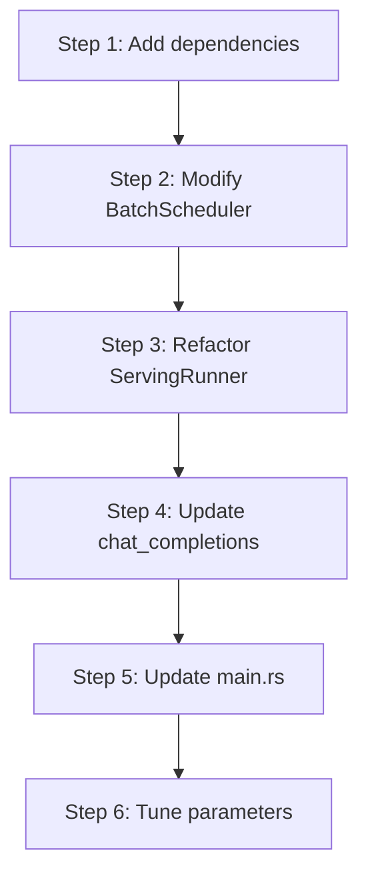

# Scheduling Optimization Configuration Guide

---

## Table of Contents

1. [Configurable Parameters](#1-configurable-parameters)
2. [Tuning Strategies](#2-tuning-strategies)
3. [Migration Path](#3-migration-path)
4. [Code Structure](#4-code-structure)

---

## 1. Configurable Parameters

All parameters are configured via environment variables, read in `ServingConfig::new()`. Values of 0 fall back to defaults.

| Parameter | Env Variable | Default | Suggested Range | Description |
|-----------|-------------|---------|-----------------|-------------|
| `batch_size` | `ELLM_BATCH_SIZE` | 3 | 1-32 | Max concurrent requests (number of batch slots) |
| `sequence_length` | `ELLM_SEQUENCE_LENGTH` | 128 | 64-4096 | Max token sequence length per slot |
| `chunk_size` | `ELLM_CHUNK_SIZE` | 64 | 32-1024 | Max tokens per prefill round; also used as `token_threshold` |
| `schedule_timeout_ms` | `ELLM_SCHEDULE_TIMEOUT_MS` | 10 | 5-50 | Timeout window for triggering scheduling (milliseconds) |

---

## 2. Tuning Strategies

| Scenario | Strategy |
|----------|----------|
| **Low Latency** | Reduce `ELLM_CHUNK_SIZE` to limit tokens per prefill round, improving responsiveness |
| **High Throughput** | Increase `ELLM_CHUNK_SIZE` and `ELLM_BATCH_SIZE` to improve batch efficiency |
| **Long Context** | Increase `ELLM_SEQUENCE_LENGTH`; note memory usage grows linearly |
| **Fluctuating Traffic** | Set smaller `ELLM_SCHEDULE_TIMEOUT_MS` to guarantee scheduling latency under low load |
| **Compute Intensive** | `runner_count` is automatically set to CPU cores minus 2 (async threads) by `determine_thread_config()` |

---

## 3. Migration Path

### 3.1 Backward Compatibility

| Interface | Compatibility | Description |
|-----------|---------------|-------------|
| `BatchScheduler::new()` | Fully compatible | Keep original interface |
| `ServingRunner::start()` | Fully compatible | Keep original interface |
| `chat_completions` | Fully compatible | Internal logic upgrade |

### 3.2 Upgrade Steps



---

## 4. Code Structure

### 4.1 File Directory

```
src/
├── runtime/
│   ├── scheduling/
│   │   ├── mod.rs            # Scheduling submodule entry
│   │   ├── scheduler.rs      # BatchScheduler implementation
│   │   ├── token_counter.rs  # TokenCounter implementation
│   │   ├── types.rs          # SequenceState, Phase, ScheduleTask definitions
│   │   ├── slice_scheduler.rs # SliceScheduler implementation
│   │   ├── sequence_slice.rs # SequenceSlice, DecodeList definitions
│   │   └── initialization.rs # build_batch_sequence, build_sequence_state
│   ├── io/
│   │   ├── mod.rs            # IO submodule entry
│   │   ├── chat_template.rs  # ChatTemplate implementation
│   │   ├── tokenizer_loader.rs # load_tiktoken
│   │   ├── safetensors_loader.rs # SafeTensorsLoader
│   │   └── from_safetensors.rs # FromSafetensors trait
│   ├── batch_sequence.rs     # BatchSequence implementation
│   ├── runner.rs             # ServingRunner implementation
│   └── mod.rs                # Runtime module entry and re-exports
├── serving/
│   ├── mod.rs                # HTTP server entry, routes, API data structures
│   ├── config.rs             # ServingConfig (env variable reading)
│   ├── model.rs              # Model initialization and forward pass wrapper
│   ├── model_setup.rs        # Model loading, parameter extraction, thread config
│   ├── resources.rs          # ServingResources integrated initialization
│   ├── scheduler.rs          # Scheduling component creation (BatchScheduler + TokenCounter)
│   └── chat_handlers.rs      # chat_completions HTTP handler
└── main.rs                   # Tokio Runtime startup
```

---

**Document Version**: v2.0
**Last Updated**: 2026-06-01