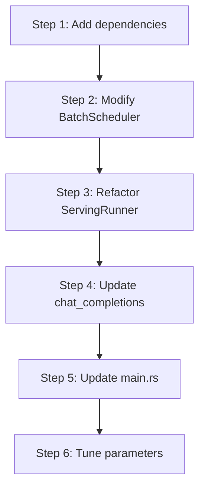

# Scheduling Optimization Configuration Guide

---

## Table of Contents

1. [Configurable Parameters](#1-configurable-parameters)
2. [Tuning Strategies](#2-tuning-strategies)
3. [Migration Path](#3-migration-path)
4. [Code Structure](#4-code-structure)

---

## 1. Configurable Parameters

| Parameter | Default | Suggested Range | Description |
|-----------|---------|-----------------|-------------|
| `chunk_size` | 256 | 64-1024 | Batch chunk size, used as `token_threshold` value |
| `schedule_timeout_ms` | 10 | 5-50 | Timeout duration (milliseconds) |
| `max_batch_size` | 8 | 4-32 | Maximum batch size |
| `runner_count` | CPU cores | 1-CPU cores | Number of Runner tasks |
| `broadcast_capacity` | 64 | 32-256 | Broadcast channel capacity |

---

## 2. Tuning Strategies

| Scenario | Strategy |
|----------|----------|
| **Low Latency** | Reduce `chunk_size` (pass smaller `token_threshold`), improve responsiveness |
| **High Throughput** | Increase `chunk_size` (pass larger `token_threshold`), improve batch efficiency |
| **Fluctuating Traffic** | Set smaller `schedule_timeout_ms` |
| **Compute Intensive** | Set `runner_count` to CPU core count |

---

## 3. Migration Path

### 3.1 Backward Compatibility

| Interface | Compatibility | Description |
|-----------|---------------|-------------|
| `BatchScheduler::new()` | Fully compatible | Keep original interface |
| `ServingRunner::start()` | Fully compatible | Keep original interface |
| `chat_completions` | Fully compatible | Internal logic upgrade |

### 3.2 Upgrade Steps



---

## 4. Code Structure

### 4.1 File Directory

```
src/
├── runtime/
│   ├── scheduling/
│   │   ├── scheduler.rs      # BatchScheduler + TokenCounter
│   │   └── state.rs          # SequenceState definition
│   ├── runner.rs             # ServingRunner (Tokio tasks)
│   └── mod.rs                # Runtime module entry
├── serving/
│   ├── handlers.rs           # chat_completions Handler
│   ├── bootstrap.rs          # AppState initialization
│   └── types.rs              # Request/Response types
└── main.rs                   # Tokio Runtime startup
```

---

**Document Version**: v2.0
**Last Updated**: 2026-06-01