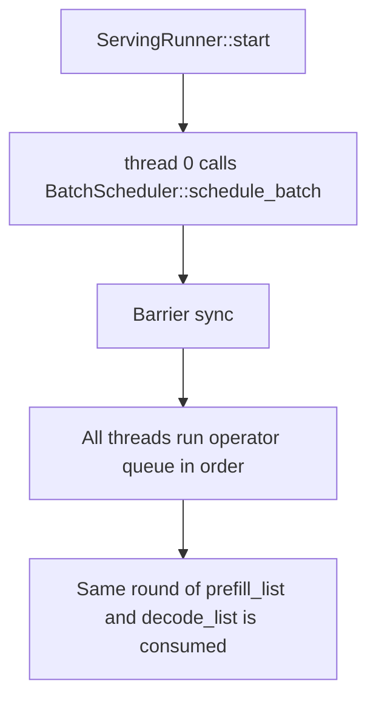
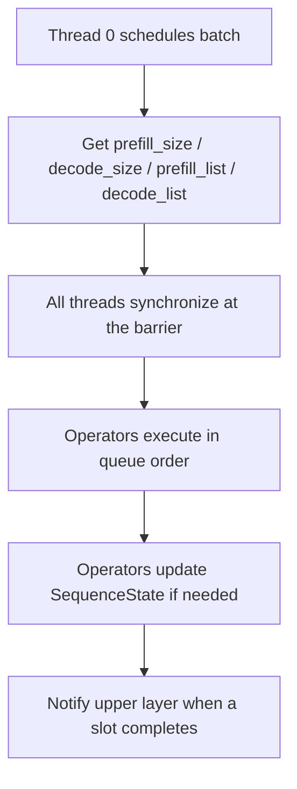

# Runtime Module Overview

---

`src/runtime` is the core runtime module of the inference execution layer. It takes "request input", turns it into "executable token slices", and then hands those slices to the operator queue for parallel execution.

It has three main responsibilities:

* Input preparation: render chat messages into a prompt, then encode it into tokens
* Batch scheduling: generate the current-round slices according to a `Decode`-first rule
* Thread execution: let the thread pool consume the slices and execute the operator queue in order

---

## 1. Module Overview

`src/runtime/mod.rs` exposes the most commonly used runtime entry points:

* `BatchScheduler`: generates `prefill_list` and `decode_list` for each round
* `ServingRunner`: thread-pool executor responsible for scheduling and operator execution
* `Phase` and `SequenceState`: batch slot state

It also contains the following submodules:

* `batch_sequence`: prompt writing and generated-text decoding
* `chat_template`: chat template rendering
* `tokenizer_loader`: loads the tiktoken tokenizer
* `slice_scheduler`: static slice allocation during the prefill stage
* `operator`: passes runtime slices to concrete operators
* `tensor`: runtime tensor and cache implementation

---

## 2. Core State

### `SequenceState`

Each batch slot corresponds to one `SequenceState`. The fields mean:

| Field | Meaning |
| --- | --- |
| `phase` | Current phase, usually one of `Start / Prefill / Decode / Timeout / Eos` |
| `sequence_index` | Current sequence cursor, meaning the start of the next token segment |
| `kv_index` | The tail position of KV or already generated tokens |
| `filling_length` | How many prefill tokens still need to be processed |
| `notify` | The synchronization primitive used to notify the upper layer when the slot completes |

### `Phase`

`Phase` is the state-machine enum. The most common transitions in the current code are:

* `Start -> Prefill`
* `Prefill -> Decode`
* `Decode -> Eos`

---

## 3. Slice Structure

### `SequenceSlice`

The scheduler does not execute directly by batch slot. It executes by `SequenceSlice`.

A slice describes one continuous token segment within a batch slot:

| Field | Meaning |
| --- | --- |
| `batch_index` | Which batch slot it belongs to |
| `sequence_index` | The start of the slice within the sequence |
| `token_start_index` | The start in the flattened token view for the current round |
| `length` | Length of the continuous token segment |
| `last_token_flag` | Whether the last token in this slice should be treated as an output token |

### `DecodeList`

`DecodeList` is essentially a wrapper around `Vec<SequenceSlice>` and provides:

* `push` / `clear`
* `total_token_count`
* `lookup_global_index`
* `walk_global_range`

It carries both the flattened attention slices used in the prefill round and the single-token slices used in the decode round.

---

## 4. Input Preparation

### `ChatTemplate`

`ChatTemplate` loads `chat_template.jinja`, then renders message pairs `[("role", "content")]` into the final prompt.

### `load_tiktoken`

`tokenizer_loader` builds a `tiktoken_rs::CoreBPE` from:

* `tokenizer.json`
* `tokenizer_config.json`

It is used for:

* prompt encoding
* generated-text decoding

### `BatchSequence`

`BatchSequence` writes prompt tokens into the underlying token buffer and decodes the generated tokens back into strings after inference finishes.

It does two straightforward things:

* `write_prompts()`: encode the rendered prompt and write it into the target slot
* `decode_generated_text()`: read and decode the generated result based on `sequence_index` and `kv_index`

---

## 5. Scheduling Pipeline

### Scheduling Entry

`ServingRunner::start()` creates the thread pool and lets thread 0 handle each round of scheduling:



1. Thread 0 calls `BatchScheduler::schedule_batch()`
2. All threads synchronize through a `Barrier`
3. Each thread executes the operator queue in order
4. Every operator uses the same round of `prefill_list` and `decode_list`

### `BatchScheduler`

`BatchScheduler` does only one thing per round: decide whether the current round is `Decode`, `Prefill`, or `Idle`.

The policy is very explicit:

* If the batch contains any `Phase::Decode`, the round becomes a decode round
* Otherwise, if the batch contains any `Phase::Prefill`, the round becomes a prefill round
* Otherwise it goes idle and sleeps briefly before retrying

This is a strict single-round single-mode design. Decode and prefill are never mixed in the same round.

---

## 6. Prefill Splitting

The prefill round is handled jointly by `FairTaskAllocator` and `SliceScheduler`.

### `FairTaskAllocator`

It splits `total_tokens` as evenly as possible across `task_count` task slots:

* The first tasks get `base_quota + 1`
* The remaining tasks get `base_quota`

If `total_tokens < task_count`, only the first few threads receive work.

### `SliceScheduler`

`SliceScheduler` then splits a single sequence into multiple `SequenceSlice`s and distributes them to threads according to static token quotas.

So:

* Long sequences may span multiple threads
* Token assignment is static
* There is no runtime stealing

---

## 7. State Update Boundaries

This is one of the easiest points to confuse in runtime.

`BatchScheduler` only plans slices; it does not advance `SequenceState` directly.

Actual state updates happen elsewhere:

* In `serving/handlers.rs`, writing the prompt switches the slot to `Phase::Prefill`
* In `operators/softmax/topk_softmax.rs`, prefill-slice consumption and final token emission advance `sequence_index`, `kv_index`, and `filling_length`, and switch the phase to `Decode` or `Eos` when needed

In other words, runtime is responsible for "generating the work units for the round," not for maintaining the full state machine by itself.

---

## 8. One-Round Execution Overview

You can think of one runtime round like this:



```text
thread 0:
    schedule the batch, get prefill_size / decode_size / prefill_list / decode_list

all threads:
    synchronize at the barrier
    execute the operator queue in order
    complete the computation using the same round of slices

operator stage:
    update SequenceState according to slice and Phase
    write back output tokens when necessary
    notify the upper layer at the end
```

---

## 9. File Index

* `src/runtime/mod.rs`
* `src/runtime/batch_sequence.rs`
* `src/runtime/chat_template.rs`
* `src/runtime/operator.rs`
* `src/runtime/runner.rs`
* `src/runtime/scheduler.rs`
* `src/runtime/slice_scheduler.rs`
* `src/runtime/tokenizer_loader.rs`
