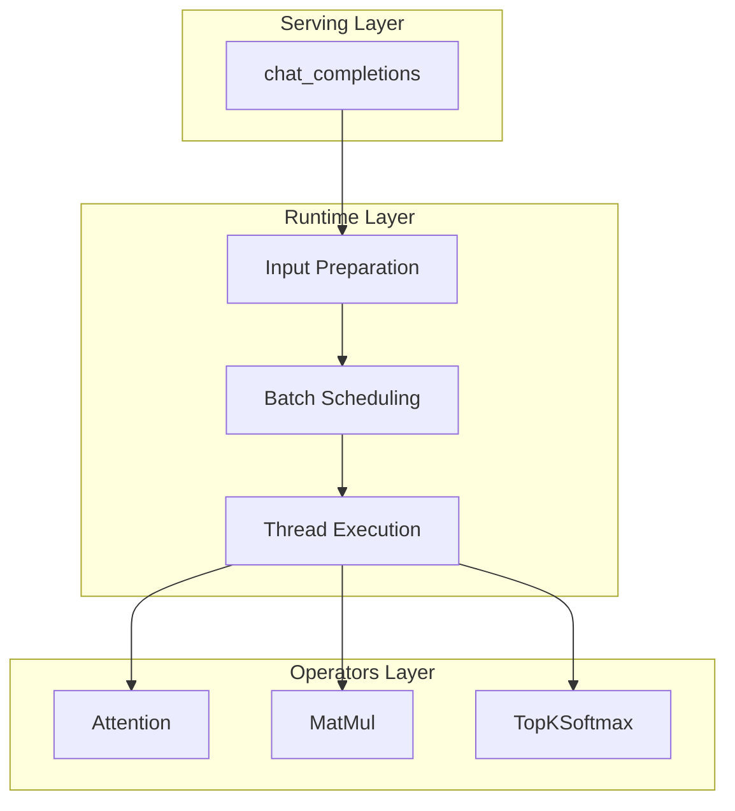
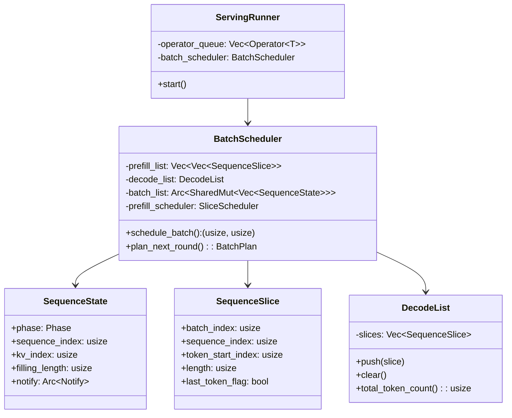
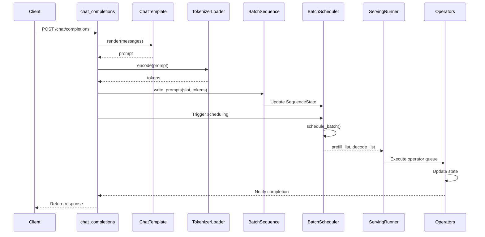
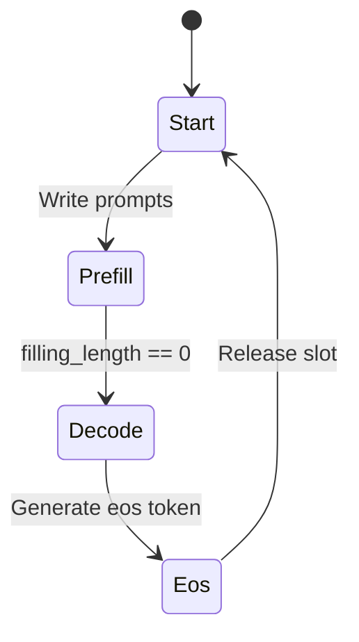

# Runtime Module Overview

---

## Table of Contents

1. [Module定位](#1-模块定位)
2. [Architecture Layers](#2-architecture-layers)
3. [Core Components](#3-core-components)
4. [Data Flow](#4-data-flow)
5. [File Structure](#5-file-structure)

---

## 1. Module定位

`src/runtime` is the core runtime module of the eLLM inference execution layer. It transforms user requests into executable computation tasks and coordinates multi-threaded execution.

**Core Responsibilities**:
- **Input Preparation**: Render chat messages to prompts, encode to tokens
- **Batch Scheduling**: Generate current-round computation slices by priority rules
- **Thread Execution**: Manage thread pool to execute operator queues in parallel

---

## 2. Architecture Layers



| Layer | Responsibility | Key Components |
|-------|---------------|----------------|
| **Input Preparation** | Prompt rendering & token encoding | ChatTemplate, BatchSequence, TokenizerLoader |
| **Batch Scheduling** | Slice generation & task distribution | BatchScheduler, SliceScheduler |
| **Thread Execution** | Operator queue parallel execution | ServingRunner |

---

## 3. Core Components

### 3.1 Component Relationships



### 3.2 Component Overview

| Component | Responsibility | File Location |
|-----------|---------------|---------------|
| `BatchScheduler` | Generate prefill/decode slices | `scheduling/scheduler.rs` |
| `SliceScheduler` | Static allocation for prefill slices | `scheduling/slice_scheduler.rs` |
| `ServingRunner` | Thread pool executor | `runner.rs` |
| `SequenceState` | Batch slot state | `scheduling/state.rs` |
| `SequenceSlice` | Minimal computation unit | `scheduling/sequence_slice.rs` |
| `BatchSequence` | Prompt writing & result decoding | `batch_sequence.rs` |
| `ChatTemplate` | Chat template rendering | `chat_template.rs` |
| `TokenizerLoader` | Tokenizer loading | `tokenizer_loader.rs` |

---

## 4. Data Flow

### 4.1 Request to Execution Flow



### 4.2 State Transition



---

## 5. File Structure

```
src/runtime/
├── scheduling/
│   ├── scheduler.rs          # BatchScheduler implementation
│   ├── slice_scheduler.rs    # SliceScheduler implementation
│   ├── state.rs              # SequenceState, Phase definitions
│   └── sequence_slice.rs     # SequenceSlice, DecodeList definitions
├── batch_sequence.rs         # BatchSequence implementation
├── chat_template.rs          # ChatTemplate implementation
├── tokenizer_loader.rs       # Tokenizer loading
├── operator.rs               # Operator trait
├── runner.rs                 # ServingRunner implementation
└── mod.rs                    # Module exports
```

---

**Document Version**: v3.0
**Last Updated**: 2026-06-01