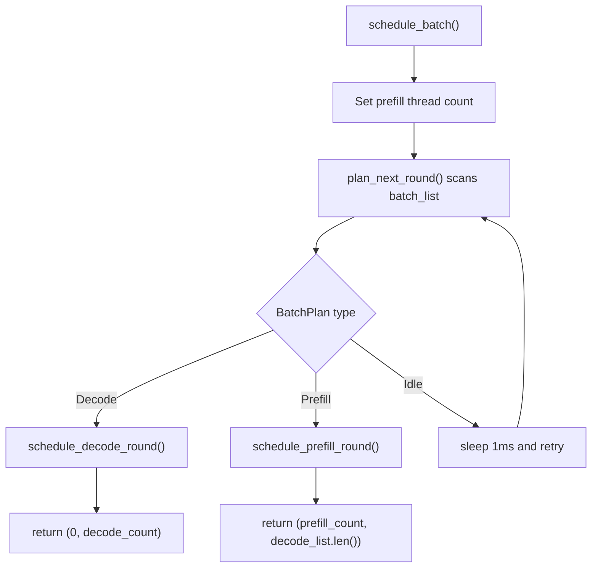
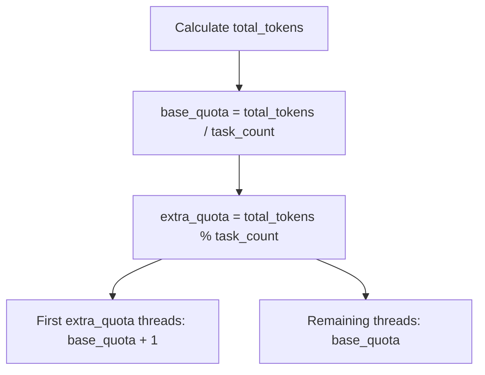
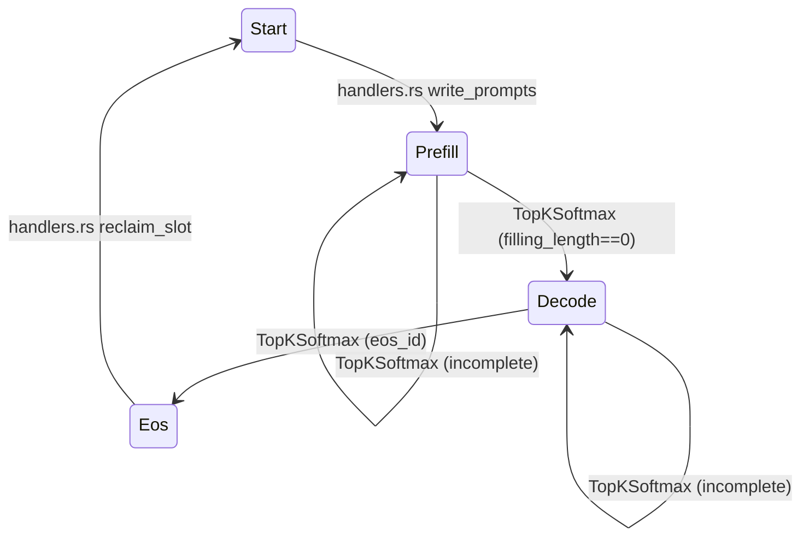
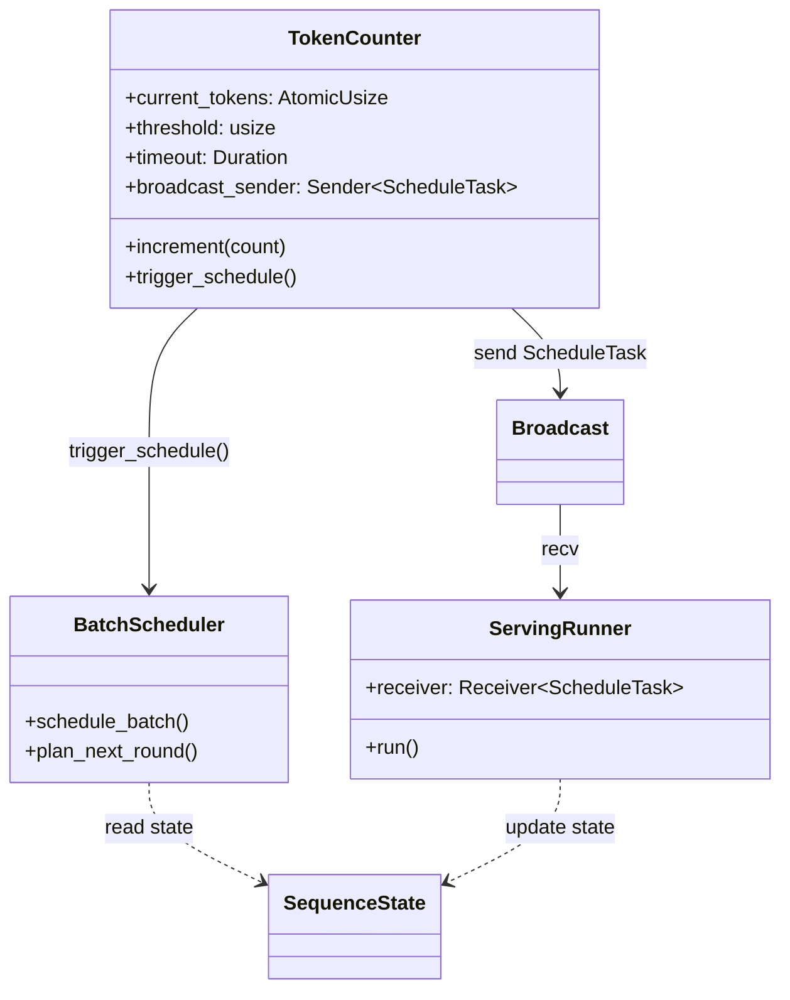
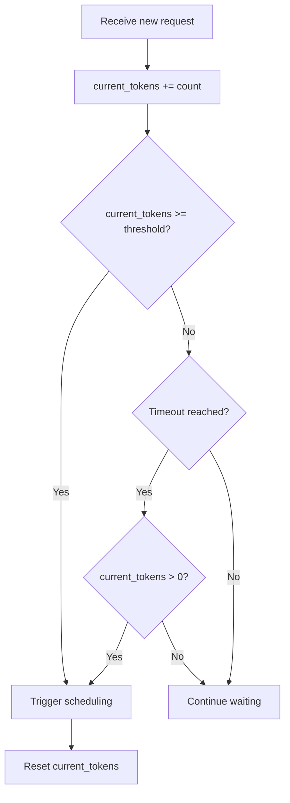
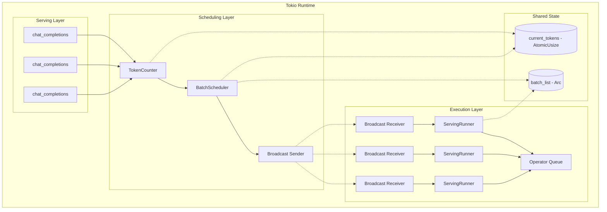
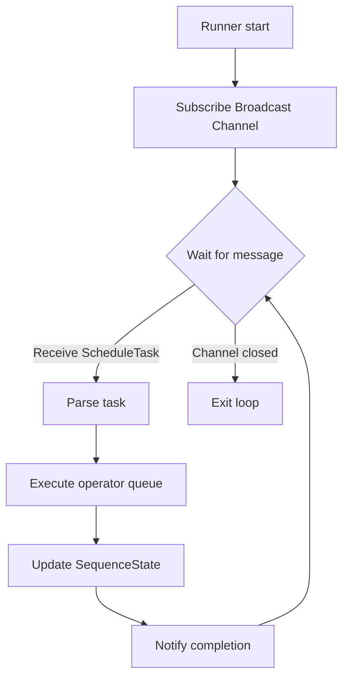
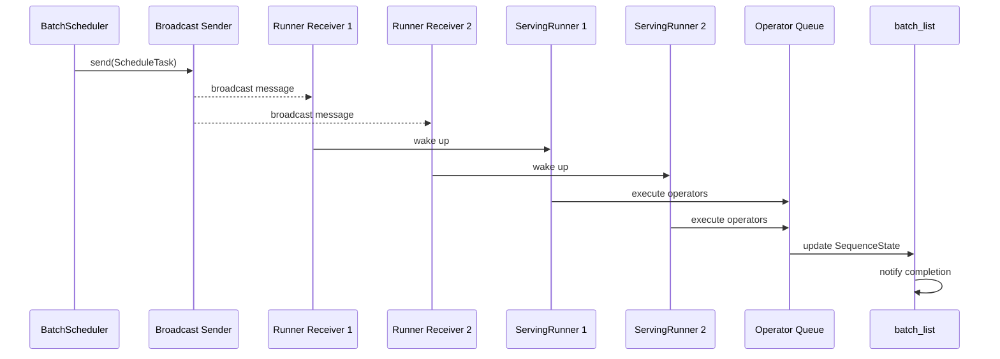
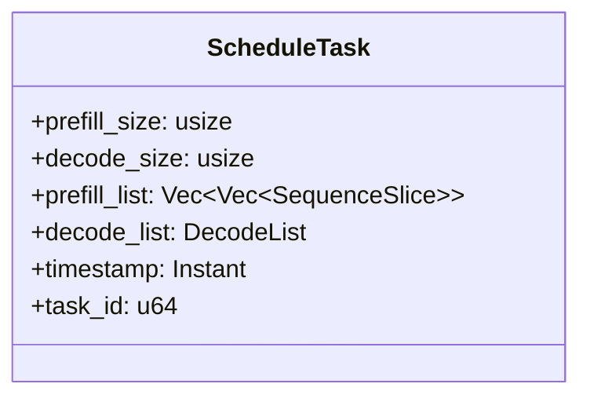

# Scheduler Design Details

---

## Table of Contents

**Basic Scheduling**

1. [Scheduler Overview](#1-scheduler-overview)
2. [Core Data Structures](#2-core-data-structures)
3. [Scheduling Flow](#3-scheduling-flow)
4. [Decode Round Scheduling](#4-decode-round-scheduling)
5. [Prefill Round Scheduling](#5-prefill-round-scheduling)
6. [State Update Boundaries](#6-state-update-boundaries)

**Optimized Scheduling**

7. [Event-Driven Triggering](#7-event-driven-triggering)
8. [Dual Trigger Mechanism](#8-dual-trigger-mechanism)
9. [Tokio Async Architecture](#9-tokio-async-architecture)
10. [Broadcast Task Distribution](#10-broadcast-task-distribution)

---

## 1. Scheduler Overview

`BatchScheduler` is the core scheduling component of the eLLM inference engine. It decides the execution mode and slice allocation for each round.

**Core Responsibilities**:
- Scan all sequence states in `batch_list`
- Decide whether the current round executes `Decode`, `Prefill`, or `Idle`
- Generate corresponding `SequenceSlice` lists for operator execution

**Scheduling Priority**:
1. **Decode First**: If any `Phase::Decode` sequences exist, execute Decode round
2. **Prefill Second**: If no Decode, execute Prefill round
3. **Idle Fallback**: If no pending sequences, enter idle state

---

## 2. Core Data Structures

### 2.1 Scheduling-Related States

| Data Structure | Purpose | Key Fields |
|----------------|---------|------------|
| `SequenceState` | Describes single batch slot state | `phase`, `sequence_index`, `kv_index`, `filling_length` |
| `SequenceSlice` | Minimal computation unit | `batch_index`, `sequence_index`, `token_start_index`, `length`, `last_token_flag` |
| `DecodeList` | Decode/Attention slice container | `push`, `clear`, `total_token_count` |
| `BatchPlan` | Scheduling plan enum | `Decode`, `Prefill`, `Idle` |

### 2.2 SequenceState Fields

| Field | Type | Purpose |
|-------|------|---------|
| `phase` | `Phase` | Current phase: `Start`/`Prefill`/`Decode`/`Eos`/`Timeout` |
| `sequence_index` | `usize` | Current sequence cursor, prefill start |
| `kv_index` | `usize` | KV cache position, next write position |
| `filling_length` | `usize` | Remaining prefill tokens to process |
| `notify` | `Arc<Notify>` | Completion notification sync primitive |

### 2.3 SequenceSlice Fields

| Field | Type | Purpose |
|-------|------|---------|
| `batch_index` | `usize` | Batch slot index |
| `sequence_index` | `usize` | Start position within sequence |
| `token_start_index` | `usize` | Start in flattened token view for this round |
| `length` | `usize` | Continuous token length |
| `last_token_flag` | `bool` | Whether this is the prompt's last token |

---

## 3. Scheduling Flow

### 3.1 Scheduling Entry



### 3.2 Plan Generation Logic

```text
plan_next_round() flow:
1. Traverse batch_list to collect candidates
2. Decode exists -> return BatchPlan::Decode
3. Prefill exists -> return BatchPlan::Prefill
4. Otherwise return BatchPlan::Idle
```

---

## 4. Decode Round Scheduling

### 4.1 Decode Round Characteristics

| Characteristic | Description |
|----------------|-------------|
| **Candidate Selection** | All `Phase::Decode` sequences |
| **Count Limit** | At most `max_decode_size` (equals `batch_size`) |
| **Slice Length** | Fixed at 1 |
| **prefill_list** | Cleared |

### 4.2 Slice Generation

```text
for (batch_index, sequence_index) in decode_candidates:
    DecodeList.push(SequenceSlice {
        batch_index,
        sequence_index,
        token_start_index: decode_count,
        length: 1,
        last_token_flag: true,
    })
    decode_count += 1
```

---

## 5. Prefill Round Scheduling

### 5.1 Prefill Round Characteristics

| Characteristic | Description |
|----------------|-------------|
| **Candidate Selection** | All `Phase::Prefill` sequences |
| **Count Limit** | Total tokens not exceeding `max_prefill_size` |
| **Slice Length** | Variable, depends on quota |
| **Output** | Generate both `prefill_list` and `decode_list` |

### 5.2 Total Token Calculation

```text
max_prefill_size = sequence_length * batch_size
total_tokens = min(sum(filling_length), max_prefill_size)
```

### 5.3 Thread Quota Allocation



### 5.4 Slice Allocation Example

Assuming `total_tokens=23`, `task_count=3`:

| Thread | Quota | Actual Allocation |
|--------|-------|-------------------|
| Thread 0 | 8 | tokens 0-7 |
| Thread 1 | 8 | tokens 8-15 |
| Thread 2 | 7 | tokens 16-22 |

---

## 6. State Update Boundaries

### 6.1 Scheduler Does Not Update State

`BatchScheduler` only generates slices, does not modify `SequenceState`. State updates occur at:

| Phase | Location | Update Content |
|-------|----------|-----------------|
| **Write Prompt** | `handlers.rs` | Set `phase=Prefill`, `filling_length` |
| **Prefill Execution** | `TopKSoftmax` | Advance `sequence_index`, `kv_index`, `filling_length` |
| **Switch to Decode** | `TopKSoftmax` | Set `phase=Decode` when `filling_length==0` |
| **Generation Complete** | `TopKSoftmax` | Set `phase=Eos` when `eos_id` encountered |

### 6.2 State Transition Diagram



---

## 7. Event-Driven Triggering

### 7.1 Problems with Original Polling Mode

| Problem | Impact | Severity |
|---------|--------|----------|
| Polling mode (wake every 1ms) | CPU waste, uncertain latency | High |
| Cannot aggregate requests | Low batch efficiency | Medium |
| Blocking wait | Poor responsiveness | Medium |

### 7.2 Event-Driven Design Principles

| Principle | Description |
|-----------|-------------|
| **Async First** | Use Tokio async management, avoid blocking threads |
| **Event-Driven** | Trigger scheduling via token threshold and time window, not polling |
| **One-to-Many Push** | Use Broadcast to synchronously push tasks to multiple Runners |
| **Lock-Free Counting** | Use atomic operations for lock-free concurrent counting |

### 7.3 Optimized Component Relationships



---

## 8. Dual Trigger Mechanism

### 8.1 Trigger Methods

Combine threshold triggering and time window to avoid limitations of single triggering.

| Trigger Method | Condition | Applicable Scenario |
|----------------|-----------|---------------------|
| **Threshold Trigger** | `current_tokens >= token_threshold` | Timely scheduling under high traffic |
| **Timeout Trigger** | Time window expired AND `current_tokens > 0` | Guarantee latency under low traffic |

### 8.2 Trigger Decision Flow



### 8.3 TokenCounter Design

**Field Design**:

| Field | Type | Purpose |
|-------|------|---------|
| `current_tokens` | `AtomicUsize` | Atomic counter, lock-free concurrent writes |
| `threshold` | `usize` | Scheduling trigger threshold (value from chunk_size) |
| `timeout` | `Duration` | Timeout time window |
| `last_schedule_time` | `tokio::time::Instant` | Last scheduling time |
| `broadcast_sender` | `Sender<ScheduleTask>` | Broadcast sender |

**API Design**:

| Method | Function | Parameters | Return |
|--------|----------|------------|--------|
| `new(threshold, timeout, sender)` | Constructor | threshold=chunk_size, timeout, sender | `TokenCounter` |
| `increment(count)` | Increment counter | token count | `bool` (whether to trigger) |
| `reset()` | Reset counter | None | `()` |
| `get()` | Get current value | None | `usize` |
| `trigger_schedule()` | Trigger scheduling | None | `()` |

### 8.4 Tokio Timeout Window Implementation

```rust
impl TokenCounter {
    pub async fn run(&self) {
        let mut interval = tokio::time::interval(self.timeout);
        loop {
            tokio::select! {
                _ = interval.tick() => {
                    if self.current_tokens.load(Ordering::Relaxed) > 0 {
                        self.trigger_schedule().await;
                    }
                }
            }
        }
    }
}
```

**Key Points**:

| Point | Description |
|-------|-------------|
| `tokio::time::interval` | Create Tokio timer, non-blocking async wait |
| `interval.tick()` | Trigger on each timeout |
| `current_tokens > 0` | Ensure there are pending requests in the time window before scheduling |
| `trigger_schedule()` | Trigger scheduling and reset counter |

---

## 9. Tokio Async Architecture

### 9.1 Overall Architecture



### 9.2 Thread Division

| Layer | Thread Type | Count | Description |
|-------|-------------|-------|-------------|
| Serving | HTTP Workers | Multiple | Concurrent request processing |
| Scheduling | Tokio Task | 1 | TokenCounter async execution |
| Execution | Tokio Tasks | CPU cores | Runner parallel execution |

### 9.3 ServingRunner Execution Flow



---

## 10. Broadcast Task Distribution

### 10.1 Data Flow



### 10.2 ScheduleTask Structure



### 10.3 Concurrency Safety Mechanisms

| Resource | Protection Mechanism | Description |
|----------|----------------------|-------------|
| `current_tokens` | `AtomicUsize` | Lock-free atomic operation |
| `batch_list` | `Arc<SharedMut>` | Shared mutable state |
| Slot allocation | `Semaphore + Mutex<VecDeque>` | Prevent duplicate allocation |
| Task broadcast | `tokio::sync::broadcast` | One-to-many reliable push |
| Runner sync | `tokio::sync::Barrier` | Multi-task synchronization |

---

**Document Version**: v3.0
**Last Updated**: 2026-06-01